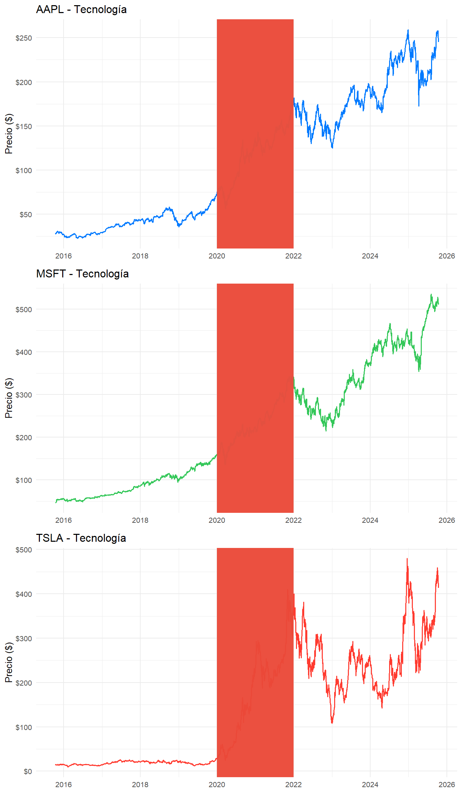
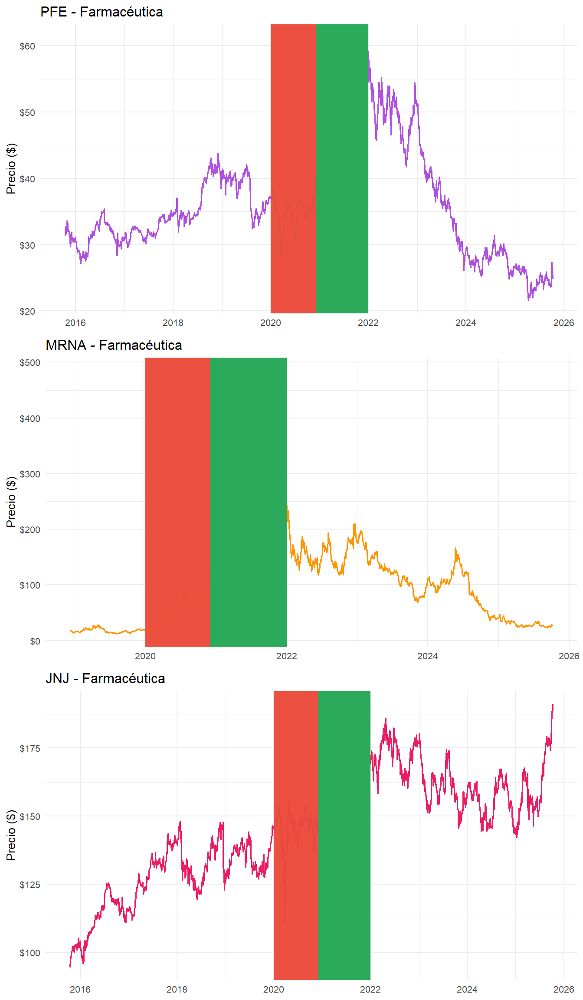
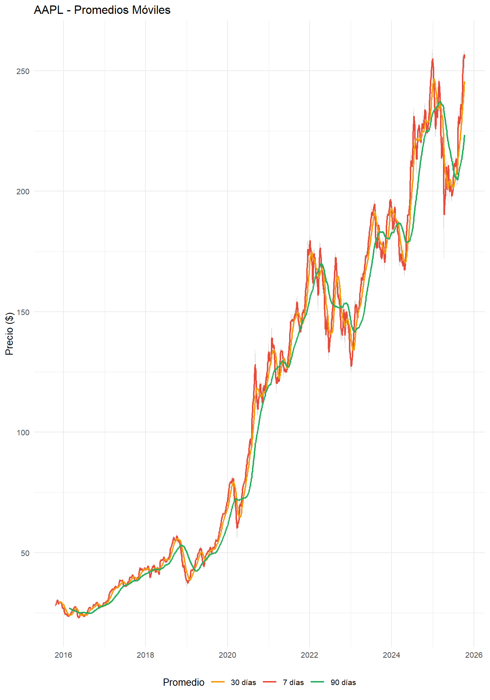
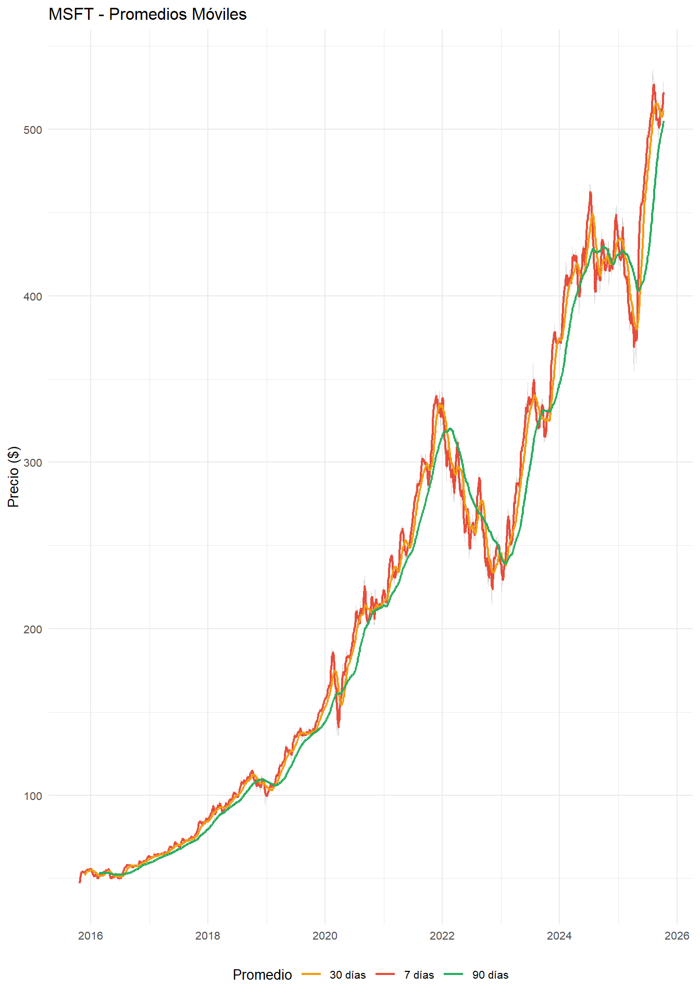
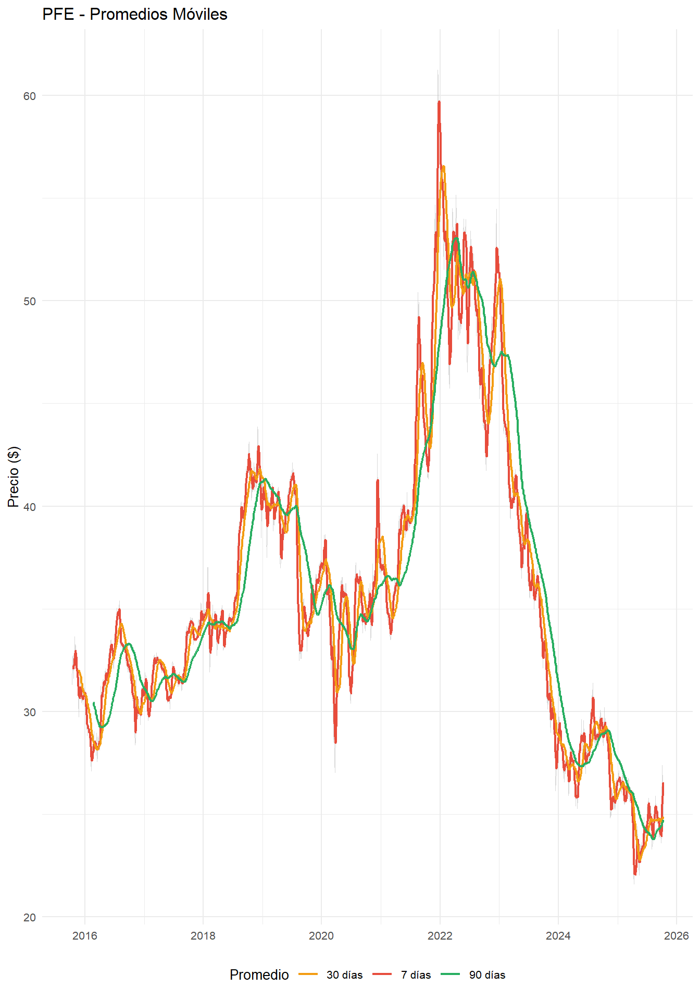
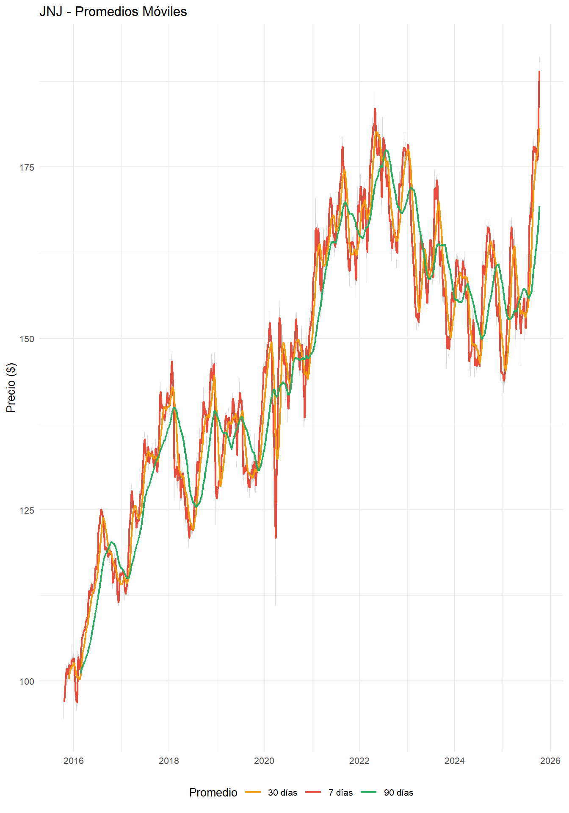
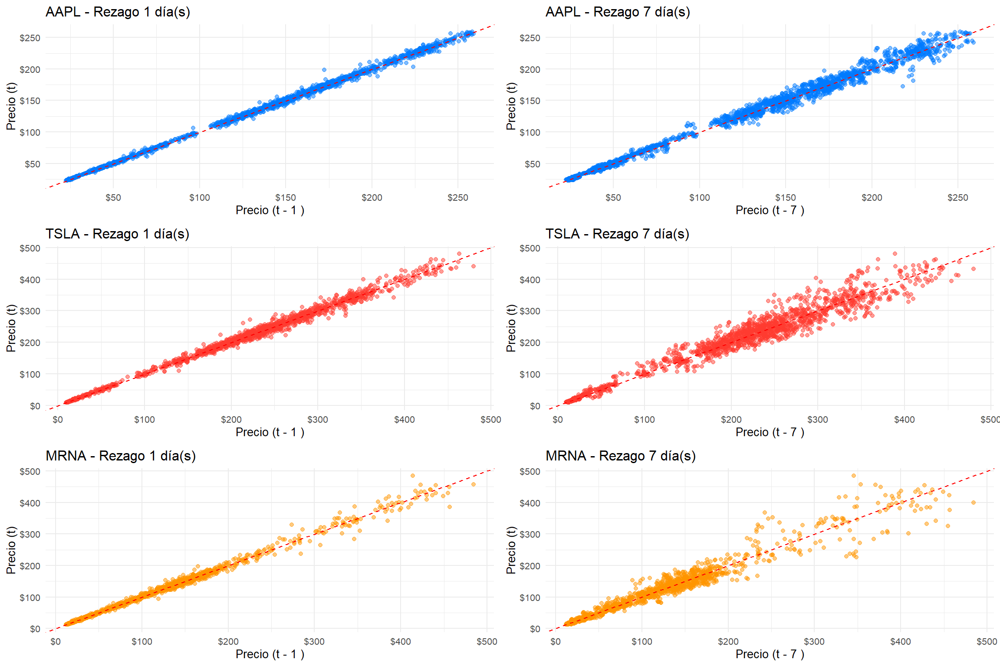

## Visualización de las Series de Tiempo  {#intro}

Las visualizaciones tienen como objetivo explorar y comunicar los patrones, tendencias y comportamientos presentes en las series de tiempo de precios de acciones durante el período 2015-2025, con énfasis en el impacto del COVID-19.


## Series de Tiempo Completas

Los siguientes gráficos proporcionan una visión general de la evolución de los precios de cada activo a lo largo del período 2015-2025.

### Sector Tecnológico

<div class="figure">

<p class="caption">(\#fig:series-tech)Series de tiempo del sector tecnológico. Se observa el crecimiento explosivo de Tesla post-2019, la estabilidad relativa de Apple y Microsoft, y el impacto del COVID-19 (área sombreada) en las tres empresas.</p>
</div>

**Observaciones clave del sector tecnológico:**

- **Apple (AAPL):** Muestra un crecimiento sostenido de $22.58 a $259.02 (+778%), con volatilidad moderada (29.2% anual). Durante el COVID-19, experimentó una caída breve seguida de recuperación acelerada.

- **Microsoft (MSFT):** Presenta el comportamiento más estable del sector con crecimiento constante de $46.68 a $535.64 (+990%). La volatilidad de 27% anual es la más baja del sector tecnológico. Mínima afectación durante el crash de marzo 2020.

- **Tesla (TSLA):** Exhibe el comportamiento más volátil (59.3% anual) y el mayor retorno (+2,729%). Se observa crecimiento casi exponencial desde 2019, con alta sensibilidad a eventos de mercado.

### Sector Farmacéutico

<div class="figure">

<p class="caption">(\#fig:series-pharma)Series de tiempo del sector farmacéutico. Destaca el pico dramático de Moderna durante el período de vacunas (2020-2021), mientras que Pfizer y J&J muestran comportamientos más estables.</p>
</div>

**Observaciones clave del sector farmacéutico:**

- **Pfizer (PFE):** Comportamiento estable con retorno negativo (-20.8%). Volatilidad moderada (24% anual). Pico durante el anuncio y distribución de vacunas, seguido de corrección.

- **Moderna (MRNA):** La mayor volatilidad del dataset (72.1% anual). Crecimiento explosivo durante el desarrollo de vacunas (diciembre 2020), alcanzando $484.47 desde $12.26. Posterior corrección drástica reflejando la normalización post-pandemia.

- **Johnson & Johnson (JNJ):** La menor volatilidad de todo el dataset (18.4% anual). Comportamiento defensivo con retorno total de +99.8%. Mínima afectación durante COVID-19.

## Análisis con Promedios Móviles

Los promedios móviles permiten suavizar la volatilidad diaria y visualizar tendencias subyacentes. Se calculan promedios de 7, 30 y 90 días.


### Promedios Móviles - Tecnología


```
## Warning: Removed 6 rows containing missing values or values outside the scale range
## (`geom_line()`).
```

```
## Warning: Removed 29 rows containing missing values or values outside the scale range
## (`geom_line()`).
```

```
## Warning: Removed 89 rows containing missing values or values outside the scale range
## (`geom_line()`).
```

<div class="figure">

<p class="caption">(\#fig:sma-tech-1)Series con promedios móviles del sector tecnológico. Las líneas suavizadas (SMA 7, 30, 90 días) revelan las tendencias subyacentes y confirman el crecimiento sostenido post-COVID.</p>
</div>

```
## Warning: Removed 6 rows containing missing values or values outside the scale range
## (`geom_line()`).
```

```
## Warning: Removed 29 rows containing missing values or values outside the scale range
## (`geom_line()`).
```

```
## Warning: Removed 89 rows containing missing values or values outside the scale range
## (`geom_line()`).
```

<div class="figure">

<p class="caption">(\#fig:sma-tech-2)Series con promedios móviles del sector tecnológico. Las líneas suavizadas (SMA 7, 30, 90 días) revelan las tendencias subyacentes y confirman el crecimiento sostenido post-COVID.</p>
</div>

```
## Warning: Removed 6 rows containing missing values or values outside the scale range
## (`geom_line()`).
```

```
## Warning: Removed 29 rows containing missing values or values outside the scale range
## (`geom_line()`).
```

```
## Warning: Removed 89 rows containing missing values or values outside the scale range
## (`geom_line()`).
```

<div class="figure">

<p class="caption">(\#fig:sma-tech-3)Series con promedios móviles del sector tecnológico. Las líneas suavizadas (SMA 7, 30, 90 días) revelan las tendencias subyacentes y confirman el crecimiento sostenido post-COVID.</p>
</div>

**Interpretación de promedios móviles:**

- **SMA 7 días:** Reacciona rápidamente a cambios, útil para identificar reversiones de corto plazo.
- **SMA 30 días:** Revela tendencias de mediano plazo, filtrando ruido diario.
- **SMA 90 días:** Muestra la tendencia de largo plazo, especialmente útil para identificar cambios de régimen durante COVID-19.

### Promedios Móviles - Farmacéuticas


```
## Warning: Removed 6 rows containing missing values or values outside the scale range
## (`geom_line()`).
```

```
## Warning: Removed 29 rows containing missing values or values outside the scale range
## (`geom_line()`).
```

```
## Warning: Removed 89 rows containing missing values or values outside the scale range
## (`geom_line()`).
```

<div class="figure">

<p class="caption">(\#fig:sma-pharma-1)Series con promedios móviles del sector farmacéutico. El caso de Moderna es particularmente interesante, mostrando cómo los promedios capturan el ciclo completo de auge y corrección.</p>
</div>

```
## Warning: Removed 6 rows containing missing values or values outside the scale range
## (`geom_line()`).
```

```
## Warning: Removed 29 rows containing missing values or values outside the scale range
## (`geom_line()`).
```

```
## Warning: Removed 89 rows containing missing values or values outside the scale range
## (`geom_line()`).
```

<div class="figure">

<p class="caption">(\#fig:sma-pharma-2)Series con promedios móviles del sector farmacéutico. El caso de Moderna es particularmente interesante, mostrando cómo los promedios capturan el ciclo completo de auge y corrección.</p>
</div>

```
## Warning: Removed 6 rows containing missing values or values outside the scale range
## (`geom_line()`).
```

```
## Warning: Removed 29 rows containing missing values or values outside the scale range
## (`geom_line()`).
```

```
## Warning: Removed 89 rows containing missing values or values outside the scale range
## (`geom_line()`).
```

<div class="figure">

<p class="caption">(\#fig:sma-pharma-3)Series con promedios móviles del sector farmacéutico. El caso de Moderna es particularmente interesante, mostrando cómo los promedios capturan el ciclo completo de auge y corrección.</p>
</div>

## Análisis de Rezagos

Los gráficos de rezago permiten identificar dependencia temporal en las series, evaluando si el precio de hoy está correlacionado con el precio de días anteriores.


```
## Warning: Removed 1 row containing missing values or values outside the scale range
## (`geom_point()`).
```

```
## Warning: Removed 7 rows containing missing values or values outside the scale range
## (`geom_point()`).
```

```
## Warning: Removed 1 row containing missing values or values outside the scale range
## (`geom_point()`).
```

```
## Warning: Removed 7 rows containing missing values or values outside the scale range
## (`geom_point()`).
```

```
## Warning: Removed 1 row containing missing values or values outside the scale range
## (`geom_point()`).
```

```
## Warning: Removed 7 rows containing missing values or values outside the scale range
## (`geom_point()`).
```

<div class="figure">

<p class="caption">(\#fig:lag-plots)Gráficos de rezago para lag 1 y lag 7 días. La concentración de puntos en la diagonal sugiere autocorrelación positiva, especialmente en lag 1.</p>
</div>

**Interpretación de rezagos:**

- **Lag 1 (día anterior):** La mayoría de los puntos se concentran cerca de la diagonal, indicando autocorrelación positiva débil. Los precios tienden a persistir de un día al siguiente, especialmente en niveles bajos y altos.

- **Lag 7 (semana anterior):** Mayor dispersión que lag 1, sugiriendo autocorrelación semanal muy débil. Las ventas de un día específico no predicen confiablemente el mismo día de la semana siguiente, excepto en valores extremos.

- **Observación sectorial:** Tesla y Moderna muestran mayor dispersión debido a su alta volatilidad, mientras que activos más estables como J&J presentan patrones más concentrados.

## Estacionalidad Anual

El análisis de estacionalidad revela patrones recurrentes a lo largo del año calendario, particularmente relevantes durante el período COVID-19.

<div class="figure">

<p class="caption">(\#fig:estacionalidad)Patrón de precios mensuales por año. Se identifica claramente el impacto COVID en marzo 2020 y la recuperación diferenciada por sector.</p>
</div>

**Patrones estacionales identificados:**

- **Marzo 2020:** Caída drástica en todos los activos coincidiendo con el crash COVID-19.

- **Noviembre-Diciembre:** Tradicionalmente meses fuertes para mercados financieros, patrón que se mantiene excepto durante 2020.

- **Primer trimestre:** Generalmente muestra precios más bajos, con recuperación hacia mediados de año. Patrón interrumpido en 2020 por el COVID.

- **Diferencias sectoriales:** El sector tecnológico muestra recuperación más rápida post-marzo 2020, mientras farmacéuticas tienen pico en el período de vacunas (Q4 2020 - Q1 2021).

## Síntesis de Visualización

Las visualizaciones revelan hallazgos clave que serán profundizados en capítulos posteriores:

1. **Impacto COVID-19:** Claro quiebre estructural en marzo 2020 visible en todas las series.

2. **Divergencia sectorial:** Tecnología muestra recuperación en "V", mientras farmacéuticas tienen comportamiento más heterogéneo.

3. **Volatilidad variable:** Moderna (72%) vs J&J (18%) ejemplifican el rango de comportamientos dentro del mismo sector.

4. **Autocorrelación limitada:** Los rezagos sugieren dependencia débil, indicando que modelos simples de persistencia no serán suficientes.

5. **Estacionalidad interrumpida:** El COVID-19 alteró patrones estacionales tradicionales, creando un nuevo régimen de mercado.

Estos patrones motivan el análisis formal de series de tiempo en los capítulos siguientes.

