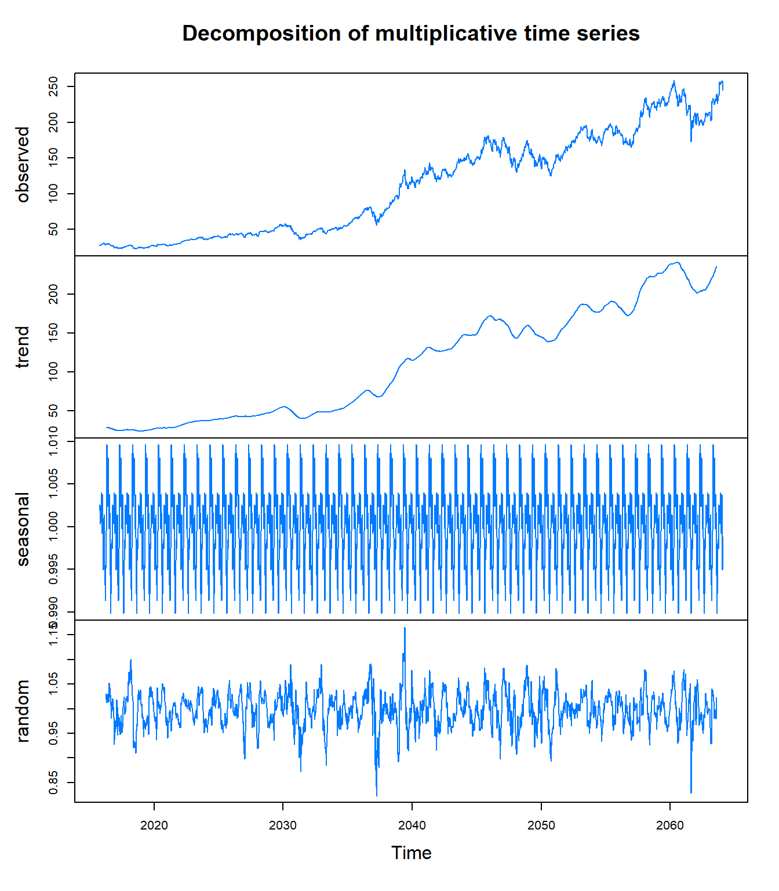
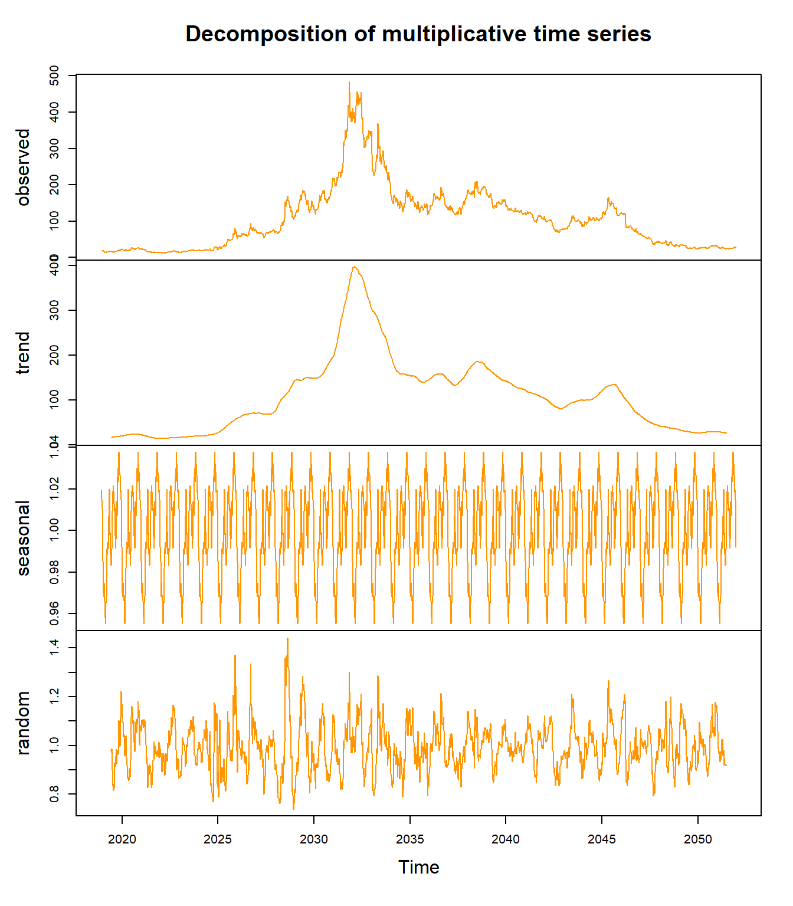
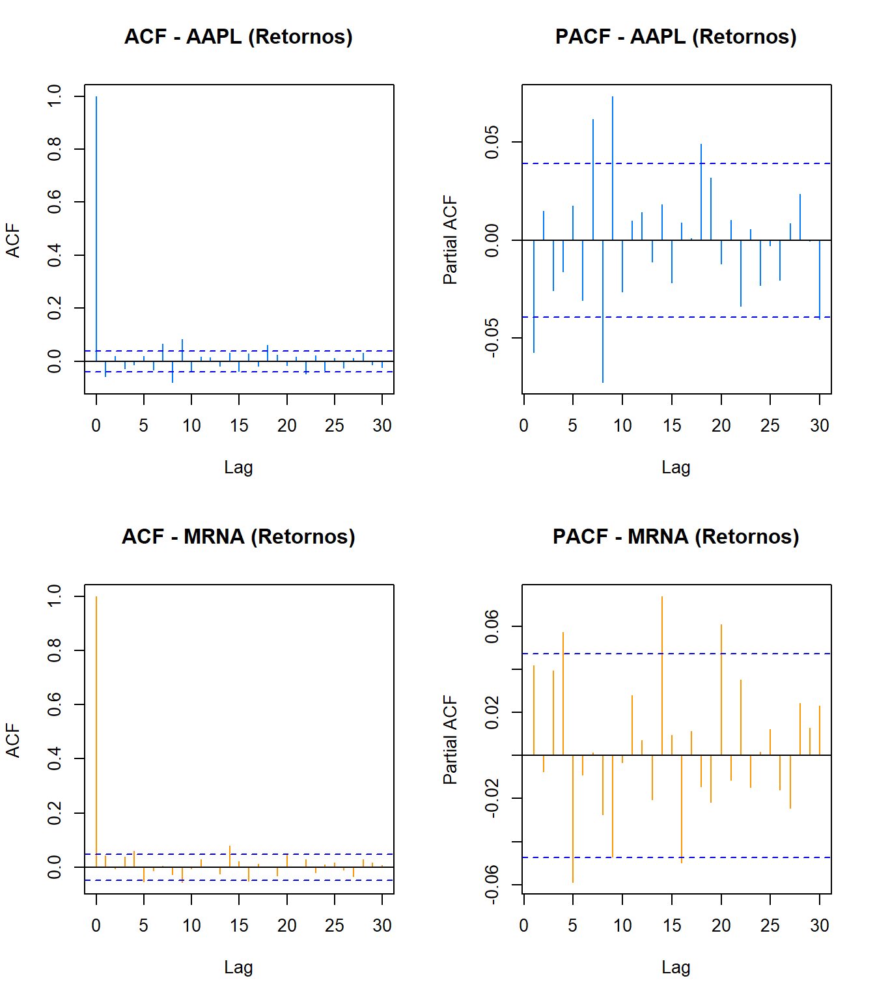

# Descomposición y Estacionariedad {#literature}

En este capítulo analizamos las propiedades estructurales de las series de tiempo de precios de acciones, evaluando la presencia de tendencia, estacionalidad y estacionariedad. Una serie de tiempo financiera se puede descomponer en tres componentes: **tendencia** (movimiento de largo plazo), **estacionalidad** (patrones recurrentes) y **componente irregular** (fluctuaciones aleatorias). Para series de precios de acciones, esperamos tendencias fuertes, estacionalidad débil o ausente, y alta componente irregular debido a la naturaleza ruidosa de los mercados financieros. Este análisis es necesario porque las series financieras típicamente no son estacionarias debido a tendencias de largo plazo, cambios de volatilidad y quiebres estructurales como el COVID-19, lo que genera regresiones espurias y pronósticos poco confiables si no aplicamos transformaciones apropiadas. Dado que tenemos 6 series con comportamientos muy diferentes, seleccionaremos casos representativos de cada sector para análisis detallado: **Apple (AAPL)** como el activo más estable del sector tecnológico, y **Moderna (MRNA)** como el más volátil del sector farmacéutico con quiebre estructural claro, para luego comparar hallazgos entre todos los activos.


## Descomposición de Series de Tiempo

### Apple (AAPL) - Sector Tecnología

<div class="figure">

<p class="caption">(\#fig:descomp-aapl)Descomposición multiplicativa de Apple (AAPL). La tendencia alcista es dominante, con componente estacional débil y residuos relativamente pequeños en períodos estables.</p>
</div>

**Interpretación - Apple (AAPL):**

1. **Serie Observada:** Crecimiento sostenido de \$22.58 a \$259.02, con caída pronunciada en marzo 2020 (COVID-19) seguida de recuperación en "V".

2. **Tendencia:** Claramente alcista con tres fases:
   - 2015-2019: Crecimiento moderado y constante
   - 2020: Disrupción por COVID-19 (quiebre estructural)
   - 2021-2025: Aceleración del crecimiento

3. **Estacionalidad:** Componente estacional débil (oscilaciones ~±2-3% alrededor de 1.0 en modelo multiplicativo), indicando que los patrones mensuales/semanales no son fuertes predictores.

4. **Residuos (Irregular):** Relativamente pequeños en períodos normales, pero con picos pronunciados durante eventos extremos (COVID-19, anuncios corporativos).

**Conclusión - AAPL:** La tendencia domina el comportamiento. La estacionalidad es prácticamente despreciable, confirmando que los precios accionarios son principalmente impulsados por tendencias de largo plazo y eventos específicos, no por patrones recurrentes predecibles.

### Moderna (MRNA) - Sector Farmacéutico

<div class="figure">

<p class="caption">(\#fig:descomp-mrna)Descomposición multiplicativa de Moderna (MRNA). Destaca el cambio de régimen extremo durante el período de vacunas COVID-19, con residuos muy grandes indicando alta componente irregular.</p>
</div>

**Interpretación - Moderna (MRNA):**

1. **Serie Observada:** Comportamiento extremadamente volátil con pico dramático durante desarrollo de vacunas COVID-19 (alcanzando \$484.47 desde \$12.26).

2. **Tendencia:** Dos regímenes claramente diferenciados:
   - 2018-2020: Empresa biotecnológica pequeña (~\$15-30)
   - 2020-2021: Explosión por vacuna COVID-19 (pico ~\$480)
   - 2022-2025: Corrección y nueva estabilidad (~\$40-150)

3. **Estacionalidad:** Prácticamente inexistente. Las fluctuaciones son dominadas por eventos específicos (ensayos clínicos, aprobaciones regulatorias) no por patrones temporales recurrentes.

4. **Residuos (Irregular):** **Extremadamente grandes** (hasta ±40% en modelo multiplicativo), indicando que la mayor parte de la variabilidad NO es explicada por tendencia ni estacionalidad. El comportamiento es altamente dependiente de eventos discretos impredecibles.

**Conclusión - MRNA:** Serie altamente no estacionaria con quiebre estructural extremo. Los métodos tradicionales de descomposición son insuficientes para capturar la dinámica. Este tipo de serie requiere modelos de cambio de régimen o análisis de eventos.

**Implicaciones de la Descomposición para el Modelado:**

El análisis de descomposición de ambos activos (y por extensión, de las otras 4 series) reveló patrones consistentes que son críticos para las decisiones de modelado:

1. **Tendencia es el componente dominante** en todas las series (>90% de la variabilidad explicada según los gráficos de descomposición)
2. **Estacionalidad es prácticamente despreciable** - las oscilaciones semanales/mensuales son mínimas y no sistemáticas
3. **Residuos varían según el activo:**
   - Empresas establecidas (AAPL, MSFT, JNJ): Residuos moderados (~5-10% de la variabilidad)
   - Empresas volátiles/disruptivas (TSLA, MRNA): Residuos muy altos (30-50% de la variabilidad), dominados por eventos específicos impredecibles
4. **Quiebres estructurales evidentes** durante COVID-19 en todas las series

**Nota:** Los residuos (componente "random" en los gráficos de descomposición) representan la variabilidad que NO puede ser explicada por tendencia ni estacionalidad. Residuos grandes indican alta dependencia de eventos aleatorios o noticias específicas.

**Por lo tanto, los modelos de pronóstico deben enfocarse en:**

- **Capturar tendencias no lineales** (posiblemente con suavizamiento o modelos de tendencia estocástica)
- **Modelar volatilidad variable en el tiempo** (modelos GARCH/EGARCH para heterocedasticidad)
- **Permitir quiebres estructurales** (modelos con cambios de régimen o variables dummy para eventos como COVID-19)
- **Minimizar énfasis en estacionalidad** (no es necesaria diferenciación estacional: D=0 en modelos SARIMA)

Estas conclusiones guiarán las decisiones de especificación de modelos en los capítulos posteriores.

## Análisis de Estacionariedad

### ¿Qué es la Estacionariedad?

Una serie de tiempo es **estacionaria** si sus propiedades estadísticas (media, varianza, autocorrelación) no cambian con el tiempo:

$$E[Y_t] = \mu \quad \text{(media constante)}$$
$$Var(Y_t) = \sigma^2 \quad \text{(varianza constante)}$$
$$Cov(Y_t, Y_{t-k}) = \gamma_k \quad \text{(autocovarianza que solo depende del rezago } k \text{)}$$

**¿Por qué es importante?**

- Muchos modelos de series de tiempo (ARIMA, VAR) asumen estacionariedad
- Series no estacionarias pueden producir pronósticos poco confiables
- La diferenciación puede inducir estacionariedad

### Prueba Aumentada de Dickey-Fuller (ADF)

La prueba ADF evalúa la **hipótesis nula de raíz unitaria** (no estacionariedad):

- **$H_0$:** La serie tiene raíz unitaria (es no estacionaria)
- **$H_1$:** La serie es estacionaria

**Criterio de decisión:**

- Si p-valor < 0.05 → Rechazamos $H_0$ → **Serie es estacionaria**
- Si p-valor ≥ 0.05 → No rechazamos $H_0$ → **Serie es no estacionaria**

### Pruebas ADF: Precios en Niveles


Table: (\#tab:adf-niveles)Resultados de la prueba ADF para precios en niveles. Todas las series son no estacionarias (p-valor > 0.05), confirmando la presencia de raíz unitaria.

|                  |Activo | Estadístico ADF| P-valor|Conclusión      |
|:-----------------|:------|---------------:|-------:|:---------------|
|Dickey-Fuller...1 |AAPL   |         -3.2248|  0.0836|No Estacionaria |
|Dickey-Fuller...2 |MSFT   |         -2.5568|  0.3426|No Estacionaria |
|Dickey-Fuller...3 |TSLA   |         -3.1993|  0.0880|No Estacionaria |
|Dickey-Fuller...4 |PFE    |         -1.7141|  0.6994|No Estacionaria |
|Dickey-Fuller...5 |MRNA   |         -1.6447|  0.7287|No Estacionaria |
|Dickey-Fuller...6 |JNJ    |         -3.3386|  0.0640|No Estacionaria |

**Interpretación - Precios en Niveles:**

Como era de esperar, **todas las series de precios son no estacionarias** (p-valores muy altos, típicamente >0.90). Esto confirma que:

1. Los precios tienen **tendencia estocástica** (raíz unitaria)
2. La media y varianza cambian con el tiempo
3. No podemos usar directamente estos datos para modelado ARIMA sin transformaciones

**Visualización de No-Estacionariedad:**

<div class="figure">

```{=html}
<div id="htmlwidget-1689479e65919b53775c" style="width:672px;height:300px;" class="plotly html-widget"></div>
<script type="application/json" data-for="htmlwidget-1689479e65919b53775c">{"x":{"data":[{"x":["2015-10-13","2015-10-14","2015-10-15","2015-10-16","2015-10-19","2015-10-20","2015-10-21","2015-10-22","2015-10-23","2015-10-26","2015-10-27","2015-10-28","2015-10-29","2015-10-30","2015-11-02","2015-11-03","2015-11-04","2015-11-05","2015-11-06","2015-11-09","2015-11-10","2015-11-11","2015-11-12","2015-11-13","2015-11-16","2015-11-17","2015-11-18","2015-11-19","2015-11-20","2015-11-23","2015-11-24","2015-11-25","2015-11-27","2015-11-30","2015-12-01","2015-12-02","2015-12-03","2015-12-04","2015-12-07","2015-12-08","2015-12-09","2015-12-10","2015-12-11","2015-12-14","2015-12-15","2015-12-16","2015-12-17","2015-12-18","2015-12-21","2015-12-22","2015-12-23","2015-12-24","2015-12-28","2015-12-29","2015-12-30","2015-12-31","2016-01-04","2016-01-05","2016-01-06","2016-01-07","2016-01-08","2016-01-11","2016-01-12","2016-01-13","2016-01-14","2016-01-15","2016-01-19","2016-01-20","2016-01-21","2016-01-22","2016-01-25","2016-01-26","2016-01-27","2016-01-28","2016-01-29","2016-02-01","2016-02-02","2016-02-03","2016-02-04","2016-02-05","2016-02-08","2016-02-09","2016-02-10","2016-02-11","2016-02-12","2016-02-16","2016-02-17","2016-02-18","2016-02-19","2016-02-22","2016-02-23","2016-02-24","2016-02-25","2016-02-26","2016-02-29","2016-03-01","2016-03-02","2016-03-03","2016-03-04","2016-03-07","2016-03-08","2016-03-09","2016-03-10","2016-03-11","2016-03-14","2016-03-15","2016-03-16","2016-03-17","2016-03-18","2016-03-21","2016-03-22","2016-03-23","2016-03-24","2016-03-28","2016-03-29","2016-03-30","2016-03-31","2016-04-01","2016-04-04","2016-04-05","2016-04-06","2016-04-07","2016-04-08","2016-04-11","2016-04-12","2016-04-13","2016-04-14","2016-04-15","2016-04-18","2016-04-19","2016-04-20","2016-04-21","2016-04-22","2016-04-25","2016-04-26","2016-04-27","2016-04-28","2016-04-29","2016-05-02","2016-05-03","2016-05-04","2016-05-05","2016-05-06","2016-05-09","2016-05-10","2016-05-11","2016-05-12","2016-05-13","2016-05-16","2016-05-17","2016-05-18","2016-05-19","2016-05-20","2016-05-23","2016-05-24","2016-05-25","2016-05-26","2016-05-27","2016-05-31","2016-06-01","2016-06-02","2016-06-03","2016-06-06","2016-06-07","2016-06-08","2016-06-09","2016-06-10","2016-06-13","2016-06-14","2016-06-15","2016-06-16","2016-06-17","2016-06-20","2016-06-21","2016-06-22","2016-06-23","2016-06-24","2016-06-27","2016-06-28","2016-06-29","2016-06-30","2016-07-01","2016-07-05","2016-07-06","2016-07-07","2016-07-08","2016-07-11","2016-07-12","2016-07-13","2016-07-14","2016-07-15","2016-07-18","2016-07-19","2016-07-20","2016-07-21","2016-07-22","2016-07-25","2016-07-26","2016-07-27","2016-07-28","2016-07-29","2016-08-01","2016-08-02","2016-08-03","2016-08-04","2016-08-05","2016-08-08","2016-08-09","2016-08-10","2016-08-11","2016-08-12","2016-08-15","2016-08-16","2016-08-17","2016-08-18","2016-08-19","2016-08-22","2016-08-23","2016-08-24","2016-08-25","2016-08-26","2016-08-29","2016-08-30","2016-08-31","2016-09-01","2016-09-02","2016-09-06","2016-09-07","2016-09-08","2016-09-09","2016-09-12","2016-09-13","2016-09-14","2016-09-15","2016-09-16","2016-09-19","2016-09-20","2016-09-21","2016-09-22","2016-09-23","2016-09-26","2016-09-27","2016-09-28","2016-09-29","2016-09-30","2016-10-03","2016-10-04","2016-10-05","2016-10-06","2016-10-07","2016-10-10","2016-10-11","2016-10-12","2016-10-13","2016-10-14","2016-10-17","2016-10-18","2016-10-19","2016-10-20","2016-10-21","2016-10-24","2016-10-25","2016-10-26","2016-10-27","2016-10-28","2016-10-31","2016-11-01","2016-11-02","2016-11-03","2016-11-04","2016-11-07","2016-11-08","2016-11-09","2016-11-10","2016-11-11","2016-11-14","2016-11-15","2016-11-16","2016-11-17","2016-11-18","2016-11-21","2016-11-22","2016-11-23","2016-11-25","2016-11-28","2016-11-29","2016-11-30","2016-12-01","2016-12-02","2016-12-05","2016-12-06","2016-12-07","2016-12-08","2016-12-09","2016-12-12","2016-12-13","2016-12-14","2016-12-15","2016-12-16","2016-12-19","2016-12-20","2016-12-21","2016-12-22","2016-12-23","2016-12-27","2016-12-28","2016-12-29","2016-12-30","2017-01-03","2017-01-04","2017-01-05","2017-01-06","2017-01-09","2017-01-10","2017-01-11","2017-01-12","2017-01-13","2017-01-17","2017-01-18","2017-01-19","2017-01-20","2017-01-23","2017-01-24","2017-01-25","2017-01-26","2017-01-27","2017-01-30","2017-01-31","2017-02-01","2017-02-02","2017-02-03","2017-02-06","2017-02-07","2017-02-08","2017-02-09","2017-02-10","2017-02-13","2017-02-14","2017-02-15","2017-02-16","2017-02-17","2017-02-21","2017-02-22","2017-02-23","2017-02-24","2017-02-27","2017-02-28","2017-03-01","2017-03-02","2017-03-03","2017-03-06","2017-03-07","2017-03-08","2017-03-09","2017-03-10","2017-03-13","2017-03-14","2017-03-15","2017-03-16","2017-03-17","2017-03-20","2017-03-21","2017-03-22","2017-03-23","2017-03-24","2017-03-27","2017-03-28","2017-03-29","2017-03-30","2017-03-31","2017-04-03","2017-04-04","2017-04-05","2017-04-06","2017-04-07","2017-04-10","2017-04-11","2017-04-12","2017-04-13","2017-04-17","2017-04-18","2017-04-19","2017-04-20","2017-04-21","2017-04-24","2017-04-25","2017-04-26","2017-04-27","2017-04-28","2017-05-01","2017-05-02","2017-05-03","2017-05-04","2017-05-05","2017-05-08","2017-05-09","2017-05-10","2017-05-11","2017-05-12","2017-05-15","2017-05-16","2017-05-17","2017-05-18","2017-05-19","2017-05-22","2017-05-23","2017-05-24","2017-05-25","2017-05-26","2017-05-30","2017-05-31","2017-06-01","2017-06-02","2017-06-05","2017-06-06","2017-06-07","2017-06-08","2017-06-09","2017-06-12","2017-06-13","2017-06-14","2017-06-15","2017-06-16","2017-06-19","2017-06-20","2017-06-21","2017-06-22","2017-06-23","2017-06-26","2017-06-27","2017-06-28","2017-06-29","2017-06-30","2017-07-03","2017-07-05","2017-07-06","2017-07-07","2017-07-10","2017-07-11","2017-07-12","2017-07-13","2017-07-14","2017-07-17","2017-07-18","2017-07-19","2017-07-20","2017-07-21","2017-07-24","2017-07-25","2017-07-26","2017-07-27","2017-07-28","2017-07-31","2017-08-01","2017-08-02","2017-08-03","2017-08-04","2017-08-07","2017-08-08","2017-08-09","2017-08-10","2017-08-11","2017-08-14","2017-08-15","2017-08-16","2017-08-17","2017-08-18","2017-08-21","2017-08-22","2017-08-23","2017-08-24","2017-08-25","2017-08-28","2017-08-29","2017-08-30","2017-08-31","2017-09-01","2017-09-05","2017-09-06","2017-09-07","2017-09-08","2017-09-11","2017-09-12","2017-09-13","2017-09-14","2017-09-15","2017-09-18","2017-09-19","2017-09-20","2017-09-21","2017-09-22","2017-09-25","2017-09-26","2017-09-27","2017-09-28","2017-09-29","2017-10-02","2017-10-03","2017-10-04","2017-10-05","2017-10-06","2017-10-09","2017-10-10","2017-10-11","2017-10-12","2017-10-13","2017-10-16","2017-10-17","2017-10-18","2017-10-19","2017-10-20","2017-10-23","2017-10-24","2017-10-25","2017-10-26","2017-10-27","2017-10-30","2017-10-31","2017-11-01","2017-11-02","2017-11-03","2017-11-06","2017-11-07","2017-11-08","2017-11-09","2017-11-10","2017-11-13","2017-11-14","2017-11-15","2017-11-16","2017-11-17","2017-11-20","2017-11-21","2017-11-22","2017-11-24","2017-11-27","2017-11-28","2017-11-29","2017-11-30","2017-12-01","2017-12-04","2017-12-05","2017-12-06","2017-12-07","2017-12-08","2017-12-11","2017-12-12","2017-12-13","2017-12-14","2017-12-15","2017-12-18","2017-12-19","2017-12-20","2017-12-21","2017-12-22","2017-12-26","2017-12-27","2017-12-28","2017-12-29","2018-01-02","2018-01-03","2018-01-04","2018-01-05","2018-01-08","2018-01-09","2018-01-10","2018-01-11","2018-01-12","2018-01-16","2018-01-17","2018-01-18","2018-01-19","2018-01-22","2018-01-23","2018-01-24","2018-01-25","2018-01-26","2018-01-29","2018-01-30","2018-01-31","2018-02-01","2018-02-02","2018-02-05","2018-02-06","2018-02-07","2018-02-08","2018-02-09","2018-02-12","2018-02-13","2018-02-14","2018-02-15","2018-02-16","2018-02-20","2018-02-21","2018-02-22","2018-02-23","2018-02-26","2018-02-27","2018-02-28","2018-03-01","2018-03-02","2018-03-05","2018-03-06","2018-03-07","2018-03-08","2018-03-09","2018-03-12","2018-03-13","2018-03-14","2018-03-15","2018-03-16","2018-03-19","2018-03-20","2018-03-21","2018-03-22","2018-03-23","2018-03-26","2018-03-27","2018-03-28","2018-03-29","2018-04-02","2018-04-03","2018-04-04","2018-04-05","2018-04-06","2018-04-09","2018-04-10","2018-04-11","2018-04-12","2018-04-13","2018-04-16","2018-04-17","2018-04-18","2018-04-19","2018-04-20","2018-04-23","2018-04-24","2018-04-25","2018-04-26","2018-04-27","2018-04-30","2018-05-01","2018-05-02","2018-05-03","2018-05-04","2018-05-07","2018-05-08","2018-05-09","2018-05-10","2018-05-11","2018-05-14","2018-05-15","2018-05-16","2018-05-17","2018-05-18","2018-05-21","2018-05-22","2018-05-23","2018-05-24","2018-05-25","2018-05-29","2018-05-30","2018-05-31","2018-06-01","2018-06-04","2018-06-05","2018-06-06","2018-06-07","2018-06-08","2018-06-11","2018-06-12","2018-06-13","2018-06-14","2018-06-15","2018-06-18","2018-06-19","2018-06-20","2018-06-21","2018-06-22","2018-06-25","2018-06-26","2018-06-27","2018-06-28","2018-06-29","2018-07-02","2018-07-03","2018-07-05","2018-07-06","2018-07-09","2018-07-10","2018-07-11","2018-07-12","2018-07-13","2018-07-16","2018-07-17","2018-07-18","2018-07-19","2018-07-20","2018-07-23","2018-07-24","2018-07-25","2018-07-26","2018-07-27","2018-07-30","2018-07-31","2018-08-01","2018-08-02","2018-08-03","2018-08-06","2018-08-07","2018-08-08","2018-08-09","2018-08-10","2018-08-13","2018-08-14","2018-08-15","2018-08-16","2018-08-17","2018-08-20","2018-08-21","2018-08-22","2018-08-23","2018-08-24","2018-08-27","2018-08-28","2018-08-29","2018-08-30","2018-08-31","2018-09-04","2018-09-05","2018-09-06","2018-09-07","2018-09-10","2018-09-11","2018-09-12","2018-09-13","2018-09-14","2018-09-17","2018-09-18","2018-09-19","2018-09-20","2018-09-21","2018-09-24","2018-09-25","2018-09-26","2018-09-27","2018-09-28","2018-10-01","2018-10-02","2018-10-03","2018-10-04","2018-10-05","2018-10-08","2018-10-09","2018-10-10","2018-10-11","2018-10-12","2018-10-15","2018-10-16","2018-10-17","2018-10-18","2018-10-19","2018-10-22","2018-10-23","2018-10-24","2018-10-25","2018-10-26","2018-10-29","2018-10-30","2018-10-31","2018-11-01","2018-11-02","2018-11-05","2018-11-06","2018-11-07","2018-11-08","2018-11-09","2018-11-12","2018-11-13","2018-11-14","2018-11-15","2018-11-16","2018-11-19","2018-11-20","2018-11-21","2018-11-23","2018-11-26","2018-11-27","2018-11-28","2018-11-29","2018-11-30","2018-12-03","2018-12-04","2018-12-06","2018-12-07","2018-12-10","2018-12-11","2018-12-12","2018-12-13","2018-12-14","2018-12-17","2018-12-18","2018-12-19","2018-12-20","2018-12-21","2018-12-24","2018-12-26","2018-12-27","2018-12-28","2018-12-31","2019-01-02","2019-01-03","2019-01-04","2019-01-07","2019-01-08","2019-01-09","2019-01-10","2019-01-11","2019-01-14","2019-01-15","2019-01-16","2019-01-17","2019-01-18","2019-01-22","2019-01-23","2019-01-24","2019-01-25","2019-01-28","2019-01-29","2019-01-30","2019-01-31","2019-02-01","2019-02-04","2019-02-05","2019-02-06","2019-02-07","2019-02-08","2019-02-11","2019-02-12","2019-02-13","2019-02-14","2019-02-15","2019-02-19","2019-02-20","2019-02-21","2019-02-22","2019-02-25","2019-02-26","2019-02-27","2019-02-28","2019-03-01","2019-03-04","2019-03-05","2019-03-06","2019-03-07","2019-03-08","2019-03-11","2019-03-12","2019-03-13","2019-03-14","2019-03-15","2019-03-18","2019-03-19","2019-03-20","2019-03-21","2019-03-22","2019-03-25","2019-03-26","2019-03-27","2019-03-28","2019-03-29","2019-04-01","2019-04-02","2019-04-03","2019-04-04","2019-04-05","2019-04-08","2019-04-09","2019-04-10","2019-04-11","2019-04-12","2019-04-15","2019-04-16","2019-04-17","2019-04-18","2019-04-22","2019-04-23","2019-04-24","2019-04-25","2019-04-26","2019-04-29","2019-04-30","2019-05-01","2019-05-02","2019-05-03","2019-05-06","2019-05-07","2019-05-08","2019-05-09","2019-05-10","2019-05-13","2019-05-14","2019-05-15","2019-05-16","2019-05-17","2019-05-20","2019-05-21","2019-05-22","2019-05-23","2019-05-24","2019-05-28","2019-05-29","2019-05-30","2019-05-31","2019-06-03","2019-06-04","2019-06-05","2019-06-06","2019-06-07","2019-06-10","2019-06-11","2019-06-12","2019-06-13","2019-06-14","2019-06-17","2019-06-18","2019-06-19","2019-06-20","2019-06-21","2019-06-24","2019-06-25","2019-06-26","2019-06-27","2019-06-28","2019-07-01","2019-07-02","2019-07-03","2019-07-05","2019-07-08","2019-07-09","2019-07-10","2019-07-11","2019-07-12","2019-07-15","2019-07-16","2019-07-17","2019-07-18","2019-07-19","2019-07-22","2019-07-23","2019-07-24","2019-07-25","2019-07-26","2019-07-29","2019-07-30","2019-07-31","2019-08-01","2019-08-02","2019-08-05","2019-08-06","2019-08-07","2019-08-08","2019-08-09","2019-08-12","2019-08-13","2019-08-14","2019-08-15","2019-08-16","2019-08-19","2019-08-20","2019-08-21","2019-08-22","2019-08-23","2019-08-26","2019-08-27","2019-08-28","2019-08-29","2019-08-30","2019-09-03","2019-09-04","2019-09-05","2019-09-06","2019-09-09","2019-09-10","2019-09-11","2019-09-12","2019-09-13","2019-09-16","2019-09-17","2019-09-18","2019-09-19","2019-09-20","2019-09-23","2019-09-24","2019-09-25","2019-09-26","2019-09-27","2019-09-30","2019-10-01","2019-10-02","2019-10-03","2019-10-04","2019-10-07","2019-10-08","2019-10-09","2019-10-10","2019-10-11","2019-10-14","2019-10-15","2019-10-16","2019-10-17","2019-10-18","2019-10-21","2019-10-22","2019-10-23","2019-10-24","2019-10-25","2019-10-28","2019-10-29","2019-10-30","2019-10-31","2019-11-01","2019-11-04","2019-11-05","2019-11-06","2019-11-07","2019-11-08","2019-11-11","2019-11-12","2019-11-13","2019-11-14","2019-11-15","2019-11-18","2019-11-19","2019-11-20","2019-11-21","2019-11-22","2019-11-25","2019-11-26","2019-11-27","2019-11-29","2019-12-02","2019-12-03","2019-12-04","2019-12-05","2019-12-06","2019-12-09","2019-12-10","2019-12-11","2019-12-12","2019-12-13","2019-12-16","2019-12-17","2019-12-18","2019-12-19","2019-12-20","2019-12-23","2019-12-24","2019-12-26","2019-12-27","2019-12-30","2019-12-31","2020-01-02","2020-01-03","2020-01-06","2020-01-07","2020-01-08","2020-01-09","2020-01-10","2020-01-13","2020-01-14","2020-01-15","2020-01-16","2020-01-17","2020-01-21","2020-01-22","2020-01-23","2020-01-24","2020-01-27","2020-01-28","2020-01-29","2020-01-30","2020-01-31","2020-02-03","2020-02-04","2020-02-05","2020-02-06","2020-02-07","2020-02-10","2020-02-11","2020-02-12","2020-02-13","2020-02-14","2020-02-18","2020-02-19","2020-02-20","2020-02-21","2020-02-24","2020-02-25","2020-02-26","2020-02-27","2020-02-28","2020-03-02","2020-03-03","2020-03-04","2020-03-05","2020-03-06","2020-03-09","2020-03-10","2020-03-11","2020-03-12","2020-03-13","2020-03-16","2020-03-17","2020-03-18","2020-03-19","2020-03-20","2020-03-23","2020-03-24","2020-03-25","2020-03-26","2020-03-27","2020-03-30","2020-03-31","2020-04-01","2020-04-02","2020-04-03","2020-04-06","2020-04-07","2020-04-08","2020-04-09","2020-04-13","2020-04-14","2020-04-15","2020-04-16","2020-04-17","2020-04-20","2020-04-21","2020-04-22","2020-04-23","2020-04-24","2020-04-27","2020-04-28","2020-04-29","2020-04-30","2020-05-01","2020-05-04","2020-05-05","2020-05-06","2020-05-07","2020-05-08","2020-05-11","2020-05-12","2020-05-13","2020-05-14","2020-05-15","2020-05-18","2020-05-19","2020-05-20","2020-05-21","2020-05-22","2020-05-26","2020-05-27","2020-05-28","2020-05-29","2020-06-01","2020-06-02","2020-06-03","2020-06-04","2020-06-05","2020-06-08","2020-06-09","2020-06-10","2020-06-11","2020-06-12","2020-06-15","2020-06-16","2020-06-17","2020-06-18","2020-06-19","2020-06-22","2020-06-23","2020-06-24","2020-06-25","2020-06-26","2020-06-29","2020-06-30","2020-07-01","2020-07-02","2020-07-06","2020-07-07","2020-07-08","2020-07-09","2020-07-10","2020-07-13","2020-07-14","2020-07-15","2020-07-16","2020-07-17","2020-07-20","2020-07-21","2020-07-22","2020-07-23","2020-07-24","2020-07-27","2020-07-28","2020-07-29","2020-07-30","2020-07-31","2020-08-03","2020-08-04","2020-08-05","2020-08-06","2020-08-07","2020-08-10","2020-08-11","2020-08-12","2020-08-13","2020-08-14","2020-08-17","2020-08-18","2020-08-19","2020-08-20","2020-08-21","2020-08-24","2020-08-25","2020-08-26","2020-08-27","2020-08-28","2020-08-31","2020-09-01","2020-09-02","2020-09-03","2020-09-04","2020-09-08","2020-09-09","2020-09-10","2020-09-11","2020-09-14","2020-09-15","2020-09-16","2020-09-17","2020-09-18","2020-09-21","2020-09-22","2020-09-23","2020-09-24","2020-09-25","2020-09-28","2020-09-29","2020-09-30","2020-10-01","2020-10-02","2020-10-05","2020-10-06","2020-10-07","2020-10-08","2020-10-09","2020-10-12","2020-10-13","2020-10-14","2020-10-15","2020-10-16","2020-10-19","2020-10-20","2020-10-21","2020-10-22","2020-10-23","2020-10-26","2020-10-27","2020-10-28","2020-10-29","2020-10-30","2020-11-02","2020-11-03","2020-11-04","2020-11-05","2020-11-06","2020-11-09","2020-11-10","2020-11-11","2020-11-12","2020-11-13","2020-11-16","2020-11-17","2020-11-18","2020-11-19","2020-11-20","2020-11-23","2020-11-24","2020-11-25","2020-11-27","2020-11-30","2020-12-01","2020-12-02","2020-12-03","2020-12-04","2020-12-07","2020-12-08","2020-12-09","2020-12-10","2020-12-11","2020-12-14","2020-12-15","2020-12-16","2020-12-17","2020-12-18","2020-12-21","2020-12-22","2020-12-23","2020-12-24","2020-12-28","2020-12-29","2020-12-30","2020-12-31","2021-01-04","2021-01-05","2021-01-06","2021-01-07","2021-01-08","2021-01-11","2021-01-12","2021-01-13","2021-01-14","2021-01-15","2021-01-19","2021-01-20","2021-01-21","2021-01-22","2021-01-25","2021-01-26","2021-01-27","2021-01-28","2021-01-29","2021-02-01","2021-02-02","2021-02-03","2021-02-04","2021-02-05","2021-02-08","2021-02-09","2021-02-10","2021-02-11","2021-02-12","2021-02-16","2021-02-17","2021-02-18","2021-02-19","2021-02-22","2021-02-23","2021-02-24","2021-02-25","2021-02-26","2021-03-01","2021-03-02","2021-03-03","2021-03-04","2021-03-05","2021-03-08","2021-03-09","2021-03-10","2021-03-11","2021-03-12","2021-03-15","2021-03-16","2021-03-17","2021-03-18","2021-03-19","2021-03-22","2021-03-23","2021-03-24","2021-03-25","2021-03-26","2021-03-29","2021-03-30","2021-03-31","2021-04-01","2021-04-05","2021-04-06","2021-04-07","2021-04-08","2021-04-09","2021-04-12","2021-04-13","2021-04-14","2021-04-15","2021-04-16","2021-04-19","2021-04-20","2021-04-21","2021-04-22","2021-04-23","2021-04-26","2021-04-27","2021-04-28","2021-04-29","2021-04-30","2021-05-03","2021-05-04","2021-05-05","2021-05-06","2021-05-07","2021-05-10","2021-05-11","2021-05-12","2021-05-13","2021-05-14","2021-05-17","2021-05-18","2021-05-19","2021-05-20","2021-05-21","2021-05-24","2021-05-25","2021-05-26","2021-05-27","2021-05-28","2021-06-01","2021-06-02","2021-06-03","2021-06-04","2021-06-07","2021-06-08","2021-06-09","2021-06-10","2021-06-11","2021-06-14","2021-06-15","2021-06-16","2021-06-17","2021-06-18","2021-06-21","2021-06-22","2021-06-23","2021-06-24","2021-06-25","2021-06-28","2021-06-29","2021-06-30","2021-07-01","2021-07-02","2021-07-06","2021-07-07","2021-07-08","2021-07-09","2021-07-12","2021-07-13","2021-07-14","2021-07-15","2021-07-16","2021-07-19","2021-07-20","2021-07-21","2021-07-22","2021-07-23","2021-07-26","2021-07-27","2021-07-28","2021-07-29","2021-07-30","2021-08-02","2021-08-03","2021-08-04","2021-08-05","2021-08-06","2021-08-09","2021-08-10","2021-08-11","2021-08-12","2021-08-13","2021-08-16","2021-08-17","2021-08-18","2021-08-19","2021-08-20","2021-08-23","2021-08-24","2021-08-25","2021-08-26","2021-08-27","2021-08-30","2021-08-31","2021-09-01","2021-09-02","2021-09-03","2021-09-07","2021-09-08","2021-09-09","2021-09-10","2021-09-13","2021-09-14","2021-09-15","2021-09-16","2021-09-17","2021-09-20","2021-09-21","2021-09-22","2021-09-23","2021-09-24","2021-09-27","2021-09-28","2021-09-29","2021-09-30","2021-10-01","2021-10-04","2021-10-05","2021-10-06","2021-10-07","2021-10-08","2021-10-11","2021-10-12","2021-10-13","2021-10-14","2021-10-15","2021-10-18","2021-10-19","2021-10-20","2021-10-21","2021-10-22","2021-10-25","2021-10-26","2021-10-27","2021-10-28","2021-10-29","2021-11-01","2021-11-02","2021-11-03","2021-11-04","2021-11-05","2021-11-08","2021-11-09","2021-11-10","2021-11-11","2021-11-12","2021-11-15","2021-11-16","2021-11-17","2021-11-18","2021-11-19","2021-11-22","2021-11-23","2021-11-24","2021-11-26","2021-11-29","2021-11-30","2021-12-01","2021-12-02","2021-12-03","2021-12-06","2021-12-07","2021-12-08","2021-12-09","2021-12-10","2021-12-13","2021-12-14","2021-12-15","2021-12-16","2021-12-17","2021-12-20","2021-12-21","2021-12-22","2021-12-23","2021-12-27","2021-12-28","2021-12-29","2021-12-30","2021-12-31","2022-01-03","2022-01-04","2022-01-05","2022-01-06","2022-01-07","2022-01-10","2022-01-11","2022-01-12","2022-01-13","2022-01-14","2022-01-18","2022-01-19","2022-01-20","2022-01-21","2022-01-24","2022-01-25","2022-01-26","2022-01-27","2022-01-28","2022-01-31","2022-02-01","2022-02-02","2022-02-03","2022-02-04","2022-02-07","2022-02-08","2022-02-09","2022-02-10","2022-02-11","2022-02-14","2022-02-15","2022-02-16","2022-02-17","2022-02-18","2022-02-22","2022-02-23","2022-02-24","2022-02-25","2022-02-28","2022-03-01","2022-03-02","2022-03-03","2022-03-04","2022-03-07","2022-03-08","2022-03-09","2022-03-10","2022-03-11","2022-03-14","2022-03-15","2022-03-16","2022-03-17","2022-03-18","2022-03-21","2022-03-22","2022-03-23","2022-03-24","2022-03-25","2022-03-28","2022-03-29","2022-03-30","2022-03-31","2022-04-01","2022-04-04","2022-04-05","2022-04-06","2022-04-07","2022-04-08","2022-04-11","2022-04-12","2022-04-13","2022-04-14","2022-04-18","2022-04-19","2022-04-20","2022-04-21","2022-04-22","2022-04-25","2022-04-26","2022-04-27","2022-04-28","2022-04-29","2022-05-02","2022-05-03","2022-05-04","2022-05-05","2022-05-06","2022-05-09","2022-05-10","2022-05-11","2022-05-12","2022-05-13","2022-05-16","2022-05-17","2022-05-18","2022-05-19","2022-05-20","2022-05-23","2022-05-24","2022-05-25","2022-05-26","2022-05-27","2022-05-31","2022-06-01","2022-06-02","2022-06-03","2022-06-06","2022-06-07","2022-06-08","2022-06-09","2022-06-10","2022-06-13","2022-06-14","2022-06-15","2022-06-16","2022-06-17","2022-06-21","2022-06-22","2022-06-23","2022-06-24","2022-06-27","2022-06-28","2022-06-29","2022-06-30","2022-07-01","2022-07-05","2022-07-06","2022-07-07","2022-07-08","2022-07-11","2022-07-12","2022-07-13","2022-07-14","2022-07-15","2022-07-18","2022-07-19","2022-07-20","2022-07-21","2022-07-22","2022-07-25","2022-07-26","2022-07-27","2022-07-28","2022-07-29","2022-08-01","2022-08-02","2022-08-03","2022-08-04","2022-08-05","2022-08-08","2022-08-09","2022-08-10","2022-08-11","2022-08-12","2022-08-15","2022-08-16","2022-08-17","2022-08-18","2022-08-19","2022-08-22","2022-08-23","2022-08-24","2022-08-25","2022-08-26","2022-08-29","2022-08-30","2022-08-31","2022-09-01","2022-09-02","2022-09-06","2022-09-07","2022-09-08","2022-09-09","2022-09-12","2022-09-13","2022-09-14","2022-09-15","2022-09-16","2022-09-19","2022-09-20","2022-09-21","2022-09-22","2022-09-23","2022-09-26","2022-09-27","2022-09-28","2022-09-29","2022-09-30","2022-10-03","2022-10-04","2022-10-05","2022-10-06","2022-10-07","2022-10-10","2022-10-11","2022-10-12","2022-10-13","2022-10-14","2022-10-17","2022-10-18","2022-10-19","2022-10-20","2022-10-21","2022-10-24","2022-10-25","2022-10-26","2022-10-27","2022-10-28","2022-10-31","2022-11-01","2022-11-02","2022-11-03","2022-11-04","2022-11-07","2022-11-08","2022-11-09","2022-11-10","2022-11-11","2022-11-14","2022-11-15","2022-11-16","2022-11-17","2022-11-18","2022-11-21","2022-11-22","2022-11-23","2022-11-25","2022-11-28","2022-11-29","2022-11-30","2022-12-01","2022-12-02","2022-12-05","2022-12-06","2022-12-07","2022-12-08","2022-12-09","2022-12-12","2022-12-13","2022-12-14","2022-12-15","2022-12-16","2022-12-19","2022-12-20","2022-12-21","2022-12-22","2022-12-23","2022-12-27","2022-12-28","2022-12-29","2022-12-30","2023-01-03","2023-01-04","2023-01-05","2023-01-06","2023-01-09","2023-01-10","2023-01-11","2023-01-12","2023-01-13","2023-01-17","2023-01-18","2023-01-19","2023-01-20","2023-01-23","2023-01-24","2023-01-25","2023-01-26","2023-01-27","2023-01-30","2023-01-31","2023-02-01","2023-02-02","2023-02-03","2023-02-06","2023-02-07","2023-02-08","2023-02-09","2023-02-10","2023-02-13","2023-02-14","2023-02-15","2023-02-16","2023-02-17","2023-02-21","2023-02-22","2023-02-23","2023-02-24","2023-02-27","2023-02-28","2023-03-01","2023-03-02","2023-03-03","2023-03-06","2023-03-07","2023-03-08","2023-03-09","2023-03-10","2023-03-13","2023-03-14","2023-03-15","2023-03-16","2023-03-17","2023-03-20","2023-03-21","2023-03-22","2023-03-23","2023-03-24","2023-03-27","2023-03-28","2023-03-29","2023-03-30","2023-03-31","2023-04-03","2023-04-04","2023-04-05","2023-04-06","2023-04-10","2023-04-11","2023-04-12","2023-04-13","2023-04-14","2023-04-17","2023-04-18","2023-04-19","2023-04-20","2023-04-21","2023-04-24","2023-04-25","2023-04-26","2023-04-27","2023-04-28","2023-05-01","2023-05-02","2023-05-03","2023-05-04","2023-05-05","2023-05-08","2023-05-09","2023-05-10","2023-05-11","2023-05-12","2023-05-15","2023-05-16","2023-05-17","2023-05-18","2023-05-19","2023-05-22","2023-05-23","2023-05-24","2023-05-25","2023-05-26","2023-05-30","2023-05-31","2023-06-01","2023-06-02","2023-06-05","2023-06-06","2023-06-07","2023-06-08","2023-06-09","2023-06-12","2023-06-13","2023-06-14","2023-06-15","2023-06-16","2023-06-20","2023-06-21","2023-06-22","2023-06-23","2023-06-26","2023-06-27","2023-06-28","2023-06-29","2023-06-30","2023-07-03","2023-07-05","2023-07-06","2023-07-07","2023-07-10","2023-07-11","2023-07-12","2023-07-13","2023-07-14","2023-07-17","2023-07-18","2023-07-19","2023-07-20","2023-07-21","2023-07-24","2023-07-25","2023-07-26","2023-07-27","2023-07-28","2023-07-31","2023-08-01","2023-08-02","2023-08-03","2023-08-04","2023-08-07","2023-08-08","2023-08-09","2023-08-10","2023-08-11","2023-08-14","2023-08-15","2023-08-16","2023-08-17","2023-08-18","2023-08-21","2023-08-22","2023-08-23","2023-08-24","2023-08-25","2023-08-28","2023-08-29","2023-08-30","2023-08-31","2023-09-01","2023-09-05","2023-09-06","2023-09-07","2023-09-08","2023-09-11","2023-09-12","2023-09-13","2023-09-14","2023-09-15","2023-09-18","2023-09-19","2023-09-20","2023-09-21","2023-09-22","2023-09-25","2023-09-26","2023-09-27","2023-09-28","2023-09-29","2023-10-02","2023-10-03","2023-10-04","2023-10-05","2023-10-06","2023-10-09","2023-10-10","2023-10-11","2023-10-12","2023-10-13","2023-10-16","2023-10-17","2023-10-18","2023-10-19","2023-10-20","2023-10-23","2023-10-24","2023-10-25","2023-10-26","2023-10-27","2023-10-30","2023-10-31","2023-11-01","2023-11-02","2023-11-03","2023-11-06","2023-11-07","2023-11-08","2023-11-09","2023-11-10","2023-11-13","2023-11-14","2023-11-15","2023-11-16","2023-11-17","2023-11-20","2023-11-21","2023-11-22","2023-11-24","2023-11-27","2023-11-28","2023-11-29","2023-11-30","2023-12-01","2023-12-04","2023-12-05","2023-12-06","2023-12-07","2023-12-08","2023-12-11","2023-12-12","2023-12-13","2023-12-14","2023-12-15","2023-12-18","2023-12-19","2023-12-20","2023-12-21","2023-12-22","2023-12-26","2023-12-27","2023-12-28","2023-12-29","2024-01-02","2024-01-03","2024-01-04","2024-01-05","2024-01-08","2024-01-09","2024-01-10","2024-01-11","2024-01-12","2024-01-16","2024-01-17","2024-01-18","2024-01-19","2024-01-22","2024-01-23","2024-01-24","2024-01-25","2024-01-26","2024-01-29","2024-01-30","2024-01-31","2024-02-01","2024-02-02","2024-02-05","2024-02-06","2024-02-07","2024-02-08","2024-02-09","2024-02-12","2024-02-13","2024-02-14","2024-02-15","2024-02-16","2024-02-20","2024-02-21","2024-02-22","2024-02-23","2024-02-26","2024-02-27","2024-02-28","2024-02-29","2024-03-01","2024-03-04","2024-03-05","2024-03-06","2024-03-07","2024-03-08","2024-03-11","2024-03-12","2024-03-13","2024-03-14","2024-03-15","2024-03-18","2024-03-19","2024-03-20","2024-03-21","2024-03-22","2024-03-25","2024-03-26","2024-03-27","2024-03-28","2024-04-01","2024-04-02","2024-04-03","2024-04-04","2024-04-05","2024-04-08","2024-04-09","2024-04-10","2024-04-11","2024-04-12","2024-04-15","2024-04-16","2024-04-17","2024-04-18","2024-04-19","2024-04-22","2024-04-23","2024-04-24","2024-04-25","2024-04-26","2024-04-29","2024-04-30","2024-05-01","2024-05-02","2024-05-03","2024-05-06","2024-05-07","2024-05-08","2024-05-09","2024-05-10","2024-05-13","2024-05-14","2024-05-15","2024-05-16","2024-05-17","2024-05-20","2024-05-21","2024-05-22","2024-05-23","2024-05-24","2024-05-28","2024-05-29","2024-05-30","2024-05-31","2024-06-03","2024-06-04","2024-06-05","2024-06-06","2024-06-07","2024-06-10","2024-06-11","2024-06-12","2024-06-13","2024-06-14","2024-06-17","2024-06-18","2024-06-20","2024-06-21","2024-06-24","2024-06-25","2024-06-26","2024-06-27","2024-06-28","2024-07-01","2024-07-02","2024-07-03","2024-07-05","2024-07-08","2024-07-09","2024-07-10","2024-07-11","2024-07-12","2024-07-15","2024-07-16","2024-07-17","2024-07-18","2024-07-19","2024-07-22","2024-07-23","2024-07-24","2024-07-25","2024-07-26","2024-07-29","2024-07-30","2024-07-31","2024-08-01","2024-08-02","2024-08-05","2024-08-06","2024-08-07","2024-08-08","2024-08-09","2024-08-12","2024-08-13","2024-08-14","2024-08-15","2024-08-16","2024-08-19","2024-08-20","2024-08-21","2024-08-22","2024-08-23","2024-08-26","2024-08-27","2024-08-28","2024-08-29","2024-08-30","2024-09-03","2024-09-04","2024-09-05","2024-09-06","2024-09-09","2024-09-10","2024-09-11","2024-09-12","2024-09-13","2024-09-16","2024-09-17","2024-09-18","2024-09-19","2024-09-20","2024-09-23","2024-09-24","2024-09-25","2024-09-26","2024-09-27","2024-09-30","2024-10-01","2024-10-02","2024-10-03","2024-10-04","2024-10-07","2024-10-08","2024-10-09","2024-10-10","2024-10-11","2024-10-14","2024-10-15","2024-10-16","2024-10-17","2024-10-18","2024-10-21","2024-10-22","2024-10-23","2024-10-24","2024-10-25","2024-10-28","2024-10-29","2024-10-30","2024-10-31","2024-11-01","2024-11-04","2024-11-05","2024-11-06","2024-11-07","2024-11-08","2024-11-11","2024-11-12","2024-11-13","2024-11-14","2024-11-15","2024-11-18","2024-11-19","2024-11-20","2024-11-21","2024-11-22","2024-11-25","2024-11-26","2024-11-27","2024-11-29","2024-12-02","2024-12-03","2024-12-04","2024-12-05","2024-12-06","2024-12-09","2024-12-10","2024-12-11","2024-12-12","2024-12-13","2024-12-16","2024-12-17","2024-12-18","2024-12-19","2024-12-20","2024-12-23","2024-12-24","2024-12-26","2024-12-27","2024-12-30","2024-12-31","2025-01-02","2025-01-03","2025-01-06","2025-01-07","2025-01-08","2025-01-10","2025-01-13","2025-01-14","2025-01-15","2025-01-16","2025-01-17","2025-01-21","2025-01-22","2025-01-23","2025-01-24","2025-01-27","2025-01-28","2025-01-29","2025-01-30","2025-01-31","2025-02-03","2025-02-04","2025-02-05","2025-02-06","2025-02-07","2025-02-10","2025-02-11","2025-02-12","2025-02-13","2025-02-14","2025-02-18","2025-02-19","2025-02-20","2025-02-21","2025-02-24","2025-02-25","2025-02-26","2025-02-27","2025-02-28","2025-03-03","2025-03-04","2025-03-05","2025-03-06","2025-03-07","2025-03-10","2025-03-11","2025-03-12","2025-03-13","2025-03-14","2025-03-17","2025-03-18","2025-03-19","2025-03-20","2025-03-21","2025-03-24","2025-03-25","2025-03-26","2025-03-27","2025-03-28","2025-03-31","2025-04-01","2025-04-02","2025-04-03","2025-04-04","2025-04-07","2025-04-08","2025-04-09","2025-04-10","2025-04-11","2025-04-14","2025-04-15","2025-04-16","2025-04-17","2025-04-21","2025-04-22","2025-04-23","2025-04-24","2025-04-25","2025-04-28","2025-04-29","2025-04-30","2025-05-01","2025-05-02","2025-05-05","2025-05-06","2025-05-07","2025-05-08","2025-05-09","2025-05-12","2025-05-13","2025-05-14","2025-05-15","2025-05-16","2025-05-19","2025-05-20","2025-05-21","2025-05-22","2025-05-23","2025-05-27","2025-05-28","2025-05-29","2025-05-30","2025-06-02","2025-06-03","2025-06-04","2025-06-05","2025-06-06","2025-06-09","2025-06-10","2025-06-11","2025-06-12","2025-06-13","2025-06-16","2025-06-17","2025-06-18","2025-06-20","2025-06-23","2025-06-24","2025-06-25","2025-06-26","2025-06-27","2025-06-30","2025-07-01","2025-07-02","2025-07-03","2025-07-07","2025-07-08","2025-07-09","2025-07-10","2025-07-11","2025-07-14","2025-07-15","2025-07-16","2025-07-17","2025-07-18","2025-07-21","2025-07-22","2025-07-23","2025-07-24","2025-07-25","2025-07-28","2025-07-29","2025-07-30","2025-07-31","2025-08-01","2025-08-04","2025-08-05","2025-08-06","2025-08-07","2025-08-08","2025-08-11","2025-08-12","2025-08-13","2025-08-14","2025-08-15","2025-08-18","2025-08-19","2025-08-20","2025-08-21","2025-08-22","2025-08-25","2025-08-26","2025-08-27","2025-08-28","2025-08-29","2025-09-02","2025-09-03","2025-09-04","2025-09-05","2025-09-08","2025-09-09","2025-09-10","2025-09-11","2025-09-12","2025-09-15","2025-09-16","2025-09-17","2025-09-18","2025-09-19","2025-09-22","2025-09-23","2025-09-24","2025-09-25","2025-09-26","2025-09-29","2025-09-30","2025-10-01","2025-10-02","2025-10-03","2025-10-06","2025-10-07","2025-10-08","2025-10-09","2025-10-10"],"y":[27.947500228881839,27.552499771118161,27.965000152587891,27.760000228881839,27.932500839233398,28.442499160766602,28.440000534057621,28.875,29.770000457763668,28.819999694824219,28.63750076293945,29.817499160766602,30.132499694824219,29.875,30.295000076293949,30.642499923706051,30.5,30.229999542236332,30.264999389648441,30.142499923706051,29.192499160766602,29.027500152587891,28.930000305175781,28.08499908447266,28.545000076293949,28.422500610351559,29.322500228881839,29.694999694824219,29.82500076293945,29.4375,29.719999313354489,29.507499694824219,29.452499389648441,29.57500076293945,29.33499908447266,29.069999694824219,28.79999923706055,29.757499694824219,29.569999694824219,29.557500839233398,28.905000686645511,29.042499542236332,28.295000076293949,28.120000839233398,27.622499465942379,27.83499908447266,27.245000839233398,26.507499694824219,26.832500457763668,26.807500839233398,27.152500152587891,27.007499694824219,26.704999923706051,27.184999465942379,26.829999923706051,26.315000534057621,26.33749961853027,25.677499771118161,25.17499923706055,24.11249923706055,24.239999771118161,24.632499694824219,24.989999771118161,24.347499847412109,24.879999160766602,24.282499313354489,24.16500091552734,24.197500228881839,24.07500076293945,25.354999542236332,24.860000610351559,24.997499465942379,23.354999542236332,23.52249908447266,24.33499908447266,24.107500076293949,23.620000839233398,24.08749961853027,24.14999961853027,23.504999160766602,23.752500534057621,23.747499465942379,23.567499160766602,23.42499923706055,23.497499465942379,24.159999847412109,24.530000686645511,24.065000534057621,24.010000228881839,24.219999313354489,23.672500610351559,24.02499961853027,24.190000534057621,24.22750091552734,24.172500610351559,25.132499694824219,25.1875,25.375,25.752500534057621,25.467500686645511,25.257499694824219,25.280000686645511,25.292499542236332,25.565000534057621,25.629999160766602,26.145000457763668,26.492500305175781,26.45000076293945,26.479999542236332,26.47750091552734,26.680000305175781,26.532499313354489,26.417499542236332,26.297500610351559,26.920000076293949,27.389999389648441,27.247499465942379,27.497499465942379,27.780000686645511,27.452499389648441,27.739999771118161,27.135000228881839,27.16500091552734,27.254999160766602,27.610000610351559,28.010000228881839,28.02499961853027,27.46249961853027,26.870000839233398,26.72750091552734,26.782499313354489,26.492500305175781,26.420000076293949,26.270000457763668,26.08749961853027,24.454999923706051,23.707500457763668,23.434999465942379,23.409999847412109,23.795000076293949,23.547500610351559,23.309999465942379,23.180000305175781,23.197500228881839,23.354999542236332,23.127500534057621,22.58499908447266,22.629999160766602,23.469999313354489,23.372499465942379,23.639999389648441,23.54999923706055,23.805000305175781,24.107500076293949,24.47500038146973,24.905000686645511,25.10250091552734,25.08749961853027,24.965000152587891,24.614999771118161,24.430000305175781,24.479999542236332,24.657499313354489,24.757499694824219,24.735000610351559,24.91250038146973,24.707500457763668,24.33499908447266,24.364999771118161,24.284999847412109,24.38750076293945,23.832500457763668,23.77499961853027,23.97750091552734,23.88750076293945,24.02499961853027,23.35000038146973,23.010000228881839,23.39749908447266,23.60000038146973,23.89999961853027,23.972499847412109,23.747499465942379,23.882499694824219,23.985000610351559,24.170000076293949,24.245000839233398,24.354999542236332,24.217500686645511,24.697500228881839,24.694999694824219,24.957500457763668,24.967500686645511,24.989999771118161,24.857500076293949,24.66500091552734,24.33499908447266,24.167499542236332,25.73749923706055,26.08499908447266,26.052499771118161,26.51250076293945,26.120000839233398,26.447500228881839,26.467500686645511,26.870000839233398,27.092500686645511,27.202499389648441,27,26.982500076293949,27.045000076293949,27.370000839233398,27.344999313354489,27.305000305175781,27.270000457763668,27.340000152587891,27.127500534057621,27.21249961853027,27.007499694824219,26.892499923706051,26.735000610351559,26.704999923706051,26.5,26.52499961853027,26.682500839233398,26.932500839233398,26.92499923706055,27.090000152587891,26.379999160766602,25.782499313354489,26.360000610351559,26.98749923706055,27.942499160766602,28.892499923706051,28.729999542236332,28.395000457763668,28.392499923706051,28.38750076293945,28.655000686645511,28.177499771118161,28.219999313354489,28.27249908447266,28.48749923706055,28.045000076293949,28.26250076293945,28.129999160766602,28.25,28.26250076293945,28.472499847412109,28.514999389648441,29.01250076293945,29.07500076293945,29.33499908447266,29.245000839233398,29.407499313354489,29.38750076293945,29.367500305175781,29.280000686645511,29.264999389648441,29.14999961853027,29.41250038146973,29.5625,28.89749908447266,28.620000839233398,28.430000305175781,28.385000228881839,27.872499465942379,27.89749908447266,27.457500457763668,27.20999908447266,27.60250091552734,27.764999389648441,27.719999313354489,26.947500228881839,27.107500076293949,26.427499771118161,26.777500152587891,27.497499465942379,27.48749923706055,27.514999389648441,27.932500839233398,27.95000076293945,27.807500839233398,27.947500228881839,27.892499923706051,27.864999771118161,27.629999160766602,27.372499465942379,27.47500038146973,27.277500152587891,27.48749923706055,27.757499694824219,28.030000686645511,28.48749923706055,28.32500076293945,28.797500610351559,28.797500610351559,28.954999923706051,28.992500305175781,29.159999847412109,29.23749923706055,29.264999389648441,29.072500228881839,29.129999160766602,29.315000534057621,29.190000534057621,29.182500839233398,28.954999923706051,29.03750038146973,29.004999160766602,29.152500152587891,29.47750091552734,29.747499465942379,29.777500152587891,29.9375,29.8125,29.760000228881839,30,29.997499465942379,29.944999694824219,30,30.020000457763668,29.992500305175781,30.469999313354489,30.485000610351559,30.48749923706055,30.407499313354489,30.33749961853027,32.1875,32.132499694824219,32.270000457763672,32.572498321533203,32.882499694824219,33.009998321533203,33.104999542236328,33.029998779296882,33.322498321533203,33.755001068115227,33.877498626708977,33.837501525878913,33.930000305175781,34.174999237060547,34.277500152587891,34.132499694824219,34.165000915527337,34.232498168945312,34.247501373291023,34.947498321533203,34.740001678466797,34.944999694824219,34.834999084472663,34.880001068115227,34.75,34.669998168945312,34.784999847412109,34.799999237060547,34.747501373291023,35.115001678466797,35.172500610351562,34.997501373291023,35.365001678466797,34.959999084472663,35.354999542236328,35.229999542236328,35.159999847412109,35.220001220703132,35.950000762939453,36.029998779296882,35.982498168945312,35.915000915527337,35.924999237060547,36.192501068115227,36.005001068115227,35.915000915527337,35.834999084472663,35.792499542236328,35.407501220703132,35.450000762939453,35.262500762939453,35.457500457763672,35.299999237060547,35.169998168945312,35.610000610351562,35.567501068115227,35.909999847412109,36.132499694824219,35.919998168945312,35.947498321533203,35.912498474121087,36.645000457763672,36.877498626708977,36.764999389648438,36.632499694824219,37.240001678466797,38.252498626708977,38.497501373291023,38.314998626708977,38.487499237060547,39.025001525878913,38.924999237060547,38.867500305175781,37.5625,38.134998321533203,38.264999389648438,38.497501373291023,38.450000762939453,38.334999084472663,38.467498779296882,38.402500152587891,38.417499542236328,38.189998626708977,38.294998168945312,38.862499237060547,38.482498168945312,38.612499237060547,38.842498779296882,38.747501373291023,37.244998931884773,36.354999542236328,36.647499084472663,36.290000915527337,36.072498321533203,35.567501068115227,36.584999084472663,36.252498626708977,36.467498779296882,36.407501220703132,36.569999694824219,36.455001831054688,35.932498931884773,36.457500457763672,35.919998168945312,36.005001068115227,35.875,36.022499084472663,35.682498931884773,36.044998168945312,36.264999389648438,36.382499694824219,36.435001373291023,36.942501068115227,37.259998321533203,37.389999389648438,37.520000457763672,37.755001068115227,37.584999084472663,37.567501068115227,38.022499084472663,38.185001373291023,38.365001678466797,37.639999389648438,37.375,37.182498931884773,37.512500762939453,39.284999847412109,38.892501831054688,39.097499847412109,39.702499389648438,40.020000457763672,40.264999389648438,38.830001831054688,39.369998931884773,39.962501525878913,40.400001525878913,40.237499237060547,39.465000152587891,39.375,39.302501678466797,39.944999694824219,39.994998931884773,39.817501068115227,39.965000152587891,40.367500305175781,40.727500915527337,40.837501525878913,41,41.012500762939453,40.520000457763672,40.477500915527337,40.314998626708977,39.657501220703132,40.375,40.215000152587891,39.912498474121087,39.569999694824219,39.970001220703132,39.667499542236328,39.682498931884773,39.017501831054688,38.347499847412109,37.972499847412109,37.637500762939453,38.284999847412109,38.557498931884773,38.319999694824219,38.529998779296882,38.452499389648438,38.619998931884773,38.369998931884773,38.847499847412109,38.825000762939453,38.959999084472663,38.974998474121087,39.137500762939453,39,39.247501373291023,39.970001220703132,40.117500305175781,39.939998626708977,38.994998931884773,39.0625,39.042499542236328,39.275001525878913,39.102500915527337,39.352500915527337,40.762500762939453,41.680000305175781,42.259998321533203,41.722499847412109,42.027500152587891,43.125,43.5625,43.702499389648438,44.060001373291023,43.970001220703132,43.667499542236328,43.492500305175781,42.834999084472663,42.270000457763672,42.775001525878913,42.537498474121087,42.494998931884773,43.284999847412109,43.740001678466797,43.742500305175781,43.522499084472663,43.267501831054688,42.369998931884773,42.962501525878913,42.762500762939453,42.450000762939453,42.409999847412109,42.252498626708977,42.330001831054688,42.342498779296882,43.167499542236328,42.924999237060547,43.067501068115227,43.055000305175781,43.492500305175781,44.104999542236328,43.634998321533203,43.587501525878913,43.752498626708977,43.752498626708977,42.642501831054688,42.650001525878913,42.770000457763672,42.307498931884773,43.064998626708977,43.057498931884773,43.257499694824219,43.75,43.587501525878913,43.582500457763672,43.572498321533203,43.819999694824219,44.272499084472663,44.047500610351562,44.775001525878913,44.814998626708977,44.615001678466797,44.25,44.259998321533203,43.555000305175781,42.777500152587891,42.877498626708977,41.990001678466797,41.742500305175781,41.857498168945312,41.944999694824219,40.125,39.122501373291023,40.757499694824219,39.884998321533203,38.787498474121087,39.102500915527337,40.677501678466797,41.084999084472663,41.842498779296882,43.247501373291023,43.107498168945312,42.962501525878913,42.767501831054688,43.125,43.875,44.742500305175781,44.597499847412109,44.529998779296882,43.75,44.052501678466797,44.205001831054688,44.167499542236328,43.757499694824219,44.235000610351562,44.994998931884773,45.430000305175781,44.992500305175781,44.610000610351562,44.662498474121087,44.505001068115227,43.825000762939453,43.810001373291023,42.817501068115227,42.212501525878913,41.235000610351562,43.192501068115227,42.084999084472663,41.619998931884773,41.944999694824219,41.669998168945312,42.097499847412109,42.902500152587891,43.200000762939453,42.095001220703132,42.512500762939453,43.3125,43.110000610351562,43.534999847412109,43.682498931884773,43.955001831054688,44.560001373291023,44.459999084472663,43.200000762939453,41.430000305175781,41.310001373291023,40.735000610351562,40.912498474121087,41.055000305175781,40.580001831054688,41.314998626708977,42.275001525878913,44.142501831054688,44.222499847412109,45.957500457763672,46.290000915527337,46.512500762939453,46.840000152587891,47.509998321533203,47.147499084472663,47.037498474121087,46.610000610351562,47.044998168945312,46.747501373291023,46.577499389648438,46.907501220703132,46.790000915527337,47.090000152587891,47.037498474121087,47.145000457763672,46.974998474121087,46.875,46.717498779296882,47.560001373291023,47.957500457763672,48.327499389648438,48.494998931884773,48.365001678466797,47.924999237060547,47.807498931884773,48.069999694824219,47.674999237060547,47.700000762939453,47.209999084472663,47.185001373291023,46.422500610351562,46.625,46.365001678466797,46.229999542236328,45.542499542236328,46.107498168945312,46.040000915527337,46.375,46.277500152587891,46.794998168945312,45.979999542236328,46.349998474121087,46.992500305175781,47.645000457763672,47.587501525878913,46.970001220703132,47.757499694824219,47.832500457763672,47.727500915527337,47.862499237060547,47.599998474121087,47.970001220703132,47.860000610351562,47.902500152587891,48.25,48.705001831054688,48.552501678466797,47.744998931884773,47.477500915527337,47.572498321533203,50.375,51.847499847412109,51.997501373291023,52.267501831054688,51.777500152587891,51.8125,52.220001220703132,51.882499694824219,52.217498779296882,52.4375,52.560001373291023,53.330001831054688,54.395000457763672,53.865001678466797,53.759998321533203,53.762500762939453,53.872501373291023,54.040000915527337,54.485000610351562,54.924999237060547,55.744998931884773,56.257499694824219,56.907501220703132,57.090000152587891,56.717498779296882,55.775001525878913,55.325000762939453,54.582500457763672,55.962501525878913,55.267501831054688,56.602500915527337,55.959999084472663,54.470001220703132,54.560001373291023,54.592498779296882,55.007499694824219,54.415000915527337,55.197498321533203,55.547500610351562,55.104999542236328,56.237499237060547,56.435001373291023,56.814998626708977,57.319999694824219,58.017501831054688,56.997501373291023,56.072498321533203,55.942501068115227,56.717498779296882,54.090000152587891,53.612499237060547,55.527500152587891,54.340000152587891,55.537498474121087,55.297500610351562,54.005001068115227,54.827499389648438,55.162498474121087,55.682498931884773,53.772499084472663,54.950000762939453,54.075000762939453,53.060001373291023,53.325000762939453,54.715000152587891,55.555000305175781,51.869998931884773,50.397499084472663,50.942501068115227,52.487499237060547,52.122501373291023,51.117500305175781,48.542499542236328,48.057498931884773,46.700000762939453,47.852500915527337,48.382499694824219,46.465000152587891,44.244998931884773,44.194999694824219,43.072498321533203,43.654998779296882,43.560001373291023,45.235000610351562,44.887500762939453,44.645000457763672,46.205001831054688,44.172500610351562,43.680000305175781,42.122501373291023,42.400001525878913,42.157501220703132,42.275001525878913,42.737499237060547,41.369998931884773,40.985000610351562,41.517501831054688,40.222499847412109,39.207500457763672,37.682498931884773,36.707500457763672,39.292499542236328,39.037498474121087,39.057498931884773,39.435001373291023,39.479999542236328,35.547500610351562,37.064998626708977,36.982498168945312,37.6875,38.327499389648438,38.450000762939453,38.072498321533203,37.5,38.267501831054688,38.735000610351562,38.965000152587891,39.205001831054688,38.325000762939453,38.479999542236328,38.174999237060547,39.439998626708977,39.075000762939453,38.669998168945312,41.3125,41.610000610351562,41.630001068115227,42.8125,43.544998168945312,43.560001373291023,42.735000610351562,42.602500915527337,42.357498168945312,42.722499847412109,42.544998168945312,42.700000762939453,42.604999542236328,42.732498168945312,43.007499694824219,42.764999389648438,43.242500305175781,43.557498931884773,43.582500457763672,43.717498779296882,43.287498474121087,43.742500305175781,43.962501525878913,43.882499694824219,43.630001068115227,43.125,43.227500915527337,44.724998474121087,45.227500915527337,45.427501678466797,45.932498931884773,46.529998779296882,47.005001068115227,46.632499694824219,47.040000915527337,48.772499084472663,47.762500762939453,47.185001373291023,46.697498321533203,47.117500305175781,47.180000305175781,47.487499237060547,47.810001373291023,48.505001068115227,48.837501525878913,48.922500610351562,49.25,50.025001525878913,49.875,50.154998779296882,49.737499237060547,49.717498779296882,49.807498931884773,49.8125,50.782501220703132,50.965000152587891,51.132499694824219,51.869998931884773,51.790000915527337,51.319999694824219,51.075000762939453,51.152500152587891,50.167499542236328,52.630001068115227,52.287498474121087,52.9375,52.119998931884773,50.715000152587891,50.724998474121087,50.180000305175781,49.294998168945312,46.430000305175781,47.165000915527337,47.729999542236328,47.520000457763672,47.25,45.772499084472663,46.650001525878913,45.694999694824219,44.915000915527337,44.742500305175781,44.557498931884773,44.345001220703132,44.575000762939453,43.767501831054688,43.325000762939453,44.909999847412109,45.634998321533203,46.305000305175781,47.537498474121087,48.145000457763672,48.702499389648438,48.547500610351562,48.537498474121087,48.185001373291023,48.472499847412109,49.612499237060547,49.467498779296882,49.865001678466797,49.694999694824219,49.645000457763672,48.892501831054688,49.950000762939453,49.935001373291023,49.479999542236328,50.387500762939453,50.682498931884773,51.102500915527337,51.057498931884773,50.005001068115227,50.310001373291023,50.807498931884773,50.4375,50.825000762939453,51.302501678466797,51.125,50.837501525878913,51.415000915527337,50.647499084472663,51.805000305175781,52.209999084472663,52.167499542236328,51.755001068115227,51.935001373291023,52.419998168945312,52.194999694824219,53.259998321533203,52.107498168945312,51.005001068115227,48.334999084472663,49.25,49.759998321533203,50.857498168945312,50.247501373291023,50.119998931884773,52.242500305175781,50.6875,50.435001373291023,51.625,52.587501525878913,52.590000152587891,53.159999847412109,53.115001678466797,50.659999847412109,51.622501373291023,51.040000915527337,51.382499694824219,52.252498626708977,52.185001373291023,51.424999237060547,52.297500610351562,53.319999694824219,53.314998626708977,53.542499542236328,54.174999237060547,55.897499084472663,55.772499084472663,54.6875,54.974998474121087,55.174999237060547,55.692501068115227,55.240001678466797,54.432498931884773,54.680000305175781,54.419998168945312,55.257499694824219,54.972499847412109,54.705001831054688,55.992500305175781,56.147499084472663,54.740001678466797,55.205001831054688,56.752498626708977,56.764999389648438,56.099998474121087,56.757499694824219,57.522499084472663,59.052501678466797,58.967498779296882,58.830001831054688,58.592498779296882,58.819999694824219,59.102500915527337,60.127498626708977,59.990001678466797,60.794998168945312,60.895000457763672,61.645000457763672,62.262500762939453,60.822498321533203,60.814998626708977,62.189998626708977,63.955001831054688,64.375,64.282501220703125,64.30999755859375,64.857498168945312,65.035003662109375,65.550003051757812,65.489997863769531,66.117500305175781,65.660003662109375,66.44000244140625,66.775001525878906,66.572502136230469,65.797500610351562,65.50250244140625,65.444999694824219,66.592498779296875,66.072502136230469,66.959999084472656,66.8125,66.040000915527344,64.862503051757812,65.43499755859375,66.394996643066406,67.677497863769531,66.730003356933594,67.120002746582031,67.692497253417969,67.864997863769531,68.787498474121094,69.964996337890625,70.102500915527344,69.93499755859375,70.004997253417969,69.860000610351562,71,71.067497253417969,72.477500915527344,72.449996948242188,72.879997253417969,73.412498474121094,75.087501525878906,74.357498168945312,74.949996948242188,74.597503662109375,75.797500610351562,77.407501220703125,77.582496643066406,79.239997863769531,78.169998168945312,77.834999084472656,78.80999755859375,79.682502746582031,79.142501831054688,79.425003051757812,79.807502746582031,79.577499389648438,77.237503051757812,79.422500610351562,81.084999084472656,80.967498779296875,77.37750244140625,77.165000915527344,79.712501525878906,80.362503051757812,81.302497863769531,80.007499694824219,80.387496948242188,79.902496337890625,81.800003051757812,81.217498779296875,81.237503051757812,79.75,80.904998779296875,80.074996948242188,78.262496948242188,74.544998168945312,72.019996643066406,73.162498474121094,68.379997253417969,68.339996337890625,74.702499389648438,72.330001831054688,75.68499755859375,73.230003356933594,72.257499694824219,66.542503356933594,71.334999084472656,68.857498168945312,62.057498931884773,69.492500305175781,60.552501678466797,63.215000152587891,61.667499542236328,61.194999694824219,57.310001373291023,56.092498779296882,61.720001220703132,61.380001068115227,64.610000610351562,61.935001373291023,63.702499389648438,63.572498321533203,60.227500915527337,61.232498168945312,60.352500915527337,65.617500305175781,64.857498168945312,66.517501831054688,66.99749755859375,68.3125,71.762496948242188,71.107498168945312,71.672500610351562,70.699996948242188,69.232498168945312,67.092498779296875,69.025001525878906,68.757499694824219,70.742500305175781,70.792503356933594,69.644996643066406,71.932502746582031,73.449996948242188,72.267501831054688,73.290000915527344,74.389999389648438,75.157501220703125,75.93499755859375,77.532501220703125,78.75250244140625,77.852500915527344,76.912498474121094,77.385002136230469,76.927497863769531,78.739997863769531,78.285003662109375,79.807502746582031,79.212501525878906,79.722503662109375,79.182502746582031,79.527496337890625,79.5625,79.485000610351562,80.462501525878906,80.834999084472656,81.279998779296875,80.580001831054688,82.875,83.364997863769531,85.99749755859375,88.209999084472656,83.974998474121094,84.699996948242188,85.74749755859375,88.019996643066406,87.897499084472656,87.932502746582031,87.430000305175781,89.717498779296875,91.632499694824219,90.014999389648438,91.209999084472656,88.407501220703125,90.444999694824219,91.199996948242188,91.027496337890625,91.027496337890625,93.462501525878906,93.172500610351562,95.342498779296875,95.75250244140625,95.919998168945312,95.477500915527344,97.057502746582031,97.724998474121094,96.522499084472656,96.327499389648438,98.357498168945312,97,97.272499084472656,92.845001220703125,92.614997863769531,94.80999755859375,93.25250244140625,95.040000915527344,96.19000244140625,106.2600021362305,108.9375,109.6650009155273,110.0625,113.9024963378906,111.1125030517578,112.7275009155273,109.375,113.0100021362305,115.0100021362305,114.9075012207031,114.6074981689453,115.5625,115.70749664306641,118.27500152587891,124.370002746582,125.8574981689453,124.8249969482422,126.5224990844727,125.0100021362305,124.807502746582,129.03999328613281,134.17999267578131,131.3999938964844,120.879997253418,120.9599990844727,112.8199996948242,117.3199996948242,113.4899978637695,112,115.36000061035161,115.5400009155273,112.129997253418,110.3399963378906,106.8399963378906,110.0800018310547,111.80999755859381,107.120002746582,108.2200012207031,112.2799987792969,114.9599990844727,114.0899963378906,115.80999755859381,116.7900009155273,113.01999664306641,116.5,113.1600036621094,115.0800018310547,114.9700012207031,116.9700012207031,124.40000152587891,121.09999847412109,121.19000244140631,120.7099990844727,119.01999664306641,115.98000335693359,117.5100021362305,116.870002746582,115.75,115.0400009155273,115.0500030517578,116.59999847412109,111.1999969482422,115.3199996948242,108.86000061035161,108.76999664306641,110.44000244140631,114.9499969482422,119.0299987792969,118.69000244140631,116.3199996948242,115.9700012207031,119.4899978637695,119.2099990844727,119.2600021362305,120.3000030517578,119.38999938964839,118.0299987792969,118.63999938964839,117.3399963378906,113.84999847412109,115.1699981689453,116.0299987792969,116.5899963378906,119.0500030517578,122.7200012207031,123.0800018310547,122.94000244140631,122.25,123.75,124.379997253418,121.7799987792969,123.2399978637695,122.4100036621094,121.7799987792969,127.879997253418,127.80999755859381,128.69999694824219,126.6600036621094,128.22999572753909,131.8800048828125,130.96000671386719,131.9700012207031,136.69000244140631,134.8699951171875,133.7200012207031,132.69000244140631,129.4100036621094,131.00999450683591,126.59999847412109,130.91999816894531,132.05000305175781,128.97999572753909,128.80000305175781,130.88999938964841,128.9100036621094,127.13999938964839,127.8300018310547,132.0299987792969,136.8699951171875,139.07000732421881,142.91999816894531,143.1600036621094,142.05999755859381,137.0899963378906,131.96000671386719,134.13999938964841,134.99000549316409,133.94000244140631,137.38999938964841,136.75999450683591,136.9100036621094,136.00999450683591,135.38999938964841,135.1300048828125,135.3699951171875,133.19000244140631,130.8399963378906,129.71000671386719,129.8699951171875,126,125.86000061035161,125.34999847412109,120.9899978637695,121.2600021362305,127.7900009155273,125.120002746582,122.05999755859381,120.129997253418,121.4199981689453,116.36000061035161,121.0899963378906,119.98000335693359,121.9599990844727,121.0299987792969,123.9899978637695,125.5699996948242,124.7600021362305,120.5299987792969,119.9899978637695,123.38999938964839,122.5400009155273,120.0899963378906,120.5899963378906,121.2099990844727,121.38999938964839,119.90000152587891,122.15000152587891,123,125.90000152587891,126.2099990844727,127.90000152587891,130.36000061035159,133,131.24000549316409,134.42999267578131,132.0299987792969,134.5,134.1600036621094,134.8399963378906,133.11000061035159,133.5,131.94000244140631,134.32000732421881,134.7200012207031,134.38999938964841,133.58000183105469,133.47999572753909,131.46000671386719,132.53999328613281,127.84999847412109,128.1000061035156,129.74000549316409,130.21000671386719,126.84999847412109,125.9100036621094,122.76999664306641,124.9700012207031,127.4499969482422,126.26999664306641,124.84999847412109,124.69000244140631,127.30999755859381,125.4300003051758,127.09999847412109,126.90000152587891,126.84999847412109,125.2799987792969,124.61000061035161,124.2799987792969,125.05999755859381,123.5400009155273,125.88999938964839,125.90000152587891,126.7399978637695,127.129997253418,126.11000061035161,127.34999847412109,130.47999572753909,129.63999938964841,130.1499938964844,131.78999328613281,130.46000671386719,132.30000305175781,133.97999572753909,133.69999694824219,133.4100036621094,133.11000061035159,134.7799987792969,136.33000183105469,136.96000671386719,137.27000427246091,139.96000671386719,142.02000427246091,144.57000732421881,143.24000549316409,145.11000061035159,144.5,145.63999938964841,149.1499938964844,148.47999572753909,146.38999938964841,142.44999694824219,146.1499938964844,145.3999938964844,146.80000305175781,148.55999755859381,148.99000549316409,146.77000427246091,144.97999572753909,145.63999938964841,145.86000061035159,145.52000427246091,147.36000061035159,146.94999694824219,147.05999755859381,146.13999938964841,146.0899963378906,145.6000061035156,145.86000061035159,148.88999938964841,149.1000061035156,151.1199951171875,150.19000244140631,146.36000061035159,146.69999694824219,148.19000244140631,149.71000671386719,149.6199951171875,148.36000061035159,147.53999328613281,148.6000061035156,153.1199951171875,151.83000183105469,152.50999450683591,153.6499938964844,154.30000305175781,156.69000244140631,155.11000061035159,154.07000732421881,148.9700012207031,149.55000305175781,148.1199951171875,149.0299987792969,148.78999328613281,146.05999755859381,142.94000244140631,143.42999267578131,145.8500061035156,146.83000183105469,146.91999816894531,145.3699951171875,141.9100036621094,142.83000183105469,141.5,142.6499938964844,139.13999938964841,141.11000061035159,142,143.28999328613281,142.8999938964844,142.80999755859381,141.50999450683591,140.9100036621094,143.75999450683591,144.8399963378906,146.55000305175781,148.75999450683591,149.25999450683591,149.47999572753909,148.69000244140631,148.63999938964841,149.32000732421881,148.8500061035156,152.57000732421881,149.80000305175781,148.96000671386719,150.02000427246091,151.49000549316409,150.96000671386719,151.2799987792969,150.44000244140631,150.80999755859381,147.91999816894531,147.8699951171875,149.99000549316409,150,151,153.49000549316409,157.8699951171875,160.55000305175781,161.02000427246091,161.4100036621094,161.94000244140631,156.80999755859381,160.24000549316409,165.30000305175781,164.77000427246091,163.75999450683591,161.8399963378906,165.32000732421881,171.17999267578131,175.08000183105469,174.55999755859381,179.44999694824219,175.74000549316409,174.33000183105469,179.30000305175781,172.25999450683591,171.13999938964841,169.75,172.99000549316409,175.63999938964841,176.2799987792969,180.33000183105469,179.28999328613281,179.3800048828125,178.19999694824219,177.57000732421881,182.00999450683591,179.69999694824219,174.91999816894531,172,172.16999816894531,172.19000244140631,175.08000183105469,175.5299987792969,172.19000244140631,173.07000732421881,169.80000305175781,166.22999572753909,164.50999450683591,162.4100036621094,161.6199951171875,159.7799987792969,159.69000244140631,159.2200012207031,170.33000183105469,174.7799987792969,174.61000061035159,175.8399963378906,172.8999938964844,172.38999938964841,171.6600036621094,174.83000183105469,176.2799987792969,172.1199951171875,168.63999938964841,168.8800048828125,172.78999328613281,172.55000305175781,168.8800048828125,167.30000305175781,164.32000732421881,160.07000732421881,162.74000549316409,164.8500061035156,165.1199951171875,163.19999694824219,166.55999755859381,166.22999572753909,163.16999816894531,159.30000305175781,157.44000244140631,162.94999694824219,158.52000427246091,154.72999572753909,150.6199951171875,155.0899963378906,159.5899963378906,160.6199951171875,163.97999572753909,165.3800048828125,168.82000732421881,170.21000671386719,174.07000732421881,174.7200012207031,175.6000061035156,178.96000671386719,177.77000427246091,174.61000061035159,174.30999755859381,178.44000244140631,175.05999755859381,171.83000183105469,172.13999938964841,170.0899963378906,165.75,167.6600036621094,170.3999938964844,165.28999328613281,165.07000732421881,167.3999938964844,167.22999572753909,166.41999816894531,161.78999328613281,162.8800048828125,156.80000305175781,156.57000732421881,163.63999938964841,157.6499938964844,157.96000671386719,159.47999572753909,166.02000427246091,156.77000427246091,157.2799987792969,152.05999755859381,154.50999450683591,146.5,142.55999755859381,147.11000061035159,145.53999328613281,149.24000549316409,140.82000732421881,137.3500061035156,137.5899963378906,143.11000061035159,140.36000061035159,140.52000427246091,143.7799987792969,149.63999938964841,148.8399963378906,148.71000671386719,151.21000671386719,145.3800048828125,146.13999938964841,148.71000671386719,147.96000671386719,142.63999938964841,137.1300048828125,131.8800048828125,132.75999450683591,135.42999267578131,130.05999755859381,131.55999755859381,135.8699951171875,135.3500061035156,138.27000427246091,141.6600036621094,141.6600036621094,137.44000244140631,139.22999572753909,136.7200012207031,138.92999267578131,141.55999755859381,142.91999816894531,146.3500061035156,147.03999328613281,144.8699951171875,145.86000061035159,145.49000549316409,148.4700012207031,150.16999816894531,147.07000732421881,151,153.03999328613281,155.3500061035156,154.0899963378906,152.94999694824219,151.6000061035156,156.78999328613281,157.3500061035156,162.50999450683591,161.50999450683591,160.00999450683591,166.1300048828125,165.80999755859381,165.3500061035156,164.8699951171875,164.91999816894531,169.24000549316409,168.49000549316409,172.1000061035156,173.19000244140631,173.0299987792969,174.55000305175781,174.1499938964844,171.52000427246091,167.57000732421881,167.22999572753909,167.5299987792969,170.0299987792969,163.6199951171875,161.3800048828125,158.9100036621094,157.2200012207031,157.96000671386719,155.80999755859381,154.5299987792969,155.96000671386719,154.46000671386719,157.3699951171875,163.42999267578131,153.8399963378906,155.30999755859381,152.3699951171875,150.69999694824219,154.47999572753909,156.8999938964844,153.7200012207031,152.74000549316409,150.42999267578131,150.77000427246091,151.75999450683591,149.8399963378906,142.47999572753909,138.19999694824219,142.44999694824219,146.1000061035156,146.3999938964844,145.42999267578131,140.0899963378906,140.41999816894531,138.97999572753909,138.3399963378906,142.99000549316409,138.3800048828125,142.4100036621094,143.75,143.86000061035159,143.38999938964841,147.27000427246091,149.44999694824219,152.3399963378906,149.3500061035156,144.80000305175781,155.74000549316409,153.3399963378906,150.6499938964844,145.0299987792969,138.8800048828125,138.3800048828125,138.91999816894531,139.5,134.8699951171875,146.8699951171875,149.69999694824219,148.2799987792969,150.03999328613281,148.78999328613281,150.7200012207031,151.28999328613281,148.00999450683591,150.17999267578131,151.07000732421881,148.11000061035159,144.2200012207031,141.16999816894531,148.0299987792969,148.30999755859381,147.80999755859381,146.6300048828125,142.9100036621094,140.94000244140631,142.6499938964844,142.1600036621094,144.49000549316409,145.4700012207031,143.21000671386719,136.5,134.50999450683591,132.3699951171875,132.30000305175781,135.44999694824219,132.22999572753909,131.86000061035159,130.0299987792969,126.0400009155273,129.61000061035159,129.92999267578131,125.0699996948242,126.36000061035161,125.01999664306641,129.6199951171875,130.1499938964844,130.72999572753909,133.49000549316409,133.4100036621094,134.75999450683591,135.94000244140631,135.21000671386719,135.27000427246091,137.8699951171875,141.11000061035159,142.5299987792969,141.86000061035159,143.96000671386719,145.92999267578131,143,144.28999328613281,145.42999267578131,150.82000732421881,154.5,151.72999572753909,154.6499938964844,151.91999816894531,150.8699951171875,151.00999450683591,153.8500061035156,153.19999694824219,155.33000183105469,153.71000671386719,152.55000305175781,148.47999572753909,148.9100036621094,149.3999938964844,146.71000671386719,147.91999816894531,147.4100036621094,145.30999755859381,145.9100036621094,151.0299987792969,153.83000183105469,151.6000061035156,152.8699951171875,150.5899963378906,148.5,150.4700012207031,152.5899963378906,152.99000549316409,155.8500061035156,155,157.3999938964844,159.2799987792969,157.83000183105469,158.92999267578131,160.25,158.2799987792969,157.6499938964844,160.77000427246091,162.36000061035159,164.8999938964844,166.16999816894531,165.6300048828125,163.75999450683591,164.6600036621094,162.0299987792969,160.80000305175781,160.1000061035156,165.55999755859381,165.21000671386719,165.22999572753909,166.4700012207031,167.6300048828125,166.6499938964844,165.02000427246091,165.33000183105469,163.77000427246091,163.75999450683591,168.4100036621094,169.67999267578131,169.5899963378906,168.53999328613281,167.44999694824219,165.78999328613281,173.57000732421881,173.5,171.77000427246091,173.55999755859381,173.75,172.57000732421881,172.07000732421881,172.07000732421881,172.69000244140631,175.05000305175781,175.1600036621094,174.19999694824219,171.55999755859381,171.8399963378906,172.99000549316409,175.42999267578131,177.30000305175781,177.25,180.0899963378906,180.94999694824219,179.58000183105469,179.21000671386719,177.82000732421881,180.57000732421881,180.96000671386719,183.78999328613281,183.30999755859381,183.94999694824219,186.00999450683591,184.91999816894531,185.00999450683591,183.96000671386719,187,186.67999267578131,185.27000427246091,188.05999755859381,189.25,189.5899963378906,193.9700012207031,192.46000671386719,191.33000183105469,191.80999755859381,190.67999267578131,188.61000061035159,188.08000183105469,189.77000427246091,190.53999328613281,190.69000244140631,193.99000549316409,193.72999572753909,195.1000061035156,193.1300048828125,191.94000244140631,192.75,193.6199951171875,194.5,193.2200012207031,195.83000183105469,196.44999694824219,195.61000061035159,192.58000183105469,191.16999816894531,181.99000549316409,178.8500061035156,179.80000305175781,178.19000244140631,177.9700012207031,177.78999328613281,179.46000671386719,177.44999694824219,176.57000732421881,174,174.49000549316409,175.8399963378906,177.22999572753909,181.1199951171875,176.3800048828125,178.61000061035159,180.19000244140631,184.1199951171875,187.6499938964844,187.8699951171875,189.46000671386719,189.69999694824219,182.9100036621094,177.55999755859381,178.17999267578131,179.36000061035159,176.30000305175781,174.21000671386719,175.74000549316409,175.00999450683591,177.9700012207031,179.07000732421881,175.49000549316409,173.92999267578131,174.78999328613281,176.08000183105469,171.96000671386719,170.42999267578131,170.69000244140631,171.21000671386719,173.75,172.3999938964844,173.6600036621094,174.9100036621094,177.49000549316409,178.99000549316409,178.38999938964841,179.80000305175781,180.71000671386719,178.8500061035156,178.7200012207031,177.1499938964844,175.8399963378906,175.46000671386719,172.8800048828125,173,173.44000244140631,171.1000061035156,166.88999938964841,168.2200012207031,170.28999328613281,170.77000427246091,173.9700012207031,177.57000732421881,176.6499938964844,179.22999572753909,181.82000732421881,182.88999938964841,182.4100036621094,186.3999938964844,184.80000305175781,187.44000244140631,188.00999450683591,189.71000671386719,189.69000244140631,191.44999694824219,190.63999938964841,191.30999755859381,189.9700012207031,189.78999328613281,190.3999938964844,189.3699951171875,189.94999694824219,191.24000549316409,189.42999267578131,193.41999816894531,192.32000732421881,194.27000427246091,195.71000671386719,193.17999267578131,194.71000671386719,197.96000671386719,198.11000061035159,197.57000732421881,195.88999938964841,196.94000244140631,194.83000183105469,194.67999267578131,193.6000061035156,193.05000305175781,193.1499938964844,193.58000183105469,192.5299987792969,185.63999938964841,184.25,181.9100036621094,181.17999267578131,185.55999755859381,185.13999938964841,186.19000244140631,185.5899963378906,185.91999816894531,183.6300048828125,182.67999267578131,188.6300048828125,191.55999755859381,193.88999938964841,195.17999267578131,194.5,194.16999816894531,192.41999816894531,191.72999572753909,188.03999328613281,184.3999938964844,186.86000061035159,185.8500061035156,187.67999267578131,189.30000305175781,189.4100036621094,188.32000732421881,188.8500061035156,187.1499938964844,185.03999328613281,184.1499938964844,183.86000061035159,182.30999755859381,181.55999755859381,182.32000732421881,184.3699951171875,182.52000427246091,181.1600036621094,182.6300048828125,181.41999816894531,180.75,179.6600036621094,175.1000061035156,170.1199951171875,169.1199951171875,169,170.72999572753909,172.75,173.22999572753909,171.1300048828125,173,172.6199951171875,173.7200012207031,176.08000183105469,178.66999816894531,171.3699951171875,172.2799987792969,170.8500061035156,169.71000671386719,173.30999755859381,171.47999572753909,170.0299987792969,168.8399963378906,169.6499938964844,168.82000732421881,169.58000183105469,168.44999694824219,169.66999816894531,167.7799987792969,175.03999328613281,176.55000305175781,172.69000244140631,169.3800048828125,168,167.03999328613281,165,165.8399963378906,166.8999938964844,169.02000427246091,169.88999938964841,169.30000305175781,173.5,170.33000183105469,169.30000305175781,173.0299987792969,183.3800048828125,181.71000671386719,182.3999938964844,182.74000549316409,184.57000732421881,183.05000305175781,186.2799987792969,187.42999267578131,189.7200012207031,189.8399963378906,189.8699951171875,191.03999328613281,192.3500061035156,190.8999938964844,186.8800048828125,189.97999572753909,189.99000549316409,190.28999328613281,191.28999328613281,192.25,194.0299987792969,194.3500061035156,195.8699951171875,194.47999572753909,196.88999938964841,193.1199951171875,207.1499938964844,213.07000732421881,214.24000549316409,212.49000549316409,216.66999816894531,214.28999328613281,209.67999267578131,207.49000549316409,208.13999938964841,209.07000732421881,213.25,214.1000061035156,210.6199951171875,216.75,220.27000427246091,221.55000305175781,226.3399963378906,227.82000732421881,228.67999267578131,232.97999572753909,227.57000732421881,230.53999328613281,234.3999938964844,234.82000732421881,228.8800048828125,224.17999267578131,224.30999755859381,223.96000671386719,225.00999450683591,218.53999328613281,217.49000549316409,217.96000671386719,218.24000549316409,218.80000305175781,222.08000183105469,218.36000061035159,219.86000061035159,209.27000427246091,207.22999572753909,209.82000732421881,213.30999755859381,216.24000549316409,217.5299987792969,221.27000427246091,221.7200012207031,224.7200012207031,226.05000305175781,225.88999938964841,226.50999450683591,226.3999938964844,224.5299987792969,226.8399963378906,227.17999267578131,228.0299987792969,226.49000549316409,229.78999328613281,229,222.77000427246091,220.8500061035156,222.3800048828125,220.82000732421881,220.9100036621094,220.11000061035159,222.6600036621094,222.77000427246091,222.5,216.32000732421881,216.78999328613281,220.69000244140631,228.8699951171875,228.19999694824219,226.4700012207031,227.3699951171875,226.3699951171875,227.52000427246091,227.78999328613281,233,226.21000671386719,226.7799987792969,225.66999816894531,226.80000305175781,221.69000244140631,225.77000427246091,229.53999328613281,229.03999328613281,227.55000305175781,231.30000305175781,233.8500061035156,231.7799987792969,232.1499938964844,235,236.47999572753909,235.86000061035159,230.75999450683591,230.57000732421881,231.4100036621094,233.3999938964844,233.66999816894531,230.1000061035156,225.9100036621094,222.9100036621094,222.00999450683591,223.44999694824219,222.7200012207031,227.47999572753909,226.96000671386719,224.22999572753909,224.22999572753909,225.1199951171875,228.2200012207031,225,228.02000427246091,228.2799987792969,229,228.52000427246091,229.8699951171875,232.8699951171875,235.05999755859381,234.92999267578131,237.33000183105469,239.5899963378906,242.6499938964844,243.00999450683591,243.03999328613281,242.8399963378906,246.75,247.77000427246091,246.49000549316409,247.96000671386719,248.1300048828125,251.03999328613281,253.47999572753909,248.05000305175781,249.78999328613281,254.49000549316409,255.27000427246091,258.20001220703131,259.01998901367188,255.5899963378906,252.19999694824219,250.41999816894531,243.8500061035156,243.36000061035159,245,242.21000671386719,242.69999694824219,236.8500061035156,234.3999938964844,233.2799987792969,237.8699951171875,228.25999450683591,229.97999572753909,222.63999938964841,223.83000183105469,223.6600036621094,222.7799987792969,229.86000061035159,238.25999450683591,239.36000061035159,237.5899963378906,236,228.00999450683591,232.80000305175781,232.4700012207031,233.2200012207031,227.6300048828125,227.6499938964844,232.6199951171875,236.8699951171875,241.5299987792969,244.6000061035156,244.4700012207031,244.8699951171875,245.83000183105469,245.55000305175781,247.1000061035156,247.03999328613281,240.36000061035159,237.30000305175781,241.8399963378906,238.0299987792969,235.92999267578131,235.74000549316409,235.33000183105469,239.07000732421881,227.47999572753909,220.8399963378906,216.97999572753909,209.67999267578131,213.49000549316409,214,212.69000244140631,215.24000549316409,214.1000061035156,218.27000427246091,220.72999572753909,223.75,221.5299987792969,223.8500061035156,217.8999938964844,222.1300048828125,223.19000244140631,223.88999938964841,203.19000244140631,188.3800048828125,181.46000671386719,172.41999816894531,198.8500061035156,190.41999816894531,198.1499938964844,202.52000427246091,202.13999938964841,194.27000427246091,196.97999572753909,193.1600036621094,199.74000549316409,204.6000061035156,208.3699951171875,209.2799987792969,210.13999938964841,211.21000671386719,212.5,213.32000732421881,205.3500061035156,198.88999938964841,198.50999450683591,196.25,197.49000549316409,198.5299987792969,210.78999328613281,212.92999267578131,212.33000183105469,211.44999694824219,211.25999450683591,208.7799987792969,206.86000061035159,202.0899963378906,201.36000061035159,195.27000427246091,200.21000671386719,200.41999816894531,199.94999694824219,200.8500061035156,201.69999694824219,203.27000427246091,202.82000732421881,200.6300048828125,203.91999816894531,201.44999694824219,202.66999816894531,198.7799987792969,199.19999694824219,196.44999694824219,198.41999816894531,195.63999938964841,196.58000183105469,201,201.5,200.30000305175781,201.55999755859381,201,201.08000183105469,205.16999816894531,207.82000732421881,212.44000244140631,213.55000305175781,209.94999694824219,210.00999450683591,211.13999938964841,212.4100036621094,211.1600036621094,208.6199951171875,209.11000061035159,210.1600036621094,210.02000427246091,211.17999267578131,212.47999572753909,214.3999938964844,214.1499938964844,213.75999450683591,213.8800048828125,214.05000305175781,211.27000427246091,209.05000305175781,207.57000732421881,202.3800048828125,203.3500061035156,202.91999816894531,213.25,220.0299987792969,229.3500061035156,227.17999267578131,229.6499938964844,233.33000183105469,232.7799987792969,231.5899963378906,230.88999938964841,230.55999755859381,226.00999450683591,224.8999938964844,227.75999450683591,227.1600036621094,229.30999755859381,230.49000549316409,232.55999755859381,232.13999938964841,229.7200012207031,238.4700012207031,239.7799987792969,239.69000244140631,237.8800048828125,234.3500061035156,226.78999328613281,230.0299987792969,234.07000732421881,236.69999694824219,238.1499938964844,238.99000549316409,237.8800048828125,245.5,256.07998657226562,254.42999267578131,252.30999755859381,256.8699951171875,255.46000671386719,254.42999267578131,254.6300048828125,255.44999694824219,257.1300048828125,258.01998901367188,256.69000244140631,256.48001098632812,258.05999755859381,254.03999328613281,245.27000427246091],"type":"scatter","mode":"lines","name":"AAPL - Precio","line":{"color":"#007AFF","width":1},"opacity":0.40000000000000002,"marker":{"color":"rgba(31,119,180,1)","line":{"color":"rgba(31,119,180,1)"}},"error_y":{"color":"rgba(31,119,180,1)"},"error_x":{"color":"rgba(31,119,180,1)"},"xaxis":"x","yaxis":"y","frame":null},{"x":["2016-01-07","2016-01-08","2016-01-11","2016-01-12","2016-01-13","2016-01-14","2016-01-15","2016-01-19","2016-01-20","2016-01-21","2016-01-22","2016-01-25","2016-01-26","2016-01-27","2016-01-28","2016-01-29","2016-02-01","2016-02-02","2016-02-03","2016-02-04","2016-02-05","2016-02-08","2016-02-09","2016-02-10","2016-02-11","2016-02-12","2016-02-16","2016-02-17","2016-02-18","2016-02-19","2016-02-22","2016-02-23","2016-02-24","2016-02-25","2016-02-26","2016-02-29","2016-03-01","2016-03-02","2016-03-03","2016-03-04","2016-03-07","2016-03-08","2016-03-09","2016-03-10","2016-03-11","2016-03-14","2016-03-15","2016-03-16","2016-03-17","2016-03-18","2016-03-21","2016-03-22","2016-03-23","2016-03-24","2016-03-28","2016-03-29","2016-03-30","2016-03-31","2016-04-01","2016-04-04","2016-04-05","2016-04-06","2016-04-07","2016-04-08","2016-04-11","2016-04-12","2016-04-13","2016-04-14","2016-04-15","2016-04-18","2016-04-19","2016-04-20","2016-04-21","2016-04-22","2016-04-25","2016-04-26","2016-04-27","2016-04-28","2016-04-29","2016-05-02","2016-05-03","2016-05-04","2016-05-05","2016-05-06","2016-05-09","2016-05-10","2016-05-11","2016-05-12","2016-05-13","2016-05-16","2016-05-17","2016-05-18","2016-05-19","2016-05-20","2016-05-23","2016-05-24","2016-05-25","2016-05-26","2016-05-27","2016-05-31","2016-06-01","2016-06-02","2016-06-03","2016-06-06","2016-06-07","2016-06-08","2016-06-09","2016-06-10","2016-06-13","2016-06-14","2016-06-15","2016-06-16","2016-06-17","2016-06-20","2016-06-21","2016-06-22","2016-06-23","2016-06-24","2016-06-27","2016-06-28","2016-06-29","2016-06-30","2016-07-01","2016-07-05","2016-07-06","2016-07-07","2016-07-08","2016-07-11","2016-07-12","2016-07-13","2016-07-14","2016-07-15","2016-07-18","2016-07-19","2016-07-20","2016-07-21","2016-07-22","2016-07-25","2016-07-26","2016-07-27","2016-07-28","2016-07-29","2016-08-01","2016-08-02","2016-08-03","2016-08-04","2016-08-05","2016-08-08","2016-08-09","2016-08-10","2016-08-11","2016-08-12","2016-08-15","2016-08-16","2016-08-17","2016-08-18","2016-08-19","2016-08-22","2016-08-23","2016-08-24","2016-08-25","2016-08-26","2016-08-29","2016-08-30","2016-08-31","2016-09-01","2016-09-02","2016-09-06","2016-09-07","2016-09-08","2016-09-09","2016-09-12","2016-09-13","2016-09-14","2016-09-15","2016-09-16","2016-09-19","2016-09-20","2016-09-21","2016-09-22","2016-09-23","2016-09-26","2016-09-27","2016-09-28","2016-09-29","2016-09-30","2016-10-03","2016-10-04","2016-10-05","2016-10-06","2016-10-07","2016-10-10","2016-10-11","2016-10-12","2016-10-13","2016-10-14","2016-10-17","2016-10-18","2016-10-19","2016-10-20","2016-10-21","2016-10-24","2016-10-25","2016-10-26","2016-10-27","2016-10-28","2016-10-31","2016-11-01","2016-11-02","2016-11-03","2016-11-04","2016-11-07","2016-11-08","2016-11-09","2016-11-10","2016-11-11","2016-11-14","2016-11-15","2016-11-16","2016-11-17","2016-11-18","2016-11-21","2016-11-22","2016-11-23","2016-11-25","2016-11-28","2016-11-29","2016-11-30","2016-12-01","2016-12-02","2016-12-05","2016-12-06","2016-12-07","2016-12-08","2016-12-09","2016-12-12","2016-12-13","2016-12-14","2016-12-15","2016-12-16","2016-12-19","2016-12-20","2016-12-21","2016-12-22","2016-12-23","2016-12-27","2016-12-28","2016-12-29","2016-12-30","2017-01-03","2017-01-04","2017-01-05","2017-01-06","2017-01-09","2017-01-10","2017-01-11","2017-01-12","2017-01-13","2017-01-17","2017-01-18","2017-01-19","2017-01-20","2017-01-23","2017-01-24","2017-01-25","2017-01-26","2017-01-27","2017-01-30","2017-01-31","2017-02-01","2017-02-02","2017-02-03","2017-02-06","2017-02-07","2017-02-08","2017-02-09","2017-02-10","2017-02-13","2017-02-14","2017-02-15","2017-02-16","2017-02-17","2017-02-21","2017-02-22","2017-02-23","2017-02-24","2017-02-27","2017-02-28","2017-03-01","2017-03-02","2017-03-03","2017-03-06","2017-03-07","2017-03-08","2017-03-09","2017-03-10","2017-03-13","2017-03-14","2017-03-15","2017-03-16","2017-03-17","2017-03-20","2017-03-21","2017-03-22","2017-03-23","2017-03-24","2017-03-27","2017-03-28","2017-03-29","2017-03-30","2017-03-31","2017-04-03","2017-04-04","2017-04-05","2017-04-06","2017-04-07","2017-04-10","2017-04-11","2017-04-12","2017-04-13","2017-04-17","2017-04-18","2017-04-19","2017-04-20","2017-04-21","2017-04-24","2017-04-25","2017-04-26","2017-04-27","2017-04-28","2017-05-01","2017-05-02","2017-05-03","2017-05-04","2017-05-05","2017-05-08","2017-05-09","2017-05-10","2017-05-11","2017-05-12","2017-05-15","2017-05-16","2017-05-17","2017-05-18","2017-05-19","2017-05-22","2017-05-23","2017-05-24","2017-05-25","2017-05-26","2017-05-30","2017-05-31","2017-06-01","2017-06-02","2017-06-05","2017-06-06","2017-06-07","2017-06-08","2017-06-09","2017-06-12","2017-06-13","2017-06-14","2017-06-15","2017-06-16","2017-06-19","2017-06-20","2017-06-21","2017-06-22","2017-06-23","2017-06-26","2017-06-27","2017-06-28","2017-06-29","2017-06-30","2017-07-03","2017-07-05","2017-07-06","2017-07-07","2017-07-10","2017-07-11","2017-07-12","2017-07-13","2017-07-14","2017-07-17","2017-07-18","2017-07-19","2017-07-20","2017-07-21","2017-07-24","2017-07-25","2017-07-26","2017-07-27","2017-07-28","2017-07-31","2017-08-01","2017-08-02","2017-08-03","2017-08-04","2017-08-07","2017-08-08","2017-08-09","2017-08-10","2017-08-11","2017-08-14","2017-08-15","2017-08-16","2017-08-17","2017-08-18","2017-08-21","2017-08-22","2017-08-23","2017-08-24","2017-08-25","2017-08-28","2017-08-29","2017-08-30","2017-08-31","2017-09-01","2017-09-05","2017-09-06","2017-09-07","2017-09-08","2017-09-11","2017-09-12","2017-09-13","2017-09-14","2017-09-15","2017-09-18","2017-09-19","2017-09-20","2017-09-21","2017-09-22","2017-09-25","2017-09-26","2017-09-27","2017-09-28","2017-09-29","2017-10-02","2017-10-03","2017-10-04","2017-10-05","2017-10-06","2017-10-09","2017-10-10","2017-10-11","2017-10-12","2017-10-13","2017-10-16","2017-10-17","2017-10-18","2017-10-19","2017-10-20","2017-10-23","2017-10-24","2017-10-25","2017-10-26","2017-10-27","2017-10-30","2017-10-31","2017-11-01","2017-11-02","2017-11-03","2017-11-06","2017-11-07","2017-11-08","2017-11-09","2017-11-10","2017-11-13","2017-11-14","2017-11-15","2017-11-16","2017-11-17","2017-11-20","2017-11-21","2017-11-22","2017-11-24","2017-11-27","2017-11-28","2017-11-29","2017-11-30","2017-12-01","2017-12-04","2017-12-05","2017-12-06","2017-12-07","2017-12-08","2017-12-11","2017-12-12","2017-12-13","2017-12-14","2017-12-15","2017-12-18","2017-12-19","2017-12-20","2017-12-21","2017-12-22","2017-12-26","2017-12-27","2017-12-28","2017-12-29","2018-01-02","2018-01-03","2018-01-04","2018-01-05","2018-01-08","2018-01-09","2018-01-10","2018-01-11","2018-01-12","2018-01-16","2018-01-17","2018-01-18","2018-01-19","2018-01-22","2018-01-23","2018-01-24","2018-01-25","2018-01-26","2018-01-29","2018-01-30","2018-01-31","2018-02-01","2018-02-02","2018-02-05","2018-02-06","2018-02-07","2018-02-08","2018-02-09","2018-02-12","2018-02-13","2018-02-14","2018-02-15","2018-02-16","2018-02-20","2018-02-21","2018-02-22","2018-02-23","2018-02-26","2018-02-27","2018-02-28","2018-03-01","2018-03-02","2018-03-05","2018-03-06","2018-03-07","2018-03-08","2018-03-09","2018-03-12","2018-03-13","2018-03-14","2018-03-15","2018-03-16","2018-03-19","2018-03-20","2018-03-21","2018-03-22","2018-03-23","2018-03-26","2018-03-27","2018-03-28","2018-03-29","2018-04-02","2018-04-03","2018-04-04","2018-04-05","2018-04-06","2018-04-09","2018-04-10","2018-04-11","2018-04-12","2018-04-13","2018-04-16","2018-04-17","2018-04-18","2018-04-19","2018-04-20","2018-04-23","2018-04-24","2018-04-25","2018-04-26","2018-04-27","2018-04-30","2018-05-01","2018-05-02","2018-05-03","2018-05-04","2018-05-07","2018-05-08","2018-05-09","2018-05-10","2018-05-11","2018-05-14","2018-05-15","2018-05-16","2018-05-17","2018-05-18","2018-05-21","2018-05-22","2018-05-23","2018-05-24","2018-05-25","2018-05-29","2018-05-30","2018-05-31","2018-06-01","2018-06-04","2018-06-05","2018-06-06","2018-06-07","2018-06-08","2018-06-11","2018-06-12","2018-06-13","2018-06-14","2018-06-15","2018-06-18","2018-06-19","2018-06-20","2018-06-21","2018-06-22","2018-06-25","2018-06-26","2018-06-27","2018-06-28","2018-06-29","2018-07-02","2018-07-03","2018-07-05","2018-07-06","2018-07-09","2018-07-10","2018-07-11","2018-07-12","2018-07-13","2018-07-16","2018-07-17","2018-07-18","2018-07-19","2018-07-20","2018-07-23","2018-07-24","2018-07-25","2018-07-26","2018-07-27","2018-07-30","2018-07-31","2018-08-01","2018-08-02","2018-08-03","2018-08-06","2018-08-07","2018-08-08","2018-08-09","2018-08-10","2018-08-13","2018-08-14","2018-08-15","2018-08-16","2018-08-17","2018-08-20","2018-08-21","2018-08-22","2018-08-23","2018-08-24","2018-08-27","2018-08-28","2018-08-29","2018-08-30","2018-08-31","2018-09-04","2018-09-05","2018-09-06","2018-09-07","2018-09-10","2018-09-11","2018-09-12","2018-09-13","2018-09-14","2018-09-17","2018-09-18","2018-09-19","2018-09-20","2018-09-21","2018-09-24","2018-09-25","2018-09-26","2018-09-27","2018-09-28","2018-10-01","2018-10-02","2018-10-03","2018-10-04","2018-10-05","2018-10-08","2018-10-09","2018-10-10","2018-10-11","2018-10-12","2018-10-15","2018-10-16","2018-10-17","2018-10-18","2018-10-19","2018-10-22","2018-10-23","2018-10-24","2018-10-25","2018-10-26","2018-10-29","2018-10-30","2018-10-31","2018-11-01","2018-11-02","2018-11-05","2018-11-06","2018-11-07","2018-11-08","2018-11-09","2018-11-12","2018-11-13","2018-11-14","2018-11-15","2018-11-16","2018-11-19","2018-11-20","2018-11-21","2018-11-23","2018-11-26","2018-11-27","2018-11-28","2018-11-29","2018-11-30","2018-12-03","2018-12-04","2018-12-06","2018-12-07","2018-12-10","2018-12-11","2018-12-12","2018-12-13","2018-12-14","2018-12-17","2018-12-18","2018-12-19","2018-12-20","2018-12-21","2018-12-24","2018-12-26","2018-12-27","2018-12-28","2018-12-31","2019-01-02","2019-01-03","2019-01-04","2019-01-07","2019-01-08","2019-01-09","2019-01-10","2019-01-11","2019-01-14","2019-01-15","2019-01-16","2019-01-17","2019-01-18","2019-01-22","2019-01-23","2019-01-24","2019-01-25","2019-01-28","2019-01-29","2019-01-30","2019-01-31","2019-02-01","2019-02-04","2019-02-05","2019-02-06","2019-02-07","2019-02-08","2019-02-11","2019-02-12","2019-02-13","2019-02-14","2019-02-15","2019-02-19","2019-02-20","2019-02-21","2019-02-22","2019-02-25","2019-02-26","2019-02-27","2019-02-28","2019-03-01","2019-03-04","2019-03-05","2019-03-06","2019-03-07","2019-03-08","2019-03-11","2019-03-12","2019-03-13","2019-03-14","2019-03-15","2019-03-18","2019-03-19","2019-03-20","2019-03-21","2019-03-22","2019-03-25","2019-03-26","2019-03-27","2019-03-28","2019-03-29","2019-04-01","2019-04-02","2019-04-03","2019-04-04","2019-04-05","2019-04-08","2019-04-09","2019-04-10","2019-04-11","2019-04-12","2019-04-15","2019-04-16","2019-04-17","2019-04-18","2019-04-22","2019-04-23","2019-04-24","2019-04-25","2019-04-26","2019-04-29","2019-04-30","2019-05-01","2019-05-02","2019-05-03","2019-05-06","2019-05-07","2019-05-08","2019-05-09","2019-05-10","2019-05-13","2019-05-14","2019-05-15","2019-05-16","2019-05-17","2019-05-20","2019-05-21","2019-05-22","2019-05-23","2019-05-24","2019-05-28","2019-05-29","2019-05-30","2019-05-31","2019-06-03","2019-06-04","2019-06-05","2019-06-06","2019-06-07","2019-06-10","2019-06-11","2019-06-12","2019-06-13","2019-06-14","2019-06-17","2019-06-18","2019-06-19","2019-06-20","2019-06-21","2019-06-24","2019-06-25","2019-06-26","2019-06-27","2019-06-28","2019-07-01","2019-07-02","2019-07-03","2019-07-05","2019-07-08","2019-07-09","2019-07-10","2019-07-11","2019-07-12","2019-07-15","2019-07-16","2019-07-17","2019-07-18","2019-07-19","2019-07-22","2019-07-23","2019-07-24","2019-07-25","2019-07-26","2019-07-29","2019-07-30","2019-07-31","2019-08-01","2019-08-02","2019-08-05","2019-08-06","2019-08-07","2019-08-08","2019-08-09","2019-08-12","2019-08-13","2019-08-14","2019-08-15","2019-08-16","2019-08-19","2019-08-20","2019-08-21","2019-08-22","2019-08-23","2019-08-26","2019-08-27","2019-08-28","2019-08-29","2019-08-30","2019-09-03","2019-09-04","2019-09-05","2019-09-06","2019-09-09","2019-09-10","2019-09-11","2019-09-12","2019-09-13","2019-09-16","2019-09-17","2019-09-18","2019-09-19","2019-09-20","2019-09-23","2019-09-24","2019-09-25","2019-09-26","2019-09-27","2019-09-30","2019-10-01","2019-10-02","2019-10-03","2019-10-04","2019-10-07","2019-10-08","2019-10-09","2019-10-10","2019-10-11","2019-10-14","2019-10-15","2019-10-16","2019-10-17","2019-10-18","2019-10-21","2019-10-22","2019-10-23","2019-10-24","2019-10-25","2019-10-28","2019-10-29","2019-10-30","2019-10-31","2019-11-01","2019-11-04","2019-11-05","2019-11-06","2019-11-07","2019-11-08","2019-11-11","2019-11-12","2019-11-13","2019-11-14","2019-11-15","2019-11-18","2019-11-19","2019-11-20","2019-11-21","2019-11-22","2019-11-25","2019-11-26","2019-11-27","2019-11-29","2019-12-02","2019-12-03","2019-12-04","2019-12-05","2019-12-06","2019-12-09","2019-12-10","2019-12-11","2019-12-12","2019-12-13","2019-12-16","2019-12-17","2019-12-18","2019-12-19","2019-12-20","2019-12-23","2019-12-24","2019-12-26","2019-12-27","2019-12-30","2019-12-31","2020-01-02","2020-01-03","2020-01-06","2020-01-07","2020-01-08","2020-01-09","2020-01-10","2020-01-13","2020-01-14","2020-01-15","2020-01-16","2020-01-17","2020-01-21","2020-01-22","2020-01-23","2020-01-24","2020-01-27","2020-01-28","2020-01-29","2020-01-30","2020-01-31","2020-02-03","2020-02-04","2020-02-05","2020-02-06","2020-02-07","2020-02-10","2020-02-11","2020-02-12","2020-02-13","2020-02-14","2020-02-18","2020-02-19","2020-02-20","2020-02-21","2020-02-24","2020-02-25","2020-02-26","2020-02-27","2020-02-28","2020-03-02","2020-03-03","2020-03-04","2020-03-05","2020-03-06","2020-03-09","2020-03-10","2020-03-11","2020-03-12","2020-03-13","2020-03-16","2020-03-17","2020-03-18","2020-03-19","2020-03-20","2020-03-23","2020-03-24","2020-03-25","2020-03-26","2020-03-27","2020-03-30","2020-03-31","2020-04-01","2020-04-02","2020-04-03","2020-04-06","2020-04-07","2020-04-08","2020-04-09","2020-04-13","2020-04-14","2020-04-15","2020-04-16","2020-04-17","2020-04-20","2020-04-21","2020-04-22","2020-04-23","2020-04-24","2020-04-27","2020-04-28","2020-04-29","2020-04-30","2020-05-01","2020-05-04","2020-05-05","2020-05-06","2020-05-07","2020-05-08","2020-05-11","2020-05-12","2020-05-13","2020-05-14","2020-05-15","2020-05-18","2020-05-19","2020-05-20","2020-05-21","2020-05-22","2020-05-26","2020-05-27","2020-05-28","2020-05-29","2020-06-01","2020-06-02","2020-06-03","2020-06-04","2020-06-05","2020-06-08","2020-06-09","2020-06-10","2020-06-11","2020-06-12","2020-06-15","2020-06-16","2020-06-17","2020-06-18","2020-06-19","2020-06-22","2020-06-23","2020-06-24","2020-06-25","2020-06-26","2020-06-29","2020-06-30","2020-07-01","2020-07-02","2020-07-06","2020-07-07","2020-07-08","2020-07-09","2020-07-10","2020-07-13","2020-07-14","2020-07-15","2020-07-16","2020-07-17","2020-07-20","2020-07-21","2020-07-22","2020-07-23","2020-07-24","2020-07-27","2020-07-28","2020-07-29","2020-07-30","2020-07-31","2020-08-03","2020-08-04","2020-08-05","2020-08-06","2020-08-07","2020-08-10","2020-08-11","2020-08-12","2020-08-13","2020-08-14","2020-08-17","2020-08-18","2020-08-19","2020-08-20","2020-08-21","2020-08-24","2020-08-25","2020-08-26","2020-08-27","2020-08-28","2020-08-31","2020-09-01","2020-09-02","2020-09-03","2020-09-04","2020-09-08","2020-09-09","2020-09-10","2020-09-11","2020-09-14","2020-09-15","2020-09-16","2020-09-17","2020-09-18","2020-09-21","2020-09-22","2020-09-23","2020-09-24","2020-09-25","2020-09-28","2020-09-29","2020-09-30","2020-10-01","2020-10-02","2020-10-05","2020-10-06","2020-10-07","2020-10-08","2020-10-09","2020-10-12","2020-10-13","2020-10-14","2020-10-15","2020-10-16","2020-10-19","2020-10-20","2020-10-21","2020-10-22","2020-10-23","2020-10-26","2020-10-27","2020-10-28","2020-10-29","2020-10-30","2020-11-02","2020-11-03","2020-11-04","2020-11-05","2020-11-06","2020-11-09","2020-11-10","2020-11-11","2020-11-12","2020-11-13","2020-11-16","2020-11-17","2020-11-18","2020-11-19","2020-11-20","2020-11-23","2020-11-24","2020-11-25","2020-11-27","2020-11-30","2020-12-01","2020-12-02","2020-12-03","2020-12-04","2020-12-07","2020-12-08","2020-12-09","2020-12-10","2020-12-11","2020-12-14","2020-12-15","2020-12-16","2020-12-17","2020-12-18","2020-12-21","2020-12-22","2020-12-23","2020-12-24","2020-12-28","2020-12-29","2020-12-30","2020-12-31","2021-01-04","2021-01-05","2021-01-06","2021-01-07","2021-01-08","2021-01-11","2021-01-12","2021-01-13","2021-01-14","2021-01-15","2021-01-19","2021-01-20","2021-01-21","2021-01-22","2021-01-25","2021-01-26","2021-01-27","2021-01-28","2021-01-29","2021-02-01","2021-02-02","2021-02-03","2021-02-04","2021-02-05","2021-02-08","2021-02-09","2021-02-10","2021-02-11","2021-02-12","2021-02-16","2021-02-17","2021-02-18","2021-02-19","2021-02-22","2021-02-23","2021-02-24","2021-02-25","2021-02-26","2021-03-01","2021-03-02","2021-03-03","2021-03-04","2021-03-05","2021-03-08","2021-03-09","2021-03-10","2021-03-11","2021-03-12","2021-03-15","2021-03-16","2021-03-17","2021-03-18","2021-03-19","2021-03-22","2021-03-23","2021-03-24","2021-03-25","2021-03-26","2021-03-29","2021-03-30","2021-03-31","2021-04-01","2021-04-05","2021-04-06","2021-04-07","2021-04-08","2021-04-09","2021-04-12","2021-04-13","2021-04-14","2021-04-15","2021-04-16","2021-04-19","2021-04-20","2021-04-21","2021-04-22","2021-04-23","2021-04-26","2021-04-27","2021-04-28","2021-04-29","2021-04-30","2021-05-03","2021-05-04","2021-05-05","2021-05-06","2021-05-07","2021-05-10","2021-05-11","2021-05-12","2021-05-13","2021-05-14","2021-05-17","2021-05-18","2021-05-19","2021-05-20","2021-05-21","2021-05-24","2021-05-25","2021-05-26","2021-05-27","2021-05-28","2021-06-01","2021-06-02","2021-06-03","2021-06-04","2021-06-07","2021-06-08","2021-06-09","2021-06-10","2021-06-11","2021-06-14","2021-06-15","2021-06-16","2021-06-17","2021-06-18","2021-06-21","2021-06-22","2021-06-23","2021-06-24","2021-06-25","2021-06-28","2021-06-29","2021-06-30","2021-07-01","2021-07-02","2021-07-06","2021-07-07","2021-07-08","2021-07-09","2021-07-12","2021-07-13","2021-07-14","2021-07-15","2021-07-16","2021-07-19","2021-07-20","2021-07-21","2021-07-22","2021-07-23","2021-07-26","2021-07-27","2021-07-28","2021-07-29","2021-07-30","2021-08-02","2021-08-03","2021-08-04","2021-08-05","2021-08-06","2021-08-09","2021-08-10","2021-08-11","2021-08-12","2021-08-13","2021-08-16","2021-08-17","2021-08-18","2021-08-19","2021-08-20","2021-08-23","2021-08-24","2021-08-25","2021-08-26","2021-08-27","2021-08-30","2021-08-31","2021-09-01","2021-09-02","2021-09-03","2021-09-07","2021-09-08","2021-09-09","2021-09-10","2021-09-13","2021-09-14","2021-09-15","2021-09-16","2021-09-17","2021-09-20","2021-09-21","2021-09-22","2021-09-23","2021-09-24","2021-09-27","2021-09-28","2021-09-29","2021-09-30","2021-10-01","2021-10-04","2021-10-05","2021-10-06","2021-10-07","2021-10-08","2021-10-11","2021-10-12","2021-10-13","2021-10-14","2021-10-15","2021-10-18","2021-10-19","2021-10-20","2021-10-21","2021-10-22","2021-10-25","2021-10-26","2021-10-27","2021-10-28","2021-10-29","2021-11-01","2021-11-02","2021-11-03","2021-11-04","2021-11-05","2021-11-08","2021-11-09","2021-11-10","2021-11-11","2021-11-12","2021-11-15","2021-11-16","2021-11-17","2021-11-18","2021-11-19","2021-11-22","2021-11-23","2021-11-24","2021-11-26","2021-11-29","2021-11-30","2021-12-01","2021-12-02","2021-12-03","2021-12-06","2021-12-07","2021-12-08","2021-12-09","2021-12-10","2021-12-13","2021-12-14","2021-12-15","2021-12-16","2021-12-17","2021-12-20","2021-12-21","2021-12-22","2021-12-23","2021-12-27","2021-12-28","2021-12-29","2021-12-30","2021-12-31","2022-01-03","2022-01-04","2022-01-05","2022-01-06","2022-01-07","2022-01-10","2022-01-11","2022-01-12","2022-01-13","2022-01-14","2022-01-18","2022-01-19","2022-01-20","2022-01-21","2022-01-24","2022-01-25","2022-01-26","2022-01-27","2022-01-28","2022-01-31","2022-02-01","2022-02-02","2022-02-03","2022-02-04","2022-02-07","2022-02-08","2022-02-09","2022-02-10","2022-02-11","2022-02-14","2022-02-15","2022-02-16","2022-02-17","2022-02-18","2022-02-22","2022-02-23","2022-02-24","2022-02-25","2022-02-28","2022-03-01","2022-03-02","2022-03-03","2022-03-04","2022-03-07","2022-03-08","2022-03-09","2022-03-10","2022-03-11","2022-03-14","2022-03-15","2022-03-16","2022-03-17","2022-03-18","2022-03-21","2022-03-22","2022-03-23","2022-03-24","2022-03-25","2022-03-28","2022-03-29","2022-03-30","2022-03-31","2022-04-01","2022-04-04","2022-04-05","2022-04-06","2022-04-07","2022-04-08","2022-04-11","2022-04-12","2022-04-13","2022-04-14","2022-04-18","2022-04-19","2022-04-20","2022-04-21","2022-04-22","2022-04-25","2022-04-26","2022-04-27","2022-04-28","2022-04-29","2022-05-02","2022-05-03","2022-05-04","2022-05-05","2022-05-06","2022-05-09","2022-05-10","2022-05-11","2022-05-12","2022-05-13","2022-05-16","2022-05-17","2022-05-18","2022-05-19","2022-05-20","2022-05-23","2022-05-24","2022-05-25","2022-05-26","2022-05-27","2022-05-31","2022-06-01","2022-06-02","2022-06-03","2022-06-06","2022-06-07","2022-06-08","2022-06-09","2022-06-10","2022-06-13","2022-06-14","2022-06-15","2022-06-16","2022-06-17","2022-06-21","2022-06-22","2022-06-23","2022-06-24","2022-06-27","2022-06-28","2022-06-29","2022-06-30","2022-07-01","2022-07-05","2022-07-06","2022-07-07","2022-07-08","2022-07-11","2022-07-12","2022-07-13","2022-07-14","2022-07-15","2022-07-18","2022-07-19","2022-07-20","2022-07-21","2022-07-22","2022-07-25","2022-07-26","2022-07-27","2022-07-28","2022-07-29","2022-08-01","2022-08-02","2022-08-03","2022-08-04","2022-08-05","2022-08-08","2022-08-09","2022-08-10","2022-08-11","2022-08-12","2022-08-15","2022-08-16","2022-08-17","2022-08-18","2022-08-19","2022-08-22","2022-08-23","2022-08-24","2022-08-25","2022-08-26","2022-08-29","2022-08-30","2022-08-31","2022-09-01","2022-09-02","2022-09-06","2022-09-07","2022-09-08","2022-09-09","2022-09-12","2022-09-13","2022-09-14","2022-09-15","2022-09-16","2022-09-19","2022-09-20","2022-09-21","2022-09-22","2022-09-23","2022-09-26","2022-09-27","2022-09-28","2022-09-29","2022-09-30","2022-10-03","2022-10-04","2022-10-05","2022-10-06","2022-10-07","2022-10-10","2022-10-11","2022-10-12","2022-10-13","2022-10-14","2022-10-17","2022-10-18","2022-10-19","2022-10-20","2022-10-21","2022-10-24","2022-10-25","2022-10-26","2022-10-27","2022-10-28","2022-10-31","2022-11-01","2022-11-02","2022-11-03","2022-11-04","2022-11-07","2022-11-08","2022-11-09","2022-11-10","2022-11-11","2022-11-14","2022-11-15","2022-11-16","2022-11-17","2022-11-18","2022-11-21","2022-11-22","2022-11-23","2022-11-25","2022-11-28","2022-11-29","2022-11-30","2022-12-01","2022-12-02","2022-12-05","2022-12-06","2022-12-07","2022-12-08","2022-12-09","2022-12-12","2022-12-13","2022-12-14","2022-12-15","2022-12-16","2022-12-19","2022-12-20","2022-12-21","2022-12-22","2022-12-23","2022-12-27","2022-12-28","2022-12-29","2022-12-30","2023-01-03","2023-01-04","2023-01-05","2023-01-06","2023-01-09","2023-01-10","2023-01-11","2023-01-12","2023-01-13","2023-01-17","2023-01-18","2023-01-19","2023-01-20","2023-01-23","2023-01-24","2023-01-25","2023-01-26","2023-01-27","2023-01-30","2023-01-31","2023-02-01","2023-02-02","2023-02-03","2023-02-06","2023-02-07","2023-02-08","2023-02-09","2023-02-10","2023-02-13","2023-02-14","2023-02-15","2023-02-16","2023-02-17","2023-02-21","2023-02-22","2023-02-23","2023-02-24","2023-02-27","2023-02-28","2023-03-01","2023-03-02","2023-03-03","2023-03-06","2023-03-07","2023-03-08","2023-03-09","2023-03-10","2023-03-13","2023-03-14","2023-03-15","2023-03-16","2023-03-17","2023-03-20","2023-03-21","2023-03-22","2023-03-23","2023-03-24","2023-03-27","2023-03-28","2023-03-29","2023-03-30","2023-03-31","2023-04-03","2023-04-04","2023-04-05","2023-04-06","2023-04-10","2023-04-11","2023-04-12","2023-04-13","2023-04-14","2023-04-17","2023-04-18","2023-04-19","2023-04-20","2023-04-21","2023-04-24","2023-04-25","2023-04-26","2023-04-27","2023-04-28","2023-05-01","2023-05-02","2023-05-03","2023-05-04","2023-05-05","2023-05-08","2023-05-09","2023-05-10","2023-05-11","2023-05-12","2023-05-15","2023-05-16","2023-05-17","2023-05-18","2023-05-19","2023-05-22","2023-05-23","2023-05-24","2023-05-25","2023-05-26","2023-05-30","2023-05-31","2023-06-01","2023-06-02","2023-06-05","2023-06-06","2023-06-07","2023-06-08","2023-06-09","2023-06-12","2023-06-13","2023-06-14","2023-06-15","2023-06-16","2023-06-20","2023-06-21","2023-06-22","2023-06-23","2023-06-26","2023-06-27","2023-06-28","2023-06-29","2023-06-30","2023-07-03","2023-07-05","2023-07-06","2023-07-07","2023-07-10","2023-07-11","2023-07-12","2023-07-13","2023-07-14","2023-07-17","2023-07-18","2023-07-19","2023-07-20","2023-07-21","2023-07-24","2023-07-25","2023-07-26","2023-07-27","2023-07-28","2023-07-31","2023-08-01","2023-08-02","2023-08-03","2023-08-04","2023-08-07","2023-08-08","2023-08-09","2023-08-10","2023-08-11","2023-08-14","2023-08-15","2023-08-16","2023-08-17","2023-08-18","2023-08-21","2023-08-22","2023-08-23","2023-08-24","2023-08-25","2023-08-28","2023-08-29","2023-08-30","2023-08-31","2023-09-01","2023-09-05","2023-09-06","2023-09-07","2023-09-08","2023-09-11","2023-09-12","2023-09-13","2023-09-14","2023-09-15","2023-09-18","2023-09-19","2023-09-20","2023-09-21","2023-09-22","2023-09-25","2023-09-26","2023-09-27","2023-09-28","2023-09-29","2023-10-02","2023-10-03","2023-10-04","2023-10-05","2023-10-06","2023-10-09","2023-10-10","2023-10-11","2023-10-12","2023-10-13","2023-10-16","2023-10-17","2023-10-18","2023-10-19","2023-10-20","2023-10-23","2023-10-24","2023-10-25","2023-10-26","2023-10-27","2023-10-30","2023-10-31","2023-11-01","2023-11-02","2023-11-03","2023-11-06","2023-11-07","2023-11-08","2023-11-09","2023-11-10","2023-11-13","2023-11-14","2023-11-15","2023-11-16","2023-11-17","2023-11-20","2023-11-21","2023-11-22","2023-11-24","2023-11-27","2023-11-28","2023-11-29","2023-11-30","2023-12-01","2023-12-04","2023-12-05","2023-12-06","2023-12-07","2023-12-08","2023-12-11","2023-12-12","2023-12-13","2023-12-14","2023-12-15","2023-12-18","2023-12-19","2023-12-20","2023-12-21","2023-12-22","2023-12-26","2023-12-27","2023-12-28","2023-12-29","2024-01-02","2024-01-03","2024-01-04","2024-01-05","2024-01-08","2024-01-09","2024-01-10","2024-01-11","2024-01-12","2024-01-16","2024-01-17","2024-01-18","2024-01-19","2024-01-22","2024-01-23","2024-01-24","2024-01-25","2024-01-26","2024-01-29","2024-01-30","2024-01-31","2024-02-01","2024-02-02","2024-02-05","2024-02-06","2024-02-07","2024-02-08","2024-02-09","2024-02-12","2024-02-13","2024-02-14","2024-02-15","2024-02-16","2024-02-20","2024-02-21","2024-02-22","2024-02-23","2024-02-26","2024-02-27","2024-02-28","2024-02-29","2024-03-01","2024-03-04","2024-03-05","2024-03-06","2024-03-07","2024-03-08","2024-03-11","2024-03-12","2024-03-13","2024-03-14","2024-03-15","2024-03-18","2024-03-19","2024-03-20","2024-03-21","2024-03-22","2024-03-25","2024-03-26","2024-03-27","2024-03-28","2024-04-01","2024-04-02","2024-04-03","2024-04-04","2024-04-05","2024-04-08","2024-04-09","2024-04-10","2024-04-11","2024-04-12","2024-04-15","2024-04-16","2024-04-17","2024-04-18","2024-04-19","2024-04-22","2024-04-23","2024-04-24","2024-04-25","2024-04-26","2024-04-29","2024-04-30","2024-05-01","2024-05-02","2024-05-03","2024-05-06","2024-05-07","2024-05-08","2024-05-09","2024-05-10","2024-05-13","2024-05-14","2024-05-15","2024-05-16","2024-05-17","2024-05-20","2024-05-21","2024-05-22","2024-05-23","2024-05-24","2024-05-28","2024-05-29","2024-05-30","2024-05-31","2024-06-03","2024-06-04","2024-06-05","2024-06-06","2024-06-07","2024-06-10","2024-06-11","2024-06-12","2024-06-13","2024-06-14","2024-06-17","2024-06-18","2024-06-20","2024-06-21","2024-06-24","2024-06-25","2024-06-26","2024-06-27","2024-06-28","2024-07-01","2024-07-02","2024-07-03","2024-07-05","2024-07-08","2024-07-09","2024-07-10","2024-07-11","2024-07-12","2024-07-15","2024-07-16","2024-07-17","2024-07-18","2024-07-19","2024-07-22","2024-07-23","2024-07-24","2024-07-25","2024-07-26","2024-07-29","2024-07-30","2024-07-31","2024-08-01","2024-08-02","2024-08-05","2024-08-06","2024-08-07","2024-08-08","2024-08-09","2024-08-12","2024-08-13","2024-08-14","2024-08-15","2024-08-16","2024-08-19","2024-08-20","2024-08-21","2024-08-22","2024-08-23","2024-08-26","2024-08-27","2024-08-28","2024-08-29","2024-08-30","2024-09-03","2024-09-04","2024-09-05","2024-09-06","2024-09-09","2024-09-10","2024-09-11","2024-09-12","2024-09-13","2024-09-16","2024-09-17","2024-09-18","2024-09-19","2024-09-20","2024-09-23","2024-09-24","2024-09-25","2024-09-26","2024-09-27","2024-09-30","2024-10-01","2024-10-02","2024-10-03","2024-10-04","2024-10-07","2024-10-08","2024-10-09","2024-10-10","2024-10-11","2024-10-14","2024-10-15","2024-10-16","2024-10-17","2024-10-18","2024-10-21","2024-10-22","2024-10-23","2024-10-24","2024-10-25","2024-10-28","2024-10-29","2024-10-30","2024-10-31","2024-11-01","2024-11-04","2024-11-05","2024-11-06","2024-11-07","2024-11-08","2024-11-11","2024-11-12","2024-11-13","2024-11-14","2024-11-15","2024-11-18","2024-11-19","2024-11-20","2024-11-21","2024-11-22","2024-11-25","2024-11-26","2024-11-27","2024-11-29","2024-12-02","2024-12-03","2024-12-04","2024-12-05","2024-12-06","2024-12-09","2024-12-10","2024-12-11","2024-12-12","2024-12-13","2024-12-16","2024-12-17","2024-12-18","2024-12-19","2024-12-20","2024-12-23","2024-12-24","2024-12-26","2024-12-27","2024-12-30","2024-12-31","2025-01-02","2025-01-03","2025-01-06","2025-01-07","2025-01-08","2025-01-10","2025-01-13","2025-01-14","2025-01-15","2025-01-16","2025-01-17","2025-01-21","2025-01-22","2025-01-23","2025-01-24","2025-01-27","2025-01-28","2025-01-29","2025-01-30","2025-01-31","2025-02-03","2025-02-04","2025-02-05","2025-02-06","2025-02-07","2025-02-10","2025-02-11","2025-02-12","2025-02-13","2025-02-14","2025-02-18","2025-02-19","2025-02-20","2025-02-21","2025-02-24","2025-02-25","2025-02-26","2025-02-27","2025-02-28","2025-03-03","2025-03-04","2025-03-05","2025-03-06","2025-03-07","2025-03-10","2025-03-11","2025-03-12","2025-03-13","2025-03-14","2025-03-17","2025-03-18","2025-03-19","2025-03-20","2025-03-21","2025-03-24","2025-03-25","2025-03-26","2025-03-27","2025-03-28","2025-03-31","2025-04-01","2025-04-02","2025-04-03","2025-04-04","2025-04-07","2025-04-08","2025-04-09","2025-04-10","2025-04-11","2025-04-14","2025-04-15","2025-04-16","2025-04-17","2025-04-21","2025-04-22","2025-04-23","2025-04-24","2025-04-25","2025-04-28","2025-04-29","2025-04-30","2025-05-01","2025-05-02","2025-05-05","2025-05-06","2025-05-07","2025-05-08","2025-05-09","2025-05-12","2025-05-13","2025-05-14","2025-05-15","2025-05-16","2025-05-19","2025-05-20","2025-05-21","2025-05-22","2025-05-23","2025-05-27","2025-05-28","2025-05-29","2025-05-30","2025-06-02","2025-06-03","2025-06-04","2025-06-05","2025-06-06","2025-06-09","2025-06-10","2025-06-11","2025-06-12","2025-06-13","2025-06-16","2025-06-17","2025-06-18","2025-06-20","2025-06-23","2025-06-24","2025-06-25","2025-06-26","2025-06-27","2025-06-30","2025-07-01","2025-07-02","2025-07-03","2025-07-07","2025-07-08","2025-07-09","2025-07-10","2025-07-11","2025-07-14","2025-07-15","2025-07-16","2025-07-17","2025-07-18","2025-07-21","2025-07-22","2025-07-23","2025-07-24","2025-07-25","2025-07-28","2025-07-29","2025-07-30","2025-07-31","2025-08-01","2025-08-04","2025-08-05","2025-08-06","2025-08-07","2025-08-08","2025-08-11","2025-08-12","2025-08-13","2025-08-14","2025-08-15","2025-08-18","2025-08-19","2025-08-20","2025-08-21","2025-08-22","2025-08-25","2025-08-26","2025-08-27","2025-08-28","2025-08-29","2025-09-02","2025-09-03","2025-09-04","2025-09-05","2025-09-08","2025-09-09","2025-09-10","2025-09-11","2025-09-12","2025-09-15","2025-09-16","2025-09-17","2025-09-18","2025-09-19","2025-09-22","2025-09-23","2025-09-24","2025-09-25","2025-09-26","2025-09-29","2025-09-30","2025-10-01","2025-10-02","2025-10-03","2025-10-06","2025-10-07","2025-10-08","2025-10-09","2025-10-10"],"y":[28.476333268483479,28.414541594187419,28.365874926249187,28.316291586558023,28.259416580200195,28.20854155222575,28.139208221435545,28.067958227793376,27.989999898274739,27.895083236694337,27.837333234151206,27.77437489827474,27.694041570027668,27.581083234151205,27.475208218892416,27.375874869028728,27.266958204905194,27.152291552225748,27.049916553497315,26.947999890645345,26.837374877929687,26.746708234151203,26.658708222707112,26.569333203633626,26.491666539510092,26.407541529337564,26.336499849955242,26.256624857584637,26.162791538238526,26.065874862670899,25.978916517893474,25.878124872843426,25.78674987157186,25.699041557312011,25.609916559855144,25.523874918619793,25.458249918619792,25.398041598002116,25.324999936421712,25.261374950408936,25.193208281199137,25.132416598002116,25.069708283742269,25.019666608174642,24.977083269755045,24.943874931335451,24.915708287556967,24.903166611989338,24.902208296457925,24.896333281199137,24.890833282470702,24.882958285013835,24.875041611989339,24.870249938964843,24.855458291371662,24.856958293914794,24.874874941507976,24.890041605631509,24.92037493387858,24.963791624704996,25.019458293914795,25.077791627248128,25.119499969482423,25.155749988555907,25.20420831044515,25.2497083346049,25.31183334986369,25.376166661580402,25.430583318074543,25.477166652679443,25.500041675567626,25.532083320617676,25.557000001271565,25.608083343505861,25.653875033060711,25.683083375295002,25.688875039418537,25.690333366394043,25.679458363850912,25.667125034332276,25.671958382924398,25.668541717529298,25.66125005086263,25.654791736602782,25.651000086466471,25.648625087738036,25.631416765848794,25.599000072479249,25.575083382924397,25.566083367665609,25.551958370208741,25.551416683197022,25.543500010172526,25.537083339691161,25.535083325703937,25.54012498855591,25.536333338419595,25.534916687011719,25.530125013987224,25.517000007629395,25.502791659037271,25.489000002543133,25.475666650136311,25.465083312988281,25.451624965667722,25.436708323160808,25.416166655222575,25.386416657765707,25.351166629791258,25.315916633605955,25.27937494913737,25.241166623433429,25.196166642506917,25.152124977111814,25.113458315531414,25.062916660308836,25.006833330790201,24.941875012715656,24.867083358764649,24.794041665395099,24.729833348592123,24.665833346048991,24.613125006357826,24.556166648864746,24.499958324432374,24.439541657765705,24.375541655222573,24.312541675567626,24.260750007629394,24.216541671752928,24.182708326975504,24.147916666666667,24.122333335876466,24.098125012715656,24.076791667938231,24.056291675567628,24.059791692097981,24.07025000254313,24.082458337148029,24.12124999364217,24.159416643778485,24.20116662979126,24.254541651407877,24.303541660308838,24.357708326975505,24.40958334604899,24.471958351135253,24.547083377838135,24.623291714986166,24.682125059763592,24.742291736602784,24.799041748046875,24.862708441416423,24.921708424886067,24.975000095367431,25.021583429972331,25.062166754404704,25.095916748046875,25.131333414713541,25.165375073750813,25.20333340962728,25.241750081380207,25.278833421071372,25.309541765848795,25.339000097910564,25.371458435058592,25.405125109354653,25.442083422342936,25.488000106811523,25.521583429972331,25.546541754404704,25.579416751861572,25.632000064849855,25.701458390553793,25.783375040690103,25.864083353678385,25.936916700998943,26.020958360036214,26.110583368937174,26.198208395640055,26.274500052134197,26.346500047047932,26.418166700998942,26.497166697184245,26.566541703542075,26.637833372751871,26.703833357493082,26.770583343505859,26.835708363850912,26.906625016530356,26.970250002543132,27.042208353678387,27.110833358764648,27.183624998728433,27.254541683197022,27.330375003814698,27.409083334604897,27.492958354949952,27.578166707356772,27.636958376566568,27.688041718800861,27.744041728973389,27.794875049591063,27.841166687011718,27.877375030517577,27.910083357493082,27.935333347320558,27.948333326975504,27.959916655222575,27.967541662851968,27.971333312988282,27.98062499364217,27.987208302815755,27.993458302815753,27.987499968210855,27.984791628519694,27.969583288828531,27.96374994913737,27.968499946594239,27.976499938964842,27.986874930063884,28.006833267211913,28.027583281199139,28.049374961853026,28.073083305358885,28.093249956766766,28.108791605631509,28.120541604359943,28.125249926249186,28.14349994659424,28.168416627248128,28.187208271026613,28.200041611989338,28.201499970753989,28.194749959309895,28.187999979654947,28.194708315531411,28.201458326975505,28.210916646321614,28.216541639963786,28.232916641235352,28.249874973297118,28.26641664505005,28.276166661580405,28.294249979654946,28.311791642506918,28.329458332061769,28.345000012715658,28.356541665395103,28.365958340962727,28.374125003814697,28.376458326975506,28.38316666285197,28.390041669209797,28.398916657765707,28.407750002543132,28.414833323160806,28.421374988555907,28.433374977111818,28.445583311716717,28.458833312988283,28.468624973297118,28.476249980926514,28.494500001271565,28.525333309173583,28.559583314259847,28.594624964396157,28.636874961853028,28.677541637420653,28.756374963124593,28.838416639963786,28.916208299001056,28.996333281199139,29.082374954223631,29.183416589101157,29.283374913533528,29.393416563669842,29.502499866485596,29.606791559855143,29.713291549682616,29.818666585286458,29.918624909718829,30.022374884287515,30.130208206176757,30.233291530609129,30.337833213806153,30.44395818710327,30.554249890645345,30.680499871571858,30.80158322652181,30.929374885559081,31.051833216349284,31.170541572570801,31.28254156112671,31.385583209991456,31.493249861399331,31.593291505177817,31.692458184560142,31.795124880472819,31.898124885559081,31.995416577657064,32.097541618347165,32.192458279927571,32.297166601816812,32.398833274841309,32.496249930063883,32.596749941507973,32.709541606903073,32.827458254496257,32.94320821762085,33.058374913533527,33.171249898274738,33.283166567484535,33.387458260854082,33.489749940236408,33.588041591644284,33.68770825068156,33.781833267211915,33.872666613260904,33.960416634877525,34.052291647593179,34.140624968210858,34.22645826339722,34.320083268483479,34.405041631062822,34.495458285013832,34.589541625976565,34.681416606903078,34.774916585286462,34.836999893188477,34.912208239237465,34.988999875386554,35.058874893188474,35.121374893188474,35.191874949137372,35.277666600545246,35.368791643778486,35.451999982198082,35.530874951680502,35.616666666666667,35.701458295186363,35.783749961853026,35.840208307902017,35.904499944051103,35.973374938964845,36.04558327992757,36.115874989827475,36.183999951680505,36.242666625976561,36.303708267211917,36.361583264668781,36.417499923706053,36.47441654205322,36.542958196004236,36.606499862670901,36.67029151916504,36.737666511535643,36.804333178202313,36.839833132425944,36.859541447957355,36.887041409810386,36.902458063761394,36.920999717712405,36.924541409810381,36.947124735514322,36.965333048502607,36.986124674479164,36.993749682108565,37.002749697367349,37.010624758402507,37.010916392008461,37.019791412353513,37.015249697367352,37.015249697367352,37.014583015441893,37.017708015441897,37.015874671936032,37.026499621073405,37.040082931518555,37.058749580383299,37.075041262308758,37.102416292826334,37.137249628702797,37.166916275024413,37.199457931518552,37.230207951863605,37.254416275024411,37.281874656677246,37.316458002726236,37.354333051045735,37.382999738057457,37.395708084106445,37.405874760945636,37.415041414896649,37.419583066304526,37.43679141998291,37.443374760945638,37.456416447957359,37.476666450500488,37.493249766031902,37.515583101908369,37.514958127339682,37.545083109537764,37.575541496276855,37.61112486521403,37.640124829610187,37.657041486104333,37.674374834696451,37.688291549682617,37.713999875386556,37.7402915318807,37.767416572570802,37.795249938964844,37.820333290100102,37.857750002543135,37.894833374023442,37.930791727701823,37.968541717529298,38.023125076293944,38.091833432515465,38.152958424886066,38.209083429972331,38.280791791280109,38.358250109354657,38.413708432515463,38.469000116984049,38.527375157674157,38.581708463033038,38.633583450317381,38.676291783650719,38.716541798909503,38.741791788736982,38.770416831970216,38.808416811625165,38.853125127156574,38.891416803995767,38.938875134785974,38.979000155131025,39.018250147501625,39.051375134785971,39.091583442687991,39.122958437601724,39.15129178365072,39.177708435058598,39.204666773478188,39.225416755676271,39.253125127156579,39.293166796366378,39.328083483378094,39.357333437601724,39.367833391825357,39.391541735331217,39.419333394368493,39.454208437601729,39.480708440144859,39.481833457946777,39.513000106811525,39.556041781107588,39.598666763305665,39.627041753133142,39.656416765848796,39.728000068664549,39.797875086466469,39.860208384195964,39.921208381652832,39.983416748046878,40.053458404541018,40.12208340962728,40.180958366394044,40.219708379109704,40.26604175567627,40.311375045776366,40.353541692097984,40.40216668446859,40.45237503051758,40.500791676839192,40.54283332824707,40.580416679382324,40.611249987284346,40.652666664123537,40.693458366394047,40.740000025431314,40.773916689554852,40.807874997456871,40.848166720072427,40.894375038146975,40.947666676839191,41.001958338419598,41.058375040690109,41.125666681925459,41.211416689554852,41.313625017801925,41.413583310445148,41.501958338419598,41.588541666666671,41.679083315531415,41.747625033060707,41.817583401997886,41.886750094095866,41.952375094095864,42.022666740417485,42.093208376566572,42.164833386739097,42.244416745503742,42.318583424886071,42.394958432515466,42.467041714986166,42.531208356221519,42.600458335876468,42.668916702270508,42.765250078837077,42.861125055948897,42.954000091552736,43.036916732788086,43.122875022888188,43.192916679382328,43.226500002543133,43.246458307902017,43.241958363850912,43.242291704813638,43.239458338419595,43.219791666666666,43.162500000000001,43.086166699727379,43.031125005086267,42.963041623433433,42.881708272298177,42.808541615804039,42.772583325703941,42.752833302815759,42.73729159037272,42.749124972025555,42.759333292643227,42.753958320617677,42.737749989827478,42.727458318074547,42.733333333333334,42.757916641235354,42.795041656494142,42.821166610717775,42.837624931335448,42.864333279927571,42.894249979654951,42.926166661580403,42.949958292643231,42.981499989827476,43.011958312988284,43.053708330790201,43.085791651407881,43.111708323160805,43.13120829264323,43.13787498474121,43.141041692097986,43.144750022888182,43.129166730244954,43.103500111897787,43.080041758219402,43.089083417256674,43.077666727701825,43.066208394368488,43.047541745503743,43.024416732788083,43.005083401997886,42.990958404541018,42.984500058492024,42.959708404541018,42.942041778564452,42.933583450317386,42.914208475748701,42.905666796366376,42.887458419799806,42.873125139872236,42.872208468119304,42.875708452860515,42.858041826883955,42.822625160217285,42.798166847229005,42.762458546956381,42.744500160217285,42.733041826883955,42.711750221252444,42.70125020345052,42.737083562215169,42.82075023651123,42.878500239054361,42.97970860799154,43.104750315348305,43.22825031280518,43.330958620707193,43.438041941324869,43.5264586130778,43.589625231424968,43.64800027211507,43.716041882832847,43.782375208536784,43.839916865030922,43.890458552042645,43.924583562215169,43.9661252339681,44.007916895548504,44.064500236511229,44.113208516438803,44.157708485921226,44.200208473205564,44.263583501180015,44.325625165303549,44.381166839599608,44.432250150044759,44.488458506266277,44.54370848337809,44.596125157674152,44.655541801452635,44.719708442687988,44.784541765848793,44.857750066121419,44.940625063578288,45.027083396911621,45.084291712443033,45.155625089009604,45.232458432515465,45.292416763305667,45.366375096638997,45.432083447774254,45.489958445231117,45.541250101725261,45.619583384195963,45.677375030517581,45.728000005086265,45.792708333333337,45.861208343505858,45.926291720072427,45.976541709899905,46.029833348592121,46.086041704813638,46.161500040690107,46.268708356221516,46.373541641235349,46.494124984741212,46.609916687011719,46.724041684468588,46.85187498728434,46.975041707356773,47.079666709899904,47.139708328247067,47.193958346048994,47.220874977111819,47.288958295186362,47.37787494659424,47.463833300272626,47.543125025431316,47.620291709899902,47.699875068664554,47.79337507883708,47.87400010426839,47.965166727701821,48.062833404541017,48.157041740417483,48.26604175567627,48.387791760762532,48.50158348083496,48.61183344523112,48.724958483378096,48.841583506266275,48.963625208536783,49.079041862487792,49.19516684214274,49.318791834513348,49.448166847229004,49.590541839599609,49.743291854858398,49.891791852315265,50.020208549499515,50.147708574930824,50.2624169031779,50.408291943868001,50.543000284830732,50.712666956583661,50.868250274658202,51.00333360036214,51.142166964213054,51.293000284830732,51.441333643595378,51.580916976928712,51.727958615620935,51.882458623250329,52.02095864613851,52.191916974385578,52.360000356038412,52.523708661397301,52.684958648681643,52.858791987101242,53.025916989644372,53.164500300089522,53.299666976928712,53.449500274658206,53.553291956583664,53.653500302632651,53.779458618164064,53.887458610534672,54.014708582560225,54.132166926066084,54.220500246683756,54.325083541870121,54.448708534240723,54.585458501180014,54.688791847229005,54.76504185994466,54.802166875203454,54.819875208536786,54.837500190734865,54.886458524068196,54.948833529154463,54.943000157674156,54.918250147501631,54.897000185648601,54.897833506266281,54.890541839599614,54.853666814168292,54.756125132242843,54.659333419799808,54.541666793823246,54.443166796366377,54.351666768391929,54.225416755676271,54.054750061035158,53.875916735331217,53.664708391825357,53.454666709899904,53.2322083791097,53.034625053405762,52.837458419799809,52.651958401997888,52.499958419799803,52.326458422342938,52.121750068664554,51.902666727701821,51.665958404541016,51.435916773478191,51.232666778564457,51.035625076293947,50.815250078837082,50.581541760762533,50.36658344268799,50.117000134785968,49.844666798909508,49.554291788736982,49.228791809082033,48.943083445231125,48.646791776021324,48.342416763305664,48.032708422342935,47.740750058492026,47.398666763305663,47.084041722615559,46.755125045776367,46.481750043233234,46.227000045776371,45.942375055948894,45.67125002543132,45.370625050862628,45.08679173787435,44.832291730244954,44.567916742960612,44.30195846557617,44.012666829427083,43.75779183705648,43.478208478291833,43.234291776021323,43.001208432515462,42.756958389282225,42.533583386739096,42.301166725158694,42.130500094095865,42.004083442687993,41.880791727701826,41.732000096638998,41.575541750590006,41.433625094095866,41.330541737874348,41.24162508646647,41.172375043233238,41.086500040690105,40.990208371480307,40.928000005086261,40.907375017801918,40.883541679382326,40.886375045776369,40.884750048319496,40.88512503306071,40.859833335876466,40.833166631062824,40.81812496185303,40.780749956766762,40.77591660817464,40.775083287556967,40.791791598002114,40.805583254496256,40.848374875386554,40.897583198547366,40.942416572570799,41.018458239237468,41.110874875386557,41.202333196004233,41.309166526794435,41.439708201090497,41.624541536966959,41.808791542053221,41.940333239237468,42.067999903361006,42.202333259582517,42.331416575113934,42.464874903361,42.669249916076659,42.859916623433428,43.057500012715657,43.244750022888184,43.426791699727374,43.619708379109703,43.81641674041748,44.027333386739095,44.218500010172527,44.401541646321618,44.582249959309898,44.759041595458982,44.966666603088377,45.17474994659424,45.390708287556969,45.597874959309898,45.809791628519697,46.020624987284343,46.183333333333337,46.342374992370608,46.484666633605954,46.648291651407881,46.793999989827476,46.950291633605957,47.106708272298178,47.241916592915857,47.381374931335451,47.505666605631511,47.618166605631508,47.680333264668782,47.75633328755697,47.839624977111818,47.914833323160806,47.989583333333336,48.031749979654947,48.083291689554848,48.118500010172525,48.1384583791097,48.162708409627278,48.176291720072427,48.182666714986169,48.194208399454752,48.196500078837076,48.199833424886066,48.227875073750816,48.24304173787435,48.261000061035155,48.29616667429606,48.333041699727374,48.369250043233237,48.394958368937175,48.426708348592122,48.445791689554852,48.440791702270509,48.471625010172524,48.50966663360596,48.562458356221519,48.605416679382323,48.646500015258788,48.669916725158693,48.705583381652829,48.729416720072429,48.740125020345054,48.764541689554854,48.788416671752934,48.806374994913739,48.826083310445149,48.823583348592123,48.833125050862634,48.851291720072432,48.861791737874348,48.878666750590007,48.887333424886066,48.890000089009604,48.885083452860513,48.877500152587892,48.85845845540365,48.866541798909509,48.885458437601727,48.902375094095866,48.928833452860516,48.917250124613446,48.919458452860518,48.907083447774255,48.926083437601726,48.949291737874347,48.953958447774255,48.923208427429202,48.922458457946782,48.977958424886069,49.039500045776371,49.081458409627281,49.124791717529298,49.208000055948894,49.28991673787435,49.353000068664549,49.451833407084145,49.579708417256676,49.710500081380211,49.853875096639001,50.000041770935063,50.101458422342937,50.232375081380212,50.360958417256676,50.468833414713544,50.579125086466469,50.677125104268391,50.741916783650716,50.811125119527183,50.888083457946777,50.967541758219404,51.050958442687993,51.150791740417482,51.274541727701823,51.377208391825363,51.464208412170414,51.549375025431317,51.640708351135252,51.741500027974446,51.847291692097983,51.92199999491374,52.001083310445154,52.083416620890297,52.164583269755049,52.236083285013834,52.296124966939288,52.378374989827478,52.480749956766765,52.554583295186362,52.627875010172524,52.733124987284342,52.832124964396158,52.912083244323732,53.005958239237465,53.117374865214032,53.244666544596356,53.383333206176758,53.500416564941403,53.606791559855147,53.717666562398279,53.840124893188474,53.976666514078779,54.102833239237469,54.246166547139488,54.373416582743324,54.532374954223634,54.719999949137367,54.92812493642171,55.120874913533527,55.328041585286456,55.546333312988281,55.781791623433428,56.017833328247072,56.218958282470702,56.455124918619795,56.698458290100099,56.930541674296059,57.145583279927571,57.371041615804039,57.579375012715658,57.801458358764648,58.070041720072425,58.319208399454752,58.565166727701822,58.800500106811526,59.020375124613444,59.260500081380208,59.504625129699704,59.74900010426839,59.973875109354651,60.185958480834962,60.374625205993652,60.562291844685873,60.737250137329099,60.935666783650717,61.136375172932944,61.338791910807288,61.547416877746585,61.75029182434082,61.976083437601723,62.234958394368491,62.492000071207684,62.750583394368491,62.996375020345049,63.24450003306071,63.516083335876466,63.767333285013834,64.03949998219808,64.334666570027665,64.629249827067056,64.906916491190586,65.212291526794431,65.516583188374838,65.819791475931808,66.104374885559082,66.383458201090491,66.690791575113934,67.003333155314124,67.347458140055338,67.669958114624023,67.982166417439785,68.29354139963786,68.621749750773105,68.927541478474936,69.236374855041504,69.539083226521811,69.827666536966959,70.101249949137369,70.411374982198083,70.726291656494141,71.009833272298181,71.226541646321621,71.441249974568692,71.697958374023443,71.956375122070312,72.227500025431311,72.468458302815762,72.71674995422363,72.94649988810221,73.215499877929688,73.4617914835612,73.70283317565918,73.92245814005534,74.174249776204434,74.417124684651696,74.630749638875329,74.76329129536947,74.862416203816736,74.965791193644208,74.99191614786784,75.030249404907224,75.194249343872073,75.309166081746426,75.463999430338546,75.556541188557944,75.648666127522787,75.639041137695315,75.699749501546222,75.716291173299155,75.604124514261883,75.596249580383301,75.437082926432296,75.32508296966553,75.18612467447916,75.041707992553711,74.813541348775232,74.563958040873203,74.38466637929281,74.200166447957358,74.062333170572913,73.871041552225748,73.681291516621911,73.501541519165045,73.256166585286465,73.033416493733725,72.775999832153317,72.579499816894526,72.36741650899252,72.155374908447271,71.969166564941403,71.810458246866858,71.692999903360999,71.550083160400391,71.425583140055338,71.280166371663412,71.103916295369473,70.895832951863611,70.758957926432288,70.581207911173507,70.40883293151856,70.239249674479169,70.110374577840176,70.023166275024408,69.918791198730474,69.78387451171875,69.650332895914715,69.556707890828449,69.469541295369467,69.403416315714523,69.332291285196945,69.291208012898764,69.234791310628253,69.187499618530268,69.128833007812503,69.07637468973796,69.084333038330072,69.14666646321615,69.276458231608075,69.37729161580404,69.566333389282221,69.74704182942709,69.827458445231116,69.948000081380215,70.011333465576172,70.131875101725257,70.274833424886069,70.520458348592129,70.674541727701822,70.908166758219394,71.263291740417486,71.538375027974453,71.999333318074548,72.3453332901001,72.729208246866861,73.138416544596353,73.650249799092606,74.180333137512207,74.617208162943527,75.051374816894537,75.469833119710287,75.96479142506918,76.403333091735846,76.863958104451498,77.333624776204431,77.820499801635748,78.334624735514325,78.758124669392899,79.194291305541995,79.643374633789065,80.079624684651691,80.530124664306641,80.929958089192709,81.343499755859369,81.740249760945645,82.179541524251306,82.654416529337567,83.144916534423828,83.599958165486655,84.093291473388675,84.530916468302408,84.972249730428061,85.358916473388675,85.703624725341797,86.059624735514319,86.409374745686847,86.771874745686844,87.135208129882812,87.653583145141596,88.203624852498379,88.739166514078775,89.260999806722012,89.861833063761395,90.431833140055332,91.02087478637695,91.561666488647461,92.132833226521811,92.744916534423822,93.329916508992511,93.91983311971029,94.517166392008463,95.1259162902832,95.771708043416339,96.518499755859366,97.291374715169269,98.030749638875321,98.792207972208658,99.521041361490887,100.25816637674967,101.02758293151855,101.87449951171875,102.63120778401692,103.17570775349935,103.79212443033855,104.26079114278157,104.78699951171875,105.2114995320638,105.61320788065592,106.07033284505208,106.53883285522461,106.91237449645996,107.22416610717774,107.50458272298177,107.81908276875814,108.20912437438965,108.48704109191894,108.7707078297933,109.12491620381674,109.5237912495931,109.86758282979329,110.24487444559733,110.60233281453451,110.89012438456217,111.23312441507976,111.52783279418945,111.82820777893066,112.11562449137369,112.4564161936442,112.92429122924804,113.30333290100097,113.70649960835775,114.09712460835775,114.5333745320638,114.9227912902832,115.30112469991049,115.69474970499675,116.03991635640463,116.35408299763998,116.50058301289876,116.62829132080078,116.6538745880127,116.74149958292644,116.65745798746745,116.61841621398926,116.58029123942057,116.67320785522462,116.77354113260905,116.83487447102866,116.85841611226401,116.88112449645996,116.94658279418945,117.00495783487956,117.02137451171876,116.95354118347169,116.84574953715007,116.73249956766765,116.60112457275392,116.47329114278158,116.2906660715739,116.05949948628744,115.7569995880127,115.51016629536947,115.47966639200847,115.50899976094564,115.67999979654948,115.77366650899252,115.91966654459635,116.11549987792969,116.26583315531413,116.36983311971029,116.55499979654948,116.75616658528646,117.00516662597657,117.30183321634929,117.56849988301596,117.92816645304363,118.23549982706706,118.50133310953777,118.78333320617676,119.06450004577637,119.33383344014486,119.66550013224284,120.0296667734782,120.31666679382325,120.64216677347819,120.88100013732911,121.14833335876466,121.30883331298828,121.41749992370606,121.60000000000001,121.72983322143556,121.8646666208903,122.0625,122.27800000508627,122.43849995930989,122.62116661071778,122.89249992370605,123.2563331604004,123.65666656494142,124.09533322652182,124.62800000508628,125.0736666361491,125.54416656494142,125.9306667327881,126.32566668192547,126.65966682434083,126.90816688537599,127.21983350118002,127.56050008138021,127.90950012207031,128.18483339945476,128.45450007120769,128.71900011698406,128.97016665140788,129.20016670227051,129.41366666158041,129.59816678365073,129.807000096639,130.00950012207031,130.18766682942709,130.34300015767417,130.41633351643881,130.45316683451335,130.53766682942708,130.57166684468589,130.557000096639,130.52166671752931,130.48283335367839,130.34916674296062,130.33766670227052,130.28333346048993,130.27583338419598,130.26333338419596,130.19850006103516,130.16116676330566,130.09550018310549,129.99333343505859,129.85600013732912,129.71450004577636,129.57416661580405,129.37616653442385,129.10783309936522,128.88016649881999,128.67466646830241,128.46149978637695,128.34049975077312,128.20699984232584,128.19533322652183,128.1168332417806,128.04766654968262,128.07066663106283,128.14066658020019,128.14650001525879,128.23849983215334,128.31999982198079,128.43116645812989,128.4666665395101,128.43283322652181,128.3334997812907,128.17649981180827,127.98949979146322,127.86049995422364,127.82100003560384,127.86149991353354,127.8521666208903,127.82699979146322,127.78566652933758,127.70483309427898,127.5563331604004,127.40949986775716,127.30500005086263,127.21866683959962,127.08066673278809,126.92300020853679,126.74933344523113,126.651500193278,126.61383336385092,126.55383338928223,126.53466669718425,126.51516672770182,126.5478333791097,126.62183341979981,126.71916669209799,126.70433336893718,126.73316663106283,126.78683331807456,126.86150004069012,126.9091667175293,127.05416666666667,127.09500007629396,127.19350001017253,127.2591667175293,127.35433336893718,127.40666669209799,127.41566670735678,127.45883331298829,127.62466659545899,127.78549995422364,127.89816652933757,128.05233306884767,128.22516657511395,128.42033335367839,128.63316663106283,128.83833325703941,129.06349995930989,129.24616661071778,129.44249992370607,129.61633326212566,129.79550005594891,129.95166676839193,130.1116668701172,130.26200027465822,130.48416697184246,130.63100051879883,130.84900054931643,131.01566721598309,131.20700047810874,131.44550043741862,131.7016670227051,131.9165003458659,132.09166692097983,132.28883336385093,132.46683324178062,132.67366663614911,132.92333323160807,133.18183339436851,133.43700002034507,133.64433339436849,133.94083340962729,134.23683331807456,134.49983329772951,134.78566652933756,135.12066650390625,135.47316640218099,135.86266644795737,136.21466636657715,136.51716651916504,136.84366658528646,137.24433326721191,137.65116666158042,138.04799995422363,138.46066665649414,138.78166669209799,139.11166661580404,139.46733334859212,139.87450014750164,140.29133338928224,140.69266675313315,141.06733334859214,141.48500010172526,141.93883336385093,142.37100003560386,142.80049997965494,143.24249992370605,143.71233329772949,144.20133336385092,144.61183344523113,145.01900024414064,145.33266703287762,145.62866719563803,145.92300033569336,146.20183359781902,146.44866689046225,146.65466690063477,146.81350021362306,146.98550008138022,147.17000020345054,147.34500020345052,147.51100006103516,147.64599990844727,147.67849985758465,147.69199981689454,147.64083302815757,147.63099950154623,147.53149948120119,147.47499949137369,147.41433283487956,147.31666615804036,147.22366612752279,147.16399943033855,147.14833272298179,147.06099955240887,147.03366622924807,147.00099945068359,146.96749954223634,146.96366602579752,147.00516586303712,147.08016586303711,147.13099924723309,147.17733256022137,147.24066594441732,147.2654993693034,147.35916620890299,147.40483296712242,147.45183308919272,147.51733322143556,147.61549987792969,147.70049997965495,147.74033330281577,147.76266657511394,147.75749994913738,147.71966654459638,147.74483311971031,147.799666595459,147.82983322143556,147.85133310953776,147.91583328247071,148.07433319091797,148.29116668701172,148.49816665649416,148.63633346557617,148.80483347574872,148.87650019327802,148.98633371988933,149.16966705322267,149.30433375040693,149.44850031534833,149.57800013224283,149.85050023396812,150.21100006103518,150.66033350626628,151.08583348592123,151.59683354695639,152.09150034586591,152.61466700236005,153.21250050862631,153.65266698201498,154.05783360799154,154.43833363850914,154.8986671447754,155.46083374023439,156.01833368937176,156.665500386556,157.27616704305015,157.94683380126955,158.56500040690105,159.1578338623047,159.80316721598308,160.41650060017903,160.95166727701823,161.45983403523763,161.9808339436849,162.45466740926108,162.95866750081382,163.44166742960613,163.83216756184896,164.22900110880536,164.56766789754232,164.86000111897789,165.12450103759767,165.34266764322919,165.55550079345704,165.67566731770833,165.84050064086915,166.01150054931642,166.35000050862632,166.7381670633952,167.1323336283366,167.54166692097982,167.9160001118978,168.27566680908205,168.67133356730145,169.12066701253255,169.55883356730143,169.9275001525879,170.22150014241538,170.47800013224284,170.72666676839194,170.92666676839193,171.05766677856445,171.15583343505861,171.19550018310548,171.24983367919924,171.2915003458659,171.28400039672852,171.28983357747396,171.28050028483074,171.35916697184246,171.37433344523114,171.24083353678387,170.97783355712892,170.6925003051758,170.41750030517579,170.13050028483073,169.8038335164388,169.32583338419596,169.0396667480469,168.84716669718426,168.69499994913738,168.54483311971029,168.37383321126302,168.24950002034507,168.08083343505859,167.99383366902671,167.91616694132489,167.87283376057943,167.89600041707357,167.82533391316733,167.74050064086916,167.73033396402997,167.83766733805339,167.88583399454754,167.87983398437501,167.83083394368489,167.74016723632815,167.63283386230469,167.54266713460288,167.55266698201498,167.53700027465823,167.54633382161458,167.62950032552084,167.72300033569337,167.83366699218752,167.86866683959963,167.92966690063477,167.70416692097982,167.40066706339519,167.21783370971681,166.91466700236003,166.66566721598309,166.45050048828125,166.35650049845378,166.05550053914388,165.73883387247722,165.40450057983401,165.16900049845378,164.79600041707357,164.29216715494792,163.86816711425783,163.47916692097982,163.17816696166994,162.78650029500326,162.40783360799153,161.98866678873699,161.62633336385093,161.21366678873699,160.8356669108073,160.45600026448568,160.17950032552085,159.94066696166993,159.7641670227051,159.66033376057945,159.36750055948895,159.16116714477539,159.06083399454752,159.01650085449219,158.80900090535482,158.43466771443687,157.95566787719727,157.43533452351889,156.9361676534017,156.29016749064129,155.64600067138673,155.00933380126955,154.35316721598309,153.73100051879885,153.10933380126954,152.50750045776368,151.88800048828125,151.303333791097,150.60800043741864,150.00583368937174,149.50133361816407,149.01433359781902,148.61866709391276,148.30683364868165,147.92700017293296,147.51800028483075,147.18800048828126,146.91133371988934,146.62416712443036,146.28816731770834,146.03116734822592,145.88533401489258,145.75983403523765,145.71466725667318,145.65433375040692,145.45366719563802,145.43933385213217,145.42916717529297,145.47966715494792,145.40450032552084,145.45850016276043,145.60600026448569,145.83516693115234,146.01583379109701,146.32200037638347,146.69466705322267,147.06350046793619,147.44600067138671,147.82700068155924,148.36650060017905,148.9611671447754,149.57716725667319,150.09450047810873,150.61383387247722,151.06466725667318,151.45550053914388,151.75366719563803,152.10683390299479,152.3553337097168,152.52483367919922,152.75033365885417,152.93500035603842,153.08916702270508,153.22000020345052,153.41816685994468,153.73200022379558,154.10833358764648,154.51850026448568,154.98516693115235,155.38150024414062,155.77733357747397,156.05233357747397,156.30816675821941,156.57833328247071,156.83233311971028,157.0333330790202,157.28833312988283,157.47499974568686,157.70916646321615,157.92299982706706,158.06099980672201,158.05366643269858,157.91783294677734,157.84133300781249,157.86183319091796,157.8708330790202,157.86983286539714,157.73016611735028,157.56766611735026,157.43283259073894,157.22183252970379,157.0543327331543,156.77149937947593,156.57683283487955,156.42349955240886,156.29449946085612,156.07116622924806,155.90316619873047,155.68549957275391,155.53266626993815,155.35499979654949,154.9994997660319,154.8316665649414,154.63149973551432,154.39449971516927,154.0629997253418,153.55699971516927,153.05516637166343,152.50216623942057,151.94066619873047,151.30466613769531,150.84333267211915,150.43583272298179,150.04849929809572,149.75633239746094,149.44899902343749,149.16883239746093,148.85649897257488,148.59633229573569,148.4096654256185,148.27899881998698,148.12716547648114,147.8981653849284,147.6541653951009,147.54583206176758,147.4183319091797,147.30749842325847,147.12849858601888,146.78649876912436,146.57149887084961,146.36049880981446,146.19033228556316,146.08683242797852,145.93666585286459,145.70849939982097,145.42149937947593,145.1176658630371,144.81666590372723,144.50883255004882,144.23699925740561,143.94349924723309,143.76649932861329,143.63033269246421,143.35683275858563,143.08199933369954,142.8074993133545,142.46816609700522,142.23933283487958,141.9826661427816,141.82666613260906,141.69016609191897,141.4858325958252,141.40433260599772,141.25433260599772,141.10449918111166,140.97249921162924,140.83616600036623,140.63616600036622,140.44316596984865,140.25599937438966,140.14233258565267,140.09333254496258,139.89699923197429,139.77349917093915,139.6459992726644,139.63366584777833,139.74283231099449,139.95016568501791,140.20983238220217,140.41366564432781,140.74333229064942,140.82749900817873,140.84699897766114,140.89249890645345,140.95599912007651,141.02949918111167,141.10633252461753,141.14666608174645,141.22233289082845,141.19399960835776,141.15799954732262,141.17949943542482,141.22099952697755,141.33349952697756,141.32316627502442,141.27316627502444,141.24149971008302,141.31483294169109,141.49683291117353,141.67449963887535,141.84483299255373,141.9853328704834,142.05216611226402,142.13549944559733,142.29183260599774,142.56666603088379,142.92233289082847,143.29949963887535,143.71783281962078,144.11499951680503,144.54166628519695,144.99283281962079,145.49649950663249,146.03383280436199,146.50116602579754,147.01516621907552,147.63666623433431,148.27899945576988,148.9648328145345,149.56499964396161,150.12516632080079,150.69066645304363,151.16633300781251,151.62283299763999,152.0451665242513,152.53883310953776,153.03883310953776,153.53816630045574,154.01483306884768,154.45683314005535,154.85883305867515,155.24483311971031,155.60099970499675,155.89833323160809,156.24433314005535,156.64633331298828,157.05049997965494,157.36333312988282,157.59733301798502,157.85933303833008,158.04499969482421,158.40583318074545,158.78299992879232,159.12900009155274,159.45749994913737,159.80000000000001,160.08733342488608,160.39333343505859,160.71866683959962,161.12216695149741,161.55783360799154,161.9871671040853,162.44533360799156,162.83933359781904,163.24650014241539,163.70783360799155,164.19983342488607,164.6376668294271,165.02800013224285,165.50283330281576,165.97083333333333,166.45400009155276,166.96583353678386,167.42166697184246,167.88800048828125,168.35416717529299,168.8198336283366,169.29166692097982,169.73416697184246,170.17966690063477,170.63116683959962,171.06583353678386,171.46100031534831,171.93966700236004,172.42350031534832,172.83183364868165,173.26016693115236,173.66600036621094,174.05633366902671,174.52866694132487,175.00700047810872,175.45150044759114,175.94783376057944,176.44583358764649,176.92100016276044,177.29633356730145,177.70566685994467,178.12750015258791,178.53116683959962,178.97050018310549,179.42183354695641,179.92316691080731,180.38650029500326,180.85600026448569,181.33916702270508,181.75933354695638,182.17300033569336,182.56683375040691,183.02166722615561,183.50500055948893,184.00200068155925,184.31883392333987,184.61333389282228,184.78366724650067,184.8718340555827,184.97266743977866,185.06633402506512,185.1646672566732,185.26000035603843,185.37283376057943,185.41283365885417,185.43633371988932,185.43300043741863,185.48183390299479,185.54850056966146,185.61916707356772,185.71400044759116,185.69866714477538,185.72133382161459,185.72300059000651,185.77583389282228,185.91033376057945,186.05466690063477,186.24866689046226,186.40083338419598,186.43333333333334,186.32950007120769,186.24399998982747,186.16750005086263,186.00566685994468,185.82716700236003,185.67266718546551,185.52350031534831,185.37300033569338,185.24616724650068,185.08316726684572,184.8476671854655,184.60666707356771,184.38150049845379,184.01466725667319,183.64750035603842,183.30350036621095,182.96016718546551,182.67800064086916,182.4078338623047,182.16750055948896,181.91983388264975,181.70233408610028,181.5073341369629,181.24733403523766,181.01516749064129,180.77533416748048,180.53733418782554,180.31700083414714,180.0570007324219,179.76066741943362,179.44333419799807,179.10433425903321,178.72383422851564,178.34033432006837,177.93183441162111,177.50366770426433,177.12116775512698,176.92616755167643,176.7915008544922,176.69433415730796,176.68400090535482,176.66200078328453,176.68600082397461,176.72533416748047,176.81600087483724,176.91333414713543,177.12000071207683,177.29183400472007,177.48516743977865,177.66483408610029,177.80800094604493,178.02983423868815,178.24383417765301,178.41800079345705,178.53783416748047,178.57650095621747,178.60850092569987,178.62416737874349,178.61866734822593,178.73600056966146,178.9640007019043,179.1515007019043,179.38583399454754,179.65283406575523,179.98716735839844,180.32000071207682,180.62283401489259,180.90183410644534,181.21666742960613,181.59366734822592,181.98766759236653,182.33933436075847,182.68700103759767,183.06816762288412,183.47233428955079,183.85416768391929,184.21816762288412,184.5415008544922,184.89450098673504,185.20900090535483,185.38783416748049,185.5005007425944,185.5491673787435,185.59566726684571,185.69166717529299,185.765500386556,185.88783365885419,186.00233357747396,186.14850031534831,186.27833379109703,186.39866689046227,186.66116689046225,186.97050018310549,187.31133346557618,187.71266657511396,188.17283325195314,188.6053332010905,188.97416661580405,189.32349980672203,189.55799967447919,189.67183278401694,189.84199956258141,189.95233306884768,190.04999949137371,190.1568328857422,190.27349955240888,190.30549977620444,190.37299982706708,190.36816635131837,190.31866633097331,190.22599945068362,190.12883275349935,189.97649943033855,189.82516606648764,189.67533289591472,189.58199946085614,189.46083297729493,189.30683314005535,189.19449996948245,189.05233332316084,188.87749989827475,188.71466674804688,188.40933354695639,188.03933334350589,187.62016652425132,187.17499974568688,186.80083312988282,186.43483301798503,186.02266616821291,185.57299957275393,185.16349945068362,184.77566604614259,184.38866602579753,184.07616602579753,183.80933278401693,183.43883260091147,183.09266586303713,182.72099939982098,182.32316614786785,182.00283279418946,181.7668327331543,181.52983271280925,181.3119992574056,181.11983261108401,180.84083277384443,180.58149948120118,180.28583272298178,180.02049942016603,179.71816609700522,179.57499923706055,179.47283274332685,179.20716603597006,178.83749949137371,178.40599950154623,177.93699951171877,177.44533284505209,176.97316614786786,176.54783274332684,176.16933288574219,175.86683298746746,175.61516647338868,175.39249979654949,175.13383305867515,174.82749989827474,174.55633316040041,174.45583318074546,174.34566650390624,174.23816630045573,174.16466649373373,174.1568333943685,174.13850021362305,174.1788335164388,174.26416676839193,174.40016682942709,174.52549997965497,174.61716664632161,174.75916646321616,174.94566650390627,175.08349965413413,175.17449976603191,175.32833302815757,175.5004997253418,175.75366617838543,176.10649948120118,176.49199956258138,176.909166208903,177.30283304850261,177.68816630045575,178.04233296712241,178.471666208903,178.80699946085613,179.38249944051108,180.03833287556967,180.67433293660483,181.23799972534181,181.99299977620444,182.69316635131838,183.34033279418946,183.96999944051109,184.55049947102864,185.17699966430666,185.89733301798503,186.65166651407878,187.33449986775716,188.13333307902019,188.97816645304363,189.8631665547689,190.80766652425132,191.80833333333334,192.70233332316081,193.6428332010905,194.55749994913737,195.57683308919272,196.68349965413412,197.81316655476888,198.87783330281576,199.85016657511395,200.80699996948243,201.7226666768392,202.64133326212567,203.46199976603191,204.19516652425131,204.98899993896487,205.80466664632164,206.56750005086263,207.21250000000001,207.82333323160807,208.44766667683922,208.88983332316081,209.26749979654949,209.71366653442385,210.1641665140788,210.64433339436852,211.10783335367839,211.63166681925458,212.16250025431316,212.72383371988934,213.28550033569337,213.86866709391276,214.52916692097983,215.13616689046225,215.71183344523112,216.32100016276044,216.91916681925457,217.51550013224286,218.05650024414064,218.64716669718425,219.19933344523113,219.67083358764648,220.07016703287761,220.5578338623047,220.78566741943359,220.91633402506511,221.01416727701823,221.18366724650068,221.28533401489258,221.42216746012372,221.532834370931,221.68783416748047,221.89700088500979,222.22700068155925,222.4761672973633,222.68233388264974,222.96150054931641,223.12183380126953,223.24266713460287,223.34666697184247,223.45766703287762,223.43083368937175,223.39916712443036,223.27733383178713,223.26450042724611,223.11700057983398,222.97316741943359,222.88516718546549,222.88783365885416,222.94400049845379,223.06050059000651,223.22533391316733,223.33816731770835,223.56500066121421,223.85683390299479,224.165500386556,224.45916697184245,224.65850016276042,224.80000025431315,225.01750030517579,225.24316685994467,225.64983342488608,226.0310002644857,226.2991668701172,226.45916697184245,226.55533345540366,226.65400009155275,226.67816670735678,226.77416661580403,226.81150004069011,226.78116658528646,226.75349985758464,226.7303332010905,226.76066665649415,226.76850001017254,226.78816680908204,226.80650024414064,226.82266693115236,226.85650024414062,226.85783360799155,226.92233352661134,227.12716674804688,227.36183319091799,227.61099980672202,227.92383295694987,228.28616612752279,228.6678326924642,229.00749918619792,229.34199905395508,229.74616572062175,230.27033233642578,230.76533253987631,231.219832611084,231.54083277384441,231.9214993794759,232.37166595458984,232.71633275349936,233.10666605631511,233.55616607666016,234.01416625976563,234.43416646321614,234.98099950154622,235.4611661275228,235.9033327738444,236.29699935913087,236.66633275349935,236.95949935913086,237.21716613769533,237.43666636149089,237.68916625976564,237.78166631062825,237.79083277384441,237.81583277384442,237.91116612752279,237.79883270263673,237.69049936930338,237.47016601562501,237.35466613769532,237.2394994099935,237.09566599527994,237.03666610717775,237.11316604614257,237.26749928792319,237.46216583251953,237.68033243815105,237.78033243815105,237.93616587320963,238.09866587320963,238.19433263142903,238.20549926757812,238.26249923706055,238.40233256022137,238.59816589355469,238.81999918619792,239.14666595458985,239.42083257039388,239.69733250935872,239.97783253987632,240.26166585286458,240.54883270263673,240.78499933878581,240.87333272298176,240.9128328959147,240.98799947102864,240.96199951171874,240.84999949137369,240.72883300781251,240.60033315022787,240.53749999999999,240.21633326212566,239.76749979654949,239.27566630045573,238.63766606648764,238.06033274332682,237.44299952189129,236.76316630045574,236.21633300781249,235.62149988810222,235.0178332010905,234.44216639200846,233.86799952189128,233.24316635131837,232.71416651407878,232.14249979654949,231.67099990844727,231.32666651407879,231.00216649373374,230.30533320109049,229.40816650390624,228.38750000000002,227.31366653442385,226.72116673787434,226.0068333943685,225.34483337402344,224.91583353678385,224.45183359781902,223.9790003458659,223.53150024414063,223.0231669108073,222.6391670227051,222.21816711425782,221.72000045776369,221.21866709391276,220.76116714477538,220.34800059000651,220.08950068155926,219.76483408610028,219.31283416748047,218.74066747029622,218.25533396402994,217.73200073242188,217.14650090535483,216.50750096638998,215.99516754150392,215.46733398437502,214.93166732788086,214.37466735839845,213.79850056966146,213.18566716512046,212.51500040690104,211.76583379109701,211.115833791097,210.41533381144205,209.72150065104168,209.09466730753581,208.49500071207683,207.91350072224935,207.35300064086914,206.75633392333984,206.34533411661783,206.00850092569988,205.79083429972331,205.65366770426434,205.47333424886068,205.21966756184895,204.99483413696291,204.68166732788086,204.42033386230469,204.04316711425781,203.64066721598309,203.26150054931639,202.92766723632812,202.5351671854655,202.26283391316733,201.91066716512046,201.54216715494792,201.23016713460288,201.30733388264974,201.70833384195964,202.24316711425783,202.86866709391276,203.05466690063477,203.40000025431314,203.63766708374024,203.78166707356772,203.88966700236003,204.13700027465822,204.35666707356771,204.63766708374024,204.82833353678387,204.95966669718425,205.0601666768392,205.14133326212567,205.20166651407879,205.24616648356121,205.27199986775716,205.23783315022786,205.29949976603191,205.44416656494141,205.50866673787436,205.62700017293295,205.71750005086264,205.96283340454102,206.11683349609376,206.390500386556,206.63800023396811,206.94133351643882,207.30916697184244,207.70916697184245,208.12133356730143,208.60133361816406,209.0880002339681,209.60033340454103,210.01183319091797,210.46749979654948,210.92099990844727,211.39533309936525,211.87516657511395,212.36333312988282,212.85199966430665,213.33683293660482,213.91266632080078,214.5514996846517,215.16849975585939,215.82016652425131,216.40600001017253,216.91166661580405,217.43849995930989,218.07900009155276,218.7476666768392,219.3668332417806,219.99166666666667,220.61800003051758,221.35033340454103,222.26833318074546,223.15749969482422,223.94316635131838,224.76066614786785,225.47766621907553,226.15899937947592,226.90366617838544,227.66099955240887,228.4274996439616,229.18766606648765,229.94649937947594,230.74416631062826,231.55999959309898,232.29133275349938,232.87883275349935],"type":"scatter","mode":"lines","name":"AAPL - Media Móvil 60d","line":{"color":"#007AFF","width":2.5},"marker":{"color":"rgba(255,127,14,1)","line":{"color":"rgba(255,127,14,1)"}},"error_y":{"color":"rgba(255,127,14,1)"},"error_x":{"color":"rgba(255,127,14,1)"},"xaxis":"x","yaxis":"y","frame":null},{"x":["2018-12-07","2018-12-10","2018-12-11","2018-12-12","2018-12-13","2018-12-14","2018-12-17","2018-12-18","2018-12-19","2018-12-20","2018-12-21","2018-12-24","2018-12-26","2018-12-27","2018-12-28","2018-12-31","2019-01-02","2019-01-03","2019-01-04","2019-01-07","2019-01-08","2019-01-09","2019-01-10","2019-01-11","2019-01-14","2019-01-15","2019-01-16","2019-01-17","2019-01-18","2019-01-22","2019-01-23","2019-01-24","2019-01-25","2019-01-28","2019-01-29","2019-01-30","2019-01-31","2019-02-01","2019-02-04","2019-02-05","2019-02-06","2019-02-07","2019-02-08","2019-02-11","2019-02-12","2019-02-13","2019-02-14","2019-02-15","2019-02-19","2019-02-20","2019-02-21","2019-02-22","2019-02-25","2019-02-26","2019-02-27","2019-02-28","2019-03-01","2019-03-04","2019-03-05","2019-03-06","2019-03-07","2019-03-08","2019-03-11","2019-03-12","2019-03-13","2019-03-14","2019-03-15","2019-03-18","2019-03-19","2019-03-20","2019-03-21","2019-03-22","2019-03-25","2019-03-26","2019-03-27","2019-03-28","2019-03-29","2019-04-01","2019-04-02","2019-04-03","2019-04-04","2019-04-05","2019-04-08","2019-04-09","2019-04-10","2019-04-11","2019-04-12","2019-04-15","2019-04-16","2019-04-17","2019-04-18","2019-04-22","2019-04-23","2019-04-24","2019-04-25","2019-04-26","2019-04-29","2019-04-30","2019-05-01","2019-05-02","2019-05-03","2019-05-06","2019-05-07","2019-05-08","2019-05-09","2019-05-10","2019-05-13","2019-05-14","2019-05-15","2019-05-16","2019-05-17","2019-05-20","2019-05-21","2019-05-22","2019-05-23","2019-05-24","2019-05-28","2019-05-29","2019-05-30","2019-05-31","2019-06-03","2019-06-04","2019-06-05","2019-06-06","2019-06-07","2019-06-10","2019-06-11","2019-06-12","2019-06-13","2019-06-14","2019-06-17","2019-06-18","2019-06-19","2019-06-20","2019-06-21","2019-06-24","2019-06-25","2019-06-26","2019-06-27","2019-06-28","2019-07-01","2019-07-02","2019-07-03","2019-07-05","2019-07-08","2019-07-09","2019-07-10","2019-07-11","2019-07-12","2019-07-15","2019-07-16","2019-07-17","2019-07-18","2019-07-19","2019-07-22","2019-07-23","2019-07-24","2019-07-25","2019-07-26","2019-07-29","2019-07-30","2019-07-31","2019-08-01","2019-08-02","2019-08-05","2019-08-06","2019-08-07","2019-08-08","2019-08-09","2019-08-12","2019-08-13","2019-08-14","2019-08-15","2019-08-16","2019-08-19","2019-08-20","2019-08-21","2019-08-22","2019-08-23","2019-08-26","2019-08-27","2019-08-28","2019-08-29","2019-08-30","2019-09-03","2019-09-04","2019-09-05","2019-09-06","2019-09-09","2019-09-10","2019-09-11","2019-09-12","2019-09-13","2019-09-16","2019-09-17","2019-09-18","2019-09-19","2019-09-20","2019-09-23","2019-09-24","2019-09-25","2019-09-26","2019-09-27","2019-09-30","2019-10-01","2019-10-02","2019-10-03","2019-10-04","2019-10-07","2019-10-08","2019-10-09","2019-10-10","2019-10-11","2019-10-14","2019-10-15","2019-10-16","2019-10-17","2019-10-18","2019-10-21","2019-10-22","2019-10-23","2019-10-24","2019-10-25","2019-10-28","2019-10-29","2019-10-30","2019-10-31","2019-11-01","2019-11-04","2019-11-05","2019-11-06","2019-11-07","2019-11-08","2019-11-11","2019-11-12","2019-11-13","2019-11-14","2019-11-15","2019-11-18","2019-11-19","2019-11-20","2019-11-21","2019-11-22","2019-11-25","2019-11-26","2019-11-27","2019-11-29","2019-12-02","2019-12-03","2019-12-04","2019-12-05","2019-12-06","2019-12-09","2019-12-10","2019-12-11","2019-12-12","2019-12-13","2019-12-16","2019-12-17","2019-12-18","2019-12-19","2019-12-20","2019-12-23","2019-12-24","2019-12-26","2019-12-27","2019-12-30","2019-12-31","2020-01-02","2020-01-03","2020-01-06","2020-01-07","2020-01-08","2020-01-09","2020-01-10","2020-01-13","2020-01-14","2020-01-15","2020-01-16","2020-01-17","2020-01-21","2020-01-22","2020-01-23","2020-01-24","2020-01-27","2020-01-28","2020-01-29","2020-01-30","2020-01-31","2020-02-03","2020-02-04","2020-02-05","2020-02-06","2020-02-07","2020-02-10","2020-02-11","2020-02-12","2020-02-13","2020-02-14","2020-02-18","2020-02-19","2020-02-20","2020-02-21","2020-02-24","2020-02-25","2020-02-26","2020-02-27","2020-02-28","2020-03-02","2020-03-03","2020-03-04","2020-03-05","2020-03-06","2020-03-09","2020-03-10","2020-03-11","2020-03-12","2020-03-13","2020-03-16","2020-03-17","2020-03-18","2020-03-19","2020-03-20","2020-03-23","2020-03-24","2020-03-25","2020-03-26","2020-03-27","2020-03-30","2020-03-31","2020-04-01","2020-04-02","2020-04-03","2020-04-06","2020-04-07","2020-04-08","2020-04-09","2020-04-13","2020-04-14","2020-04-15","2020-04-16","2020-04-17","2020-04-20","2020-04-21","2020-04-22","2020-04-23","2020-04-24","2020-04-27","2020-04-28","2020-04-29","2020-04-30","2020-05-01","2020-05-04","2020-05-05","2020-05-06","2020-05-07","2020-05-08","2020-05-11","2020-05-12","2020-05-13","2020-05-14","2020-05-15","2020-05-18","2020-05-19","2020-05-20","2020-05-21","2020-05-22","2020-05-26","2020-05-27","2020-05-28","2020-05-29","2020-06-01","2020-06-02","2020-06-03","2020-06-04","2020-06-05","2020-06-08","2020-06-09","2020-06-10","2020-06-11","2020-06-12","2020-06-15","2020-06-16","2020-06-17","2020-06-18","2020-06-19","2020-06-22","2020-06-23","2020-06-24","2020-06-25","2020-06-26","2020-06-29","2020-06-30","2020-07-01","2020-07-02","2020-07-06","2020-07-07","2020-07-08","2020-07-09","2020-07-10","2020-07-13","2020-07-14","2020-07-15","2020-07-16","2020-07-17","2020-07-20","2020-07-21","2020-07-22","2020-07-23","2020-07-24","2020-07-27","2020-07-28","2020-07-29","2020-07-30","2020-07-31","2020-08-03","2020-08-04","2020-08-05","2020-08-06","2020-08-07","2020-08-10","2020-08-11","2020-08-12","2020-08-13","2020-08-14","2020-08-17","2020-08-18","2020-08-19","2020-08-20","2020-08-21","2020-08-24","2020-08-25","2020-08-26","2020-08-27","2020-08-28","2020-08-31","2020-09-01","2020-09-02","2020-09-03","2020-09-04","2020-09-08","2020-09-09","2020-09-10","2020-09-11","2020-09-14","2020-09-15","2020-09-16","2020-09-17","2020-09-18","2020-09-21","2020-09-22","2020-09-23","2020-09-24","2020-09-25","2020-09-28","2020-09-29","2020-09-30","2020-10-01","2020-10-02","2020-10-05","2020-10-06","2020-10-07","2020-10-08","2020-10-09","2020-10-12","2020-10-13","2020-10-14","2020-10-15","2020-10-16","2020-10-19","2020-10-20","2020-10-21","2020-10-22","2020-10-23","2020-10-26","2020-10-27","2020-10-28","2020-10-29","2020-10-30","2020-11-02","2020-11-03","2020-11-04","2020-11-05","2020-11-06","2020-11-09","2020-11-10","2020-11-11","2020-11-12","2020-11-13","2020-11-16","2020-11-17","2020-11-18","2020-11-19","2020-11-20","2020-11-23","2020-11-24","2020-11-25","2020-11-27","2020-11-30","2020-12-01","2020-12-02","2020-12-03","2020-12-04","2020-12-07","2020-12-08","2020-12-09","2020-12-10","2020-12-11","2020-12-14","2020-12-15","2020-12-16","2020-12-17","2020-12-18","2020-12-21","2020-12-22","2020-12-23","2020-12-24","2020-12-28","2020-12-29","2020-12-30","2020-12-31","2021-01-04","2021-01-05","2021-01-06","2021-01-07","2021-01-08","2021-01-11","2021-01-12","2021-01-13","2021-01-14","2021-01-15","2021-01-19","2021-01-20","2021-01-21","2021-01-22","2021-01-25","2021-01-26","2021-01-27","2021-01-28","2021-01-29","2021-02-01","2021-02-02","2021-02-03","2021-02-04","2021-02-05","2021-02-08","2021-02-09","2021-02-10","2021-02-11","2021-02-12","2021-02-16","2021-02-17","2021-02-18","2021-02-19","2021-02-22","2021-02-23","2021-02-24","2021-02-25","2021-02-26","2021-03-01","2021-03-02","2021-03-03","2021-03-04","2021-03-05","2021-03-08","2021-03-09","2021-03-10","2021-03-11","2021-03-12","2021-03-15","2021-03-16","2021-03-17","2021-03-18","2021-03-19","2021-03-22","2021-03-23","2021-03-24","2021-03-25","2021-03-26","2021-03-29","2021-03-30","2021-03-31","2021-04-01","2021-04-05","2021-04-06","2021-04-07","2021-04-08","2021-04-09","2021-04-12","2021-04-13","2021-04-14","2021-04-15","2021-04-16","2021-04-19","2021-04-20","2021-04-21","2021-04-22","2021-04-23","2021-04-26","2021-04-27","2021-04-28","2021-04-29","2021-04-30","2021-05-03","2021-05-04","2021-05-05","2021-05-06","2021-05-07","2021-05-10","2021-05-11","2021-05-12","2021-05-13","2021-05-14","2021-05-17","2021-05-18","2021-05-19","2021-05-20","2021-05-21","2021-05-24","2021-05-25","2021-05-26","2021-05-27","2021-05-28","2021-06-01","2021-06-02","2021-06-03","2021-06-04","2021-06-07","2021-06-08","2021-06-09","2021-06-10","2021-06-11","2021-06-14","2021-06-15","2021-06-16","2021-06-17","2021-06-18","2021-06-21","2021-06-22","2021-06-23","2021-06-24","2021-06-25","2021-06-28","2021-06-29","2021-06-30","2021-07-01","2021-07-02","2021-07-06","2021-07-07","2021-07-08","2021-07-09","2021-07-12","2021-07-13","2021-07-14","2021-07-15","2021-07-16","2021-07-19","2021-07-20","2021-07-21","2021-07-22","2021-07-23","2021-07-26","2021-07-27","2021-07-28","2021-07-29","2021-07-30","2021-08-02","2021-08-03","2021-08-04","2021-08-05","2021-08-06","2021-08-09","2021-08-10","2021-08-11","2021-08-12","2021-08-13","2021-08-16","2021-08-17","2021-08-18","2021-08-19","2021-08-20","2021-08-23","2021-08-24","2021-08-25","2021-08-26","2021-08-27","2021-08-30","2021-08-31","2021-09-01","2021-09-02","2021-09-03","2021-09-07","2021-09-08","2021-09-09","2021-09-10","2021-09-13","2021-09-14","2021-09-15","2021-09-16","2021-09-17","2021-09-20","2021-09-21","2021-09-22","2021-09-23","2021-09-24","2021-09-27","2021-09-28","2021-09-29","2021-09-30","2021-10-01","2021-10-04","2021-10-05","2021-10-06","2021-10-07","2021-10-08","2021-10-11","2021-10-12","2021-10-13","2021-10-14","2021-10-15","2021-10-18","2021-10-19","2021-10-20","2021-10-21","2021-10-22","2021-10-25","2021-10-26","2021-10-27","2021-10-28","2021-10-29","2021-11-01","2021-11-02","2021-11-03","2021-11-04","2021-11-05","2021-11-08","2021-11-09","2021-11-10","2021-11-11","2021-11-12","2021-11-15","2021-11-16","2021-11-17","2021-11-18","2021-11-19","2021-11-22","2021-11-23","2021-11-24","2021-11-26","2021-11-29","2021-11-30","2021-12-01","2021-12-02","2021-12-03","2021-12-06","2021-12-07","2021-12-08","2021-12-09","2021-12-10","2021-12-13","2021-12-14","2021-12-15","2021-12-16","2021-12-17","2021-12-20","2021-12-21","2021-12-22","2021-12-23","2021-12-27","2021-12-28","2021-12-29","2021-12-30","2021-12-31","2022-01-03","2022-01-04","2022-01-05","2022-01-06","2022-01-07","2022-01-10","2022-01-11","2022-01-12","2022-01-13","2022-01-14","2022-01-18","2022-01-19","2022-01-20","2022-01-21","2022-01-24","2022-01-25","2022-01-26","2022-01-27","2022-01-28","2022-01-31","2022-02-01","2022-02-02","2022-02-03","2022-02-04","2022-02-07","2022-02-08","2022-02-09","2022-02-10","2022-02-11","2022-02-14","2022-02-15","2022-02-16","2022-02-17","2022-02-18","2022-02-22","2022-02-23","2022-02-24","2022-02-25","2022-02-28","2022-03-01","2022-03-02","2022-03-03","2022-03-04","2022-03-07","2022-03-08","2022-03-09","2022-03-10","2022-03-11","2022-03-14","2022-03-15","2022-03-16","2022-03-17","2022-03-18","2022-03-21","2022-03-22","2022-03-23","2022-03-24","2022-03-25","2022-03-28","2022-03-29","2022-03-30","2022-03-31","2022-04-01","2022-04-04","2022-04-05","2022-04-06","2022-04-07","2022-04-08","2022-04-11","2022-04-12","2022-04-13","2022-04-14","2022-04-18","2022-04-19","2022-04-20","2022-04-21","2022-04-22","2022-04-25","2022-04-26","2022-04-27","2022-04-28","2022-04-29","2022-05-02","2022-05-03","2022-05-04","2022-05-05","2022-05-06","2022-05-09","2022-05-10","2022-05-11","2022-05-12","2022-05-13","2022-05-16","2022-05-17","2022-05-18","2022-05-19","2022-05-20","2022-05-23","2022-05-24","2022-05-25","2022-05-26","2022-05-27","2022-05-31","2022-06-01","2022-06-02","2022-06-03","2022-06-06","2022-06-07","2022-06-08","2022-06-09","2022-06-10","2022-06-13","2022-06-14","2022-06-15","2022-06-16","2022-06-17","2022-06-21","2022-06-22","2022-06-23","2022-06-24","2022-06-27","2022-06-28","2022-06-29","2022-06-30","2022-07-01","2022-07-05","2022-07-06","2022-07-07","2022-07-08","2022-07-11","2022-07-12","2022-07-13","2022-07-14","2022-07-15","2022-07-18","2022-07-19","2022-07-20","2022-07-21","2022-07-22","2022-07-25","2022-07-26","2022-07-27","2022-07-28","2022-07-29","2022-08-01","2022-08-02","2022-08-03","2022-08-04","2022-08-05","2022-08-08","2022-08-09","2022-08-10","2022-08-11","2022-08-12","2022-08-15","2022-08-16","2022-08-17","2022-08-18","2022-08-19","2022-08-22","2022-08-23","2022-08-24","2022-08-25","2022-08-26","2022-08-29","2022-08-30","2022-08-31","2022-09-01","2022-09-02","2022-09-06","2022-09-07","2022-09-08","2022-09-09","2022-09-12","2022-09-13","2022-09-14","2022-09-15","2022-09-16","2022-09-19","2022-09-20","2022-09-21","2022-09-22","2022-09-23","2022-09-26","2022-09-27","2022-09-28","2022-09-29","2022-09-30","2022-10-03","2022-10-04","2022-10-05","2022-10-06","2022-10-07","2022-10-10","2022-10-11","2022-10-12","2022-10-13","2022-10-14","2022-10-17","2022-10-18","2022-10-19","2022-10-20","2022-10-21","2022-10-24","2022-10-25","2022-10-26","2022-10-27","2022-10-28","2022-10-31","2022-11-01","2022-11-02","2022-11-03","2022-11-04","2022-11-07","2022-11-08","2022-11-09","2022-11-10","2022-11-11","2022-11-14","2022-11-15","2022-11-16","2022-11-17","2022-11-18","2022-11-21","2022-11-22","2022-11-23","2022-11-25","2022-11-28","2022-11-29","2022-11-30","2022-12-01","2022-12-02","2022-12-05","2022-12-06","2022-12-07","2022-12-08","2022-12-09","2022-12-12","2022-12-13","2022-12-14","2022-12-15","2022-12-16","2022-12-19","2022-12-20","2022-12-21","2022-12-22","2022-12-23","2022-12-27","2022-12-28","2022-12-29","2022-12-30","2023-01-03","2023-01-04","2023-01-05","2023-01-06","2023-01-09","2023-01-10","2023-01-11","2023-01-12","2023-01-13","2023-01-17","2023-01-18","2023-01-19","2023-01-20","2023-01-23","2023-01-24","2023-01-25","2023-01-26","2023-01-27","2023-01-30","2023-01-31","2023-02-01","2023-02-02","2023-02-03","2023-02-06","2023-02-07","2023-02-08","2023-02-09","2023-02-10","2023-02-13","2023-02-14","2023-02-15","2023-02-16","2023-02-17","2023-02-21","2023-02-22","2023-02-23","2023-02-24","2023-02-27","2023-02-28","2023-03-01","2023-03-02","2023-03-03","2023-03-06","2023-03-07","2023-03-08","2023-03-09","2023-03-10","2023-03-13","2023-03-14","2023-03-15","2023-03-16","2023-03-17","2023-03-20","2023-03-21","2023-03-22","2023-03-23","2023-03-24","2023-03-27","2023-03-28","2023-03-29","2023-03-30","2023-03-31","2023-04-03","2023-04-04","2023-04-05","2023-04-06","2023-04-10","2023-04-11","2023-04-12","2023-04-13","2023-04-14","2023-04-17","2023-04-18","2023-04-19","2023-04-20","2023-04-21","2023-04-24","2023-04-25","2023-04-26","2023-04-27","2023-04-28","2023-05-01","2023-05-02","2023-05-03","2023-05-04","2023-05-05","2023-05-08","2023-05-09","2023-05-10","2023-05-11","2023-05-12","2023-05-15","2023-05-16","2023-05-17","2023-05-18","2023-05-19","2023-05-22","2023-05-23","2023-05-24","2023-05-25","2023-05-26","2023-05-30","2023-05-31","2023-06-01","2023-06-02","2023-06-05","2023-06-06","2023-06-07","2023-06-08","2023-06-09","2023-06-12","2023-06-13","2023-06-14","2023-06-15","2023-06-16","2023-06-20","2023-06-21","2023-06-22","2023-06-23","2023-06-26","2023-06-27","2023-06-28","2023-06-29","2023-06-30","2023-07-03","2023-07-05","2023-07-06","2023-07-07","2023-07-10","2023-07-11","2023-07-12","2023-07-13","2023-07-14","2023-07-17","2023-07-18","2023-07-19","2023-07-20","2023-07-21","2023-07-24","2023-07-25","2023-07-26","2023-07-27","2023-07-28","2023-07-31","2023-08-01","2023-08-02","2023-08-03","2023-08-04","2023-08-07","2023-08-08","2023-08-09","2023-08-10","2023-08-11","2023-08-14","2023-08-15","2023-08-16","2023-08-17","2023-08-18","2023-08-21","2023-08-22","2023-08-23","2023-08-24","2023-08-25","2023-08-28","2023-08-29","2023-08-30","2023-08-31","2023-09-01","2023-09-05","2023-09-06","2023-09-07","2023-09-08","2023-09-11","2023-09-12","2023-09-13","2023-09-14","2023-09-15","2023-09-18","2023-09-19","2023-09-20","2023-09-21","2023-09-22","2023-09-25","2023-09-26","2023-09-27","2023-09-28","2023-09-29","2023-10-02","2023-10-03","2023-10-04","2023-10-05","2023-10-06","2023-10-09","2023-10-10","2023-10-11","2023-10-12","2023-10-13","2023-10-16","2023-10-17","2023-10-18","2023-10-19","2023-10-20","2023-10-23","2023-10-24","2023-10-25","2023-10-26","2023-10-27","2023-10-30","2023-10-31","2023-11-01","2023-11-02","2023-11-03","2023-11-06","2023-11-07","2023-11-08","2023-11-09","2023-11-10","2023-11-13","2023-11-14","2023-11-15","2023-11-16","2023-11-17","2023-11-20","2023-11-21","2023-11-22","2023-11-24","2023-11-27","2023-11-28","2023-11-29","2023-11-30","2023-12-01","2023-12-04","2023-12-05","2023-12-06","2023-12-07","2023-12-08","2023-12-11","2023-12-12","2023-12-13","2023-12-14","2023-12-15","2023-12-18","2023-12-19","2023-12-20","2023-12-21","2023-12-22","2023-12-26","2023-12-27","2023-12-28","2023-12-29","2024-01-02","2024-01-03","2024-01-04","2024-01-05","2024-01-08","2024-01-09","2024-01-10","2024-01-11","2024-01-12","2024-01-16","2024-01-17","2024-01-18","2024-01-19","2024-01-22","2024-01-23","2024-01-24","2024-01-25","2024-01-26","2024-01-29","2024-01-30","2024-01-31","2024-02-01","2024-02-02","2024-02-05","2024-02-06","2024-02-07","2024-02-08","2024-02-09","2024-02-12","2024-02-13","2024-02-14","2024-02-15","2024-02-16","2024-02-20","2024-02-21","2024-02-22","2024-02-23","2024-02-26","2024-02-27","2024-02-28","2024-02-29","2024-03-01","2024-03-04","2024-03-05","2024-03-06","2024-03-07","2024-03-08","2024-03-11","2024-03-12","2024-03-13","2024-03-14","2024-03-15","2024-03-18","2024-03-19","2024-03-20","2024-03-21","2024-03-22","2024-03-25","2024-03-26","2024-03-27","2024-03-28","2024-04-01","2024-04-02","2024-04-03","2024-04-04","2024-04-05","2024-04-08","2024-04-09","2024-04-10","2024-04-11","2024-04-12","2024-04-15","2024-04-16","2024-04-17","2024-04-18","2024-04-19","2024-04-22","2024-04-23","2024-04-24","2024-04-25","2024-04-26","2024-04-29","2024-04-30","2024-05-01","2024-05-02","2024-05-03","2024-05-06","2024-05-07","2024-05-08","2024-05-09","2024-05-10","2024-05-13","2024-05-14","2024-05-15","2024-05-16","2024-05-17","2024-05-20","2024-05-21","2024-05-22","2024-05-23","2024-05-24","2024-05-28","2024-05-29","2024-05-30","2024-05-31","2024-06-03","2024-06-04","2024-06-05","2024-06-06","2024-06-07","2024-06-10","2024-06-11","2024-06-12","2024-06-13","2024-06-14","2024-06-17","2024-06-18","2024-06-20","2024-06-21","2024-06-24","2024-06-25","2024-06-26","2024-06-27","2024-06-28","2024-07-01","2024-07-02","2024-07-03","2024-07-05","2024-07-08","2024-07-09","2024-07-10","2024-07-11","2024-07-12","2024-07-15","2024-07-16","2024-07-17","2024-07-18","2024-07-19","2024-07-22","2024-07-23","2024-07-24","2024-07-25","2024-07-26","2024-07-29","2024-07-30","2024-07-31","2024-08-01","2024-08-02","2024-08-05","2024-08-06","2024-08-07","2024-08-08","2024-08-09","2024-08-12","2024-08-13","2024-08-14","2024-08-15","2024-08-16","2024-08-19","2024-08-20","2024-08-21","2024-08-22","2024-08-23","2024-08-26","2024-08-27","2024-08-28","2024-08-29","2024-08-30","2024-09-03","2024-09-04","2024-09-05","2024-09-06","2024-09-09","2024-09-10","2024-09-11","2024-09-12","2024-09-13","2024-09-16","2024-09-17","2024-09-18","2024-09-19","2024-09-20","2024-09-23","2024-09-24","2024-09-25","2024-09-26","2024-09-27","2024-09-30","2024-10-01","2024-10-02","2024-10-03","2024-10-04","2024-10-07","2024-10-08","2024-10-09","2024-10-10","2024-10-11","2024-10-14","2024-10-15","2024-10-16","2024-10-17","2024-10-18","2024-10-21","2024-10-22","2024-10-23","2024-10-24","2024-10-25","2024-10-28","2024-10-29","2024-10-30","2024-10-31","2024-11-01","2024-11-04","2024-11-05","2024-11-06","2024-11-07","2024-11-08","2024-11-11","2024-11-12","2024-11-13","2024-11-14","2024-11-15","2024-11-18","2024-11-19","2024-11-20","2024-11-21","2024-11-22","2024-11-25","2024-11-26","2024-11-27","2024-11-29","2024-12-02","2024-12-03","2024-12-04","2024-12-05","2024-12-06","2024-12-09","2024-12-10","2024-12-11","2024-12-12","2024-12-13","2024-12-16","2024-12-17","2024-12-18","2024-12-19","2024-12-20","2024-12-23","2024-12-24","2024-12-26","2024-12-27","2024-12-30","2024-12-31","2025-01-02","2025-01-03","2025-01-06","2025-01-07","2025-01-08","2025-01-10","2025-01-13","2025-01-14","2025-01-15","2025-01-16","2025-01-17","2025-01-21","2025-01-22","2025-01-23","2025-01-24","2025-01-27","2025-01-28","2025-01-29","2025-01-30","2025-01-31","2025-02-03","2025-02-04","2025-02-05","2025-02-06","2025-02-07","2025-02-10","2025-02-11","2025-02-12","2025-02-13","2025-02-14","2025-02-18","2025-02-19","2025-02-20","2025-02-21","2025-02-24","2025-02-25","2025-02-26","2025-02-27","2025-02-28","2025-03-03","2025-03-04","2025-03-05","2025-03-06","2025-03-07","2025-03-10","2025-03-11","2025-03-12","2025-03-13","2025-03-14","2025-03-17","2025-03-18","2025-03-19","2025-03-20","2025-03-21","2025-03-24","2025-03-25","2025-03-26","2025-03-27","2025-03-28","2025-03-31","2025-04-01","2025-04-02","2025-04-03","2025-04-04","2025-04-07","2025-04-08","2025-04-09","2025-04-10","2025-04-11","2025-04-14","2025-04-15","2025-04-16","2025-04-17","2025-04-21","2025-04-22","2025-04-23","2025-04-24","2025-04-25","2025-04-28","2025-04-29","2025-04-30","2025-05-01","2025-05-02","2025-05-05","2025-05-06","2025-05-07","2025-05-08","2025-05-09","2025-05-12","2025-05-13","2025-05-14","2025-05-15","2025-05-16","2025-05-19","2025-05-20","2025-05-21","2025-05-22","2025-05-23","2025-05-27","2025-05-28","2025-05-29","2025-05-30","2025-06-02","2025-06-03","2025-06-04","2025-06-05","2025-06-06","2025-06-09","2025-06-10","2025-06-11","2025-06-12","2025-06-13","2025-06-16","2025-06-17","2025-06-18","2025-06-20","2025-06-23","2025-06-24","2025-06-25","2025-06-26","2025-06-27","2025-06-30","2025-07-01","2025-07-02","2025-07-03","2025-07-07","2025-07-08","2025-07-09","2025-07-10","2025-07-11","2025-07-14","2025-07-15","2025-07-16","2025-07-17","2025-07-18","2025-07-21","2025-07-22","2025-07-23","2025-07-24","2025-07-25","2025-07-28","2025-07-29","2025-07-30","2025-07-31","2025-08-01","2025-08-04","2025-08-05","2025-08-06","2025-08-07","2025-08-08","2025-08-11","2025-08-12","2025-08-13","2025-08-14","2025-08-15","2025-08-18","2025-08-19","2025-08-20","2025-08-21","2025-08-22","2025-08-25","2025-08-26","2025-08-27","2025-08-28","2025-08-29","2025-09-02","2025-09-03","2025-09-04","2025-09-05","2025-09-08","2025-09-09","2025-09-10","2025-09-11","2025-09-12","2025-09-15","2025-09-16","2025-09-17","2025-09-18","2025-09-19","2025-09-22","2025-09-23","2025-09-24","2025-09-25","2025-09-26","2025-09-29","2025-09-30","2025-10-01","2025-10-02","2025-10-03","2025-10-06","2025-10-07","2025-10-08","2025-10-09","2025-10-10"],"y":[18.60000038146973,18.79999923706055,18.010000228881839,18.680000305175781,18.760000228881839,18.319999694824219,17,17,16.180000305175781,15.5,14.47000026702881,14.02999973297119,13.52000045776367,14.64999961853027,14.14999961853027,15.27000045776367,15.329999923706049,15.5,16.95999908447266,16.270000457763668,16.95000076293945,16.329999923706051,16.479999542236332,17,16.739999771118161,16.590000152587891,16.260000228881839,16.309999465942379,16.690000534057621,15.560000419616699,14.789999961853029,14.64000034332275,14.909999847412109,14.44999980926514,14.63000011444092,15.13000011444092,16.60000038146973,16.219999313354489,16.270000457763668,17.180000305175781,18.139999389648441,17.04999923706055,17.989999771118161,18.170000076293949,18.690000534057621,18.530000686645511,19.659999847412109,21.440000534057621,20.829999923706051,19.920000076293949,19.340000152587891,19.879999160766602,21.64999961853027,23.70000076293945,22.10000038146973,22.60000038146973,22.270000457763668,21.120000839233398,21.370000839233398,20.64999961853027,20.590000152587891,20.930000305175781,20.430000305175781,19.260000228881839,19.969999313354489,20.819999694824219,21.819999694824219,22.180000305175781,20.35000038146973,20,19.340000152587891,19,19.39999961853027,19.89999961853027,19.270000457763668,19.659999847412109,20.35000038146973,20.590000152587891,19.70000076293945,21.329999923706051,23.079999923706051,25.95999908447266,27.229999542236332,26.819999694824219,26.79999923706055,25.729999542236332,24.610000610351559,25.840000152587891,23.780000686645511,23.5,22.510000228881839,23.629999160766602,24.70000076293945,25.760000228881839,25.739999771118161,26.260000228881839,25.139999389648441,26.030000686645511,26.39999961853027,28.340000152587891,27.20000076293945,27.10000038146973,24.54999923706055,23.54000091552734,23.260000228881839,24.920000076293949,24.430000305175781,23.590000152587891,23.120000839233398,23.45999908447266,23.079999923706051,22.60000038146973,22.70000076293945,22,21.379999160766602,21.829999923706051,21.54000091552734,21.70000076293945,21.489999771118161,20.780000686645511,19.85000038146973,19.469999313354489,17.70000076293945,17.940000534057621,17.520000457763668,15.670000076293951,16,16.29999923706055,16.159999847412109,15.39999961853027,15.77000045776367,15.739999771118161,15.5,15.180000305175779,14.69999980926514,14.039999961853029,13.77000045776367,13.69999980926514,14.340000152587891,14.64000034332275,14.72999954223633,14.39999961853027,15.310000419616699,14.960000038146971,14.289999961853029,14.85000038146973,14.47999954223633,14.439999580383301,14.19999980926514,14.319999694824221,14.14000034332275,14.02999973297119,14.260000228881839,14.10999965667725,14.05000019073486,13.60000038146973,14.47000026702881,13.510000228881839,14.11999988555908,13.689999580383301,13.39999961853027,13.10000038146973,13.010000228881839,12.72999954223633,12.260000228881839,12.289999961853029,12.85000038146973,13.189999580383301,13.329999923706049,13.02000045776367,13.30000019073486,12.739999771118161,12.670000076293951,13.159999847412109,13.39999961853027,14.14999961853027,14.289999961853029,14.159999847412109,13.88000011444092,14.97000026702881,14.510000228881839,14.819999694824221,15.180000305175779,15.72999954223633,14.88000011444092,15.420000076293951,15.52999973297119,15.88000011444092,16.030000686645511,17.090000152587891,15.920000076293951,16.39999961853027,16.70999908447266,17.04999923706055,17.659999847412109,17.780000686645511,17.89999961853027,18.069999694824219,17.829999923706051,17.819999694824219,17.180000305175781,16.340000152587891,15.89999961853027,15.920000076293951,14.810000419616699,14.85999965667725,15.069999694824221,15.510000228881839,15.47000026702881,15.310000419616699,14.19999980926514,14.159999847412109,14.055000305175779,13.930000305175779,14.329999923706049,14.14999961853027,14.539999961853029,14.810000419616699,15.5,15.920000076293951,16.89999961853027,16.590000152587891,17.010000228881839,17.030000686645511,16.989999771118161,17.139999389648441,16.75,15.659999847412109,16.79999923706055,16.889999389648441,16.129999160766602,17.5,17.489999771118161,17.39999961853027,17.989999771118161,18.25,18.340000152587891,19.370000839233398,19.45000076293945,19.360000610351559,20.180000305175781,20.20000076293945,20.690000534057621,20,20.329999923706051,20.370000839233398,20.360000610351559,19.760000228881839,21.280000686645511,21.270000457763668,20.639999389648441,18.940000534057621,18.780000686645511,18.870000839233398,18.64999961853027,18.45000076293945,18.620000839233398,18.520000457763668,18.440000534057621,18.639999389648441,19.409999847412109,19.829999923706051,19.70000076293945,19.75,19.860000610351559,19.520000457763668,19.04999923706055,19.559999465942379,19.229999542236332,18.889999389648441,18.129999160766602,17.780000686645511,17.979999542236332,18.39999961853027,19.139999389648441,20.260000228881839,20,20.239999771118161,21.010000228881839,20.620000839233398,20.940000534057621,21.969999313354489,21.469999313354489,21.120000839233398,22.739999771118161,22.360000610351559,20.54999923706055,20.989999771118161,20.510000228881839,20.379999160766602,20.870000839233398,20.04999923706055,19.879999160766602,23.239999771118161,23.64999961853027,21.35000038146973,19.010000228881839,19.045000076293949,19,18.909999847412109,18.920000076293949,18.54000091552734,18.229999542236332,18.590000152587891,23.760000228881839,29.159999847412109,26.159999847412109,25.930000305175781,29.879999160766602,27.909999847412109,27.489999771118161,28.010000228881839,29.610000610351559,24.29000091552734,22.340000152587891,23.610000610351559,22.29999923706055,21.29999923706055,26.489999771118161,28.180000305175781,31.579999923706051,28.270000457763668,28.20000076293945,26.569999694824219,25.819999694824219,27.129999160766602,27.940000534057621,30.04999923706055,30.479999542236332,29.95000076293945,29.670000076293949,33.200000762939453,34.840000152587891,34.639999389648438,32.020000457763672,32.419998168945312,31.860000610351559,32.900001525878913,34.659999847412109,37.25,40.599998474121087,46.849998474121087,51.689998626708977,49.259998321533203,51.200000762939453,47.439998626708977,50.5,48.049999237060547,47.880001068115227,46.369998931884773,45.990001678466797,47.930000305175781,50.5,49.340000152587891,48.950000762939453,53.189998626708977,59.25,66.900001525878906,62.349998474121087,65.180000305175781,64.55999755859375,66.69000244140625,80,71.669998168945312,73.470001220703125,67.050003051757812,69,57.709999084472663,52.180000305175781,55.540000915527337,61.5,62.180000305175781,59.869998931884773,59.889999389648438,60.590000152587891,58.189998626708977,59.099998474121087,58.229999542236328,60.069999694824219,60.200000762939453,62,66.569999694824219,64.339996337890625,63.310001373291023,64.949996948242188,66.349998474121094,64.75,62.939998626708977,64.839996337890625,62,61.279998779296882,62.080001831054688,64.209999084472656,61.590000152587891,58.569999694824219,59.150001525878913,61.090000152587891,61.580001831054688,64.959999084472656,62.610000610351562,71.779998779296875,75.040000915527344,80.220001220703125,81.80999755859375,94.849998474121094,82.680000305175781,80.860000610351562,83.224998474121094,75.330001831054688,73.209999084472656,79.910003662109375,81.489997863769531,79.510002136230469,77.629997253417969,74.099998474121094,77.980003356933594,78.459999084472656,75.800003051757812,73.760002136230469,74.099998474121094,72.010002136230469,68.970001220703125,69.519996643066406,67.830001831054688,69.150001525878906,69.760002136230469,67.029998779296875,68,67.80999755859375,66.449996948242188,64.879997253417969,66.25,70.5,68.029998779296875,67.489997863769531,64.889999389648438,63.319999694824219,64.720001220703125,64.839996337890625,62.599998474121087,54.340000152587891,56.900001525878913,57.560001373291023,59.340000152587891,63.669998168945312,66.879997253417969,68.839996337890625,67.889999389648438,69.870002746582031,69.260002136230469,68.720001220703125,67.160003662109375,65.169998168945312,69.470001220703125,70.550003051757812,70.519996643066406,70.75,70.029998779296875,68.80999755859375,71.949996948242188,71.040000915527344,72.370002746582031,72.930000305175781,73,75.30999755859375,78.290000915527344,76.55999755859375,75.580001831054688,73.94000244140625,70.959999084472656,71.30999755859375,68.370002746582031,70.839996337890625,70.529998779296875,70.239997863769531,70.669998168945312,65.739997863769531,71.279998779296875,67.470001220703125,67.110000610351562,69.080001831054688,69.80999755859375,71.480003356933594,72.449996948242188,77.739997863769531,76.050003051757812,82.44000244140625,87.80999755859375,89.389999389648438,97.949996948242188,93.150001525878906,88.889999389648438,92.769996643066406,97.610000610351562,101.0299987792969,98.55999755859375,109.1800003051758,127.0299987792969,152.74000549316409,141.00999450683591,143,157.25999450683591,152.52000427246091,159.52000427246091,169.86000061035159,156.5899963378906,155.69000244140631,156.92999267578131,155.07000732421881,147.2200012207031,137.0299987792969,144,140.22999572753909,138.30000305175781,125.879997253418,130.3399963378906,123.38999938964839,111.40000152587891,114.38999938964839,111.129997253418,104.4700012207031,111.73000335693359,109.1800003051758,116.2600021362305,115.0899963378906,112.75,117.2600021362305,124.5500030517578,124.05999755859381,129.7200012207031,129.6499938964844,125.0100021362305,125.13999938964839,132.97999572753909,131.02000427246091,147,151.92999267578131,155.72999572753909,159.55000305175781,173.1600036621094,157.47999572753909,158.58000183105469,165.86000061035159,173.30999755859381,176.24000549316409,185.97999572753909,179.52000427246091,179.3399963378906,183.44000244140631,183.74000549316409,178.5299987792969,176.75999450683591,169.57000732421881,174.74000549316409,159.3699951171875,150.16999816894531,144.78999328613281,148.3800048828125,154.80999755859381,157.3999938964844,146.80999755859381,131.2200012207031,132.30000305175781,132.19000244140631,123.4700012207031,130.8699951171875,129.75,140.4700012207031,136.99000549316409,143.6600036621094,156.02000427246091,147.55000305175781,141.46000671386719,143.74000549316409,145.6000061035156,136.52000427246091,131.61000061035159,133.33000183105469,133.2799987792969,123.4199981689453,118.4899978637695,130.94999694824219,132.55000305175781,129.9100036621094,133.5299987792969,131.4700012207031,133.8800048828125,140.91999816894531,139.3999938964844,149.71000671386719,160.0299987792969,159.8699951171875,170.80999755859381,161.9100036621094,156.7799987792969,169.5,168.1000061035156,173.6300048828125,177.61000061035159,183.4100036621094,178.67999267578131,175.66999816894531,178.82000732421881,186.02000427246091,173.5899963378906,162.8399963378906,160.5,163.1499938964844,158.55000305175781,158.99000549316409,152.67999267578131,149.8699951171875,161.3800048828125,160.42999267578131,159.5299987792969,157.99000549316409,165.9700012207031,161.44999694824219,164.16999816894531,169.25999450683591,175.5899963378906,179.53999328613281,185.00999450683591,184.6600036621094,191.6000061035156,195.2200012207031,206.07000732421881,219.57000732421881,213,217.44000244140631,217,218.8500061035156,207.4100036621094,201.5899963378906,197.8399963378906,202.4700012207031,199.19000244140631,208.24000549316409,221.36000061035159,212.03999328613281,220.13999938964841,219.94000244140631,222.94000244140631,234.46000671386719,234.97999572753909,235.11000061035159,234.30000305175781,233.3399963378906,221.8999938964844,232.78999328613281,232.80999755859381,239.3399963378906,235.1499938964844,246.6600036621094,259.67498779296881,286.42999267578131,313.58999633789062,307.32998657226562,321.1099853515625,323.48001098632812,348.82998657226562,335.8699951171875,328.5,349.32000732421881,345.6400146484375,353.60000610351562,346.6099853515625,386.510009765625,419.04998779296881,416.260009765625,413.72000122070312,484.47000122070312,456.760009765625,385.32998657226562,391.42001342773438,389.77999877929688,373.8599853515625,401.8599853515625,398.79998779296881,375.52999877929688,382.98001098632812,411.8900146484375,394.94000244140631,397.8699951171875,400.29998779296881,382.22000122070312,370.69000244140631,376.69000244140631,389.94000244140631,397.66000366210938,416.70001220703131,436.3900146484375,422.89999389648438,455.92001342773438,449.3800048828125,419.72000122070312,427.70999145507812,434.45999145507812,440.64999389648438,430.04998779296881,423.32998657226562,434.04000854492188,440.72000122070312,454.60000610351562,430.1400146484375,408.83999633789062,384.20999145507812,378.89999389648438,384.8599853515625,341.08999633789062,325.83999633789062,332.1099853515625,302.42001342773438,309.3599853515625,304.91000366210938,305.10000610351562,311.1300048828125,321.5,331.8800048828125,324.20999145507812,334.83999633789062,333.6099853515625,333.010009765625,339.57000732421881,326.54000854492188,349.55999755859381,345.739990234375,340.8800048828125,347.92001342773438,345.20999145507812,337.17001342773438,348.6400146484375,345.92001342773438,284.01998901367188,236.99000549316409,244.67999267578131,236.8500061035156,228.96000671386719,225.82000732421881,231.19000244140631,235.07000732421881,234.2799987792969,242.22999572753909,251.4100036621094,263.77999877929688,282.69000244140631,276.3800048828125,273.3900146484375,329.6300048828125,368.510009765625,352.42999267578131,310.6099853515625,301.489990234375,306.72000122070312,265.32998657226562,282.35000610351562,283.39999389648438,272.20999145507812,257.05999755859381,271.989990234375,277.16000366210938,283.27999877929688,282.01998901367188,294.79998779296881,276.3800048828125,268.1400146484375,251.36000061035159,249.99000549316409,246.8800048828125,241.44000244140631,247.8800048828125,251.6000061035156,253.97999572753909,235.05000305175781,233.05999755859381,215.22999572753909,216.05999755859381,213.86000061035159,233.69999694824219,221.38999938964841,222.88999938964841,210.16999816894531,204.72999572753909,186.61000061035159,174.07000732421881,167.52000427246091,160.07000732421881,157.30000305175781,152.53999328613281,154.96000671386719,148.6199951171875,159.4700012207031,169.33000183105469,172.74000549316409,169.61000061035159,163.94999694824219,163.00999450683591,160.27000427246091,153.30999755859381,164.0299987792969,160.41999816894531,161.32000732421881,142.4700012207031,151.1199951171875,151.80999755859381,146.36000061035159,145.74000549316409,144.9700012207031,135.72999572753909,156.22999572753909,151.33000183105469,153.6000061035156,149.52000427246091,147.86000061035159,141.52000427246091,136.46000671386719,126.4599990844727,129.2799987792969,142.49000549316409,139.52000427246091,138.19999694824219,150.07000732421881,148.1199951171875,169.36000061035159,168.25999450683591,178.92999267578131,175.3800048828125,186.7200012207031,178.72999572753909,179.67999267578131,165.91999816894531,173.08000183105469,180.63999938964841,174.91999816894531,172.25999450683591,176.5899963378906,172.53999328613281,162.05000305175781,154.6199951171875,159,160.8399963378906,160,159.5,169.6600036621094,165.49000549316409,154.75,152.7200012207031,150.1199951171875,144.5,140.3399963378906,150.4100036621094,145.78999328613281,142.42999267578131,142.52000427246091,134.4100036621094,142.08000183105469,146.53999328613281,155.05000305175781,142.02000427246091,134.3999938964844,135.80000305175781,132.32000732421881,123.4300003051758,130.16999816894531,137.9100036621094,136.25999450683591,142.2799987792969,137.71000671386719,143.3800048828125,136.25,137.6199951171875,132.05999755859381,130.8500061035156,135.80000305175781,147.6600036621094,145.33000183105469,143.3999938964844,140.17999267578131,137.1499938964844,140,145.3399963378906,148.5299987792969,134.03999328613281,127.120002746582,117.129997253418,121.55999755859381,128.5299987792969,121.0800018310547,128.0299987792969,129.99000549316409,136.07000732421881,143.25999450683591,144.27000427246091,145.36000061035159,142.19000244140631,142.80999755859381,142.8500061035156,149.94999694824219,155.53999328613281,159.55999755859381,172.3999938964844,176.22999572753909,175.25999450683591,173.25,171.24000549316409,159.91999816894531,166.9100036621094,163.3999938964844,167.13999938964841,166.88999938964841,168.88999938964841,163.52000427246091,165.69000244140631,160.8999938964844,158.02000427246091,158.07000732421881,164.0899963378906,161.50999450683591,160.80999755859381,186.49000549316409,194.17999267578131,186.8399963378906,182.94000244140631,171.13999938964841,174.27000427246091,171.80999755859381,171.17999267578131,176.7799987792969,167.96000671386719,158,150,146.1000061035156,142.4700012207031,143.7799987792969,141.42999267578131,142.05000305175781,136.69999694824219,137.25999450683591,135.92999267578131,132.27000427246091,138.94999694824219,138.57000732421881,130.08000183105469,134.8999938964844,141.2799987792969,142.2799987792969,140.32000732421881,131.30000305175781,139.3999938964844,135.86000061035159,137.74000549316409,127.90000152587891,129.70500183105469,125.7600021362305,124.3199996948242,123.63999938964839,119.69000244140631,122.23000335693359,122.15000152587891,118.0699996948242,118.25,120.9899978637695,125.6699981689453,125.620002746582,125.15000152587891,119.3199996948242,123.4199981689453,120.7200012207031,130.7200012207031,134.7200012207031,134,139.25,134.0899963378906,123.51999664306641,118.379997253418,128.32000732421881,133.02000427246091,136.57000732421881,142,144.11000061035159,150.9700012207031,150.33000183105469,154.6199951171875,148.6199951171875,147.5,158.4100036621094,164.03999328613281,164.61000061035159,163.21000671386719,168.55999755859381,171.19999694824219,179.0299987792969,185.4700012207031,185.25,183.8999938964844,181.5899963378906,176.75,179.5899963378906,176.80999755859381,176.3999938964844,175.3800048828125,173.1499938964844,175.9100036621094,181.47999572753909,182.3500061035156,175.92999267578131,173.53999328613281,179,184.69999694824219,177.3500061035156,165.1300048828125,197.53999328613281,208.94999694824219,207.25,193.28999328613281,189.88999938964841,201.1600036621094,210.03999328613281,208.3399963378906,199.08000183105469,180.16999816894531,176.5,178.86000061035159,179.6199951171875,178.99000549316409,177.36000061035159,173.50999450683591,180.3500061035156,183.94999694824219,189.6499938964844,186.63999938964841,188.05999755859381,192,190.69000244140631,197.02000427246091,190.3800048828125,193.97999572753909,196.94000244140631,196.75999450683591,193.07000732421881,193.24000549316409,189.3500061035156,180.8699951171875,176.05999755859381,174.30000305175781,176.3500061035156,173.25,170.27000427246091,171.05999755859381,164.3399963378906,164.47999572753909,169.2799987792969,171.47999572753909,175.6199951171875,177.2799987792969,172.30999755859381,166.6000061035156,160.0899963378906,158.16999816894531,147.57000732421881,139.25999450683591,138.27000427246091,138.80999755859381,135.6600036621094,137.86000061035159,143.19999694824219,144.0299987792969,141.05000305175781,142.08000183105469,137.36000061035159,138.28999328613281,147.8999938964844,151.2799987792969,149.6000061035156,151.7799987792969,150.02000427246091,154.52000427246091,152.1000061035156,148.17999267578131,149.41999816894531,150.8800048828125,148.3500061035156,146.91999816894531,148.80000305175781,147.44000244140631,153.58000183105469,159.47999572753909,156.52000427246091,154.61000061035159,158.27000427246091,160.1499938964844,155.25,155.55999755859381,160.5299987792969,157.1000061035156,143.9700012207031,142.6300048828125,142.82000732421881,141.13999938964841,140.8500061035156,138.13999938964841,134.8999938964844,130.7200012207031,130.07000732421881,132.88999938964841,133.3999938964844,131.3999938964844,130.13999938964841,134.33000183105469,137.03999328613281,131.75,133.77000427246091,130.83000183105469,128.4100036621094,129.30000305175781,130.25999450683591,125.11000061035161,125.5699996948242,125.3300018310547,126.2399978637695,126.7399978637695,137.75,131.5899963378906,126.4700012207031,126.2399978637695,128.88999938964841,127.7099990844727,128.52000427246091,130.50999450683591,128.8999938964844,126.90000152587891,125.61000061035161,124.94000244140631,123.2600021362305,123.51999664306641,127.98000335693359,126.0500030517578,129.97999572753909,128.72999572753909,124.23000335693359,121.0699996948242,120.48000335693359,118.5,120.4100036621094,120.6699981689453,123,122.11000061035161,121.5,121.73000335693359,123.5400009155273,118.2900009155273,118.870002746582,123.0899963378906,122.129997253418,125.9199981689453,126.61000061035161,121.34999847412109,122.59999847412109,122.61000061035161,125.1699981689453,124.76999664306641,126.4300003051758,123.0100021362305,121.870002746582,120.65000152587891,118.5100021362305,118.6600036621094,117.6600036621094,113.94000244140631,110.2200012207031,109.9499969482422,108.19000244140631,101.1999969482422,99.739997863769531,101.8199996948242,100.2799987792969,101.4899978637695,100,96.410003662109375,98.919998168945312,106.2399978637695,101.620002746582,111.0800018310547,116.2399978637695,115.4599990844727,112.65000152587891,111.9300003051758,113.8300018310547,115.9899978637695,116.620002746582,113.0699996948242,112.55999755859381,109.36000061035161,108.2399978637695,108.34999847412109,107.63999938964839,105.8000030517578,105.2399978637695,108.5899963378906,112.80999755859381,114.5899963378906,104.13999938964839,106.7399978637695,103.5299987792969,100.23000335693359,99.989997863769531,98.169998168945312,98.120002746582031,99.44000244140625,100.26999664306641,103.2900009155273,103.30999755859381,103.0800018310547,104.2600021362305,102.9700012207031,103.879997253418,101.8399963378906,104.4300003051758,102.7600021362305,100.7799987792969,98.300003051757812,91.94000244140625,86.330001831054688,86.010002136230469,82.370002746582031,80.400001525878906,78.639999389648438,79.760002136230469,76.760002136230469,75.980003356933594,71.910003662109375,74.069999694824219,75.959999084472656,76.199996948242188,71.230003356933594,77.529998779296875,72.069999694824219,73.660003662109375,71.339996337890625,69.510002136230469,70.050003051757812,70.209999084472656,74.099998474121094,76.349998474121094,76.550003051757812,76.44000244140625,78.959999084472656,77.139999389648438,78.169998168945312,78.519996643066406,77.720001220703125,78.180000305175781,79.010002136230469,77.699996948242188,79.830001831054688,79.870002746582031,78.279998779296875,80.599998474121094,79.949996948242188,80.319999694824219,82,78.040000915527344,78.599998474121094,85.870002746582031,86.010002136230469,85.419998168945312,89.089996337890625,86.19000244140625,91.160003662109375,94.889999389648438,97.330001831054688,100.73000335693359,98.790000915527344,99.449996948242188,112.5,108.5800018310547,108.6600036621094,111.120002746582,115.44000244140631,110.1800003051758,109.4599990844727,106.7949981689453,105.9499969482422,102.1600036621094,100.34999847412109,99.069999694824219,99.699996948242188,99.699996948242188,101.9199981689453,101.11000061035161,102.80999755859381,101.80999755859381,104.8399963378906,102.4700012207031,101.0500030517578,99.019996643066406,97.5,95.489997863769531,100.0299987792969,99.300003051757812,93.660003662109375,87.410003662109375,89,85.370002746582031,85.949996948242188,91.139999389648438,88.370002746582031,86.989997863769531,87.589996337890625,99.44000244140625,96.459999084472656,94.019996643066406,96.199996948242188,97.480003356933594,92.239997863769531,95.05999755859375,96,95.55999755859375,98.099998474121094,99.480003356933594,103.0299987792969,111.98000335693359,110.4300003051758,106.5100021362305,103.4599990844727,103.84999847412109,104.2600021362305,105.11000061035161,103.0800018310547,104.0899963378906,105.4300003051758,110.379997253418,107.4100036621094,110.5899963378906,106.55999755859381,105.59999847412109,103.61000061035161,101.2099990844727,102.26999664306641,102.879997253418,105.0899963378906,111.59999847412109,107.13999938964839,107.0100021362305,105.13999938964839,103.86000061035161,103.7900009155273,103.44000244140631,102,101.4100036621094,104.4599990844727,107.88999938964839,108.84999847412109,106.1800003051758,107.9700012207031,111.620002746582,110.30999755859381,111.4599990844727,125.5899963378906,125,122.129997253418,121.0699996948242,121.88999938964839,122.69000244140631,117.30999755859381,125.6699981689453,128.32000732421881,129.05999755859381,132.67999267578131,132.8999938964844,141.00999450683591,143.69000244140631,163.33000183105469,164.00999450683591,166.61000061035159,153.19999694824219,147.91999816894531,151.49000549316409,142.55000305175781,147.82000732421881,145.3399963378906,154.8399963378906,154.69000244140631,151.00999450683591,148.5899963378906,148.38999938964841,147.7200012207031,145.22999572753909,140.0299987792969,137.8999938964844,133.27000427246091,134.3999938964844,133.3999938964844,137,137.6000061035156,122.4499969482422,121.1800003051758,118.75,115.9499969482422,117.0699996948242,115.9499969482422,118.3199996948242,116.4499969482422,116.0699996948242,117.44000244140631,122.8199996948242,121.4599990844727,121.48000335693359,125.13999938964839,124.0550003051758,121.3199996948242,121.13999938964839,122.5,121.25,118.19000244140631,120.40000152587891,122.11000061035161,122.1699981689453,118.8399963378906,119.2200012207031,94.169998168945312,86.580001831054688,83.75,82.300003051757812,81.550003051757812,84.319999694824219,84.930000305175781,81.290000915527344,82.900001525878906,82.25,86.620002746582031,86.839996337890625,89.959999084472656,86.94000244140625,86.650001525878906,81.040000915527344,82.44000244140625,81.660003662109375,78.980003356933594,78.360000610351562,77.589996337890625,77.400001525878906,72.94000244140625,72.489997863769531,73.44000244140625,72.889999389648438,76.610000610351562,79.279998779296875,79.510002136230469,69.680000305175781,68.279998779296875,69.169998168945312,71.989997863769531,69.860000610351562,68.019996643066406,65.69000244140625,64.139999389648438,63.939998626708977,63.639999389648438,63.930000305175781,65.75,66.830001831054688,63.930000305175781,63.159999847412109,61.069999694824219,60.200000762939453,58.720001220703132,58.389999389648438,58.860000610351562,56.830001831054688,58.290000915527337,57.729999542236328,57.310001373291023,57.459999084472663,54.819999694824219,54.099998474121087,53.799999237060547,53.400001525878913,53.389999389648438,52.799999237060547,53.090000152587891,54.799999237060547,55.220001220703132,54.720001220703132,54.360000610351562,54.630001068115227,53.540000915527337,53.290000915527337,51.810001373291023,50.279998779296882,46.830001831054688,42.75,43.470001220703132,42.139999389648438,39.770000457763672,36.849998474121087,39.509998321533203,37.290000915527337,36.939998626708977,38.25,41.110000610351562,43.659999847412109,42.049999237060547,43.389999389648438,43.060001373291023,44.259998321533203,42.580001831054688,41.630001068115227,42.939998626708977,44.439998626708977,45.650001525878913,41.509998321533203,42.860000610351562,42.819999694824219,41.830001831054688,41.840000152587891,40.759998321533203,38.360000610351562,39.560001373291023,39.389999389648438,39.590000152587891,40.270000457763672,40.430000305175781,40.130001068115227,39.380001068115227,41.580001831054688,42,42.180000305175781,42.569999694824219,47.529998779296882,43.169998168945312,42.25,35.150001525878913,34.459999084472663,34.770000457763672,33.759998321533203,34.060001373291023,35.889999389648438,38.5,42.389999389648438,41.409999847412109,41.650001525878913,44.939998626708977,40.720001220703132,41.040000915527337,39.419998168945312,36.549999237060547,34.169998168945312,34.979999542236328,33.610000610351562,32.599998474121087,31.870000839233398,30.930000305175781,30.534999847412109,31.920000076293949,32.990001678466797,35.75,35.900001525878913,33.729999542236328,35.529998779296882,33.900001525878913,33.279998779296882,33.580001831054688,31.090000152587891,30.95999908447266,30.270000457763668,30.370000839233398,35.209999084472663,34.299999237060547,35.610000610351562,35.959999084472663,33.759998321533203,35.009998321533203,34.299999237060547,34.619998931884773,34.709999084472663,33.810001373291023,33.319999694824219,32.450000762939453,32.659999847412109,34.169998168945312,33.849998474121087,31.479999542236332,32.119998931884773,31.120000839233398,28.35000038146973,27.159999847412109,27.719999313354489,25.729999542236332,25.110000610351559,25.639999389648441,24.639999389648441,26.670000076293949,24.5,26.20000076293945,26.79999923706055,26.239999771118161,25.190000534057621,24.715000152587891,25.129999160766602,25.739999771118161,26.54000091552734,27.389999389648441,27.219999313354489,27.45999908447266,27.819999694824219,28.54000091552734,27.030000686645511,27.610000610351559,27.840000152587891,24.430000305175781,24.059999465942379,24.379999160766602,24.25,25.70000076293945,25.489999771118161,24.020000457763668,23.64999961853027,24.860000610351559,26.389999389648441,27.989999771118161,25.79999923706055,26.719999313354489,26.260000228881839,26.760000228881839,26.04999923706055,26.930000305175781,26.559999465942379,27.04999923706055,27.809999465942379,27.270000457763668,26.120000839233398,27.45999908447266,28.139999389648441,27.680000305175781,27.75,27.35000038146973,26.670000076293949,26,25.54999923706055,25.39999961853027,25.89999961853027,25.670000076293949,26.79999923706055,26.860000610351559,27.54000091552734,27.159999847412109,27.590000152587891,28.690000534057621,30.280000686645511,30.489999771118161,29.89999961853027,32.540000915527337,32.790000915527337,34.279998779296882,33.639999389648438,32.869998931884773,31.579999923706051,32.060001373291023,32.200000762939453,31.260000228881839,30.969999313354489,32.729999542236328,34.669998168945312,34.009998321533203,34.150001525878913,33.909999847412109,32.659999847412109,32.150001525878913,29.559999465942379,27.604999542236332,27.639999389648441,27.469999313354489,26.70999908447266,26.610000610351559,26.120000839233398,25.469999313354489,25.659999847412109,26.889999389648441,26.690000534057621,28.020000457763668,28.090000152587891,27.909999847412109,26.889999389648441,26.219999313354489,27.120000839233398,25.35000038146973,24.729999542236332,25.10000038146973,24.469999313354489,24.090000152587891,24.190000534057621,24.04999923706055,24.280000686645511,25.139999389648441,24.829999923706051,24.469999313354489,24.309999465942379,25.389999389648441,23.510000228881839,23.879999160766602,24.840000152587891,25,25.45000076293945,25.239999771118161,26.559999465942379,25.79000091552734,25.879999160766602,24.610000610351559,24.489999771118161,25.329999923706051,25.829999923706051,27.60000038146973,28.370000839233398,28.489999771118161,27.54000091552734,27.340000152587891,27.920000076293949,27.530000686645511,26.829999923706051],"type":"scatter","mode":"lines","name":"MRNA - Precio","line":{"color":"#FF9500","width":1},"opacity":0.40000000000000002,"marker":{"color":"rgba(44,160,44,1)","line":{"color":"rgba(44,160,44,1)"}},"error_y":{"color":"rgba(44,160,44,1)"},"error_x":{"color":"rgba(44,160,44,1)"},"xaxis":"x","yaxis":"y","frame":null},{"x":["2019-03-06","2019-03-07","2019-03-08","2019-03-11","2019-03-12","2019-03-13","2019-03-14","2019-03-15","2019-03-18","2019-03-19","2019-03-20","2019-03-21","2019-03-22","2019-03-25","2019-03-26","2019-03-27","2019-03-28","2019-03-29","2019-04-01","2019-04-02","2019-04-03","2019-04-04","2019-04-05","2019-04-08","2019-04-09","2019-04-10","2019-04-11","2019-04-12","2019-04-15","2019-04-16","2019-04-17","2019-04-18","2019-04-22","2019-04-23","2019-04-24","2019-04-25","2019-04-26","2019-04-29","2019-04-30","2019-05-01","2019-05-02","2019-05-03","2019-05-06","2019-05-07","2019-05-08","2019-05-09","2019-05-10","2019-05-13","2019-05-14","2019-05-15","2019-05-16","2019-05-17","2019-05-20","2019-05-21","2019-05-22","2019-05-23","2019-05-24","2019-05-28","2019-05-29","2019-05-30","2019-05-31","2019-06-03","2019-06-04","2019-06-05","2019-06-06","2019-06-07","2019-06-10","2019-06-11","2019-06-12","2019-06-13","2019-06-14","2019-06-17","2019-06-18","2019-06-19","2019-06-20","2019-06-21","2019-06-24","2019-06-25","2019-06-26","2019-06-27","2019-06-28","2019-07-01","2019-07-02","2019-07-03","2019-07-05","2019-07-08","2019-07-09","2019-07-10","2019-07-11","2019-07-12","2019-07-15","2019-07-16","2019-07-17","2019-07-18","2019-07-19","2019-07-22","2019-07-23","2019-07-24","2019-07-25","2019-07-26","2019-07-29","2019-07-30","2019-07-31","2019-08-01","2019-08-02","2019-08-05","2019-08-06","2019-08-07","2019-08-08","2019-08-09","2019-08-12","2019-08-13","2019-08-14","2019-08-15","2019-08-16","2019-08-19","2019-08-20","2019-08-21","2019-08-22","2019-08-23","2019-08-26","2019-08-27","2019-08-28","2019-08-29","2019-08-30","2019-09-03","2019-09-04","2019-09-05","2019-09-06","2019-09-09","2019-09-10","2019-09-11","2019-09-12","2019-09-13","2019-09-16","2019-09-17","2019-09-18","2019-09-19","2019-09-20","2019-09-23","2019-09-24","2019-09-25","2019-09-26","2019-09-27","2019-09-30","2019-10-01","2019-10-02","2019-10-03","2019-10-04","2019-10-07","2019-10-08","2019-10-09","2019-10-10","2019-10-11","2019-10-14","2019-10-15","2019-10-16","2019-10-17","2019-10-18","2019-10-21","2019-10-22","2019-10-23","2019-10-24","2019-10-25","2019-10-28","2019-10-29","2019-10-30","2019-10-31","2019-11-01","2019-11-04","2019-11-05","2019-11-06","2019-11-07","2019-11-08","2019-11-11","2019-11-12","2019-11-13","2019-11-14","2019-11-15","2019-11-18","2019-11-19","2019-11-20","2019-11-21","2019-11-22","2019-11-25","2019-11-26","2019-11-27","2019-11-29","2019-12-02","2019-12-03","2019-12-04","2019-12-05","2019-12-06","2019-12-09","2019-12-10","2019-12-11","2019-12-12","2019-12-13","2019-12-16","2019-12-17","2019-12-18","2019-12-19","2019-12-20","2019-12-23","2019-12-24","2019-12-26","2019-12-27","2019-12-30","2019-12-31","2020-01-02","2020-01-03","2020-01-06","2020-01-07","2020-01-08","2020-01-09","2020-01-10","2020-01-13","2020-01-14","2020-01-15","2020-01-16","2020-01-17","2020-01-21","2020-01-22","2020-01-23","2020-01-24","2020-01-27","2020-01-28","2020-01-29","2020-01-30","2020-01-31","2020-02-03","2020-02-04","2020-02-05","2020-02-06","2020-02-07","2020-02-10","2020-02-11","2020-02-12","2020-02-13","2020-02-14","2020-02-18","2020-02-19","2020-02-20","2020-02-21","2020-02-24","2020-02-25","2020-02-26","2020-02-27","2020-02-28","2020-03-02","2020-03-03","2020-03-04","2020-03-05","2020-03-06","2020-03-09","2020-03-10","2020-03-11","2020-03-12","2020-03-13","2020-03-16","2020-03-17","2020-03-18","2020-03-19","2020-03-20","2020-03-23","2020-03-24","2020-03-25","2020-03-26","2020-03-27","2020-03-30","2020-03-31","2020-04-01","2020-04-02","2020-04-03","2020-04-06","2020-04-07","2020-04-08","2020-04-09","2020-04-13","2020-04-14","2020-04-15","2020-04-16","2020-04-17","2020-04-20","2020-04-21","2020-04-22","2020-04-23","2020-04-24","2020-04-27","2020-04-28","2020-04-29","2020-04-30","2020-05-01","2020-05-04","2020-05-05","2020-05-06","2020-05-07","2020-05-08","2020-05-11","2020-05-12","2020-05-13","2020-05-14","2020-05-15","2020-05-18","2020-05-19","2020-05-20","2020-05-21","2020-05-22","2020-05-26","2020-05-27","2020-05-28","2020-05-29","2020-06-01","2020-06-02","2020-06-03","2020-06-04","2020-06-05","2020-06-08","2020-06-09","2020-06-10","2020-06-11","2020-06-12","2020-06-15","2020-06-16","2020-06-17","2020-06-18","2020-06-19","2020-06-22","2020-06-23","2020-06-24","2020-06-25","2020-06-26","2020-06-29","2020-06-30","2020-07-01","2020-07-02","2020-07-06","2020-07-07","2020-07-08","2020-07-09","2020-07-10","2020-07-13","2020-07-14","2020-07-15","2020-07-16","2020-07-17","2020-07-20","2020-07-21","2020-07-22","2020-07-23","2020-07-24","2020-07-27","2020-07-28","2020-07-29","2020-07-30","2020-07-31","2020-08-03","2020-08-04","2020-08-05","2020-08-06","2020-08-07","2020-08-10","2020-08-11","2020-08-12","2020-08-13","2020-08-14","2020-08-17","2020-08-18","2020-08-19","2020-08-20","2020-08-21","2020-08-24","2020-08-25","2020-08-26","2020-08-27","2020-08-28","2020-08-31","2020-09-01","2020-09-02","2020-09-03","2020-09-04","2020-09-08","2020-09-09","2020-09-10","2020-09-11","2020-09-14","2020-09-15","2020-09-16","2020-09-17","2020-09-18","2020-09-21","2020-09-22","2020-09-23","2020-09-24","2020-09-25","2020-09-28","2020-09-29","2020-09-30","2020-10-01","2020-10-02","2020-10-05","2020-10-06","2020-10-07","2020-10-08","2020-10-09","2020-10-12","2020-10-13","2020-10-14","2020-10-15","2020-10-16","2020-10-19","2020-10-20","2020-10-21","2020-10-22","2020-10-23","2020-10-26","2020-10-27","2020-10-28","2020-10-29","2020-10-30","2020-11-02","2020-11-03","2020-11-04","2020-11-05","2020-11-06","2020-11-09","2020-11-10","2020-11-11","2020-11-12","2020-11-13","2020-11-16","2020-11-17","2020-11-18","2020-11-19","2020-11-20","2020-11-23","2020-11-24","2020-11-25","2020-11-27","2020-11-30","2020-12-01","2020-12-02","2020-12-03","2020-12-04","2020-12-07","2020-12-08","2020-12-09","2020-12-10","2020-12-11","2020-12-14","2020-12-15","2020-12-16","2020-12-17","2020-12-18","2020-12-21","2020-12-22","2020-12-23","2020-12-24","2020-12-28","2020-12-29","2020-12-30","2020-12-31","2021-01-04","2021-01-05","2021-01-06","2021-01-07","2021-01-08","2021-01-11","2021-01-12","2021-01-13","2021-01-14","2021-01-15","2021-01-19","2021-01-20","2021-01-21","2021-01-22","2021-01-25","2021-01-26","2021-01-27","2021-01-28","2021-01-29","2021-02-01","2021-02-02","2021-02-03","2021-02-04","2021-02-05","2021-02-08","2021-02-09","2021-02-10","2021-02-11","2021-02-12","2021-02-16","2021-02-17","2021-02-18","2021-02-19","2021-02-22","2021-02-23","2021-02-24","2021-02-25","2021-02-26","2021-03-01","2021-03-02","2021-03-03","2021-03-04","2021-03-05","2021-03-08","2021-03-09","2021-03-10","2021-03-11","2021-03-12","2021-03-15","2021-03-16","2021-03-17","2021-03-18","2021-03-19","2021-03-22","2021-03-23","2021-03-24","2021-03-25","2021-03-26","2021-03-29","2021-03-30","2021-03-31","2021-04-01","2021-04-05","2021-04-06","2021-04-07","2021-04-08","2021-04-09","2021-04-12","2021-04-13","2021-04-14","2021-04-15","2021-04-16","2021-04-19","2021-04-20","2021-04-21","2021-04-22","2021-04-23","2021-04-26","2021-04-27","2021-04-28","2021-04-29","2021-04-30","2021-05-03","2021-05-04","2021-05-05","2021-05-06","2021-05-07","2021-05-10","2021-05-11","2021-05-12","2021-05-13","2021-05-14","2021-05-17","2021-05-18","2021-05-19","2021-05-20","2021-05-21","2021-05-24","2021-05-25","2021-05-26","2021-05-27","2021-05-28","2021-06-01","2021-06-02","2021-06-03","2021-06-04","2021-06-07","2021-06-08","2021-06-09","2021-06-10","2021-06-11","2021-06-14","2021-06-15","2021-06-16","2021-06-17","2021-06-18","2021-06-21","2021-06-22","2021-06-23","2021-06-24","2021-06-25","2021-06-28","2021-06-29","2021-06-30","2021-07-01","2021-07-02","2021-07-06","2021-07-07","2021-07-08","2021-07-09","2021-07-12","2021-07-13","2021-07-14","2021-07-15","2021-07-16","2021-07-19","2021-07-20","2021-07-21","2021-07-22","2021-07-23","2021-07-26","2021-07-27","2021-07-28","2021-07-29","2021-07-30","2021-08-02","2021-08-03","2021-08-04","2021-08-05","2021-08-06","2021-08-09","2021-08-10","2021-08-11","2021-08-12","2021-08-13","2021-08-16","2021-08-17","2021-08-18","2021-08-19","2021-08-20","2021-08-23","2021-08-24","2021-08-25","2021-08-26","2021-08-27","2021-08-30","2021-08-31","2021-09-01","2021-09-02","2021-09-03","2021-09-07","2021-09-08","2021-09-09","2021-09-10","2021-09-13","2021-09-14","2021-09-15","2021-09-16","2021-09-17","2021-09-20","2021-09-21","2021-09-22","2021-09-23","2021-09-24","2021-09-27","2021-09-28","2021-09-29","2021-09-30","2021-10-01","2021-10-04","2021-10-05","2021-10-06","2021-10-07","2021-10-08","2021-10-11","2021-10-12","2021-10-13","2021-10-14","2021-10-15","2021-10-18","2021-10-19","2021-10-20","2021-10-21","2021-10-22","2021-10-25","2021-10-26","2021-10-27","2021-10-28","2021-10-29","2021-11-01","2021-11-02","2021-11-03","2021-11-04","2021-11-05","2021-11-08","2021-11-09","2021-11-10","2021-11-11","2021-11-12","2021-11-15","2021-11-16","2021-11-17","2021-11-18","2021-11-19","2021-11-22","2021-11-23","2021-11-24","2021-11-26","2021-11-29","2021-11-30","2021-12-01","2021-12-02","2021-12-03","2021-12-06","2021-12-07","2021-12-08","2021-12-09","2021-12-10","2021-12-13","2021-12-14","2021-12-15","2021-12-16","2021-12-17","2021-12-20","2021-12-21","2021-12-22","2021-12-23","2021-12-27","2021-12-28","2021-12-29","2021-12-30","2021-12-31","2022-01-03","2022-01-04","2022-01-05","2022-01-06","2022-01-07","2022-01-10","2022-01-11","2022-01-12","2022-01-13","2022-01-14","2022-01-18","2022-01-19","2022-01-20","2022-01-21","2022-01-24","2022-01-25","2022-01-26","2022-01-27","2022-01-28","2022-01-31","2022-02-01","2022-02-02","2022-02-03","2022-02-04","2022-02-07","2022-02-08","2022-02-09","2022-02-10","2022-02-11","2022-02-14","2022-02-15","2022-02-16","2022-02-17","2022-02-18","2022-02-22","2022-02-23","2022-02-24","2022-02-25","2022-02-28","2022-03-01","2022-03-02","2022-03-03","2022-03-04","2022-03-07","2022-03-08","2022-03-09","2022-03-10","2022-03-11","2022-03-14","2022-03-15","2022-03-16","2022-03-17","2022-03-18","2022-03-21","2022-03-22","2022-03-23","2022-03-24","2022-03-25","2022-03-28","2022-03-29","2022-03-30","2022-03-31","2022-04-01","2022-04-04","2022-04-05","2022-04-06","2022-04-07","2022-04-08","2022-04-11","2022-04-12","2022-04-13","2022-04-14","2022-04-18","2022-04-19","2022-04-20","2022-04-21","2022-04-22","2022-04-25","2022-04-26","2022-04-27","2022-04-28","2022-04-29","2022-05-02","2022-05-03","2022-05-04","2022-05-05","2022-05-06","2022-05-09","2022-05-10","2022-05-11","2022-05-12","2022-05-13","2022-05-16","2022-05-17","2022-05-18","2022-05-19","2022-05-20","2022-05-23","2022-05-24","2022-05-25","2022-05-26","2022-05-27","2022-05-31","2022-06-01","2022-06-02","2022-06-03","2022-06-06","2022-06-07","2022-06-08","2022-06-09","2022-06-10","2022-06-13","2022-06-14","2022-06-15","2022-06-16","2022-06-17","2022-06-21","2022-06-22","2022-06-23","2022-06-24","2022-06-27","2022-06-28","2022-06-29","2022-06-30","2022-07-01","2022-07-05","2022-07-06","2022-07-07","2022-07-08","2022-07-11","2022-07-12","2022-07-13","2022-07-14","2022-07-15","2022-07-18","2022-07-19","2022-07-20","2022-07-21","2022-07-22","2022-07-25","2022-07-26","2022-07-27","2022-07-28","2022-07-29","2022-08-01","2022-08-02","2022-08-03","2022-08-04","2022-08-05","2022-08-08","2022-08-09","2022-08-10","2022-08-11","2022-08-12","2022-08-15","2022-08-16","2022-08-17","2022-08-18","2022-08-19","2022-08-22","2022-08-23","2022-08-24","2022-08-25","2022-08-26","2022-08-29","2022-08-30","2022-08-31","2022-09-01","2022-09-02","2022-09-06","2022-09-07","2022-09-08","2022-09-09","2022-09-12","2022-09-13","2022-09-14","2022-09-15","2022-09-16","2022-09-19","2022-09-20","2022-09-21","2022-09-22","2022-09-23","2022-09-26","2022-09-27","2022-09-28","2022-09-29","2022-09-30","2022-10-03","2022-10-04","2022-10-05","2022-10-06","2022-10-07","2022-10-10","2022-10-11","2022-10-12","2022-10-13","2022-10-14","2022-10-17","2022-10-18","2022-10-19","2022-10-20","2022-10-21","2022-10-24","2022-10-25","2022-10-26","2022-10-27","2022-10-28","2022-10-31","2022-11-01","2022-11-02","2022-11-03","2022-11-04","2022-11-07","2022-11-08","2022-11-09","2022-11-10","2022-11-11","2022-11-14","2022-11-15","2022-11-16","2022-11-17","2022-11-18","2022-11-21","2022-11-22","2022-11-23","2022-11-25","2022-11-28","2022-11-29","2022-11-30","2022-12-01","2022-12-02","2022-12-05","2022-12-06","2022-12-07","2022-12-08","2022-12-09","2022-12-12","2022-12-13","2022-12-14","2022-12-15","2022-12-16","2022-12-19","2022-12-20","2022-12-21","2022-12-22","2022-12-23","2022-12-27","2022-12-28","2022-12-29","2022-12-30","2023-01-03","2023-01-04","2023-01-05","2023-01-06","2023-01-09","2023-01-10","2023-01-11","2023-01-12","2023-01-13","2023-01-17","2023-01-18","2023-01-19","2023-01-20","2023-01-23","2023-01-24","2023-01-25","2023-01-26","2023-01-27","2023-01-30","2023-01-31","2023-02-01","2023-02-02","2023-02-03","2023-02-06","2023-02-07","2023-02-08","2023-02-09","2023-02-10","2023-02-13","2023-02-14","2023-02-15","2023-02-16","2023-02-17","2023-02-21","2023-02-22","2023-02-23","2023-02-24","2023-02-27","2023-02-28","2023-03-01","2023-03-02","2023-03-03","2023-03-06","2023-03-07","2023-03-08","2023-03-09","2023-03-10","2023-03-13","2023-03-14","2023-03-15","2023-03-16","2023-03-17","2023-03-20","2023-03-21","2023-03-22","2023-03-23","2023-03-24","2023-03-27","2023-03-28","2023-03-29","2023-03-30","2023-03-31","2023-04-03","2023-04-04","2023-04-05","2023-04-06","2023-04-10","2023-04-11","2023-04-12","2023-04-13","2023-04-14","2023-04-17","2023-04-18","2023-04-19","2023-04-20","2023-04-21","2023-04-24","2023-04-25","2023-04-26","2023-04-27","2023-04-28","2023-05-01","2023-05-02","2023-05-03","2023-05-04","2023-05-05","2023-05-08","2023-05-09","2023-05-10","2023-05-11","2023-05-12","2023-05-15","2023-05-16","2023-05-17","2023-05-18","2023-05-19","2023-05-22","2023-05-23","2023-05-24","2023-05-25","2023-05-26","2023-05-30","2023-05-31","2023-06-01","2023-06-02","2023-06-05","2023-06-06","2023-06-07","2023-06-08","2023-06-09","2023-06-12","2023-06-13","2023-06-14","2023-06-15","2023-06-16","2023-06-20","2023-06-21","2023-06-22","2023-06-23","2023-06-26","2023-06-27","2023-06-28","2023-06-29","2023-06-30","2023-07-03","2023-07-05","2023-07-06","2023-07-07","2023-07-10","2023-07-11","2023-07-12","2023-07-13","2023-07-14","2023-07-17","2023-07-18","2023-07-19","2023-07-20","2023-07-21","2023-07-24","2023-07-25","2023-07-26","2023-07-27","2023-07-28","2023-07-31","2023-08-01","2023-08-02","2023-08-03","2023-08-04","2023-08-07","2023-08-08","2023-08-09","2023-08-10","2023-08-11","2023-08-14","2023-08-15","2023-08-16","2023-08-17","2023-08-18","2023-08-21","2023-08-22","2023-08-23","2023-08-24","2023-08-25","2023-08-28","2023-08-29","2023-08-30","2023-08-31","2023-09-01","2023-09-05","2023-09-06","2023-09-07","2023-09-08","2023-09-11","2023-09-12","2023-09-13","2023-09-14","2023-09-15","2023-09-18","2023-09-19","2023-09-20","2023-09-21","2023-09-22","2023-09-25","2023-09-26","2023-09-27","2023-09-28","2023-09-29","2023-10-02","2023-10-03","2023-10-04","2023-10-05","2023-10-06","2023-10-09","2023-10-10","2023-10-11","2023-10-12","2023-10-13","2023-10-16","2023-10-17","2023-10-18","2023-10-19","2023-10-20","2023-10-23","2023-10-24","2023-10-25","2023-10-26","2023-10-27","2023-10-30","2023-10-31","2023-11-01","2023-11-02","2023-11-03","2023-11-06","2023-11-07","2023-11-08","2023-11-09","2023-11-10","2023-11-13","2023-11-14","2023-11-15","2023-11-16","2023-11-17","2023-11-20","2023-11-21","2023-11-22","2023-11-24","2023-11-27","2023-11-28","2023-11-29","2023-11-30","2023-12-01","2023-12-04","2023-12-05","2023-12-06","2023-12-07","2023-12-08","2023-12-11","2023-12-12","2023-12-13","2023-12-14","2023-12-15","2023-12-18","2023-12-19","2023-12-20","2023-12-21","2023-12-22","2023-12-26","2023-12-27","2023-12-28","2023-12-29","2024-01-02","2024-01-03","2024-01-04","2024-01-05","2024-01-08","2024-01-09","2024-01-10","2024-01-11","2024-01-12","2024-01-16","2024-01-17","2024-01-18","2024-01-19","2024-01-22","2024-01-23","2024-01-24","2024-01-25","2024-01-26","2024-01-29","2024-01-30","2024-01-31","2024-02-01","2024-02-02","2024-02-05","2024-02-06","2024-02-07","2024-02-08","2024-02-09","2024-02-12","2024-02-13","2024-02-14","2024-02-15","2024-02-16","2024-02-20","2024-02-21","2024-02-22","2024-02-23","2024-02-26","2024-02-27","2024-02-28","2024-02-29","2024-03-01","2024-03-04","2024-03-05","2024-03-06","2024-03-07","2024-03-08","2024-03-11","2024-03-12","2024-03-13","2024-03-14","2024-03-15","2024-03-18","2024-03-19","2024-03-20","2024-03-21","2024-03-22","2024-03-25","2024-03-26","2024-03-27","2024-03-28","2024-04-01","2024-04-02","2024-04-03","2024-04-04","2024-04-05","2024-04-08","2024-04-09","2024-04-10","2024-04-11","2024-04-12","2024-04-15","2024-04-16","2024-04-17","2024-04-18","2024-04-19","2024-04-22","2024-04-23","2024-04-24","2024-04-25","2024-04-26","2024-04-29","2024-04-30","2024-05-01","2024-05-02","2024-05-03","2024-05-06","2024-05-07","2024-05-08","2024-05-09","2024-05-10","2024-05-13","2024-05-14","2024-05-15","2024-05-16","2024-05-17","2024-05-20","2024-05-21","2024-05-22","2024-05-23","2024-05-24","2024-05-28","2024-05-29","2024-05-30","2024-05-31","2024-06-03","2024-06-04","2024-06-05","2024-06-06","2024-06-07","2024-06-10","2024-06-11","2024-06-12","2024-06-13","2024-06-14","2024-06-17","2024-06-18","2024-06-20","2024-06-21","2024-06-24","2024-06-25","2024-06-26","2024-06-27","2024-06-28","2024-07-01","2024-07-02","2024-07-03","2024-07-05","2024-07-08","2024-07-09","2024-07-10","2024-07-11","2024-07-12","2024-07-15","2024-07-16","2024-07-17","2024-07-18","2024-07-19","2024-07-22","2024-07-23","2024-07-24","2024-07-25","2024-07-26","2024-07-29","2024-07-30","2024-07-31","2024-08-01","2024-08-02","2024-08-05","2024-08-06","2024-08-07","2024-08-08","2024-08-09","2024-08-12","2024-08-13","2024-08-14","2024-08-15","2024-08-16","2024-08-19","2024-08-20","2024-08-21","2024-08-22","2024-08-23","2024-08-26","2024-08-27","2024-08-28","2024-08-29","2024-08-30","2024-09-03","2024-09-04","2024-09-05","2024-09-06","2024-09-09","2024-09-10","2024-09-11","2024-09-12","2024-09-13","2024-09-16","2024-09-17","2024-09-18","2024-09-19","2024-09-20","2024-09-23","2024-09-24","2024-09-25","2024-09-26","2024-09-27","2024-09-30","2024-10-01","2024-10-02","2024-10-03","2024-10-04","2024-10-07","2024-10-08","2024-10-09","2024-10-10","2024-10-11","2024-10-14","2024-10-15","2024-10-16","2024-10-17","2024-10-18","2024-10-21","2024-10-22","2024-10-23","2024-10-24","2024-10-25","2024-10-28","2024-10-29","2024-10-30","2024-10-31","2024-11-01","2024-11-04","2024-11-05","2024-11-06","2024-11-07","2024-11-08","2024-11-11","2024-11-12","2024-11-13","2024-11-14","2024-11-15","2024-11-18","2024-11-19","2024-11-20","2024-11-21","2024-11-22","2024-11-25","2024-11-26","2024-11-27","2024-11-29","2024-12-02","2024-12-03","2024-12-04","2024-12-05","2024-12-06","2024-12-09","2024-12-10","2024-12-11","2024-12-12","2024-12-13","2024-12-16","2024-12-17","2024-12-18","2024-12-19","2024-12-20","2024-12-23","2024-12-24","2024-12-26","2024-12-27","2024-12-30","2024-12-31","2025-01-02","2025-01-03","2025-01-06","2025-01-07","2025-01-08","2025-01-10","2025-01-13","2025-01-14","2025-01-15","2025-01-16","2025-01-17","2025-01-21","2025-01-22","2025-01-23","2025-01-24","2025-01-27","2025-01-28","2025-01-29","2025-01-30","2025-01-31","2025-02-03","2025-02-04","2025-02-05","2025-02-06","2025-02-07","2025-02-10","2025-02-11","2025-02-12","2025-02-13","2025-02-14","2025-02-18","2025-02-19","2025-02-20","2025-02-21","2025-02-24","2025-02-25","2025-02-26","2025-02-27","2025-02-28","2025-03-03","2025-03-04","2025-03-05","2025-03-06","2025-03-07","2025-03-10","2025-03-11","2025-03-12","2025-03-13","2025-03-14","2025-03-17","2025-03-18","2025-03-19","2025-03-20","2025-03-21","2025-03-24","2025-03-25","2025-03-26","2025-03-27","2025-03-28","2025-03-31","2025-04-01","2025-04-02","2025-04-03","2025-04-04","2025-04-07","2025-04-08","2025-04-09","2025-04-10","2025-04-11","2025-04-14","2025-04-15","2025-04-16","2025-04-17","2025-04-21","2025-04-22","2025-04-23","2025-04-24","2025-04-25","2025-04-28","2025-04-29","2025-04-30","2025-05-01","2025-05-02","2025-05-05","2025-05-06","2025-05-07","2025-05-08","2025-05-09","2025-05-12","2025-05-13","2025-05-14","2025-05-15","2025-05-16","2025-05-19","2025-05-20","2025-05-21","2025-05-22","2025-05-23","2025-05-27","2025-05-28","2025-05-29","2025-05-30","2025-06-02","2025-06-03","2025-06-04","2025-06-05","2025-06-06","2025-06-09","2025-06-10","2025-06-11","2025-06-12","2025-06-13","2025-06-16","2025-06-17","2025-06-18","2025-06-20","2025-06-23","2025-06-24","2025-06-25","2025-06-26","2025-06-27","2025-06-30","2025-07-01","2025-07-02","2025-07-03","2025-07-07","2025-07-08","2025-07-09","2025-07-10","2025-07-11","2025-07-14","2025-07-15","2025-07-16","2025-07-17","2025-07-18","2025-07-21","2025-07-22","2025-07-23","2025-07-24","2025-07-25","2025-07-28","2025-07-29","2025-07-30","2025-07-31","2025-08-01","2025-08-04","2025-08-05","2025-08-06","2025-08-07","2025-08-08","2025-08-11","2025-08-12","2025-08-13","2025-08-14","2025-08-15","2025-08-18","2025-08-19","2025-08-20","2025-08-21","2025-08-22","2025-08-25","2025-08-26","2025-08-27","2025-08-28","2025-08-29","2025-09-02","2025-09-03","2025-09-04","2025-09-05","2025-09-08","2025-09-09","2025-09-10","2025-09-11","2025-09-12","2025-09-15","2025-09-16","2025-09-17","2025-09-18","2025-09-19","2025-09-22","2025-09-23","2025-09-24","2025-09-25","2025-09-26","2025-09-29","2025-09-30","2025-10-01","2025-10-02","2025-10-03","2025-10-06","2025-10-07","2025-10-08","2025-10-09","2025-10-10"],"y":[17.530500062306722,17.56366672515869,17.599166742960612,17.639500077565511,17.649166742960613,17.66933339436849,17.711000061035158,17.791333389282226,17.877666727701822,17.947166728973389,18.022166728973389,18.103333393732708,18.186166731516519,18.284166717529295,18.371666717529298,18.457000064849854,18.530166721343996,18.613833395640054,18.698666731516521,18.744333426157635,18.828666750590006,18.93083340326945,19.091333389282227,19.270500055948894,19.434166717529298,19.601833375295005,19.754166698455812,19.893333371480306,20.05216671625773,20.170333385467529,20.302666711807252,20.431333382924397,20.581166696548461,20.744333378473918,20.932833385467529,21.118000046412149,21.303500048319499,21.445833365122478,21.609333388010661,21.778166707356771,21.964166704813639,22.115166727701823,22.282666746775309,22.392000071207683,22.481500085194906,22.557666746775311,22.664166736602784,22.743666744232179,22.779500071207682,22.817666753133139,22.876666736602782,22.93900006612142,22.984333419799803,23.001833438873291,22.973500092824299,22.961500072479247,22.948666731516521,22.936500072479248,22.94616673787435,22.948166720072429,22.950333404541016,22.93800007502238,22.913666725158691,22.868166732788087,22.846166737874348,22.805333423614503,22.719500096638999,22.622500101725262,22.524500083923339,22.454666741689046,22.378000068664551,22.318500073750815,22.264166736602782,22.19916674296061,22.120500087738037,22.044333410263061,21.950666745503742,21.841000080108643,21.726166741053262,21.636833397547406,21.525333404541016,21.386166731516521,21.193500073750815,20.994833421707153,20.797166760762533,20.588666772842409,20.407333453496296,20.238500102361044,20.048500092824302,19.888833411534627,19.735833406448364,19.596333408355711,19.436333417892456,19.262333408991495,19.068166732788086,18.873333406448364,18.662333408991497,18.48450009028117,18.275833415985108,18.071166753768921,17.827000077565511,17.597000058492025,17.363666725158691,17.171333408355714,16.991166718800862,16.807833385467529,16.59733338356018,16.404333384831748,16.231000041961671,16.067833360036214,15.893833382924399,15.730833387374878,15.566500043869018,15.39933336575826,15.252000029881795,15.11900003751119,14.991000032424926,14.870166683197022,14.744500001271566,14.617666673660279,14.520833333333334,14.431833330790202,14.354333337148031,14.312333329518637,14.275499979654949,14.231499973932902,14.227333307266235,14.219499969482422,14.212499984105428,14.210333331425986,14.238500006993613,14.241000000635783,14.251999998092652,14.27216664950053,14.303333298365276,14.352666632334392,14.4149999777476,14.48383329709371,14.556666628519695,14.614833291371664,14.667833280563356,14.708666626612345,14.740999968846639,14.750833288828533,14.766833289464316,14.775499963760376,14.775666618347168,14.785499954223633,14.803333298365276,14.824499972661338,14.840999984741211,14.841999975840251,14.844166644414267,14.840749979019165,14.837749989827474,14.842416652043662,14.851583305994669,14.852749967575074,14.874416637420655,14.897416639328004,14.934583314259848,14.99291664759318,15.051083310445151,15.117749977111817,15.18941666285197,15.268249988555908,15.3490833123525,15.414083305994669,15.455249977111817,15.513083299001059,15.577583281199137,15.624749930699666,15.704083267847698,15.784416596094768,15.855083258946737,15.93158326148987,15.999916601181031,16.067416604359945,16.154249954223634,16.247083298365276,16.320249970753988,16.414749972025554,16.50441665649414,16.596249993642171,16.667416667938234,16.758249998092651,16.840750010808311,16.921250025431316,16.985916694005329,17.073416694005331,17.143083365758262,17.221750020980835,17.264083369572958,17.298583396275838,17.328916756312054,17.345416752497353,17.356583420435587,17.36858344078064,17.376083453496296,17.38625013033549,17.399916791915892,17.437083450953168,17.495250113805135,17.558583466211953,17.622416798273722,17.706583468119302,17.78425014813741,17.85058347384135,17.91808346112569,17.980750115712482,18.040416765213013,18.105916754404703,18.166250101725261,18.231666755676269,18.306166744232179,18.386333401997884,18.488166745503744,18.579166746139528,18.669666735331216,18.761500072479247,18.83983341852824,18.907166767120362,18.996833419799806,19.07116673787435,19.139333407084148,19.23516674041748,19.322166760762531,19.385500081380208,19.474333413441975,19.536166763305665,19.594333426157633,19.673333454132081,19.715833441416422,19.755666764577228,19.853000100453695,19.947333431243898,19.99900010426839,20.010166772206624,20.004750092824299,19.997250080108643,19.989750067392986,19.968750063578288,19.941083399454754,19.900083382924397,19.87658338546753,19.933750057220458,20.080250040690103,20.176916694641115,20.279750029246014,20.423083337148032,20.533749993642171,20.647916666666667,20.799083328247072,20.979583326975504,21.069916661580404,21.131416670481364,21.217416667938231,21.278749974568687,21.325083287556968,21.459249941507977,21.618249956766764,21.821083291371664,21.961749966939291,22.103416633605956,22.217083295186359,22.316416613260905,22.443249924977621,22.591416613260904,22.766249942779542,22.953749942779542,23.138083299001057,23.330416647593182,23.587416648864746,23.868416659037273,24.139083321889242,24.353750006357828,24.55641663869222,24.754083315531414,24.965083344777426,25.192583338419595,25.469749991099039,25.797416623433431,26.212083276112875,26.715749931335449,27.18474988937378,27.659083239237468,28.077083206176759,28.576249885559083,29.027249876658122,29.483416557312012,29.916583220163982,30.335249900817871,30.799916585286457,31.310249932607015,31.745249938964843,32.166916624704996,32.697583262125647,33.368249924977619,34.1658332824707,34.888333257039385,35.659499931335446,36.420166556040442,37.222666581471763,38.252166589101158,39.136833222707111,39.965333239237467,40.596833292643225,41.310833295186363,41.840499941507971,42.212166627248131,42.67266664505005,43.239499982198076,43.808999983469647,44.313333288828531,44.906666596730552,45.544166596730548,46.120499897003171,46.733833217620848,47.349333222707109,47.908999888102215,48.442666562398273,48.949666563669837,49.587999884287512,50.190333143870035,50.802666505177818,51.454833126068117,52.108499781290689,52.721999772389729,53.270166428883869,53.842833042144775,54.376999696095787,54.903833007812501,55.385166358947757,55.874666341145833,56.323833020528156,56.766333007812499,57.211833063761389,57.698999722798668,58.176999727884926,58.681999715169269,59.104666392008461,59.624333063761391,60.094166437784828,60.569666481018068,61.112166468302405,61.839666430155432,62.426999791463217,62.932999801635745,63.519249788920085,63.976749801635741,64.424083137512213,64.989416503906256,65.548749796549473,66.032249832153326,66.503749783833825,66.922916412353516,67.33608315785726,67.656249809265134,67.804583168029779,67.994749895731601,68.143416531880703,68.267583274841314,68.305583254496256,68.1309165318807,68.066916592915859,67.994916598002121,68.040083249409989,68.007249895731604,68.178749910990391,68.439249865214023,68.621083132425937,68.677416419982904,68.74524974822998,68.922416432698569,69.058083089192706,69.173083051045737,69.284749730428061,69.35508308410644,69.463249778747553,69.542749722798661,69.582749684651688,69.455083020528164,69.293916384379074,69.180916468302414,69.114749781290683,69.093416468302408,69.102249781290695,69.170416386922199,69.252916399637854,69.336749839782712,69.457749875386554,69.58174991607666,69.666416613260907,69.682416598002121,69.813749949137375,70.013416671752935,70.202916590372723,70.363916587829593,70.504749870300287,70.568916511535647,70.724583117167157,70.712249819437659,70.667749849955243,70.546249834696454,70.399416542053217,70.073749860127762,70.000583203633624,69.928916486104328,69.801499875386554,69.778333218892413,69.740833218892419,69.597499783833825,69.378833198547369,69.234333101908362,69.115999794006342,69.051666450500491,68.929833030700678,68.717833010355633,68.642499605814621,68.537666257222497,68.421166292826328,68.372332954406744,68.386332893371588,68.418999671936035,68.495999590555826,68.639166196187333,68.743999544779456,69.000832939147955,69.330999565124515,69.690666262308753,70.215666262308758,70.6868330001831,71.064166323343912,71.435332934061691,71.928332964579269,72.487332979838058,73.04849961598714,73.812832959493008,74.851332918802896,76.316333071390787,77.623166338602701,79.100833002726233,80.77349955240885,82.356166267395025,84.02583300272623,85.795666376749679,87.29083302815755,88.738333129882818,90.222333017985022,91.642333094278968,92.941666412353513,94.08016637166341,95.360832977294919,96.611832936604827,97.75899963378906,98.68116620381673,99.678166198730466,100.55549952189128,101.24499956766765,102.00466626485189,102.65766626993815,103.21483294169109,103.8708329518636,104.47499961853028,105.19599965413411,105.85899963378907,106.4333329518636,107.11166636149089,107.92783304850261,108.76316630045574,109.74249966939291,110.71483294169109,111.65883293151856,112.56383298238119,113.60466626485189,114.61766637166342,115.88983306884766,117.32633298238119,118.73383293151856,120.2684996287028,122.03599967956544,123.5093329111735,124.98883298238118,126.56183293660483,128.24283294677736,129.8844997406006,131.71666628519694,133.33466631571451,134.86016629536948,136.42766634623212,137.85749982198081,139.28049977620444,140.74499969482423,142.02499987284344,143.31049995422364,144.28283322652183,145.14299990336102,145.73649978637695,146.09233322143555,146.12683308919273,146.39999974568687,146.46349970499676,146.02949981689454,145.6924997965495,145.23699976603191,144.46383310953777,144.03516642252606,143.60283304850262,143.32849985758463,143.02716649373374,142.96783320109051,143.28433329264323,143.34350001017253,143.364000193278,143.45466690063478,143.78333371480306,143.8863338470459,144.02333386739096,144.38883387247722,144.70366719563802,144.90850054423015,145.14216715494791,145.46250038146974,145.85200042724611,146.07950045267742,146.38683382670087,146.6988338470459,146.97583389282227,147.2486671447754,147.50433375040691,147.83750050862631,148.34383392333984,148.92483380635579,149.68600044250491,150.16816724141441,150.59750048319501,150.97250048319501,151.24200070699058,151.54033419291179,151.84133415222169,152.01216748555501,152.36550076802573,152.65033404032391,152.8663341522217,153.07816759745282,153.03400077819825,152.6483341217041,152.33133405049642,152.061500676473,151.64666735331218,151.23416735331219,150.8033339182536,150.35516726175945,150.21866722106935,149.98016700744631,149.98283373514812,150.11316719055176,150.4661673227946,150.68400052388509,150.84000053405762,151.03766721089681,151.51733385721843,152.32266705830892,153.20116691589357,154.0756669362386,155.21116701761883,156.28366711934407,157.5556672414144,158.874000676473,160.14083391825358,161.3705005645752,162.38683382670087,163.57516721089681,164.67433382670086,165.63850034077964,166.50916684468589,167.60833346048992,168.73466682434082,169.98316688537599,171.45116691589357,172.92816683451335,174.62233352661133,176.10550028483073,177.61200027465821,179.35450032552083,181.04533360799155,182.77266693115234,184.44633356730145,185.9866668701172,187.3616668701172,188.7463333129883,189.95933329264324,191.28383331298829,192.35616658528647,193.76866658528647,195.48358306884768,197.43241628011069,199.85724945068361,202.08558247884116,204.47724889119468,206.81174901326497,209.64758224487306,212.31758219401041,214.81224873860677,217.53391545613607,220.40141576131185,223.58074925740561,226.68258234659831,230.40524927775067,234.74691569010417,239.03474909464521,243.38541590372722,248.96208267211915,253.88508275349935,257.63341598510743,261.49824956258141,265.36141611735025,268.82624918619791,272.83308232625325,276.74358215332035,280.18141555786133,283.63791580200194,287.51041615804036,291.00924962361654,294.56274948120119,298.04108250935872,301.15774917602539,303.90141576131185,306.52008234659831,309.46908238728844,312.47274907430017,315.80108261108398,319.426749420166,323.01824925740561,327.25708287556967,331.44941635131835,335.07024968465169,338.87891616821292,342.64924926757811,346.30408248901369,349.93758239746097,353.3240821838379,356.89241561889651,360.5220822652181,364.19108225504561,367.44374923706056,370.33924916585289,372.8377489725749,375.26374893188478,377.9797487894694,379.78474884033204,381.33524881998699,382.88141530354818,384.00258229573569,385.04758199055993,385.80149892171227,386.1126658121745,386.07166595458983,386.30783284505208,386.48733317057292,386.49949951171874,386.26633300781253,386.22866617838542,386.3038330078125,386.14133300781253,385.82299957275393,385.75566609700525,385.74116617838541,384.98066609700521,383.79516652425133,382.61099955240888,381.33516642252607,379.07133331298832,377.2240000406901,375.53550008138023,372.96166661580406,370.54333318074544,368.25983352661132,365.37816721598307,362.49516754150392,360.08950093587242,357.62433420817058,354.66416727701824,352.11900049845377,349.67800064086913,347.40266749064131,345.74383417765301,344.17200088500977,342.45033442179363,341.44516779581704,340.95933456420897,339.88816757202147,337.79183375040691,335.76833368937173,333.28166681925455,330.21416651407878,327.92466659545897,325.51949996948241,322.81533330281576,319.75550003051757,317.12116673787438,314.68500035603842,312.17233352661134,309.5273333231608,306.86399968465173,304.30133285522464,301.95633316040039,299.74216664632161,297.59366683959962,295.29400049845378,293.6331672668457,292.33383407592777,290.99200108846031,290.18466746012371,288.94616775512696,287.7486676534017,286.25083414713544,284.66633402506511,282.87233403523766,281.23600056966148,279.52233403523763,277.65650075276693,275.59916763305665,273.46116739908854,270.91183395385741,268.37066726684571,265.33666737874353,262.24216766357421,259.18250096638997,255.92616729736329,252.75533421834311,249.61283391316732,246.46000035603842,243.51683349609377,241.66216710408531,240.5391670227051,239.19366709391278,237.9630002339681,236.81816685994468,235.60966669718425,234.49033330281577,233.24616648356121,232.03016662597656,230.36750005086265,228.69599990844728,226.82983322143556,224.55766652425132,222.38033320109051,220.2399996439616,217.00833282470705,213.47033259073893,210.11866607666016,207.50183308919273,204.96899998982749,202.32133331298829,200.25783360799156,197.82633361816409,195.21066703796387,192.82850049336753,190.91900062561035,188.71116752624513,186.39516741434736,184.17500089009604,181.94333432515464,179.85266787211103,178.05066769917806,176.5638339996338,175.29750073750816,174.24300066630047,173.10716718037924,172.07783368428548,170.71183357238772,169.40316683451337,168.18083356221518,167.17866681416831,166.16533342997235,165.52133344014487,164.79600003560384,163.93250007629396,162.61450004577637,161.57466672261558,160.54050000508627,159.70433336893717,158.95050010681152,158.66800015767416,158.52500012715657,158.31216672261556,158.18966662089031,158.06999982198079,157.93599993387858,157.69233309427898,157.72216657002767,157.49416643778483,157.04583295186362,156.54216626485189,155.95549964904785,155.59099973042805,155.31649971008301,155.22949968973796,155.04133313496908,154.54749972025553,154.13716646830241,153.65383313496909,153.33649978637695,152.98733317057292,152.75566660563152,152.58733317057292,152.52966639200847,152.40866648356121,152.53616663614909,152.20316670735679,151.97466659545898,151.61566645304362,151.30449981689455,151.10349985758464,151.20583318074546,151.35366643269856,151.63599967956543,151.81766624450685,151.72866605122886,151.73666598002117,151.85566596984864,151.82999916076662,151.59533246358237,150.89133249918621,150.0391658782959,149.08299929300944,148.30216585795085,147.20816586812339,146.363165918986,145.53499946594238,145.03749961853029,144.54049949645997,143.9343329111735,143.44166628519696,142.94049975077311,142.37749977111818,141.88266665140787,141.68099988301597,141.69633318583172,141.70566647847494,141.8983331044515,142.16883303324383,142.43149960835777,142.49133288065593,142.58716621398926,142.67333285013837,142.90983289082845,143.13116620381675,143.50849952697754,143.95099957784018,144.25899950663251,144.55449968973798,144.94216651916506,145.24849967956544,145.64199968973796,145.90849978129071,146.20099983215334,146.30866635640464,146.62183291117353,147.48999977111816,148.46299959818523,149.37166608174644,150.36349945068361,151.04633280436198,151.6523328145345,152.24483286539714,152.72649943033855,153.37766596476237,153.78733266194664,154.14983266194662,154.35616607666017,154.59016621907554,154.78383280436199,154.91683273315431,154.8129992167155,154.75833257039389,154.64666595458985,154.59799931844077,154.57766596476239,154.44883270263674,154.34233271280925,154.17633285522462,154.11033299763997,154.23999951680503,154.64249954223635,154.98783289591472,155.1843330383301,155.35466639200848,155.54416631062827,155.64199956258139,155.66983286539715,155.41383298238119,155.17108294169108,154.84441630045575,154.54658292134604,154.22708295186362,153.84108289082846,153.37908299763998,152.82258313496908,152.13108317057294,151.22858327229818,150.30791664123535,149.48141670227051,148.68758341471354,147.91941668192547,147.24275004069011,146.51791661580404,145.80658340454102,145.1995834350586,144.66341679890951,144.08191680908203,143.67741673787435,143.15074996948243,142.52775001525879,141.86708323160809,141.37124989827475,140.85341669718426,140.43775024414063,140.12425028483074,139.41791687011718,138.6977503458659,138.08925043741863,137.61725031534831,137.2419169108073,136.79575017293294,136.57241694132489,136.45341695149739,136.25058364868164,136.17141698201499,136.34741694132487,136.70075022379558,137.24958343505861,137.96625010172528,138.65741678873698,139.36525014241536,140.02425003051758,140.69175008138021,141.39725011189779,142.07858352661134,142.8140833536784,143.4212501525879,143.99758326212566,144.76141662597658,145.53774998982749,146.22225011189778,146.78308334350587,147.33674977620444,148.13174972534179,148.88674977620443,149.57824986775717,150.03474985758464,151.1954163869222,152.51616630554199,153.87433293660482,155.02383282979329,156.12799949645995,157.48583285013834,158.94933268229167,160.38583259582521,161.73599929809569,162.76799926757812,163.69316596984862,164.57966601053874,165.47966588338215,166.37699928283692,167.34433263142904,168.17916590372721,169.17299931844076,170.06016591389974,170.97566579182944,171.85299911499024,172.66649907430013,173.63166580200195,174.75116589864095,176.06183268229168,177.09616597493491,178.11216583251954,179.11833241780599,180.03099899291993,180.84699910481771,181.5514991760254,182.20183258056642,182.63933258056642,183.09666595458987,183.54333267211916,183.84233271280925,183.99583282470704,184.09016621907551,184.22099939982098,184.15066604614259,184.03866602579754,183.87616602579754,183.64299926757812,183.48249918619791,183.3721659342448,183.21749928792318,183.04833272298177,182.72333272298178,182.41266606648765,181.93216629028322,181.33016611735027,180.74883295694988,180.13049952189129,179.36683298746746,178.62533289591471,178.0798329671224,177.5879997253418,176.95549977620445,176.24516652425132,175.57866643269858,175.13133290608724,174.30399958292645,173.34283294677735,172.38199971516929,171.69016647338867,171.02566655476889,170.24833323160809,169.28266677856445,168.28000005086264,167.45233332316081,166.96416676839195,166.49500020345053,165.96266682942709,165.44900029500326,164.92316691080731,164.52683359781901,164.29300028483073,163.89583358764651,163.40683364868164,162.88383382161459,162.44233373006185,161.89550043741863,161.28816706339518,160.78550033569337,160.12016703287762,159.34666697184247,158.490833791097,157.58883387247721,156.66183395385744,155.79150060017903,154.87316716512044,153.96566696166994,153.12983373006185,152.36333389282228,151.67316716512045,150.95733362833658,150.25983352661135,149.59100011189778,148.97883351643881,148.52383346557619,147.97833353678385,147.38650029500326,146.70900039672853,145.92216720581055,145.12250061035158,144.42166722615559,143.73016713460288,143.15483385721842,142.60750058492025,142.25200042724609,142.04333381652833,142.03466707865397,141.91433372497559,141.76116701761882,141.56750030517577,141.32900034586589,141.05700035095214,140.84816703796386,140.65533358256022,140.51433347066242,140.32450027465819,139.953000386556,139.51400044759114,139.07500038146972,138.6040003458659,138.23666699727377,137.76216697692871,137.39350013732911,137.06933352152507,136.64950027465821,136.15266685485841,135.68816680908202,135.21450017293296,134.7413335164388,134.29516677856446,133.78550008138021,133.16266682942708,132.57900009155273,132.0310001373291,131.45216674804686,130.75450019836427,130.1481669108073,129.60700022379558,128.96700019836425,128.44733339945475,128.15800005594889,127.8033332824707,127.46633313496908,127.15749982198079,126.89616635640462,126.67333297729492,126.53216641743978,126.40366643269857,126.26699968973796,126.0629997253418,125.81483319600423,125.60250002543131,125.39450009663899,125.05466677347819,124.60766690572103,124.24433352152506,123.81800015767416,123.32416674296061,122.84633331298828,122.38833325703939,121.8886666615804,121.49499994913737,121.06883328755697,120.58683331807455,120.13149998982747,119.78983332316081,119.1876667022705,118.84583346048991,118.67533340454102,118.4956667582194,118.22500012715658,117.96200014750163,117.7171667734782,117.4751668294271,117.27050031026205,117.04000027974448,116.82250022888184,116.56283353169759,116.31250012715658,116.05966682434082,115.72066675821941,115.3831667582194,114.97083346048991,114.63516680399577,114.44483337402345,114.33683331807454,114.06449991861979,113.86849988301596,113.58716646830241,113.24649988810222,112.86299985249838,112.46399981180826,112.07433319091797,111.70283317565918,111.31499977111817,111.06499977111817,110.80566635131837,110.4721664428711,110.17433319091798,109.79183324178061,109.41299985249837,109.08783315022787,108.78499984741211,108.4541665395101,108.04766654968262,107.60649998982748,107.03166669209799,106.42033335367839,105.82266667683919,105.18466669718424,104.54950002034505,103.88249994913737,103.25083325703939,102.63116658528646,102.06049995422363,101.42650006612142,100.85783335367839,100.43716672261556,100.04483337402344,99.535000101725259,99.155833435058597,98.66550013224284,98.226500193278,97.808666737874347,97.318500137329096,96.715333557128901,96.19183349609375,95.575500106811518,94.910666783650711,94.262166849772129,93.658666865030924,93.109166844685873,92.49766680399577,91.867333475748694,91.23233337402344,90.643166732788089,90.070166778564456,89.564333470662433,89.055333455403641,88.580000178019205,88.117166900634771,87.658500162760419,87.247833506266275,86.770500183105469,86.229000218709317,85.685833613077804,85.250833638509121,84.781833648681641,84.487500381469729,84.250500361124679,84.007667032877606,83.856333669026696,83.657500330607093,83.519500350952157,83.429833730061844,83.330500411987302,83.287500508626309,83.216000493367517,83.135833740234375,83.294667053222653,83.37300046284993,83.486667251586923,83.598167292277026,83.809500630696618,83.966167322794604,84.152167256673181,84.399750518798825,84.726750437418616,84.995917129516599,85.295583724975586,85.606750361124682,85.95775032043457,86.290083567301437,86.709416834513348,87.128250122070312,87.64325002034505,88.105583318074551,88.586916605631515,89.024750010172525,89.521750005086261,89.87991663614909,90.303749974568689,90.667583211263022,91.145749918619799,91.642249933878588,92.035749944051105,92.322416687011724,92.570750045776379,92.721083450317394,92.877750015258798,93.122749964396164,93.279583358764654,93.443750000000009,93.600749969482422,93.949416732788094,94.261750030517589,94.525749969482433,94.812249883015951,95.141916656494146,95.348749923706066,95.601916503906253,95.89724985758464,96.146583175659188,96.449083201090502,96.768416595458987,97.118916575113943,97.684583282470712,98.215083312988284,98.559083302815765,98.849916585286465,99.157083257039389,99.40991668701173,99.725249989827475,99.923916625976574,100.07724990844727,100.21224988301596,100.37308311462404,100.51674982706706,100.70241648356121,100.60341644287111,100.55374972025554,100.46958300272624,100.30441627502442,100.08491617838543,99.963249460856133,99.890416081746423,99.970499420166021,99.990332794189456,100.07116610209148,100.1509994506836,100.23083279927572,100.2989995320638,100.36133295694988,100.36266632080078,100.36766637166342,100.39516639709474,100.49649976094564,100.56333312988282,100.62516644795737,100.74049975077313,100.95049985249838,101.16399981180828,101.43016649882,101.85616645812989,102.28449974060059,102.75899963378907,103.31999956766765,103.8681662241618,104.49016621907553,105.01283289591473,105.58833287556968,106.25416628519694,106.95533294677736,107.7068328857422,108.2644994099935,109.00699933369955,109.83483276367188,110.95366617838543,112.06249936421713,113.3019994099935,114.27099939982098,115.13633270263674,116.06849950154624,116.80933291117351,117.6149996439616,118.32016626993817,119.03449948628744,119.77216618855796,120.51383272806804,121.26599934895835,122.00833269755047,122.73266601562501,123.40133260091147,124.01716588338218,124.58066584269207,125.04466590881349,125.44499918619793,125.87816569010418,126.318332417806,126.83566589355469,127.11649920145672,127.40933252970379,127.70166587829591,127.92966588338217,128.16616592407226,128.3471659342448,128.45916595458985,128.61433258056641,128.76533253987631,128.97033259073893,129.28633257548015,129.58083254496256,129.88149922688802,130.26716588338218,130.64458249409995,130.92558250427246,131.14641583760582,131.37391586303713,131.62508252461751,131.7954158782959,131.9417491912842,132.13841590881347,132.31691589355469,132.20441589355468,132.10808258056642,131.6420825958252,131.0672492980957,130.43158264160158,129.75841598510743,129.16241607666015,128.4732494354248,127.75008265177409,126.95391604105632,126.12424952189127,125.28008295694987,124.37358309427897,123.42608299255372,122.20324961344402,120.91874974568685,119.58608309427898,118.38341649373372,117.29208323160807,116.12824986775716,115.06874987284343,113.91108309427898,112.7819164276123,111.49124984741211,110.12874984741211,108.82008323669433,107.5675833384196,106.30925000508627,105.12408332824707,104.02491671244303,103.01625010172526,101.87925020853679,100.79608345031738,99.708916854858401,98.685416920979819,97.566416931152347,96.406750106811529,95.460750198364252,94.510083516438797,93.596583493550625,92.724750200907394,91.839083544413242,91.002416928609208,90.144250297546392,89.26891702016195,88.38708368937175,87.447583643595379,86.403916994730636,85.358250363667807,84.306750297546387,83.202083651224768,82.081667009989417,81.031167030334473,79.974333699544275,78.887833722432461,77.824667040506995,76.768500328063965,75.663500277201337,74.525000254313156,73.378833643595371,72.288000361124674,71.181000328063959,70.496333694458002,69.966666984558103,69.491167004903161,69.031500307718915,68.578333600362143,68.083500289916998,67.560333633422857,67.093666966756189,66.575500297546384,66.042666943867999,65.379500261942539,64.644666989644364,63.869833691914877,63.123166974385583,62.341833623250324,61.60533358256022,60.889833513895674,60.150333468119307,59.449666722615561,58.781166712443031,58.173166783650714,57.610833422342935,57.096000035603844,56.611000061035156,56.104666709899902,55.627500025431317,55.0603333791097,54.432833417256674,53.82333335876465,53.402666664123537,53.025500043233237,52.56450004577637,52.079000091552736,51.628333409627281,51.19183349609375,50.794333457946777,50.404666773478191,49.978333473205566,49.577000172932941,49.16800015767415,48.732000160217282,48.289333470662434,47.897666803995769,47.513833491007489,47.15233351389567,46.842000198364261,46.563333511352539,46.293166859944662,46.021666844685875,45.866666793823242,45.614666748046872,45.356666755676272,44.987333424886067,44.604000091552734,44.269833437601726,43.930833435058595,43.601833470662434,43.310000101725258,43.061833445231123,42.888333447774251,42.693666776021324,42.474500147501629,42.303166770935057,42.069833437601723,41.847833442687985,41.594333394368491,41.311166699727373,40.99249998728434,40.711999956766768,40.43416665395101,40.196999931335448,40.015666611989339,39.806666596730551,39.613249937693276,39.482416598002118,39.418083318074544,39.355416679382323,39.332250022888182,39.278750038146974,39.233416684468587,39.113250033060709,38.94025001525879,38.799083391825356,38.594083404541017,38.392416699727377,38.159250068664548,37.955750052134199,37.848750019073485,37.704750029246014,37.557583395640059,37.396083354949951,37.266916688283288,37.136083316802981,36.994083309173583,36.873916594187421,36.755083243052169,36.639249960581466,36.555249945322672,36.436749935150146,36.324583276112875,36.234249909718834,36.127249876658119,35.978083197275801,35.844583161671956,35.706916491190597,35.486416467030843,35.239083131154381,34.998083114624023,34.71741644541423,34.343749809265141,34.051583162943523,33.758083152771,33.616749795277912,33.450749810536706,33.307916482289635,33.191916497548419,33.061583137512208,32.883249823252363,32.653499825795492,32.365833155314128,32.104666487375894,31.852833143870036,31.560333156585695,31.335333124796552,31.10899976094564,30.91566645304362,30.782166481018066,30.663166522979736,30.540333207448324,30.444166533152263,30.307999897003175,30.177833207448323,30.06866652170817,29.963916524251303,29.860249869028728,29.735249837239586,29.539749844868979,29.335583146413168,29.187749830881756,29.035416507720949,28.936916478474934,28.812249819437664,28.69791644414266,28.617416445414225,28.547416464487711,28.477083110809328,28.419749768575034,28.275583108266193,28.154749774932863,28.024749755859375,27.879916445414224,27.752583154042561,27.626749833424885,27.524083169301353,27.408416525522867,27.292416540781655,27.184749857584634,27.073916530609132,26.966416517893474,26.847916507720946,26.70174986521403,26.569249884287515,26.472416559855144,26.38374989827474,26.312749894460044,26.299249903361002,26.299249903361002,26.29708325068156,26.346416600545247,26.43258326848348,26.513416608174641,26.601083278656006,26.698916625976562,26.837083307902017,26.971749941507976,27.085749944051106,27.196249930063882,27.302749919891358,27.425166606903076,27.542999966939291,27.634999974568686,27.708833281199137,27.797833283742268,27.921999931335449,28.031166585286456,28.136666615804035,28.226166598002116,28.319999917348227,28.395666599273682,28.424333254496258,28.477249908447266,28.536916573842365,28.588416576385498,28.62941656112671,28.644583225250244,28.655083243052164,28.679249890645345,28.712749894460043,28.746583207448325,28.751583226521809,28.752083237965902,28.790249919891359,28.810083262125652,28.82058324813843,28.811583232879638,28.829416592915852,28.803083260854084,28.77258326212565,28.740083281199137,28.684416611989338,28.631416606903077,28.599249935150148,28.542416604359946,28.47808329264323,28.435749944051107,28.387083276112875,28.339083258310954,28.299749914805094,28.289583237965903,28.255583254496258,28.23024991353353,28.212583255767822,28.201416587829591,28.178916613260906,28.151916599273683,28.135583241780598,28.112749926249187,28.084249909718832,28.016249910990396,27.919749895731609,27.833749898274739,27.76591657002767,27.683583227793378,27.609916559855144,27.513416576385499,27.411749935150148,27.319583288828532,27.258583291371664,27.183083279927573,27.093583265940349],"type":"scatter","mode":"lines","name":"MRNA - Media Móvil 60d","line":{"color":"#FF9500","width":2.5},"marker":{"color":"rgba(214,39,40,1)","line":{"color":"rgba(214,39,40,1)"}},"error_y":{"color":"rgba(214,39,40,1)"},"error_x":{"color":"rgba(214,39,40,1)"},"xaxis":"x","yaxis":"y","frame":null},{"x":["2016-01-07","2016-01-08","2016-01-11","2016-01-12","2016-01-13","2016-01-14","2016-01-15","2016-01-19","2016-01-20","2016-01-21","2016-01-22","2016-01-25","2016-01-26","2016-01-27","2016-01-28","2016-01-29","2016-02-01","2016-02-02","2016-02-03","2016-02-04","2016-02-05","2016-02-08","2016-02-09","2016-02-10","2016-02-11","2016-02-12","2016-02-16","2016-02-17","2016-02-18","2016-02-19","2016-02-22","2016-02-23","2016-02-24","2016-02-25","2016-02-26","2016-02-29","2016-03-01","2016-03-02","2016-03-03","2016-03-04","2016-03-07","2016-03-08","2016-03-09","2016-03-10","2016-03-11","2016-03-14","2016-03-15","2016-03-16","2016-03-17","2016-03-18","2016-03-21","2016-03-22","2016-03-23","2016-03-24","2016-03-28","2016-03-29","2016-03-30","2016-03-31","2016-04-01","2016-04-04","2016-04-05","2016-04-06","2016-04-07","2016-04-08","2016-04-11","2016-04-12","2016-04-13","2016-04-14","2016-04-15","2016-04-18","2016-04-19","2016-04-20","2016-04-21","2016-04-22","2016-04-25","2016-04-26","2016-04-27","2016-04-28","2016-04-29","2016-05-02","2016-05-03","2016-05-04","2016-05-05","2016-05-06","2016-05-09","2016-05-10","2016-05-11","2016-05-12","2016-05-13","2016-05-16","2016-05-17","2016-05-18","2016-05-19","2016-05-20","2016-05-23","2016-05-24","2016-05-25","2016-05-26","2016-05-27","2016-05-31","2016-06-01","2016-06-02","2016-06-03","2016-06-06","2016-06-07","2016-06-08","2016-06-09","2016-06-10","2016-06-13","2016-06-14","2016-06-15","2016-06-16","2016-06-17","2016-06-20","2016-06-21","2016-06-22","2016-06-23","2016-06-24","2016-06-27","2016-06-28","2016-06-29","2016-06-30","2016-07-01","2016-07-05","2016-07-06","2016-07-07","2016-07-08","2016-07-11","2016-07-12","2016-07-13","2016-07-14","2016-07-15","2016-07-18","2016-07-19","2016-07-20","2016-07-21","2016-07-22","2016-07-25","2016-07-26","2016-07-27","2016-07-28","2016-07-29","2016-08-01","2016-08-02","2016-08-03","2016-08-04","2016-08-05","2016-08-08","2016-08-09","2016-08-10","2016-08-11","2016-08-12","2016-08-15","2016-08-16","2016-08-17","2016-08-18","2016-08-19","2016-08-22","2016-08-23","2016-08-24","2016-08-25","2016-08-26","2016-08-29","2016-08-30","2016-08-31","2016-09-01","2016-09-02","2016-09-06","2016-09-07","2016-09-08","2016-09-09","2016-09-12","2016-09-13","2016-09-14","2016-09-15","2016-09-16","2016-09-19","2016-09-20","2016-09-21","2016-09-22","2016-09-23","2016-09-26","2016-09-27","2016-09-28","2016-09-29","2016-09-30","2016-10-03","2016-10-04","2016-10-05","2016-10-06","2016-10-07","2016-10-10","2016-10-11","2016-10-12","2016-10-13","2016-10-14","2016-10-17","2016-10-18","2016-10-19","2016-10-20","2016-10-21","2016-10-24","2016-10-25","2016-10-26","2016-10-27","2016-10-28","2016-10-31","2016-11-01","2016-11-02","2016-11-03","2016-11-04","2016-11-07","2016-11-08","2016-11-09","2016-11-10","2016-11-11","2016-11-14","2016-11-15","2016-11-16","2016-11-17","2016-11-18","2016-11-21","2016-11-22","2016-11-23","2016-11-25","2016-11-28","2016-11-29","2016-11-30","2016-12-01","2016-12-02","2016-12-05","2016-12-06","2016-12-07","2016-12-08","2016-12-09","2016-12-12","2016-12-13","2016-12-14","2016-12-15","2016-12-16","2016-12-19","2016-12-20","2016-12-21","2016-12-22","2016-12-23","2016-12-27","2016-12-28","2016-12-29","2016-12-30","2017-01-03","2017-01-04","2017-01-05","2017-01-06","2017-01-09","2017-01-10","2017-01-11","2017-01-12","2017-01-13","2017-01-17","2017-01-18","2017-01-19","2017-01-20","2017-01-23","2017-01-24","2017-01-25","2017-01-26","2017-01-27","2017-01-30","2017-01-31","2017-02-01","2017-02-02","2017-02-03","2017-02-06","2017-02-07","2017-02-08","2017-02-09","2017-02-10","2017-02-13","2017-02-14","2017-02-15","2017-02-16","2017-02-17","2017-02-21","2017-02-22","2017-02-23","2017-02-24","2017-02-27","2017-02-28","2017-03-01","2017-03-02","2017-03-03","2017-03-06","2017-03-07","2017-03-08","2017-03-09","2017-03-10","2017-03-13","2017-03-14","2017-03-15","2017-03-16","2017-03-17","2017-03-20","2017-03-21","2017-03-22","2017-03-23","2017-03-24","2017-03-27","2017-03-28","2017-03-29","2017-03-30","2017-03-31","2017-04-03","2017-04-04","2017-04-05","2017-04-06","2017-04-07","2017-04-10","2017-04-11","2017-04-12","2017-04-13","2017-04-17","2017-04-18","2017-04-19","2017-04-20","2017-04-21","2017-04-24","2017-04-25","2017-04-26","2017-04-27","2017-04-28","2017-05-01","2017-05-02","2017-05-03","2017-05-04","2017-05-05","2017-05-08","2017-05-09","2017-05-10","2017-05-11","2017-05-12","2017-05-15","2017-05-16","2017-05-17","2017-05-18","2017-05-19","2017-05-22","2017-05-23","2017-05-24","2017-05-25","2017-05-26","2017-05-30","2017-05-31","2017-06-01","2017-06-02","2017-06-05","2017-06-06","2017-06-07","2017-06-08","2017-06-09","2017-06-12","2017-06-13","2017-06-14","2017-06-15","2017-06-16","2017-06-19","2017-06-20","2017-06-21","2017-06-22","2017-06-23","2017-06-26","2017-06-27","2017-06-28","2017-06-29","2017-06-30","2017-07-03","2017-07-05","2017-07-06","2017-07-07","2017-07-10","2017-07-11","2017-07-12","2017-07-13","2017-07-14","2017-07-17","2017-07-18","2017-07-19","2017-07-20","2017-07-21","2017-07-24","2017-07-25","2017-07-26","2017-07-27","2017-07-28","2017-07-31","2017-08-01","2017-08-02","2017-08-03","2017-08-04","2017-08-07","2017-08-08","2017-08-09","2017-08-10","2017-08-11","2017-08-14","2017-08-15","2017-08-16","2017-08-17","2017-08-18","2017-08-21","2017-08-22","2017-08-23","2017-08-24","2017-08-25","2017-08-28","2017-08-29","2017-08-30","2017-08-31","2017-09-01","2017-09-05","2017-09-06","2017-09-07","2017-09-08","2017-09-11","2017-09-12","2017-09-13","2017-09-14","2017-09-15","2017-09-18","2017-09-19","2017-09-20","2017-09-21","2017-09-22","2017-09-25","2017-09-26","2017-09-27","2017-09-28","2017-09-29","2017-10-02","2017-10-03","2017-10-04","2017-10-05","2017-10-06","2017-10-09","2017-10-10","2017-10-11","2017-10-12","2017-10-13","2017-10-16","2017-10-17","2017-10-18","2017-10-19","2017-10-20","2017-10-23","2017-10-24","2017-10-25","2017-10-26","2017-10-27","2017-10-30","2017-10-31","2017-11-01","2017-11-02","2017-11-03","2017-11-06","2017-11-07","2017-11-08","2017-11-09","2017-11-10","2017-11-13","2017-11-14","2017-11-15","2017-11-16","2017-11-17","2017-11-20","2017-11-21","2017-11-22","2017-11-24","2017-11-27","2017-11-28","2017-11-29","2017-11-30","2017-12-01","2017-12-04","2017-12-05","2017-12-06","2017-12-07","2017-12-08","2017-12-11","2017-12-12","2017-12-13","2017-12-14","2017-12-15","2017-12-18","2017-12-19","2017-12-20","2017-12-21","2017-12-22","2017-12-26","2017-12-27","2017-12-28","2017-12-29","2018-01-02","2018-01-03","2018-01-04","2018-01-05","2018-01-08","2018-01-09","2018-01-10","2018-01-11","2018-01-12","2018-01-16","2018-01-17","2018-01-18","2018-01-19","2018-01-22","2018-01-23","2018-01-24","2018-01-25","2018-01-26","2018-01-29","2018-01-30","2018-01-31","2018-02-01","2018-02-02","2018-02-05","2018-02-06","2018-02-07","2018-02-08","2018-02-09","2018-02-12","2018-02-13","2018-02-14","2018-02-15","2018-02-16","2018-02-20","2018-02-21","2018-02-22","2018-02-23","2018-02-26","2018-02-27","2018-02-28","2018-03-01","2018-03-02","2018-03-05","2018-03-06","2018-03-07","2018-03-08","2018-03-09","2018-03-12","2018-03-13","2018-03-14","2018-03-15","2018-03-16","2018-03-19","2018-03-20","2018-03-21","2018-03-22","2018-03-23","2018-03-26","2018-03-27","2018-03-28","2018-03-29","2018-04-02","2018-04-03","2018-04-04","2018-04-05","2018-04-06","2018-04-09","2018-04-10","2018-04-11","2018-04-12","2018-04-13","2018-04-16","2018-04-17","2018-04-18","2018-04-19","2018-04-20","2018-04-23","2018-04-24","2018-04-25","2018-04-26","2018-04-27","2018-04-30","2018-05-01","2018-05-02","2018-05-03","2018-05-04","2018-05-07","2018-05-08","2018-05-09","2018-05-10","2018-05-11","2018-05-14","2018-05-15","2018-05-16","2018-05-17","2018-05-18","2018-05-21","2018-05-22","2018-05-23","2018-05-24","2018-05-25","2018-05-29","2018-05-30","2018-05-31","2018-06-01","2018-06-04","2018-06-05","2018-06-06","2018-06-07","2018-06-08","2018-06-11","2018-06-12","2018-06-13","2018-06-14","2018-06-15","2018-06-18","2018-06-19","2018-06-20","2018-06-21","2018-06-22","2018-06-25","2018-06-26","2018-06-27","2018-06-28","2018-06-29","2018-07-02","2018-07-03","2018-07-05","2018-07-06","2018-07-09","2018-07-10","2018-07-11","2018-07-12","2018-07-13","2018-07-16","2018-07-17","2018-07-18","2018-07-19","2018-07-20","2018-07-23","2018-07-24","2018-07-25","2018-07-26","2018-07-27","2018-07-30","2018-07-31","2018-08-01","2018-08-02","2018-08-03","2018-08-06","2018-08-07","2018-08-08","2018-08-09","2018-08-10","2018-08-13","2018-08-14","2018-08-15","2018-08-16","2018-08-17","2018-08-20","2018-08-21","2018-08-22","2018-08-23","2018-08-24","2018-08-27","2018-08-28","2018-08-29","2018-08-30","2018-08-31","2018-09-04","2018-09-05","2018-09-06","2018-09-07","2018-09-10","2018-09-11","2018-09-12","2018-09-13","2018-09-14","2018-09-17","2018-09-18","2018-09-19","2018-09-20","2018-09-21","2018-09-24","2018-09-25","2018-09-26","2018-09-27","2018-09-28","2018-10-01","2018-10-02","2018-10-03","2018-10-04","2018-10-05","2018-10-08","2018-10-09","2018-10-10","2018-10-11","2018-10-12","2018-10-15","2018-10-16","2018-10-17","2018-10-18","2018-10-19","2018-10-22","2018-10-23","2018-10-24","2018-10-25","2018-10-26","2018-10-29","2018-10-30","2018-10-31","2018-11-01","2018-11-02","2018-11-05","2018-11-06","2018-11-07","2018-11-08","2018-11-09","2018-11-12","2018-11-13","2018-11-14","2018-11-15","2018-11-16","2018-11-19","2018-11-20","2018-11-21","2018-11-23","2018-11-26","2018-11-27","2018-11-28","2018-11-29","2018-11-30","2018-12-03","2018-12-04","2018-12-06","2018-12-07","2018-12-10","2018-12-11","2018-12-12","2018-12-13","2018-12-14","2018-12-17","2018-12-18","2018-12-19","2018-12-20","2018-12-21","2018-12-24","2018-12-26","2018-12-27","2018-12-28","2018-12-31","2019-01-02","2019-01-03","2019-01-04","2019-01-07","2019-01-08","2019-01-09","2019-01-10","2019-01-11","2019-01-14","2019-01-15","2019-01-16","2019-01-17","2019-01-18","2019-01-22","2019-01-23","2019-01-24","2019-01-25","2019-01-28","2019-01-29","2019-01-30","2019-01-31","2019-02-01","2019-02-04","2019-02-05","2019-02-06","2019-02-07","2019-02-08","2019-02-11","2019-02-12","2019-02-13","2019-02-14","2019-02-15","2019-02-19","2019-02-20","2019-02-21","2019-02-22","2019-02-25","2019-02-26","2019-02-27","2019-02-28","2019-03-01","2019-03-04","2019-03-05","2019-03-06","2019-03-07","2019-03-08","2019-03-11","2019-03-12","2019-03-13","2019-03-14","2019-03-15","2019-03-18","2019-03-19","2019-03-20","2019-03-21","2019-03-22","2019-03-25","2019-03-26","2019-03-27","2019-03-28","2019-03-29","2019-04-01","2019-04-02","2019-04-03","2019-04-04","2019-04-05","2019-04-08","2019-04-09","2019-04-10","2019-04-11","2019-04-12","2019-04-15","2019-04-16","2019-04-17","2019-04-18","2019-04-22","2019-04-23","2019-04-24","2019-04-25","2019-04-26","2019-04-29","2019-04-30","2019-05-01","2019-05-02","2019-05-03","2019-05-06","2019-05-07","2019-05-08","2019-05-09","2019-05-10","2019-05-13","2019-05-14","2019-05-15","2019-05-16","2019-05-17","2019-05-20","2019-05-21","2019-05-22","2019-05-23","2019-05-24","2019-05-28","2019-05-29","2019-05-30","2019-05-31","2019-06-03","2019-06-04","2019-06-05","2019-06-06","2019-06-07","2019-06-10","2019-06-11","2019-06-12","2019-06-13","2019-06-14","2019-06-17","2019-06-18","2019-06-19","2019-06-20","2019-06-21","2019-06-24","2019-06-25","2019-06-26","2019-06-27","2019-06-28","2019-07-01","2019-07-02","2019-07-03","2019-07-05","2019-07-08","2019-07-09","2019-07-10","2019-07-11","2019-07-12","2019-07-15","2019-07-16","2019-07-17","2019-07-18","2019-07-19","2019-07-22","2019-07-23","2019-07-24","2019-07-25","2019-07-26","2019-07-29","2019-07-30","2019-07-31","2019-08-01","2019-08-02","2019-08-05","2019-08-06","2019-08-07","2019-08-08","2019-08-09","2019-08-12","2019-08-13","2019-08-14","2019-08-15","2019-08-16","2019-08-19","2019-08-20","2019-08-21","2019-08-22","2019-08-23","2019-08-26","2019-08-27","2019-08-28","2019-08-29","2019-08-30","2019-09-03","2019-09-04","2019-09-05","2019-09-06","2019-09-09","2019-09-10","2019-09-11","2019-09-12","2019-09-13","2019-09-16","2019-09-17","2019-09-18","2019-09-19","2019-09-20","2019-09-23","2019-09-24","2019-09-25","2019-09-26","2019-09-27","2019-09-30","2019-10-01","2019-10-02","2019-10-03","2019-10-04","2019-10-07","2019-10-08","2019-10-09","2019-10-10","2019-10-11","2019-10-14","2019-10-15","2019-10-16","2019-10-17","2019-10-18","2019-10-21","2019-10-22","2019-10-23","2019-10-24","2019-10-25","2019-10-28","2019-10-29","2019-10-30","2019-10-31","2019-11-01","2019-11-04","2019-11-05","2019-11-06","2019-11-07","2019-11-08","2019-11-11","2019-11-12","2019-11-13","2019-11-14","2019-11-15","2019-11-18","2019-11-19","2019-11-20","2019-11-21","2019-11-22","2019-11-25","2019-11-26","2019-11-27","2019-11-29","2019-12-02","2019-12-03","2019-12-04","2019-12-05","2019-12-06","2019-12-09","2019-12-10","2019-12-11","2019-12-12","2019-12-13","2019-12-16","2019-12-17","2019-12-18","2019-12-19","2019-12-20","2019-12-23","2019-12-24","2019-12-26","2019-12-27","2019-12-30","2019-12-31","2020-01-02","2020-01-03","2020-01-06","2020-01-07","2020-01-08","2020-01-09","2020-01-10","2020-01-13","2020-01-14","2020-01-15","2020-01-16","2020-01-17","2020-01-21","2020-01-22","2020-01-23","2020-01-24","2020-01-27","2020-01-28","2020-01-29","2020-01-30","2020-01-31","2020-02-03","2020-02-04","2020-02-05","2020-02-06","2020-02-07","2020-02-10","2020-02-11","2020-02-12","2020-02-13","2020-02-14","2020-02-18","2020-02-19","2020-02-20","2020-02-21","2020-02-24","2020-02-25","2020-02-26","2020-02-27","2020-02-28","2020-03-02","2020-03-03","2020-03-04","2020-03-05","2020-03-06","2020-03-09","2020-03-10","2020-03-11","2020-03-12","2020-03-13","2020-03-16","2020-03-17","2020-03-18","2020-03-19","2020-03-20","2020-03-23","2020-03-24","2020-03-25","2020-03-26","2020-03-27","2020-03-30","2020-03-31","2020-04-01","2020-04-02","2020-04-03","2020-04-06","2020-04-07","2020-04-08","2020-04-09","2020-04-13","2020-04-14","2020-04-15","2020-04-16","2020-04-17","2020-04-20","2020-04-21","2020-04-22","2020-04-23","2020-04-24","2020-04-27","2020-04-28","2020-04-29","2020-04-30","2020-05-01","2020-05-04","2020-05-05","2020-05-06","2020-05-07","2020-05-08","2020-05-11","2020-05-12","2020-05-13","2020-05-14","2020-05-15","2020-05-18","2020-05-19","2020-05-20","2020-05-21","2020-05-22","2020-05-26","2020-05-27","2020-05-28","2020-05-29","2020-06-01","2020-06-02","2020-06-03","2020-06-04","2020-06-05","2020-06-08","2020-06-09","2020-06-10","2020-06-11","2020-06-12","2020-06-15","2020-06-16","2020-06-17","2020-06-18","2020-06-19","2020-06-22","2020-06-23","2020-06-24","2020-06-25","2020-06-26","2020-06-29","2020-06-30","2020-07-01","2020-07-02","2020-07-06","2020-07-07","2020-07-08","2020-07-09","2020-07-10","2020-07-13","2020-07-14","2020-07-15","2020-07-16","2020-07-17","2020-07-20","2020-07-21","2020-07-22","2020-07-23","2020-07-24","2020-07-27","2020-07-28","2020-07-29","2020-07-30","2020-07-31","2020-08-03","2020-08-04","2020-08-05","2020-08-06","2020-08-07","2020-08-10","2020-08-11","2020-08-12","2020-08-13","2020-08-14","2020-08-17","2020-08-18","2020-08-19","2020-08-20","2020-08-21","2020-08-24","2020-08-25","2020-08-26","2020-08-27","2020-08-28","2020-08-31","2020-09-01","2020-09-02","2020-09-03","2020-09-04","2020-09-08","2020-09-09","2020-09-10","2020-09-11","2020-09-14","2020-09-15","2020-09-16","2020-09-17","2020-09-18","2020-09-21","2020-09-22","2020-09-23","2020-09-24","2020-09-25","2020-09-28","2020-09-29","2020-09-30","2020-10-01","2020-10-02","2020-10-05","2020-10-06","2020-10-07","2020-10-08","2020-10-09","2020-10-12","2020-10-13","2020-10-14","2020-10-15","2020-10-16","2020-10-19","2020-10-20","2020-10-21","2020-10-22","2020-10-23","2020-10-26","2020-10-27","2020-10-28","2020-10-29","2020-10-30","2020-11-02","2020-11-03","2020-11-04","2020-11-05","2020-11-06","2020-11-09","2020-11-10","2020-11-11","2020-11-12","2020-11-13","2020-11-16","2020-11-17","2020-11-18","2020-11-19","2020-11-20","2020-11-23","2020-11-24","2020-11-25","2020-11-27","2020-11-30","2020-12-01","2020-12-02","2020-12-03","2020-12-04","2020-12-07","2020-12-08","2020-12-09","2020-12-10","2020-12-11","2020-12-14","2020-12-15","2020-12-16","2020-12-17","2020-12-18","2020-12-21","2020-12-22","2020-12-23","2020-12-24","2020-12-28","2020-12-29","2020-12-30","2020-12-31","2021-01-04","2021-01-05","2021-01-06","2021-01-07","2021-01-08","2021-01-11","2021-01-12","2021-01-13","2021-01-14","2021-01-15","2021-01-19","2021-01-20","2021-01-21","2021-01-22","2021-01-25","2021-01-26","2021-01-27","2021-01-28","2021-01-29","2021-02-01","2021-02-02","2021-02-03","2021-02-04","2021-02-05","2021-02-08","2021-02-09","2021-02-10","2021-02-11","2021-02-12","2021-02-16","2021-02-17","2021-02-18","2021-02-19","2021-02-22","2021-02-23","2021-02-24","2021-02-25","2021-02-26","2021-03-01","2021-03-02","2021-03-03","2021-03-04","2021-03-05","2021-03-08","2021-03-09","2021-03-10","2021-03-11","2021-03-12","2021-03-15","2021-03-16","2021-03-17","2021-03-18","2021-03-19","2021-03-22","2021-03-23","2021-03-24","2021-03-25","2021-03-26","2021-03-29","2021-03-30","2021-03-31","2021-04-01","2021-04-05","2021-04-06","2021-04-07","2021-04-08","2021-04-09","2021-04-12","2021-04-13","2021-04-14","2021-04-15","2021-04-16","2021-04-19","2021-04-20","2021-04-21","2021-04-22","2021-04-23","2021-04-26","2021-04-27","2021-04-28","2021-04-29","2021-04-30","2021-05-03","2021-05-04","2021-05-05","2021-05-06","2021-05-07","2021-05-10","2021-05-11","2021-05-12","2021-05-13","2021-05-14","2021-05-17","2021-05-18","2021-05-19","2021-05-20","2021-05-21","2021-05-24","2021-05-25","2021-05-26","2021-05-27","2021-05-28","2021-06-01","2021-06-02","2021-06-03","2021-06-04","2021-06-07","2021-06-08","2021-06-09","2021-06-10","2021-06-11","2021-06-14","2021-06-15","2021-06-16","2021-06-17","2021-06-18","2021-06-21","2021-06-22","2021-06-23","2021-06-24","2021-06-25","2021-06-28","2021-06-29","2021-06-30","2021-07-01","2021-07-02","2021-07-06","2021-07-07","2021-07-08","2021-07-09","2021-07-12","2021-07-13","2021-07-14","2021-07-15","2021-07-16","2021-07-19","2021-07-20","2021-07-21","2021-07-22","2021-07-23","2021-07-26","2021-07-27","2021-07-28","2021-07-29","2021-07-30","2021-08-02","2021-08-03","2021-08-04","2021-08-05","2021-08-06","2021-08-09","2021-08-10","2021-08-11","2021-08-12","2021-08-13","2021-08-16","2021-08-17","2021-08-18","2021-08-19","2021-08-20","2021-08-23","2021-08-24","2021-08-25","2021-08-26","2021-08-27","2021-08-30","2021-08-31","2021-09-01","2021-09-02","2021-09-03","2021-09-07","2021-09-08","2021-09-09","2021-09-10","2021-09-13","2021-09-14","2021-09-15","2021-09-16","2021-09-17","2021-09-20","2021-09-21","2021-09-22","2021-09-23","2021-09-24","2021-09-27","2021-09-28","2021-09-29","2021-09-30","2021-10-01","2021-10-04","2021-10-05","2021-10-06","2021-10-07","2021-10-08","2021-10-11","2021-10-12","2021-10-13","2021-10-14","2021-10-15","2021-10-18","2021-10-19","2021-10-20","2021-10-21","2021-10-22","2021-10-25","2021-10-26","2021-10-27","2021-10-28","2021-10-29","2021-11-01","2021-11-02","2021-11-03","2021-11-04","2021-11-05","2021-11-08","2021-11-09","2021-11-10","2021-11-11","2021-11-12","2021-11-15","2021-11-16","2021-11-17","2021-11-18","2021-11-19","2021-11-22","2021-11-23","2021-11-24","2021-11-26","2021-11-29","2021-11-30","2021-12-01","2021-12-02","2021-12-03","2021-12-06","2021-12-07","2021-12-08","2021-12-09","2021-12-10","2021-12-13","2021-12-14","2021-12-15","2021-12-16","2021-12-17","2021-12-20","2021-12-21","2021-12-22","2021-12-23","2021-12-27","2021-12-28","2021-12-29","2021-12-30","2021-12-31","2022-01-03","2022-01-04","2022-01-05","2022-01-06","2022-01-07","2022-01-10","2022-01-11","2022-01-12","2022-01-13","2022-01-14","2022-01-18","2022-01-19","2022-01-20","2022-01-21","2022-01-24","2022-01-25","2022-01-26","2022-01-27","2022-01-28","2022-01-31","2022-02-01","2022-02-02","2022-02-03","2022-02-04","2022-02-07","2022-02-08","2022-02-09","2022-02-10","2022-02-11","2022-02-14","2022-02-15","2022-02-16","2022-02-17","2022-02-18","2022-02-22","2022-02-23","2022-02-24","2022-02-25","2022-02-28","2022-03-01","2022-03-02","2022-03-03","2022-03-04","2022-03-07","2022-03-08","2022-03-09","2022-03-10","2022-03-11","2022-03-14","2022-03-15","2022-03-16","2022-03-17","2022-03-18","2022-03-21","2022-03-22","2022-03-23","2022-03-24","2022-03-25","2022-03-28","2022-03-29","2022-03-30","2022-03-31","2022-04-01","2022-04-04","2022-04-05","2022-04-06","2022-04-07","2022-04-08","2022-04-11","2022-04-12","2022-04-13","2022-04-14","2022-04-18","2022-04-19","2022-04-20","2022-04-21","2022-04-22","2022-04-25","2022-04-26","2022-04-27","2022-04-28","2022-04-29","2022-05-02","2022-05-03","2022-05-04","2022-05-05","2022-05-06","2022-05-09","2022-05-10","2022-05-11","2022-05-12","2022-05-13","2022-05-16","2022-05-17","2022-05-18","2022-05-19","2022-05-20","2022-05-23","2022-05-24","2022-05-25","2022-05-26","2022-05-27","2022-05-31","2022-06-01","2022-06-02","2022-06-03","2022-06-06","2022-06-07","2022-06-08","2022-06-09","2022-06-10","2022-06-13","2022-06-14","2022-06-15","2022-06-16","2022-06-17","2022-06-21","2022-06-22","2022-06-23","2022-06-24","2022-06-27","2022-06-28","2022-06-29","2022-06-30","2022-07-01","2022-07-05","2022-07-06","2022-07-07","2022-07-08","2022-07-11","2022-07-12","2022-07-13","2022-07-14","2022-07-15","2022-07-18","2022-07-19","2022-07-20","2022-07-21","2022-07-22","2022-07-25","2022-07-26","2022-07-27","2022-07-28","2022-07-29","2022-08-01","2022-08-02","2022-08-03","2022-08-04","2022-08-05","2022-08-08","2022-08-09","2022-08-10","2022-08-11","2022-08-12","2022-08-15","2022-08-16","2022-08-17","2022-08-18","2022-08-19","2022-08-22","2022-08-23","2022-08-24","2022-08-25","2022-08-26","2022-08-29","2022-08-30","2022-08-31","2022-09-01","2022-09-02","2022-09-06","2022-09-07","2022-09-08","2022-09-09","2022-09-12","2022-09-13","2022-09-14","2022-09-15","2022-09-16","2022-09-19","2022-09-20","2022-09-21","2022-09-22","2022-09-23","2022-09-26","2022-09-27","2022-09-28","2022-09-29","2022-09-30","2022-10-03","2022-10-04","2022-10-05","2022-10-06","2022-10-07","2022-10-10","2022-10-11","2022-10-12","2022-10-13","2022-10-14","2022-10-17","2022-10-18","2022-10-19","2022-10-20","2022-10-21","2022-10-24","2022-10-25","2022-10-26","2022-10-27","2022-10-28","2022-10-31","2022-11-01","2022-11-02","2022-11-03","2022-11-04","2022-11-07","2022-11-08","2022-11-09","2022-11-10","2022-11-11","2022-11-14","2022-11-15","2022-11-16","2022-11-17","2022-11-18","2022-11-21","2022-11-22","2022-11-23","2022-11-25","2022-11-28","2022-11-29","2022-11-30","2022-12-01","2022-12-02","2022-12-05","2022-12-06","2022-12-07","2022-12-08","2022-12-09","2022-12-12","2022-12-13","2022-12-14","2022-12-15","2022-12-16","2022-12-19","2022-12-20","2022-12-21","2022-12-22","2022-12-23","2022-12-27","2022-12-28","2022-12-29","2022-12-30","2023-01-03","2023-01-04","2023-01-05","2023-01-06","2023-01-09","2023-01-10","2023-01-11","2023-01-12","2023-01-13","2023-01-17","2023-01-18","2023-01-19","2023-01-20","2023-01-23","2023-01-24","2023-01-25","2023-01-26","2023-01-27","2023-01-30","2023-01-31","2023-02-01","2023-02-02","2023-02-03","2023-02-06","2023-02-07","2023-02-08","2023-02-09","2023-02-10","2023-02-13","2023-02-14","2023-02-15","2023-02-16","2023-02-17","2023-02-21","2023-02-22","2023-02-23","2023-02-24","2023-02-27","2023-02-28","2023-03-01","2023-03-02","2023-03-03","2023-03-06","2023-03-07","2023-03-08","2023-03-09","2023-03-10","2023-03-13","2023-03-14","2023-03-15","2023-03-16","2023-03-17","2023-03-20","2023-03-21","2023-03-22","2023-03-23","2023-03-24","2023-03-27","2023-03-28","2023-03-29","2023-03-30","2023-03-31","2023-04-03","2023-04-04","2023-04-05","2023-04-06","2023-04-10","2023-04-11","2023-04-12","2023-04-13","2023-04-14","2023-04-17","2023-04-18","2023-04-19","2023-04-20","2023-04-21","2023-04-24","2023-04-25","2023-04-26","2023-04-27","2023-04-28","2023-05-01","2023-05-02","2023-05-03","2023-05-04","2023-05-05","2023-05-08","2023-05-09","2023-05-10","2023-05-11","2023-05-12","2023-05-15","2023-05-16","2023-05-17","2023-05-18","2023-05-19","2023-05-22","2023-05-23","2023-05-24","2023-05-25","2023-05-26","2023-05-30","2023-05-31","2023-06-01","2023-06-02","2023-06-05","2023-06-06","2023-06-07","2023-06-08","2023-06-09","2023-06-12","2023-06-13","2023-06-14","2023-06-15","2023-06-16","2023-06-20","2023-06-21","2023-06-22","2023-06-23","2023-06-26","2023-06-27","2023-06-28","2023-06-29","2023-06-30","2023-07-03","2023-07-05","2023-07-06","2023-07-07","2023-07-10","2023-07-11","2023-07-12","2023-07-13","2023-07-14","2023-07-17","2023-07-18","2023-07-19","2023-07-20","2023-07-21","2023-07-24","2023-07-25","2023-07-26","2023-07-27","2023-07-28","2023-07-31","2023-08-01","2023-08-02","2023-08-03","2023-08-04","2023-08-07","2023-08-08","2023-08-09","2023-08-10","2023-08-11","2023-08-14","2023-08-15","2023-08-16","2023-08-17","2023-08-18","2023-08-21","2023-08-22","2023-08-23","2023-08-24","2023-08-25","2023-08-28","2023-08-29","2023-08-30","2023-08-31","2023-09-01","2023-09-05","2023-09-06","2023-09-07","2023-09-08","2023-09-11","2023-09-12","2023-09-13","2023-09-14","2023-09-15","2023-09-18","2023-09-19","2023-09-20","2023-09-21","2023-09-22","2023-09-25","2023-09-26","2023-09-27","2023-09-28","2023-09-29","2023-10-02","2023-10-03","2023-10-04","2023-10-05","2023-10-06","2023-10-09","2023-10-10","2023-10-11","2023-10-12","2023-10-13","2023-10-16","2023-10-17","2023-10-18","2023-10-19","2023-10-20","2023-10-23","2023-10-24","2023-10-25","2023-10-26","2023-10-27","2023-10-30","2023-10-31","2023-11-01","2023-11-02","2023-11-03","2023-11-06","2023-11-07","2023-11-08","2023-11-09","2023-11-10","2023-11-13","2023-11-14","2023-11-15","2023-11-16","2023-11-17","2023-11-20","2023-11-21","2023-11-22","2023-11-24","2023-11-27","2023-11-28","2023-11-29","2023-11-30","2023-12-01","2023-12-04","2023-12-05","2023-12-06","2023-12-07","2023-12-08","2023-12-11","2023-12-12","2023-12-13","2023-12-14","2023-12-15","2023-12-18","2023-12-19","2023-12-20","2023-12-21","2023-12-22","2023-12-26","2023-12-27","2023-12-28","2023-12-29","2024-01-02","2024-01-03","2024-01-04","2024-01-05","2024-01-08","2024-01-09","2024-01-10","2024-01-11","2024-01-12","2024-01-16","2024-01-17","2024-01-18","2024-01-19","2024-01-22","2024-01-23","2024-01-24","2024-01-25","2024-01-26","2024-01-29","2024-01-30","2024-01-31","2024-02-01","2024-02-02","2024-02-05","2024-02-06","2024-02-07","2024-02-08","2024-02-09","2024-02-12","2024-02-13","2024-02-14","2024-02-15","2024-02-16","2024-02-20","2024-02-21","2024-02-22","2024-02-23","2024-02-26","2024-02-27","2024-02-28","2024-02-29","2024-03-01","2024-03-04","2024-03-05","2024-03-06","2024-03-07","2024-03-08","2024-03-11","2024-03-12","2024-03-13","2024-03-14","2024-03-15","2024-03-18","2024-03-19","2024-03-20","2024-03-21","2024-03-22","2024-03-25","2024-03-26","2024-03-27","2024-03-28","2024-04-01","2024-04-02","2024-04-03","2024-04-04","2024-04-05","2024-04-08","2024-04-09","2024-04-10","2024-04-11","2024-04-12","2024-04-15","2024-04-16","2024-04-17","2024-04-18","2024-04-19","2024-04-22","2024-04-23","2024-04-24","2024-04-25","2024-04-26","2024-04-29","2024-04-30","2024-05-01","2024-05-02","2024-05-03","2024-05-06","2024-05-07","2024-05-08","2024-05-09","2024-05-10","2024-05-13","2024-05-14","2024-05-15","2024-05-16","2024-05-17","2024-05-20","2024-05-21","2024-05-22","2024-05-23","2024-05-24","2024-05-28","2024-05-29","2024-05-30","2024-05-31","2024-06-03","2024-06-04","2024-06-05","2024-06-06","2024-06-07","2024-06-10","2024-06-11","2024-06-12","2024-06-13","2024-06-14","2024-06-17","2024-06-18","2024-06-20","2024-06-21","2024-06-24","2024-06-25","2024-06-26","2024-06-27","2024-06-28","2024-07-01","2024-07-02","2024-07-03","2024-07-05","2024-07-08","2024-07-09","2024-07-10","2024-07-11","2024-07-12","2024-07-15","2024-07-16","2024-07-17","2024-07-18","2024-07-19","2024-07-22","2024-07-23","2024-07-24","2024-07-25","2024-07-26","2024-07-29","2024-07-30","2024-07-31","2024-08-01","2024-08-02","2024-08-05","2024-08-06","2024-08-07","2024-08-08","2024-08-09","2024-08-12","2024-08-13","2024-08-14","2024-08-15","2024-08-16","2024-08-19","2024-08-20","2024-08-21","2024-08-22","2024-08-23","2024-08-26","2024-08-27","2024-08-28","2024-08-29","2024-08-30","2024-09-03","2024-09-04","2024-09-05","2024-09-06","2024-09-09","2024-09-10","2024-09-11","2024-09-12","2024-09-13","2024-09-16","2024-09-17","2024-09-18","2024-09-19","2024-09-20","2024-09-23","2024-09-24","2024-09-25","2024-09-26","2024-09-27","2024-09-30","2024-10-01","2024-10-02","2024-10-03","2024-10-04","2024-10-07","2024-10-08","2024-10-09","2024-10-10","2024-10-11","2024-10-14","2024-10-15","2024-10-16","2024-10-17","2024-10-18","2024-10-21","2024-10-22","2024-10-23","2024-10-24","2024-10-25","2024-10-28","2024-10-29","2024-10-30","2024-10-31","2024-11-01","2024-11-04","2024-11-05","2024-11-06","2024-11-07","2024-11-08","2024-11-11","2024-11-12","2024-11-13","2024-11-14","2024-11-15","2024-11-18","2024-11-19","2024-11-20","2024-11-21","2024-11-22","2024-11-25","2024-11-26","2024-11-27","2024-11-29","2024-12-02","2024-12-03","2024-12-04","2024-12-05","2024-12-06","2024-12-09","2024-12-10","2024-12-11","2024-12-12","2024-12-13","2024-12-16","2024-12-17","2024-12-18","2024-12-19","2024-12-20","2024-12-23","2024-12-24","2024-12-26","2024-12-27","2024-12-30","2024-12-31","2025-01-02","2025-01-03","2025-01-06","2025-01-07","2025-01-08","2025-01-10","2025-01-13","2025-01-14","2025-01-15","2025-01-16","2025-01-17","2025-01-21","2025-01-22","2025-01-23","2025-01-24","2025-01-27","2025-01-28","2025-01-29","2025-01-30","2025-01-31","2025-02-03","2025-02-04","2025-02-05","2025-02-06","2025-02-07","2025-02-10","2025-02-11","2025-02-12","2025-02-13","2025-02-14","2025-02-18","2025-02-19","2025-02-20","2025-02-21","2025-02-24","2025-02-25","2025-02-26","2025-02-27","2025-02-28","2025-03-03","2025-03-04","2025-03-05","2025-03-06","2025-03-07","2025-03-10","2025-03-11","2025-03-12","2025-03-13","2025-03-14","2025-03-17","2025-03-18","2025-03-19","2025-03-20","2025-03-21","2025-03-24","2025-03-25","2025-03-26","2025-03-27","2025-03-28","2025-03-31","2025-04-01","2025-04-02","2025-04-03","2025-04-04","2025-04-07","2025-04-08","2025-04-09","2025-04-10","2025-04-11","2025-04-14","2025-04-15","2025-04-16","2025-04-17","2025-04-21","2025-04-22","2025-04-23","2025-04-24","2025-04-25","2025-04-28","2025-04-29","2025-04-30","2025-05-01","2025-05-02","2025-05-05","2025-05-06","2025-05-07","2025-05-08","2025-05-09","2025-05-12","2025-05-13","2025-05-14","2025-05-15","2025-05-16","2025-05-19","2025-05-20","2025-05-21","2025-05-22","2025-05-23","2025-05-27","2025-05-28","2025-05-29","2025-05-30","2025-06-02","2025-06-03","2025-06-04","2025-06-05","2025-06-06","2025-06-09","2025-06-10","2025-06-11","2025-06-12","2025-06-13","2025-06-16","2025-06-17","2025-06-18","2025-06-20","2025-06-23","2025-06-24","2025-06-25","2025-06-26","2025-06-27","2025-06-30","2025-07-01","2025-07-02","2025-07-03","2025-07-07","2025-07-08","2025-07-09","2025-07-10","2025-07-11","2025-07-14","2025-07-15","2025-07-16","2025-07-17","2025-07-18","2025-07-21","2025-07-22","2025-07-23","2025-07-24","2025-07-25","2025-07-28","2025-07-29","2025-07-30","2025-07-31","2025-08-01","2025-08-04","2025-08-05","2025-08-06","2025-08-07","2025-08-08","2025-08-11","2025-08-12","2025-08-13","2025-08-14","2025-08-15","2025-08-18","2025-08-19","2025-08-20","2025-08-21","2025-08-22","2025-08-25","2025-08-26","2025-08-27","2025-08-28","2025-08-29","2025-09-02","2025-09-03","2025-09-04","2025-09-05","2025-09-08","2025-09-09","2025-09-10","2025-09-11","2025-09-12","2025-09-15","2025-09-16","2025-09-17","2025-09-18","2025-09-19","2025-09-22","2025-09-23","2025-09-24","2025-09-25","2025-09-26","2025-09-29","2025-09-30","2025-10-01","2025-10-02","2025-10-03","2025-10-06","2025-10-07","2025-10-08","2025-10-09","2025-10-10"],"y":[1.4205235651010193,1.5210005025563182,1.5940127774594925,1.6519123451727842,1.7283665806291979,1.7822386573333586,1.8525143157945931,1.9216694812838719,1.9822965655485261,2.0313590117084739,2.0537489390950658,2.0864437912164999,2.0991971336014821,2.1475517013623473,2.1887392870405482,2.1938352021469432,2.1911282014302649,2.1990766830382724,2.1963458941501575,2.1864828274707602,2.1900269795299194,2.2034390878009518,2.2162041389503586,2.231134158814926,2.2584203450126537,2.2745888868332775,2.2771528831590144,2.2545792573894761,2.2260287821099953,2.1901791881035622,2.157375614331519,2.1205860217017718,2.0792639164022062,2.0324790391198753,1.976098998282068,1.9228280847414605,1.8661052432973526,1.8140090093000711,1.7213644736681011,1.6299240332855436,1.529647557621284,1.4500407369008739,1.3564132829363287,1.289122953029245,1.2256092058152792,1.1788162856436308,1.1276446455731626,1.1052616532969066,1.1038710941724212,1.0943203029341138,1.0853445383857159,1.0702657195949952,1.0559452581258115,1.0481238633094363,1.0208097971335208,1.0238220929017843,1.058585870274062,1.0860589081470218,1.1328339493314628,1.1911750217661463,1.2281860604274437,1.272843091614839,1.298741827877675,1.3251514130256465,1.3480572087011513,1.3825593187603791,1.42155854385694,1.4557112129345833,1.4718400411072552,1.4724394125974414,1.4811448078537595,1.4878436881095656,1.4912537212232015,1.4668414968693004,1.4433275728712329,1.4338869973678017,1.4281052813441664,1.4259999414931241,1.440841521964384,1.4572292284852995,1.450401267251326,1.4552329203999745,1.4660774161601029,1.4762750957502646,1.4823786754475254,1.485997130544723,1.5093233256276684,1.5536171570224397,1.5882905281806396,1.5988045054755251,1.6145643904122038,1.615210959319322,1.6239596015415292,1.6301470892962588,1.6318537582453687,1.6280354892453217,1.6292653829799684,1.629610752429111,1.6305113689907804,1.631859973583303,1.6360042944875473,1.6415855997505886,1.6465532984567575,1.6497881491882616,1.652251052012927,1.6546516942794327,1.6533594979817257,1.6497193909149916,1.6492041426978545,1.6472693971903736,1.6453822658317181,1.6389112800515901,1.6399208393574976,1.6420468972989206,1.6419341244066927,1.6320260036416998,1.6083482477828788,1.5949687675075088,1.5782252053782386,1.5421280606793255,1.5094187511654138,1.4602305084143021,1.4262749350169768,1.3904269121042658,1.3469645759932665,1.2849738411917762,1.1967259489521933,1.0966619958034274,1.0157739761373332,0.95626770460317434,0.90018972148911225,0.83606272817230609,0.78503087825353368,0.73369286668738387,0.68656722947757909,0.64245877332653845,0.64523372345018692,0.64451182858999856,0.63919050974375613,0.66767974613067516,0.71265139042735426,0.7486619370983757,0.79667040217833718,0.81954492205865337,0.85196450855210315,0.88403069338356643,0.92319989913677547,0.95005428794157487,0.97668711498005645,1.0117288666272604,1.0394875444996039,1.0707648969399779,1.1081533500794096,1.1445255739692823,1.1798673683137793,1.2144606107422065,1.2506446074735567,1.2787589134870327,1.3076232090466977,1.329621024361044,1.3460502747982743,1.3564574941831096,1.3656622212488072,1.3721539200855914,1.3790570113198843,1.3874929374057534,1.4006128599554848,1.4111099659278572,1.4192749529035464,1.4160879766972279,1.4070920089118752,1.4025887731899449,1.3951073112985408,1.4047958297054119,1.4452829439877686,1.4725692483022759,1.4880551628058545,1.4818572564310615,1.4591084480190362,1.4512612559922948,1.4325577410708652,1.4196965199622968,1.4062944643412174,1.3867251802469804,1.3575147279043562,1.3317180221559008,1.305204044196451,1.2794817443793867,1.2536295434928273,1.222985784586992,1.2052829121069397,1.1959894204968295,1.1924673568424551,1.1927169261679147,1.1865587219716103,1.1761164979020227,1.1525035259315592,1.1072251173674459,1.0417563099690215,1.0356368424094096,1.0333770717797477,1.0342836899343582,1.047595131944328,1.0336038587127396,1.0219414313692288,1.0073539092404624,0.99980059605143523,0.9937082912215971,0.98890608423733495,0.98312604989606345,0.97969533662112385,0.97338426014064239,0.97051594090116322,0.96751292908592368,0.97291035159145101,0.97516511194600419,0.99235550118988802,0.99839968704564619,0.99543851912211456,0.98949544651502164,0.98116535156236739,0.96735099141916914,0.95218690828124297,0.93136829858873615,0.9097615695290775,0.89164473641883812,0.87910833953201806,0.86765465060834979,0.8627200994523242,0.83635420149817474,0.78554950934208001,0.75442520847269789,0.74008419506632817,0.7396541854013724,0.7350751306119081,0.73192954687008471,0.73569375246992919,0.73938792619913452,0.74541333524003839,0.7500800559372629,0.75987382996255781,0.7708552398027757,0.78191852667561745,0.78834290720889755,0.79536325124474905,0.80618394323873122,0.81371189780788833,0.82104079635697835,0.82472052326389667,0.82927996738813192,0.83317616574349029,0.83518785530399209,0.84247838181727941,0.85200663144882094,0.8637557195210237,0.87685571437758147,0.88656718734908568,0.89512250185040854,0.91150455022371457,0.927595175861743,0.94337160580081469,0.95639693282754057,0.96703044813396455,0.98527554275109386,1.0176835720183397,1.0485335610589823,1.0773369600853187,1.0980459148875603,1.1152472239838516,1.1920729096837199,1.2517399492997869,1.3169656213898306,1.389960872739145,1.4672501275105425,1.5253369939848864,1.5824375493645131,1.6098058885891686,1.6507714668503113,1.7182414844568008,1.7815241911096009,1.8354617198922216,1.8933971241897389,1.9533005768737282,2.0068119078177711,2.0511547004585711,2.0893198805667264,2.1230293175866919,2.1461304369496705,2.1783504404420473,2.1989677279657323,2.213444976134368,2.2230251602253848,2.2342683413059192,2.242585644371347,2.2539899754660051,2.2595976837444725,2.2710713794771586,2.2768201836677844,2.2901350636931395,2.3008982042587189,2.306566476507701,2.3180094835369922,2.3166557094428692,2.3152275062083087,2.3077130018562189,2.2986784516573122,2.2834443048559203,2.2790751627911892,2.2645066237726796,2.244911525349448,2.2165184825863058,2.1864820768406554,2.1659701904973883,2.1433737893790008,2.1144293613585061,2.0833476927029984,2.0423019285867361,1.9876229705654771,1.9357192743731195,1.8754717011539539,1.8092862048872318,1.7359851293996165,1.6541833939933535,1.5671678562818721,1.4912440466813444,1.4118889075541161,1.3257390346631661,1.2176083202758938,1.0867495043218645,1.0419062741629814,1.0056090098761166,0.97590467709308537,0.94968995668319711,0.92716133958771518,0.92471263316878805,0.96569347759306423,1.0070797570466337,1.0408257002258161,1.0882807535944654,1.1564894209320067,1.2091379310718395,1.2537286837806241,1.2563258325397546,1.2735837652017883,1.2877931962758735,1.3060123201565217,1.3201945990850394,1.327589533120159,1.3496143079460734,1.3632549659737307,1.3782230987313486,1.3832869158011198,1.3891968514794015,1.404047748267957,1.4041176620566829,1.4069033599088139,1.4126029260108675,1.4114746873891026,1.3949553020039491,1.3792645927357166,1.357791527143791,1.3454119402855149,1.3257100608847572,1.3217334034390518,1.3037429080683434,1.2858670236994187,1.2671167352443338,1.2621428396973204,1.2570692074898295,1.2520393540503043,1.2517818397887523,1.2458258159718134,1.2493844863883417,1.2493844863883417,1.2499920638213307,1.2472244151005307,1.2491353048588432,1.2378834056540142,1.2246924747650674,1.2055249825344436,1.1900240452386868,1.1671717637560706,1.13937907750735,1.1219798068879385,1.1029581519202969,1.0920644158162853,1.0833831768485411,1.0697816980484116,1.0594029648744314,1.0489295427096703,1.052711829470216,1.0511072199519387,1.0478484054761508,1.0433643162264508,1.0431825368443801,1.065433963432886,1.0732905925624809,1.0887047627933533,1.1190837556543556,1.1493790856084392,1.189972421118656,1.1892599924850313,1.2131377284108016,1.250564176278568,1.2999151633588029,1.3388504152772838,1.3555648404038745,1.370942607853666,1.3833125640290367,1.4108697160327959,1.4386270398290175,1.462396655715607,1.488271572934446,1.5189307380099604,1.5625438042877877,1.6065428058051221,1.6516258927623484,1.6959004883546296,1.7246777958722213,1.7391521611818328,1.7519313799108407,1.7451656587195807,1.7442800502286038,1.7248310587776052,1.7203380626767744,1.7029235647728878,1.6931542591237125,1.6761962638689645,1.660976370077377,1.636777750992406,1.5973810348675417,1.5728524287136771,1.5358197548235726,1.4938703131251831,1.4438963166257326,1.3972682889009664,1.3333244616871489,1.2799161090387698,1.2304303886233894,1.1841523524605304,1.1336901037412701,1.098715657622803,1.0714409616899285,1.0465295058831161,1.023687520124356,1.0062748581439933,0.98295825282631899,0.96183609222291244,0.95291141946659208,0.94412402293730346,0.93637227406005186,0.90950612515573837,0.87152631954148185,0.82089612640888288,0.78188918381219563,0.7816513422126069,0.79492314739627767,0.84064503136030277,0.91016182069559104,0.94922014677401945,0.99544344461900247,1.0853743343004074,1.1916836338689265,1.2938730833597396,1.4015486007088507,1.4955100089547868,1.5674973104374068,1.6263193402079223,1.6597436130187628,1.6811442297502706,1.7128563277701148,1.736613456884158,1.7586363542595151,1.7989012486692568,1.8494650800165959,1.8971284967465438,1.9359320977426628,1.9668465365034273,1.9803378651011196,2.0033451687901098,2.0211913859352526,2.0290681209076986,2.0398428939931432,2.0473265318265472,2.0531867556114252,2.0551307442878448,2.0721413157847826,2.0806883208082345,2.0901751301109295,2.0883484330344384,2.0779441359635711,2.0667205864797413,2.0306302346147844,2.0074157728588697,1.9902246574955509,1.9623841118470946,1.9219327160684219,1.8757980288915459,1.831892539930229,1.7733673742698373,1.7312986440508966,1.6843927000644645,1.6396791366283885,1.5975723551003675,1.5535793356742094,1.4993638096773889,1.4485865259478872,1.4211120917429361,1.4026149206626182,1.370432821203732,1.3096007624446917,1.2427947288934198,1.1579088516166869,1.0643411008879606,0.94249459697884053,0.80344733077240194,0.73972175454128131,0.71295932305539922,0.72010726332276997,0.7193962557012048,0.72457796405924468,0.74350402782455571,0.84249872985123397,0.98771115037056822,1.0238791841198895,1.0938184569262825,1.2152413652846477,1.3065676520831013,1.3352018449453946,1.3514275018074475,1.3565206370818406,1.3578443851886357,1.3582038226282209,1.356725609500838,1.350540994633457,1.3450964427440806,1.3493907798000129,1.3725247595252956,1.3918437895305449,1.4096375393536664,1.4146967019575538,1.4223608425274583,1.4314907742895828,1.4382721716816258,1.4400489819510782,1.4472262021603708,1.47025465753464,1.5029465865428306,1.5236498429461045,1.5362897535323903,1.5485811922578379,1.5536970089250213,1.5549205542840348,1.5562680994621612,1.5547598682056494,1.557005070287137,1.5745721821755938,1.5736182168679078,1.5784498629412376,1.5866097187827422,1.5931989695717297,1.6030909530906892,1.6072218172110311,1.6042856156870366,1.6026225343209639,1.6047190281645471,1.6036928940849995,1.6003186102576756,1.5908427793419635,1.5860232617080428,1.5703928071234714,1.5563635999629937,1.5553361334671125,1.5587217347606703,1.5487412812573358,1.5568093450352682,1.569010088335236,1.59139435294123,1.6062691568255392,1.6159609834004904,1.635984483945681,1.6429957255460932,1.6089487216441092,1.5471364073316114,1.533424372789526,1.5328970506017319,1.4905459831031354,1.4599834003544858,1.4938689318553371,1.5590036316022997,1.616358697614688,1.6781471490889395,1.7214511792426621,1.7737834796165481,1.8117234697867848,1.8450120040797799,1.8870462240121704,1.9209247571327288,1.9622309452424709,2.0007678792518448,2.0409532750070185,2.0752473089652179,2.1056529385414331,2.1314304065652698,2.1741469112983904,2.2258162781396176,2.2836302928500389,2.34104881652401,2.3946025313615791,2.4353506754138561,2.4715273819613266,2.5118231910205795,2.5392724573673719,2.5651799617261535,2.5707638273697047,2.5641843306301375,2.5242660807836783,2.5208772794219452,2.4949904654162895,2.454926193481032,2.4169112336271112,2.3716560254624475,2.3338683861485614,2.3130392584081245,2.2954536930448461,2.2557062798466374,2.2188712329792266,2.1985588441026511,2.1772312092809822,2.1696364297654949,2.1617286503287265,2.1501399903497607,2.1540574312155867,2.1563996513832735,2.1327829608512037,2.0510175956053085,1.9516089618052619,1.8161282738434856,1.6698096468082841,1.5100779878922528,1.2897157622959337,1.0892814838633131,0.91824015264350456,0.83712748742294285,0.74530824049027045,0.72887854570658839,0.82491324637412056,1.0071900373483824,1.167786427122194,1.3222711118874848,1.4295417287938292,1.5261935337201729,1.6268192654353815,1.7069983709313563,1.7898729384822851,1.8709142172504314,1.9522958893790792,2.0545689078301681,2.1953171560365363,2.2986556524686517,2.3893356163585424,2.4698482256535748,2.545077112026584,2.6160708986903964,2.7043654479499057,2.8031768235363574,2.9251703795315902,3.0568163387371636,3.201047566357146,3.3360473785412945,3.4449487650369131,3.5187064893684772,3.5705050311263817,3.6009614769204275,3.6521306260027679,3.6801781617975435,3.7214239811643632,3.7427079238419569,3.7236359241768771,3.6978488723802103,3.6498306523420752,3.61621224771149,3.565469426382446,3.5288702182996219,3.4888970732818687,3.4482207281421284,3.3975458936534535,3.352804037530166,3.3259771806643403,3.3199648982442733,3.3215952735353422,3.2721783736075305,3.2209458664382198,3.1630437720059854,3.1070489756846027,3.0200481071658256,2.9171615036457608,2.8294391456314401,2.7212665628389656,2.6130168327982854,2.5056866298648237,2.4024117380671073,2.2852115862623843,2.1177061847675276,1.9151428653607678,1.6836058216420513,1.5856761982036875,1.541676286904516,1.5147822889768985,1.4905394254308448,1.4355554636799435,1.3799572487765344,1.3923720372384563,1.4592862003540936,1.5077589486945775,1.506389767619821,1.5189046959623871,1.5829397040978996,1.7797628056912629,1.9761336881506719,2.2250979924513916,2.3852239668794653,2.5095478704875886,2.7081735389410611,2.9986204738475259,3.2548535393047637,3.5309624785752911,3.7426056698027943,3.9260792712560053,4.025684977403782,4.1305842061042846,4.2447663082802496,4.3102091529567641,4.4327359093356389,4.5441819923385012,4.704010511226838,4.8194266717601062,4.938919041753179,5.0613531098846387,5.1588127871195342,5.285167416867024,5.4053149548841182,5.5058017811932602,5.621304097654245,5.7481337380765432,5.9155205433675775,6.0766674995988108,6.1348270564196907,6.1773455951585747,6.1926523851916384,6.1651938437637144,6.148217639064427,6.2469928660442111,6.2846578454005773,6.288360307793246,6.3205374743223617,6.3362727774145098,6.2948385399479587,6.2773184224292935,6.2285330509290455,6.1561057387766036,6.0965191677329438,5.9988876060032821,5.8736472139371019,5.7293033668029913,5.6270058766610669,5.4762051290750735,5.3199113426878037,5.1868173953831027,5.0352665021928908,4.7869500035592543,4.4721988414381073,4.2926296191114011,4.1545083846001187,3.9913115657384277,3.7482033588747914,3.494468794423633,3.2658081486990054,3.1325100776864812,3.0117165775234338,2.9307630466871468,2.8044759558209638,2.6443349824637599,2.5557776961970431,2.5334517619700727,2.5086038476162411,2.5112127380580214,2.5094217124750409,2.509829900761086,2.4726232039643015,2.436818053583178,2.4155829613477326,2.3472026973998936,2.3403887368110476,2.339345849620345,2.3526747282628726,2.364656969294058,2.4122878179135583,2.4712757022736578,2.528948601533175,2.6093392757332809,2.7045910293636135,2.8093290294920434,2.8920970027941562,2.9713099152701306,3.0766911377407804,3.1080977878972575,3.1662675276008772,3.2014721101260619,3.2418544803026155,3.2837217958580887,3.3282887212850079,3.2723469109803451,3.2735564432431805,3.2705653304724387,3.27951224971945,3.304983802977453,3.3471137895943066,3.3623603381846849,3.3563345308795518,3.3493524831351102,3.3446935677883034,3.3388838837965991,3.3301549586730346,3.3104986737689504,3.2881655331093427,3.245883739001119,3.2562979228327662,3.2382907951601072,3.1767796537641151,3.1815560694995808,3.1875691660232106,3.1641142741496835,3.2242709542341048,3.2787343464236915,3.3448013206406748,3.363722921957859,3.3425816948785676,3.3097331788375057,3.2716190231052726,3.2136891310034419,3.152431330465193,3.0821838205938112,3.0108197345576282,2.943681657486767,2.8666297470699709,2.8137386433356015,2.7581659882526823,2.7128499521063523,2.6841765815064407,2.6459078308858865,2.6248392752585143,2.614877294628013,2.5970427683025186,2.5930044894453852,2.5864948813972135,2.5403827446103646,2.5217635360577884,2.5036967807861612,2.4779088253495822,2.4585245562812834,2.4474930418342868,2.4410127521651686,2.4300646066214089,2.4234771205353622,2.4231010929167809,2.4260922539619267,2.423469386369538,2.4178180009855454,2.4146053133286061,2.4109090433156952,2.4062799055406034,2.4091760675854967,2.4142261412528976,2.4161378201493955,2.4253967403878636,2.4372779372971389,2.4504776240702673,2.4639361134345066,2.4626406691700149,2.467346335811075,2.4779581266481912,2.4834073831858086,2.49339697198393,2.5010186484962094,2.503355675114507,2.4991628954356662,2.4906278803418327,2.4722832629814633,2.481244529807348,2.5026014798728697,2.521544392023142,2.5432793241860878,2.5276714915052447,2.5307218916878695,2.5124907231441469,2.5413440672230792,2.5642133282712356,2.5677521308597653,2.5638652875806578,2.563761269365294,2.544864384956965,2.5449263649704168,2.5437234398391957,2.5388138038661006,2.5580673369099811,2.5246662276546923,2.5047944880036601,2.4748246485626453,2.4343206682213294,2.3802364085549126,2.3229811368414053,2.2450835693418179,2.1303734384967412,1.9698454878801674,1.7509590717138721,1.6025296682794903,1.4878241628506956,1.3920968176159545,1.3326936025991298,1.3030390883418408,1.3127118721245279,1.3129234230626263,1.3149086686513707,1.3210038769232004,1.4105964774695341,1.5083607187825958,1.5464057338895381,1.5967331824256459,1.6448676777949993,1.7047015120618476,1.7217730217586313,1.7352494166501535,1.7512102047037077,1.7467939298498716,1.7794945208671191,1.8049392244313998,1.8263828297801907,1.8799922124998265,1.9154697041424285,1.9157572042803563,1.9318364337234453,1.981856911427472,2.0326348669487753,2.0655377102883952,2.1104466801684825,2.1696568619451075,2.2888554831535632,2.379091584687552,2.4711799244470152,2.5507801018501648,2.6304947337950297,2.7074763805667219,2.8142441219956891,2.9112875875366084,3.0252404471109116,3.1414010053691221,3.2637222595908009,3.3790515830161487,3.363650851920112,3.3641169843898036,3.4107957529678505,3.5366309266790963,3.6464494896853656,3.7311384752299439,3.8476099522056226,3.9361921247896206,4.0083443941051531,4.1114160328936276,4.2164899952773185,4.3289340973661448,4.4226121691322433,4.5279381956647269,4.5748521508132249,4.6245899029623887,4.6233221185632374,4.6108647493072139,4.6078722256595936,4.6210128449201706,4.5868350656018437,4.5869400244744902,4.5971398015358709,4.5782211996725266,4.5328280286447535,4.504807500645394,4.5243740572288935,4.5638294423060177,4.5491692820452982,4.5405599822920708,4.5401227883430835,4.5460216856180198,4.553620212406825,4.5590068291586707,4.5605988697691782,4.5349373284245198,4.5215662943492738,4.4820961455710036,4.4494548635882456,4.4430353510710132,4.4684466056130532,4.4284945611426902,4.3986658630846778,4.418803699351268,4.4792970178792952,4.46991320512549,4.4826954572777735,4.4890126927246312,4.5630746828939124,4.6747486569317704,4.7662647757652801,4.8924154770910571,4.9580912708493878,4.9990774870221042,5.0826801716338785,5.1724187884375405,5.2437189552595855,5.3078946980145112,5.3849647238622795,5.451942876592426,5.4040457791891754,5.3960116067156596,5.4590686576416472,5.5425818686649544,5.5329537570997624,5.508822939428323,5.5297126071825691,5.5667920581145207,5.6198729702480019,5.6386245699918822,5.6541037650280312,5.6614698741063876,5.6927430139284789,5.7142656837138777,5.7324227589524277,5.706986602705876,5.6756229646299969,5.6096608378730455,5.5052811501513679,5.4032616499026522,5.294585106380203,5.197335686614112,5.1594592573426965,5.1000236861833121,4.9226471618943934,4.7690446343794655,4.6233083893606617,4.5192078586545446,4.3907410766627093,4.4103429434444275,4.3233156920477835,4.2946342325102025,4.5584502717737649,4.5687537278935881,4.9165065488743966,5.1164472024948751,5.3703069305335154,5.6263668096524855,6.0543563531760229,6.5034094045291724,6.7070048034289753,6.9103053148576929,7.0187103534087409,7.1910133993537615,7.3076334818002424,7.4224587728954541,7.6146272700116207,7.7686492075044677,7.9297256441358037,7.9590359625007467,7.9929306966115066,7.9762581547998463,7.9638681385107217,7.9398378365094908,7.8864842860967448,7.8166343424496798,7.7528854372976514,7.6818007663657335,7.6037539255825255,7.5384880146224997,7.4958275800304541,7.4128971378501598,7.2836305819583558,7.1508698800679449,7.0894567446563999,7.0331653795874542,6.9326857876752115,6.8035620969630139,6.6505552359904696,6.5409153038904106,6.4280078643483636,6.3386506666288085,6.2200253100879923,6.1479156279897778,6.0512023289330505,5.9782789190084964,5.8777691863128645,5.7918376549598438,5.8049870325640773,5.884157041644106,6.0326254102774977,6.148136270448016,6.289700762344653,6.4085050521926918,6.501342761007149,6.6145915968350373,6.6882353954158908,6.811272225369831,6.9453370389684963,7.0705742209936746,7.1883788114323366,7.3541978116605353,7.4335939214705817,7.6686260085149049,7.8266887486937931,7.8903883143212346,7.9223085777973914,7.9504889762582724,7.9025961463672498,7.7705012772539952,7.7949042743139856,7.7705499837002829,7.8740851839798074,7.9419642028497339,7.9797607742521119,8.024110755550506,7.8568132200901983,7.7464922202201674,7.5895789987422209,7.5768642695689614,7.5161059172210019,7.5507316097911721,7.5638519455736786,7.6555204490501438,7.8146647138086731,7.9415552322108685,8.0441860267935965,8.1500537825459567,8.212726943183096,8.1461222563945608,8.1064777183391232,8.088564460865495,8.0642716833818628,8.0241516992593027,7.8296681290879899,7.6824378000320239,7.5994442867461949,7.43504868263667,7.3137928082348962,7.229262536341448,7.4670365958908249,7.7974013616482001,8.1476606836727683,8.4925596497733036,8.9354370328103823,9.1827876629230758,9.4610267163513964,9.5685341176553838,9.8099879003202322,10.073492324245141,10.325474171436277,10.514609347474053,10.710596699373497,10.86117296975149,11.06796127582118,11.460431858199417,11.849297337952185,12.161368302652486,12.492255690728765,12.726692925088873,12.890802797685305,13.2094560289305,13.67849560886437,14.036449203476636,14.101058207677209,14.055800613406424,13.876074160835694,13.760276767714901,13.626473215831597,13.461679773460821,13.316007543848626,13.142433821345348,12.973651444191873,12.824145296759072,12.623852598671187,12.444808544228676,12.190238021246122,11.966407837903681,11.749433078293341,11.52364351854262,11.298607042460569,11.113929561193251,10.920119801193382,10.774092641609435,10.599921217935043,10.439047089452359,10.234298063302367,10.065484318468378,9.9008117717986703,9.7049606615653854,9.5902159494703412,9.4531786861348994,9.2599382600086564,9.0468257345676957,8.6259574533728802,8.1330046897699102,7.6978768478143218,7.1345475620953005,6.5992300141971647,6.06532109310404,5.9218376364914675,5.8380002854537771,5.8102660299050513,5.7484922177066613,5.8270248696917246,5.8724767054456937,5.9054977843379728,5.8336298095681576,5.8213143572024739,5.821805004812008,5.8167328373802043,5.8104525661353126,5.8174642748128331,5.8223907443670475,5.8274188957595534,5.7637688275616892,5.6538565973897628,5.5585696469686283,5.414548819750693,5.302029069259385,5.1977842234766296,4.9222858165184773,4.309357550655859,3.7911542888124665,3.7544047458654592,3.8044900323535469,3.9106751123563024,4.0164936259395514,4.0906048497422631,4.1800558116107744,4.3125246464959632,4.3695876765185968,4.4219603077753957,4.4089603726918538,4.2587603806989929,4.3862433805671612,4.5306925442591899,4.5437251440825035,4.4993599047822554,4.6113199866610133,4.8994437899692915,5.1052799137478209,5.3510284808400721,5.7894442126197578,6.0458686044278585,6.2796735216642503,6.4072896335509641,6.4632770571900879,6.545837938138658,6.5596974963657981,6.6649334127876996,6.8045471403673954,6.8705891050316366,6.929366544026264,7.0156813735041457,7.0242587506822147,7.0234861074792967,7.01872818397141,7.0631366490763652,7.2124565196832409,7.4130721009634488,7.7590825008160964,7.9534090774922621,8.1692527980716871,8.0313915757878895,7.7640185661529166,7.5628328903699806,7.4941350828612601,7.4840484525531448,7.525268522969248,7.4860269679192664,7.4243767960377314,7.4131609534059297,7.3753436266727537,7.3244099419184536,7.2891177584153715,7.198865767527864,7.0503971373214718,6.9070725004731477,6.7169729964780931,6.4035911815781299,6.126430302276785,5.8743503219534636,5.7253264011008369,5.6576720313756734,5.5775094730792354,5.5373509242501928,5.5590304695183876,5.6191373919201197,5.6745073931700114,5.9102608356983861,5.9278622029861445,6.0084130685294834,6.0186797168041846,6.0373732970978287,6.0841067603852057,6.1058452047015219,6.1429003119045467,6.2510312754246904,6.3796204458788646,6.427938355836706,6.4918797276464417,6.5978718474001514,6.6227231880085426,6.655990839431424,6.6942619201222273,6.7674705943456122,6.8149607689379579,6.8401892238293502,6.8435726987343868,6.8388010241658099,6.819305741293296,6.8248285850312804,6.8539129291271905,6.8564410556490287,6.9037299636431531,6.9193881175874923,6.9648132663793465,6.988854532103888,6.9523022555927509,6.8394051263834834,6.6029245399768275,6.3243925953561186,6.1077562817505031,6.0544871447252486,6.0906625149318261,6.0813001847215533,6.0543249967273569,6.0202534582327116,5.9208508621045146,5.8004003542480165,5.6696408868563735,5.5652559828104904,5.4771900179949453,5.3778910617659479,5.2683046304106549,5.2298191626981607,5.2068529151975431,5.1925071947404096,5.1750138976120565,5.179227810152681,5.1840113367233736,5.182719904989753,5.1334826550385522,5.0852345031294135,5.0833556926998513,5.0791214944929246,5.0458094964966635,4.9783293809676685,4.9388805454932818,4.7479396841638373,4.7061282344719144,4.6156653829569363,4.5677248873054346,4.4946411212556594,4.4730329005270884,4.4698168803253902,4.4562210758362086,4.3784625116938605,4.2691372952250566,4.2402735010212975,4.2102086986597813,4.0889088942858685,3.9967241761500754,3.9459429700987556,3.8824707897973454,3.7446132612689094,3.6681895518491516,3.643376055122221,3.7195144149895687,3.8104513820232904,3.9218312490849874,4.1291214447337579,4.3919012791147134,4.7636336062240172,5.0163940952149275,5.3512570677632665,5.6160703169020323,5.9127300718721072,6.3352680535715544,6.7037402248373752,6.9638433669728901,7.0953849294486284,7.3191915485662138,7.5067813935284802,7.7283636000181843,7.9954888703416662,8.2601364935645929,8.4405483584820367,8.5699370486549302,8.6731930565900246,8.7729618487782073,8.8718418237073227,9.0065365306138254,9.0798780366254874,9.1266631823417068,9.0738692218928438,9.0537799401422649,9.0591836842678131,9.0365994553674795,9.0287503923182904,9.0033860263526115,9.0643813986326407,9.043786404308328,8.9752640422625163,8.8946360745437847,8.8223870182360766,8.7196651473487563,8.5741687205200758,8.3732243067965637,8.1621545668981597,7.8865819419253578,7.7563571443446397,7.5676480212927215,7.3947888955230994,7.2330647222247055,7.0135673966594858,6.8748672241902522,6.7763014976309064,6.5929232826326523,6.3153719577493233,6.0817543187479997,5.7536973141438041,5.4812460528648348,5.2501316987744664,4.9768028105937825,4.6907940009116524,4.3571420772352063,4.0554821749890264,3.7981747150736358,3.5458759014363004,3.2946626804388703,3.2264718497695277,3.2040111014013295,3.2783638005798621,3.2926417030082118,3.4562532518803213,3.533495003964862,3.5962249441913805,3.6277240558798001,3.6686885052140257,3.7113410904050843,3.7334955089395603,3.817583711577778,3.8355068305574491,3.8458633030396254,3.8408041094298113,3.8388655243740737,3.8501787494672661,3.8538879258343766,3.8546848645834637,3.8558561366610808,3.8593791045566608,3.8649497339997163,3.924810703823395,3.9371917636332925,3.9386685368541192,3.9483035803614586,3.972969577911543,3.9892975381238807,4.0132363566489664,4.0246433130411798,4.0204571027270477,4.0078395610582467,4.0038959940111294,4.0118648575473772,4.021642766580432,4.0352896527382782,4.0945334307626906,4.2913546454337661,4.5826932543074017,4.8684744340258108,5.1133414529991352,5.3799910898211092,5.4582548432371985,5.619848928003786,5.9649590833210633,6.223234818709809,6.4558523774271901,6.6258205756195565,6.9296393003535695,7.4563515080645857,8.111734966209001,8.6748099594189512,9.4092228150765269,9.8815265490087842,10.214154587887508,10.705386657953975,10.937951980836838,11.129512799313639,11.270710374782245,11.456565860488741,11.63458956396285,11.819051075792274,12.071014338374777,12.275034794487091,12.366290778307572,12.437210146610182,12.481899801564575,12.647447059368385,12.706006190032413,12.627848760537359,12.44437406303707,12.221826777211092,12.053388987533284,11.936021855082181,11.846794038904966,11.740324278347366,11.641406577877103,11.499771310076261,11.31069332166992,11.108716731412702,10.920003672396382,10.715642661419135,10.607434109175285,10.431944998872035,10.232739572486478,10.028666671387441,9.8935693715507309,9.7239644232663451,9.5609084094515264,9.316546631389528,9.0579342176229929,8.66361133873467,8.2560209206157396,7.9140568251301051,7.4914212013619741,7.0703287171010549,6.7237153061241601,6.5224071667437729,6.3876549242937823,6.2603719949378256,6.151763733469525,6.0987775873995593,5.9818467946977432,5.9121587812701879,5.9201681995356035,5.9138101417340945,5.9263239624877073,5.8294203438183878,5.8146068235551285,5.910309168685191,6.0850853980884017,6.3114419399549559,6.2827970305561278,6.427190628031564,6.7023333142998904,7.028378808417469,7.25284828456806,7.3487992603646539,7.4239284961722145,7.4267032312828158,7.3785300399737546,7.3055397140556195,7.1367773643887453,7.0288180161348031,6.9258630831190855,6.8683241808067494,6.903839233355388,6.7774654918813493,6.6570983525741561,6.646405238914264,6.7674234350893414,6.8089384657805265,6.8052389747608384,6.762969842988702,6.6941175203275209,6.6731562657333026,6.6348846168844871,6.638795441393353,6.6430774419828467,6.6391446502170837,6.6048785094201223,6.5579059587807,6.4771219514698348,6.4379260765615571,6.3715877654988731,6.5228249881229425,6.6110627461019416,6.5597970932718557,6.5748784915588159,6.6270559365490334,6.6475973045008612,6.6124672813058423,6.6312349180469576,6.5882223059040737,6.765516171578537,6.8956563676868941,7.2857730068810405,7.7538091611344813,7.986662892478595,8.3006477533240126,8.4851448508554022,8.9605941857625879,9.5387481293677912,10.062135683197583,10.344807539944322,10.691134576528935,11.015728570076037,11.206013313193754,11.265643772178123,11.352732693719629,11.444809335578409,11.494406170656639,11.632160161755376,11.756581986458542,11.820553379756387,11.857677288303988,12.035156916664617,12.355480848544376,12.817774023759439,13.197142183658418,13.455435783928939,13.801216034003486,14.040415395626283,14.056899082276148,14.040096199932286,13.909116788607246,13.592349731119148,13.277719703983593,13.094865575809136,12.857777297936304,12.488156613512958,12.155774728068737,11.859184603900689,11.508545061032793,11.174935572568513,10.947522865083991,10.656149189493341,10.241869535343225,9.9750473758306093,9.6970005201742406,9.3280723980695637,8.9277590275727778,8.5524660025427099,8.351436305144496,8.1457683496015765,8.0908431691917304,8.0217247690614535,7.7086643474043441,7.6863696581562966,7.6699138126087343,7.7732733764609376,7.5909512401608001,7.6841248682566237,7.9935976770358428,8.3699978833176392,8.6719623148652989,9.0071474413208161,9.3064526788177133,9.7510982644899524,10.132969166466701,10.619648126625524,11.070313751081652,11.42126046041705,11.788376830130362,12.174525650439241,12.414476724792886,12.532308136449432,12.666218581999637,12.832236779271993,13.040590451236657,13.116603707690194,13.16716600663241,13.158584348190544,13.141980529790484,13.145832334623096,13.132976447904428,13.060129927790538,12.887189721757114,12.563885937764049,12.252993555937033,12.045107398465916,11.593843094235959,11.164224600354038,10.864750245175491,10.545027893401075,10.279357865495912,10.091045402277581,9.9020504733246462,9.5807170087718827,9.3287061833383138,8.9682658430601929,8.6605960749709823,8.4590679461719347,8.4725964357051957,8.72498265174365,8.8413219297618912,8.8121135518834457,8.7999155279712191,8.8013498992270716,9.0168929847752928,9.2405321099521984,9.4528880282629526,9.7359653286065857,9.8942938377685756,10.182197900808561,10.344687073480129,10.466818858951395,10.574417866525923,10.70448062669873,10.763009474155643,10.75919038837433,10.740164330193643,10.753006325060623,10.743327422213762,10.649832790251107,10.561284411648076,10.486923606904975,10.462906767070983,10.450604013573709,10.444306403660722,10.296187503964521,10.064899548486713,9.9142151583598128,9.4472298648083317,8.9384926132500393,8.5022490153012225,8.1852297729739778,7.8576518602798942,7.4932762706169198,6.9821322776415693,6.7081466368922023,6.4989564624946112,6.3616243011763451,6.252388554869829,6.1366972001164202,6.107765389405162,6.041022312753153,5.9403151786832948,5.8683068547278223,5.7180463601187839,5.3267892733385604,5.297525082163081,5.194697635897465,5.1616264074492042,5.1318416848681521,5.0125172744666449,4.8126087020668278,4.8401238037520296,4.9439958899145662,5.1601288595113477,5.3465144510754721,5.3860732876804365,5.5528025666075003,5.7654328233064787,5.9911880774540212,6.4061731178155554,6.6360885154843432,6.8341958621808461,7.1975753347381763,7.4869103576272193,7.8074482780983399,7.9604723833192557,8.0904295689053924,8.2109668367366453,8.2663983484063408,8.32925727517528,8.3643879358067625,8.3826393904112617,8.4091321967445669,8.3962104398928421,8.3229494649569364,8.1758490934590107,8.0942759667351201,8.0744767696855124,7.8269994680954529,7.6681390385297643,7.5468680440464722,7.5385202006133598,7.5747599200459437,7.7059404368156592,7.9298838224267634,8.0673203607354314,8.2392588152844439,8.328218911744008,8.3506848168871031,8.3991676900124972,8.4834769194422801,8.5711511999025607,8.6794689413279542,8.7330520941978289,8.8128306144878454,8.7862362099395046,8.7494331897425752,8.7683702607283749,8.7888731937362969,8.8313077861274234,8.823699048765361,8.7918791897923914,8.7713334829042093,8.8353078594369343,8.9800104532225351,9.073769979744684,9.1876035863634904,9.2567022502096759,9.2895103575715883,9.3429633112986483,9.4392279010584001,9.5075491434757389,9.5997556331396385,9.6226657831734741,9.681785242854799,9.8245976154943069,9.8555376171067941,9.8847184738565108,9.8792933932904745,9.6778313256967987,9.5474316762431588,9.4700221322483227,9.2258807898029733,9.0595638840352901,8.8234575141339775,8.7092819654410576,8.5181483003035048,8.3329788025635381,8.1469717859505337,7.8987583660861604,7.6555483870276637,7.5537506579731444,7.3781172181796224,7.1659427059479599,7.0564328755744388,7.064974251979482,7.0610477987717024,6.9708659549669427,6.9303280919995185,6.8909634088248186,6.7521408871783999,6.7463662995617399,6.789277406013694,6.9283390401350955,7.0657262131425034,7.1355821531886301,7.195340553333172,7.4222532840638857,7.6055404829753206,7.7173261133274504,7.9059957927344202,8.0736674251424443,8.2173862905338755,8.3171222480469851,8.3866047341186114,8.3701773507504242,8.4039857616027689,8.4303104803094016,8.3324000483371812,8.1916473717913494,8.0170187038299616,7.7596640702984985,7.5449536797980361,7.5299641546407621,7.5671513235889849,7.6040462954778008,7.677122635988991,7.6046226125253211,7.4066369650361779,7.2133016892582802,7.1422874578104283,7.0658073138035986,7.1479667793442632,7.1546260553076904,7.2273470056349831,7.393931155276773,7.4538977003219085,7.52011085013255,7.5649504065397313,7.6251750815374297,7.6241044702480991,7.6454436377403683,7.7677573727209479,7.9573497027990321,8.1553636679067054,8.4735407244552174,8.6632803058670103,8.8064097712675817,8.8760783501030271,8.8499743820437473,8.7219134057395848,8.7092713721226414,8.7087458490602891,8.7071896714979982,8.7189996523358566,8.8238850302665917,8.8754294237121201,8.8976609948919965,8.8485499456514223,8.6980058018380699,8.5359159454779707,8.5091305692845278,8.5152503000944364,8.4697444843237619,8.4364068691411767,8.3595384959533217,8.1728365139175949,8.1299329374072045,8.0510450259425674,7.8810329741601768,7.7823151687627252,7.674213445546556,7.5536182027776952,7.4187634258277413,7.2831537552924805,7.1360704479107699,7.0837616821680598,7.0514369422554006,7.0568836598683928,6.9688442970786619,6.8543210325165447,6.7436139171192053,6.6370647259129489,6.6578627873265868,6.6308721552487482,6.6294450583395363,6.6033421769141869,6.5570278952621486,6.5021225232267419,6.425461537544078,6.396744442698659,6.3735443016451665,6.4673939834905543,6.5414744241324589,6.5953736146793318,6.7173056594739853,6.8868047668071624,7.0083576725183825,7.1394486519109064,7.2026927388945543,7.2461590909842108,7.3547983381434996,7.4829689393211209,7.5711159774356949,7.6211286164183525,7.6812501696927447,7.7963763626977203,7.9062315506906744,7.9775328335484579,7.9992321378952189,8.0689240316307771,8.1117512630110156,8.1025449822413407,8.0421566568380047,7.9619835947442121,7.8005241801070397,7.6280996115801267,7.4005789516334106,7.2240369959270865,7.0703306675968287,6.8899084035038811,6.6757072045231896,6.4104584427524367,6.2040584711003639,5.8509136963990684,5.4065810128802596,4.9894883149816769,4.8102262768270458,4.613535420626401,4.6513633767848921,4.7113004770136575,4.7083194878633901,4.7056609343253184,4.7026313662520511,4.7121506031057585,4.7454304914956067,4.8110259247591411,4.8647402858487983,5.0003774740225673,5.084900676226761,5.246712448181448,5.4195527448225969,5.6220507238872548,5.823724116282099,6.0758572082266928,6.2789717776938305,6.4557594146781305,6.5179104338073497,6.5688248898731736,6.5962079089911354,6.5869472444272343,6.7259200165912505,6.9146002697463,7.0442945550792047,7.2812213577550455,7.4577317722355358,7.6565897155295684,7.8990465089195387,8.0390803463651519,8.2335839817169543,8.5185747872152096,8.7580115193590871,8.937315164494624,9.06353158397072,9.2181256773826217,9.2398578409541248,9.2079860104411271,9.1437366728216247,9.0662403437933072,9.0324541485514267,8.9635138122538898,8.8934202457276559,8.7900946097938935,8.7302681876734578,8.701451651243886,8.6699428735537794,8.6365063225420258,8.6120978781495552,8.5641980211196085,8.5125112790472617,8.4328544603876665,8.330803761820377,8.2233423887392902,8.0336880888878586,7.8540698186014382,7.6991452428476279,7.4637859909406004,6.9946192417307671,6.5265874885351653,6.0843255379213348,5.6041798332582067,5.2329159053658181,5.0383894182927671,4.7556165119227964,4.5787430617869438,4.4633818571581969,4.3647217654918142,4.2460843248326743,4.2235725469096774,4.1660653524209481,4.1696925516318295,4.2155387720414774,4.2896052625649759,4.3672786617001309,4.4784051226696011,4.6071679570114288,4.7032435308331833,4.7526024888919469,4.8390961304652524,4.9543560995857767,5.0287511321507985,5.1266524582603523,5.2286372235878904,5.361580680541163,5.6051904443176852,6.0571626697771856,6.4745158921643862,6.8179930016825487,7.0933184882533586,7.2432649994927001,7.2798463288673894,7.3534602660345287,7.3581731306700817,7.3963765893953095,7.3564768146305841,7.3034706732548207,7.2012403135647611,7.2605942180693885,7.2896636431283017,7.3365318539404791,7.3847403338211652,7.3512710376654171,7.4590285681446877,7.6033069685813546,7.7774627328203145,7.9218812279201805,8.0564913420664475,8.1654546890678219,8.279315951449421,8.3611439598689508,8.4714439716226781,8.4767972726264702,8.4756808298016182,8.4334996088942464,8.3687194735506001,8.246000139314404,8.0742488451687855,7.9457322250435105,7.7749466146578836,7.6119303841365999,7.4060465062135465,7.2826111048749924,7.2435328303918496,7.0958451814851715,6.9902656894660176,6.8320804847453696,6.5656113351021101,6.3778583097699215,6.188599452352106,5.9850519624764367,5.849339839779768,5.8348260697984831,5.8045446310048199,5.8811424794674432,6.0362223840553071,6.2899796154695791,6.5211373762207643,6.6981201612008761,6.9539265378749624,7.2713141397874343,7.4944048931421436,7.6049823525786504,7.8102564747205943,8.0184417233204766,8.2422559257762895,8.4475670070849915,8.6487058491279765,8.8817240819936494,9.1233716178880435,9.4115156532768616,9.6380119579600052,9.8951964238131485,10.046390134210139,10.656454737070769,11.481022571451197,12.286712637262347,12.951010421840675,13.666635780593015,14.2252928762223,14.55677218689512,14.772689799516121,15.028810699331375,15.256486233212158,15.546753360172136,15.801033947949481,15.938513198915315,16.193916581385832,16.52837726695806,16.829440172692088,17.261617844063299,17.640190739882915,18.128445344940825,18.730067923713037,19.027164494224102,19.291887070903304,19.585410921689558,19.80018740127548,19.723182382237862,19.503674643672138,19.26657058982995,19.034396024933606,18.800707579163586,18.390879833922138,18.049862531923754,17.576402643928709,17.018848864117967,16.544043328280502,16.378278863074947,16.091968553835677,15.813147987879544,15.448846714076845,15.117667422322576,14.720614205562264,14.401454888384746,14.107908478389886,13.863527686279088,13.638263304033316,13.394552661208074,13.198647358124967,13.032956275226255,12.794978157387497,12.39478852101189,12.059431891625351,11.656376069233259,11.253395787217666,10.846849343446337,10.443666712871785,10.039373668400644,9.6562056788075878,9.2712280499778572,8.6941922887036949,8.1642106561701642,7.3615587091613808,7.1480047300962219,7.0758648614994044,7.0223691967018853,6.9353309501059588,6.9127163546279418,6.852897957591817,6.7122313778152289,6.4860227249688061,6.2393879461113535,6.0708034921709553,6.0025273637648011,5.9218499511905938,5.7354505881697904,5.6931729923893686,5.708536329845276,5.7339605920251131,5.8560522035461489,5.8393894161184194,5.8155442301635594,5.6865683594946574,5.6775782520329834,5.5997876305645837,5.4127765998383381,5.2576043787907869,5.2607359205755948,5.2926589210616122,5.3990968536170207,5.575124350278795,5.6793889541363622,5.7557792420699796,5.8849914411021471,6.0537276303350529,6.1873092055070087,6.1945508929558759,6.2315097497038643,6.2306667559358724,6.2856605133520622,6.0183463273213684,5.5369412484153058,5.1118157132401683,4.8414538353953267,4.68996374153528,4.5572668296101959,4.5320068347001046,4.4859718008355047,4.4779004441404924,4.4892961786786865,4.4999837994427381,4.5048340114311189,4.5086978435165834,4.5051635245907491,4.5080555935350599,4.5119111983704121,4.5181029989987502,4.5231675504888802,4.5240586621742773,4.5823295362348029,4.6674662554256114,4.7003542596805996,4.8263528224232255,4.9844403943208224,5.249088721037003,5.4723097860096948,5.7199722651095062,5.9319375533368834,6.2741190336837436,6.4448397406423057,6.5319013013015921,6.7635973109036058,7.0989118170656296,7.5168060777210099,7.9793493839602565,8.2031378966311159,8.4495402412983633,8.8549540730912994,9.2533627941748406,9.764342998861089,10.204755905497327,10.486251112110585,10.624816718221879,10.718969124790611,10.588113554030175,10.524627442048201,10.529149397375521,10.493006319128448,10.433176288648148,10.400120834072553,10.396838668251073,10.383935605867331,10.357259713677115,10.425693486137169,10.473291867004018,10.650021664720688,10.761026658599882,10.871279509832634,11.005970049744677,11.0355659462668,11.02773865784437,10.992666972280203,10.891080549250814,10.724468460065152,10.60316162166132,10.456676780406715,10.290645894291361,10.216671543129562,10.204543461435991,10.134467770740176,9.9944834608272277,9.843795953520484,9.7555334573472088,9.612023703578604,9.5234716636611552,9.4349533166104891,9.361423000693426,9.265821805285535,9.2051017161169106,9.1865082509989886,9.155956575769137,9.1349697674002943,9.1235369286292833,9.1298090969466035,9.1499472649542035,9.1689750858078458,9.1900382016918911,9.1873533678310064,9.3025917926523718,9.5775620793660323,9.975916996416295,10.614732124336218,11.023842616800149,11.317859938673665,11.56070088084299,11.791443791654084,11.993577893656212,11.939180492396783,11.77774844603988,11.434643523256442,11.054941356389778,10.721870705833462,10.578765208616488,10.378882166042327,10.310465066140981,10.231407756065307,10.676017082275921,11.855328861124439,13.246187929962755,15.038813252644571,15.449583894312303,16.117591790359835,16.434669535256766,16.691231641405796,16.933274200854864,17.375053486417794,17.721271908410458,18.149787471274941,18.397066572501732,18.517654372225877,18.480795952854876,18.401986467883887,18.329152169803933,18.259091805080246,18.258569944908452,18.201830730923174,18.217704014360965,18.31237427093593,18.458091297780115,18.631533937240299,18.707574259602179,18.677225058923341,18.3987383425135,18.01446819432531,17.610770305938715,17.170835658368727,16.670161745819215,16.150907425166043,15.542779056101073,14.921336904395165,14.498063221879674,14.224277393057726,13.669977615770037,13.204262712228129,12.774919137663568,12.298947248739978,11.783840973932485,11.033091407156245,10.702373023705508,10.555478031074736,10.459619116262642,10.461716104261168,10.417509390012789,10.391637377025305,10.373188256846412,10.342233097838697,10.298223498354281,10.196290987108112,10.001207436021744,9.6510179292595097,9.3501244919992956,8.9423595177481943,8.7123572499596431,8.3136134470322727,7.8303909289390861,7.278341699067572,7.3238743246692302,7.262489404194846,6.9195730357836549,5.7805163330628089,5.8283656762486631,5.6789880050027497,5.753454149302736,5.8325853526398967,5.8615937097172921,5.7610352696877927,5.7347302936326763,5.5879883546304585,5.6131578630793886,5.6992503632518483,5.8124490162465721,5.9056306735032509,5.9756400947494814,6.0308286920038059,6.0656467843489015,6.0251841167181786,6.0452526058970877,5.9929018262027434,5.9375766813332929,5.8195039275686113,5.7323889414284972,5.7345574050282,5.9849875419048919,6.6412323163587601,7.1253926158581722,7.6980933706017813,8.4029562459621108,9.02254302287621,9.5334831194447691,9.9409799286442055,10.289123094508643,10.354533069620247,10.465039782785375,10.634164967926464,10.75751569155376,10.93195850394398,11.129246740817271,11.384841890560011,11.595569455991825,11.68370236150875,12.057158698692074,12.396311475639912,12.712183300173393,12.859162780446015,12.889792863078338,12.687176348591432,12.561980447344602,12.41050388752077,12.312955486117216,12.339403668213864,12.368503082034305,12.305783165856367,12.458904238211348,12.95342551273607,13.300740803270246,13.608916720407919,14.088747574222291,14.53859917673971,14.922963910963318,15.212389541099078,15.48573677530592,15.789345286677769,16.099997957945799,16.307541322441232,16.41684203264424,16.539337756348523,16.547175144651401,16.367835230525962],"type":"scatter","mode":"lines","name":"AAPL","line":{"color":"#007AFF","width":2},"marker":{"color":"rgba(148,103,189,1)","line":{"color":"rgba(148,103,189,1)"}},"error_y":{"color":"rgba(148,103,189,1)"},"error_x":{"color":"rgba(148,103,189,1)"},"xaxis":"x","yaxis":"y2","frame":null},{"x":["2019-03-06","2019-03-07","2019-03-08","2019-03-11","2019-03-12","2019-03-13","2019-03-14","2019-03-15","2019-03-18","2019-03-19","2019-03-20","2019-03-21","2019-03-22","2019-03-25","2019-03-26","2019-03-27","2019-03-28","2019-03-29","2019-04-01","2019-04-02","2019-04-03","2019-04-04","2019-04-05","2019-04-08","2019-04-09","2019-04-10","2019-04-11","2019-04-12","2019-04-15","2019-04-16","2019-04-17","2019-04-18","2019-04-22","2019-04-23","2019-04-24","2019-04-25","2019-04-26","2019-04-29","2019-04-30","2019-05-01","2019-05-02","2019-05-03","2019-05-06","2019-05-07","2019-05-08","2019-05-09","2019-05-10","2019-05-13","2019-05-14","2019-05-15","2019-05-16","2019-05-17","2019-05-20","2019-05-21","2019-05-22","2019-05-23","2019-05-24","2019-05-28","2019-05-29","2019-05-30","2019-05-31","2019-06-03","2019-06-04","2019-06-05","2019-06-06","2019-06-07","2019-06-10","2019-06-11","2019-06-12","2019-06-13","2019-06-14","2019-06-17","2019-06-18","2019-06-19","2019-06-20","2019-06-21","2019-06-24","2019-06-25","2019-06-26","2019-06-27","2019-06-28","2019-07-01","2019-07-02","2019-07-03","2019-07-05","2019-07-08","2019-07-09","2019-07-10","2019-07-11","2019-07-12","2019-07-15","2019-07-16","2019-07-17","2019-07-18","2019-07-19","2019-07-22","2019-07-23","2019-07-24","2019-07-25","2019-07-26","2019-07-29","2019-07-30","2019-07-31","2019-08-01","2019-08-02","2019-08-05","2019-08-06","2019-08-07","2019-08-08","2019-08-09","2019-08-12","2019-08-13","2019-08-14","2019-08-15","2019-08-16","2019-08-19","2019-08-20","2019-08-21","2019-08-22","2019-08-23","2019-08-26","2019-08-27","2019-08-28","2019-08-29","2019-08-30","2019-09-03","2019-09-04","2019-09-05","2019-09-06","2019-09-09","2019-09-10","2019-09-11","2019-09-12","2019-09-13","2019-09-16","2019-09-17","2019-09-18","2019-09-19","2019-09-20","2019-09-23","2019-09-24","2019-09-25","2019-09-26","2019-09-27","2019-09-30","2019-10-01","2019-10-02","2019-10-03","2019-10-04","2019-10-07","2019-10-08","2019-10-09","2019-10-10","2019-10-11","2019-10-14","2019-10-15","2019-10-16","2019-10-17","2019-10-18","2019-10-21","2019-10-22","2019-10-23","2019-10-24","2019-10-25","2019-10-28","2019-10-29","2019-10-30","2019-10-31","2019-11-01","2019-11-04","2019-11-05","2019-11-06","2019-11-07","2019-11-08","2019-11-11","2019-11-12","2019-11-13","2019-11-14","2019-11-15","2019-11-18","2019-11-19","2019-11-20","2019-11-21","2019-11-22","2019-11-25","2019-11-26","2019-11-27","2019-11-29","2019-12-02","2019-12-03","2019-12-04","2019-12-05","2019-12-06","2019-12-09","2019-12-10","2019-12-11","2019-12-12","2019-12-13","2019-12-16","2019-12-17","2019-12-18","2019-12-19","2019-12-20","2019-12-23","2019-12-24","2019-12-26","2019-12-27","2019-12-30","2019-12-31","2020-01-02","2020-01-03","2020-01-06","2020-01-07","2020-01-08","2020-01-09","2020-01-10","2020-01-13","2020-01-14","2020-01-15","2020-01-16","2020-01-17","2020-01-21","2020-01-22","2020-01-23","2020-01-24","2020-01-27","2020-01-28","2020-01-29","2020-01-30","2020-01-31","2020-02-03","2020-02-04","2020-02-05","2020-02-06","2020-02-07","2020-02-10","2020-02-11","2020-02-12","2020-02-13","2020-02-14","2020-02-18","2020-02-19","2020-02-20","2020-02-21","2020-02-24","2020-02-25","2020-02-26","2020-02-27","2020-02-28","2020-03-02","2020-03-03","2020-03-04","2020-03-05","2020-03-06","2020-03-09","2020-03-10","2020-03-11","2020-03-12","2020-03-13","2020-03-16","2020-03-17","2020-03-18","2020-03-19","2020-03-20","2020-03-23","2020-03-24","2020-03-25","2020-03-26","2020-03-27","2020-03-30","2020-03-31","2020-04-01","2020-04-02","2020-04-03","2020-04-06","2020-04-07","2020-04-08","2020-04-09","2020-04-13","2020-04-14","2020-04-15","2020-04-16","2020-04-17","2020-04-20","2020-04-21","2020-04-22","2020-04-23","2020-04-24","2020-04-27","2020-04-28","2020-04-29","2020-04-30","2020-05-01","2020-05-04","2020-05-05","2020-05-06","2020-05-07","2020-05-08","2020-05-11","2020-05-12","2020-05-13","2020-05-14","2020-05-15","2020-05-18","2020-05-19","2020-05-20","2020-05-21","2020-05-22","2020-05-26","2020-05-27","2020-05-28","2020-05-29","2020-06-01","2020-06-02","2020-06-03","2020-06-04","2020-06-05","2020-06-08","2020-06-09","2020-06-10","2020-06-11","2020-06-12","2020-06-15","2020-06-16","2020-06-17","2020-06-18","2020-06-19","2020-06-22","2020-06-23","2020-06-24","2020-06-25","2020-06-26","2020-06-29","2020-06-30","2020-07-01","2020-07-02","2020-07-06","2020-07-07","2020-07-08","2020-07-09","2020-07-10","2020-07-13","2020-07-14","2020-07-15","2020-07-16","2020-07-17","2020-07-20","2020-07-21","2020-07-22","2020-07-23","2020-07-24","2020-07-27","2020-07-28","2020-07-29","2020-07-30","2020-07-31","2020-08-03","2020-08-04","2020-08-05","2020-08-06","2020-08-07","2020-08-10","2020-08-11","2020-08-12","2020-08-13","2020-08-14","2020-08-17","2020-08-18","2020-08-19","2020-08-20","2020-08-21","2020-08-24","2020-08-25","2020-08-26","2020-08-27","2020-08-28","2020-08-31","2020-09-01","2020-09-02","2020-09-03","2020-09-04","2020-09-08","2020-09-09","2020-09-10","2020-09-11","2020-09-14","2020-09-15","2020-09-16","2020-09-17","2020-09-18","2020-09-21","2020-09-22","2020-09-23","2020-09-24","2020-09-25","2020-09-28","2020-09-29","2020-09-30","2020-10-01","2020-10-02","2020-10-05","2020-10-06","2020-10-07","2020-10-08","2020-10-09","2020-10-12","2020-10-13","2020-10-14","2020-10-15","2020-10-16","2020-10-19","2020-10-20","2020-10-21","2020-10-22","2020-10-23","2020-10-26","2020-10-27","2020-10-28","2020-10-29","2020-10-30","2020-11-02","2020-11-03","2020-11-04","2020-11-05","2020-11-06","2020-11-09","2020-11-10","2020-11-11","2020-11-12","2020-11-13","2020-11-16","2020-11-17","2020-11-18","2020-11-19","2020-11-20","2020-11-23","2020-11-24","2020-11-25","2020-11-27","2020-11-30","2020-12-01","2020-12-02","2020-12-03","2020-12-04","2020-12-07","2020-12-08","2020-12-09","2020-12-10","2020-12-11","2020-12-14","2020-12-15","2020-12-16","2020-12-17","2020-12-18","2020-12-21","2020-12-22","2020-12-23","2020-12-24","2020-12-28","2020-12-29","2020-12-30","2020-12-31","2021-01-04","2021-01-05","2021-01-06","2021-01-07","2021-01-08","2021-01-11","2021-01-12","2021-01-13","2021-01-14","2021-01-15","2021-01-19","2021-01-20","2021-01-21","2021-01-22","2021-01-25","2021-01-26","2021-01-27","2021-01-28","2021-01-29","2021-02-01","2021-02-02","2021-02-03","2021-02-04","2021-02-05","2021-02-08","2021-02-09","2021-02-10","2021-02-11","2021-02-12","2021-02-16","2021-02-17","2021-02-18","2021-02-19","2021-02-22","2021-02-23","2021-02-24","2021-02-25","2021-02-26","2021-03-01","2021-03-02","2021-03-03","2021-03-04","2021-03-05","2021-03-08","2021-03-09","2021-03-10","2021-03-11","2021-03-12","2021-03-15","2021-03-16","2021-03-17","2021-03-18","2021-03-19","2021-03-22","2021-03-23","2021-03-24","2021-03-25","2021-03-26","2021-03-29","2021-03-30","2021-03-31","2021-04-01","2021-04-05","2021-04-06","2021-04-07","2021-04-08","2021-04-09","2021-04-12","2021-04-13","2021-04-14","2021-04-15","2021-04-16","2021-04-19","2021-04-20","2021-04-21","2021-04-22","2021-04-23","2021-04-26","2021-04-27","2021-04-28","2021-04-29","2021-04-30","2021-05-03","2021-05-04","2021-05-05","2021-05-06","2021-05-07","2021-05-10","2021-05-11","2021-05-12","2021-05-13","2021-05-14","2021-05-17","2021-05-18","2021-05-19","2021-05-20","2021-05-21","2021-05-24","2021-05-25","2021-05-26","2021-05-27","2021-05-28","2021-06-01","2021-06-02","2021-06-03","2021-06-04","2021-06-07","2021-06-08","2021-06-09","2021-06-10","2021-06-11","2021-06-14","2021-06-15","2021-06-16","2021-06-17","2021-06-18","2021-06-21","2021-06-22","2021-06-23","2021-06-24","2021-06-25","2021-06-28","2021-06-29","2021-06-30","2021-07-01","2021-07-02","2021-07-06","2021-07-07","2021-07-08","2021-07-09","2021-07-12","2021-07-13","2021-07-14","2021-07-15","2021-07-16","2021-07-19","2021-07-20","2021-07-21","2021-07-22","2021-07-23","2021-07-26","2021-07-27","2021-07-28","2021-07-29","2021-07-30","2021-08-02","2021-08-03","2021-08-04","2021-08-05","2021-08-06","2021-08-09","2021-08-10","2021-08-11","2021-08-12","2021-08-13","2021-08-16","2021-08-17","2021-08-18","2021-08-19","2021-08-20","2021-08-23","2021-08-24","2021-08-25","2021-08-26","2021-08-27","2021-08-30","2021-08-31","2021-09-01","2021-09-02","2021-09-03","2021-09-07","2021-09-08","2021-09-09","2021-09-10","2021-09-13","2021-09-14","2021-09-15","2021-09-16","2021-09-17","2021-09-20","2021-09-21","2021-09-22","2021-09-23","2021-09-24","2021-09-27","2021-09-28","2021-09-29","2021-09-30","2021-10-01","2021-10-04","2021-10-05","2021-10-06","2021-10-07","2021-10-08","2021-10-11","2021-10-12","2021-10-13","2021-10-14","2021-10-15","2021-10-18","2021-10-19","2021-10-20","2021-10-21","2021-10-22","2021-10-25","2021-10-26","2021-10-27","2021-10-28","2021-10-29","2021-11-01","2021-11-02","2021-11-03","2021-11-04","2021-11-05","2021-11-08","2021-11-09","2021-11-10","2021-11-11","2021-11-12","2021-11-15","2021-11-16","2021-11-17","2021-11-18","2021-11-19","2021-11-22","2021-11-23","2021-11-24","2021-11-26","2021-11-29","2021-11-30","2021-12-01","2021-12-02","2021-12-03","2021-12-06","2021-12-07","2021-12-08","2021-12-09","2021-12-10","2021-12-13","2021-12-14","2021-12-15","2021-12-16","2021-12-17","2021-12-20","2021-12-21","2021-12-22","2021-12-23","2021-12-27","2021-12-28","2021-12-29","2021-12-30","2021-12-31","2022-01-03","2022-01-04","2022-01-05","2022-01-06","2022-01-07","2022-01-10","2022-01-11","2022-01-12","2022-01-13","2022-01-14","2022-01-18","2022-01-19","2022-01-20","2022-01-21","2022-01-24","2022-01-25","2022-01-26","2022-01-27","2022-01-28","2022-01-31","2022-02-01","2022-02-02","2022-02-03","2022-02-04","2022-02-07","2022-02-08","2022-02-09","2022-02-10","2022-02-11","2022-02-14","2022-02-15","2022-02-16","2022-02-17","2022-02-18","2022-02-22","2022-02-23","2022-02-24","2022-02-25","2022-02-28","2022-03-01","2022-03-02","2022-03-03","2022-03-04","2022-03-07","2022-03-08","2022-03-09","2022-03-10","2022-03-11","2022-03-14","2022-03-15","2022-03-16","2022-03-17","2022-03-18","2022-03-21","2022-03-22","2022-03-23","2022-03-24","2022-03-25","2022-03-28","2022-03-29","2022-03-30","2022-03-31","2022-04-01","2022-04-04","2022-04-05","2022-04-06","2022-04-07","2022-04-08","2022-04-11","2022-04-12","2022-04-13","2022-04-14","2022-04-18","2022-04-19","2022-04-20","2022-04-21","2022-04-22","2022-04-25","2022-04-26","2022-04-27","2022-04-28","2022-04-29","2022-05-02","2022-05-03","2022-05-04","2022-05-05","2022-05-06","2022-05-09","2022-05-10","2022-05-11","2022-05-12","2022-05-13","2022-05-16","2022-05-17","2022-05-18","2022-05-19","2022-05-20","2022-05-23","2022-05-24","2022-05-25","2022-05-26","2022-05-27","2022-05-31","2022-06-01","2022-06-02","2022-06-03","2022-06-06","2022-06-07","2022-06-08","2022-06-09","2022-06-10","2022-06-13","2022-06-14","2022-06-15","2022-06-16","2022-06-17","2022-06-21","2022-06-22","2022-06-23","2022-06-24","2022-06-27","2022-06-28","2022-06-29","2022-06-30","2022-07-01","2022-07-05","2022-07-06","2022-07-07","2022-07-08","2022-07-11","2022-07-12","2022-07-13","2022-07-14","2022-07-15","2022-07-18","2022-07-19","2022-07-20","2022-07-21","2022-07-22","2022-07-25","2022-07-26","2022-07-27","2022-07-28","2022-07-29","2022-08-01","2022-08-02","2022-08-03","2022-08-04","2022-08-05","2022-08-08","2022-08-09","2022-08-10","2022-08-11","2022-08-12","2022-08-15","2022-08-16","2022-08-17","2022-08-18","2022-08-19","2022-08-22","2022-08-23","2022-08-24","2022-08-25","2022-08-26","2022-08-29","2022-08-30","2022-08-31","2022-09-01","2022-09-02","2022-09-06","2022-09-07","2022-09-08","2022-09-09","2022-09-12","2022-09-13","2022-09-14","2022-09-15","2022-09-16","2022-09-19","2022-09-20","2022-09-21","2022-09-22","2022-09-23","2022-09-26","2022-09-27","2022-09-28","2022-09-29","2022-09-30","2022-10-03","2022-10-04","2022-10-05","2022-10-06","2022-10-07","2022-10-10","2022-10-11","2022-10-12","2022-10-13","2022-10-14","2022-10-17","2022-10-18","2022-10-19","2022-10-20","2022-10-21","2022-10-24","2022-10-25","2022-10-26","2022-10-27","2022-10-28","2022-10-31","2022-11-01","2022-11-02","2022-11-03","2022-11-04","2022-11-07","2022-11-08","2022-11-09","2022-11-10","2022-11-11","2022-11-14","2022-11-15","2022-11-16","2022-11-17","2022-11-18","2022-11-21","2022-11-22","2022-11-23","2022-11-25","2022-11-28","2022-11-29","2022-11-30","2022-12-01","2022-12-02","2022-12-05","2022-12-06","2022-12-07","2022-12-08","2022-12-09","2022-12-12","2022-12-13","2022-12-14","2022-12-15","2022-12-16","2022-12-19","2022-12-20","2022-12-21","2022-12-22","2022-12-23","2022-12-27","2022-12-28","2022-12-29","2022-12-30","2023-01-03","2023-01-04","2023-01-05","2023-01-06","2023-01-09","2023-01-10","2023-01-11","2023-01-12","2023-01-13","2023-01-17","2023-01-18","2023-01-19","2023-01-20","2023-01-23","2023-01-24","2023-01-25","2023-01-26","2023-01-27","2023-01-30","2023-01-31","2023-02-01","2023-02-02","2023-02-03","2023-02-06","2023-02-07","2023-02-08","2023-02-09","2023-02-10","2023-02-13","2023-02-14","2023-02-15","2023-02-16","2023-02-17","2023-02-21","2023-02-22","2023-02-23","2023-02-24","2023-02-27","2023-02-28","2023-03-01","2023-03-02","2023-03-03","2023-03-06","2023-03-07","2023-03-08","2023-03-09","2023-03-10","2023-03-13","2023-03-14","2023-03-15","2023-03-16","2023-03-17","2023-03-20","2023-03-21","2023-03-22","2023-03-23","2023-03-24","2023-03-27","2023-03-28","2023-03-29","2023-03-30","2023-03-31","2023-04-03","2023-04-04","2023-04-05","2023-04-06","2023-04-10","2023-04-11","2023-04-12","2023-04-13","2023-04-14","2023-04-17","2023-04-18","2023-04-19","2023-04-20","2023-04-21","2023-04-24","2023-04-25","2023-04-26","2023-04-27","2023-04-28","2023-05-01","2023-05-02","2023-05-03","2023-05-04","2023-05-05","2023-05-08","2023-05-09","2023-05-10","2023-05-11","2023-05-12","2023-05-15","2023-05-16","2023-05-17","2023-05-18","2023-05-19","2023-05-22","2023-05-23","2023-05-24","2023-05-25","2023-05-26","2023-05-30","2023-05-31","2023-06-01","2023-06-02","2023-06-05","2023-06-06","2023-06-07","2023-06-08","2023-06-09","2023-06-12","2023-06-13","2023-06-14","2023-06-15","2023-06-16","2023-06-20","2023-06-21","2023-06-22","2023-06-23","2023-06-26","2023-06-27","2023-06-28","2023-06-29","2023-06-30","2023-07-03","2023-07-05","2023-07-06","2023-07-07","2023-07-10","2023-07-11","2023-07-12","2023-07-13","2023-07-14","2023-07-17","2023-07-18","2023-07-19","2023-07-20","2023-07-21","2023-07-24","2023-07-25","2023-07-26","2023-07-27","2023-07-28","2023-07-31","2023-08-01","2023-08-02","2023-08-03","2023-08-04","2023-08-07","2023-08-08","2023-08-09","2023-08-10","2023-08-11","2023-08-14","2023-08-15","2023-08-16","2023-08-17","2023-08-18","2023-08-21","2023-08-22","2023-08-23","2023-08-24","2023-08-25","2023-08-28","2023-08-29","2023-08-30","2023-08-31","2023-09-01","2023-09-05","2023-09-06","2023-09-07","2023-09-08","2023-09-11","2023-09-12","2023-09-13","2023-09-14","2023-09-15","2023-09-18","2023-09-19","2023-09-20","2023-09-21","2023-09-22","2023-09-25","2023-09-26","2023-09-27","2023-09-28","2023-09-29","2023-10-02","2023-10-03","2023-10-04","2023-10-05","2023-10-06","2023-10-09","2023-10-10","2023-10-11","2023-10-12","2023-10-13","2023-10-16","2023-10-17","2023-10-18","2023-10-19","2023-10-20","2023-10-23","2023-10-24","2023-10-25","2023-10-26","2023-10-27","2023-10-30","2023-10-31","2023-11-01","2023-11-02","2023-11-03","2023-11-06","2023-11-07","2023-11-08","2023-11-09","2023-11-10","2023-11-13","2023-11-14","2023-11-15","2023-11-16","2023-11-17","2023-11-20","2023-11-21","2023-11-22","2023-11-24","2023-11-27","2023-11-28","2023-11-29","2023-11-30","2023-12-01","2023-12-04","2023-12-05","2023-12-06","2023-12-07","2023-12-08","2023-12-11","2023-12-12","2023-12-13","2023-12-14","2023-12-15","2023-12-18","2023-12-19","2023-12-20","2023-12-21","2023-12-22","2023-12-26","2023-12-27","2023-12-28","2023-12-29","2024-01-02","2024-01-03","2024-01-04","2024-01-05","2024-01-08","2024-01-09","2024-01-10","2024-01-11","2024-01-12","2024-01-16","2024-01-17","2024-01-18","2024-01-19","2024-01-22","2024-01-23","2024-01-24","2024-01-25","2024-01-26","2024-01-29","2024-01-30","2024-01-31","2024-02-01","2024-02-02","2024-02-05","2024-02-06","2024-02-07","2024-02-08","2024-02-09","2024-02-12","2024-02-13","2024-02-14","2024-02-15","2024-02-16","2024-02-20","2024-02-21","2024-02-22","2024-02-23","2024-02-26","2024-02-27","2024-02-28","2024-02-29","2024-03-01","2024-03-04","2024-03-05","2024-03-06","2024-03-07","2024-03-08","2024-03-11","2024-03-12","2024-03-13","2024-03-14","2024-03-15","2024-03-18","2024-03-19","2024-03-20","2024-03-21","2024-03-22","2024-03-25","2024-03-26","2024-03-27","2024-03-28","2024-04-01","2024-04-02","2024-04-03","2024-04-04","2024-04-05","2024-04-08","2024-04-09","2024-04-10","2024-04-11","2024-04-12","2024-04-15","2024-04-16","2024-04-17","2024-04-18","2024-04-19","2024-04-22","2024-04-23","2024-04-24","2024-04-25","2024-04-26","2024-04-29","2024-04-30","2024-05-01","2024-05-02","2024-05-03","2024-05-06","2024-05-07","2024-05-08","2024-05-09","2024-05-10","2024-05-13","2024-05-14","2024-05-15","2024-05-16","2024-05-17","2024-05-20","2024-05-21","2024-05-22","2024-05-23","2024-05-24","2024-05-28","2024-05-29","2024-05-30","2024-05-31","2024-06-03","2024-06-04","2024-06-05","2024-06-06","2024-06-07","2024-06-10","2024-06-11","2024-06-12","2024-06-13","2024-06-14","2024-06-17","2024-06-18","2024-06-20","2024-06-21","2024-06-24","2024-06-25","2024-06-26","2024-06-27","2024-06-28","2024-07-01","2024-07-02","2024-07-03","2024-07-05","2024-07-08","2024-07-09","2024-07-10","2024-07-11","2024-07-12","2024-07-15","2024-07-16","2024-07-17","2024-07-18","2024-07-19","2024-07-22","2024-07-23","2024-07-24","2024-07-25","2024-07-26","2024-07-29","2024-07-30","2024-07-31","2024-08-01","2024-08-02","2024-08-05","2024-08-06","2024-08-07","2024-08-08","2024-08-09","2024-08-12","2024-08-13","2024-08-14","2024-08-15","2024-08-16","2024-08-19","2024-08-20","2024-08-21","2024-08-22","2024-08-23","2024-08-26","2024-08-27","2024-08-28","2024-08-29","2024-08-30","2024-09-03","2024-09-04","2024-09-05","2024-09-06","2024-09-09","2024-09-10","2024-09-11","2024-09-12","2024-09-13","2024-09-16","2024-09-17","2024-09-18","2024-09-19","2024-09-20","2024-09-23","2024-09-24","2024-09-25","2024-09-26","2024-09-27","2024-09-30","2024-10-01","2024-10-02","2024-10-03","2024-10-04","2024-10-07","2024-10-08","2024-10-09","2024-10-10","2024-10-11","2024-10-14","2024-10-15","2024-10-16","2024-10-17","2024-10-18","2024-10-21","2024-10-22","2024-10-23","2024-10-24","2024-10-25","2024-10-28","2024-10-29","2024-10-30","2024-10-31","2024-11-01","2024-11-04","2024-11-05","2024-11-06","2024-11-07","2024-11-08","2024-11-11","2024-11-12","2024-11-13","2024-11-14","2024-11-15","2024-11-18","2024-11-19","2024-11-20","2024-11-21","2024-11-22","2024-11-25","2024-11-26","2024-11-27","2024-11-29","2024-12-02","2024-12-03","2024-12-04","2024-12-05","2024-12-06","2024-12-09","2024-12-10","2024-12-11","2024-12-12","2024-12-13","2024-12-16","2024-12-17","2024-12-18","2024-12-19","2024-12-20","2024-12-23","2024-12-24","2024-12-26","2024-12-27","2024-12-30","2024-12-31","2025-01-02","2025-01-03","2025-01-06","2025-01-07","2025-01-08","2025-01-10","2025-01-13","2025-01-14","2025-01-15","2025-01-16","2025-01-17","2025-01-21","2025-01-22","2025-01-23","2025-01-24","2025-01-27","2025-01-28","2025-01-29","2025-01-30","2025-01-31","2025-02-03","2025-02-04","2025-02-05","2025-02-06","2025-02-07","2025-02-10","2025-02-11","2025-02-12","2025-02-13","2025-02-14","2025-02-18","2025-02-19","2025-02-20","2025-02-21","2025-02-24","2025-02-25","2025-02-26","2025-02-27","2025-02-28","2025-03-03","2025-03-04","2025-03-05","2025-03-06","2025-03-07","2025-03-10","2025-03-11","2025-03-12","2025-03-13","2025-03-14","2025-03-17","2025-03-18","2025-03-19","2025-03-20","2025-03-21","2025-03-24","2025-03-25","2025-03-26","2025-03-27","2025-03-28","2025-03-31","2025-04-01","2025-04-02","2025-04-03","2025-04-04","2025-04-07","2025-04-08","2025-04-09","2025-04-10","2025-04-11","2025-04-14","2025-04-15","2025-04-16","2025-04-17","2025-04-21","2025-04-22","2025-04-23","2025-04-24","2025-04-25","2025-04-28","2025-04-29","2025-04-30","2025-05-01","2025-05-02","2025-05-05","2025-05-06","2025-05-07","2025-05-08","2025-05-09","2025-05-12","2025-05-13","2025-05-14","2025-05-15","2025-05-16","2025-05-19","2025-05-20","2025-05-21","2025-05-22","2025-05-23","2025-05-27","2025-05-28","2025-05-29","2025-05-30","2025-06-02","2025-06-03","2025-06-04","2025-06-05","2025-06-06","2025-06-09","2025-06-10","2025-06-11","2025-06-12","2025-06-13","2025-06-16","2025-06-17","2025-06-18","2025-06-20","2025-06-23","2025-06-24","2025-06-25","2025-06-26","2025-06-27","2025-06-30","2025-07-01","2025-07-02","2025-07-03","2025-07-07","2025-07-08","2025-07-09","2025-07-10","2025-07-11","2025-07-14","2025-07-15","2025-07-16","2025-07-17","2025-07-18","2025-07-21","2025-07-22","2025-07-23","2025-07-24","2025-07-25","2025-07-28","2025-07-29","2025-07-30","2025-07-31","2025-08-01","2025-08-04","2025-08-05","2025-08-06","2025-08-07","2025-08-08","2025-08-11","2025-08-12","2025-08-13","2025-08-14","2025-08-15","2025-08-18","2025-08-19","2025-08-20","2025-08-21","2025-08-22","2025-08-25","2025-08-26","2025-08-27","2025-08-28","2025-08-29","2025-09-02","2025-09-03","2025-09-04","2025-09-05","2025-09-08","2025-09-09","2025-09-10","2025-09-11","2025-09-12","2025-09-15","2025-09-16","2025-09-17","2025-09-18","2025-09-19","2025-09-22","2025-09-23","2025-09-24","2025-09-25","2025-09-26","2025-09-29","2025-09-30","2025-10-01","2025-10-02","2025-10-03","2025-10-06","2025-10-07","2025-10-08","2025-10-09","2025-10-10"],"y":[2.4689156039369062,2.4967362408317664,2.5295403486009431,2.5553636378191116,2.5604584114176583,2.5740846669203203,2.6048454370737608,2.6563614581924444,2.7137630938529833,2.7229303913332505,2.7163492589084233,2.6809376085549976,2.6292308708993155,2.561059387939685,2.5242110920121594,2.464921631062031,2.4336744925070875,2.4079467337000042,2.3859465513596709,2.3783140790092498,2.3788008468442823,2.4278786200511111,2.5673316018683314,2.7505718428713459,2.9012143863887263,3.0306789436642361,3.1055085869733445,3.1332408989819092,3.1895581633715735,3.1942171751134718,3.1643114802485042,3.0924968830316955,3.0241782870290721,2.9767427969226827,2.9291209035188976,2.8745851481263798,2.840537530607723,2.8147036632422875,2.7908207864000079,2.7686620535989137,2.8287346647587048,2.8627481481604335,2.8553653335433729,2.8134969506864458,2.7618531829039314,2.7181893875174787,2.6826582100222405,2.6627263448221616,2.6593495976489092,2.6473020000215723,2.6209440777104049,2.5795536694177454,2.5485983463859654,2.5428793291262881,2.5444387599476728,2.5503191924845714,2.554103643595405,2.5591250813109481,2.5532359133991798,2.5520270688156992,2.5500972985382586,2.5634607924172403,2.5896403202697922,2.6571218060377708,2.6927284310854867,2.7549402910485039,2.894534460355175,3.019988481917379,3.1280617985797199,3.2227666787962823,3.3349143042182288,3.4207773721925814,3.4993666467550937,3.5885539488551847,3.6901074088529935,3.7955975012993255,3.9226525181040213,4.0578121460431955,4.1891793787790421,4.2890785421707145,4.3831168401214953,4.4647178310764186,4.5131596197243526,4.5052814796892635,4.5055491901551683,4.5125048929071285,4.5209969784042068,4.5504441971339764,4.5505928210487294,4.5853803389078065,4.6158971859335232,4.6569314734916691,4.6808503601370122,4.6759081719611659,4.643288839963124,4.6036808811592351,4.5491901238415577,4.499963720098993,4.4339394012315907,4.3348897264775514,4.1555629694379546,4.0072491572207225,3.8490016908739535,3.7713584696034306,3.719812862526068,3.6764307771980174,3.5639375664788577,3.4441163321186767,3.3363680884727613,3.2314918552462775,3.1053219729934667,2.9756961583021377,2.8599235311147631,2.72588592746192,2.5990225645159737,2.4816491627722845,2.3226036446544551,2.1589416755787454,1.9654252864291157,1.7572671780367821,1.561064743610096,1.3955334366328267,1.2303401934829539,1.1548928917239716,1.0693042589474144,0.98448783315581267,0.97880911390573277,0.96618137530081039,0.95227403200657157,0.94790576940971571,1.0071151024266074,1.0111592843127886,1.0311353117603221,1.067160144865152,1.1201159598760553,1.2002031281522785,1.2782701293833576,1.3520192899354417,1.4248242609842414,1.4857634638843908,1.5423183601993284,1.5760553973462745,1.5894585655512292,1.594854280515958,1.6017886751759598,1.600571282225421,1.600579691380055,1.6005448057065721,1.6025896695039319,1.6028728294779193,1.6026870036633474,1.6022608655744519,1.6012317880959388,1.60271741594553,1.6042761330102127,1.6023519073554187,1.5966870784961653,1.596429091835827,1.5866885293361292,1.5855690245293295,1.5829208037678566,1.5898854316056963,1.5832863673632529,1.5800966298731252,1.5674269103096767,1.5362321136980861,1.5041297295015523,1.4783500907989184,1.4494760321865137,1.4323670494727037,1.405073539939756,1.3744889004257062,1.342153071307804,1.3010930702401344,1.2709309684375625,1.2587319680403717,1.2715985738790472,1.2866960326167365,1.3308340461529087,1.3633751458931544,1.4106545356818201,1.4757456054313307,1.5392831738595927,1.6211170070699978,1.6752659450675542,1.7237575223379338,1.7762773676016728,1.8246558034504496,1.8556197462689172,1.9319883533203626,2.0065232364673444,2.0498167623649133,2.0587669551220071,2.0666534889554544,2.0762772009391655,2.0828761194780894,2.0870373283610295,2.0922781605625009,2.0956389242252862,2.0993547243333479,2.1048880445225846,2.1205685842688267,2.1377610335474024,2.1459727612406572,2.1533561336806404,2.1402188601830185,2.1196225455121764,2.0953788663451602,2.0839033665601878,2.0654909833320065,2.0385652602206203,1.975232054959954,1.9067609987013139,1.8290687958091927,1.7397401604741751,1.662522213165762,1.5839059642367856,1.5082680995106241,1.4396199098027389,1.4094246664688042,1.3791051607627351,1.3814120236971048,1.402896079267866,1.4139525321200568,1.412468716683531,1.4584826465135683,1.4867998078870683,1.4559911914772501,1.3857403102390411,1.3466055058464472,1.3051026754837687,1.2333332388216915,1.2006754149721284,1.1646857356918903,1.2077157386224127,1.2786948423344555,1.2715594094860885,1.2596293161002521,1.2631227695675493,1.267799840158027,1.2729541300663607,1.2801352596622011,1.2929269860404839,1.3076957499595532,1.3184944035571962,1.4096909155249122,1.8452509631268004,2.005148232866317,2.1372650697271478,2.4682314827664795,2.6490793290025088,2.7972011934094647,2.9445380396646019,3.1438632863192337,3.1600461943588982,3.1480362552335923,3.1440215817812014,3.1283480783435729,3.1073125516869808,3.1540684102726058,3.2485828883061525,3.4800539843617919,3.5676813462996786,3.6442868173061282,3.6758611254332698,3.691581093239118,3.7244585988059025,3.7638035989919394,3.8629351219420016,3.9601859411307063,4.0247034176845711,4.0569286233657929,4.1857307133599706,4.364999472379778,4.5208889674213948,4.5848329431981831,4.6687966007535007,4.7233626336900203,4.8004358772684972,4.9314800625067825,5.133330345036125,5.4565737203054505,6.0714988271630634,6.872123480586918,7.4219918939439182,8.0185682817449617,8.383063736060441,8.8081721113094318,9.1010536958337251,9.3494483908569777,9.5210252457779436,9.6676488324485437,9.8335094308075739,10.049368677604091,10.256860699625838,10.436889025100058,10.684106978582978,11.066479890488557,11.721779077163898,12.101008835167869,12.53214615416587,12.87918938351015,13.241217041168587,14.112169608414497,14.516641010658468,15.033507097239752,15.364095484316447,15.674117893101077,15.682512198023078,15.658481030600162,15.63701022573683,15.693638107075657,15.751497867852708,15.773585729306257,15.676891349931273,15.520603345055612,15.333213307304534,15.098444669704202,14.793705927470393,14.625424997973118,14.476765485680353,14.408717006369617,14.325179801348902,14.16957971921603,13.923246497767201,13.646906167570229,13.399074358605469,13.113380838521643,12.834040643608351,12.563625050167882,12.206824770216606,11.797694440882506,11.482108566083639,11.214312445965733,10.884241705088073,10.408729179954841,9.9090667118414331,9.3439652172469732,8.7697808356240632,8.2495943362532351,7.7685506229628638,7.5495094211520746,7.61791492965357,7.9668574246917512,8.2855427617308415,9.2595327153982065,9.446431731377217,9.6084614100392134,9.7569353611762324,9.6542068273410209,9.4440974730663818,9.3365419451433631,9.3024183062731609,9.2608063800664073,9.1155737171287115,8.8696341784195667,8.7961643723876488,8.8463190812249621,8.9078264523566517,8.9111981275677774,8.9378103818395758,8.9389334676218652,8.9369593951026189,8.8059785734951923,8.7937670056854547,8.7664215496535416,8.7684516579117595,8.7684846620742665,8.6636734447217734,8.4056068773621053,8.2381729247083442,8.200121523825052,8.1622087406246298,8.0812644057618073,7.994925036993509,7.9203318258481001,7.8093123604074677,7.7346770237023676,7.6210046370912963,7.5458655194372382,7.5017330616485749,7.6956396752383851,7.8566577781335285,7.9769525147352232,8.042669914613116,8.055591456696737,8.0528222971299481,8.0326418470570928,7.9928885284195568,7.9721708801365549,7.9138095729577431,7.8414593882832566,7.7863191174838668,7.77589613906453,7.7031053550894724,7.5606701292844871,7.4250474596597051,7.328198672481153,7.2371587657731213,7.2041565635186586,7.1297913429349888,7.128574643688089,7.1094087944243354,7.0049189092897297,6.8555553654474242,6.0964549918540767,5.9675777588099903,5.8597996687308314,5.6449658795330677,5.6247085273804549,5.6089200200172789,5.4523461354607274,5.2256910309975977,5.0579766761558442,4.9399031796467021,4.8988597153066022,4.7620390854152381,4.611331477398755,4.52987326364092,4.4819636165600905,4.4254200772658336,4.4012468738210275,4.404514981041606,4.4203055289935644,4.4500109284695188,4.6068247520539503,4.7033202324128984,5.0183340886302759,5.5724494074795228,6.1401261103495601,7.1258875196536637,7.6801666076332067,8.0076653334548258,8.4830823152965458,9.1176234953466224,9.8404145114496444,10.346834108954999,11.26878912505531,13.13349264304253,16.475186292880053,18.369621774228001,19.961892453547161,22.154412146119881,23.798826733955597,25.602539550109682,27.751658237303683,29.099193528815736,30.301121080900046,31.42239093132201,32.397073513225642,33.041131119070073,33.367645307542546,33.788844227782867,34.04068574323329,34.269518471315024,34.269379379483183,34.306351869064343,34.227021326286966,34.017722886524226,33.789291957464435,33.576541141287322,33.319369970655707,33.088461022107289,32.843976308985738,32.615349466268654,32.401151930334684,32.209033580829669,31.99710824690408,31.803145369570935,31.552530982415327,31.269938539571069,30.960132786746229,30.507309090152731,30.078282465980596,29.676920764649587,29.205202496143929,28.919467615314655,28.524112914307775,28.296130503751549,27.963734467559309,27.898271033300329,27.383712396189839,26.825611511432001,26.398507375884584,26.10401123414978,25.971050629614531,25.986428778520306,25.888374603229369,25.857049771400042,25.90454294524918,26.111539216191694,25.959855699841167,25.54416473376433,25.018207906551392,24.676607220222518,24.12562544228641,23.376212080505905,22.894764011590574,22.764639850142707,22.776450644346269,22.812299852656093,22.807977572060054,22.846772277534729,22.898480261578332,22.890584341131884,22.828169890194722,22.838088309607485,22.859235580781736,22.795264286084873,22.756889723708046,22.750412608432136,22.798448546292583,22.804942903316899,22.802649359608466,22.792985962845087,22.677153623605342,22.629042605320492,22.527506002920521,22.164207364515406,21.862979367753486,21.599077191155843,21.226812691875384,20.855826828471251,20.379524207123673,20.118096638887568,19.774578925311051,19.378582880564945,19.066926203028125,18.856551167253528,18.639563873952888,18.494382861220377,18.403656072533103,18.203701377896657,18.147040405305415,18.079849268483375,17.922611688251695,18.080753674200484,18.215276875509801,18.435284355573476,18.713613054807315,18.956732037800016,19.255590768066135,19.474233541573653,19.693867967547103,19.983716998853193,19.934526347571556,19.505553203603707,19.213811415980487,18.939810711709306,18.50855708961339,18.05132387929002,17.693749870643057,17.362598598709734,17.240742544753196,16.992975219562361,16.994486239535998,17.025903371170752,17.132894424401425,17.188917187876292,17.26928383790338,17.412921381035041,17.68870121976266,17.84817938543474,18.140759200063311,18.373915684203208,18.554753380017591,18.978869732609667,19.713721198000528,21.144697461936275,22.068160277699032,23.162678311931341,24.236863549119875,25.22486593652301,25.677682837191075,25.962816752335801,26.154662173991074,26.258576179331147,26.137401214240899,26.206583830464037,26.580058849117339,26.326837536675985,26.033313388080725,26.038010698655548,26.090104230689992,26.340326676796522,26.603724577519561,26.69475455825479,26.725373489035356,26.837293961842239,26.52155884923615,26.690707836113607,27.015355239238811,27.459603394419933,27.899282376767498,28.471233171693495,29.292528490613961,31.351832610780491,34.511779182710605,37.015183330109082,39.928294690896529,42.675895116165833,46.276244316004323,48.833484587351982,50.873840104982129,53.602365937167455,55.769859357481764,57.8320791466139,59.362166691325783,62.244061051995914,66.112093045369818,69.377679813688999,72.005717778694915,77.395667420729723,81.038855836379611,81.840210364567312,82.600707797620515,83.096487314179328,83.216027639765755,83.744421601933951,84.061825078637767,83.809099894549178,83.698945064964647,84.174731376921343,84.204956592846372,84.139656233054112,84.124860018281183,83.713963280945393,83.241024808380658,83.014188237856416,82.778144650066793,82.651813979945132,82.76284550948256,83.207427035484841,82.940667750337838,83.128459232866973,82.83338284761237,81.842155863718375,80.721166216974268,79.7936731403057,79.163677456255982,77.889619158434101,76.556360447580076,75.21173175292644,73.880895596822384,72.97505175302156,71.451666581062767,69.491310496123276,67.173524693476352,64.63045695941635,61.420709410033538,58.608586219935681,55.818597250270237,53.034090272149065,50.508987709032475,48.215850202665344,46.547035638168708,45.929789874095079,45.996674763362286,45.620366540131045,45.380042777913381,45.362958911301554,45.595222485396583,45.63847422477906,45.545402367623133,45.696734233852752,46.048828280986207,46.099669574203993,46.112325999333031,46.474283208512418,46.497699911436378,46.561576566583831,46.743130113246863,44.917056315335202,43.93633608427281,45.537080217472557,48.866642116563753,51.537612621557955,54.346884689564369,57.051668547034389,59.645768007398523,61.976396064279648,63.960345499789383,65.497823447317344,66.859143018104731,67.827072618372839,68.387659668682744,68.73503859573853,69.231448744944757,69.691990305266174,69.429870474710071,69.131187472192039,68.432104867824634,67.343686447660957,66.562562125593118,64.760350219759331,63.514886542047485,62.70451052182765,61.569545710222307,60.252695354307967,58.811657542724305,57.308286130535201,55.80392833497595,53.692860540428015,51.099333730320645,47.443558993427509,44.748041999549933,42.822102613534867,41.922120779000238,41.091617617141701,39.970730501122816,40.105660524698649,40.30690574345347,40.300402481712979,40.551997545452991,41.087651512653018,41.65758133442926,42.627509498089239,43.446111440918436,44.116568067563527,44.088803837524075,44.387377116706602,44.375595126158565,44.598413657196303,44.873506504724105,45.396009675151703,46.483723752481161,47.032318029390488,47.755045362594323,48.506398660635526,49.003878735987371,49.283122067236867,49.817727668745896,49.428853100269059,48.657657124170001,49.205372922435437,50.075023814793489,51.037225517874262,51.976313329456119,52.925787635569897,53.998152398110975,54.781719126124763,55.609773823115937,56.37915739983535,57.532462916214165,58.361645516982541,59.00738736772135,59.44313691323913,59.903584561053343,60.342726996958795,59.572286907260711,56.654287027841711,54.188997499496836,53.032670508179649,52.088352013157611,50.851420615805949,50.763222558296697,50.255902344145412,49.808699665013478,49.480515114952588,49.169452530254055,48.436110026535587,47.447330096507443,45.929348323371165,44.319391403480857,41.792011581663509,39.844994730311242,38.0503312999492,36.761382170486996,35.467182002472882,34.169053952683221,32.985406286867345,31.4546154216617,29.611648044789415,27.499618733362663,26.080443682621237,24.617426133159615,23.804105488029244,22.883281347803042,21.959344470770922,19.985396129861751,18.438710907846062,16.588732754274037,15.255580686482675,14.063938371723662,13.663463909219868,13.543911951112728,13.500431975719559,13.51754671557388,13.557278970279739,13.652264688447698,13.835520444024368,13.817544444995118,13.900829340316806,13.946345418483386,13.915607820935275,14.09616968315723,14.168515959771197,14.181882715566722,14.166983409713236,14.267530756006503,14.462587671706098,14.641304516177703,14.876940774619975,15.316125649226361,15.603616189941297,15.724113532234677,15.84732214017161,15.878924973398767,15.964935389329158,15.859678033323455,15.990026216103917,16.10029429343021,16.30231789278351,16.519726226449873,16.635310977287261,16.594192704447824,16.499841486071841,16.209029124250034,16.014132550664694,16.081547555294044,16.075489543432315,15.999834106014443,16.003981894419375,16.161753776933576,16.294251974460945,16.702401257224043,16.662537978133816,16.506332332107448,16.086833967145424,15.730636328387012,15.247472752642951,15.056857007347983,14.600780499364134,13.810237960877055,13.199894409110065,12.646427833187945,11.849841843392877,11.169314812377083,10.905124126622887,10.924255545882795,10.939518307849863,11.375339457336295,11.989476331694718,12.535793509089059,12.675744050908699,12.872774410755483,12.972485875297878,13.284349609213175,13.515141339660691,13.865510937065308,14.182704891829534,14.521953635064838,14.732498520366159,14.979603680337021,15.116540521596646,15.136903967349513,15.213693680242351,15.393684983324638,15.478980630238413,15.58048715891089,16.32156639248543,17.322325134123425,17.882086068534438,18.06823709163552,18.066318543284531,18.227313128474009,18.296153934945426,18.409433781769614,18.559643929157453,18.606443393828133,18.470355802369532,18.351335672852962,18.150631226172944,17.953958164744758,17.84014205566622,17.901120052086373,17.935545321686707,18.028079245301011,18.071682332370322,18.092321252114765,18.224922753887991,18.297579366013334,18.396118277876496,18.476513966378139,18.31044109364413,17.737326296367204,17.278072752593229,17.037440061494202,16.739176858354444,16.48705808467825,16.349694931319458,16.317200535903133,16.63264008444229,16.902141916444037,17.280150929394473,17.651953792140453,18.037269111907293,18.526057614610398,18.965171914505987,19.385907632548768,19.875310653207208,20.166627547166176,20.266580544468297,20.24291365393923,20.228930820178768,20.233120228776098,20.502091719952872,20.563671175574399,20.707477553047088,20.605068224896595,20.449052183085676,20.243497803340947,20.090407506508924,19.917016819519695,19.937023331513462,20.071281552107148,20.03165364621637,19.835029153880665,19.655318503781885,19.474048969973538,18.508470323787378,17.130947447654236,16.003235564768293,15.047054940958311,14.466355507901723,13.697368415262439,13.217632008408122,12.929781514571658,12.369774035286582,12.177093117381231,12.567977040556173,13.238431093407707,14.276597900792098,15.56429686245335,16.705770605521714,17.695649873766381,18.514625407479443,19.105277715221909,19.747181457707772,20.254080241963138,20.688460553143848,21.103546409923343,21.438344646558591,21.748271572984134,22.216613287419595,22.710408940927088,23.024723031307296,23.264835782917608,23.521128305997362,23.959059986560423,24.174481290866066,24.205734267743651,24.788976834285805,25.718225356618028,26.423353515117391,26.615363765958609,26.665483066423686,26.852188727376237,27.287489741744483,27.584463095154675,27.460444791876153,26.957394006314384,26.446996831298481,26.039179569450788,25.599274896406143,25.100403350625211,24.363735809453033,23.681773426855472,22.894471212241257,22.405263695777094,22.056284070768889,21.602843901897696,21.270769841983252,20.799298479248346,19.842023907297875,18.614633624985622,17.614183402646077,16.766455763672827,16.026314441259899,15.42461303131501,14.773400733825255,14.325585247927968,13.758682910614823,13.275638213665768,12.53587038199243,11.695300163946264,11.263198185135327,11.049480006607638,10.90437903641128,10.694684758628847,10.812650422458814,10.982539254997473,11.129058830775472,11.241089729640125,11.286413256771649,11.314585331220334,11.402446040171647,11.574025755636026,11.940753374831182,12.333241396298313,13.108690089915147,14.198750702770871,15.216879675014848,16.142460940122806,17.131087973631555,17.943368919857907,18.515106137283578,19.022737166413169,19.597230569583409,20.078272274661956,20.695232460856854,21.208620860607525,21.287721959909256,20.996847329823503,20.736368644354393,20.71943423334784,20.765139767871702,20.489093640332516,19.939913723899984,19.449167481485699,19.170905947598055,19.214445101052718,19.321037519005387,19.414362889610782,19.454568942526169,19.508672581947799,19.493274722292028,19.467822437055261,19.37755912635512,19.232567732531471,18.931132936228444,18.674873447754894,18.390226938695381,17.976233291524867,17.556928857210227,16.904809661044759,16.554918732061289,16.053874881524436,15.362460864536494,14.618847611903885,13.953883869469035,13.242539585605702,12.694178737918335,12.542800843349779,12.522996600421015,12.434311934346676,12.224130141822481,12.124123791959644,12.108428770317676,11.9318148495208,11.856395835754697,11.862761400948388,11.666176706949695,11.421034572010239,11.0144920626984,10.425228387446726,9.9700414635565924,9.8437567668773021,9.8800950871335367,9.9436169047114458,10.142494396312873,10.332111357407991,10.335547654413231,10.415448939518306,10.575328002801786,10.752889532411524,10.874082400264355,11.008653897762871,11.126999320142112,11.205269665403774,11.300263952245446,11.433152881981229,11.544423975975453,11.607037410309244,11.716696341767349,11.7652231797905,11.746803568671341,11.652536597290904,11.540605236411592,11.505600281062103,11.506877321888757,11.525570897622631,11.587105607551253,11.700512376800884,11.715838497506688,11.733765438657445,11.544522622143054,11.135619332833238,10.803429799956586,10.496528191491299,9.9694091291172224,9.3739912398553518,8.928704766794084,8.3260560096953338,7.3244043475299412,6.3336363680460357,6.0002567422254902,5.7542091123369081,5.4435539174645413,5.1735910416707451,4.8565251151624889,4.6334851051108519,4.5058670792015088,4.4943361646843298,4.5056194274544978,4.4776760075706044,4.4767695201088573,4.509385500478726,4.5837543041022775,4.6651803092269768,4.7807900369730092,5.0496097297562157,5.3051182224481872,5.9777640186822554,6.6701128169583388,7.1459421977440423,7.6187105807354119,8.0476026447629163,8.4928712976528313,9.0493597420650183,9.4390260578694782,9.5659308803486915,9.553359388382157,9.4686273341376772,9.4209984905254807,9.3769777223591664,9.3059749229948547,9.2562216043649883,9.1660630710079065,9.0129839052787872,8.8877083114965512,8.8127597004157661,8.7585371631770492,8.7447377608489987,8.7647342184529986,8.7720968784927855,8.6963195498419594,8.6815823502796494,8.5632618810204306,8.408105450130714,8.315978843893955,8.2704324754996197,8.3335040565648431,8.3656478877512281,8.4255505621988611,8.5466697971269152,8.6175501429370431,8.7355626859843216,8.8464144023277402,8.9019112691048363,8.8843451695745976,8.895784301608769,8.8911977807571834,8.7973978031840154,8.6979658305229801,8.4960808777742081,8.2362450238956253,8.1415679960341372,7.9664944028027413,7.7929127534506994,7.5381505970845737,7.3141401187663346,7.1634560793454218,7.3397213895026967,7.5181995039782921,7.8552919131133345,8.288382631396626,8.7320202452366686,9.0822770233547878,9.5945289745655167,10.138363668369655,10.804181211033651,11.32742270655385,11.774352517882189,12.183071112759791,12.735080002869628,13.047366457170209,13.503019736055574,13.881759574752188,14.308111381318628,14.765835848291195,15.129897333401493,15.496280386197924,15.628931912124376,15.58336003820629,15.52320912979469,15.500079620233537,15.425593864502401,15.317107521657359,15.110758570837721,14.851256699279038,14.670333328009397,14.469831517439621,14.313714495567682,14.180734195234745,13.999858509307685,13.816898193269047,13.676008026566883,13.508034706026118,13.244540143750212,12.819220853289965,12.276096049053248,12.071817959918024,11.765541695873347,11.50662506612653,11.321843501005537,11.133216552420805,10.998340767094467,10.842843574994319,10.690186926125428,10.569184830261392,10.406116858842974,10.327189941935865,10.201925664727716,10.051549321594836,10.438140104242342,10.611438926455561,10.846527926158135,11.096964778761819,11.578371021402152,11.871768701184312,12.183481096595173,12.491464918495698,12.795945178079899,12.9917582137649,13.136716233838218,13.239504202920672,13.330528072487141,13.42164093594775,13.511581745358875,13.562747368407553,13.561753010411509,13.564026466424998,13.637939654800263,13.655205041049514,13.538736653776072,13.500322414377173,13.329817512022665,13.164731039843083,12.970422065354336,12.695437984046466,12.376734776545712,12.057723960112318,11.827299273714081,11.673958742559646,11.515257790606855,11.314223304824244,11.178987993756504,11.008988819731643,10.853549175551345,10.695750693132632,10.485342360856258,10.27078782765614,10.068406378821557,9.8193535210744329,9.6200374464288441,9.4032164281526534,9.1240830529866983,8.9006402501799862,8.6456204891549664,8.3898437169952995,8.199534346745784,8.029983636417473,7.7958007554476314,7.6965770073925235,7.5424954932706312,7.3593501993754318,7.2676438066465625,7.0926780843406387,7.0152155111436958,7.0038571734906148,7.0280285929736168,7.1494469935968628,7.2035003739677945,7.3181903011545169,7.195029907112839,7.1491741576290453,7.081528911073188,6.9431285672262639,6.6588818522341207,6.5368775668024357,6.4530801069541814,6.5689931569647042,6.5891183176549797,6.6456925983777486,6.6777920564580278,6.6932640380824084,6.7085757339333023,6.7202808180414264,6.7206032415506707,6.7212802387562043,6.7348042453244048,6.8018596316611841,6.864671716526904,6.8987612670453142,6.963524238774621,7.0994234327183667,7.185987170977338,7.2675607386003529,7.9052409739915346,8.44239920128439,8.744126340600058,8.8221051068959468,8.9382970331183635,8.9277348316280793,8.7399161031208745,8.945383081408341,9.1270049229611434,9.2372959823111458,9.4664325010562358,9.9446627133946475,10.684001603464925,11.403171941383789,13.195161261564182,14.747759546149984,16.115370592606343,16.735908268174288,17.113204587360475,17.546579672940446,17.712648926479428,18.007977666815592,18.253890187887489,18.831073273950981,19.348095107609108,19.681140865647347,19.879716041777655,20.049225120454896,20.181767817907769,20.252501829610388,20.185775746944607,20.091762332176938,19.963056876447318,19.904751328829331,19.788076912741516,19.735906173882849,19.615663011294941,19.426187273677694,19.196914401234796,18.92277852033769,18.692169189383517,18.458163719735431,18.280435122507317,18.196483173165241,18.050717939004365,17.904228173593427,17.69837062172029,17.409335845501555,17.117736987184532,16.806402463426043,16.416730902183776,15.997003294151048,15.67407474353722,15.435548905422277,15.200155515810764,14.898307345749815,14.680098278548046,14.518448351468042,14.29871698826163,14.101692312384019,14.182958488268767,14.252182102873819,15.020361146776413,16.056077510606798,17.143717392467874,18.212513580795047,19.185896306387004,20.037239352901736,20.810924258911413,21.656552609068996,22.375087774529256,23.060094907000693,23.496187146333586,23.847665737439982,23.647085767145228,23.429877904788185,23.058028571305019,23.156727998332777,23.283757306101506,23.290626842612536,23.513168105735815,23.583156605504627,23.67459303504662,23.452708842216495,23.274495259727999,23.144010695822708,22.988223736685494,22.781239833637311,22.437493707419932,22.051545458809951,21.758902083288962,21.687457601686553,21.716017075042608,21.637854877851467,21.468939222929844,21.185929700997686,20.859248439282716,20.945028702328674,21.052091562379786,21.17126714197877,21.311748503421761,21.386923359040964,21.4096178405496,21.327868596809537,21.307682568161233,21.274534220282256,21.214375498983216,20.983771975149672,20.7693824814158,20.504994864356185,20.048162172461016,19.599812121419731,19.144937414512956,18.636760311444696,18.005089672583903,17.332047105358477,16.751684299364847,15.994388983223233,15.034633804370921,13.920945367323316,12.818955523163543,11.497128720642351,11.32682306349586,11.304998180082537,11.315426634665741,11.346422840272187,11.380890729105637,11.330190719127035,11.263640839291282,11.265199643879988,11.240829842945436,11.242954723350037,11.181969576430737,11.196467941002583,11.022143505488016,10.950020154248703,10.915315841554596,11.121188614621238,11.13900866542833,11.209343742023638,11.325702718885163,11.374244313214968,11.326697719741457,11.192717445133519,11.186092634591406,11.138083411951232,11.050261949477237,10.930657053262609,10.703989238454819,10.358083728573023,9.9243199437803451,9.7746046869738361,9.6262920653306292,9.5015388022310567,9.23255098935382,9.0070960254559758,8.8321712569270314,8.7043795764924425,8.6197230281686004,8.5713763401325558,8.48416018889999,8.3712654045763877,8.1718580645658498,7.8893697370461835,7.680286925400944,7.4774007181178339,7.3338412509919468,7.1643648232638624,7.0182063793619482,6.865564044431486,6.6797647083487268,6.5309557481541631,6.3321511401830293,6.1426792579719471,6.0776436384888015,6.0024967864139676,5.9821896001695718,5.9919977452255928,5.9828520707361239,5.9235738466120225,5.8048334825239367,5.66266806446749,5.5045751799390095,5.2712273642607936,5.010554986694447,4.7412649101526672,4.4595190323076519,4.1415753336495449,3.8837808338569526,3.6623424262022524,3.4586256212673319,3.3446737133975399,3.3877053203013028,3.5366471028161874,3.6959908084868758,3.8713097189826269,3.9965446482777316,4.0700295223787863,4.0974445092430507,4.1132192613826168,4.1654071720800365,4.1915126112102348,4.2398737765079924,4.26291337226787,4.2982839188736559,4.3683596370364297,4.4374485754066644,4.4911384924659128,4.5634765861014595,4.5511143764520341,4.5238998885377928,4.44400083575779,4.3192505056694763,4.3100107107187862,4.2561608342106032,4.2051341201498431,4.1674480901370616,4.124879171552494,4.1080577787278605,4.1237741136061832,4.1380976306031201,4.1478901014823615,4.1345674418196738,4.111362222031187,4.1149642016079149,4.1079087612874181,4.1257876920065835,4.1599771599115174,4.2070385026993522,4.2168480368613643,4.2644841129922675,4.101934698376323,4.0868892447279936,4.1203350475726426,4.216106065980588,4.3754092670290694,4.4704624317882251,4.5481571533108411,4.6340937053300024,4.7283285319303605,4.7853478135470748,4.7082908839080329,4.6320995257598838,4.5135789379764164,4.2095148581542103,4.0701109448248953,3.8951217047366935,3.7611947556559504,3.6994670245579351,3.7034775340867907,3.6800204914989383,3.6738299351256352,3.7433209673993177,3.8230250699713522,3.8940410860819576,3.9651679649543636,3.9943620662476405,4.012072902900627,3.9997895089560487,3.9822401596927266,3.9809815391860406,3.9083907699606417,3.8578604759033439,3.8359307954820649,3.7934137049773264,3.7930396126977968,3.7878264471880585,3.7944721452477479,3.7913733788104493,3.6919526724821079,3.6091521659944283,3.4740121618490356,3.3150906444305686,3.2310696316565997,3.0874660115112116,2.9616563071822872,2.8115459289498843,2.6437609694202489,2.5015511415441081,2.3689172378305763,2.2648829946182047,2.1447563783185544,1.9248619481178468,1.6828773192443409,1.5580467708917627,1.3713997045322974,1.2244388099431565,1.2059217874877042,1.2059217874877042,1.2034401237213657,1.2399170432866977,1.3289803646094895,1.4240520933152796,1.4679956542252204,1.6562023874847032,1.8084455640277659,2.0455037775647908,2.2190139392831227,2.3380673501084455,2.3900878275569979,2.4428189863348737,2.5000768698944471,2.5339395138273955,2.5658323205869045,2.6459480691322956,2.7892929260692041,2.8970013273056154,3.0025190523463152,3.09340523837488,3.1415206968795051,3.1785863811049628,3.1812450146309557,3.1398139652054211,3.0880380275928077,3.0429745922553222,2.9997957606644281,2.987007072837955,2.9768199628158718,2.9442609903298638,2.8971256107992085,2.8630223814747611,2.859096328857293,2.8589635025644577,2.8340628396252296,2.8234733972871768,2.8149880425571614,2.8225408601050068,2.8081404083138373,2.833547363142654,2.8677435172520136,2.8984812338912946,2.9482918031517231,3.0022381435034133,3.0397075133487812,3.0927840346106508,3.1410658758272887,3.1689963558105152,3.2019559960416535,3.2391371930616351,3.2738911343003911,3.2820906502852916,3.3212841004414622,3.3491148034746083,3.3643762572002314,3.3740563242741062,3.3880324078507131,3.405133226043294,3.4104643492691022,3.4216743583293621,3.4332043712978884,3.46129366781491,3.4777837642316749,3.4769475100145342,3.4756543578158237,3.4186902531557757,3.3537967369962156,3.2399911473727068,3.1386074286274002,3.055707422741254,3.0053331516300466,2.9388330743257356,2.8642810266001888],"type":"scatter","mode":"lines","name":"MRNA","line":{"color":"#FF9500","width":2},"marker":{"color":"rgba(140,86,75,1)","line":{"color":"rgba(140,86,75,1)"}},"error_y":{"color":"rgba(140,86,75,1)"},"error_x":{"color":"rgba(140,86,75,1)"},"xaxis":"x","yaxis":"y2","frame":null}],"layout":{"xaxis":{"domain":[0,1],"automargin":true,"title":"Fecha","anchor":"y2"},"yaxis2":{"domain":[0,0.41999999999999998],"automargin":true,"title":"Volatilidad ($)","anchor":"x"},"yaxis":{"domain":[0.57999999999999996,1],"automargin":true,"title":"Precio ($)","anchor":"x"},"annotations":[],"shapes":[],"images":[],"height":300,"margin":{"b":40,"l":60,"t":25,"r":10},"title":"Desviación Estándar Móvil (60 días)","hovermode":"x unified","showlegend":true,"legend":{"x":0.01,"y":0.98999999999999999}},"attrs":{"1eb832a6178c":{"alpha_stroke":1,"sizes":[10,100],"spans":[1,20],"x":{},"y":{},"type":"scatter","mode":"lines","name":"AAPL - Precio","line":{"color":"#007AFF","width":1},"opacity":0.40000000000000002,"inherit":true},"1eb8784d585e":{"alpha_stroke":1,"sizes":[10,100],"spans":[1,20],"x":{},"y":{},"type":"scatter","mode":"lines","name":"AAPL - Media Móvil 60d","line":{"color":"#007AFF","width":2.5},"inherit":true},"1eb85f23c1c":{"alpha_stroke":1,"sizes":[10,100],"spans":[1,20],"x":{},"y":{},"type":"scatter","mode":"lines","name":"MRNA - Precio","line":{"color":"#FF9500","width":1},"opacity":0.40000000000000002,"inherit":true},"1eb85ec741b4":{"alpha_stroke":1,"sizes":[10,100],"spans":[1,20],"x":{},"y":{},"type":"scatter","mode":"lines","name":"MRNA - Media Móvil 60d","line":{"color":"#FF9500","width":2.5},"inherit":true},"1eb8e162cf":{"alpha_stroke":1,"sizes":[10,100],"spans":[1,20],"x":{},"y":{},"type":"scatter","mode":"lines","name":"AAPL","line":{"color":"#007AFF","width":2},"inherit":true},"1eb878e85e03":{"alpha_stroke":1,"sizes":[10,100],"spans":[1,20],"x":{},"y":{},"type":"scatter","mode":"lines","name":"MRNA","line":{"color":"#FF9500","width":2},"inherit":true}},"source":"A","config":{"modeBarButtonsToAdd":["hoverclosest","hovercompare"],"showSendToCloud":false},"highlight":{"on":"plotly_click","persistent":false,"dynamic":false,"selectize":false,"opacityDim":0.20000000000000001,"selected":{"opacity":1},"debounce":0},"subplot":true,"shinyEvents":["plotly_hover","plotly_click","plotly_selected","plotly_relayout","plotly_brushed","plotly_brushing","plotly_clickannotation","plotly_doubleclick","plotly_deselect","plotly_afterplot","plotly_sunburstclick"],"base_url":"https://plot.ly"},"evals":[],"jsHooks":[]}</script>
```

<p class="caption">(\#fig:viz-no-estacionariedad)Comparación de media y varianza móvil (ventana de 60 días) para AAPL y MRNA. Ambas series muestran media y varianza no constantes, confirmando no estacionariedad.</p>
</div>

La figura confirma visualmente la no estacionariedad:

- **Media móvil:** Claramente creciente para AAPL, con quiebre estructural para MRNA
- **Volatilidad móvil:** No constante, con picos durante eventos extremos (especialmente MRNA en 2020-2021)

## Transformaciones para Inducir Estacionariedad

### Transformación Logarítmica

**¿Por qué necesitamos transformar los datos?**

Las series de precios de acciones suelen presentar dos problemas que violan los supuestos de modelos ARIMA:

1. **Heterocedasticidad:** La varianza crece con el nivel de precios (cuando el precio es $200, las fluctuaciones son mayores que cuando era $20)
2. **No-normalidad:** Las distribuciones de cambios en precios no son normales cuando trabajamos con valores absolutos

**Transformaciones disponibles:**

Existen varias transformaciones para estabilizar la varianza:

| Transformación | Fórmula | Cuándo usarla | Ventajas | Desventajas |
|---------------|---------|---------------|----------|-------------|
| **Logarítmica** | $\ln(P_t)$ | Varianza proporcional al nivel (más común en finanzas) | Interpretable como retornos continuos | No funciona con valores ≤0 |
| **Raíz cuadrada** | $\sqrt{P_t}$ | Varianza proporcional al nivel (datos de conteo) | Simple, funciona con cero | Menos interpretable en finanzas |
| **Box-Cox** | $\frac{P_t^\lambda - 1}{\lambda}$ | Cuando λ óptimo ≠ 0 ni 1 | Flexible, encuentra transformación óptima | Difícil de interpretar |
| **Inversa** | $\frac{1}{P_t}$ | Varianza muy grande para valores altos | Estabiliza varianza fuerte | Invierte orden, poco intuitiva |

**¿Por qué elegimos la transformación logarítmica para precios de acciones?**

Hay **3 razones principales**:

1. **Interpretabilidad financiera:**
   $$r_t = \ln(P_t) - \ln(P_{t-1}) = \ln\left(\frac{P_t}{P_{t-1}}\right) \approx \frac{P_t - P_{t-1}}{P_{t-1}}$$
   
   La primera diferencia de log-precios son **retornos continuos**, el estándar en finanzas cuantitativas.

2. **Estabilización de varianza:**
   - Convierte crecimiento multiplicativo en aditivo
   - Una acción que duplica su valor (×2) tiene el mismo impacto que una que se reduce a la mitad (×0.5) en escala logarítmica

3. **Propiedades matemáticas convenientes:**
   - Los retornos logarítmicos se pueden **sumar** a través del tiempo: $r_{1→3} = r_1 + r_2 + r_3$
   - Los retornos simples NO: $(1+r_1)(1+r_2)(1+r_3) - 1$ (multiplicación, más complejo)

**Ejemplo numérico:**

Supongamos AAPL pasa de \$100 → \$110 → \$99:

- **Retornos simples:** +10%, luego -10% → Total: $100 × 1.10 × 0.90 = \$99$ ❌ (no es 0%)
- **Retornos logarítmicos:** +9.53%, luego -10.54% → Total: 9.53% - 10.54% = -1.01% ✅ (se suman directamente)

**Aplicación a precios:**

$$\text{Log-Precio}_t = \ln(P_t)$$

**Ventaja:** Los retornos logarítmicos son aproximadamente retornos continuos:

$$r_t = \ln(P_t) - \ln(P_{t-1}) = \ln\left(\frac{P_t}{P_{t-1}}\right)$$

<div class="figure">

```{=html}
<div id="htmlwidget-a9de130b8fa0fd26b213" style="width:672px;height:300px;" class="plotly html-widget"></div>
<script type="application/json" data-for="htmlwidget-a9de130b8fa0fd26b213">{"x":{"data":[{"x":["2015-10-13","2015-10-14","2015-10-15","2015-10-16","2015-10-19","2015-10-20","2015-10-21","2015-10-22","2015-10-23","2015-10-26","2015-10-27","2015-10-28","2015-10-29","2015-10-30","2015-11-02","2015-11-03","2015-11-04","2015-11-05","2015-11-06","2015-11-09","2015-11-10","2015-11-11","2015-11-12","2015-11-13","2015-11-16","2015-11-17","2015-11-18","2015-11-19","2015-11-20","2015-11-23","2015-11-24","2015-11-25","2015-11-27","2015-11-30","2015-12-01","2015-12-02","2015-12-03","2015-12-04","2015-12-07","2015-12-08","2015-12-09","2015-12-10","2015-12-11","2015-12-14","2015-12-15","2015-12-16","2015-12-17","2015-12-18","2015-12-21","2015-12-22","2015-12-23","2015-12-24","2015-12-28","2015-12-29","2015-12-30","2015-12-31","2016-01-04","2016-01-05","2016-01-06","2016-01-07","2016-01-08","2016-01-11","2016-01-12","2016-01-13","2016-01-14","2016-01-15","2016-01-19","2016-01-20","2016-01-21","2016-01-22","2016-01-25","2016-01-26","2016-01-27","2016-01-28","2016-01-29","2016-02-01","2016-02-02","2016-02-03","2016-02-04","2016-02-05","2016-02-08","2016-02-09","2016-02-10","2016-02-11","2016-02-12","2016-02-16","2016-02-17","2016-02-18","2016-02-19","2016-02-22","2016-02-23","2016-02-24","2016-02-25","2016-02-26","2016-02-29","2016-03-01","2016-03-02","2016-03-03","2016-03-04","2016-03-07","2016-03-08","2016-03-09","2016-03-10","2016-03-11","2016-03-14","2016-03-15","2016-03-16","2016-03-17","2016-03-18","2016-03-21","2016-03-22","2016-03-23","2016-03-24","2016-03-28","2016-03-29","2016-03-30","2016-03-31","2016-04-01","2016-04-04","2016-04-05","2016-04-06","2016-04-07","2016-04-08","2016-04-11","2016-04-12","2016-04-13","2016-04-14","2016-04-15","2016-04-18","2016-04-19","2016-04-20","2016-04-21","2016-04-22","2016-04-25","2016-04-26","2016-04-27","2016-04-28","2016-04-29","2016-05-02","2016-05-03","2016-05-04","2016-05-05","2016-05-06","2016-05-09","2016-05-10","2016-05-11","2016-05-12","2016-05-13","2016-05-16","2016-05-17","2016-05-18","2016-05-19","2016-05-20","2016-05-23","2016-05-24","2016-05-25","2016-05-26","2016-05-27","2016-05-31","2016-06-01","2016-06-02","2016-06-03","2016-06-06","2016-06-07","2016-06-08","2016-06-09","2016-06-10","2016-06-13","2016-06-14","2016-06-15","2016-06-16","2016-06-17","2016-06-20","2016-06-21","2016-06-22","2016-06-23","2016-06-24","2016-06-27","2016-06-28","2016-06-29","2016-06-30","2016-07-01","2016-07-05","2016-07-06","2016-07-07","2016-07-08","2016-07-11","2016-07-12","2016-07-13","2016-07-14","2016-07-15","2016-07-18","2016-07-19","2016-07-20","2016-07-21","2016-07-22","2016-07-25","2016-07-26","2016-07-27","2016-07-28","2016-07-29","2016-08-01","2016-08-02","2016-08-03","2016-08-04","2016-08-05","2016-08-08","2016-08-09","2016-08-10","2016-08-11","2016-08-12","2016-08-15","2016-08-16","2016-08-17","2016-08-18","2016-08-19","2016-08-22","2016-08-23","2016-08-24","2016-08-25","2016-08-26","2016-08-29","2016-08-30","2016-08-31","2016-09-01","2016-09-02","2016-09-06","2016-09-07","2016-09-08","2016-09-09","2016-09-12","2016-09-13","2016-09-14","2016-09-15","2016-09-16","2016-09-19","2016-09-20","2016-09-21","2016-09-22","2016-09-23","2016-09-26","2016-09-27","2016-09-28","2016-09-29","2016-09-30","2016-10-03","2016-10-04","2016-10-05","2016-10-06","2016-10-07","2016-10-10","2016-10-11","2016-10-12","2016-10-13","2016-10-14","2016-10-17","2016-10-18","2016-10-19","2016-10-20","2016-10-21","2016-10-24","2016-10-25","2016-10-26","2016-10-27","2016-10-28","2016-10-31","2016-11-01","2016-11-02","2016-11-03","2016-11-04","2016-11-07","2016-11-08","2016-11-09","2016-11-10","2016-11-11","2016-11-14","2016-11-15","2016-11-16","2016-11-17","2016-11-18","2016-11-21","2016-11-22","2016-11-23","2016-11-25","2016-11-28","2016-11-29","2016-11-30","2016-12-01","2016-12-02","2016-12-05","2016-12-06","2016-12-07","2016-12-08","2016-12-09","2016-12-12","2016-12-13","2016-12-14","2016-12-15","2016-12-16","2016-12-19","2016-12-20","2016-12-21","2016-12-22","2016-12-23","2016-12-27","2016-12-28","2016-12-29","2016-12-30","2017-01-03","2017-01-04","2017-01-05","2017-01-06","2017-01-09","2017-01-10","2017-01-11","2017-01-12","2017-01-13","2017-01-17","2017-01-18","2017-01-19","2017-01-20","2017-01-23","2017-01-24","2017-01-25","2017-01-26","2017-01-27","2017-01-30","2017-01-31","2017-02-01","2017-02-02","2017-02-03","2017-02-06","2017-02-07","2017-02-08","2017-02-09","2017-02-10","2017-02-13","2017-02-14","2017-02-15","2017-02-16","2017-02-17","2017-02-21","2017-02-22","2017-02-23","2017-02-24","2017-02-27","2017-02-28","2017-03-01","2017-03-02","2017-03-03","2017-03-06","2017-03-07","2017-03-08","2017-03-09","2017-03-10","2017-03-13","2017-03-14","2017-03-15","2017-03-16","2017-03-17","2017-03-20","2017-03-21","2017-03-22","2017-03-23","2017-03-24","2017-03-27","2017-03-28","2017-03-29","2017-03-30","2017-03-31","2017-04-03","2017-04-04","2017-04-05","2017-04-06","2017-04-07","2017-04-10","2017-04-11","2017-04-12","2017-04-13","2017-04-17","2017-04-18","2017-04-19","2017-04-20","2017-04-21","2017-04-24","2017-04-25","2017-04-26","2017-04-27","2017-04-28","2017-05-01","2017-05-02","2017-05-03","2017-05-04","2017-05-05","2017-05-08","2017-05-09","2017-05-10","2017-05-11","2017-05-12","2017-05-15","2017-05-16","2017-05-17","2017-05-18","2017-05-19","2017-05-22","2017-05-23","2017-05-24","2017-05-25","2017-05-26","2017-05-30","2017-05-31","2017-06-01","2017-06-02","2017-06-05","2017-06-06","2017-06-07","2017-06-08","2017-06-09","2017-06-12","2017-06-13","2017-06-14","2017-06-15","2017-06-16","2017-06-19","2017-06-20","2017-06-21","2017-06-22","2017-06-23","2017-06-26","2017-06-27","2017-06-28","2017-06-29","2017-06-30","2017-07-03","2017-07-05","2017-07-06","2017-07-07","2017-07-10","2017-07-11","2017-07-12","2017-07-13","2017-07-14","2017-07-17","2017-07-18","2017-07-19","2017-07-20","2017-07-21","2017-07-24","2017-07-25","2017-07-26","2017-07-27","2017-07-28","2017-07-31","2017-08-01","2017-08-02","2017-08-03","2017-08-04","2017-08-07","2017-08-08","2017-08-09","2017-08-10","2017-08-11","2017-08-14","2017-08-15","2017-08-16","2017-08-17","2017-08-18","2017-08-21","2017-08-22","2017-08-23","2017-08-24","2017-08-25","2017-08-28","2017-08-29","2017-08-30","2017-08-31","2017-09-01","2017-09-05","2017-09-06","2017-09-07","2017-09-08","2017-09-11","2017-09-12","2017-09-13","2017-09-14","2017-09-15","2017-09-18","2017-09-19","2017-09-20","2017-09-21","2017-09-22","2017-09-25","2017-09-26","2017-09-27","2017-09-28","2017-09-29","2017-10-02","2017-10-03","2017-10-04","2017-10-05","2017-10-06","2017-10-09","2017-10-10","2017-10-11","2017-10-12","2017-10-13","2017-10-16","2017-10-17","2017-10-18","2017-10-19","2017-10-20","2017-10-23","2017-10-24","2017-10-25","2017-10-26","2017-10-27","2017-10-30","2017-10-31","2017-11-01","2017-11-02","2017-11-03","2017-11-06","2017-11-07","2017-11-08","2017-11-09","2017-11-10","2017-11-13","2017-11-14","2017-11-15","2017-11-16","2017-11-17","2017-11-20","2017-11-21","2017-11-22","2017-11-24","2017-11-27","2017-11-28","2017-11-29","2017-11-30","2017-12-01","2017-12-04","2017-12-05","2017-12-06","2017-12-07","2017-12-08","2017-12-11","2017-12-12","2017-12-13","2017-12-14","2017-12-15","2017-12-18","2017-12-19","2017-12-20","2017-12-21","2017-12-22","2017-12-26","2017-12-27","2017-12-28","2017-12-29","2018-01-02","2018-01-03","2018-01-04","2018-01-05","2018-01-08","2018-01-09","2018-01-10","2018-01-11","2018-01-12","2018-01-16","2018-01-17","2018-01-18","2018-01-19","2018-01-22","2018-01-23","2018-01-24","2018-01-25","2018-01-26","2018-01-29","2018-01-30","2018-01-31","2018-02-01","2018-02-02","2018-02-05","2018-02-06","2018-02-07","2018-02-08","2018-02-09","2018-02-12","2018-02-13","2018-02-14","2018-02-15","2018-02-16","2018-02-20","2018-02-21","2018-02-22","2018-02-23","2018-02-26","2018-02-27","2018-02-28","2018-03-01","2018-03-02","2018-03-05","2018-03-06","2018-03-07","2018-03-08","2018-03-09","2018-03-12","2018-03-13","2018-03-14","2018-03-15","2018-03-16","2018-03-19","2018-03-20","2018-03-21","2018-03-22","2018-03-23","2018-03-26","2018-03-27","2018-03-28","2018-03-29","2018-04-02","2018-04-03","2018-04-04","2018-04-05","2018-04-06","2018-04-09","2018-04-10","2018-04-11","2018-04-12","2018-04-13","2018-04-16","2018-04-17","2018-04-18","2018-04-19","2018-04-20","2018-04-23","2018-04-24","2018-04-25","2018-04-26","2018-04-27","2018-04-30","2018-05-01","2018-05-02","2018-05-03","2018-05-04","2018-05-07","2018-05-08","2018-05-09","2018-05-10","2018-05-11","2018-05-14","2018-05-15","2018-05-16","2018-05-17","2018-05-18","2018-05-21","2018-05-22","2018-05-23","2018-05-24","2018-05-25","2018-05-29","2018-05-30","2018-05-31","2018-06-01","2018-06-04","2018-06-05","2018-06-06","2018-06-07","2018-06-08","2018-06-11","2018-06-12","2018-06-13","2018-06-14","2018-06-15","2018-06-18","2018-06-19","2018-06-20","2018-06-21","2018-06-22","2018-06-25","2018-06-26","2018-06-27","2018-06-28","2018-06-29","2018-07-02","2018-07-03","2018-07-05","2018-07-06","2018-07-09","2018-07-10","2018-07-11","2018-07-12","2018-07-13","2018-07-16","2018-07-17","2018-07-18","2018-07-19","2018-07-20","2018-07-23","2018-07-24","2018-07-25","2018-07-26","2018-07-27","2018-07-30","2018-07-31","2018-08-01","2018-08-02","2018-08-03","2018-08-06","2018-08-07","2018-08-08","2018-08-09","2018-08-10","2018-08-13","2018-08-14","2018-08-15","2018-08-16","2018-08-17","2018-08-20","2018-08-21","2018-08-22","2018-08-23","2018-08-24","2018-08-27","2018-08-28","2018-08-29","2018-08-30","2018-08-31","2018-09-04","2018-09-05","2018-09-06","2018-09-07","2018-09-10","2018-09-11","2018-09-12","2018-09-13","2018-09-14","2018-09-17","2018-09-18","2018-09-19","2018-09-20","2018-09-21","2018-09-24","2018-09-25","2018-09-26","2018-09-27","2018-09-28","2018-10-01","2018-10-02","2018-10-03","2018-10-04","2018-10-05","2018-10-08","2018-10-09","2018-10-10","2018-10-11","2018-10-12","2018-10-15","2018-10-16","2018-10-17","2018-10-18","2018-10-19","2018-10-22","2018-10-23","2018-10-24","2018-10-25","2018-10-26","2018-10-29","2018-10-30","2018-10-31","2018-11-01","2018-11-02","2018-11-05","2018-11-06","2018-11-07","2018-11-08","2018-11-09","2018-11-12","2018-11-13","2018-11-14","2018-11-15","2018-11-16","2018-11-19","2018-11-20","2018-11-21","2018-11-23","2018-11-26","2018-11-27","2018-11-28","2018-11-29","2018-11-30","2018-12-03","2018-12-04","2018-12-06","2018-12-07","2018-12-10","2018-12-11","2018-12-12","2018-12-13","2018-12-14","2018-12-17","2018-12-18","2018-12-19","2018-12-20","2018-12-21","2018-12-24","2018-12-26","2018-12-27","2018-12-28","2018-12-31","2019-01-02","2019-01-03","2019-01-04","2019-01-07","2019-01-08","2019-01-09","2019-01-10","2019-01-11","2019-01-14","2019-01-15","2019-01-16","2019-01-17","2019-01-18","2019-01-22","2019-01-23","2019-01-24","2019-01-25","2019-01-28","2019-01-29","2019-01-30","2019-01-31","2019-02-01","2019-02-04","2019-02-05","2019-02-06","2019-02-07","2019-02-08","2019-02-11","2019-02-12","2019-02-13","2019-02-14","2019-02-15","2019-02-19","2019-02-20","2019-02-21","2019-02-22","2019-02-25","2019-02-26","2019-02-27","2019-02-28","2019-03-01","2019-03-04","2019-03-05","2019-03-06","2019-03-07","2019-03-08","2019-03-11","2019-03-12","2019-03-13","2019-03-14","2019-03-15","2019-03-18","2019-03-19","2019-03-20","2019-03-21","2019-03-22","2019-03-25","2019-03-26","2019-03-27","2019-03-28","2019-03-29","2019-04-01","2019-04-02","2019-04-03","2019-04-04","2019-04-05","2019-04-08","2019-04-09","2019-04-10","2019-04-11","2019-04-12","2019-04-15","2019-04-16","2019-04-17","2019-04-18","2019-04-22","2019-04-23","2019-04-24","2019-04-25","2019-04-26","2019-04-29","2019-04-30","2019-05-01","2019-05-02","2019-05-03","2019-05-06","2019-05-07","2019-05-08","2019-05-09","2019-05-10","2019-05-13","2019-05-14","2019-05-15","2019-05-16","2019-05-17","2019-05-20","2019-05-21","2019-05-22","2019-05-23","2019-05-24","2019-05-28","2019-05-29","2019-05-30","2019-05-31","2019-06-03","2019-06-04","2019-06-05","2019-06-06","2019-06-07","2019-06-10","2019-06-11","2019-06-12","2019-06-13","2019-06-14","2019-06-17","2019-06-18","2019-06-19","2019-06-20","2019-06-21","2019-06-24","2019-06-25","2019-06-26","2019-06-27","2019-06-28","2019-07-01","2019-07-02","2019-07-03","2019-07-05","2019-07-08","2019-07-09","2019-07-10","2019-07-11","2019-07-12","2019-07-15","2019-07-16","2019-07-17","2019-07-18","2019-07-19","2019-07-22","2019-07-23","2019-07-24","2019-07-25","2019-07-26","2019-07-29","2019-07-30","2019-07-31","2019-08-01","2019-08-02","2019-08-05","2019-08-06","2019-08-07","2019-08-08","2019-08-09","2019-08-12","2019-08-13","2019-08-14","2019-08-15","2019-08-16","2019-08-19","2019-08-20","2019-08-21","2019-08-22","2019-08-23","2019-08-26","2019-08-27","2019-08-28","2019-08-29","2019-08-30","2019-09-03","2019-09-04","2019-09-05","2019-09-06","2019-09-09","2019-09-10","2019-09-11","2019-09-12","2019-09-13","2019-09-16","2019-09-17","2019-09-18","2019-09-19","2019-09-20","2019-09-23","2019-09-24","2019-09-25","2019-09-26","2019-09-27","2019-09-30","2019-10-01","2019-10-02","2019-10-03","2019-10-04","2019-10-07","2019-10-08","2019-10-09","2019-10-10","2019-10-11","2019-10-14","2019-10-15","2019-10-16","2019-10-17","2019-10-18","2019-10-21","2019-10-22","2019-10-23","2019-10-24","2019-10-25","2019-10-28","2019-10-29","2019-10-30","2019-10-31","2019-11-01","2019-11-04","2019-11-05","2019-11-06","2019-11-07","2019-11-08","2019-11-11","2019-11-12","2019-11-13","2019-11-14","2019-11-15","2019-11-18","2019-11-19","2019-11-20","2019-11-21","2019-11-22","2019-11-25","2019-11-26","2019-11-27","2019-11-29","2019-12-02","2019-12-03","2019-12-04","2019-12-05","2019-12-06","2019-12-09","2019-12-10","2019-12-11","2019-12-12","2019-12-13","2019-12-16","2019-12-17","2019-12-18","2019-12-19","2019-12-20","2019-12-23","2019-12-24","2019-12-26","2019-12-27","2019-12-30","2019-12-31","2020-01-02","2020-01-03","2020-01-06","2020-01-07","2020-01-08","2020-01-09","2020-01-10","2020-01-13","2020-01-14","2020-01-15","2020-01-16","2020-01-17","2020-01-21","2020-01-22","2020-01-23","2020-01-24","2020-01-27","2020-01-28","2020-01-29","2020-01-30","2020-01-31","2020-02-03","2020-02-04","2020-02-05","2020-02-06","2020-02-07","2020-02-10","2020-02-11","2020-02-12","2020-02-13","2020-02-14","2020-02-18","2020-02-19","2020-02-20","2020-02-21","2020-02-24","2020-02-25","2020-02-26","2020-02-27","2020-02-28","2020-03-02","2020-03-03","2020-03-04","2020-03-05","2020-03-06","2020-03-09","2020-03-10","2020-03-11","2020-03-12","2020-03-13","2020-03-16","2020-03-17","2020-03-18","2020-03-19","2020-03-20","2020-03-23","2020-03-24","2020-03-25","2020-03-26","2020-03-27","2020-03-30","2020-03-31","2020-04-01","2020-04-02","2020-04-03","2020-04-06","2020-04-07","2020-04-08","2020-04-09","2020-04-13","2020-04-14","2020-04-15","2020-04-16","2020-04-17","2020-04-20","2020-04-21","2020-04-22","2020-04-23","2020-04-24","2020-04-27","2020-04-28","2020-04-29","2020-04-30","2020-05-01","2020-05-04","2020-05-05","2020-05-06","2020-05-07","2020-05-08","2020-05-11","2020-05-12","2020-05-13","2020-05-14","2020-05-15","2020-05-18","2020-05-19","2020-05-20","2020-05-21","2020-05-22","2020-05-26","2020-05-27","2020-05-28","2020-05-29","2020-06-01","2020-06-02","2020-06-03","2020-06-04","2020-06-05","2020-06-08","2020-06-09","2020-06-10","2020-06-11","2020-06-12","2020-06-15","2020-06-16","2020-06-17","2020-06-18","2020-06-19","2020-06-22","2020-06-23","2020-06-24","2020-06-25","2020-06-26","2020-06-29","2020-06-30","2020-07-01","2020-07-02","2020-07-06","2020-07-07","2020-07-08","2020-07-09","2020-07-10","2020-07-13","2020-07-14","2020-07-15","2020-07-16","2020-07-17","2020-07-20","2020-07-21","2020-07-22","2020-07-23","2020-07-24","2020-07-27","2020-07-28","2020-07-29","2020-07-30","2020-07-31","2020-08-03","2020-08-04","2020-08-05","2020-08-06","2020-08-07","2020-08-10","2020-08-11","2020-08-12","2020-08-13","2020-08-14","2020-08-17","2020-08-18","2020-08-19","2020-08-20","2020-08-21","2020-08-24","2020-08-25","2020-08-26","2020-08-27","2020-08-28","2020-08-31","2020-09-01","2020-09-02","2020-09-03","2020-09-04","2020-09-08","2020-09-09","2020-09-10","2020-09-11","2020-09-14","2020-09-15","2020-09-16","2020-09-17","2020-09-18","2020-09-21","2020-09-22","2020-09-23","2020-09-24","2020-09-25","2020-09-28","2020-09-29","2020-09-30","2020-10-01","2020-10-02","2020-10-05","2020-10-06","2020-10-07","2020-10-08","2020-10-09","2020-10-12","2020-10-13","2020-10-14","2020-10-15","2020-10-16","2020-10-19","2020-10-20","2020-10-21","2020-10-22","2020-10-23","2020-10-26","2020-10-27","2020-10-28","2020-10-29","2020-10-30","2020-11-02","2020-11-03","2020-11-04","2020-11-05","2020-11-06","2020-11-09","2020-11-10","2020-11-11","2020-11-12","2020-11-13","2020-11-16","2020-11-17","2020-11-18","2020-11-19","2020-11-20","2020-11-23","2020-11-24","2020-11-25","2020-11-27","2020-11-30","2020-12-01","2020-12-02","2020-12-03","2020-12-04","2020-12-07","2020-12-08","2020-12-09","2020-12-10","2020-12-11","2020-12-14","2020-12-15","2020-12-16","2020-12-17","2020-12-18","2020-12-21","2020-12-22","2020-12-23","2020-12-24","2020-12-28","2020-12-29","2020-12-30","2020-12-31","2021-01-04","2021-01-05","2021-01-06","2021-01-07","2021-01-08","2021-01-11","2021-01-12","2021-01-13","2021-01-14","2021-01-15","2021-01-19","2021-01-20","2021-01-21","2021-01-22","2021-01-25","2021-01-26","2021-01-27","2021-01-28","2021-01-29","2021-02-01","2021-02-02","2021-02-03","2021-02-04","2021-02-05","2021-02-08","2021-02-09","2021-02-10","2021-02-11","2021-02-12","2021-02-16","2021-02-17","2021-02-18","2021-02-19","2021-02-22","2021-02-23","2021-02-24","2021-02-25","2021-02-26","2021-03-01","2021-03-02","2021-03-03","2021-03-04","2021-03-05","2021-03-08","2021-03-09","2021-03-10","2021-03-11","2021-03-12","2021-03-15","2021-03-16","2021-03-17","2021-03-18","2021-03-19","2021-03-22","2021-03-23","2021-03-24","2021-03-25","2021-03-26","2021-03-29","2021-03-30","2021-03-31","2021-04-01","2021-04-05","2021-04-06","2021-04-07","2021-04-08","2021-04-09","2021-04-12","2021-04-13","2021-04-14","2021-04-15","2021-04-16","2021-04-19","2021-04-20","2021-04-21","2021-04-22","2021-04-23","2021-04-26","2021-04-27","2021-04-28","2021-04-29","2021-04-30","2021-05-03","2021-05-04","2021-05-05","2021-05-06","2021-05-07","2021-05-10","2021-05-11","2021-05-12","2021-05-13","2021-05-14","2021-05-17","2021-05-18","2021-05-19","2021-05-20","2021-05-21","2021-05-24","2021-05-25","2021-05-26","2021-05-27","2021-05-28","2021-06-01","2021-06-02","2021-06-03","2021-06-04","2021-06-07","2021-06-08","2021-06-09","2021-06-10","2021-06-11","2021-06-14","2021-06-15","2021-06-16","2021-06-17","2021-06-18","2021-06-21","2021-06-22","2021-06-23","2021-06-24","2021-06-25","2021-06-28","2021-06-29","2021-06-30","2021-07-01","2021-07-02","2021-07-06","2021-07-07","2021-07-08","2021-07-09","2021-07-12","2021-07-13","2021-07-14","2021-07-15","2021-07-16","2021-07-19","2021-07-20","2021-07-21","2021-07-22","2021-07-23","2021-07-26","2021-07-27","2021-07-28","2021-07-29","2021-07-30","2021-08-02","2021-08-03","2021-08-04","2021-08-05","2021-08-06","2021-08-09","2021-08-10","2021-08-11","2021-08-12","2021-08-13","2021-08-16","2021-08-17","2021-08-18","2021-08-19","2021-08-20","2021-08-23","2021-08-24","2021-08-25","2021-08-26","2021-08-27","2021-08-30","2021-08-31","2021-09-01","2021-09-02","2021-09-03","2021-09-07","2021-09-08","2021-09-09","2021-09-10","2021-09-13","2021-09-14","2021-09-15","2021-09-16","2021-09-17","2021-09-20","2021-09-21","2021-09-22","2021-09-23","2021-09-24","2021-09-27","2021-09-28","2021-09-29","2021-09-30","2021-10-01","2021-10-04","2021-10-05","2021-10-06","2021-10-07","2021-10-08","2021-10-11","2021-10-12","2021-10-13","2021-10-14","2021-10-15","2021-10-18","2021-10-19","2021-10-20","2021-10-21","2021-10-22","2021-10-25","2021-10-26","2021-10-27","2021-10-28","2021-10-29","2021-11-01","2021-11-02","2021-11-03","2021-11-04","2021-11-05","2021-11-08","2021-11-09","2021-11-10","2021-11-11","2021-11-12","2021-11-15","2021-11-16","2021-11-17","2021-11-18","2021-11-19","2021-11-22","2021-11-23","2021-11-24","2021-11-26","2021-11-29","2021-11-30","2021-12-01","2021-12-02","2021-12-03","2021-12-06","2021-12-07","2021-12-08","2021-12-09","2021-12-10","2021-12-13","2021-12-14","2021-12-15","2021-12-16","2021-12-17","2021-12-20","2021-12-21","2021-12-22","2021-12-23","2021-12-27","2021-12-28","2021-12-29","2021-12-30","2021-12-31","2022-01-03","2022-01-04","2022-01-05","2022-01-06","2022-01-07","2022-01-10","2022-01-11","2022-01-12","2022-01-13","2022-01-14","2022-01-18","2022-01-19","2022-01-20","2022-01-21","2022-01-24","2022-01-25","2022-01-26","2022-01-27","2022-01-28","2022-01-31","2022-02-01","2022-02-02","2022-02-03","2022-02-04","2022-02-07","2022-02-08","2022-02-09","2022-02-10","2022-02-11","2022-02-14","2022-02-15","2022-02-16","2022-02-17","2022-02-18","2022-02-22","2022-02-23","2022-02-24","2022-02-25","2022-02-28","2022-03-01","2022-03-02","2022-03-03","2022-03-04","2022-03-07","2022-03-08","2022-03-09","2022-03-10","2022-03-11","2022-03-14","2022-03-15","2022-03-16","2022-03-17","2022-03-18","2022-03-21","2022-03-22","2022-03-23","2022-03-24","2022-03-25","2022-03-28","2022-03-29","2022-03-30","2022-03-31","2022-04-01","2022-04-04","2022-04-05","2022-04-06","2022-04-07","2022-04-08","2022-04-11","2022-04-12","2022-04-13","2022-04-14","2022-04-18","2022-04-19","2022-04-20","2022-04-21","2022-04-22","2022-04-25","2022-04-26","2022-04-27","2022-04-28","2022-04-29","2022-05-02","2022-05-03","2022-05-04","2022-05-05","2022-05-06","2022-05-09","2022-05-10","2022-05-11","2022-05-12","2022-05-13","2022-05-16","2022-05-17","2022-05-18","2022-05-19","2022-05-20","2022-05-23","2022-05-24","2022-05-25","2022-05-26","2022-05-27","2022-05-31","2022-06-01","2022-06-02","2022-06-03","2022-06-06","2022-06-07","2022-06-08","2022-06-09","2022-06-10","2022-06-13","2022-06-14","2022-06-15","2022-06-16","2022-06-17","2022-06-21","2022-06-22","2022-06-23","2022-06-24","2022-06-27","2022-06-28","2022-06-29","2022-06-30","2022-07-01","2022-07-05","2022-07-06","2022-07-07","2022-07-08","2022-07-11","2022-07-12","2022-07-13","2022-07-14","2022-07-15","2022-07-18","2022-07-19","2022-07-20","2022-07-21","2022-07-22","2022-07-25","2022-07-26","2022-07-27","2022-07-28","2022-07-29","2022-08-01","2022-08-02","2022-08-03","2022-08-04","2022-08-05","2022-08-08","2022-08-09","2022-08-10","2022-08-11","2022-08-12","2022-08-15","2022-08-16","2022-08-17","2022-08-18","2022-08-19","2022-08-22","2022-08-23","2022-08-24","2022-08-25","2022-08-26","2022-08-29","2022-08-30","2022-08-31","2022-09-01","2022-09-02","2022-09-06","2022-09-07","2022-09-08","2022-09-09","2022-09-12","2022-09-13","2022-09-14","2022-09-15","2022-09-16","2022-09-19","2022-09-20","2022-09-21","2022-09-22","2022-09-23","2022-09-26","2022-09-27","2022-09-28","2022-09-29","2022-09-30","2022-10-03","2022-10-04","2022-10-05","2022-10-06","2022-10-07","2022-10-10","2022-10-11","2022-10-12","2022-10-13","2022-10-14","2022-10-17","2022-10-18","2022-10-19","2022-10-20","2022-10-21","2022-10-24","2022-10-25","2022-10-26","2022-10-27","2022-10-28","2022-10-31","2022-11-01","2022-11-02","2022-11-03","2022-11-04","2022-11-07","2022-11-08","2022-11-09","2022-11-10","2022-11-11","2022-11-14","2022-11-15","2022-11-16","2022-11-17","2022-11-18","2022-11-21","2022-11-22","2022-11-23","2022-11-25","2022-11-28","2022-11-29","2022-11-30","2022-12-01","2022-12-02","2022-12-05","2022-12-06","2022-12-07","2022-12-08","2022-12-09","2022-12-12","2022-12-13","2022-12-14","2022-12-15","2022-12-16","2022-12-19","2022-12-20","2022-12-21","2022-12-22","2022-12-23","2022-12-27","2022-12-28","2022-12-29","2022-12-30","2023-01-03","2023-01-04","2023-01-05","2023-01-06","2023-01-09","2023-01-10","2023-01-11","2023-01-12","2023-01-13","2023-01-17","2023-01-18","2023-01-19","2023-01-20","2023-01-23","2023-01-24","2023-01-25","2023-01-26","2023-01-27","2023-01-30","2023-01-31","2023-02-01","2023-02-02","2023-02-03","2023-02-06","2023-02-07","2023-02-08","2023-02-09","2023-02-10","2023-02-13","2023-02-14","2023-02-15","2023-02-16","2023-02-17","2023-02-21","2023-02-22","2023-02-23","2023-02-24","2023-02-27","2023-02-28","2023-03-01","2023-03-02","2023-03-03","2023-03-06","2023-03-07","2023-03-08","2023-03-09","2023-03-10","2023-03-13","2023-03-14","2023-03-15","2023-03-16","2023-03-17","2023-03-20","2023-03-21","2023-03-22","2023-03-23","2023-03-24","2023-03-27","2023-03-28","2023-03-29","2023-03-30","2023-03-31","2023-04-03","2023-04-04","2023-04-05","2023-04-06","2023-04-10","2023-04-11","2023-04-12","2023-04-13","2023-04-14","2023-04-17","2023-04-18","2023-04-19","2023-04-20","2023-04-21","2023-04-24","2023-04-25","2023-04-26","2023-04-27","2023-04-28","2023-05-01","2023-05-02","2023-05-03","2023-05-04","2023-05-05","2023-05-08","2023-05-09","2023-05-10","2023-05-11","2023-05-12","2023-05-15","2023-05-16","2023-05-17","2023-05-18","2023-05-19","2023-05-22","2023-05-23","2023-05-24","2023-05-25","2023-05-26","2023-05-30","2023-05-31","2023-06-01","2023-06-02","2023-06-05","2023-06-06","2023-06-07","2023-06-08","2023-06-09","2023-06-12","2023-06-13","2023-06-14","2023-06-15","2023-06-16","2023-06-20","2023-06-21","2023-06-22","2023-06-23","2023-06-26","2023-06-27","2023-06-28","2023-06-29","2023-06-30","2023-07-03","2023-07-05","2023-07-06","2023-07-07","2023-07-10","2023-07-11","2023-07-12","2023-07-13","2023-07-14","2023-07-17","2023-07-18","2023-07-19","2023-07-20","2023-07-21","2023-07-24","2023-07-25","2023-07-26","2023-07-27","2023-07-28","2023-07-31","2023-08-01","2023-08-02","2023-08-03","2023-08-04","2023-08-07","2023-08-08","2023-08-09","2023-08-10","2023-08-11","2023-08-14","2023-08-15","2023-08-16","2023-08-17","2023-08-18","2023-08-21","2023-08-22","2023-08-23","2023-08-24","2023-08-25","2023-08-28","2023-08-29","2023-08-30","2023-08-31","2023-09-01","2023-09-05","2023-09-06","2023-09-07","2023-09-08","2023-09-11","2023-09-12","2023-09-13","2023-09-14","2023-09-15","2023-09-18","2023-09-19","2023-09-20","2023-09-21","2023-09-22","2023-09-25","2023-09-26","2023-09-27","2023-09-28","2023-09-29","2023-10-02","2023-10-03","2023-10-04","2023-10-05","2023-10-06","2023-10-09","2023-10-10","2023-10-11","2023-10-12","2023-10-13","2023-10-16","2023-10-17","2023-10-18","2023-10-19","2023-10-20","2023-10-23","2023-10-24","2023-10-25","2023-10-26","2023-10-27","2023-10-30","2023-10-31","2023-11-01","2023-11-02","2023-11-03","2023-11-06","2023-11-07","2023-11-08","2023-11-09","2023-11-10","2023-11-13","2023-11-14","2023-11-15","2023-11-16","2023-11-17","2023-11-20","2023-11-21","2023-11-22","2023-11-24","2023-11-27","2023-11-28","2023-11-29","2023-11-30","2023-12-01","2023-12-04","2023-12-05","2023-12-06","2023-12-07","2023-12-08","2023-12-11","2023-12-12","2023-12-13","2023-12-14","2023-12-15","2023-12-18","2023-12-19","2023-12-20","2023-12-21","2023-12-22","2023-12-26","2023-12-27","2023-12-28","2023-12-29","2024-01-02","2024-01-03","2024-01-04","2024-01-05","2024-01-08","2024-01-09","2024-01-10","2024-01-11","2024-01-12","2024-01-16","2024-01-17","2024-01-18","2024-01-19","2024-01-22","2024-01-23","2024-01-24","2024-01-25","2024-01-26","2024-01-29","2024-01-30","2024-01-31","2024-02-01","2024-02-02","2024-02-05","2024-02-06","2024-02-07","2024-02-08","2024-02-09","2024-02-12","2024-02-13","2024-02-14","2024-02-15","2024-02-16","2024-02-20","2024-02-21","2024-02-22","2024-02-23","2024-02-26","2024-02-27","2024-02-28","2024-02-29","2024-03-01","2024-03-04","2024-03-05","2024-03-06","2024-03-07","2024-03-08","2024-03-11","2024-03-12","2024-03-13","2024-03-14","2024-03-15","2024-03-18","2024-03-19","2024-03-20","2024-03-21","2024-03-22","2024-03-25","2024-03-26","2024-03-27","2024-03-28","2024-04-01","2024-04-02","2024-04-03","2024-04-04","2024-04-05","2024-04-08","2024-04-09","2024-04-10","2024-04-11","2024-04-12","2024-04-15","2024-04-16","2024-04-17","2024-04-18","2024-04-19","2024-04-22","2024-04-23","2024-04-24","2024-04-25","2024-04-26","2024-04-29","2024-04-30","2024-05-01","2024-05-02","2024-05-03","2024-05-06","2024-05-07","2024-05-08","2024-05-09","2024-05-10","2024-05-13","2024-05-14","2024-05-15","2024-05-16","2024-05-17","2024-05-20","2024-05-21","2024-05-22","2024-05-23","2024-05-24","2024-05-28","2024-05-29","2024-05-30","2024-05-31","2024-06-03","2024-06-04","2024-06-05","2024-06-06","2024-06-07","2024-06-10","2024-06-11","2024-06-12","2024-06-13","2024-06-14","2024-06-17","2024-06-18","2024-06-20","2024-06-21","2024-06-24","2024-06-25","2024-06-26","2024-06-27","2024-06-28","2024-07-01","2024-07-02","2024-07-03","2024-07-05","2024-07-08","2024-07-09","2024-07-10","2024-07-11","2024-07-12","2024-07-15","2024-07-16","2024-07-17","2024-07-18","2024-07-19","2024-07-22","2024-07-23","2024-07-24","2024-07-25","2024-07-26","2024-07-29","2024-07-30","2024-07-31","2024-08-01","2024-08-02","2024-08-05","2024-08-06","2024-08-07","2024-08-08","2024-08-09","2024-08-12","2024-08-13","2024-08-14","2024-08-15","2024-08-16","2024-08-19","2024-08-20","2024-08-21","2024-08-22","2024-08-23","2024-08-26","2024-08-27","2024-08-28","2024-08-29","2024-08-30","2024-09-03","2024-09-04","2024-09-05","2024-09-06","2024-09-09","2024-09-10","2024-09-11","2024-09-12","2024-09-13","2024-09-16","2024-09-17","2024-09-18","2024-09-19","2024-09-20","2024-09-23","2024-09-24","2024-09-25","2024-09-26","2024-09-27","2024-09-30","2024-10-01","2024-10-02","2024-10-03","2024-10-04","2024-10-07","2024-10-08","2024-10-09","2024-10-10","2024-10-11","2024-10-14","2024-10-15","2024-10-16","2024-10-17","2024-10-18","2024-10-21","2024-10-22","2024-10-23","2024-10-24","2024-10-25","2024-10-28","2024-10-29","2024-10-30","2024-10-31","2024-11-01","2024-11-04","2024-11-05","2024-11-06","2024-11-07","2024-11-08","2024-11-11","2024-11-12","2024-11-13","2024-11-14","2024-11-15","2024-11-18","2024-11-19","2024-11-20","2024-11-21","2024-11-22","2024-11-25","2024-11-26","2024-11-27","2024-11-29","2024-12-02","2024-12-03","2024-12-04","2024-12-05","2024-12-06","2024-12-09","2024-12-10","2024-12-11","2024-12-12","2024-12-13","2024-12-16","2024-12-17","2024-12-18","2024-12-19","2024-12-20","2024-12-23","2024-12-24","2024-12-26","2024-12-27","2024-12-30","2024-12-31","2025-01-02","2025-01-03","2025-01-06","2025-01-07","2025-01-08","2025-01-10","2025-01-13","2025-01-14","2025-01-15","2025-01-16","2025-01-17","2025-01-21","2025-01-22","2025-01-23","2025-01-24","2025-01-27","2025-01-28","2025-01-29","2025-01-30","2025-01-31","2025-02-03","2025-02-04","2025-02-05","2025-02-06","2025-02-07","2025-02-10","2025-02-11","2025-02-12","2025-02-13","2025-02-14","2025-02-18","2025-02-19","2025-02-20","2025-02-21","2025-02-24","2025-02-25","2025-02-26","2025-02-27","2025-02-28","2025-03-03","2025-03-04","2025-03-05","2025-03-06","2025-03-07","2025-03-10","2025-03-11","2025-03-12","2025-03-13","2025-03-14","2025-03-17","2025-03-18","2025-03-19","2025-03-20","2025-03-21","2025-03-24","2025-03-25","2025-03-26","2025-03-27","2025-03-28","2025-03-31","2025-04-01","2025-04-02","2025-04-03","2025-04-04","2025-04-07","2025-04-08","2025-04-09","2025-04-10","2025-04-11","2025-04-14","2025-04-15","2025-04-16","2025-04-17","2025-04-21","2025-04-22","2025-04-23","2025-04-24","2025-04-25","2025-04-28","2025-04-29","2025-04-30","2025-05-01","2025-05-02","2025-05-05","2025-05-06","2025-05-07","2025-05-08","2025-05-09","2025-05-12","2025-05-13","2025-05-14","2025-05-15","2025-05-16","2025-05-19","2025-05-20","2025-05-21","2025-05-22","2025-05-23","2025-05-27","2025-05-28","2025-05-29","2025-05-30","2025-06-02","2025-06-03","2025-06-04","2025-06-05","2025-06-06","2025-06-09","2025-06-10","2025-06-11","2025-06-12","2025-06-13","2025-06-16","2025-06-17","2025-06-18","2025-06-20","2025-06-23","2025-06-24","2025-06-25","2025-06-26","2025-06-27","2025-06-30","2025-07-01","2025-07-02","2025-07-03","2025-07-07","2025-07-08","2025-07-09","2025-07-10","2025-07-11","2025-07-14","2025-07-15","2025-07-16","2025-07-17","2025-07-18","2025-07-21","2025-07-22","2025-07-23","2025-07-24","2025-07-25","2025-07-28","2025-07-29","2025-07-30","2025-07-31","2025-08-01","2025-08-04","2025-08-05","2025-08-06","2025-08-07","2025-08-08","2025-08-11","2025-08-12","2025-08-13","2025-08-14","2025-08-15","2025-08-18","2025-08-19","2025-08-20","2025-08-21","2025-08-22","2025-08-25","2025-08-26","2025-08-27","2025-08-28","2025-08-29","2025-09-02","2025-09-03","2025-09-04","2025-09-05","2025-09-08","2025-09-09","2025-09-10","2025-09-11","2025-09-12","2025-09-15","2025-09-16","2025-09-17","2025-09-18","2025-09-19","2025-09-22","2025-09-23","2025-09-24","2025-09-25","2025-09-26","2025-09-29","2025-09-30","2025-10-01","2025-10-02","2025-10-03","2025-10-06","2025-10-07","2025-10-08","2025-10-09","2025-10-10"],"y":[27.947500228881839,27.552499771118161,27.965000152587891,27.760000228881839,27.932500839233398,28.442499160766602,28.440000534057621,28.875,29.770000457763668,28.819999694824219,28.63750076293945,29.817499160766602,30.132499694824219,29.875,30.295000076293949,30.642499923706051,30.5,30.229999542236332,30.264999389648441,30.142499923706051,29.192499160766602,29.027500152587891,28.930000305175781,28.08499908447266,28.545000076293949,28.422500610351559,29.322500228881839,29.694999694824219,29.82500076293945,29.4375,29.719999313354489,29.507499694824219,29.452499389648441,29.57500076293945,29.33499908447266,29.069999694824219,28.79999923706055,29.757499694824219,29.569999694824219,29.557500839233398,28.905000686645511,29.042499542236332,28.295000076293949,28.120000839233398,27.622499465942379,27.83499908447266,27.245000839233398,26.507499694824219,26.832500457763668,26.807500839233398,27.152500152587891,27.007499694824219,26.704999923706051,27.184999465942379,26.829999923706051,26.315000534057621,26.33749961853027,25.677499771118161,25.17499923706055,24.11249923706055,24.239999771118161,24.632499694824219,24.989999771118161,24.347499847412109,24.879999160766602,24.282499313354489,24.16500091552734,24.197500228881839,24.07500076293945,25.354999542236332,24.860000610351559,24.997499465942379,23.354999542236332,23.52249908447266,24.33499908447266,24.107500076293949,23.620000839233398,24.08749961853027,24.14999961853027,23.504999160766602,23.752500534057621,23.747499465942379,23.567499160766602,23.42499923706055,23.497499465942379,24.159999847412109,24.530000686645511,24.065000534057621,24.010000228881839,24.219999313354489,23.672500610351559,24.02499961853027,24.190000534057621,24.22750091552734,24.172500610351559,25.132499694824219,25.1875,25.375,25.752500534057621,25.467500686645511,25.257499694824219,25.280000686645511,25.292499542236332,25.565000534057621,25.629999160766602,26.145000457763668,26.492500305175781,26.45000076293945,26.479999542236332,26.47750091552734,26.680000305175781,26.532499313354489,26.417499542236332,26.297500610351559,26.920000076293949,27.389999389648441,27.247499465942379,27.497499465942379,27.780000686645511,27.452499389648441,27.739999771118161,27.135000228881839,27.16500091552734,27.254999160766602,27.610000610351559,28.010000228881839,28.02499961853027,27.46249961853027,26.870000839233398,26.72750091552734,26.782499313354489,26.492500305175781,26.420000076293949,26.270000457763668,26.08749961853027,24.454999923706051,23.707500457763668,23.434999465942379,23.409999847412109,23.795000076293949,23.547500610351559,23.309999465942379,23.180000305175781,23.197500228881839,23.354999542236332,23.127500534057621,22.58499908447266,22.629999160766602,23.469999313354489,23.372499465942379,23.639999389648441,23.54999923706055,23.805000305175781,24.107500076293949,24.47500038146973,24.905000686645511,25.10250091552734,25.08749961853027,24.965000152587891,24.614999771118161,24.430000305175781,24.479999542236332,24.657499313354489,24.757499694824219,24.735000610351559,24.91250038146973,24.707500457763668,24.33499908447266,24.364999771118161,24.284999847412109,24.38750076293945,23.832500457763668,23.77499961853027,23.97750091552734,23.88750076293945,24.02499961853027,23.35000038146973,23.010000228881839,23.39749908447266,23.60000038146973,23.89999961853027,23.972499847412109,23.747499465942379,23.882499694824219,23.985000610351559,24.170000076293949,24.245000839233398,24.354999542236332,24.217500686645511,24.697500228881839,24.694999694824219,24.957500457763668,24.967500686645511,24.989999771118161,24.857500076293949,24.66500091552734,24.33499908447266,24.167499542236332,25.73749923706055,26.08499908447266,26.052499771118161,26.51250076293945,26.120000839233398,26.447500228881839,26.467500686645511,26.870000839233398,27.092500686645511,27.202499389648441,27,26.982500076293949,27.045000076293949,27.370000839233398,27.344999313354489,27.305000305175781,27.270000457763668,27.340000152587891,27.127500534057621,27.21249961853027,27.007499694824219,26.892499923706051,26.735000610351559,26.704999923706051,26.5,26.52499961853027,26.682500839233398,26.932500839233398,26.92499923706055,27.090000152587891,26.379999160766602,25.782499313354489,26.360000610351559,26.98749923706055,27.942499160766602,28.892499923706051,28.729999542236332,28.395000457763668,28.392499923706051,28.38750076293945,28.655000686645511,28.177499771118161,28.219999313354489,28.27249908447266,28.48749923706055,28.045000076293949,28.26250076293945,28.129999160766602,28.25,28.26250076293945,28.472499847412109,28.514999389648441,29.01250076293945,29.07500076293945,29.33499908447266,29.245000839233398,29.407499313354489,29.38750076293945,29.367500305175781,29.280000686645511,29.264999389648441,29.14999961853027,29.41250038146973,29.5625,28.89749908447266,28.620000839233398,28.430000305175781,28.385000228881839,27.872499465942379,27.89749908447266,27.457500457763668,27.20999908447266,27.60250091552734,27.764999389648441,27.719999313354489,26.947500228881839,27.107500076293949,26.427499771118161,26.777500152587891,27.497499465942379,27.48749923706055,27.514999389648441,27.932500839233398,27.95000076293945,27.807500839233398,27.947500228881839,27.892499923706051,27.864999771118161,27.629999160766602,27.372499465942379,27.47500038146973,27.277500152587891,27.48749923706055,27.757499694824219,28.030000686645511,28.48749923706055,28.32500076293945,28.797500610351559,28.797500610351559,28.954999923706051,28.992500305175781,29.159999847412109,29.23749923706055,29.264999389648441,29.072500228881839,29.129999160766602,29.315000534057621,29.190000534057621,29.182500839233398,28.954999923706051,29.03750038146973,29.004999160766602,29.152500152587891,29.47750091552734,29.747499465942379,29.777500152587891,29.9375,29.8125,29.760000228881839,30,29.997499465942379,29.944999694824219,30,30.020000457763668,29.992500305175781,30.469999313354489,30.485000610351559,30.48749923706055,30.407499313354489,30.33749961853027,32.1875,32.132499694824219,32.270000457763672,32.572498321533203,32.882499694824219,33.009998321533203,33.104999542236328,33.029998779296882,33.322498321533203,33.755001068115227,33.877498626708977,33.837501525878913,33.930000305175781,34.174999237060547,34.277500152587891,34.132499694824219,34.165000915527337,34.232498168945312,34.247501373291023,34.947498321533203,34.740001678466797,34.944999694824219,34.834999084472663,34.880001068115227,34.75,34.669998168945312,34.784999847412109,34.799999237060547,34.747501373291023,35.115001678466797,35.172500610351562,34.997501373291023,35.365001678466797,34.959999084472663,35.354999542236328,35.229999542236328,35.159999847412109,35.220001220703132,35.950000762939453,36.029998779296882,35.982498168945312,35.915000915527337,35.924999237060547,36.192501068115227,36.005001068115227,35.915000915527337,35.834999084472663,35.792499542236328,35.407501220703132,35.450000762939453,35.262500762939453,35.457500457763672,35.299999237060547,35.169998168945312,35.610000610351562,35.567501068115227,35.909999847412109,36.132499694824219,35.919998168945312,35.947498321533203,35.912498474121087,36.645000457763672,36.877498626708977,36.764999389648438,36.632499694824219,37.240001678466797,38.252498626708977,38.497501373291023,38.314998626708977,38.487499237060547,39.025001525878913,38.924999237060547,38.867500305175781,37.5625,38.134998321533203,38.264999389648438,38.497501373291023,38.450000762939453,38.334999084472663,38.467498779296882,38.402500152587891,38.417499542236328,38.189998626708977,38.294998168945312,38.862499237060547,38.482498168945312,38.612499237060547,38.842498779296882,38.747501373291023,37.244998931884773,36.354999542236328,36.647499084472663,36.290000915527337,36.072498321533203,35.567501068115227,36.584999084472663,36.252498626708977,36.467498779296882,36.407501220703132,36.569999694824219,36.455001831054688,35.932498931884773,36.457500457763672,35.919998168945312,36.005001068115227,35.875,36.022499084472663,35.682498931884773,36.044998168945312,36.264999389648438,36.382499694824219,36.435001373291023,36.942501068115227,37.259998321533203,37.389999389648438,37.520000457763672,37.755001068115227,37.584999084472663,37.567501068115227,38.022499084472663,38.185001373291023,38.365001678466797,37.639999389648438,37.375,37.182498931884773,37.512500762939453,39.284999847412109,38.892501831054688,39.097499847412109,39.702499389648438,40.020000457763672,40.264999389648438,38.830001831054688,39.369998931884773,39.962501525878913,40.400001525878913,40.237499237060547,39.465000152587891,39.375,39.302501678466797,39.944999694824219,39.994998931884773,39.817501068115227,39.965000152587891,40.367500305175781,40.727500915527337,40.837501525878913,41,41.012500762939453,40.520000457763672,40.477500915527337,40.314998626708977,39.657501220703132,40.375,40.215000152587891,39.912498474121087,39.569999694824219,39.970001220703132,39.667499542236328,39.682498931884773,39.017501831054688,38.347499847412109,37.972499847412109,37.637500762939453,38.284999847412109,38.557498931884773,38.319999694824219,38.529998779296882,38.452499389648438,38.619998931884773,38.369998931884773,38.847499847412109,38.825000762939453,38.959999084472663,38.974998474121087,39.137500762939453,39,39.247501373291023,39.970001220703132,40.117500305175781,39.939998626708977,38.994998931884773,39.0625,39.042499542236328,39.275001525878913,39.102500915527337,39.352500915527337,40.762500762939453,41.680000305175781,42.259998321533203,41.722499847412109,42.027500152587891,43.125,43.5625,43.702499389648438,44.060001373291023,43.970001220703132,43.667499542236328,43.492500305175781,42.834999084472663,42.270000457763672,42.775001525878913,42.537498474121087,42.494998931884773,43.284999847412109,43.740001678466797,43.742500305175781,43.522499084472663,43.267501831054688,42.369998931884773,42.962501525878913,42.762500762939453,42.450000762939453,42.409999847412109,42.252498626708977,42.330001831054688,42.342498779296882,43.167499542236328,42.924999237060547,43.067501068115227,43.055000305175781,43.492500305175781,44.104999542236328,43.634998321533203,43.587501525878913,43.752498626708977,43.752498626708977,42.642501831054688,42.650001525878913,42.770000457763672,42.307498931884773,43.064998626708977,43.057498931884773,43.257499694824219,43.75,43.587501525878913,43.582500457763672,43.572498321533203,43.819999694824219,44.272499084472663,44.047500610351562,44.775001525878913,44.814998626708977,44.615001678466797,44.25,44.259998321533203,43.555000305175781,42.777500152587891,42.877498626708977,41.990001678466797,41.742500305175781,41.857498168945312,41.944999694824219,40.125,39.122501373291023,40.757499694824219,39.884998321533203,38.787498474121087,39.102500915527337,40.677501678466797,41.084999084472663,41.842498779296882,43.247501373291023,43.107498168945312,42.962501525878913,42.767501831054688,43.125,43.875,44.742500305175781,44.597499847412109,44.529998779296882,43.75,44.052501678466797,44.205001831054688,44.167499542236328,43.757499694824219,44.235000610351562,44.994998931884773,45.430000305175781,44.992500305175781,44.610000610351562,44.662498474121087,44.505001068115227,43.825000762939453,43.810001373291023,42.817501068115227,42.212501525878913,41.235000610351562,43.192501068115227,42.084999084472663,41.619998931884773,41.944999694824219,41.669998168945312,42.097499847412109,42.902500152587891,43.200000762939453,42.095001220703132,42.512500762939453,43.3125,43.110000610351562,43.534999847412109,43.682498931884773,43.955001831054688,44.560001373291023,44.459999084472663,43.200000762939453,41.430000305175781,41.310001373291023,40.735000610351562,40.912498474121087,41.055000305175781,40.580001831054688,41.314998626708977,42.275001525878913,44.142501831054688,44.222499847412109,45.957500457763672,46.290000915527337,46.512500762939453,46.840000152587891,47.509998321533203,47.147499084472663,47.037498474121087,46.610000610351562,47.044998168945312,46.747501373291023,46.577499389648438,46.907501220703132,46.790000915527337,47.090000152587891,47.037498474121087,47.145000457763672,46.974998474121087,46.875,46.717498779296882,47.560001373291023,47.957500457763672,48.327499389648438,48.494998931884773,48.365001678466797,47.924999237060547,47.807498931884773,48.069999694824219,47.674999237060547,47.700000762939453,47.209999084472663,47.185001373291023,46.422500610351562,46.625,46.365001678466797,46.229999542236328,45.542499542236328,46.107498168945312,46.040000915527337,46.375,46.277500152587891,46.794998168945312,45.979999542236328,46.349998474121087,46.992500305175781,47.645000457763672,47.587501525878913,46.970001220703132,47.757499694824219,47.832500457763672,47.727500915527337,47.862499237060547,47.599998474121087,47.970001220703132,47.860000610351562,47.902500152587891,48.25,48.705001831054688,48.552501678466797,47.744998931884773,47.477500915527337,47.572498321533203,50.375,51.847499847412109,51.997501373291023,52.267501831054688,51.777500152587891,51.8125,52.220001220703132,51.882499694824219,52.217498779296882,52.4375,52.560001373291023,53.330001831054688,54.395000457763672,53.865001678466797,53.759998321533203,53.762500762939453,53.872501373291023,54.040000915527337,54.485000610351562,54.924999237060547,55.744998931884773,56.257499694824219,56.907501220703132,57.090000152587891,56.717498779296882,55.775001525878913,55.325000762939453,54.582500457763672,55.962501525878913,55.267501831054688,56.602500915527337,55.959999084472663,54.470001220703132,54.560001373291023,54.592498779296882,55.007499694824219,54.415000915527337,55.197498321533203,55.547500610351562,55.104999542236328,56.237499237060547,56.435001373291023,56.814998626708977,57.319999694824219,58.017501831054688,56.997501373291023,56.072498321533203,55.942501068115227,56.717498779296882,54.090000152587891,53.612499237060547,55.527500152587891,54.340000152587891,55.537498474121087,55.297500610351562,54.005001068115227,54.827499389648438,55.162498474121087,55.682498931884773,53.772499084472663,54.950000762939453,54.075000762939453,53.060001373291023,53.325000762939453,54.715000152587891,55.555000305175781,51.869998931884773,50.397499084472663,50.942501068115227,52.487499237060547,52.122501373291023,51.117500305175781,48.542499542236328,48.057498931884773,46.700000762939453,47.852500915527337,48.382499694824219,46.465000152587891,44.244998931884773,44.194999694824219,43.072498321533203,43.654998779296882,43.560001373291023,45.235000610351562,44.887500762939453,44.645000457763672,46.205001831054688,44.172500610351562,43.680000305175781,42.122501373291023,42.400001525878913,42.157501220703132,42.275001525878913,42.737499237060547,41.369998931884773,40.985000610351562,41.517501831054688,40.222499847412109,39.207500457763672,37.682498931884773,36.707500457763672,39.292499542236328,39.037498474121087,39.057498931884773,39.435001373291023,39.479999542236328,35.547500610351562,37.064998626708977,36.982498168945312,37.6875,38.327499389648438,38.450000762939453,38.072498321533203,37.5,38.267501831054688,38.735000610351562,38.965000152587891,39.205001831054688,38.325000762939453,38.479999542236328,38.174999237060547,39.439998626708977,39.075000762939453,38.669998168945312,41.3125,41.610000610351562,41.630001068115227,42.8125,43.544998168945312,43.560001373291023,42.735000610351562,42.602500915527337,42.357498168945312,42.722499847412109,42.544998168945312,42.700000762939453,42.604999542236328,42.732498168945312,43.007499694824219,42.764999389648438,43.242500305175781,43.557498931884773,43.582500457763672,43.717498779296882,43.287498474121087,43.742500305175781,43.962501525878913,43.882499694824219,43.630001068115227,43.125,43.227500915527337,44.724998474121087,45.227500915527337,45.427501678466797,45.932498931884773,46.529998779296882,47.005001068115227,46.632499694824219,47.040000915527337,48.772499084472663,47.762500762939453,47.185001373291023,46.697498321533203,47.117500305175781,47.180000305175781,47.487499237060547,47.810001373291023,48.505001068115227,48.837501525878913,48.922500610351562,49.25,50.025001525878913,49.875,50.154998779296882,49.737499237060547,49.717498779296882,49.807498931884773,49.8125,50.782501220703132,50.965000152587891,51.132499694824219,51.869998931884773,51.790000915527337,51.319999694824219,51.075000762939453,51.152500152587891,50.167499542236328,52.630001068115227,52.287498474121087,52.9375,52.119998931884773,50.715000152587891,50.724998474121087,50.180000305175781,49.294998168945312,46.430000305175781,47.165000915527337,47.729999542236328,47.520000457763672,47.25,45.772499084472663,46.650001525878913,45.694999694824219,44.915000915527337,44.742500305175781,44.557498931884773,44.345001220703132,44.575000762939453,43.767501831054688,43.325000762939453,44.909999847412109,45.634998321533203,46.305000305175781,47.537498474121087,48.145000457763672,48.702499389648438,48.547500610351562,48.537498474121087,48.185001373291023,48.472499847412109,49.612499237060547,49.467498779296882,49.865001678466797,49.694999694824219,49.645000457763672,48.892501831054688,49.950000762939453,49.935001373291023,49.479999542236328,50.387500762939453,50.682498931884773,51.102500915527337,51.057498931884773,50.005001068115227,50.310001373291023,50.807498931884773,50.4375,50.825000762939453,51.302501678466797,51.125,50.837501525878913,51.415000915527337,50.647499084472663,51.805000305175781,52.209999084472663,52.167499542236328,51.755001068115227,51.935001373291023,52.419998168945312,52.194999694824219,53.259998321533203,52.107498168945312,51.005001068115227,48.334999084472663,49.25,49.759998321533203,50.857498168945312,50.247501373291023,50.119998931884773,52.242500305175781,50.6875,50.435001373291023,51.625,52.587501525878913,52.590000152587891,53.159999847412109,53.115001678466797,50.659999847412109,51.622501373291023,51.040000915527337,51.382499694824219,52.252498626708977,52.185001373291023,51.424999237060547,52.297500610351562,53.319999694824219,53.314998626708977,53.542499542236328,54.174999237060547,55.897499084472663,55.772499084472663,54.6875,54.974998474121087,55.174999237060547,55.692501068115227,55.240001678466797,54.432498931884773,54.680000305175781,54.419998168945312,55.257499694824219,54.972499847412109,54.705001831054688,55.992500305175781,56.147499084472663,54.740001678466797,55.205001831054688,56.752498626708977,56.764999389648438,56.099998474121087,56.757499694824219,57.522499084472663,59.052501678466797,58.967498779296882,58.830001831054688,58.592498779296882,58.819999694824219,59.102500915527337,60.127498626708977,59.990001678466797,60.794998168945312,60.895000457763672,61.645000457763672,62.262500762939453,60.822498321533203,60.814998626708977,62.189998626708977,63.955001831054688,64.375,64.282501220703125,64.30999755859375,64.857498168945312,65.035003662109375,65.550003051757812,65.489997863769531,66.117500305175781,65.660003662109375,66.44000244140625,66.775001525878906,66.572502136230469,65.797500610351562,65.50250244140625,65.444999694824219,66.592498779296875,66.072502136230469,66.959999084472656,66.8125,66.040000915527344,64.862503051757812,65.43499755859375,66.394996643066406,67.677497863769531,66.730003356933594,67.120002746582031,67.692497253417969,67.864997863769531,68.787498474121094,69.964996337890625,70.102500915527344,69.93499755859375,70.004997253417969,69.860000610351562,71,71.067497253417969,72.477500915527344,72.449996948242188,72.879997253417969,73.412498474121094,75.087501525878906,74.357498168945312,74.949996948242188,74.597503662109375,75.797500610351562,77.407501220703125,77.582496643066406,79.239997863769531,78.169998168945312,77.834999084472656,78.80999755859375,79.682502746582031,79.142501831054688,79.425003051757812,79.807502746582031,79.577499389648438,77.237503051757812,79.422500610351562,81.084999084472656,80.967498779296875,77.37750244140625,77.165000915527344,79.712501525878906,80.362503051757812,81.302497863769531,80.007499694824219,80.387496948242188,79.902496337890625,81.800003051757812,81.217498779296875,81.237503051757812,79.75,80.904998779296875,80.074996948242188,78.262496948242188,74.544998168945312,72.019996643066406,73.162498474121094,68.379997253417969,68.339996337890625,74.702499389648438,72.330001831054688,75.68499755859375,73.230003356933594,72.257499694824219,66.542503356933594,71.334999084472656,68.857498168945312,62.057498931884773,69.492500305175781,60.552501678466797,63.215000152587891,61.667499542236328,61.194999694824219,57.310001373291023,56.092498779296882,61.720001220703132,61.380001068115227,64.610000610351562,61.935001373291023,63.702499389648438,63.572498321533203,60.227500915527337,61.232498168945312,60.352500915527337,65.617500305175781,64.857498168945312,66.517501831054688,66.99749755859375,68.3125,71.762496948242188,71.107498168945312,71.672500610351562,70.699996948242188,69.232498168945312,67.092498779296875,69.025001525878906,68.757499694824219,70.742500305175781,70.792503356933594,69.644996643066406,71.932502746582031,73.449996948242188,72.267501831054688,73.290000915527344,74.389999389648438,75.157501220703125,75.93499755859375,77.532501220703125,78.75250244140625,77.852500915527344,76.912498474121094,77.385002136230469,76.927497863769531,78.739997863769531,78.285003662109375,79.807502746582031,79.212501525878906,79.722503662109375,79.182502746582031,79.527496337890625,79.5625,79.485000610351562,80.462501525878906,80.834999084472656,81.279998779296875,80.580001831054688,82.875,83.364997863769531,85.99749755859375,88.209999084472656,83.974998474121094,84.699996948242188,85.74749755859375,88.019996643066406,87.897499084472656,87.932502746582031,87.430000305175781,89.717498779296875,91.632499694824219,90.014999389648438,91.209999084472656,88.407501220703125,90.444999694824219,91.199996948242188,91.027496337890625,91.027496337890625,93.462501525878906,93.172500610351562,95.342498779296875,95.75250244140625,95.919998168945312,95.477500915527344,97.057502746582031,97.724998474121094,96.522499084472656,96.327499389648438,98.357498168945312,97,97.272499084472656,92.845001220703125,92.614997863769531,94.80999755859375,93.25250244140625,95.040000915527344,96.19000244140625,106.2600021362305,108.9375,109.6650009155273,110.0625,113.9024963378906,111.1125030517578,112.7275009155273,109.375,113.0100021362305,115.0100021362305,114.9075012207031,114.6074981689453,115.5625,115.70749664306641,118.27500152587891,124.370002746582,125.8574981689453,124.8249969482422,126.5224990844727,125.0100021362305,124.807502746582,129.03999328613281,134.17999267578131,131.3999938964844,120.879997253418,120.9599990844727,112.8199996948242,117.3199996948242,113.4899978637695,112,115.36000061035161,115.5400009155273,112.129997253418,110.3399963378906,106.8399963378906,110.0800018310547,111.80999755859381,107.120002746582,108.2200012207031,112.2799987792969,114.9599990844727,114.0899963378906,115.80999755859381,116.7900009155273,113.01999664306641,116.5,113.1600036621094,115.0800018310547,114.9700012207031,116.9700012207031,124.40000152587891,121.09999847412109,121.19000244140631,120.7099990844727,119.01999664306641,115.98000335693359,117.5100021362305,116.870002746582,115.75,115.0400009155273,115.0500030517578,116.59999847412109,111.1999969482422,115.3199996948242,108.86000061035161,108.76999664306641,110.44000244140631,114.9499969482422,119.0299987792969,118.69000244140631,116.3199996948242,115.9700012207031,119.4899978637695,119.2099990844727,119.2600021362305,120.3000030517578,119.38999938964839,118.0299987792969,118.63999938964839,117.3399963378906,113.84999847412109,115.1699981689453,116.0299987792969,116.5899963378906,119.0500030517578,122.7200012207031,123.0800018310547,122.94000244140631,122.25,123.75,124.379997253418,121.7799987792969,123.2399978637695,122.4100036621094,121.7799987792969,127.879997253418,127.80999755859381,128.69999694824219,126.6600036621094,128.22999572753909,131.8800048828125,130.96000671386719,131.9700012207031,136.69000244140631,134.8699951171875,133.7200012207031,132.69000244140631,129.4100036621094,131.00999450683591,126.59999847412109,130.91999816894531,132.05000305175781,128.97999572753909,128.80000305175781,130.88999938964841,128.9100036621094,127.13999938964839,127.8300018310547,132.0299987792969,136.8699951171875,139.07000732421881,142.91999816894531,143.1600036621094,142.05999755859381,137.0899963378906,131.96000671386719,134.13999938964841,134.99000549316409,133.94000244140631,137.38999938964841,136.75999450683591,136.9100036621094,136.00999450683591,135.38999938964841,135.1300048828125,135.3699951171875,133.19000244140631,130.8399963378906,129.71000671386719,129.8699951171875,126,125.86000061035161,125.34999847412109,120.9899978637695,121.2600021362305,127.7900009155273,125.120002746582,122.05999755859381,120.129997253418,121.4199981689453,116.36000061035161,121.0899963378906,119.98000335693359,121.9599990844727,121.0299987792969,123.9899978637695,125.5699996948242,124.7600021362305,120.5299987792969,119.9899978637695,123.38999938964839,122.5400009155273,120.0899963378906,120.5899963378906,121.2099990844727,121.38999938964839,119.90000152587891,122.15000152587891,123,125.90000152587891,126.2099990844727,127.90000152587891,130.36000061035159,133,131.24000549316409,134.42999267578131,132.0299987792969,134.5,134.1600036621094,134.8399963378906,133.11000061035159,133.5,131.94000244140631,134.32000732421881,134.7200012207031,134.38999938964841,133.58000183105469,133.47999572753909,131.46000671386719,132.53999328613281,127.84999847412109,128.1000061035156,129.74000549316409,130.21000671386719,126.84999847412109,125.9100036621094,122.76999664306641,124.9700012207031,127.4499969482422,126.26999664306641,124.84999847412109,124.69000244140631,127.30999755859381,125.4300003051758,127.09999847412109,126.90000152587891,126.84999847412109,125.2799987792969,124.61000061035161,124.2799987792969,125.05999755859381,123.5400009155273,125.88999938964839,125.90000152587891,126.7399978637695,127.129997253418,126.11000061035161,127.34999847412109,130.47999572753909,129.63999938964841,130.1499938964844,131.78999328613281,130.46000671386719,132.30000305175781,133.97999572753909,133.69999694824219,133.4100036621094,133.11000061035159,134.7799987792969,136.33000183105469,136.96000671386719,137.27000427246091,139.96000671386719,142.02000427246091,144.57000732421881,143.24000549316409,145.11000061035159,144.5,145.63999938964841,149.1499938964844,148.47999572753909,146.38999938964841,142.44999694824219,146.1499938964844,145.3999938964844,146.80000305175781,148.55999755859381,148.99000549316409,146.77000427246091,144.97999572753909,145.63999938964841,145.86000061035159,145.52000427246091,147.36000061035159,146.94999694824219,147.05999755859381,146.13999938964841,146.0899963378906,145.6000061035156,145.86000061035159,148.88999938964841,149.1000061035156,151.1199951171875,150.19000244140631,146.36000061035159,146.69999694824219,148.19000244140631,149.71000671386719,149.6199951171875,148.36000061035159,147.53999328613281,148.6000061035156,153.1199951171875,151.83000183105469,152.50999450683591,153.6499938964844,154.30000305175781,156.69000244140631,155.11000061035159,154.07000732421881,148.9700012207031,149.55000305175781,148.1199951171875,149.0299987792969,148.78999328613281,146.05999755859381,142.94000244140631,143.42999267578131,145.8500061035156,146.83000183105469,146.91999816894531,145.3699951171875,141.9100036621094,142.83000183105469,141.5,142.6499938964844,139.13999938964841,141.11000061035159,142,143.28999328613281,142.8999938964844,142.80999755859381,141.50999450683591,140.9100036621094,143.75999450683591,144.8399963378906,146.55000305175781,148.75999450683591,149.25999450683591,149.47999572753909,148.69000244140631,148.63999938964841,149.32000732421881,148.8500061035156,152.57000732421881,149.80000305175781,148.96000671386719,150.02000427246091,151.49000549316409,150.96000671386719,151.2799987792969,150.44000244140631,150.80999755859381,147.91999816894531,147.8699951171875,149.99000549316409,150,151,153.49000549316409,157.8699951171875,160.55000305175781,161.02000427246091,161.4100036621094,161.94000244140631,156.80999755859381,160.24000549316409,165.30000305175781,164.77000427246091,163.75999450683591,161.8399963378906,165.32000732421881,171.17999267578131,175.08000183105469,174.55999755859381,179.44999694824219,175.74000549316409,174.33000183105469,179.30000305175781,172.25999450683591,171.13999938964841,169.75,172.99000549316409,175.63999938964841,176.2799987792969,180.33000183105469,179.28999328613281,179.3800048828125,178.19999694824219,177.57000732421881,182.00999450683591,179.69999694824219,174.91999816894531,172,172.16999816894531,172.19000244140631,175.08000183105469,175.5299987792969,172.19000244140631,173.07000732421881,169.80000305175781,166.22999572753909,164.50999450683591,162.4100036621094,161.6199951171875,159.7799987792969,159.69000244140631,159.2200012207031,170.33000183105469,174.7799987792969,174.61000061035159,175.8399963378906,172.8999938964844,172.38999938964841,171.6600036621094,174.83000183105469,176.2799987792969,172.1199951171875,168.63999938964841,168.8800048828125,172.78999328613281,172.55000305175781,168.8800048828125,167.30000305175781,164.32000732421881,160.07000732421881,162.74000549316409,164.8500061035156,165.1199951171875,163.19999694824219,166.55999755859381,166.22999572753909,163.16999816894531,159.30000305175781,157.44000244140631,162.94999694824219,158.52000427246091,154.72999572753909,150.6199951171875,155.0899963378906,159.5899963378906,160.6199951171875,163.97999572753909,165.3800048828125,168.82000732421881,170.21000671386719,174.07000732421881,174.7200012207031,175.6000061035156,178.96000671386719,177.77000427246091,174.61000061035159,174.30999755859381,178.44000244140631,175.05999755859381,171.83000183105469,172.13999938964841,170.0899963378906,165.75,167.6600036621094,170.3999938964844,165.28999328613281,165.07000732421881,167.3999938964844,167.22999572753909,166.41999816894531,161.78999328613281,162.8800048828125,156.80000305175781,156.57000732421881,163.63999938964841,157.6499938964844,157.96000671386719,159.47999572753909,166.02000427246091,156.77000427246091,157.2799987792969,152.05999755859381,154.50999450683591,146.5,142.55999755859381,147.11000061035159,145.53999328613281,149.24000549316409,140.82000732421881,137.3500061035156,137.5899963378906,143.11000061035159,140.36000061035159,140.52000427246091,143.7799987792969,149.63999938964841,148.8399963378906,148.71000671386719,151.21000671386719,145.3800048828125,146.13999938964841,148.71000671386719,147.96000671386719,142.63999938964841,137.1300048828125,131.8800048828125,132.75999450683591,135.42999267578131,130.05999755859381,131.55999755859381,135.8699951171875,135.3500061035156,138.27000427246091,141.6600036621094,141.6600036621094,137.44000244140631,139.22999572753909,136.7200012207031,138.92999267578131,141.55999755859381,142.91999816894531,146.3500061035156,147.03999328613281,144.8699951171875,145.86000061035159,145.49000549316409,148.4700012207031,150.16999816894531,147.07000732421881,151,153.03999328613281,155.3500061035156,154.0899963378906,152.94999694824219,151.6000061035156,156.78999328613281,157.3500061035156,162.50999450683591,161.50999450683591,160.00999450683591,166.1300048828125,165.80999755859381,165.3500061035156,164.8699951171875,164.91999816894531,169.24000549316409,168.49000549316409,172.1000061035156,173.19000244140631,173.0299987792969,174.55000305175781,174.1499938964844,171.52000427246091,167.57000732421881,167.22999572753909,167.5299987792969,170.0299987792969,163.6199951171875,161.3800048828125,158.9100036621094,157.2200012207031,157.96000671386719,155.80999755859381,154.5299987792969,155.96000671386719,154.46000671386719,157.3699951171875,163.42999267578131,153.8399963378906,155.30999755859381,152.3699951171875,150.69999694824219,154.47999572753909,156.8999938964844,153.7200012207031,152.74000549316409,150.42999267578131,150.77000427246091,151.75999450683591,149.8399963378906,142.47999572753909,138.19999694824219,142.44999694824219,146.1000061035156,146.3999938964844,145.42999267578131,140.0899963378906,140.41999816894531,138.97999572753909,138.3399963378906,142.99000549316409,138.3800048828125,142.4100036621094,143.75,143.86000061035159,143.38999938964841,147.27000427246091,149.44999694824219,152.3399963378906,149.3500061035156,144.80000305175781,155.74000549316409,153.3399963378906,150.6499938964844,145.0299987792969,138.8800048828125,138.3800048828125,138.91999816894531,139.5,134.8699951171875,146.8699951171875,149.69999694824219,148.2799987792969,150.03999328613281,148.78999328613281,150.7200012207031,151.28999328613281,148.00999450683591,150.17999267578131,151.07000732421881,148.11000061035159,144.2200012207031,141.16999816894531,148.0299987792969,148.30999755859381,147.80999755859381,146.6300048828125,142.9100036621094,140.94000244140631,142.6499938964844,142.1600036621094,144.49000549316409,145.4700012207031,143.21000671386719,136.5,134.50999450683591,132.3699951171875,132.30000305175781,135.44999694824219,132.22999572753909,131.86000061035159,130.0299987792969,126.0400009155273,129.61000061035159,129.92999267578131,125.0699996948242,126.36000061035161,125.01999664306641,129.6199951171875,130.1499938964844,130.72999572753909,133.49000549316409,133.4100036621094,134.75999450683591,135.94000244140631,135.21000671386719,135.27000427246091,137.8699951171875,141.11000061035159,142.5299987792969,141.86000061035159,143.96000671386719,145.92999267578131,143,144.28999328613281,145.42999267578131,150.82000732421881,154.5,151.72999572753909,154.6499938964844,151.91999816894531,150.8699951171875,151.00999450683591,153.8500061035156,153.19999694824219,155.33000183105469,153.71000671386719,152.55000305175781,148.47999572753909,148.9100036621094,149.3999938964844,146.71000671386719,147.91999816894531,147.4100036621094,145.30999755859381,145.9100036621094,151.0299987792969,153.83000183105469,151.6000061035156,152.8699951171875,150.5899963378906,148.5,150.4700012207031,152.5899963378906,152.99000549316409,155.8500061035156,155,157.3999938964844,159.2799987792969,157.83000183105469,158.92999267578131,160.25,158.2799987792969,157.6499938964844,160.77000427246091,162.36000061035159,164.8999938964844,166.16999816894531,165.6300048828125,163.75999450683591,164.6600036621094,162.0299987792969,160.80000305175781,160.1000061035156,165.55999755859381,165.21000671386719,165.22999572753909,166.4700012207031,167.6300048828125,166.6499938964844,165.02000427246091,165.33000183105469,163.77000427246091,163.75999450683591,168.4100036621094,169.67999267578131,169.5899963378906,168.53999328613281,167.44999694824219,165.78999328613281,173.57000732421881,173.5,171.77000427246091,173.55999755859381,173.75,172.57000732421881,172.07000732421881,172.07000732421881,172.69000244140631,175.05000305175781,175.1600036621094,174.19999694824219,171.55999755859381,171.8399963378906,172.99000549316409,175.42999267578131,177.30000305175781,177.25,180.0899963378906,180.94999694824219,179.58000183105469,179.21000671386719,177.82000732421881,180.57000732421881,180.96000671386719,183.78999328613281,183.30999755859381,183.94999694824219,186.00999450683591,184.91999816894531,185.00999450683591,183.96000671386719,187,186.67999267578131,185.27000427246091,188.05999755859381,189.25,189.5899963378906,193.9700012207031,192.46000671386719,191.33000183105469,191.80999755859381,190.67999267578131,188.61000061035159,188.08000183105469,189.77000427246091,190.53999328613281,190.69000244140631,193.99000549316409,193.72999572753909,195.1000061035156,193.1300048828125,191.94000244140631,192.75,193.6199951171875,194.5,193.2200012207031,195.83000183105469,196.44999694824219,195.61000061035159,192.58000183105469,191.16999816894531,181.99000549316409,178.8500061035156,179.80000305175781,178.19000244140631,177.9700012207031,177.78999328613281,179.46000671386719,177.44999694824219,176.57000732421881,174,174.49000549316409,175.8399963378906,177.22999572753909,181.1199951171875,176.3800048828125,178.61000061035159,180.19000244140631,184.1199951171875,187.6499938964844,187.8699951171875,189.46000671386719,189.69999694824219,182.9100036621094,177.55999755859381,178.17999267578131,179.36000061035159,176.30000305175781,174.21000671386719,175.74000549316409,175.00999450683591,177.9700012207031,179.07000732421881,175.49000549316409,173.92999267578131,174.78999328613281,176.08000183105469,171.96000671386719,170.42999267578131,170.69000244140631,171.21000671386719,173.75,172.3999938964844,173.6600036621094,174.9100036621094,177.49000549316409,178.99000549316409,178.38999938964841,179.80000305175781,180.71000671386719,178.8500061035156,178.7200012207031,177.1499938964844,175.8399963378906,175.46000671386719,172.8800048828125,173,173.44000244140631,171.1000061035156,166.88999938964841,168.2200012207031,170.28999328613281,170.77000427246091,173.9700012207031,177.57000732421881,176.6499938964844,179.22999572753909,181.82000732421881,182.88999938964841,182.4100036621094,186.3999938964844,184.80000305175781,187.44000244140631,188.00999450683591,189.71000671386719,189.69000244140631,191.44999694824219,190.63999938964841,191.30999755859381,189.9700012207031,189.78999328613281,190.3999938964844,189.3699951171875,189.94999694824219,191.24000549316409,189.42999267578131,193.41999816894531,192.32000732421881,194.27000427246091,195.71000671386719,193.17999267578131,194.71000671386719,197.96000671386719,198.11000061035159,197.57000732421881,195.88999938964841,196.94000244140631,194.83000183105469,194.67999267578131,193.6000061035156,193.05000305175781,193.1499938964844,193.58000183105469,192.5299987792969,185.63999938964841,184.25,181.9100036621094,181.17999267578131,185.55999755859381,185.13999938964841,186.19000244140631,185.5899963378906,185.91999816894531,183.6300048828125,182.67999267578131,188.6300048828125,191.55999755859381,193.88999938964841,195.17999267578131,194.5,194.16999816894531,192.41999816894531,191.72999572753909,188.03999328613281,184.3999938964844,186.86000061035159,185.8500061035156,187.67999267578131,189.30000305175781,189.4100036621094,188.32000732421881,188.8500061035156,187.1499938964844,185.03999328613281,184.1499938964844,183.86000061035159,182.30999755859381,181.55999755859381,182.32000732421881,184.3699951171875,182.52000427246091,181.1600036621094,182.6300048828125,181.41999816894531,180.75,179.6600036621094,175.1000061035156,170.1199951171875,169.1199951171875,169,170.72999572753909,172.75,173.22999572753909,171.1300048828125,173,172.6199951171875,173.7200012207031,176.08000183105469,178.66999816894531,171.3699951171875,172.2799987792969,170.8500061035156,169.71000671386719,173.30999755859381,171.47999572753909,170.0299987792969,168.8399963378906,169.6499938964844,168.82000732421881,169.58000183105469,168.44999694824219,169.66999816894531,167.7799987792969,175.03999328613281,176.55000305175781,172.69000244140631,169.3800048828125,168,167.03999328613281,165,165.8399963378906,166.8999938964844,169.02000427246091,169.88999938964841,169.30000305175781,173.5,170.33000183105469,169.30000305175781,173.0299987792969,183.3800048828125,181.71000671386719,182.3999938964844,182.74000549316409,184.57000732421881,183.05000305175781,186.2799987792969,187.42999267578131,189.7200012207031,189.8399963378906,189.8699951171875,191.03999328613281,192.3500061035156,190.8999938964844,186.8800048828125,189.97999572753909,189.99000549316409,190.28999328613281,191.28999328613281,192.25,194.0299987792969,194.3500061035156,195.8699951171875,194.47999572753909,196.88999938964841,193.1199951171875,207.1499938964844,213.07000732421881,214.24000549316409,212.49000549316409,216.66999816894531,214.28999328613281,209.67999267578131,207.49000549316409,208.13999938964841,209.07000732421881,213.25,214.1000061035156,210.6199951171875,216.75,220.27000427246091,221.55000305175781,226.3399963378906,227.82000732421881,228.67999267578131,232.97999572753909,227.57000732421881,230.53999328613281,234.3999938964844,234.82000732421881,228.8800048828125,224.17999267578131,224.30999755859381,223.96000671386719,225.00999450683591,218.53999328613281,217.49000549316409,217.96000671386719,218.24000549316409,218.80000305175781,222.08000183105469,218.36000061035159,219.86000061035159,209.27000427246091,207.22999572753909,209.82000732421881,213.30999755859381,216.24000549316409,217.5299987792969,221.27000427246091,221.7200012207031,224.7200012207031,226.05000305175781,225.88999938964841,226.50999450683591,226.3999938964844,224.5299987792969,226.8399963378906,227.17999267578131,228.0299987792969,226.49000549316409,229.78999328613281,229,222.77000427246091,220.8500061035156,222.3800048828125,220.82000732421881,220.9100036621094,220.11000061035159,222.6600036621094,222.77000427246091,222.5,216.32000732421881,216.78999328613281,220.69000244140631,228.8699951171875,228.19999694824219,226.4700012207031,227.3699951171875,226.3699951171875,227.52000427246091,227.78999328613281,233,226.21000671386719,226.7799987792969,225.66999816894531,226.80000305175781,221.69000244140631,225.77000427246091,229.53999328613281,229.03999328613281,227.55000305175781,231.30000305175781,233.8500061035156,231.7799987792969,232.1499938964844,235,236.47999572753909,235.86000061035159,230.75999450683591,230.57000732421881,231.4100036621094,233.3999938964844,233.66999816894531,230.1000061035156,225.9100036621094,222.9100036621094,222.00999450683591,223.44999694824219,222.7200012207031,227.47999572753909,226.96000671386719,224.22999572753909,224.22999572753909,225.1199951171875,228.2200012207031,225,228.02000427246091,228.2799987792969,229,228.52000427246091,229.8699951171875,232.8699951171875,235.05999755859381,234.92999267578131,237.33000183105469,239.5899963378906,242.6499938964844,243.00999450683591,243.03999328613281,242.8399963378906,246.75,247.77000427246091,246.49000549316409,247.96000671386719,248.1300048828125,251.03999328613281,253.47999572753909,248.05000305175781,249.78999328613281,254.49000549316409,255.27000427246091,258.20001220703131,259.01998901367188,255.5899963378906,252.19999694824219,250.41999816894531,243.8500061035156,243.36000061035159,245,242.21000671386719,242.69999694824219,236.8500061035156,234.3999938964844,233.2799987792969,237.8699951171875,228.25999450683591,229.97999572753909,222.63999938964841,223.83000183105469,223.6600036621094,222.7799987792969,229.86000061035159,238.25999450683591,239.36000061035159,237.5899963378906,236,228.00999450683591,232.80000305175781,232.4700012207031,233.2200012207031,227.6300048828125,227.6499938964844,232.6199951171875,236.8699951171875,241.5299987792969,244.6000061035156,244.4700012207031,244.8699951171875,245.83000183105469,245.55000305175781,247.1000061035156,247.03999328613281,240.36000061035159,237.30000305175781,241.8399963378906,238.0299987792969,235.92999267578131,235.74000549316409,235.33000183105469,239.07000732421881,227.47999572753909,220.8399963378906,216.97999572753909,209.67999267578131,213.49000549316409,214,212.69000244140631,215.24000549316409,214.1000061035156,218.27000427246091,220.72999572753909,223.75,221.5299987792969,223.8500061035156,217.8999938964844,222.1300048828125,223.19000244140631,223.88999938964841,203.19000244140631,188.3800048828125,181.46000671386719,172.41999816894531,198.8500061035156,190.41999816894531,198.1499938964844,202.52000427246091,202.13999938964841,194.27000427246091,196.97999572753909,193.1600036621094,199.74000549316409,204.6000061035156,208.3699951171875,209.2799987792969,210.13999938964841,211.21000671386719,212.5,213.32000732421881,205.3500061035156,198.88999938964841,198.50999450683591,196.25,197.49000549316409,198.5299987792969,210.78999328613281,212.92999267578131,212.33000183105469,211.44999694824219,211.25999450683591,208.7799987792969,206.86000061035159,202.0899963378906,201.36000061035159,195.27000427246091,200.21000671386719,200.41999816894531,199.94999694824219,200.8500061035156,201.69999694824219,203.27000427246091,202.82000732421881,200.6300048828125,203.91999816894531,201.44999694824219,202.66999816894531,198.7799987792969,199.19999694824219,196.44999694824219,198.41999816894531,195.63999938964841,196.58000183105469,201,201.5,200.30000305175781,201.55999755859381,201,201.08000183105469,205.16999816894531,207.82000732421881,212.44000244140631,213.55000305175781,209.94999694824219,210.00999450683591,211.13999938964841,212.4100036621094,211.1600036621094,208.6199951171875,209.11000061035159,210.1600036621094,210.02000427246091,211.17999267578131,212.47999572753909,214.3999938964844,214.1499938964844,213.75999450683591,213.8800048828125,214.05000305175781,211.27000427246091,209.05000305175781,207.57000732421881,202.3800048828125,203.3500061035156,202.91999816894531,213.25,220.0299987792969,229.3500061035156,227.17999267578131,229.6499938964844,233.33000183105469,232.7799987792969,231.5899963378906,230.88999938964841,230.55999755859381,226.00999450683591,224.8999938964844,227.75999450683591,227.1600036621094,229.30999755859381,230.49000549316409,232.55999755859381,232.13999938964841,229.7200012207031,238.4700012207031,239.7799987792969,239.69000244140631,237.8800048828125,234.3500061035156,226.78999328613281,230.0299987792969,234.07000732421881,236.69999694824219,238.1499938964844,238.99000549316409,237.8800048828125,245.5,256.07998657226562,254.42999267578131,252.30999755859381,256.8699951171875,255.46000671386719,254.42999267578131,254.6300048828125,255.44999694824219,257.1300048828125,258.01998901367188,256.69000244140631,256.48001098632812,258.05999755859381,254.03999328613281,245.27000427246091],"type":"scatter","mode":"lines","name":"AAPL","line":{"color":"#007AFF","width":2},"marker":{"color":"rgba(31,119,180,1)","line":{"color":"rgba(31,119,180,1)"}},"error_y":{"color":"rgba(31,119,180,1)"},"error_x":{"color":"rgba(31,119,180,1)"},"xaxis":"x","yaxis":"y","frame":null},{"x":["2018-12-07","2018-12-10","2018-12-11","2018-12-12","2018-12-13","2018-12-14","2018-12-17","2018-12-18","2018-12-19","2018-12-20","2018-12-21","2018-12-24","2018-12-26","2018-12-27","2018-12-28","2018-12-31","2019-01-02","2019-01-03","2019-01-04","2019-01-07","2019-01-08","2019-01-09","2019-01-10","2019-01-11","2019-01-14","2019-01-15","2019-01-16","2019-01-17","2019-01-18","2019-01-22","2019-01-23","2019-01-24","2019-01-25","2019-01-28","2019-01-29","2019-01-30","2019-01-31","2019-02-01","2019-02-04","2019-02-05","2019-02-06","2019-02-07","2019-02-08","2019-02-11","2019-02-12","2019-02-13","2019-02-14","2019-02-15","2019-02-19","2019-02-20","2019-02-21","2019-02-22","2019-02-25","2019-02-26","2019-02-27","2019-02-28","2019-03-01","2019-03-04","2019-03-05","2019-03-06","2019-03-07","2019-03-08","2019-03-11","2019-03-12","2019-03-13","2019-03-14","2019-03-15","2019-03-18","2019-03-19","2019-03-20","2019-03-21","2019-03-22","2019-03-25","2019-03-26","2019-03-27","2019-03-28","2019-03-29","2019-04-01","2019-04-02","2019-04-03","2019-04-04","2019-04-05","2019-04-08","2019-04-09","2019-04-10","2019-04-11","2019-04-12","2019-04-15","2019-04-16","2019-04-17","2019-04-18","2019-04-22","2019-04-23","2019-04-24","2019-04-25","2019-04-26","2019-04-29","2019-04-30","2019-05-01","2019-05-02","2019-05-03","2019-05-06","2019-05-07","2019-05-08","2019-05-09","2019-05-10","2019-05-13","2019-05-14","2019-05-15","2019-05-16","2019-05-17","2019-05-20","2019-05-21","2019-05-22","2019-05-23","2019-05-24","2019-05-28","2019-05-29","2019-05-30","2019-05-31","2019-06-03","2019-06-04","2019-06-05","2019-06-06","2019-06-07","2019-06-10","2019-06-11","2019-06-12","2019-06-13","2019-06-14","2019-06-17","2019-06-18","2019-06-19","2019-06-20","2019-06-21","2019-06-24","2019-06-25","2019-06-26","2019-06-27","2019-06-28","2019-07-01","2019-07-02","2019-07-03","2019-07-05","2019-07-08","2019-07-09","2019-07-10","2019-07-11","2019-07-12","2019-07-15","2019-07-16","2019-07-17","2019-07-18","2019-07-19","2019-07-22","2019-07-23","2019-07-24","2019-07-25","2019-07-26","2019-07-29","2019-07-30","2019-07-31","2019-08-01","2019-08-02","2019-08-05","2019-08-06","2019-08-07","2019-08-08","2019-08-09","2019-08-12","2019-08-13","2019-08-14","2019-08-15","2019-08-16","2019-08-19","2019-08-20","2019-08-21","2019-08-22","2019-08-23","2019-08-26","2019-08-27","2019-08-28","2019-08-29","2019-08-30","2019-09-03","2019-09-04","2019-09-05","2019-09-06","2019-09-09","2019-09-10","2019-09-11","2019-09-12","2019-09-13","2019-09-16","2019-09-17","2019-09-18","2019-09-19","2019-09-20","2019-09-23","2019-09-24","2019-09-25","2019-09-26","2019-09-27","2019-09-30","2019-10-01","2019-10-02","2019-10-03","2019-10-04","2019-10-07","2019-10-08","2019-10-09","2019-10-10","2019-10-11","2019-10-14","2019-10-15","2019-10-16","2019-10-17","2019-10-18","2019-10-21","2019-10-22","2019-10-23","2019-10-24","2019-10-25","2019-10-28","2019-10-29","2019-10-30","2019-10-31","2019-11-01","2019-11-04","2019-11-05","2019-11-06","2019-11-07","2019-11-08","2019-11-11","2019-11-12","2019-11-13","2019-11-14","2019-11-15","2019-11-18","2019-11-19","2019-11-20","2019-11-21","2019-11-22","2019-11-25","2019-11-26","2019-11-27","2019-11-29","2019-12-02","2019-12-03","2019-12-04","2019-12-05","2019-12-06","2019-12-09","2019-12-10","2019-12-11","2019-12-12","2019-12-13","2019-12-16","2019-12-17","2019-12-18","2019-12-19","2019-12-20","2019-12-23","2019-12-24","2019-12-26","2019-12-27","2019-12-30","2019-12-31","2020-01-02","2020-01-03","2020-01-06","2020-01-07","2020-01-08","2020-01-09","2020-01-10","2020-01-13","2020-01-14","2020-01-15","2020-01-16","2020-01-17","2020-01-21","2020-01-22","2020-01-23","2020-01-24","2020-01-27","2020-01-28","2020-01-29","2020-01-30","2020-01-31","2020-02-03","2020-02-04","2020-02-05","2020-02-06","2020-02-07","2020-02-10","2020-02-11","2020-02-12","2020-02-13","2020-02-14","2020-02-18","2020-02-19","2020-02-20","2020-02-21","2020-02-24","2020-02-25","2020-02-26","2020-02-27","2020-02-28","2020-03-02","2020-03-03","2020-03-04","2020-03-05","2020-03-06","2020-03-09","2020-03-10","2020-03-11","2020-03-12","2020-03-13","2020-03-16","2020-03-17","2020-03-18","2020-03-19","2020-03-20","2020-03-23","2020-03-24","2020-03-25","2020-03-26","2020-03-27","2020-03-30","2020-03-31","2020-04-01","2020-04-02","2020-04-03","2020-04-06","2020-04-07","2020-04-08","2020-04-09","2020-04-13","2020-04-14","2020-04-15","2020-04-16","2020-04-17","2020-04-20","2020-04-21","2020-04-22","2020-04-23","2020-04-24","2020-04-27","2020-04-28","2020-04-29","2020-04-30","2020-05-01","2020-05-04","2020-05-05","2020-05-06","2020-05-07","2020-05-08","2020-05-11","2020-05-12","2020-05-13","2020-05-14","2020-05-15","2020-05-18","2020-05-19","2020-05-20","2020-05-21","2020-05-22","2020-05-26","2020-05-27","2020-05-28","2020-05-29","2020-06-01","2020-06-02","2020-06-03","2020-06-04","2020-06-05","2020-06-08","2020-06-09","2020-06-10","2020-06-11","2020-06-12","2020-06-15","2020-06-16","2020-06-17","2020-06-18","2020-06-19","2020-06-22","2020-06-23","2020-06-24","2020-06-25","2020-06-26","2020-06-29","2020-06-30","2020-07-01","2020-07-02","2020-07-06","2020-07-07","2020-07-08","2020-07-09","2020-07-10","2020-07-13","2020-07-14","2020-07-15","2020-07-16","2020-07-17","2020-07-20","2020-07-21","2020-07-22","2020-07-23","2020-07-24","2020-07-27","2020-07-28","2020-07-29","2020-07-30","2020-07-31","2020-08-03","2020-08-04","2020-08-05","2020-08-06","2020-08-07","2020-08-10","2020-08-11","2020-08-12","2020-08-13","2020-08-14","2020-08-17","2020-08-18","2020-08-19","2020-08-20","2020-08-21","2020-08-24","2020-08-25","2020-08-26","2020-08-27","2020-08-28","2020-08-31","2020-09-01","2020-09-02","2020-09-03","2020-09-04","2020-09-08","2020-09-09","2020-09-10","2020-09-11","2020-09-14","2020-09-15","2020-09-16","2020-09-17","2020-09-18","2020-09-21","2020-09-22","2020-09-23","2020-09-24","2020-09-25","2020-09-28","2020-09-29","2020-09-30","2020-10-01","2020-10-02","2020-10-05","2020-10-06","2020-10-07","2020-10-08","2020-10-09","2020-10-12","2020-10-13","2020-10-14","2020-10-15","2020-10-16","2020-10-19","2020-10-20","2020-10-21","2020-10-22","2020-10-23","2020-10-26","2020-10-27","2020-10-28","2020-10-29","2020-10-30","2020-11-02","2020-11-03","2020-11-04","2020-11-05","2020-11-06","2020-11-09","2020-11-10","2020-11-11","2020-11-12","2020-11-13","2020-11-16","2020-11-17","2020-11-18","2020-11-19","2020-11-20","2020-11-23","2020-11-24","2020-11-25","2020-11-27","2020-11-30","2020-12-01","2020-12-02","2020-12-03","2020-12-04","2020-12-07","2020-12-08","2020-12-09","2020-12-10","2020-12-11","2020-12-14","2020-12-15","2020-12-16","2020-12-17","2020-12-18","2020-12-21","2020-12-22","2020-12-23","2020-12-24","2020-12-28","2020-12-29","2020-12-30","2020-12-31","2021-01-04","2021-01-05","2021-01-06","2021-01-07","2021-01-08","2021-01-11","2021-01-12","2021-01-13","2021-01-14","2021-01-15","2021-01-19","2021-01-20","2021-01-21","2021-01-22","2021-01-25","2021-01-26","2021-01-27","2021-01-28","2021-01-29","2021-02-01","2021-02-02","2021-02-03","2021-02-04","2021-02-05","2021-02-08","2021-02-09","2021-02-10","2021-02-11","2021-02-12","2021-02-16","2021-02-17","2021-02-18","2021-02-19","2021-02-22","2021-02-23","2021-02-24","2021-02-25","2021-02-26","2021-03-01","2021-03-02","2021-03-03","2021-03-04","2021-03-05","2021-03-08","2021-03-09","2021-03-10","2021-03-11","2021-03-12","2021-03-15","2021-03-16","2021-03-17","2021-03-18","2021-03-19","2021-03-22","2021-03-23","2021-03-24","2021-03-25","2021-03-26","2021-03-29","2021-03-30","2021-03-31","2021-04-01","2021-04-05","2021-04-06","2021-04-07","2021-04-08","2021-04-09","2021-04-12","2021-04-13","2021-04-14","2021-04-15","2021-04-16","2021-04-19","2021-04-20","2021-04-21","2021-04-22","2021-04-23","2021-04-26","2021-04-27","2021-04-28","2021-04-29","2021-04-30","2021-05-03","2021-05-04","2021-05-05","2021-05-06","2021-05-07","2021-05-10","2021-05-11","2021-05-12","2021-05-13","2021-05-14","2021-05-17","2021-05-18","2021-05-19","2021-05-20","2021-05-21","2021-05-24","2021-05-25","2021-05-26","2021-05-27","2021-05-28","2021-06-01","2021-06-02","2021-06-03","2021-06-04","2021-06-07","2021-06-08","2021-06-09","2021-06-10","2021-06-11","2021-06-14","2021-06-15","2021-06-16","2021-06-17","2021-06-18","2021-06-21","2021-06-22","2021-06-23","2021-06-24","2021-06-25","2021-06-28","2021-06-29","2021-06-30","2021-07-01","2021-07-02","2021-07-06","2021-07-07","2021-07-08","2021-07-09","2021-07-12","2021-07-13","2021-07-14","2021-07-15","2021-07-16","2021-07-19","2021-07-20","2021-07-21","2021-07-22","2021-07-23","2021-07-26","2021-07-27","2021-07-28","2021-07-29","2021-07-30","2021-08-02","2021-08-03","2021-08-04","2021-08-05","2021-08-06","2021-08-09","2021-08-10","2021-08-11","2021-08-12","2021-08-13","2021-08-16","2021-08-17","2021-08-18","2021-08-19","2021-08-20","2021-08-23","2021-08-24","2021-08-25","2021-08-26","2021-08-27","2021-08-30","2021-08-31","2021-09-01","2021-09-02","2021-09-03","2021-09-07","2021-09-08","2021-09-09","2021-09-10","2021-09-13","2021-09-14","2021-09-15","2021-09-16","2021-09-17","2021-09-20","2021-09-21","2021-09-22","2021-09-23","2021-09-24","2021-09-27","2021-09-28","2021-09-29","2021-09-30","2021-10-01","2021-10-04","2021-10-05","2021-10-06","2021-10-07","2021-10-08","2021-10-11","2021-10-12","2021-10-13","2021-10-14","2021-10-15","2021-10-18","2021-10-19","2021-10-20","2021-10-21","2021-10-22","2021-10-25","2021-10-26","2021-10-27","2021-10-28","2021-10-29","2021-11-01","2021-11-02","2021-11-03","2021-11-04","2021-11-05","2021-11-08","2021-11-09","2021-11-10","2021-11-11","2021-11-12","2021-11-15","2021-11-16","2021-11-17","2021-11-18","2021-11-19","2021-11-22","2021-11-23","2021-11-24","2021-11-26","2021-11-29","2021-11-30","2021-12-01","2021-12-02","2021-12-03","2021-12-06","2021-12-07","2021-12-08","2021-12-09","2021-12-10","2021-12-13","2021-12-14","2021-12-15","2021-12-16","2021-12-17","2021-12-20","2021-12-21","2021-12-22","2021-12-23","2021-12-27","2021-12-28","2021-12-29","2021-12-30","2021-12-31","2022-01-03","2022-01-04","2022-01-05","2022-01-06","2022-01-07","2022-01-10","2022-01-11","2022-01-12","2022-01-13","2022-01-14","2022-01-18","2022-01-19","2022-01-20","2022-01-21","2022-01-24","2022-01-25","2022-01-26","2022-01-27","2022-01-28","2022-01-31","2022-02-01","2022-02-02","2022-02-03","2022-02-04","2022-02-07","2022-02-08","2022-02-09","2022-02-10","2022-02-11","2022-02-14","2022-02-15","2022-02-16","2022-02-17","2022-02-18","2022-02-22","2022-02-23","2022-02-24","2022-02-25","2022-02-28","2022-03-01","2022-03-02","2022-03-03","2022-03-04","2022-03-07","2022-03-08","2022-03-09","2022-03-10","2022-03-11","2022-03-14","2022-03-15","2022-03-16","2022-03-17","2022-03-18","2022-03-21","2022-03-22","2022-03-23","2022-03-24","2022-03-25","2022-03-28","2022-03-29","2022-03-30","2022-03-31","2022-04-01","2022-04-04","2022-04-05","2022-04-06","2022-04-07","2022-04-08","2022-04-11","2022-04-12","2022-04-13","2022-04-14","2022-04-18","2022-04-19","2022-04-20","2022-04-21","2022-04-22","2022-04-25","2022-04-26","2022-04-27","2022-04-28","2022-04-29","2022-05-02","2022-05-03","2022-05-04","2022-05-05","2022-05-06","2022-05-09","2022-05-10","2022-05-11","2022-05-12","2022-05-13","2022-05-16","2022-05-17","2022-05-18","2022-05-19","2022-05-20","2022-05-23","2022-05-24","2022-05-25","2022-05-26","2022-05-27","2022-05-31","2022-06-01","2022-06-02","2022-06-03","2022-06-06","2022-06-07","2022-06-08","2022-06-09","2022-06-10","2022-06-13","2022-06-14","2022-06-15","2022-06-16","2022-06-17","2022-06-21","2022-06-22","2022-06-23","2022-06-24","2022-06-27","2022-06-28","2022-06-29","2022-06-30","2022-07-01","2022-07-05","2022-07-06","2022-07-07","2022-07-08","2022-07-11","2022-07-12","2022-07-13","2022-07-14","2022-07-15","2022-07-18","2022-07-19","2022-07-20","2022-07-21","2022-07-22","2022-07-25","2022-07-26","2022-07-27","2022-07-28","2022-07-29","2022-08-01","2022-08-02","2022-08-03","2022-08-04","2022-08-05","2022-08-08","2022-08-09","2022-08-10","2022-08-11","2022-08-12","2022-08-15","2022-08-16","2022-08-17","2022-08-18","2022-08-19","2022-08-22","2022-08-23","2022-08-24","2022-08-25","2022-08-26","2022-08-29","2022-08-30","2022-08-31","2022-09-01","2022-09-02","2022-09-06","2022-09-07","2022-09-08","2022-09-09","2022-09-12","2022-09-13","2022-09-14","2022-09-15","2022-09-16","2022-09-19","2022-09-20","2022-09-21","2022-09-22","2022-09-23","2022-09-26","2022-09-27","2022-09-28","2022-09-29","2022-09-30","2022-10-03","2022-10-04","2022-10-05","2022-10-06","2022-10-07","2022-10-10","2022-10-11","2022-10-12","2022-10-13","2022-10-14","2022-10-17","2022-10-18","2022-10-19","2022-10-20","2022-10-21","2022-10-24","2022-10-25","2022-10-26","2022-10-27","2022-10-28","2022-10-31","2022-11-01","2022-11-02","2022-11-03","2022-11-04","2022-11-07","2022-11-08","2022-11-09","2022-11-10","2022-11-11","2022-11-14","2022-11-15","2022-11-16","2022-11-17","2022-11-18","2022-11-21","2022-11-22","2022-11-23","2022-11-25","2022-11-28","2022-11-29","2022-11-30","2022-12-01","2022-12-02","2022-12-05","2022-12-06","2022-12-07","2022-12-08","2022-12-09","2022-12-12","2022-12-13","2022-12-14","2022-12-15","2022-12-16","2022-12-19","2022-12-20","2022-12-21","2022-12-22","2022-12-23","2022-12-27","2022-12-28","2022-12-29","2022-12-30","2023-01-03","2023-01-04","2023-01-05","2023-01-06","2023-01-09","2023-01-10","2023-01-11","2023-01-12","2023-01-13","2023-01-17","2023-01-18","2023-01-19","2023-01-20","2023-01-23","2023-01-24","2023-01-25","2023-01-26","2023-01-27","2023-01-30","2023-01-31","2023-02-01","2023-02-02","2023-02-03","2023-02-06","2023-02-07","2023-02-08","2023-02-09","2023-02-10","2023-02-13","2023-02-14","2023-02-15","2023-02-16","2023-02-17","2023-02-21","2023-02-22","2023-02-23","2023-02-24","2023-02-27","2023-02-28","2023-03-01","2023-03-02","2023-03-03","2023-03-06","2023-03-07","2023-03-08","2023-03-09","2023-03-10","2023-03-13","2023-03-14","2023-03-15","2023-03-16","2023-03-17","2023-03-20","2023-03-21","2023-03-22","2023-03-23","2023-03-24","2023-03-27","2023-03-28","2023-03-29","2023-03-30","2023-03-31","2023-04-03","2023-04-04","2023-04-05","2023-04-06","2023-04-10","2023-04-11","2023-04-12","2023-04-13","2023-04-14","2023-04-17","2023-04-18","2023-04-19","2023-04-20","2023-04-21","2023-04-24","2023-04-25","2023-04-26","2023-04-27","2023-04-28","2023-05-01","2023-05-02","2023-05-03","2023-05-04","2023-05-05","2023-05-08","2023-05-09","2023-05-10","2023-05-11","2023-05-12","2023-05-15","2023-05-16","2023-05-17","2023-05-18","2023-05-19","2023-05-22","2023-05-23","2023-05-24","2023-05-25","2023-05-26","2023-05-30","2023-05-31","2023-06-01","2023-06-02","2023-06-05","2023-06-06","2023-06-07","2023-06-08","2023-06-09","2023-06-12","2023-06-13","2023-06-14","2023-06-15","2023-06-16","2023-06-20","2023-06-21","2023-06-22","2023-06-23","2023-06-26","2023-06-27","2023-06-28","2023-06-29","2023-06-30","2023-07-03","2023-07-05","2023-07-06","2023-07-07","2023-07-10","2023-07-11","2023-07-12","2023-07-13","2023-07-14","2023-07-17","2023-07-18","2023-07-19","2023-07-20","2023-07-21","2023-07-24","2023-07-25","2023-07-26","2023-07-27","2023-07-28","2023-07-31","2023-08-01","2023-08-02","2023-08-03","2023-08-04","2023-08-07","2023-08-08","2023-08-09","2023-08-10","2023-08-11","2023-08-14","2023-08-15","2023-08-16","2023-08-17","2023-08-18","2023-08-21","2023-08-22","2023-08-23","2023-08-24","2023-08-25","2023-08-28","2023-08-29","2023-08-30","2023-08-31","2023-09-01","2023-09-05","2023-09-06","2023-09-07","2023-09-08","2023-09-11","2023-09-12","2023-09-13","2023-09-14","2023-09-15","2023-09-18","2023-09-19","2023-09-20","2023-09-21","2023-09-22","2023-09-25","2023-09-26","2023-09-27","2023-09-28","2023-09-29","2023-10-02","2023-10-03","2023-10-04","2023-10-05","2023-10-06","2023-10-09","2023-10-10","2023-10-11","2023-10-12","2023-10-13","2023-10-16","2023-10-17","2023-10-18","2023-10-19","2023-10-20","2023-10-23","2023-10-24","2023-10-25","2023-10-26","2023-10-27","2023-10-30","2023-10-31","2023-11-01","2023-11-02","2023-11-03","2023-11-06","2023-11-07","2023-11-08","2023-11-09","2023-11-10","2023-11-13","2023-11-14","2023-11-15","2023-11-16","2023-11-17","2023-11-20","2023-11-21","2023-11-22","2023-11-24","2023-11-27","2023-11-28","2023-11-29","2023-11-30","2023-12-01","2023-12-04","2023-12-05","2023-12-06","2023-12-07","2023-12-08","2023-12-11","2023-12-12","2023-12-13","2023-12-14","2023-12-15","2023-12-18","2023-12-19","2023-12-20","2023-12-21","2023-12-22","2023-12-26","2023-12-27","2023-12-28","2023-12-29","2024-01-02","2024-01-03","2024-01-04","2024-01-05","2024-01-08","2024-01-09","2024-01-10","2024-01-11","2024-01-12","2024-01-16","2024-01-17","2024-01-18","2024-01-19","2024-01-22","2024-01-23","2024-01-24","2024-01-25","2024-01-26","2024-01-29","2024-01-30","2024-01-31","2024-02-01","2024-02-02","2024-02-05","2024-02-06","2024-02-07","2024-02-08","2024-02-09","2024-02-12","2024-02-13","2024-02-14","2024-02-15","2024-02-16","2024-02-20","2024-02-21","2024-02-22","2024-02-23","2024-02-26","2024-02-27","2024-02-28","2024-02-29","2024-03-01","2024-03-04","2024-03-05","2024-03-06","2024-03-07","2024-03-08","2024-03-11","2024-03-12","2024-03-13","2024-03-14","2024-03-15","2024-03-18","2024-03-19","2024-03-20","2024-03-21","2024-03-22","2024-03-25","2024-03-26","2024-03-27","2024-03-28","2024-04-01","2024-04-02","2024-04-03","2024-04-04","2024-04-05","2024-04-08","2024-04-09","2024-04-10","2024-04-11","2024-04-12","2024-04-15","2024-04-16","2024-04-17","2024-04-18","2024-04-19","2024-04-22","2024-04-23","2024-04-24","2024-04-25","2024-04-26","2024-04-29","2024-04-30","2024-05-01","2024-05-02","2024-05-03","2024-05-06","2024-05-07","2024-05-08","2024-05-09","2024-05-10","2024-05-13","2024-05-14","2024-05-15","2024-05-16","2024-05-17","2024-05-20","2024-05-21","2024-05-22","2024-05-23","2024-05-24","2024-05-28","2024-05-29","2024-05-30","2024-05-31","2024-06-03","2024-06-04","2024-06-05","2024-06-06","2024-06-07","2024-06-10","2024-06-11","2024-06-12","2024-06-13","2024-06-14","2024-06-17","2024-06-18","2024-06-20","2024-06-21","2024-06-24","2024-06-25","2024-06-26","2024-06-27","2024-06-28","2024-07-01","2024-07-02","2024-07-03","2024-07-05","2024-07-08","2024-07-09","2024-07-10","2024-07-11","2024-07-12","2024-07-15","2024-07-16","2024-07-17","2024-07-18","2024-07-19","2024-07-22","2024-07-23","2024-07-24","2024-07-25","2024-07-26","2024-07-29","2024-07-30","2024-07-31","2024-08-01","2024-08-02","2024-08-05","2024-08-06","2024-08-07","2024-08-08","2024-08-09","2024-08-12","2024-08-13","2024-08-14","2024-08-15","2024-08-16","2024-08-19","2024-08-20","2024-08-21","2024-08-22","2024-08-23","2024-08-26","2024-08-27","2024-08-28","2024-08-29","2024-08-30","2024-09-03","2024-09-04","2024-09-05","2024-09-06","2024-09-09","2024-09-10","2024-09-11","2024-09-12","2024-09-13","2024-09-16","2024-09-17","2024-09-18","2024-09-19","2024-09-20","2024-09-23","2024-09-24","2024-09-25","2024-09-26","2024-09-27","2024-09-30","2024-10-01","2024-10-02","2024-10-03","2024-10-04","2024-10-07","2024-10-08","2024-10-09","2024-10-10","2024-10-11","2024-10-14","2024-10-15","2024-10-16","2024-10-17","2024-10-18","2024-10-21","2024-10-22","2024-10-23","2024-10-24","2024-10-25","2024-10-28","2024-10-29","2024-10-30","2024-10-31","2024-11-01","2024-11-04","2024-11-05","2024-11-06","2024-11-07","2024-11-08","2024-11-11","2024-11-12","2024-11-13","2024-11-14","2024-11-15","2024-11-18","2024-11-19","2024-11-20","2024-11-21","2024-11-22","2024-11-25","2024-11-26","2024-11-27","2024-11-29","2024-12-02","2024-12-03","2024-12-04","2024-12-05","2024-12-06","2024-12-09","2024-12-10","2024-12-11","2024-12-12","2024-12-13","2024-12-16","2024-12-17","2024-12-18","2024-12-19","2024-12-20","2024-12-23","2024-12-24","2024-12-26","2024-12-27","2024-12-30","2024-12-31","2025-01-02","2025-01-03","2025-01-06","2025-01-07","2025-01-08","2025-01-10","2025-01-13","2025-01-14","2025-01-15","2025-01-16","2025-01-17","2025-01-21","2025-01-22","2025-01-23","2025-01-24","2025-01-27","2025-01-28","2025-01-29","2025-01-30","2025-01-31","2025-02-03","2025-02-04","2025-02-05","2025-02-06","2025-02-07","2025-02-10","2025-02-11","2025-02-12","2025-02-13","2025-02-14","2025-02-18","2025-02-19","2025-02-20","2025-02-21","2025-02-24","2025-02-25","2025-02-26","2025-02-27","2025-02-28","2025-03-03","2025-03-04","2025-03-05","2025-03-06","2025-03-07","2025-03-10","2025-03-11","2025-03-12","2025-03-13","2025-03-14","2025-03-17","2025-03-18","2025-03-19","2025-03-20","2025-03-21","2025-03-24","2025-03-25","2025-03-26","2025-03-27","2025-03-28","2025-03-31","2025-04-01","2025-04-02","2025-04-03","2025-04-04","2025-04-07","2025-04-08","2025-04-09","2025-04-10","2025-04-11","2025-04-14","2025-04-15","2025-04-16","2025-04-17","2025-04-21","2025-04-22","2025-04-23","2025-04-24","2025-04-25","2025-04-28","2025-04-29","2025-04-30","2025-05-01","2025-05-02","2025-05-05","2025-05-06","2025-05-07","2025-05-08","2025-05-09","2025-05-12","2025-05-13","2025-05-14","2025-05-15","2025-05-16","2025-05-19","2025-05-20","2025-05-21","2025-05-22","2025-05-23","2025-05-27","2025-05-28","2025-05-29","2025-05-30","2025-06-02","2025-06-03","2025-06-04","2025-06-05","2025-06-06","2025-06-09","2025-06-10","2025-06-11","2025-06-12","2025-06-13","2025-06-16","2025-06-17","2025-06-18","2025-06-20","2025-06-23","2025-06-24","2025-06-25","2025-06-26","2025-06-27","2025-06-30","2025-07-01","2025-07-02","2025-07-03","2025-07-07","2025-07-08","2025-07-09","2025-07-10","2025-07-11","2025-07-14","2025-07-15","2025-07-16","2025-07-17","2025-07-18","2025-07-21","2025-07-22","2025-07-23","2025-07-24","2025-07-25","2025-07-28","2025-07-29","2025-07-30","2025-07-31","2025-08-01","2025-08-04","2025-08-05","2025-08-06","2025-08-07","2025-08-08","2025-08-11","2025-08-12","2025-08-13","2025-08-14","2025-08-15","2025-08-18","2025-08-19","2025-08-20","2025-08-21","2025-08-22","2025-08-25","2025-08-26","2025-08-27","2025-08-28","2025-08-29","2025-09-02","2025-09-03","2025-09-04","2025-09-05","2025-09-08","2025-09-09","2025-09-10","2025-09-11","2025-09-12","2025-09-15","2025-09-16","2025-09-17","2025-09-18","2025-09-19","2025-09-22","2025-09-23","2025-09-24","2025-09-25","2025-09-26","2025-09-29","2025-09-30","2025-10-01","2025-10-02","2025-10-03","2025-10-06","2025-10-07","2025-10-08","2025-10-09","2025-10-10"],"y":[18.60000038146973,18.79999923706055,18.010000228881839,18.680000305175781,18.760000228881839,18.319999694824219,17,17,16.180000305175781,15.5,14.47000026702881,14.02999973297119,13.52000045776367,14.64999961853027,14.14999961853027,15.27000045776367,15.329999923706049,15.5,16.95999908447266,16.270000457763668,16.95000076293945,16.329999923706051,16.479999542236332,17,16.739999771118161,16.590000152587891,16.260000228881839,16.309999465942379,16.690000534057621,15.560000419616699,14.789999961853029,14.64000034332275,14.909999847412109,14.44999980926514,14.63000011444092,15.13000011444092,16.60000038146973,16.219999313354489,16.270000457763668,17.180000305175781,18.139999389648441,17.04999923706055,17.989999771118161,18.170000076293949,18.690000534057621,18.530000686645511,19.659999847412109,21.440000534057621,20.829999923706051,19.920000076293949,19.340000152587891,19.879999160766602,21.64999961853027,23.70000076293945,22.10000038146973,22.60000038146973,22.270000457763668,21.120000839233398,21.370000839233398,20.64999961853027,20.590000152587891,20.930000305175781,20.430000305175781,19.260000228881839,19.969999313354489,20.819999694824219,21.819999694824219,22.180000305175781,20.35000038146973,20,19.340000152587891,19,19.39999961853027,19.89999961853027,19.270000457763668,19.659999847412109,20.35000038146973,20.590000152587891,19.70000076293945,21.329999923706051,23.079999923706051,25.95999908447266,27.229999542236332,26.819999694824219,26.79999923706055,25.729999542236332,24.610000610351559,25.840000152587891,23.780000686645511,23.5,22.510000228881839,23.629999160766602,24.70000076293945,25.760000228881839,25.739999771118161,26.260000228881839,25.139999389648441,26.030000686645511,26.39999961853027,28.340000152587891,27.20000076293945,27.10000038146973,24.54999923706055,23.54000091552734,23.260000228881839,24.920000076293949,24.430000305175781,23.590000152587891,23.120000839233398,23.45999908447266,23.079999923706051,22.60000038146973,22.70000076293945,22,21.379999160766602,21.829999923706051,21.54000091552734,21.70000076293945,21.489999771118161,20.780000686645511,19.85000038146973,19.469999313354489,17.70000076293945,17.940000534057621,17.520000457763668,15.670000076293951,16,16.29999923706055,16.159999847412109,15.39999961853027,15.77000045776367,15.739999771118161,15.5,15.180000305175779,14.69999980926514,14.039999961853029,13.77000045776367,13.69999980926514,14.340000152587891,14.64000034332275,14.72999954223633,14.39999961853027,15.310000419616699,14.960000038146971,14.289999961853029,14.85000038146973,14.47999954223633,14.439999580383301,14.19999980926514,14.319999694824221,14.14000034332275,14.02999973297119,14.260000228881839,14.10999965667725,14.05000019073486,13.60000038146973,14.47000026702881,13.510000228881839,14.11999988555908,13.689999580383301,13.39999961853027,13.10000038146973,13.010000228881839,12.72999954223633,12.260000228881839,12.289999961853029,12.85000038146973,13.189999580383301,13.329999923706049,13.02000045776367,13.30000019073486,12.739999771118161,12.670000076293951,13.159999847412109,13.39999961853027,14.14999961853027,14.289999961853029,14.159999847412109,13.88000011444092,14.97000026702881,14.510000228881839,14.819999694824221,15.180000305175779,15.72999954223633,14.88000011444092,15.420000076293951,15.52999973297119,15.88000011444092,16.030000686645511,17.090000152587891,15.920000076293951,16.39999961853027,16.70999908447266,17.04999923706055,17.659999847412109,17.780000686645511,17.89999961853027,18.069999694824219,17.829999923706051,17.819999694824219,17.180000305175781,16.340000152587891,15.89999961853027,15.920000076293951,14.810000419616699,14.85999965667725,15.069999694824221,15.510000228881839,15.47000026702881,15.310000419616699,14.19999980926514,14.159999847412109,14.055000305175779,13.930000305175779,14.329999923706049,14.14999961853027,14.539999961853029,14.810000419616699,15.5,15.920000076293951,16.89999961853027,16.590000152587891,17.010000228881839,17.030000686645511,16.989999771118161,17.139999389648441,16.75,15.659999847412109,16.79999923706055,16.889999389648441,16.129999160766602,17.5,17.489999771118161,17.39999961853027,17.989999771118161,18.25,18.340000152587891,19.370000839233398,19.45000076293945,19.360000610351559,20.180000305175781,20.20000076293945,20.690000534057621,20,20.329999923706051,20.370000839233398,20.360000610351559,19.760000228881839,21.280000686645511,21.270000457763668,20.639999389648441,18.940000534057621,18.780000686645511,18.870000839233398,18.64999961853027,18.45000076293945,18.620000839233398,18.520000457763668,18.440000534057621,18.639999389648441,19.409999847412109,19.829999923706051,19.70000076293945,19.75,19.860000610351559,19.520000457763668,19.04999923706055,19.559999465942379,19.229999542236332,18.889999389648441,18.129999160766602,17.780000686645511,17.979999542236332,18.39999961853027,19.139999389648441,20.260000228881839,20,20.239999771118161,21.010000228881839,20.620000839233398,20.940000534057621,21.969999313354489,21.469999313354489,21.120000839233398,22.739999771118161,22.360000610351559,20.54999923706055,20.989999771118161,20.510000228881839,20.379999160766602,20.870000839233398,20.04999923706055,19.879999160766602,23.239999771118161,23.64999961853027,21.35000038146973,19.010000228881839,19.045000076293949,19,18.909999847412109,18.920000076293949,18.54000091552734,18.229999542236332,18.590000152587891,23.760000228881839,29.159999847412109,26.159999847412109,25.930000305175781,29.879999160766602,27.909999847412109,27.489999771118161,28.010000228881839,29.610000610351559,24.29000091552734,22.340000152587891,23.610000610351559,22.29999923706055,21.29999923706055,26.489999771118161,28.180000305175781,31.579999923706051,28.270000457763668,28.20000076293945,26.569999694824219,25.819999694824219,27.129999160766602,27.940000534057621,30.04999923706055,30.479999542236332,29.95000076293945,29.670000076293949,33.200000762939453,34.840000152587891,34.639999389648438,32.020000457763672,32.419998168945312,31.860000610351559,32.900001525878913,34.659999847412109,37.25,40.599998474121087,46.849998474121087,51.689998626708977,49.259998321533203,51.200000762939453,47.439998626708977,50.5,48.049999237060547,47.880001068115227,46.369998931884773,45.990001678466797,47.930000305175781,50.5,49.340000152587891,48.950000762939453,53.189998626708977,59.25,66.900001525878906,62.349998474121087,65.180000305175781,64.55999755859375,66.69000244140625,80,71.669998168945312,73.470001220703125,67.050003051757812,69,57.709999084472663,52.180000305175781,55.540000915527337,61.5,62.180000305175781,59.869998931884773,59.889999389648438,60.590000152587891,58.189998626708977,59.099998474121087,58.229999542236328,60.069999694824219,60.200000762939453,62,66.569999694824219,64.339996337890625,63.310001373291023,64.949996948242188,66.349998474121094,64.75,62.939998626708977,64.839996337890625,62,61.279998779296882,62.080001831054688,64.209999084472656,61.590000152587891,58.569999694824219,59.150001525878913,61.090000152587891,61.580001831054688,64.959999084472656,62.610000610351562,71.779998779296875,75.040000915527344,80.220001220703125,81.80999755859375,94.849998474121094,82.680000305175781,80.860000610351562,83.224998474121094,75.330001831054688,73.209999084472656,79.910003662109375,81.489997863769531,79.510002136230469,77.629997253417969,74.099998474121094,77.980003356933594,78.459999084472656,75.800003051757812,73.760002136230469,74.099998474121094,72.010002136230469,68.970001220703125,69.519996643066406,67.830001831054688,69.150001525878906,69.760002136230469,67.029998779296875,68,67.80999755859375,66.449996948242188,64.879997253417969,66.25,70.5,68.029998779296875,67.489997863769531,64.889999389648438,63.319999694824219,64.720001220703125,64.839996337890625,62.599998474121087,54.340000152587891,56.900001525878913,57.560001373291023,59.340000152587891,63.669998168945312,66.879997253417969,68.839996337890625,67.889999389648438,69.870002746582031,69.260002136230469,68.720001220703125,67.160003662109375,65.169998168945312,69.470001220703125,70.550003051757812,70.519996643066406,70.75,70.029998779296875,68.80999755859375,71.949996948242188,71.040000915527344,72.370002746582031,72.930000305175781,73,75.30999755859375,78.290000915527344,76.55999755859375,75.580001831054688,73.94000244140625,70.959999084472656,71.30999755859375,68.370002746582031,70.839996337890625,70.529998779296875,70.239997863769531,70.669998168945312,65.739997863769531,71.279998779296875,67.470001220703125,67.110000610351562,69.080001831054688,69.80999755859375,71.480003356933594,72.449996948242188,77.739997863769531,76.050003051757812,82.44000244140625,87.80999755859375,89.389999389648438,97.949996948242188,93.150001525878906,88.889999389648438,92.769996643066406,97.610000610351562,101.0299987792969,98.55999755859375,109.1800003051758,127.0299987792969,152.74000549316409,141.00999450683591,143,157.25999450683591,152.52000427246091,159.52000427246091,169.86000061035159,156.5899963378906,155.69000244140631,156.92999267578131,155.07000732421881,147.2200012207031,137.0299987792969,144,140.22999572753909,138.30000305175781,125.879997253418,130.3399963378906,123.38999938964839,111.40000152587891,114.38999938964839,111.129997253418,104.4700012207031,111.73000335693359,109.1800003051758,116.2600021362305,115.0899963378906,112.75,117.2600021362305,124.5500030517578,124.05999755859381,129.7200012207031,129.6499938964844,125.0100021362305,125.13999938964839,132.97999572753909,131.02000427246091,147,151.92999267578131,155.72999572753909,159.55000305175781,173.1600036621094,157.47999572753909,158.58000183105469,165.86000061035159,173.30999755859381,176.24000549316409,185.97999572753909,179.52000427246091,179.3399963378906,183.44000244140631,183.74000549316409,178.5299987792969,176.75999450683591,169.57000732421881,174.74000549316409,159.3699951171875,150.16999816894531,144.78999328613281,148.3800048828125,154.80999755859381,157.3999938964844,146.80999755859381,131.2200012207031,132.30000305175781,132.19000244140631,123.4700012207031,130.8699951171875,129.75,140.4700012207031,136.99000549316409,143.6600036621094,156.02000427246091,147.55000305175781,141.46000671386719,143.74000549316409,145.6000061035156,136.52000427246091,131.61000061035159,133.33000183105469,133.2799987792969,123.4199981689453,118.4899978637695,130.94999694824219,132.55000305175781,129.9100036621094,133.5299987792969,131.4700012207031,133.8800048828125,140.91999816894531,139.3999938964844,149.71000671386719,160.0299987792969,159.8699951171875,170.80999755859381,161.9100036621094,156.7799987792969,169.5,168.1000061035156,173.6300048828125,177.61000061035159,183.4100036621094,178.67999267578131,175.66999816894531,178.82000732421881,186.02000427246091,173.5899963378906,162.8399963378906,160.5,163.1499938964844,158.55000305175781,158.99000549316409,152.67999267578131,149.8699951171875,161.3800048828125,160.42999267578131,159.5299987792969,157.99000549316409,165.9700012207031,161.44999694824219,164.16999816894531,169.25999450683591,175.5899963378906,179.53999328613281,185.00999450683591,184.6600036621094,191.6000061035156,195.2200012207031,206.07000732421881,219.57000732421881,213,217.44000244140631,217,218.8500061035156,207.4100036621094,201.5899963378906,197.8399963378906,202.4700012207031,199.19000244140631,208.24000549316409,221.36000061035159,212.03999328613281,220.13999938964841,219.94000244140631,222.94000244140631,234.46000671386719,234.97999572753909,235.11000061035159,234.30000305175781,233.3399963378906,221.8999938964844,232.78999328613281,232.80999755859381,239.3399963378906,235.1499938964844,246.6600036621094,259.67498779296881,286.42999267578131,313.58999633789062,307.32998657226562,321.1099853515625,323.48001098632812,348.82998657226562,335.8699951171875,328.5,349.32000732421881,345.6400146484375,353.60000610351562,346.6099853515625,386.510009765625,419.04998779296881,416.260009765625,413.72000122070312,484.47000122070312,456.760009765625,385.32998657226562,391.42001342773438,389.77999877929688,373.8599853515625,401.8599853515625,398.79998779296881,375.52999877929688,382.98001098632812,411.8900146484375,394.94000244140631,397.8699951171875,400.29998779296881,382.22000122070312,370.69000244140631,376.69000244140631,389.94000244140631,397.66000366210938,416.70001220703131,436.3900146484375,422.89999389648438,455.92001342773438,449.3800048828125,419.72000122070312,427.70999145507812,434.45999145507812,440.64999389648438,430.04998779296881,423.32998657226562,434.04000854492188,440.72000122070312,454.60000610351562,430.1400146484375,408.83999633789062,384.20999145507812,378.89999389648438,384.8599853515625,341.08999633789062,325.83999633789062,332.1099853515625,302.42001342773438,309.3599853515625,304.91000366210938,305.10000610351562,311.1300048828125,321.5,331.8800048828125,324.20999145507812,334.83999633789062,333.6099853515625,333.010009765625,339.57000732421881,326.54000854492188,349.55999755859381,345.739990234375,340.8800048828125,347.92001342773438,345.20999145507812,337.17001342773438,348.6400146484375,345.92001342773438,284.01998901367188,236.99000549316409,244.67999267578131,236.8500061035156,228.96000671386719,225.82000732421881,231.19000244140631,235.07000732421881,234.2799987792969,242.22999572753909,251.4100036621094,263.77999877929688,282.69000244140631,276.3800048828125,273.3900146484375,329.6300048828125,368.510009765625,352.42999267578131,310.6099853515625,301.489990234375,306.72000122070312,265.32998657226562,282.35000610351562,283.39999389648438,272.20999145507812,257.05999755859381,271.989990234375,277.16000366210938,283.27999877929688,282.01998901367188,294.79998779296881,276.3800048828125,268.1400146484375,251.36000061035159,249.99000549316409,246.8800048828125,241.44000244140631,247.8800048828125,251.6000061035156,253.97999572753909,235.05000305175781,233.05999755859381,215.22999572753909,216.05999755859381,213.86000061035159,233.69999694824219,221.38999938964841,222.88999938964841,210.16999816894531,204.72999572753909,186.61000061035159,174.07000732421881,167.52000427246091,160.07000732421881,157.30000305175781,152.53999328613281,154.96000671386719,148.6199951171875,159.4700012207031,169.33000183105469,172.74000549316409,169.61000061035159,163.94999694824219,163.00999450683591,160.27000427246091,153.30999755859381,164.0299987792969,160.41999816894531,161.32000732421881,142.4700012207031,151.1199951171875,151.80999755859381,146.36000061035159,145.74000549316409,144.9700012207031,135.72999572753909,156.22999572753909,151.33000183105469,153.6000061035156,149.52000427246091,147.86000061035159,141.52000427246091,136.46000671386719,126.4599990844727,129.2799987792969,142.49000549316409,139.52000427246091,138.19999694824219,150.07000732421881,148.1199951171875,169.36000061035159,168.25999450683591,178.92999267578131,175.3800048828125,186.7200012207031,178.72999572753909,179.67999267578131,165.91999816894531,173.08000183105469,180.63999938964841,174.91999816894531,172.25999450683591,176.5899963378906,172.53999328613281,162.05000305175781,154.6199951171875,159,160.8399963378906,160,159.5,169.6600036621094,165.49000549316409,154.75,152.7200012207031,150.1199951171875,144.5,140.3399963378906,150.4100036621094,145.78999328613281,142.42999267578131,142.52000427246091,134.4100036621094,142.08000183105469,146.53999328613281,155.05000305175781,142.02000427246091,134.3999938964844,135.80000305175781,132.32000732421881,123.4300003051758,130.16999816894531,137.9100036621094,136.25999450683591,142.2799987792969,137.71000671386719,143.3800048828125,136.25,137.6199951171875,132.05999755859381,130.8500061035156,135.80000305175781,147.6600036621094,145.33000183105469,143.3999938964844,140.17999267578131,137.1499938964844,140,145.3399963378906,148.5299987792969,134.03999328613281,127.120002746582,117.129997253418,121.55999755859381,128.5299987792969,121.0800018310547,128.0299987792969,129.99000549316409,136.07000732421881,143.25999450683591,144.27000427246091,145.36000061035159,142.19000244140631,142.80999755859381,142.8500061035156,149.94999694824219,155.53999328613281,159.55999755859381,172.3999938964844,176.22999572753909,175.25999450683591,173.25,171.24000549316409,159.91999816894531,166.9100036621094,163.3999938964844,167.13999938964841,166.88999938964841,168.88999938964841,163.52000427246091,165.69000244140631,160.8999938964844,158.02000427246091,158.07000732421881,164.0899963378906,161.50999450683591,160.80999755859381,186.49000549316409,194.17999267578131,186.8399963378906,182.94000244140631,171.13999938964841,174.27000427246091,171.80999755859381,171.17999267578131,176.7799987792969,167.96000671386719,158,150,146.1000061035156,142.4700012207031,143.7799987792969,141.42999267578131,142.05000305175781,136.69999694824219,137.25999450683591,135.92999267578131,132.27000427246091,138.94999694824219,138.57000732421881,130.08000183105469,134.8999938964844,141.2799987792969,142.2799987792969,140.32000732421881,131.30000305175781,139.3999938964844,135.86000061035159,137.74000549316409,127.90000152587891,129.70500183105469,125.7600021362305,124.3199996948242,123.63999938964839,119.69000244140631,122.23000335693359,122.15000152587891,118.0699996948242,118.25,120.9899978637695,125.6699981689453,125.620002746582,125.15000152587891,119.3199996948242,123.4199981689453,120.7200012207031,130.7200012207031,134.7200012207031,134,139.25,134.0899963378906,123.51999664306641,118.379997253418,128.32000732421881,133.02000427246091,136.57000732421881,142,144.11000061035159,150.9700012207031,150.33000183105469,154.6199951171875,148.6199951171875,147.5,158.4100036621094,164.03999328613281,164.61000061035159,163.21000671386719,168.55999755859381,171.19999694824219,179.0299987792969,185.4700012207031,185.25,183.8999938964844,181.5899963378906,176.75,179.5899963378906,176.80999755859381,176.3999938964844,175.3800048828125,173.1499938964844,175.9100036621094,181.47999572753909,182.3500061035156,175.92999267578131,173.53999328613281,179,184.69999694824219,177.3500061035156,165.1300048828125,197.53999328613281,208.94999694824219,207.25,193.28999328613281,189.88999938964841,201.1600036621094,210.03999328613281,208.3399963378906,199.08000183105469,180.16999816894531,176.5,178.86000061035159,179.6199951171875,178.99000549316409,177.36000061035159,173.50999450683591,180.3500061035156,183.94999694824219,189.6499938964844,186.63999938964841,188.05999755859381,192,190.69000244140631,197.02000427246091,190.3800048828125,193.97999572753909,196.94000244140631,196.75999450683591,193.07000732421881,193.24000549316409,189.3500061035156,180.8699951171875,176.05999755859381,174.30000305175781,176.3500061035156,173.25,170.27000427246091,171.05999755859381,164.3399963378906,164.47999572753909,169.2799987792969,171.47999572753909,175.6199951171875,177.2799987792969,172.30999755859381,166.6000061035156,160.0899963378906,158.16999816894531,147.57000732421881,139.25999450683591,138.27000427246091,138.80999755859381,135.6600036621094,137.86000061035159,143.19999694824219,144.0299987792969,141.05000305175781,142.08000183105469,137.36000061035159,138.28999328613281,147.8999938964844,151.2799987792969,149.6000061035156,151.7799987792969,150.02000427246091,154.52000427246091,152.1000061035156,148.17999267578131,149.41999816894531,150.8800048828125,148.3500061035156,146.91999816894531,148.80000305175781,147.44000244140631,153.58000183105469,159.47999572753909,156.52000427246091,154.61000061035159,158.27000427246091,160.1499938964844,155.25,155.55999755859381,160.5299987792969,157.1000061035156,143.9700012207031,142.6300048828125,142.82000732421881,141.13999938964841,140.8500061035156,138.13999938964841,134.8999938964844,130.7200012207031,130.07000732421881,132.88999938964841,133.3999938964844,131.3999938964844,130.13999938964841,134.33000183105469,137.03999328613281,131.75,133.77000427246091,130.83000183105469,128.4100036621094,129.30000305175781,130.25999450683591,125.11000061035161,125.5699996948242,125.3300018310547,126.2399978637695,126.7399978637695,137.75,131.5899963378906,126.4700012207031,126.2399978637695,128.88999938964841,127.7099990844727,128.52000427246091,130.50999450683591,128.8999938964844,126.90000152587891,125.61000061035161,124.94000244140631,123.2600021362305,123.51999664306641,127.98000335693359,126.0500030517578,129.97999572753909,128.72999572753909,124.23000335693359,121.0699996948242,120.48000335693359,118.5,120.4100036621094,120.6699981689453,123,122.11000061035161,121.5,121.73000335693359,123.5400009155273,118.2900009155273,118.870002746582,123.0899963378906,122.129997253418,125.9199981689453,126.61000061035161,121.34999847412109,122.59999847412109,122.61000061035161,125.1699981689453,124.76999664306641,126.4300003051758,123.0100021362305,121.870002746582,120.65000152587891,118.5100021362305,118.6600036621094,117.6600036621094,113.94000244140631,110.2200012207031,109.9499969482422,108.19000244140631,101.1999969482422,99.739997863769531,101.8199996948242,100.2799987792969,101.4899978637695,100,96.410003662109375,98.919998168945312,106.2399978637695,101.620002746582,111.0800018310547,116.2399978637695,115.4599990844727,112.65000152587891,111.9300003051758,113.8300018310547,115.9899978637695,116.620002746582,113.0699996948242,112.55999755859381,109.36000061035161,108.2399978637695,108.34999847412109,107.63999938964839,105.8000030517578,105.2399978637695,108.5899963378906,112.80999755859381,114.5899963378906,104.13999938964839,106.7399978637695,103.5299987792969,100.23000335693359,99.989997863769531,98.169998168945312,98.120002746582031,99.44000244140625,100.26999664306641,103.2900009155273,103.30999755859381,103.0800018310547,104.2600021362305,102.9700012207031,103.879997253418,101.8399963378906,104.4300003051758,102.7600021362305,100.7799987792969,98.300003051757812,91.94000244140625,86.330001831054688,86.010002136230469,82.370002746582031,80.400001525878906,78.639999389648438,79.760002136230469,76.760002136230469,75.980003356933594,71.910003662109375,74.069999694824219,75.959999084472656,76.199996948242188,71.230003356933594,77.529998779296875,72.069999694824219,73.660003662109375,71.339996337890625,69.510002136230469,70.050003051757812,70.209999084472656,74.099998474121094,76.349998474121094,76.550003051757812,76.44000244140625,78.959999084472656,77.139999389648438,78.169998168945312,78.519996643066406,77.720001220703125,78.180000305175781,79.010002136230469,77.699996948242188,79.830001831054688,79.870002746582031,78.279998779296875,80.599998474121094,79.949996948242188,80.319999694824219,82,78.040000915527344,78.599998474121094,85.870002746582031,86.010002136230469,85.419998168945312,89.089996337890625,86.19000244140625,91.160003662109375,94.889999389648438,97.330001831054688,100.73000335693359,98.790000915527344,99.449996948242188,112.5,108.5800018310547,108.6600036621094,111.120002746582,115.44000244140631,110.1800003051758,109.4599990844727,106.7949981689453,105.9499969482422,102.1600036621094,100.34999847412109,99.069999694824219,99.699996948242188,99.699996948242188,101.9199981689453,101.11000061035161,102.80999755859381,101.80999755859381,104.8399963378906,102.4700012207031,101.0500030517578,99.019996643066406,97.5,95.489997863769531,100.0299987792969,99.300003051757812,93.660003662109375,87.410003662109375,89,85.370002746582031,85.949996948242188,91.139999389648438,88.370002746582031,86.989997863769531,87.589996337890625,99.44000244140625,96.459999084472656,94.019996643066406,96.199996948242188,97.480003356933594,92.239997863769531,95.05999755859375,96,95.55999755859375,98.099998474121094,99.480003356933594,103.0299987792969,111.98000335693359,110.4300003051758,106.5100021362305,103.4599990844727,103.84999847412109,104.2600021362305,105.11000061035161,103.0800018310547,104.0899963378906,105.4300003051758,110.379997253418,107.4100036621094,110.5899963378906,106.55999755859381,105.59999847412109,103.61000061035161,101.2099990844727,102.26999664306641,102.879997253418,105.0899963378906,111.59999847412109,107.13999938964839,107.0100021362305,105.13999938964839,103.86000061035161,103.7900009155273,103.44000244140631,102,101.4100036621094,104.4599990844727,107.88999938964839,108.84999847412109,106.1800003051758,107.9700012207031,111.620002746582,110.30999755859381,111.4599990844727,125.5899963378906,125,122.129997253418,121.0699996948242,121.88999938964839,122.69000244140631,117.30999755859381,125.6699981689453,128.32000732421881,129.05999755859381,132.67999267578131,132.8999938964844,141.00999450683591,143.69000244140631,163.33000183105469,164.00999450683591,166.61000061035159,153.19999694824219,147.91999816894531,151.49000549316409,142.55000305175781,147.82000732421881,145.3399963378906,154.8399963378906,154.69000244140631,151.00999450683591,148.5899963378906,148.38999938964841,147.7200012207031,145.22999572753909,140.0299987792969,137.8999938964844,133.27000427246091,134.3999938964844,133.3999938964844,137,137.6000061035156,122.4499969482422,121.1800003051758,118.75,115.9499969482422,117.0699996948242,115.9499969482422,118.3199996948242,116.4499969482422,116.0699996948242,117.44000244140631,122.8199996948242,121.4599990844727,121.48000335693359,125.13999938964839,124.0550003051758,121.3199996948242,121.13999938964839,122.5,121.25,118.19000244140631,120.40000152587891,122.11000061035161,122.1699981689453,118.8399963378906,119.2200012207031,94.169998168945312,86.580001831054688,83.75,82.300003051757812,81.550003051757812,84.319999694824219,84.930000305175781,81.290000915527344,82.900001525878906,82.25,86.620002746582031,86.839996337890625,89.959999084472656,86.94000244140625,86.650001525878906,81.040000915527344,82.44000244140625,81.660003662109375,78.980003356933594,78.360000610351562,77.589996337890625,77.400001525878906,72.94000244140625,72.489997863769531,73.44000244140625,72.889999389648438,76.610000610351562,79.279998779296875,79.510002136230469,69.680000305175781,68.279998779296875,69.169998168945312,71.989997863769531,69.860000610351562,68.019996643066406,65.69000244140625,64.139999389648438,63.939998626708977,63.639999389648438,63.930000305175781,65.75,66.830001831054688,63.930000305175781,63.159999847412109,61.069999694824219,60.200000762939453,58.720001220703132,58.389999389648438,58.860000610351562,56.830001831054688,58.290000915527337,57.729999542236328,57.310001373291023,57.459999084472663,54.819999694824219,54.099998474121087,53.799999237060547,53.400001525878913,53.389999389648438,52.799999237060547,53.090000152587891,54.799999237060547,55.220001220703132,54.720001220703132,54.360000610351562,54.630001068115227,53.540000915527337,53.290000915527337,51.810001373291023,50.279998779296882,46.830001831054688,42.75,43.470001220703132,42.139999389648438,39.770000457763672,36.849998474121087,39.509998321533203,37.290000915527337,36.939998626708977,38.25,41.110000610351562,43.659999847412109,42.049999237060547,43.389999389648438,43.060001373291023,44.259998321533203,42.580001831054688,41.630001068115227,42.939998626708977,44.439998626708977,45.650001525878913,41.509998321533203,42.860000610351562,42.819999694824219,41.830001831054688,41.840000152587891,40.759998321533203,38.360000610351562,39.560001373291023,39.389999389648438,39.590000152587891,40.270000457763672,40.430000305175781,40.130001068115227,39.380001068115227,41.580001831054688,42,42.180000305175781,42.569999694824219,47.529998779296882,43.169998168945312,42.25,35.150001525878913,34.459999084472663,34.770000457763672,33.759998321533203,34.060001373291023,35.889999389648438,38.5,42.389999389648438,41.409999847412109,41.650001525878913,44.939998626708977,40.720001220703132,41.040000915527337,39.419998168945312,36.549999237060547,34.169998168945312,34.979999542236328,33.610000610351562,32.599998474121087,31.870000839233398,30.930000305175781,30.534999847412109,31.920000076293949,32.990001678466797,35.75,35.900001525878913,33.729999542236328,35.529998779296882,33.900001525878913,33.279998779296882,33.580001831054688,31.090000152587891,30.95999908447266,30.270000457763668,30.370000839233398,35.209999084472663,34.299999237060547,35.610000610351562,35.959999084472663,33.759998321533203,35.009998321533203,34.299999237060547,34.619998931884773,34.709999084472663,33.810001373291023,33.319999694824219,32.450000762939453,32.659999847412109,34.169998168945312,33.849998474121087,31.479999542236332,32.119998931884773,31.120000839233398,28.35000038146973,27.159999847412109,27.719999313354489,25.729999542236332,25.110000610351559,25.639999389648441,24.639999389648441,26.670000076293949,24.5,26.20000076293945,26.79999923706055,26.239999771118161,25.190000534057621,24.715000152587891,25.129999160766602,25.739999771118161,26.54000091552734,27.389999389648441,27.219999313354489,27.45999908447266,27.819999694824219,28.54000091552734,27.030000686645511,27.610000610351559,27.840000152587891,24.430000305175781,24.059999465942379,24.379999160766602,24.25,25.70000076293945,25.489999771118161,24.020000457763668,23.64999961853027,24.860000610351559,26.389999389648441,27.989999771118161,25.79999923706055,26.719999313354489,26.260000228881839,26.760000228881839,26.04999923706055,26.930000305175781,26.559999465942379,27.04999923706055,27.809999465942379,27.270000457763668,26.120000839233398,27.45999908447266,28.139999389648441,27.680000305175781,27.75,27.35000038146973,26.670000076293949,26,25.54999923706055,25.39999961853027,25.89999961853027,25.670000076293949,26.79999923706055,26.860000610351559,27.54000091552734,27.159999847412109,27.590000152587891,28.690000534057621,30.280000686645511,30.489999771118161,29.89999961853027,32.540000915527337,32.790000915527337,34.279998779296882,33.639999389648438,32.869998931884773,31.579999923706051,32.060001373291023,32.200000762939453,31.260000228881839,30.969999313354489,32.729999542236328,34.669998168945312,34.009998321533203,34.150001525878913,33.909999847412109,32.659999847412109,32.150001525878913,29.559999465942379,27.604999542236332,27.639999389648441,27.469999313354489,26.70999908447266,26.610000610351559,26.120000839233398,25.469999313354489,25.659999847412109,26.889999389648441,26.690000534057621,28.020000457763668,28.090000152587891,27.909999847412109,26.889999389648441,26.219999313354489,27.120000839233398,25.35000038146973,24.729999542236332,25.10000038146973,24.469999313354489,24.090000152587891,24.190000534057621,24.04999923706055,24.280000686645511,25.139999389648441,24.829999923706051,24.469999313354489,24.309999465942379,25.389999389648441,23.510000228881839,23.879999160766602,24.840000152587891,25,25.45000076293945,25.239999771118161,26.559999465942379,25.79000091552734,25.879999160766602,24.610000610351559,24.489999771118161,25.329999923706051,25.829999923706051,27.60000038146973,28.370000839233398,28.489999771118161,27.54000091552734,27.340000152587891,27.920000076293949,27.530000686645511,26.829999923706051],"type":"scatter","mode":"lines","name":"MRNA","line":{"color":"#FF9500","width":2},"marker":{"color":"rgba(255,127,14,1)","line":{"color":"rgba(255,127,14,1)"}},"error_y":{"color":"rgba(255,127,14,1)"},"error_x":{"color":"rgba(255,127,14,1)"},"xaxis":"x","yaxis":"y","frame":null},{"x":["2015-10-13","2015-10-14","2015-10-15","2015-10-16","2015-10-19","2015-10-20","2015-10-21","2015-10-22","2015-10-23","2015-10-26","2015-10-27","2015-10-28","2015-10-29","2015-10-30","2015-11-02","2015-11-03","2015-11-04","2015-11-05","2015-11-06","2015-11-09","2015-11-10","2015-11-11","2015-11-12","2015-11-13","2015-11-16","2015-11-17","2015-11-18","2015-11-19","2015-11-20","2015-11-23","2015-11-24","2015-11-25","2015-11-27","2015-11-30","2015-12-01","2015-12-02","2015-12-03","2015-12-04","2015-12-07","2015-12-08","2015-12-09","2015-12-10","2015-12-11","2015-12-14","2015-12-15","2015-12-16","2015-12-17","2015-12-18","2015-12-21","2015-12-22","2015-12-23","2015-12-24","2015-12-28","2015-12-29","2015-12-30","2015-12-31","2016-01-04","2016-01-05","2016-01-06","2016-01-07","2016-01-08","2016-01-11","2016-01-12","2016-01-13","2016-01-14","2016-01-15","2016-01-19","2016-01-20","2016-01-21","2016-01-22","2016-01-25","2016-01-26","2016-01-27","2016-01-28","2016-01-29","2016-02-01","2016-02-02","2016-02-03","2016-02-04","2016-02-05","2016-02-08","2016-02-09","2016-02-10","2016-02-11","2016-02-12","2016-02-16","2016-02-17","2016-02-18","2016-02-19","2016-02-22","2016-02-23","2016-02-24","2016-02-25","2016-02-26","2016-02-29","2016-03-01","2016-03-02","2016-03-03","2016-03-04","2016-03-07","2016-03-08","2016-03-09","2016-03-10","2016-03-11","2016-03-14","2016-03-15","2016-03-16","2016-03-17","2016-03-18","2016-03-21","2016-03-22","2016-03-23","2016-03-24","2016-03-28","2016-03-29","2016-03-30","2016-03-31","2016-04-01","2016-04-04","2016-04-05","2016-04-06","2016-04-07","2016-04-08","2016-04-11","2016-04-12","2016-04-13","2016-04-14","2016-04-15","2016-04-18","2016-04-19","2016-04-20","2016-04-21","2016-04-22","2016-04-25","2016-04-26","2016-04-27","2016-04-28","2016-04-29","2016-05-02","2016-05-03","2016-05-04","2016-05-05","2016-05-06","2016-05-09","2016-05-10","2016-05-11","2016-05-12","2016-05-13","2016-05-16","2016-05-17","2016-05-18","2016-05-19","2016-05-20","2016-05-23","2016-05-24","2016-05-25","2016-05-26","2016-05-27","2016-05-31","2016-06-01","2016-06-02","2016-06-03","2016-06-06","2016-06-07","2016-06-08","2016-06-09","2016-06-10","2016-06-13","2016-06-14","2016-06-15","2016-06-16","2016-06-17","2016-06-20","2016-06-21","2016-06-22","2016-06-23","2016-06-24","2016-06-27","2016-06-28","2016-06-29","2016-06-30","2016-07-01","2016-07-05","2016-07-06","2016-07-07","2016-07-08","2016-07-11","2016-07-12","2016-07-13","2016-07-14","2016-07-15","2016-07-18","2016-07-19","2016-07-20","2016-07-21","2016-07-22","2016-07-25","2016-07-26","2016-07-27","2016-07-28","2016-07-29","2016-08-01","2016-08-02","2016-08-03","2016-08-04","2016-08-05","2016-08-08","2016-08-09","2016-08-10","2016-08-11","2016-08-12","2016-08-15","2016-08-16","2016-08-17","2016-08-18","2016-08-19","2016-08-22","2016-08-23","2016-08-24","2016-08-25","2016-08-26","2016-08-29","2016-08-30","2016-08-31","2016-09-01","2016-09-02","2016-09-06","2016-09-07","2016-09-08","2016-09-09","2016-09-12","2016-09-13","2016-09-14","2016-09-15","2016-09-16","2016-09-19","2016-09-20","2016-09-21","2016-09-22","2016-09-23","2016-09-26","2016-09-27","2016-09-28","2016-09-29","2016-09-30","2016-10-03","2016-10-04","2016-10-05","2016-10-06","2016-10-07","2016-10-10","2016-10-11","2016-10-12","2016-10-13","2016-10-14","2016-10-17","2016-10-18","2016-10-19","2016-10-20","2016-10-21","2016-10-24","2016-10-25","2016-10-26","2016-10-27","2016-10-28","2016-10-31","2016-11-01","2016-11-02","2016-11-03","2016-11-04","2016-11-07","2016-11-08","2016-11-09","2016-11-10","2016-11-11","2016-11-14","2016-11-15","2016-11-16","2016-11-17","2016-11-18","2016-11-21","2016-11-22","2016-11-23","2016-11-25","2016-11-28","2016-11-29","2016-11-30","2016-12-01","2016-12-02","2016-12-05","2016-12-06","2016-12-07","2016-12-08","2016-12-09","2016-12-12","2016-12-13","2016-12-14","2016-12-15","2016-12-16","2016-12-19","2016-12-20","2016-12-21","2016-12-22","2016-12-23","2016-12-27","2016-12-28","2016-12-29","2016-12-30","2017-01-03","2017-01-04","2017-01-05","2017-01-06","2017-01-09","2017-01-10","2017-01-11","2017-01-12","2017-01-13","2017-01-17","2017-01-18","2017-01-19","2017-01-20","2017-01-23","2017-01-24","2017-01-25","2017-01-26","2017-01-27","2017-01-30","2017-01-31","2017-02-01","2017-02-02","2017-02-03","2017-02-06","2017-02-07","2017-02-08","2017-02-09","2017-02-10","2017-02-13","2017-02-14","2017-02-15","2017-02-16","2017-02-17","2017-02-21","2017-02-22","2017-02-23","2017-02-24","2017-02-27","2017-02-28","2017-03-01","2017-03-02","2017-03-03","2017-03-06","2017-03-07","2017-03-08","2017-03-09","2017-03-10","2017-03-13","2017-03-14","2017-03-15","2017-03-16","2017-03-17","2017-03-20","2017-03-21","2017-03-22","2017-03-23","2017-03-24","2017-03-27","2017-03-28","2017-03-29","2017-03-30","2017-03-31","2017-04-03","2017-04-04","2017-04-05","2017-04-06","2017-04-07","2017-04-10","2017-04-11","2017-04-12","2017-04-13","2017-04-17","2017-04-18","2017-04-19","2017-04-20","2017-04-21","2017-04-24","2017-04-25","2017-04-26","2017-04-27","2017-04-28","2017-05-01","2017-05-02","2017-05-03","2017-05-04","2017-05-05","2017-05-08","2017-05-09","2017-05-10","2017-05-11","2017-05-12","2017-05-15","2017-05-16","2017-05-17","2017-05-18","2017-05-19","2017-05-22","2017-05-23","2017-05-24","2017-05-25","2017-05-26","2017-05-30","2017-05-31","2017-06-01","2017-06-02","2017-06-05","2017-06-06","2017-06-07","2017-06-08","2017-06-09","2017-06-12","2017-06-13","2017-06-14","2017-06-15","2017-06-16","2017-06-19","2017-06-20","2017-06-21","2017-06-22","2017-06-23","2017-06-26","2017-06-27","2017-06-28","2017-06-29","2017-06-30","2017-07-03","2017-07-05","2017-07-06","2017-07-07","2017-07-10","2017-07-11","2017-07-12","2017-07-13","2017-07-14","2017-07-17","2017-07-18","2017-07-19","2017-07-20","2017-07-21","2017-07-24","2017-07-25","2017-07-26","2017-07-27","2017-07-28","2017-07-31","2017-08-01","2017-08-02","2017-08-03","2017-08-04","2017-08-07","2017-08-08","2017-08-09","2017-08-10","2017-08-11","2017-08-14","2017-08-15","2017-08-16","2017-08-17","2017-08-18","2017-08-21","2017-08-22","2017-08-23","2017-08-24","2017-08-25","2017-08-28","2017-08-29","2017-08-30","2017-08-31","2017-09-01","2017-09-05","2017-09-06","2017-09-07","2017-09-08","2017-09-11","2017-09-12","2017-09-13","2017-09-14","2017-09-15","2017-09-18","2017-09-19","2017-09-20","2017-09-21","2017-09-22","2017-09-25","2017-09-26","2017-09-27","2017-09-28","2017-09-29","2017-10-02","2017-10-03","2017-10-04","2017-10-05","2017-10-06","2017-10-09","2017-10-10","2017-10-11","2017-10-12","2017-10-13","2017-10-16","2017-10-17","2017-10-18","2017-10-19","2017-10-20","2017-10-23","2017-10-24","2017-10-25","2017-10-26","2017-10-27","2017-10-30","2017-10-31","2017-11-01","2017-11-02","2017-11-03","2017-11-06","2017-11-07","2017-11-08","2017-11-09","2017-11-10","2017-11-13","2017-11-14","2017-11-15","2017-11-16","2017-11-17","2017-11-20","2017-11-21","2017-11-22","2017-11-24","2017-11-27","2017-11-28","2017-11-29","2017-11-30","2017-12-01","2017-12-04","2017-12-05","2017-12-06","2017-12-07","2017-12-08","2017-12-11","2017-12-12","2017-12-13","2017-12-14","2017-12-15","2017-12-18","2017-12-19","2017-12-20","2017-12-21","2017-12-22","2017-12-26","2017-12-27","2017-12-28","2017-12-29","2018-01-02","2018-01-03","2018-01-04","2018-01-05","2018-01-08","2018-01-09","2018-01-10","2018-01-11","2018-01-12","2018-01-16","2018-01-17","2018-01-18","2018-01-19","2018-01-22","2018-01-23","2018-01-24","2018-01-25","2018-01-26","2018-01-29","2018-01-30","2018-01-31","2018-02-01","2018-02-02","2018-02-05","2018-02-06","2018-02-07","2018-02-08","2018-02-09","2018-02-12","2018-02-13","2018-02-14","2018-02-15","2018-02-16","2018-02-20","2018-02-21","2018-02-22","2018-02-23","2018-02-26","2018-02-27","2018-02-28","2018-03-01","2018-03-02","2018-03-05","2018-03-06","2018-03-07","2018-03-08","2018-03-09","2018-03-12","2018-03-13","2018-03-14","2018-03-15","2018-03-16","2018-03-19","2018-03-20","2018-03-21","2018-03-22","2018-03-23","2018-03-26","2018-03-27","2018-03-28","2018-03-29","2018-04-02","2018-04-03","2018-04-04","2018-04-05","2018-04-06","2018-04-09","2018-04-10","2018-04-11","2018-04-12","2018-04-13","2018-04-16","2018-04-17","2018-04-18","2018-04-19","2018-04-20","2018-04-23","2018-04-24","2018-04-25","2018-04-26","2018-04-27","2018-04-30","2018-05-01","2018-05-02","2018-05-03","2018-05-04","2018-05-07","2018-05-08","2018-05-09","2018-05-10","2018-05-11","2018-05-14","2018-05-15","2018-05-16","2018-05-17","2018-05-18","2018-05-21","2018-05-22","2018-05-23","2018-05-24","2018-05-25","2018-05-29","2018-05-30","2018-05-31","2018-06-01","2018-06-04","2018-06-05","2018-06-06","2018-06-07","2018-06-08","2018-06-11","2018-06-12","2018-06-13","2018-06-14","2018-06-15","2018-06-18","2018-06-19","2018-06-20","2018-06-21","2018-06-22","2018-06-25","2018-06-26","2018-06-27","2018-06-28","2018-06-29","2018-07-02","2018-07-03","2018-07-05","2018-07-06","2018-07-09","2018-07-10","2018-07-11","2018-07-12","2018-07-13","2018-07-16","2018-07-17","2018-07-18","2018-07-19","2018-07-20","2018-07-23","2018-07-24","2018-07-25","2018-07-26","2018-07-27","2018-07-30","2018-07-31","2018-08-01","2018-08-02","2018-08-03","2018-08-06","2018-08-07","2018-08-08","2018-08-09","2018-08-10","2018-08-13","2018-08-14","2018-08-15","2018-08-16","2018-08-17","2018-08-20","2018-08-21","2018-08-22","2018-08-23","2018-08-24","2018-08-27","2018-08-28","2018-08-29","2018-08-30","2018-08-31","2018-09-04","2018-09-05","2018-09-06","2018-09-07","2018-09-10","2018-09-11","2018-09-12","2018-09-13","2018-09-14","2018-09-17","2018-09-18","2018-09-19","2018-09-20","2018-09-21","2018-09-24","2018-09-25","2018-09-26","2018-09-27","2018-09-28","2018-10-01","2018-10-02","2018-10-03","2018-10-04","2018-10-05","2018-10-08","2018-10-09","2018-10-10","2018-10-11","2018-10-12","2018-10-15","2018-10-16","2018-10-17","2018-10-18","2018-10-19","2018-10-22","2018-10-23","2018-10-24","2018-10-25","2018-10-26","2018-10-29","2018-10-30","2018-10-31","2018-11-01","2018-11-02","2018-11-05","2018-11-06","2018-11-07","2018-11-08","2018-11-09","2018-11-12","2018-11-13","2018-11-14","2018-11-15","2018-11-16","2018-11-19","2018-11-20","2018-11-21","2018-11-23","2018-11-26","2018-11-27","2018-11-28","2018-11-29","2018-11-30","2018-12-03","2018-12-04","2018-12-06","2018-12-07","2018-12-10","2018-12-11","2018-12-12","2018-12-13","2018-12-14","2018-12-17","2018-12-18","2018-12-19","2018-12-20","2018-12-21","2018-12-24","2018-12-26","2018-12-27","2018-12-28","2018-12-31","2019-01-02","2019-01-03","2019-01-04","2019-01-07","2019-01-08","2019-01-09","2019-01-10","2019-01-11","2019-01-14","2019-01-15","2019-01-16","2019-01-17","2019-01-18","2019-01-22","2019-01-23","2019-01-24","2019-01-25","2019-01-28","2019-01-29","2019-01-30","2019-01-31","2019-02-01","2019-02-04","2019-02-05","2019-02-06","2019-02-07","2019-02-08","2019-02-11","2019-02-12","2019-02-13","2019-02-14","2019-02-15","2019-02-19","2019-02-20","2019-02-21","2019-02-22","2019-02-25","2019-02-26","2019-02-27","2019-02-28","2019-03-01","2019-03-04","2019-03-05","2019-03-06","2019-03-07","2019-03-08","2019-03-11","2019-03-12","2019-03-13","2019-03-14","2019-03-15","2019-03-18","2019-03-19","2019-03-20","2019-03-21","2019-03-22","2019-03-25","2019-03-26","2019-03-27","2019-03-28","2019-03-29","2019-04-01","2019-04-02","2019-04-03","2019-04-04","2019-04-05","2019-04-08","2019-04-09","2019-04-10","2019-04-11","2019-04-12","2019-04-15","2019-04-16","2019-04-17","2019-04-18","2019-04-22","2019-04-23","2019-04-24","2019-04-25","2019-04-26","2019-04-29","2019-04-30","2019-05-01","2019-05-02","2019-05-03","2019-05-06","2019-05-07","2019-05-08","2019-05-09","2019-05-10","2019-05-13","2019-05-14","2019-05-15","2019-05-16","2019-05-17","2019-05-20","2019-05-21","2019-05-22","2019-05-23","2019-05-24","2019-05-28","2019-05-29","2019-05-30","2019-05-31","2019-06-03","2019-06-04","2019-06-05","2019-06-06","2019-06-07","2019-06-10","2019-06-11","2019-06-12","2019-06-13","2019-06-14","2019-06-17","2019-06-18","2019-06-19","2019-06-20","2019-06-21","2019-06-24","2019-06-25","2019-06-26","2019-06-27","2019-06-28","2019-07-01","2019-07-02","2019-07-03","2019-07-05","2019-07-08","2019-07-09","2019-07-10","2019-07-11","2019-07-12","2019-07-15","2019-07-16","2019-07-17","2019-07-18","2019-07-19","2019-07-22","2019-07-23","2019-07-24","2019-07-25","2019-07-26","2019-07-29","2019-07-30","2019-07-31","2019-08-01","2019-08-02","2019-08-05","2019-08-06","2019-08-07","2019-08-08","2019-08-09","2019-08-12","2019-08-13","2019-08-14","2019-08-15","2019-08-16","2019-08-19","2019-08-20","2019-08-21","2019-08-22","2019-08-23","2019-08-26","2019-08-27","2019-08-28","2019-08-29","2019-08-30","2019-09-03","2019-09-04","2019-09-05","2019-09-06","2019-09-09","2019-09-10","2019-09-11","2019-09-12","2019-09-13","2019-09-16","2019-09-17","2019-09-18","2019-09-19","2019-09-20","2019-09-23","2019-09-24","2019-09-25","2019-09-26","2019-09-27","2019-09-30","2019-10-01","2019-10-02","2019-10-03","2019-10-04","2019-10-07","2019-10-08","2019-10-09","2019-10-10","2019-10-11","2019-10-14","2019-10-15","2019-10-16","2019-10-17","2019-10-18","2019-10-21","2019-10-22","2019-10-23","2019-10-24","2019-10-25","2019-10-28","2019-10-29","2019-10-30","2019-10-31","2019-11-01","2019-11-04","2019-11-05","2019-11-06","2019-11-07","2019-11-08","2019-11-11","2019-11-12","2019-11-13","2019-11-14","2019-11-15","2019-11-18","2019-11-19","2019-11-20","2019-11-21","2019-11-22","2019-11-25","2019-11-26","2019-11-27","2019-11-29","2019-12-02","2019-12-03","2019-12-04","2019-12-05","2019-12-06","2019-12-09","2019-12-10","2019-12-11","2019-12-12","2019-12-13","2019-12-16","2019-12-17","2019-12-18","2019-12-19","2019-12-20","2019-12-23","2019-12-24","2019-12-26","2019-12-27","2019-12-30","2019-12-31","2020-01-02","2020-01-03","2020-01-06","2020-01-07","2020-01-08","2020-01-09","2020-01-10","2020-01-13","2020-01-14","2020-01-15","2020-01-16","2020-01-17","2020-01-21","2020-01-22","2020-01-23","2020-01-24","2020-01-27","2020-01-28","2020-01-29","2020-01-30","2020-01-31","2020-02-03","2020-02-04","2020-02-05","2020-02-06","2020-02-07","2020-02-10","2020-02-11","2020-02-12","2020-02-13","2020-02-14","2020-02-18","2020-02-19","2020-02-20","2020-02-21","2020-02-24","2020-02-25","2020-02-26","2020-02-27","2020-02-28","2020-03-02","2020-03-03","2020-03-04","2020-03-05","2020-03-06","2020-03-09","2020-03-10","2020-03-11","2020-03-12","2020-03-13","2020-03-16","2020-03-17","2020-03-18","2020-03-19","2020-03-20","2020-03-23","2020-03-24","2020-03-25","2020-03-26","2020-03-27","2020-03-30","2020-03-31","2020-04-01","2020-04-02","2020-04-03","2020-04-06","2020-04-07","2020-04-08","2020-04-09","2020-04-13","2020-04-14","2020-04-15","2020-04-16","2020-04-17","2020-04-20","2020-04-21","2020-04-22","2020-04-23","2020-04-24","2020-04-27","2020-04-28","2020-04-29","2020-04-30","2020-05-01","2020-05-04","2020-05-05","2020-05-06","2020-05-07","2020-05-08","2020-05-11","2020-05-12","2020-05-13","2020-05-14","2020-05-15","2020-05-18","2020-05-19","2020-05-20","2020-05-21","2020-05-22","2020-05-26","2020-05-27","2020-05-28","2020-05-29","2020-06-01","2020-06-02","2020-06-03","2020-06-04","2020-06-05","2020-06-08","2020-06-09","2020-06-10","2020-06-11","2020-06-12","2020-06-15","2020-06-16","2020-06-17","2020-06-18","2020-06-19","2020-06-22","2020-06-23","2020-06-24","2020-06-25","2020-06-26","2020-06-29","2020-06-30","2020-07-01","2020-07-02","2020-07-06","2020-07-07","2020-07-08","2020-07-09","2020-07-10","2020-07-13","2020-07-14","2020-07-15","2020-07-16","2020-07-17","2020-07-20","2020-07-21","2020-07-22","2020-07-23","2020-07-24","2020-07-27","2020-07-28","2020-07-29","2020-07-30","2020-07-31","2020-08-03","2020-08-04","2020-08-05","2020-08-06","2020-08-07","2020-08-10","2020-08-11","2020-08-12","2020-08-13","2020-08-14","2020-08-17","2020-08-18","2020-08-19","2020-08-20","2020-08-21","2020-08-24","2020-08-25","2020-08-26","2020-08-27","2020-08-28","2020-08-31","2020-09-01","2020-09-02","2020-09-03","2020-09-04","2020-09-08","2020-09-09","2020-09-10","2020-09-11","2020-09-14","2020-09-15","2020-09-16","2020-09-17","2020-09-18","2020-09-21","2020-09-22","2020-09-23","2020-09-24","2020-09-25","2020-09-28","2020-09-29","2020-09-30","2020-10-01","2020-10-02","2020-10-05","2020-10-06","2020-10-07","2020-10-08","2020-10-09","2020-10-12","2020-10-13","2020-10-14","2020-10-15","2020-10-16","2020-10-19","2020-10-20","2020-10-21","2020-10-22","2020-10-23","2020-10-26","2020-10-27","2020-10-28","2020-10-29","2020-10-30","2020-11-02","2020-11-03","2020-11-04","2020-11-05","2020-11-06","2020-11-09","2020-11-10","2020-11-11","2020-11-12","2020-11-13","2020-11-16","2020-11-17","2020-11-18","2020-11-19","2020-11-20","2020-11-23","2020-11-24","2020-11-25","2020-11-27","2020-11-30","2020-12-01","2020-12-02","2020-12-03","2020-12-04","2020-12-07","2020-12-08","2020-12-09","2020-12-10","2020-12-11","2020-12-14","2020-12-15","2020-12-16","2020-12-17","2020-12-18","2020-12-21","2020-12-22","2020-12-23","2020-12-24","2020-12-28","2020-12-29","2020-12-30","2020-12-31","2021-01-04","2021-01-05","2021-01-06","2021-01-07","2021-01-08","2021-01-11","2021-01-12","2021-01-13","2021-01-14","2021-01-15","2021-01-19","2021-01-20","2021-01-21","2021-01-22","2021-01-25","2021-01-26","2021-01-27","2021-01-28","2021-01-29","2021-02-01","2021-02-02","2021-02-03","2021-02-04","2021-02-05","2021-02-08","2021-02-09","2021-02-10","2021-02-11","2021-02-12","2021-02-16","2021-02-17","2021-02-18","2021-02-19","2021-02-22","2021-02-23","2021-02-24","2021-02-25","2021-02-26","2021-03-01","2021-03-02","2021-03-03","2021-03-04","2021-03-05","2021-03-08","2021-03-09","2021-03-10","2021-03-11","2021-03-12","2021-03-15","2021-03-16","2021-03-17","2021-03-18","2021-03-19","2021-03-22","2021-03-23","2021-03-24","2021-03-25","2021-03-26","2021-03-29","2021-03-30","2021-03-31","2021-04-01","2021-04-05","2021-04-06","2021-04-07","2021-04-08","2021-04-09","2021-04-12","2021-04-13","2021-04-14","2021-04-15","2021-04-16","2021-04-19","2021-04-20","2021-04-21","2021-04-22","2021-04-23","2021-04-26","2021-04-27","2021-04-28","2021-04-29","2021-04-30","2021-05-03","2021-05-04","2021-05-05","2021-05-06","2021-05-07","2021-05-10","2021-05-11","2021-05-12","2021-05-13","2021-05-14","2021-05-17","2021-05-18","2021-05-19","2021-05-20","2021-05-21","2021-05-24","2021-05-25","2021-05-26","2021-05-27","2021-05-28","2021-06-01","2021-06-02","2021-06-03","2021-06-04","2021-06-07","2021-06-08","2021-06-09","2021-06-10","2021-06-11","2021-06-14","2021-06-15","2021-06-16","2021-06-17","2021-06-18","2021-06-21","2021-06-22","2021-06-23","2021-06-24","2021-06-25","2021-06-28","2021-06-29","2021-06-30","2021-07-01","2021-07-02","2021-07-06","2021-07-07","2021-07-08","2021-07-09","2021-07-12","2021-07-13","2021-07-14","2021-07-15","2021-07-16","2021-07-19","2021-07-20","2021-07-21","2021-07-22","2021-07-23","2021-07-26","2021-07-27","2021-07-28","2021-07-29","2021-07-30","2021-08-02","2021-08-03","2021-08-04","2021-08-05","2021-08-06","2021-08-09","2021-08-10","2021-08-11","2021-08-12","2021-08-13","2021-08-16","2021-08-17","2021-08-18","2021-08-19","2021-08-20","2021-08-23","2021-08-24","2021-08-25","2021-08-26","2021-08-27","2021-08-30","2021-08-31","2021-09-01","2021-09-02","2021-09-03","2021-09-07","2021-09-08","2021-09-09","2021-09-10","2021-09-13","2021-09-14","2021-09-15","2021-09-16","2021-09-17","2021-09-20","2021-09-21","2021-09-22","2021-09-23","2021-09-24","2021-09-27","2021-09-28","2021-09-29","2021-09-30","2021-10-01","2021-10-04","2021-10-05","2021-10-06","2021-10-07","2021-10-08","2021-10-11","2021-10-12","2021-10-13","2021-10-14","2021-10-15","2021-10-18","2021-10-19","2021-10-20","2021-10-21","2021-10-22","2021-10-25","2021-10-26","2021-10-27","2021-10-28","2021-10-29","2021-11-01","2021-11-02","2021-11-03","2021-11-04","2021-11-05","2021-11-08","2021-11-09","2021-11-10","2021-11-11","2021-11-12","2021-11-15","2021-11-16","2021-11-17","2021-11-18","2021-11-19","2021-11-22","2021-11-23","2021-11-24","2021-11-26","2021-11-29","2021-11-30","2021-12-01","2021-12-02","2021-12-03","2021-12-06","2021-12-07","2021-12-08","2021-12-09","2021-12-10","2021-12-13","2021-12-14","2021-12-15","2021-12-16","2021-12-17","2021-12-20","2021-12-21","2021-12-22","2021-12-23","2021-12-27","2021-12-28","2021-12-29","2021-12-30","2021-12-31","2022-01-03","2022-01-04","2022-01-05","2022-01-06","2022-01-07","2022-01-10","2022-01-11","2022-01-12","2022-01-13","2022-01-14","2022-01-18","2022-01-19","2022-01-20","2022-01-21","2022-01-24","2022-01-25","2022-01-26","2022-01-27","2022-01-28","2022-01-31","2022-02-01","2022-02-02","2022-02-03","2022-02-04","2022-02-07","2022-02-08","2022-02-09","2022-02-10","2022-02-11","2022-02-14","2022-02-15","2022-02-16","2022-02-17","2022-02-18","2022-02-22","2022-02-23","2022-02-24","2022-02-25","2022-02-28","2022-03-01","2022-03-02","2022-03-03","2022-03-04","2022-03-07","2022-03-08","2022-03-09","2022-03-10","2022-03-11","2022-03-14","2022-03-15","2022-03-16","2022-03-17","2022-03-18","2022-03-21","2022-03-22","2022-03-23","2022-03-24","2022-03-25","2022-03-28","2022-03-29","2022-03-30","2022-03-31","2022-04-01","2022-04-04","2022-04-05","2022-04-06","2022-04-07","2022-04-08","2022-04-11","2022-04-12","2022-04-13","2022-04-14","2022-04-18","2022-04-19","2022-04-20","2022-04-21","2022-04-22","2022-04-25","2022-04-26","2022-04-27","2022-04-28","2022-04-29","2022-05-02","2022-05-03","2022-05-04","2022-05-05","2022-05-06","2022-05-09","2022-05-10","2022-05-11","2022-05-12","2022-05-13","2022-05-16","2022-05-17","2022-05-18","2022-05-19","2022-05-20","2022-05-23","2022-05-24","2022-05-25","2022-05-26","2022-05-27","2022-05-31","2022-06-01","2022-06-02","2022-06-03","2022-06-06","2022-06-07","2022-06-08","2022-06-09","2022-06-10","2022-06-13","2022-06-14","2022-06-15","2022-06-16","2022-06-17","2022-06-21","2022-06-22","2022-06-23","2022-06-24","2022-06-27","2022-06-28","2022-06-29","2022-06-30","2022-07-01","2022-07-05","2022-07-06","2022-07-07","2022-07-08","2022-07-11","2022-07-12","2022-07-13","2022-07-14","2022-07-15","2022-07-18","2022-07-19","2022-07-20","2022-07-21","2022-07-22","2022-07-25","2022-07-26","2022-07-27","2022-07-28","2022-07-29","2022-08-01","2022-08-02","2022-08-03","2022-08-04","2022-08-05","2022-08-08","2022-08-09","2022-08-10","2022-08-11","2022-08-12","2022-08-15","2022-08-16","2022-08-17","2022-08-18","2022-08-19","2022-08-22","2022-08-23","2022-08-24","2022-08-25","2022-08-26","2022-08-29","2022-08-30","2022-08-31","2022-09-01","2022-09-02","2022-09-06","2022-09-07","2022-09-08","2022-09-09","2022-09-12","2022-09-13","2022-09-14","2022-09-15","2022-09-16","2022-09-19","2022-09-20","2022-09-21","2022-09-22","2022-09-23","2022-09-26","2022-09-27","2022-09-28","2022-09-29","2022-09-30","2022-10-03","2022-10-04","2022-10-05","2022-10-06","2022-10-07","2022-10-10","2022-10-11","2022-10-12","2022-10-13","2022-10-14","2022-10-17","2022-10-18","2022-10-19","2022-10-20","2022-10-21","2022-10-24","2022-10-25","2022-10-26","2022-10-27","2022-10-28","2022-10-31","2022-11-01","2022-11-02","2022-11-03","2022-11-04","2022-11-07","2022-11-08","2022-11-09","2022-11-10","2022-11-11","2022-11-14","2022-11-15","2022-11-16","2022-11-17","2022-11-18","2022-11-21","2022-11-22","2022-11-23","2022-11-25","2022-11-28","2022-11-29","2022-11-30","2022-12-01","2022-12-02","2022-12-05","2022-12-06","2022-12-07","2022-12-08","2022-12-09","2022-12-12","2022-12-13","2022-12-14","2022-12-15","2022-12-16","2022-12-19","2022-12-20","2022-12-21","2022-12-22","2022-12-23","2022-12-27","2022-12-28","2022-12-29","2022-12-30","2023-01-03","2023-01-04","2023-01-05","2023-01-06","2023-01-09","2023-01-10","2023-01-11","2023-01-12","2023-01-13","2023-01-17","2023-01-18","2023-01-19","2023-01-20","2023-01-23","2023-01-24","2023-01-25","2023-01-26","2023-01-27","2023-01-30","2023-01-31","2023-02-01","2023-02-02","2023-02-03","2023-02-06","2023-02-07","2023-02-08","2023-02-09","2023-02-10","2023-02-13","2023-02-14","2023-02-15","2023-02-16","2023-02-17","2023-02-21","2023-02-22","2023-02-23","2023-02-24","2023-02-27","2023-02-28","2023-03-01","2023-03-02","2023-03-03","2023-03-06","2023-03-07","2023-03-08","2023-03-09","2023-03-10","2023-03-13","2023-03-14","2023-03-15","2023-03-16","2023-03-17","2023-03-20","2023-03-21","2023-03-22","2023-03-23","2023-03-24","2023-03-27","2023-03-28","2023-03-29","2023-03-30","2023-03-31","2023-04-03","2023-04-04","2023-04-05","2023-04-06","2023-04-10","2023-04-11","2023-04-12","2023-04-13","2023-04-14","2023-04-17","2023-04-18","2023-04-19","2023-04-20","2023-04-21","2023-04-24","2023-04-25","2023-04-26","2023-04-27","2023-04-28","2023-05-01","2023-05-02","2023-05-03","2023-05-04","2023-05-05","2023-05-08","2023-05-09","2023-05-10","2023-05-11","2023-05-12","2023-05-15","2023-05-16","2023-05-17","2023-05-18","2023-05-19","2023-05-22","2023-05-23","2023-05-24","2023-05-25","2023-05-26","2023-05-30","2023-05-31","2023-06-01","2023-06-02","2023-06-05","2023-06-06","2023-06-07","2023-06-08","2023-06-09","2023-06-12","2023-06-13","2023-06-14","2023-06-15","2023-06-16","2023-06-20","2023-06-21","2023-06-22","2023-06-23","2023-06-26","2023-06-27","2023-06-28","2023-06-29","2023-06-30","2023-07-03","2023-07-05","2023-07-06","2023-07-07","2023-07-10","2023-07-11","2023-07-12","2023-07-13","2023-07-14","2023-07-17","2023-07-18","2023-07-19","2023-07-20","2023-07-21","2023-07-24","2023-07-25","2023-07-26","2023-07-27","2023-07-28","2023-07-31","2023-08-01","2023-08-02","2023-08-03","2023-08-04","2023-08-07","2023-08-08","2023-08-09","2023-08-10","2023-08-11","2023-08-14","2023-08-15","2023-08-16","2023-08-17","2023-08-18","2023-08-21","2023-08-22","2023-08-23","2023-08-24","2023-08-25","2023-08-28","2023-08-29","2023-08-30","2023-08-31","2023-09-01","2023-09-05","2023-09-06","2023-09-07","2023-09-08","2023-09-11","2023-09-12","2023-09-13","2023-09-14","2023-09-15","2023-09-18","2023-09-19","2023-09-20","2023-09-21","2023-09-22","2023-09-25","2023-09-26","2023-09-27","2023-09-28","2023-09-29","2023-10-02","2023-10-03","2023-10-04","2023-10-05","2023-10-06","2023-10-09","2023-10-10","2023-10-11","2023-10-12","2023-10-13","2023-10-16","2023-10-17","2023-10-18","2023-10-19","2023-10-20","2023-10-23","2023-10-24","2023-10-25","2023-10-26","2023-10-27","2023-10-30","2023-10-31","2023-11-01","2023-11-02","2023-11-03","2023-11-06","2023-11-07","2023-11-08","2023-11-09","2023-11-10","2023-11-13","2023-11-14","2023-11-15","2023-11-16","2023-11-17","2023-11-20","2023-11-21","2023-11-22","2023-11-24","2023-11-27","2023-11-28","2023-11-29","2023-11-30","2023-12-01","2023-12-04","2023-12-05","2023-12-06","2023-12-07","2023-12-08","2023-12-11","2023-12-12","2023-12-13","2023-12-14","2023-12-15","2023-12-18","2023-12-19","2023-12-20","2023-12-21","2023-12-22","2023-12-26","2023-12-27","2023-12-28","2023-12-29","2024-01-02","2024-01-03","2024-01-04","2024-01-05","2024-01-08","2024-01-09","2024-01-10","2024-01-11","2024-01-12","2024-01-16","2024-01-17","2024-01-18","2024-01-19","2024-01-22","2024-01-23","2024-01-24","2024-01-25","2024-01-26","2024-01-29","2024-01-30","2024-01-31","2024-02-01","2024-02-02","2024-02-05","2024-02-06","2024-02-07","2024-02-08","2024-02-09","2024-02-12","2024-02-13","2024-02-14","2024-02-15","2024-02-16","2024-02-20","2024-02-21","2024-02-22","2024-02-23","2024-02-26","2024-02-27","2024-02-28","2024-02-29","2024-03-01","2024-03-04","2024-03-05","2024-03-06","2024-03-07","2024-03-08","2024-03-11","2024-03-12","2024-03-13","2024-03-14","2024-03-15","2024-03-18","2024-03-19","2024-03-20","2024-03-21","2024-03-22","2024-03-25","2024-03-26","2024-03-27","2024-03-28","2024-04-01","2024-04-02","2024-04-03","2024-04-04","2024-04-05","2024-04-08","2024-04-09","2024-04-10","2024-04-11","2024-04-12","2024-04-15","2024-04-16","2024-04-17","2024-04-18","2024-04-19","2024-04-22","2024-04-23","2024-04-24","2024-04-25","2024-04-26","2024-04-29","2024-04-30","2024-05-01","2024-05-02","2024-05-03","2024-05-06","2024-05-07","2024-05-08","2024-05-09","2024-05-10","2024-05-13","2024-05-14","2024-05-15","2024-05-16","2024-05-17","2024-05-20","2024-05-21","2024-05-22","2024-05-23","2024-05-24","2024-05-28","2024-05-29","2024-05-30","2024-05-31","2024-06-03","2024-06-04","2024-06-05","2024-06-06","2024-06-07","2024-06-10","2024-06-11","2024-06-12","2024-06-13","2024-06-14","2024-06-17","2024-06-18","2024-06-20","2024-06-21","2024-06-24","2024-06-25","2024-06-26","2024-06-27","2024-06-28","2024-07-01","2024-07-02","2024-07-03","2024-07-05","2024-07-08","2024-07-09","2024-07-10","2024-07-11","2024-07-12","2024-07-15","2024-07-16","2024-07-17","2024-07-18","2024-07-19","2024-07-22","2024-07-23","2024-07-24","2024-07-25","2024-07-26","2024-07-29","2024-07-30","2024-07-31","2024-08-01","2024-08-02","2024-08-05","2024-08-06","2024-08-07","2024-08-08","2024-08-09","2024-08-12","2024-08-13","2024-08-14","2024-08-15","2024-08-16","2024-08-19","2024-08-20","2024-08-21","2024-08-22","2024-08-23","2024-08-26","2024-08-27","2024-08-28","2024-08-29","2024-08-30","2024-09-03","2024-09-04","2024-09-05","2024-09-06","2024-09-09","2024-09-10","2024-09-11","2024-09-12","2024-09-13","2024-09-16","2024-09-17","2024-09-18","2024-09-19","2024-09-20","2024-09-23","2024-09-24","2024-09-25","2024-09-26","2024-09-27","2024-09-30","2024-10-01","2024-10-02","2024-10-03","2024-10-04","2024-10-07","2024-10-08","2024-10-09","2024-10-10","2024-10-11","2024-10-14","2024-10-15","2024-10-16","2024-10-17","2024-10-18","2024-10-21","2024-10-22","2024-10-23","2024-10-24","2024-10-25","2024-10-28","2024-10-29","2024-10-30","2024-10-31","2024-11-01","2024-11-04","2024-11-05","2024-11-06","2024-11-07","2024-11-08","2024-11-11","2024-11-12","2024-11-13","2024-11-14","2024-11-15","2024-11-18","2024-11-19","2024-11-20","2024-11-21","2024-11-22","2024-11-25","2024-11-26","2024-11-27","2024-11-29","2024-12-02","2024-12-03","2024-12-04","2024-12-05","2024-12-06","2024-12-09","2024-12-10","2024-12-11","2024-12-12","2024-12-13","2024-12-16","2024-12-17","2024-12-18","2024-12-19","2024-12-20","2024-12-23","2024-12-24","2024-12-26","2024-12-27","2024-12-30","2024-12-31","2025-01-02","2025-01-03","2025-01-06","2025-01-07","2025-01-08","2025-01-10","2025-01-13","2025-01-14","2025-01-15","2025-01-16","2025-01-17","2025-01-21","2025-01-22","2025-01-23","2025-01-24","2025-01-27","2025-01-28","2025-01-29","2025-01-30","2025-01-31","2025-02-03","2025-02-04","2025-02-05","2025-02-06","2025-02-07","2025-02-10","2025-02-11","2025-02-12","2025-02-13","2025-02-14","2025-02-18","2025-02-19","2025-02-20","2025-02-21","2025-02-24","2025-02-25","2025-02-26","2025-02-27","2025-02-28","2025-03-03","2025-03-04","2025-03-05","2025-03-06","2025-03-07","2025-03-10","2025-03-11","2025-03-12","2025-03-13","2025-03-14","2025-03-17","2025-03-18","2025-03-19","2025-03-20","2025-03-21","2025-03-24","2025-03-25","2025-03-26","2025-03-27","2025-03-28","2025-03-31","2025-04-01","2025-04-02","2025-04-03","2025-04-04","2025-04-07","2025-04-08","2025-04-09","2025-04-10","2025-04-11","2025-04-14","2025-04-15","2025-04-16","2025-04-17","2025-04-21","2025-04-22","2025-04-23","2025-04-24","2025-04-25","2025-04-28","2025-04-29","2025-04-30","2025-05-01","2025-05-02","2025-05-05","2025-05-06","2025-05-07","2025-05-08","2025-05-09","2025-05-12","2025-05-13","2025-05-14","2025-05-15","2025-05-16","2025-05-19","2025-05-20","2025-05-21","2025-05-22","2025-05-23","2025-05-27","2025-05-28","2025-05-29","2025-05-30","2025-06-02","2025-06-03","2025-06-04","2025-06-05","2025-06-06","2025-06-09","2025-06-10","2025-06-11","2025-06-12","2025-06-13","2025-06-16","2025-06-17","2025-06-18","2025-06-20","2025-06-23","2025-06-24","2025-06-25","2025-06-26","2025-06-27","2025-06-30","2025-07-01","2025-07-02","2025-07-03","2025-07-07","2025-07-08","2025-07-09","2025-07-10","2025-07-11","2025-07-14","2025-07-15","2025-07-16","2025-07-17","2025-07-18","2025-07-21","2025-07-22","2025-07-23","2025-07-24","2025-07-25","2025-07-28","2025-07-29","2025-07-30","2025-07-31","2025-08-01","2025-08-04","2025-08-05","2025-08-06","2025-08-07","2025-08-08","2025-08-11","2025-08-12","2025-08-13","2025-08-14","2025-08-15","2025-08-18","2025-08-19","2025-08-20","2025-08-21","2025-08-22","2025-08-25","2025-08-26","2025-08-27","2025-08-28","2025-08-29","2025-09-02","2025-09-03","2025-09-04","2025-09-05","2025-09-08","2025-09-09","2025-09-10","2025-09-11","2025-09-12","2025-09-15","2025-09-16","2025-09-17","2025-09-18","2025-09-19","2025-09-22","2025-09-23","2025-09-24","2025-09-25","2025-09-26","2025-09-29","2025-09-30","2025-10-01","2025-10-02","2025-10-03","2025-10-06","2025-10-07","2025-10-08","2025-10-09","2025-10-10"],"y":[3.330327758352051,3.3160932672764432,3.3309537337299391,3.3235961438836266,3.329790915484407,3.3478844759254178,3.3477966237134371,3.3629761688419575,3.3935011904043617,3.361069579982348,3.3547170744208863,3.3950954413250205,3.4056043133525664,3.3970220102516748,3.4109826849153202,3.422387931743375,3.417726683613366,3.4088347936486718,3.4099919091767394,3.4059361334782201,3.3739117982194786,3.3682436617756908,3.364879129536809,3.3352355933859501,3.351481792088983,3.3471811064953636,3.3783551472191959,3.3909786711908145,3.3953469935645142,3.3822693717766366,3.3918201967457389,3.3846444579787747,3.3827787754148857,3.3869294356612194,3.3787813111684368,3.3697067040728217,3.3603753606509468,3.3930811908044736,3.3867603235439332,3.3863375471483779,3.3640146142896894,3.368760258643638,3.3426851132908628,3.3364810967871792,3.3186306386710407,3.3262941887442423,3.3048700488382692,3.2774277003050072,3.2896138564335877,3.2886817304180811,3.3014691287917168,3.2961145939093348,3.2848508109348176,3.3026653309525784,3.2895206615939268,3.2701391391005403,3.2709937646464069,3.2456151131441104,3.2258514082991856,3.1827303465910197,3.1880041517587934,3.2040666968253406,3.2184757356879237,3.1924291685861306,3.2140642341397321,3.1897558980169669,3.1849053431835497,3.1862493315000111,3.181173989374301,3.2329759311928048,3.2132601106341157,3.218775798503426,3.1508110743538285,3.1579573709774378,3.1919156056635827,3.1825229985671415,3.1620938462998422,3.1816930179036511,3.1842843643027336,3.1572131287716303,3.1676878105830371,3.1674772392931962,3.1598686086783916,3.153803795555032,3.156894009784045,3.1846983667508901,3.199896886262469,3.1807585249473691,3.178470419765933,3.1871787097745945,3.1643140626586654,3.1790949389783236,3.1859393466995551,3.1874883894153339,3.1852156486253969,3.224161817154763,3.2263478397069019,3.2337644373619514,3.2485317305137995,3.237403156443722,3.2291231292371694,3.2300135964402665,3.2305078909991174,3.241224249422149,3.2437635076317965,3.2636579851487442,3.2768616855861814,3.2752561871488997,3.2763897137816596,3.2762953503132466,3.2839142324857957,3.2783703707744278,3.2740266520050021,3.2694739008407816,3.292869507610626,3.3101779609912496,3.3049617541810865,3.3140950720270919,3.3243163620434584,3.3124572162567265,3.3228754066357178,3.3008244159502986,3.3019294137059463,3.3052369597243376,3.3181780480482401,3.3325615974434504,3.3330969553464578,3.3128214238201603,3.2910104538604994,3.2856930321596503,3.2877486635167337,3.2768616855861814,3.2741213019819138,3.2684276211227878,3.2614562577806172,3.1968346908715515,3.1657914730845578,3.1542306085857801,3.1531632749847547,3.1694754777793754,3.1590196836348499,3.1488824301365708,3.1432898510770837,3.1440445241118571,3.1508110743538285,3.1410224087552234,3.1172859285696024,3.1192764225604521,3.1557229806066251,3.151560094733505,3.1629401667193031,3.1591257880658468,3.1698956554663007,3.1825229985671415,3.1976522040026714,3.2150686140958351,3.2229674792430139,3.2223696989168866,3.2174748500646451,3.2033560039116939,3.1958118977614944,3.1978564389446289,3.2050810859986822,3.2091284610867215,3.2082192693552956,3.2153697008512956,3.2071068597955179,3.1919156056635827,3.1931476669015915,3.1898588695144925,3.194070737233266,3.171050214593135,3.1686345923864598,3.1771159288027371,3.173355341505248,3.1790949389783236,3.1505970004519397,3.1359289139943338,3.1526291399199931,3.1612467281955356,3.1738784429763882,3.1769073336805769,3.1674772392931962,3.1731459603838088,3.1774286604012465,3.1851121978719474,3.188210445172015,3.1927371484630358,3.1870755406716804,3.2067020332039013,3.2066007816347919,3.2171743965701709,3.2175750066367246,3.2184757356879237,3.2131595209413444,3.205385271804182,3.1919156056635827,3.1850087364153317,3.2479490427108009,3.2613604013765083,3.2601137240990377,3.2776163486673946,3.2627013365381456,3.2751616445329881,3.2759175911783656,3.2910104538604994,3.2992569621594998,3.3033088584056967,3.2958368660043291,3.2951885105448988,3.2975021481443902,3.3094475537151156,3.3085336716882763,3.3070698467806698,3.3057872136438435,3.3083508368769259,3.3005479931991712,3.3036764125424853,3.2961145939093348,3.2918474344870261,3.2859735912303769,3.2848508109348176,3.2771447329921766,3.2780876701185302,3.2840079512585598,3.2933337669468301,3.2930551947067248,3.2991646617296317,3.2726061154759232,3.249695940575855,3.2718477327887658,3.2953737675708208,3.3301487972433303,3.3635820432268448,3.3579418570578996,3.3462130894506732,3.346125023096548,3.3459489343075708,3.355327971966203,3.3385237790112381,3.3400309220927928,3.3418895683810881,3.3494653677902506,3.3338103656807121,3.3415358645988493,3.3368365926676593,3.34109345759245,3.3415358645988493,3.3489387038072369,3.3504302432039235,3.3677267978974772,3.3698787246451216,3.3787813111684368,3.375708647591634,3.381249720503126,3.3805694398275468,3.3798886311075198,3.3769047125441185,3.3763922418871593,3.372454899710061,3.3814197670231274,3.3865066662521519,3.3637550545043973,3.3541058034516236,3.3474449363971952,3.3458608446861682,3.3276405204988531,3.3285370462601782,3.3126393713520805,3.3035845191484312,3.3179063814994305,3.3237762127108019,3.3221541495509408,3.2938905371672669,3.299810445178696,3.2744051259999361,3.2875619883550096,3.3140950720270919,3.31373132812501,3.3147312883292193,3.329790915484407,3.3304172268976893,3.3253057986641563,3.330327758352051,3.3283578327499121,3.3273714128075453,3.3189021085613328,3.3095388402547066,3.3132765141739338,3.3060621921410269,3.31373132812501,3.3235060629519295,3.3332753896735041,3.3494653677902506,3.3437448338492666,3.3602885990131264,3.3602885990131264,3.3657428980428388,3.3670371863747461,3.3727979019076764,3.3754521058157456,3.3763922418871593,3.3697927180578566,3.3717685421614081,3.3780993486340742,3.3738262031619333,3.3735692433027857,3.3657428980428388,3.3685881112336684,3.3674681999839331,3.3725406776464779,3.3836272915272048,3.3927450768941458,3.3937530798971869,3.3991118751711338,3.3949277686485599,3.3931652176558131,3.4011973816621555,3.4011140270530023,3.3993623555252159,3.4011973816621555,3.4018638414539391,3.4009473605820157,3.4167425704624841,3.4172347793811522,3.4173167385173744,3.414689265929002,3.412384558478522,3.4715781784239548,3.4698679695047319,3.4741380202492955,3.483468322564768,3.4929405920800005,3.4968104950178782,3.4996843145491798,3.4974162024452915,3.5062327941256606,3.5191285861370041,3.5227510366777661,3.5215697000347346,3.5242995877904146,3.5314943602855227,3.5344891667002196,3.5302500006358546,3.5312017550299704,3.5331754317354696,3.5336136094424218,3.5538468873349087,3.547891809128064,3.553775388196061,3.5506226022002578,3.551913629663348,3.5481795720108011,3.5458747068831236,3.5491862549890043,3.5496173648568807,3.5481076664987845,3.5586284374101225,3.5602645446223211,3.5552766696065317,3.5657226779491933,3.5542045245994816,3.565439812108568,3.5618979793595704,3.5599090684771615,3.5616141377274331,3.5821291053892934,3.5843518908798147,3.5830326582673204,3.5811550610182676,3.5814334107280819,3.5888519445581211,3.583657847366577,3.5811550610182676,3.5789250438974705,3.5777383614629712,3.5669236965822488,3.5681232744997007,3.5628200979641145,3.5683348090968328,3.5638829423262353,3.5601933944229187,3.5726265144295786,3.5714323295738368,3.5810158039888158,3.5871927288948409,3.5812941924580874,3.5820594940275874,3.5810853818166102,3.6012770058696586,3.6076015717328005,3.6045462890467559,3.6009358161993044,3.6173834974804766,3.6442088817131442,3.6505933397926431,3.6458414285802418,3.6503334934275733,3.6642025055015313,3.661636698119819,3.6601584336934545,3.6260062122954264,3.6411324516023869,3.6445356243112359,3.6505933397926431,3.6493587157940315,3.6463632931285739,3.6498136972160333,3.648122565614548,3.6485130730318516,3.6425736652779839,3.6453192915470973,3.6600297557531074,3.6502035449206014,3.6535760384858276,3.6595149765570221,3.657066273031123,3.6175176789501555,3.5933317335105288,3.6013451882000624,3.5915422464530673,3.585530755658902,3.5714323295738368,3.5996382953113288,3.5905083065586347,3.5964214195045043,3.5947748309034897,3.5992282238163136,3.5960786734861987,3.5816421487176466,3.5961472111616737,3.5812941924580874,3.583657847366577,3.5800406740797852,3.5841437178095217,3.5746603425879186,3.5847681070574096,3.5908530719850553,3.5940878814173614,3.5955298888137781,3.6093626787085626,3.6179203201260233,3.6214032726650971,3.6248741363385482,3.6311179455460847,3.6266050102705831,3.6261393433496396,3.6381780656858189,3.6424428043044954,3.6471456293795765,3.6280672985016751,3.6210020317108507,3.6158381917583271,3.6246742311047582,3.6708427627436588,3.6608014770590303,3.6660585224254807,3.6814141426295377,3.6893793405939599,3.695482590089143,3.6591931908992454,3.6730040778254649,3.6879415525687285,3.6988298227363838,3.6947993776640202,3.6754142070267761,3.6731310971457973,3.6712881727898932,3.6875035002941057,3.6887544195945661,3.6843065409690698,3.6880040748960203,3.6980250133335768,3.7069035624375273,3.7096008142918384,3.713572066704308,3.7138769168898276,3.7017956906777103,3.7007462867969489,3.6967235740729634,3.6802801160816148,3.6982107815428207,3.694240064150335,3.6866895198102974,3.6780712476850312,3.6881292032637152,3.6805322010860895,3.6809102575477284,3.6640103103636328,3.6466893326610439,3.6368622095116581,3.6280009140785783,3.645058170579508,3.6521506059137523,3.6459719451387822,3.6514371269561785,3.6494236974709575,3.6537702493433191,3.6472758764216122,3.659643720750883,3.659064388685477,3.6625354552751723,3.662920375793643,3.667081106146346,3.6635616461296463,3.6698877829228698,3.6881292032637152,3.6918126556984268,3.6873782936038171,3.6634334053913795,3.6651629274966204,3.6646507846551106,3.6705882229928339,3.6661864269797837,3.6725595285116213,3.7077625598321364,3.7300214047669873,3.7438409724702857,3.7310405479782123,3.7383241695557445,3.764102875351524,3.7741966885207425,3.7774052947371457,3.7855523725428535,3.7835076109549002,3.7766041078374735,3.7725885164533133,3.7573555040426596,3.7440776254082153,3.7559538554504694,3.7503860039556414,3.7493863968155092,3.7678061511425462,3.7782630536223474,3.7783201765132803,3.7732780247150108,3.7674018181364173,3.7464405394292339,3.7603276776924814,3.7556615681450429,3.7483269307300171,3.7473841798885767,3.7436634911482392,3.7454960977894975,3.7457912809538749,3.7650878867000892,3.7594543890097603,3.762768677139344,3.7624783752361735,3.7725885164533133,3.7865731443317783,3.7758595421492078,3.7747704470090282,3.7785487226404593,3.7785487226404593,3.7528514514725555,3.75302730971445,3.7558369329417323,3.7449643500536287,3.7627105703523398,3.762536406921047,3.7671706216938023,3.7784916128036232,3.7747704470090282,3.774655704138616,3.7744261788924574,3.7800903272030171,3.7903636961214486,3.7852686109393145,3.8016499820255891,3.8025428741657672,3.7980701629732461,3.7898553714539385,3.7900812967000199,3.7740245142775315,3.7560122669910014,3.7583471807958548,3.7374315346691138,3.731519801751888,3.7342709486035996,3.7363592290226402,3.69199958145018,3.6666977841575221,3.707639864344074,3.6860002712804345,3.6580979904350479,3.6661864269797837,3.7056751552941178,3.7156430690994138,3.733912540231894,3.7669394599932238,3.7636969534156726,3.7603276776924814,3.7557785111584714,3.764102875351524,3.7813446817860297,3.8009238397301401,3.7976778002218405,3.7961630919205605,3.7784916128036232,3.7853821425622587,3.7888379462796578,3.7879892141404334,3.7786630197086026,3.7895163447332822,3.8065513487473801,3.8161726864888066,3.8064958159960351,3.7979580628221181,3.7991341891848722,3.7956015664107872,3.7802044482160704,3.7798621331723261,3.7569469224701502,3.7427164218592464,3.7192874250871024,3.7656668937959825,3.7396913609092959,3.7285807953019794,3.7363592290226402,3.7297814014925641,3.7399883528776963,3.758930102850941,3.7658405129107,3.7399289977883949,3.7497981682795518,3.7684412769501221,3.7637550029170472,3.7735652087756315,3.7769475397792682,3.7831664249606245,3.7968366264379467,3.7945898879438924,3.7658405129107,3.7240052634553682,3.7211046346522219,3.7070876887460726,3.7114356025311439,3.7149126385940923,3.7032753795197646,3.7212255969136212,3.7441959308787629,3.7874230786753542,3.7892337058850671,3.8277170663354765,3.8349259748212594,3.8397211100756317,3.8467375419871574,3.8609401798701239,3.8532809659860185,3.8509451234799288,3.8418151234795124,3.8511045515373827,3.8447608077457578,3.8411175788083716,3.8481776034030162,3.8456695244448555,3.8520606674958091,3.8509451234799288,3.8532279686273379,3.8496155128167415,3.8474844842905749,3.8441188006848113,3.8619921006974969,3.8703152115735504,3.8780007441842219,3.881460677820241,3.8787764463386716,3.8696372730122621,3.8671825086129905,3.8726582755572987,3.8644071354835576,3.8649314138888333,3.8546057151655382,3.8540760745776939,3.8377842686403665,3.8421368779639797,3.8365449004533492,3.8336289280982592,3.8186459458714954,3.8309755868620936,3.8295106037391582,3.8367605209275992,3.8346558851489401,3.8457763204799384,3.8282065093793225,3.8362212590910674,3.8499880210027513,3.8637777024079525,3.8625701537733153,3.8495091260278991,3.8661361162655576,3.8677053343471597,3.8655077708690633,3.8683323008631789,3.8628327291810942,3.8705758409611919,3.8682800952330805,3.8691676983071015,3.8763958277849948,3.8857817318177172,3.8826457212876102,3.8658743270309177,3.8602559338896567,3.862254827911733,3.9194950202668473,3.9483067145623791,3.9511956669133301,3.9563747980310215,3.946955694915161,3.9476314328955135,3.9554655866471435,3.948981540531622,3.9554176643700547,3.9596219842274247,3.9619554003044182,3.9764990589469313,3.9962722462885929,3.9864809475067755,3.984529664993413,3.9845762123007766,3.9866201691264327,3.9897245300336586,3.9979254456310436,4.0059686043801053,4.0207877010587989,4.0299393601051401,4.0414271640900612,4.044628972648928,4.0380827835663657,4.0213257676763527,4.0132248997272528,3.9997133269417726,4.0246818508331801,4.0121850654578939,4.0360531700196765,4.024637133436892,3.9976501138061415,3.9993010387054961,3.9998964883181141,4.0074695340242652,3.9966398679729322,4.0109176319939754,4.017238521560377,4.0092404478363886,4.029583780600908,4.0330895577416204,4.0398003511986964,4.0486495976358992,4.0607447207351619,4.043007431317446,4.0266454663309759,4.0243243966083817,4.0380827835663657,3.9906493287043356,3.9817822356123727,4.0168783962784964,3.9952606068062231,4.0170584407872765,4.0127277105873764,3.9890766546485175,4.0041918817673068,4.0102833469341395,4.0196658952612596,3.9847621670425113,4.0064236947338792,3.9903719859480349,3.9714233745914442,3.9764052786647643,4.0021378976591828,4.017373526529191,3.9487405677711509,3.9199415525063155,3.9306975666600295,3.9605750314746708,3.9535967436854484,3.9341269103051566,3.882439693456309,3.8723981884191021,3.8437441810118846,3.8681233822704058,3.8791381717848039,3.8386993442932345,3.7897423465783882,3.7886116536077008,3.7628847034560144,3.7763177953002662,3.7741393295911831,3.81187113697061,3.804159376548903,3.7987423292225939,3.8330880569689323,3.7881024373261236,3.7768903384232746,3.7405820723327179,3.7471483982256215,3.7414126335179785,3.7441959308787629,3.7550767371136629,3.7225559546547258,3.7132061609970655,3.7261150692019722,3.6944265367494573,3.6688680667018536,3.6291957673574204,3.6029811063255317,3.6710336493181934,3.66452268352168,3.6650348919566706,3.6746537816741207,3.6757942029704562,3.57086984745842,3.6126730910577982,3.6104447782728704,3.6293284744874041,3.6461676382778343,3.6493587157940315,3.6394921926576407,3.6243409329763652,3.6446010198325434,3.6567435998409734,3.6626638112115488,3.6688043363875056,3.6461024446649737,3.6501386139013605,3.6421808311193797,3.6747804949146818,3.6654828958325423,3.6550640582684237,3.7211651176119052,3.7283405376632364,3.7288210868642278,3.756830116022444,3.7737948440949904,3.7741393295911831,3.755018270900222,3.7519129584894015,3.746145457821541,3.7547257099673219,3.7505622962634497,3.7541989381020131,3.7519716065355544,3.7549597119990561,3.7613745119931838,3.755719996760523,3.7668238149932525,3.7740818797929641,3.774655704138616,3.777748451683149,3.7678638744786661,3.7783201765132803,3.7833370325087476,3.7815156003939792,3.7757450116167286,3.764102875351524,3.7664768879760873,3.8005325952778697,3.8117053291559926,3.8161176854893282,3.8271729042577336,3.8400972396218025,3.8502540017539526,3.8422977163923084,3.8509983230531124,3.887166610657895,3.8662408287466263,3.8540760745776939,3.8436905941079229,3.8526444883855553,3.8539700804478585,3.8604665024476326,3.8672348513619399,3.8816669074339707,3.8884984916251897,3.8902374258321104,3.8969093676180977,3.9125229109721236,3.9095198752100275,3.9151181859968354,3.9067591604137264,3.9063569592487335,3.9081655536559738,3.9082659565504336,3.9275518310836426,3.9311391256143504,3.9344202969018514,3.9487405677711509,3.9471970981134854,3.9380805338009082,3.9332951556413156,3.9348113700415768,3.9153673975538301,3.9632863196604857,3.9567573075858364,3.9691119724122732,3.9535487317632589,3.9262217278366918,3.9264188556304802,3.9156165470198978,3.8978226188821679,3.837945808604645,3.8536521115129756,3.8655601214271145,3.8611506846874635,3.8554526539397518,3.823683454102933,3.8426729600024392,3.8219888760456273,3.8047718350647242,3.8009238397301401,3.7967804659442539,3.7919999903558286,3.7971731808650637,3.7788915746608938,3.7687298532113513,3.8046604837020093,3.8206749291885882,3.8352499532127902,3.8615188411559518,3.8742173002002684,3.8857303509409791,3.8825427126778931,3.8823366636206713,3.8750477978036346,3.8809966236750961,3.9042428027312153,3.9013158636075866,3.9093193875140493,3.9059043182789934,3.9048976897062979,3.8896240479352913,3.9110225203686255,3.91072218719667,3.901568538272798,3.9197431435847268,3.9255806622855758,3.9338334376075048,3.932952427689326,3.9121230217886476,3.9182038917998083,3.9280439604595383,3.9207349460301675,3.9283883745255159,3.9377395166498386,3.934273614362966,3.9286343012481724,3.9399299764877731,3.924889853058513,3.947486675594571,3.9552740298869824,3.9544596868505204,3.9465210664736272,3.9499929631222703,3.9592881629648002,3.9549866990134221,3.9751855488712007,3.9533088571937429,3.9319236880758646,3.8781559169752766,3.8969093676180977,3.9072114146996775,3.9290275682403375,3.9169608217883036,3.9144201087167096,3.9558963457136391,3.9256793318756316,3.920685405735727,3.944006051281197,3.9624784779326392,3.9625259905027148,3.9733062309746932,3.9724594058325939,3.9251366415615299,3.9439576505610585,3.9326096569739821,3.9392976416237326,3.956087710308422,3.954795123587834,3.9401244207030568,3.9569485804518982,3.9763114895870313,3.9762176917120815,3.9804757225130496,3.9922195333395534,4.0235196400631406,4.0212808999492777,4.0016351641178334,4.006878508684955,4.0105099383151703,4.01984550713569,4.0116873589260802,3.9969613823215888,4.0014980174368713,3.9967316997083762,4.0120040722686667,4.0068330574150757,4.001955146400185,4.0252177586447866,4.0279821402899865,4.0025947342750605,4.0110535620593764,4.0386996840567546,4.0389199278642449,4.0271357853293823,4.0387878008428073,4.0521761596955637,4.0784269071730233,4.0769864239746063,4.0746519600008702,4.0706066812101147,4.0744819279375495,4.0792732401923164,4.0964672847634294,4.0941779096441113,4.1075075186298733,4.1091510770563362,4.1213921307463197,4.1313593306529963,4.1079597587079899,4.107836446488947,4.1301941930336135,4.1581797396817164,4.1647253589839002,4.1632874514486753,4.1637151021836818,4.1721925273468372,4.1749256428255261,4.1828132567658907,4.1818974266107762,4.1914334668113167,4.18448996784727,4.1962993214911233,4.2013287818470753,4.1982916114502018,4.1865818529647232,4.1820883471237149,4.1812100905805947,4.1985919402615144,4.1907526563135136,4.2040954125084697,4.2018901887852635,4.1902606329151517,4.1722696917435051,4.1810572461970397,4.1956217018822537,4.2147537445165888,4.2006546772217268,4.2064821030794208,4.214975350341378,4.217520406272282,4.2310220202033744,4.2479950646656564,4.2499584698025501,4.2475662043216182,4.2485666288358042,4.2464932481154678,4.2626798770413155,4.2636300909861164,4.2832761814980049,4.2828966266444297,4.288814215265341,4.296094200063636,4.3186541204976239,4.308884517437126,4.3168211838313573,4.3121070436754119,4.3280653186264777,4.349083690895891,4.351341843023607,4.3724811948713587,4.3588859188082312,4.3545911897254008,4.3670398613871759,4.3780500227552244,4.371250048182584,4.3748132185787183,4.3796175194169455,4.3767313819070486,4.3468851298984461,4.3747817111096206,4.3954979758803798,4.3940478245119516,4.348696072212392,4.3459459982173358,4.3784264307836684,4.386547687442703,4.3981767401133967,4.3821203764652852,4.3868586534978915,4.3808070955618978,4.4042772809162534,4.3971307261584567,4.3973770007863422,4.3788967416649536,4.3932756117636664,4.3829636573839776,4.3600685220775572,4.3114029453172833,4.2769438116095984,4.2926829737613144,4.2250803440447022,4.2244951931005277,4.3135135506104687,4.2812390061764756,4.3265799579570627,4.2936052189139389,4.2802361236099733,4.1978408917181387,4.2673870777325824,4.2320391251118847,4.1280613574006058,4.2412188374700754,4.1035107850575434,4.1465416171776539,4.1217570424093273,4.1140654818473621,4.048475152526148,4.0270020919894716,4.1226080472730402,4.1170840665932715,4.1683692070167782,4.1260854701792642,4.1542237986945318,4.1521809604990816,4.0981290738409433,4.1146780644117049,4.1002023868759272,4.1838424333172215,4.1721925273468372,4.1974650984639927,4.2046552688217069,4.2240927659367573,4.2733620129679526,4.2641927907275727,4.2721071400118085,4.2584455297376351,4.2374703791023727,4.2060722460637558,4.2344687799223957,4.2305858170673547,4.2590465281509591,4.2597531103044108,4.2434108619393536,4.2757282174708475,4.2966048610711063,4.2803745375333895,4.2944241864296044,4.309321515998497,4.3195859278603903,4.329877679030969,4.3506972190377509,4.3663100542345932,4.3548160225620558,4.3426683922274547,4.3487929909699492,4.3428633920981392,4.3661512583854103,4.3603560605426814,4.3796175194169455,4.3721341339127431,4.37855190054775,4.3717553494959827,4.3761028277478848,4.3765428763176253,4.3755683322916621,4.3877912563425854,4.3924100287276913,4.3978999688116787,4.3892505024866395,4.4173334485060263,4.4232285313873936,4.4543181976742616,4.4797203248917237,4.430519117327723,4.4391155656278096,4.4514069026300573,4.4775640232446401,4.4761713524601205,4.4765695059288948,4.4708384766833156,4.4966658311904784,4.5177860089152277,4.4999763163290316,4.5131645301544907,4.481956821481397,4.50474192777944,4.5130548636180281,4.5111616184356862,4.5111616184356862,4.5375603026521425,4.5344526203245739,4.5574756585720646,4.5617667628775278,4.5635144916298644,4.5588906272228433,4.5753036146803012,4.5821573960650106,4.5697761323038701,4.5677538376414457,4.588608781572546,4.5747109785033828,4.5775163087942685,4.5309314492003114,4.5284510925089787,4.5518748631793535,4.5353108939966251,4.5542978652474089,4.566325427545606,4.665888941126604,4.6907743232802392,4.6974302727617889,4.7010483862564252,4.7353427871391327,4.7105432290332701,4.7249734100493086,4.6947823446777788,4.7274763292750812,4.7450190996787924,4.7441274674992355,4.741513231188641,4.7498115091473432,4.7510654259041161,4.7730124344183231,4.8232610157496083,4.8351503000126552,4.8269127319383829,4.8404201507279279,4.8283937511909487,4.8267725722900181,4.8601223817876029,4.8991821275497154,4.8782460596006185,4.7947982952429253,4.7954599048623798,4.7257936256068502,4.7649052415080249,4.7317147084899753,4.7184988712950942,4.7480576788274815,4.7496167982770183,4.7196588879781665,4.7035664746549655,4.671332353965183,4.7012073908188876,4.7168009803239652,4.6739497270231523,4.684166203494418,4.7209957406217269,4.7445842338068926,4.7369875785098516,4.7519508961151518,4.7603774581295637,4.7275647644995766,4.7578912730057557,4.7288027787955915,4.7456275545944928,4.7446712353832279,4.7619175020986511,4.8235021925709862,4.7966166379588904,4.797359582125674,4.7933909671285164,4.7792915180119202,4.7534177913923674,4.7665234545249877,4.7610622294462379,4.7514326929663433,4.7452799019310756,4.7453668430068658,4.7587492608299522,4.7113303543726168,4.7477108701238624,4.6900626586128116,4.6892355302430797,4.7044724091681314,4.7444972246606234,4.7793755519243648,4.7765150726380181,4.7563450111616206,4.7533315474946365,4.7832326679837607,4.7808866360499565,4.7813060016073399,4.7899886483485279,4.7823954402450459,4.7709388190986655,4.7760936926851079,4.7650756722883267,4.7348817791072113,4.7464092817821033,4.7538487678388721,4.758663475535049,4.7795435985671242,4.809905347566005,4.8128345653307889,4.8116964513373821,4.8060681283549815,4.8182634014487995,4.8233413735935597,4.8022161281565889,4.8141336563945618,4.8073760960041714,4.8022161281565889,4.8510923027138331,4.8505447670417823,4.8574840908898986,4.8415063600011958,4.8538254931522928,4.8818924552281926,4.8748919843294267,4.8825746332785913,4.9177156060254603,4.9043113153249207,4.8957480706806979,4.8880155989476686,4.862985687132082,4.875273614236229,4.84103249765732,4.874586435646922,4.8831806618537641,4.8596573204572433,4.8582608373640248,4.8743572711405401,4.8591145148632782,4.8452888367076365,4.8507012705040697,4.8830291602454601,4.9190315345483553,4.9349774561562176,4.9622850203434634,4.9639629114783599,4.9562494863839239,4.9206376177346316,4.8824988972384276,4.8988840261214825,4.9052007423138537,4.8973919567095159,4.9228235924933825,4.9182275246046467,4.9193238023939614,4.9127283720567183,4.9081594979989198,4.90623731418418,4.9080117341275713,4.8917766985431914,4.8739751746809636,4.8653012411131789,4.8665339125243046,4.836281906951478,4.8351701829482359,4.8311098124313556,4.7957078798971295,4.7979370182605274,4.8503882987849227,4.8292732987485829,4.8045127071146592,4.7885744668698687,4.7992555946219495,4.7566888388723738,4.7965340405234018,4.7873250902040567,4.8036931146132709,4.7960384386645574,4.8202008999626962,4.8328633695705481,4.8263919088623224,4.7918986744724572,4.787408388172893,4.8153500659639183,4.8084375147687615,4.7882414311778838,4.7923963317472333,4.7975245709291885,4.7990084978816903,4.7866580747597309,4.8052498101955949,4.8121843553724171,4.8354879531700705,4.8379471790165391,4.8512487205150467,4.870299858651407,4.8903491282217537,4.877027749948768,4.9010435629826468,4.8830291602454601,4.9015641990418937,4.8990331448115345,4.904088863206935,4.8911758586442451,4.8941014778403042,4.882347292298638,4.9002250672974164,4.9031985595550553,4.9007460160173286,4.8947005630050411,4.8939516218749253,4.8787026739069885,4.8868844360046761,4.8508576898022806,4.8528112565491792,4.8655324901246964,4.8691485833024757,4.8430052740162886,4.8355673950987441,4.8103126588494751,4.828073718265661,4.8477241068773784,4.8384224448652269,4.8271130045040849,4.8258306765883026,4.8466250378966924,4.8317478364696198,4.8449741661900667,4.8433993867446041,4.8430052740162886,4.830551222498694,4.8251888648528709,4.8225370747026464,4.8287936026172726,4.8165649976785296,4.835408504929875,4.8354879531700705,4.8421377270401518,4.8452101633575158,4.8371545468076178,4.8469391894436917,4.8712199255685755,4.8647613735652966,4.8686875845445643,4.88120969571212,4.8710667178309812,4.885072094187862,4.8976905031913249,4.8955984612824839,4.8934271206407516,4.8911758586442451,4.903643810461066,4.9150784306290856,4.9196889614140735,4.9219498203880736,4.9413567154693858,4.9559679228374627,4.9737638699824434,4.9645215834796037,4.9774920797091315,4.9732795075524869,4.9811378191164088,5.0049524700387611,5.000450240263234,4.9862742890139673,4.9589910395205559,4.9846334497952585,4.979488523122007,4.9890711369689562,5.0009889006106443,5.0038792264685945,4.9888667647330127,4.9765957724034191,4.9811378191164088,4.9826472617405901,4.9803135635698235,4.9928785766489048,4.9900923720976049,4.9908406501666471,4.9845650621865865,4.9842228450769337,4.9808631776823349,4.9826472617405901,5.0032077741681134,5.0046172627064101,5.018074190882424,5.011901175472941,4.9860693443212138,4.988389664346224,4.9984952506769256,5.0087001343075608,5.0080987138094999,4.9996417567353806,4.9940992799507518,5.0012581733571144,5.0312218958158477,5.0227614859539971,5.0272301316497057,5.0346772488529936,5.0388987791471953,5.0542693466974411,5.0441345465716187,5.0374070921319367,5.0037449515857899,5.0076308054822274,4.9980227230801635,5.0041476197697126,5.0025358707164971,4.9840174794768721,4.9624249788717707,4.9658470602413596,4.9825787381616253,4.9892754674454221,4.9898882084885292,4.9792821828493734,4.9551930796523047,4.9616551246943557,4.9522997170832923,4.9603940348728583,4.9354806161088947,4.9495397323950296,4.9558270576012609,4.9648705018734107,4.9621450422240247,4.9615150583693568,4.9523703471460747,4.9481214146960086,4.9681452042646459,4.975629659613614,4.9873666879809058,5.0023342321305169,5.005689714900587,5.0071625760351255,5.0018636181285698,5.0015272709592882,5.0060917030968692,5.0029391284662559,5.0276235551307389,5.0093010914553338,5.0036778586003674,5.0107686470207655,5.0205196524311342,5.0170149455347719,5.019132416281038,5.013564349830574,5.0160207501839711,4.9966715747001871,4.9963334763644145,5.0105686618308027,5.0106352940962555,5.0172798368149243,5.0336354541137327,5.0617718786143104,5.0786054395436686,5.0815286074055628,5.0839477344734316,5.0872259113339613,5.0550348658237407,5.0766727256384163,5.1077620232889132,5.1045505879991868,5.0984019078090421,5.0866081702315276,5.1078830339468144,5.1427155916668132,5.165243022781083,5.1622685080987027,5.189896600587443,5.1690056613250315,5.1609500652585067,5.1890603976314873,5.1490049314722306,5.1424819314235206,5.1343267664388055,5.1532338211131146,5.1684364422185016,5.1720736330489903,5.1947885158730909,5.1890045691603657,5.1895064879103519,5.1829064979112438,5.179364938617681,5.2040616004417535,5.1912887768069993,5.1643287160767644,5.1474944768134527,5.148482350153226,5.1485985324766546,5.165243022781083,5.1678099615138704,5.1485985324766546,5.1536961792563085,5.1346212918499079,5.1133723458452627,5.1029713252402633,5.0901240247350579,5.0852478705936166,5.0737978614139969,5.073234451141186,5.0702869013272016,5.1377377426225284,5.1635280332151714,5.1625549190295494,5.1695744698289383,5.1527133573884019,5.1497593483663593,5.1455157976235784,5.163814083682901,5.1720736330489903,5.1481918796017458,5.1277662617337398,5.1291884324529766,5.1520769454693829,5.1506870672302352,5.1291884324529766,5.1197886262340084,5.1018157907531467,5.0756112653149543,5.092153869022745,5.1050360065424014,5.1066724527219005,5.0949764238305102,5.1153555902088401,5.1133723458452627,5.0947925908812186,5.0707892360733018,5.0590444488108428,5.0934433865553848,5.0658807952744223,5.0416816348892182,5.0147600762551168,5.0440055699585598,5.0726080034641097,5.0790412963605371,5.0997444431132628,5.1082458858188264,5.1288331019403541,5.1370330082644919,5.1594575592409013,5.1631846995431649,5.1682087159590768,5.1871623546978949,5.1804906039682379,5.1625549190295494,5.1608353092206576,5.1842524239420094,5.1651287583581809,5.1465056266148528,5.1483080956756586,5.1363276871955783,5.1104806290659717,5.121938141052186,5.1381485785764616,5.1077014663105471,5.1063696707298298,5.1203861215947075,5.1193700848446193,5.1145147024696715,5.0862991565198268,5.0930137633401324,5.0549711273790487,5.0535032411026268,5.097668889331354,5.0603773472754607,5.0623418789220382,5.0719184957232057,5.1121082887615046,5.054779790333491,5.0580276486375197,5.0242751637447451,5.0402587836101675,4.9870254284571223,4.959762946597035,4.9911806104110674,4.9804509167882038,5.0055557851605421,4.9474825311021977,4.9225324569789635,4.9242782218236236,4.9636135695876966,4.9442105550634867,4.9453498578022721,4.9682843450656495,5.008232405401146,5.0028718788740854,5.0019981458479732,5.0186696435255236,4.9793510376430374,4.9845650621865865,5.0019981458479732,4.996942012340484,4.9603239692759198,4.9209294166189412,4.8818924552281926,4.8885429454751224,4.9084548475860652,4.8679958636696217,4.8794630027634964,4.9116985102988462,4.9078640611546245,4.929208326299932,4.9534298461768769,4.9534298461768769,4.923187475999379,4.9361272112348411,4.917935047735825,4.9339701564419993,4.9527236382308217,4.9622850203434634,4.9860010548428182,4.9907046129472343,4.975836754848773,4.9826472617405901,4.9801073934835962,5.0003829258537884,5.0117679734989773,4.9909087137131243,5.0172798368149243,5.0306992812619811,5.0456806751278593,5.03753682352772,5.0301110506442619,5.0212455134689273,5.0549072875515968,5.0584726622998373,5.0907395045359101,5.0845670262391272,5.0752362789506531,5.1127706437899025,5.1108425397891617,5.1080644763405054,5.1051572549569499,5.1054604967360149,5.1313178583097017,5.1268764334526082,5.1480757386824294,5.1543892718376449,5.1534649828136931,5.162211251034619,5.1599169617645471,5.1446999027918405,5.1214012181210453,5.1193700848446193,5.1211624324189664,5.1359748848900546,5.0975466362431581,5.0837618626769752,5.068338027269724,5.0576461061299094,5.0623418789220382,5.0486373005601388,5.0403882443461461,5.049599607163044,5.0399352066078213,5.0585996895851784,5.0963847192893335,5.0359130774758603,5.0454231038623512,5.0263117414355021,5.0152910853819002,5.0400646104632099,5.0556086208383135,5.0351327736377254,5.0287371654243866,5.0134978110211801,5.0157555251284327,5.0223002894303681,5.0095680336957003,4.9592016089950155,4.9287018892513856,4.9589910395205559,4.9842913605329402,4.9863425598365296,4.979694820827115,4.9422850470669033,4.9446379185492599,4.934330007144629,4.9297143967006338,4.9627747361611769,4.9300035593562006,4.9587102469465902,4.9680756796774599,4.9688406086818873,4.9655681864703638,4.9922676657491447,5.0069618683100217,5.0261148409055885,5.0062925855293132,4.9753535010272909,5.0481879854202152,5.0326576542484647,5.0149592250617685,4.9769406091552577,4.9336102860705395,4.9300035593562006,4.9338982146952315,4.93806460126142,4.9043113153249207,4.9895478085199576,5.0086332710397583,4.999102370050112,5.0109018804665038,5.0025358707164971,5.0154238189271974,5.0191984803792744,4.9972798019356306,5.0118345259021355,5.0177433540379175,4.9979552450598153,4.9713399199527872,4.9499648249255426,4.9974149476790783,4.9993046612923635,4.9959276487067887,4.9879124402892154,4.9622150871189872,4.9483342852211862,4.9603940348728583,4.9569532096068727,4.9732103390231268,4.9799698881768126,4.9643121313718837,4.9163246146250144,4.9016385048821567,4.8856009948380716,4.885072094187862,4.9086025460005924,4.8845427982579022,4.8817407583139385,4.8677651836753713,4.836599324152858,4.8645299461444234,4.8669957875241465,4.828873578120775,4.8391349807641442,4.8284736976524938,4.8646070553293601,4.8686875845445643,4.8731340948922037,4.8940266098180194,4.8934271206407516,4.9034953777757799,4.9122136298779324,4.9068291750257735,4.9072728126857914,4.9263111767674745,4.9495397323950296,4.9595524953024048,4.9548406600764334,4.9695355298478612,4.9831270044897078,4.962844630259907,4.9718251167787928,4.979694820827115,5.016087121337149,5.0401940963378005,5.0221025973788356,5.04116445966444,5.023354054451274,5.0164185064876126,5.0173460234115357,5.0359781414399096,5.031744237386401,5.0455518977879743,5.0350677539156319,5.0274924311676461,5.000450240263234,5.0033421211948834,5.0066272318451981,4.9884578949143981,4.9966715747001871,4.9932178449022055,4.9788693745312402,4.9829900183743439,5.0174784844957294,5.0358481084707654,5.0212455134689273,5.0295878550719957,5.0145608877803172,5.0005849582427544,5.0137637368833881,5.0277545619039756,5.0303725956846668,5.0488940453761018,5.0434251169192468,5.058790297206202,5.0706636520920592,5.0615185160122618,5.0684638076241697,5.0767350958007791,5.0643656088049216,5.0603773472754607,5.0799747987498565,5.0898160957299456,5.1053391925521163,5.1130113496939567,5.1097564144443046,5.0984019078090421,5.1038827641107112,5.0877814957391001,5.0801613757234589,5.0757986581258141,5.109333652134179,5.1072174325808817,5.1073384168052405,5.1148151203387906,5.1217591987716986,5.1158957681289916,5.1060667045667607,5.107943487638404,5.0984630305499534,5.0984019078090421,5.1264015042131641,5.1339142670915354,5.1333837377614095,5.1271730705087535,5.1206847810153233,5.1107218867551598,5.1565810184302823,5.1561775993869139,5.1461563975220832,5.1565233468635086,5.1576174844449012,5.150802993701503,5.14790141333041,5.14790141333041,5.1514980937340864,5.1650716648343096,5.1656998628404214,5.1602040468997004,5.1449330454180533,5.1465637900093419,5.1532338211131146,5.1672400611910003,5.1778432302925577,5.1775611654122367,5.1934567055969767,5.1982207331445522,5.1906208012889801,5.1885583400189823,5.1807718438819403,5.1961185547894475,5.1982760494691975,5.2137937649472814,5.2111786954128174,5.2146639649606348,5.2258004061773065,5.2199232892181495,5.2204098479803367,5.2147183791680654,5.2311086168545868,5.2293958818475303,5.2218142436226485,5.2367610478668709,5.2430688923175586,5.2448638264980048,5.2677035142234576,5.2598883748127347,5.2539996954670505,5.2565052860053436,5.2505965919255759,5.2396813942991303,5.2368674139673237,5.2458128350797768,5.249862111042634,5.2506490856495471,5.2678066396597529,5.2664654150451664,5.2735122789131017,5.263363562567025,5.2571828359091146,5.2613940124434393,5.2658974500733917,5.2704321630585014,5.2638294424070482,5.2772469452789705,5.2804079304699414,5.2761228841585153,5.2605116613201588,5.253163074962778,5.203951770696194,5.1865474998314767,5.1918451390105886,5.182850410440464,5.1816150036209327,5.1806030407655728,5.189952379281408,5.1786888618946589,5.1737174397952455,5.1590552992145291,5.1618674648913929,5.1695744698289383,5.1774482999601759,5.1991597680558268,5.172640786143516,5.1852046613336231,5.1940118632877894,5.2155876924293114,5.2345784930549666,5.2357502082888283,5.2441779558842461,5.2454438608536842,5.2089942486092076,5.1793085662160809,5.1827942341867681,5.1893949627267917,5.1721871067138521,5.1602615065909987,5.1690056613250315,5.1648430837603501,5.1816150036209327,5.1877768317500959,5.167582092527379,5.1586528773099092,5.1635852149359458,5.1709384476171989,5.147261930671271,5.1383246122622062,5.1398490600794009,5.142890912430949,5.1576174844449012,5.1498173228263697,5.1570993857203105,5.1642715768560787,5.178914300249402,5.1873299690481902,5.1839721613417309,5.1918451390105886,5.1968935735627877,5.1865474998314767,5.1858203421511453,5.1769967968575399,5.1695744698289383,5.1674111349646115,5.1525977404425714,5.1532915944977793,5.1558317323276555,5.1422482165703602,5.1173349090981031,5.1252726537908782,5.1375028266124323,5.1403176469179499,5.1588828775732036,5.179364938617681,5.1741703392536929,5.1886698734056385,5.2030172269765123,5.2088848758792237,5.2062569207750764,5.227894869507308,5.2192741757214245,5.233458807224542,5.2364951236872894,5.2454966257546127,5.2453911736091374,5.2546266619830693,5.2503868295888942,5.2538951362337709,5.2468661713827256,5.2459181623735853,5.249127090300985,5.2437027474903042,5.2467608635675234,5.2535292124818307,5.2440195244756733,5.2648639808220885,5.2591606894303427,5.2692489660430759,5.2766340060220589,5.26362235883719,5.2715113066088977,5.2880650239989562,5.2888224350671074,5.2860929889968258,5.2775532740795219,5.2828991262163569,5.2721273928560128,5.2713571473434184,5.2657942063688994,5.2629492385183667,5.2634670575124165,5.2656908731798469,5.260251979400917,5.2238093110851516,5.2162935310694456,5.2035120794055603,5.1994909718160462,5.2233782667265789,5.2211122923423625,5.2267676708204069,5.2235399198579566,5.2253164638149308,5.2129228901215825,5.2077359482236361,5.2397874502432957,5.2552010627295447,5.2672909847949869,5.2739221721878575,5.2704321630585014,5.2687340545761998,5.2596804734171911,5.2560881100465631,5.2366546704514665,5.2171072780231675,5.2303596766311671,5.2249399295843455,5.2347383458801291,5.2433330743365545,5.2439139970029478,5.2381426824043764,5.2409530814778487,5.2319104017374771,5.2205719816398544,5.2157506097468129,5.2141746017552624,5.2057085214238636,5.2015861641414363,5.2057634251097555,5.21694458159853,5.206859779467381,5.1993806389027926,5.2074622749400419,5.2008147750938942,5.197114861038874,5.1910661961846145,5.1653572741491187,5.1365040416832661,5.1306084932500458,5.1298987149230735,5.1400833362584777,5.1518454626477794,5.1546201666273328,5.1424235301221275,5.1532915944977793,5.1510926185050296,5.1574448146934637,5.1709384476171989,5.1855405186968264,5.1438249331799497,5.1491210531003331,5.1407860142857107,5.1340911375839955,5.1550818843743516,5.1444666168145616,5.1359748848900546,5.1289514992244767,5.1337374552531347,5.1288331019403541,5.1333248026734433,5.1266389517358633,5.1338553632629891,5.122653590142531,5.165014480877427,5.1736041396599113,5.1514980937340864,5.1321447403210145,5.1239639794032588,5.1182332645011028,5.1059454739005803,5.1110234460453396,5.1173947940978932,5.1300170763941786,5.1351511652011954,5.1316723071648296,5.1561775993869139,5.1377377426225284,5.1316723071648296,5.1534649828136931,5.2115605292484997,5.2024120466092185,5.2062020441779735,5.2080644076304727,5.2180288350018067,5.2097593562379618,5.2272509115611214,5.233405403293804,5.2455493074436159,5.2461815928370035,5.2463396017387147,5.2524827950604598,5.2593166609296036,5.251749698759383,5.2304667257679256,5.2469187809730329,5.2469714681093595,5.2485491890316238,5.2537905660667148,5.2587966083857536,5.2680127799918699,5.2696606887029942,5.277451148937808,5.2703293080392291,5.2826451940537789,5.2633117320653948,5.3334431390591783,5.361620784591981,5.3670969075830977,5.3588949542850415,5.3783754502677237,5.3673302065042368,5.3455825240846915,5.3350831722127152,5.3382109272773048,5.3426691591509119,5.3624651863717885,5.3664432241034161,5.350055538769408,5.3787446156606515,5.394854085992538,5.4006483114200767,5.4220382773581122,5.4285558756209129,5.4323236143675269,5.4509525946333142,5.4274579155555926,5.4404243540505135,5.4570290316639678,5.4588192943928444,5.4331978700753591,5.4124492679217973,5.413029012795862,5.4114674944586669,5.4161448212482615,5.386969033421142,5.3821528977173569,5.3843115905181049,5.3855953998253874,5.3881580844955312,5.4030376855634623,5.3861450797087187,5.3929909829268095,5.3436253046686,5.3338292669323959,5.3462500552104917,5.3627464952583832,5.3763889273712815,5.3823367664399573,5.399383694591652,5.4014153300572101,5.4148551882280955,5.4207562272409806,5.4200481524171975,5.4227890698075667,5.4223033193700365,5.4140093231074058,5.4242449070018077,5.4257426225635585,5.4294771938928026,5.4227008180915188,5.437165819149441,5.43372200355424,5.4061398682555808,5.3974837656790102,5.4043876522321694,5.3973479231792671,5.3977553953314752,5.3941274241669515,5.4056459607476528,5.4061398682555808,5.4049271016062947,5.3767588267128588,5.3789291120709741,5.3967590129226739,5.433154135435811,5.4302224240548034,5.4226124912097751,5.4265786250168633,5.4221708071449832,5.4272381653932733,5.4284241224193188,5.4510384535657002,5.4214638010495424,5.4239803791609305,5.4190737470699597,5.4240685853093193,5.4012800206185654,5.4195168008738346,5.4360772770032968,5.4338966314767818,5.427370007874023,5.4437155824313308,5.4546799102720254,5.4457886406395994,5.4473836881746722,5.4595855141441589,5.4658636196929349,5.4632384112495949,5.4413781855840249,5.4405545357342273,5.4441910448627793,5.4527536937020029,5.4539098557638956,5.4385140235668112,5.4201367060796102,5.4067681189814865,5.4027224011599584,5.409187661722008,5.4059153826269419,5.4270623036568999,5.4247738200823159,5.4126722917315169,5.4126722917315169,5.4166335716762575,5.4303100813553336,5.4161004022044201,5.4294333631427936,5.4305729403211132,5.43372200355424,5.4316237525524844,5.4375139104947001,5.4504803369771686,5.4598407903183972,5.4592875662547806,5.4694515854166408,5.478929113858368,5.4916200506976471,5.493102572152508,5.4932260112229265,5.4924027751818949,5.5083756783135911,5.5125009137343923,5.5073214469940703,5.5132674699101303,5.5139528220503697,5.5256122622405091,5.5352849076000972,5.5136303510500522,5.520620537986507,5.5392615640727429,5.5423218252666029,5.5537345256899666,5.5569052363804605,5.5435745837792956,5.5302224114302723,5.5231395009288669,5.4965533071858568,5.494541831019002,5.5012582105447274,5.4898051461774342,5.4918261001583577,5.4674270551393009,5.4570290316639678,5.4522394435875121,5.4717242854251857,5.4304853060600715,5.4379923300429862,5.405556114476207,5.4108868433320927,5.4101270579735976,5.4061847319376328,5.4374704305959316,5.4733624913158803,5.4779686973360437,5.47054648364713,5.4638318050256105,5.4293894635499891,5.4501797289662077,5.4487611896949817,5.4519822193263137,5.427721525209952,5.4278093349698286,5.4494061999203822,5.4675114468205983,5.4869936839259559,5.4996242482061195,5.4990926069935018,5.5007274375349064,5.5046402475803617,5.5035006049135076,5.5097931376951532,5.5095502396591636,5.4821378020050497,5.4693251763020543,5.4882763353285071,5.4723967110195977,5.4635351198145887,5.4627295261002136,5.4609887921996645,5.4767564267140596,5.4270623036568999,5.3974384408332075,5.3798051637037299,5.3455825240846915,5.3635900188945431,5.3659760150218512,5.3598357180051615,5.3717537101423307,5.3664432241034161,5.3857328481251869,5.3969402157970698,5.4105293571549646,5.4005580149842558,5.41097621195307,5.3840362139399467,5.4032628180513091,5.4080234375747844,5.4111548570852834,5.3141415139103083,5.2384612253146861,5.2010352807406397,5.1499333501620441,5.2925508023477681,5.2492321492416716,5.289024288833942,5.3108386681981967,5.3089605236270669,5.2692489660430759,5.2831021790517356,5.263518879964284,5.2970165483165603,5.3210568833489802,5.3393153221487326,5.3436730624359638,5.3477739723561291,5.3528529309836888,5.3589419883644718,5.3627934200668221,5.3247158701250683,5.2927519050063649,5.2908394490201012,5.2793893566625174,5.2856879779627919,5.290940216060279,5.3508623453608273,5.360963438800999,5.3581416768173291,5.3539885494859707,5.3530895763931028,5.3412810601333129,5.3320422389002111,5.3087131246089765,5.3050943538582063,5.2743832381321667,5.2993668492177326,5.300415155494095,5.2980673200302224,5.3025583911937177,5.3067814298299831,5.3145351655895201,5.3123189222957654,5.3014624400295087,5.3177277510885803,5.3055411964883969,5.311579031496561,5.2921986793988838,5.294309329830428,5.2804079304699414,5.2903859869935808,5.2762762325513872,5.2810694824530353,5.3033049080590757,5.3057893813867381,5.2998162579077075,5.3060870916998439,5.3033049080590757,5.3037028479304746,5.3238388948535409,5.3366723556675897,5.3586596070464143,5.3638710115780759,5.3468693925945612,5.3471551224746579,5.3525214176708049,5.3585183864795516,5.3526161572982334,5.3405143918425306,5.3428604322175151,5.347869162802624,5.3472027846209613,5.3527108156960175,5.3588478461804776,5.3678434007287565,5.3666766755602557,5.3648538646504695,5.3654151329102131,5.3662096468481746,5.3531369565348959,5.3425734724007938,5.3354686674643652,5.3101471424285656,5.3149286623680627,5.3128118036749594,5.3624651863717885,5.393763895144156,5.4352492476554133,5.4257426225635585,5.4365563841943336,5.4524537684064569,5.4500937962698099,5.4449685510608292,5.441941403987439,5.4405111216621842,5.4205792217760314,5.4156558318264718,5.4282924188515693,5.4256546311305094,5.4350747892561468,5.4402075013802014,5.4491482457526574,5.447340635311237,5.4368611813099692,5.4742435213720269,5.479721831188578,5.4793464319405816,5.4717663653647612,5.4568157504131598,5.4240244495668755,5.4382097298932148,5.4556202472125328,5.4667935036270023,5.4729007016179985,5.4764217330368785,5.4717663653647612,5.503296947234575,5.545489843225905,5.5390257202549451,5.5306584805400716,5.5485701013319781,5.5430658678961118,5.5390257202549451,5.5398115302509483,5.5430266838302114,5.5495818125685661,5.5530370587176234,5.5478691406496559,5.5470507316962703,5.5531921065630856,5.5374917085063879,5.5023596619792645],"type":"scatter","mode":"lines","name":"AAPL","line":{"color":"#007AFF","width":2},"marker":{"color":"rgba(44,160,44,1)","line":{"color":"rgba(44,160,44,1)"}},"error_y":{"color":"rgba(44,160,44,1)"},"error_x":{"color":"rgba(44,160,44,1)"},"xaxis":"x","yaxis":"y2","frame":null},{"x":["2018-12-07","2018-12-10","2018-12-11","2018-12-12","2018-12-13","2018-12-14","2018-12-17","2018-12-18","2018-12-19","2018-12-20","2018-12-21","2018-12-24","2018-12-26","2018-12-27","2018-12-28","2018-12-31","2019-01-02","2019-01-03","2019-01-04","2019-01-07","2019-01-08","2019-01-09","2019-01-10","2019-01-11","2019-01-14","2019-01-15","2019-01-16","2019-01-17","2019-01-18","2019-01-22","2019-01-23","2019-01-24","2019-01-25","2019-01-28","2019-01-29","2019-01-30","2019-01-31","2019-02-01","2019-02-04","2019-02-05","2019-02-06","2019-02-07","2019-02-08","2019-02-11","2019-02-12","2019-02-13","2019-02-14","2019-02-15","2019-02-19","2019-02-20","2019-02-21","2019-02-22","2019-02-25","2019-02-26","2019-02-27","2019-02-28","2019-03-01","2019-03-04","2019-03-05","2019-03-06","2019-03-07","2019-03-08","2019-03-11","2019-03-12","2019-03-13","2019-03-14","2019-03-15","2019-03-18","2019-03-19","2019-03-20","2019-03-21","2019-03-22","2019-03-25","2019-03-26","2019-03-27","2019-03-28","2019-03-29","2019-04-01","2019-04-02","2019-04-03","2019-04-04","2019-04-05","2019-04-08","2019-04-09","2019-04-10","2019-04-11","2019-04-12","2019-04-15","2019-04-16","2019-04-17","2019-04-18","2019-04-22","2019-04-23","2019-04-24","2019-04-25","2019-04-26","2019-04-29","2019-04-30","2019-05-01","2019-05-02","2019-05-03","2019-05-06","2019-05-07","2019-05-08","2019-05-09","2019-05-10","2019-05-13","2019-05-14","2019-05-15","2019-05-16","2019-05-17","2019-05-20","2019-05-21","2019-05-22","2019-05-23","2019-05-24","2019-05-28","2019-05-29","2019-05-30","2019-05-31","2019-06-03","2019-06-04","2019-06-05","2019-06-06","2019-06-07","2019-06-10","2019-06-11","2019-06-12","2019-06-13","2019-06-14","2019-06-17","2019-06-18","2019-06-19","2019-06-20","2019-06-21","2019-06-24","2019-06-25","2019-06-26","2019-06-27","2019-06-28","2019-07-01","2019-07-02","2019-07-03","2019-07-05","2019-07-08","2019-07-09","2019-07-10","2019-07-11","2019-07-12","2019-07-15","2019-07-16","2019-07-17","2019-07-18","2019-07-19","2019-07-22","2019-07-23","2019-07-24","2019-07-25","2019-07-26","2019-07-29","2019-07-30","2019-07-31","2019-08-01","2019-08-02","2019-08-05","2019-08-06","2019-08-07","2019-08-08","2019-08-09","2019-08-12","2019-08-13","2019-08-14","2019-08-15","2019-08-16","2019-08-19","2019-08-20","2019-08-21","2019-08-22","2019-08-23","2019-08-26","2019-08-27","2019-08-28","2019-08-29","2019-08-30","2019-09-03","2019-09-04","2019-09-05","2019-09-06","2019-09-09","2019-09-10","2019-09-11","2019-09-12","2019-09-13","2019-09-16","2019-09-17","2019-09-18","2019-09-19","2019-09-20","2019-09-23","2019-09-24","2019-09-25","2019-09-26","2019-09-27","2019-09-30","2019-10-01","2019-10-02","2019-10-03","2019-10-04","2019-10-07","2019-10-08","2019-10-09","2019-10-10","2019-10-11","2019-10-14","2019-10-15","2019-10-16","2019-10-17","2019-10-18","2019-10-21","2019-10-22","2019-10-23","2019-10-24","2019-10-25","2019-10-28","2019-10-29","2019-10-30","2019-10-31","2019-11-01","2019-11-04","2019-11-05","2019-11-06","2019-11-07","2019-11-08","2019-11-11","2019-11-12","2019-11-13","2019-11-14","2019-11-15","2019-11-18","2019-11-19","2019-11-20","2019-11-21","2019-11-22","2019-11-25","2019-11-26","2019-11-27","2019-11-29","2019-12-02","2019-12-03","2019-12-04","2019-12-05","2019-12-06","2019-12-09","2019-12-10","2019-12-11","2019-12-12","2019-12-13","2019-12-16","2019-12-17","2019-12-18","2019-12-19","2019-12-20","2019-12-23","2019-12-24","2019-12-26","2019-12-27","2019-12-30","2019-12-31","2020-01-02","2020-01-03","2020-01-06","2020-01-07","2020-01-08","2020-01-09","2020-01-10","2020-01-13","2020-01-14","2020-01-15","2020-01-16","2020-01-17","2020-01-21","2020-01-22","2020-01-23","2020-01-24","2020-01-27","2020-01-28","2020-01-29","2020-01-30","2020-01-31","2020-02-03","2020-02-04","2020-02-05","2020-02-06","2020-02-07","2020-02-10","2020-02-11","2020-02-12","2020-02-13","2020-02-14","2020-02-18","2020-02-19","2020-02-20","2020-02-21","2020-02-24","2020-02-25","2020-02-26","2020-02-27","2020-02-28","2020-03-02","2020-03-03","2020-03-04","2020-03-05","2020-03-06","2020-03-09","2020-03-10","2020-03-11","2020-03-12","2020-03-13","2020-03-16","2020-03-17","2020-03-18","2020-03-19","2020-03-20","2020-03-23","2020-03-24","2020-03-25","2020-03-26","2020-03-27","2020-03-30","2020-03-31","2020-04-01","2020-04-02","2020-04-03","2020-04-06","2020-04-07","2020-04-08","2020-04-09","2020-04-13","2020-04-14","2020-04-15","2020-04-16","2020-04-17","2020-04-20","2020-04-21","2020-04-22","2020-04-23","2020-04-24","2020-04-27","2020-04-28","2020-04-29","2020-04-30","2020-05-01","2020-05-04","2020-05-05","2020-05-06","2020-05-07","2020-05-08","2020-05-11","2020-05-12","2020-05-13","2020-05-14","2020-05-15","2020-05-18","2020-05-19","2020-05-20","2020-05-21","2020-05-22","2020-05-26","2020-05-27","2020-05-28","2020-05-29","2020-06-01","2020-06-02","2020-06-03","2020-06-04","2020-06-05","2020-06-08","2020-06-09","2020-06-10","2020-06-11","2020-06-12","2020-06-15","2020-06-16","2020-06-17","2020-06-18","2020-06-19","2020-06-22","2020-06-23","2020-06-24","2020-06-25","2020-06-26","2020-06-29","2020-06-30","2020-07-01","2020-07-02","2020-07-06","2020-07-07","2020-07-08","2020-07-09","2020-07-10","2020-07-13","2020-07-14","2020-07-15","2020-07-16","2020-07-17","2020-07-20","2020-07-21","2020-07-22","2020-07-23","2020-07-24","2020-07-27","2020-07-28","2020-07-29","2020-07-30","2020-07-31","2020-08-03","2020-08-04","2020-08-05","2020-08-06","2020-08-07","2020-08-10","2020-08-11","2020-08-12","2020-08-13","2020-08-14","2020-08-17","2020-08-18","2020-08-19","2020-08-20","2020-08-21","2020-08-24","2020-08-25","2020-08-26","2020-08-27","2020-08-28","2020-08-31","2020-09-01","2020-09-02","2020-09-03","2020-09-04","2020-09-08","2020-09-09","2020-09-10","2020-09-11","2020-09-14","2020-09-15","2020-09-16","2020-09-17","2020-09-18","2020-09-21","2020-09-22","2020-09-23","2020-09-24","2020-09-25","2020-09-28","2020-09-29","2020-09-30","2020-10-01","2020-10-02","2020-10-05","2020-10-06","2020-10-07","2020-10-08","2020-10-09","2020-10-12","2020-10-13","2020-10-14","2020-10-15","2020-10-16","2020-10-19","2020-10-20","2020-10-21","2020-10-22","2020-10-23","2020-10-26","2020-10-27","2020-10-28","2020-10-29","2020-10-30","2020-11-02","2020-11-03","2020-11-04","2020-11-05","2020-11-06","2020-11-09","2020-11-10","2020-11-11","2020-11-12","2020-11-13","2020-11-16","2020-11-17","2020-11-18","2020-11-19","2020-11-20","2020-11-23","2020-11-24","2020-11-25","2020-11-27","2020-11-30","2020-12-01","2020-12-02","2020-12-03","2020-12-04","2020-12-07","2020-12-08","2020-12-09","2020-12-10","2020-12-11","2020-12-14","2020-12-15","2020-12-16","2020-12-17","2020-12-18","2020-12-21","2020-12-22","2020-12-23","2020-12-24","2020-12-28","2020-12-29","2020-12-30","2020-12-31","2021-01-04","2021-01-05","2021-01-06","2021-01-07","2021-01-08","2021-01-11","2021-01-12","2021-01-13","2021-01-14","2021-01-15","2021-01-19","2021-01-20","2021-01-21","2021-01-22","2021-01-25","2021-01-26","2021-01-27","2021-01-28","2021-01-29","2021-02-01","2021-02-02","2021-02-03","2021-02-04","2021-02-05","2021-02-08","2021-02-09","2021-02-10","2021-02-11","2021-02-12","2021-02-16","2021-02-17","2021-02-18","2021-02-19","2021-02-22","2021-02-23","2021-02-24","2021-02-25","2021-02-26","2021-03-01","2021-03-02","2021-03-03","2021-03-04","2021-03-05","2021-03-08","2021-03-09","2021-03-10","2021-03-11","2021-03-12","2021-03-15","2021-03-16","2021-03-17","2021-03-18","2021-03-19","2021-03-22","2021-03-23","2021-03-24","2021-03-25","2021-03-26","2021-03-29","2021-03-30","2021-03-31","2021-04-01","2021-04-05","2021-04-06","2021-04-07","2021-04-08","2021-04-09","2021-04-12","2021-04-13","2021-04-14","2021-04-15","2021-04-16","2021-04-19","2021-04-20","2021-04-21","2021-04-22","2021-04-23","2021-04-26","2021-04-27","2021-04-28","2021-04-29","2021-04-30","2021-05-03","2021-05-04","2021-05-05","2021-05-06","2021-05-07","2021-05-10","2021-05-11","2021-05-12","2021-05-13","2021-05-14","2021-05-17","2021-05-18","2021-05-19","2021-05-20","2021-05-21","2021-05-24","2021-05-25","2021-05-26","2021-05-27","2021-05-28","2021-06-01","2021-06-02","2021-06-03","2021-06-04","2021-06-07","2021-06-08","2021-06-09","2021-06-10","2021-06-11","2021-06-14","2021-06-15","2021-06-16","2021-06-17","2021-06-18","2021-06-21","2021-06-22","2021-06-23","2021-06-24","2021-06-25","2021-06-28","2021-06-29","2021-06-30","2021-07-01","2021-07-02","2021-07-06","2021-07-07","2021-07-08","2021-07-09","2021-07-12","2021-07-13","2021-07-14","2021-07-15","2021-07-16","2021-07-19","2021-07-20","2021-07-21","2021-07-22","2021-07-23","2021-07-26","2021-07-27","2021-07-28","2021-07-29","2021-07-30","2021-08-02","2021-08-03","2021-08-04","2021-08-05","2021-08-06","2021-08-09","2021-08-10","2021-08-11","2021-08-12","2021-08-13","2021-08-16","2021-08-17","2021-08-18","2021-08-19","2021-08-20","2021-08-23","2021-08-24","2021-08-25","2021-08-26","2021-08-27","2021-08-30","2021-08-31","2021-09-01","2021-09-02","2021-09-03","2021-09-07","2021-09-08","2021-09-09","2021-09-10","2021-09-13","2021-09-14","2021-09-15","2021-09-16","2021-09-17","2021-09-20","2021-09-21","2021-09-22","2021-09-23","2021-09-24","2021-09-27","2021-09-28","2021-09-29","2021-09-30","2021-10-01","2021-10-04","2021-10-05","2021-10-06","2021-10-07","2021-10-08","2021-10-11","2021-10-12","2021-10-13","2021-10-14","2021-10-15","2021-10-18","2021-10-19","2021-10-20","2021-10-21","2021-10-22","2021-10-25","2021-10-26","2021-10-27","2021-10-28","2021-10-29","2021-11-01","2021-11-02","2021-11-03","2021-11-04","2021-11-05","2021-11-08","2021-11-09","2021-11-10","2021-11-11","2021-11-12","2021-11-15","2021-11-16","2021-11-17","2021-11-18","2021-11-19","2021-11-22","2021-11-23","2021-11-24","2021-11-26","2021-11-29","2021-11-30","2021-12-01","2021-12-02","2021-12-03","2021-12-06","2021-12-07","2021-12-08","2021-12-09","2021-12-10","2021-12-13","2021-12-14","2021-12-15","2021-12-16","2021-12-17","2021-12-20","2021-12-21","2021-12-22","2021-12-23","2021-12-27","2021-12-28","2021-12-29","2021-12-30","2021-12-31","2022-01-03","2022-01-04","2022-01-05","2022-01-06","2022-01-07","2022-01-10","2022-01-11","2022-01-12","2022-01-13","2022-01-14","2022-01-18","2022-01-19","2022-01-20","2022-01-21","2022-01-24","2022-01-25","2022-01-26","2022-01-27","2022-01-28","2022-01-31","2022-02-01","2022-02-02","2022-02-03","2022-02-04","2022-02-07","2022-02-08","2022-02-09","2022-02-10","2022-02-11","2022-02-14","2022-02-15","2022-02-16","2022-02-17","2022-02-18","2022-02-22","2022-02-23","2022-02-24","2022-02-25","2022-02-28","2022-03-01","2022-03-02","2022-03-03","2022-03-04","2022-03-07","2022-03-08","2022-03-09","2022-03-10","2022-03-11","2022-03-14","2022-03-15","2022-03-16","2022-03-17","2022-03-18","2022-03-21","2022-03-22","2022-03-23","2022-03-24","2022-03-25","2022-03-28","2022-03-29","2022-03-30","2022-03-31","2022-04-01","2022-04-04","2022-04-05","2022-04-06","2022-04-07","2022-04-08","2022-04-11","2022-04-12","2022-04-13","2022-04-14","2022-04-18","2022-04-19","2022-04-20","2022-04-21","2022-04-22","2022-04-25","2022-04-26","2022-04-27","2022-04-28","2022-04-29","2022-05-02","2022-05-03","2022-05-04","2022-05-05","2022-05-06","2022-05-09","2022-05-10","2022-05-11","2022-05-12","2022-05-13","2022-05-16","2022-05-17","2022-05-18","2022-05-19","2022-05-20","2022-05-23","2022-05-24","2022-05-25","2022-05-26","2022-05-27","2022-05-31","2022-06-01","2022-06-02","2022-06-03","2022-06-06","2022-06-07","2022-06-08","2022-06-09","2022-06-10","2022-06-13","2022-06-14","2022-06-15","2022-06-16","2022-06-17","2022-06-21","2022-06-22","2022-06-23","2022-06-24","2022-06-27","2022-06-28","2022-06-29","2022-06-30","2022-07-01","2022-07-05","2022-07-06","2022-07-07","2022-07-08","2022-07-11","2022-07-12","2022-07-13","2022-07-14","2022-07-15","2022-07-18","2022-07-19","2022-07-20","2022-07-21","2022-07-22","2022-07-25","2022-07-26","2022-07-27","2022-07-28","2022-07-29","2022-08-01","2022-08-02","2022-08-03","2022-08-04","2022-08-05","2022-08-08","2022-08-09","2022-08-10","2022-08-11","2022-08-12","2022-08-15","2022-08-16","2022-08-17","2022-08-18","2022-08-19","2022-08-22","2022-08-23","2022-08-24","2022-08-25","2022-08-26","2022-08-29","2022-08-30","2022-08-31","2022-09-01","2022-09-02","2022-09-06","2022-09-07","2022-09-08","2022-09-09","2022-09-12","2022-09-13","2022-09-14","2022-09-15","2022-09-16","2022-09-19","2022-09-20","2022-09-21","2022-09-22","2022-09-23","2022-09-26","2022-09-27","2022-09-28","2022-09-29","2022-09-30","2022-10-03","2022-10-04","2022-10-05","2022-10-06","2022-10-07","2022-10-10","2022-10-11","2022-10-12","2022-10-13","2022-10-14","2022-10-17","2022-10-18","2022-10-19","2022-10-20","2022-10-21","2022-10-24","2022-10-25","2022-10-26","2022-10-27","2022-10-28","2022-10-31","2022-11-01","2022-11-02","2022-11-03","2022-11-04","2022-11-07","2022-11-08","2022-11-09","2022-11-10","2022-11-11","2022-11-14","2022-11-15","2022-11-16","2022-11-17","2022-11-18","2022-11-21","2022-11-22","2022-11-23","2022-11-25","2022-11-28","2022-11-29","2022-11-30","2022-12-01","2022-12-02","2022-12-05","2022-12-06","2022-12-07","2022-12-08","2022-12-09","2022-12-12","2022-12-13","2022-12-14","2022-12-15","2022-12-16","2022-12-19","2022-12-20","2022-12-21","2022-12-22","2022-12-23","2022-12-27","2022-12-28","2022-12-29","2022-12-30","2023-01-03","2023-01-04","2023-01-05","2023-01-06","2023-01-09","2023-01-10","2023-01-11","2023-01-12","2023-01-13","2023-01-17","2023-01-18","2023-01-19","2023-01-20","2023-01-23","2023-01-24","2023-01-25","2023-01-26","2023-01-27","2023-01-30","2023-01-31","2023-02-01","2023-02-02","2023-02-03","2023-02-06","2023-02-07","2023-02-08","2023-02-09","2023-02-10","2023-02-13","2023-02-14","2023-02-15","2023-02-16","2023-02-17","2023-02-21","2023-02-22","2023-02-23","2023-02-24","2023-02-27","2023-02-28","2023-03-01","2023-03-02","2023-03-03","2023-03-06","2023-03-07","2023-03-08","2023-03-09","2023-03-10","2023-03-13","2023-03-14","2023-03-15","2023-03-16","2023-03-17","2023-03-20","2023-03-21","2023-03-22","2023-03-23","2023-03-24","2023-03-27","2023-03-28","2023-03-29","2023-03-30","2023-03-31","2023-04-03","2023-04-04","2023-04-05","2023-04-06","2023-04-10","2023-04-11","2023-04-12","2023-04-13","2023-04-14","2023-04-17","2023-04-18","2023-04-19","2023-04-20","2023-04-21","2023-04-24","2023-04-25","2023-04-26","2023-04-27","2023-04-28","2023-05-01","2023-05-02","2023-05-03","2023-05-04","2023-05-05","2023-05-08","2023-05-09","2023-05-10","2023-05-11","2023-05-12","2023-05-15","2023-05-16","2023-05-17","2023-05-18","2023-05-19","2023-05-22","2023-05-23","2023-05-24","2023-05-25","2023-05-26","2023-05-30","2023-05-31","2023-06-01","2023-06-02","2023-06-05","2023-06-06","2023-06-07","2023-06-08","2023-06-09","2023-06-12","2023-06-13","2023-06-14","2023-06-15","2023-06-16","2023-06-20","2023-06-21","2023-06-22","2023-06-23","2023-06-26","2023-06-27","2023-06-28","2023-06-29","2023-06-30","2023-07-03","2023-07-05","2023-07-06","2023-07-07","2023-07-10","2023-07-11","2023-07-12","2023-07-13","2023-07-14","2023-07-17","2023-07-18","2023-07-19","2023-07-20","2023-07-21","2023-07-24","2023-07-25","2023-07-26","2023-07-27","2023-07-28","2023-07-31","2023-08-01","2023-08-02","2023-08-03","2023-08-04","2023-08-07","2023-08-08","2023-08-09","2023-08-10","2023-08-11","2023-08-14","2023-08-15","2023-08-16","2023-08-17","2023-08-18","2023-08-21","2023-08-22","2023-08-23","2023-08-24","2023-08-25","2023-08-28","2023-08-29","2023-08-30","2023-08-31","2023-09-01","2023-09-05","2023-09-06","2023-09-07","2023-09-08","2023-09-11","2023-09-12","2023-09-13","2023-09-14","2023-09-15","2023-09-18","2023-09-19","2023-09-20","2023-09-21","2023-09-22","2023-09-25","2023-09-26","2023-09-27","2023-09-28","2023-09-29","2023-10-02","2023-10-03","2023-10-04","2023-10-05","2023-10-06","2023-10-09","2023-10-10","2023-10-11","2023-10-12","2023-10-13","2023-10-16","2023-10-17","2023-10-18","2023-10-19","2023-10-20","2023-10-23","2023-10-24","2023-10-25","2023-10-26","2023-10-27","2023-10-30","2023-10-31","2023-11-01","2023-11-02","2023-11-03","2023-11-06","2023-11-07","2023-11-08","2023-11-09","2023-11-10","2023-11-13","2023-11-14","2023-11-15","2023-11-16","2023-11-17","2023-11-20","2023-11-21","2023-11-22","2023-11-24","2023-11-27","2023-11-28","2023-11-29","2023-11-30","2023-12-01","2023-12-04","2023-12-05","2023-12-06","2023-12-07","2023-12-08","2023-12-11","2023-12-12","2023-12-13","2023-12-14","2023-12-15","2023-12-18","2023-12-19","2023-12-20","2023-12-21","2023-12-22","2023-12-26","2023-12-27","2023-12-28","2023-12-29","2024-01-02","2024-01-03","2024-01-04","2024-01-05","2024-01-08","2024-01-09","2024-01-10","2024-01-11","2024-01-12","2024-01-16","2024-01-17","2024-01-18","2024-01-19","2024-01-22","2024-01-23","2024-01-24","2024-01-25","2024-01-26","2024-01-29","2024-01-30","2024-01-31","2024-02-01","2024-02-02","2024-02-05","2024-02-06","2024-02-07","2024-02-08","2024-02-09","2024-02-12","2024-02-13","2024-02-14","2024-02-15","2024-02-16","2024-02-20","2024-02-21","2024-02-22","2024-02-23","2024-02-26","2024-02-27","2024-02-28","2024-02-29","2024-03-01","2024-03-04","2024-03-05","2024-03-06","2024-03-07","2024-03-08","2024-03-11","2024-03-12","2024-03-13","2024-03-14","2024-03-15","2024-03-18","2024-03-19","2024-03-20","2024-03-21","2024-03-22","2024-03-25","2024-03-26","2024-03-27","2024-03-28","2024-04-01","2024-04-02","2024-04-03","2024-04-04","2024-04-05","2024-04-08","2024-04-09","2024-04-10","2024-04-11","2024-04-12","2024-04-15","2024-04-16","2024-04-17","2024-04-18","2024-04-19","2024-04-22","2024-04-23","2024-04-24","2024-04-25","2024-04-26","2024-04-29","2024-04-30","2024-05-01","2024-05-02","2024-05-03","2024-05-06","2024-05-07","2024-05-08","2024-05-09","2024-05-10","2024-05-13","2024-05-14","2024-05-15","2024-05-16","2024-05-17","2024-05-20","2024-05-21","2024-05-22","2024-05-23","2024-05-24","2024-05-28","2024-05-29","2024-05-30","2024-05-31","2024-06-03","2024-06-04","2024-06-05","2024-06-06","2024-06-07","2024-06-10","2024-06-11","2024-06-12","2024-06-13","2024-06-14","2024-06-17","2024-06-18","2024-06-20","2024-06-21","2024-06-24","2024-06-25","2024-06-26","2024-06-27","2024-06-28","2024-07-01","2024-07-02","2024-07-03","2024-07-05","2024-07-08","2024-07-09","2024-07-10","2024-07-11","2024-07-12","2024-07-15","2024-07-16","2024-07-17","2024-07-18","2024-07-19","2024-07-22","2024-07-23","2024-07-24","2024-07-25","2024-07-26","2024-07-29","2024-07-30","2024-07-31","2024-08-01","2024-08-02","2024-08-05","2024-08-06","2024-08-07","2024-08-08","2024-08-09","2024-08-12","2024-08-13","2024-08-14","2024-08-15","2024-08-16","2024-08-19","2024-08-20","2024-08-21","2024-08-22","2024-08-23","2024-08-26","2024-08-27","2024-08-28","2024-08-29","2024-08-30","2024-09-03","2024-09-04","2024-09-05","2024-09-06","2024-09-09","2024-09-10","2024-09-11","2024-09-12","2024-09-13","2024-09-16","2024-09-17","2024-09-18","2024-09-19","2024-09-20","2024-09-23","2024-09-24","2024-09-25","2024-09-26","2024-09-27","2024-09-30","2024-10-01","2024-10-02","2024-10-03","2024-10-04","2024-10-07","2024-10-08","2024-10-09","2024-10-10","2024-10-11","2024-10-14","2024-10-15","2024-10-16","2024-10-17","2024-10-18","2024-10-21","2024-10-22","2024-10-23","2024-10-24","2024-10-25","2024-10-28","2024-10-29","2024-10-30","2024-10-31","2024-11-01","2024-11-04","2024-11-05","2024-11-06","2024-11-07","2024-11-08","2024-11-11","2024-11-12","2024-11-13","2024-11-14","2024-11-15","2024-11-18","2024-11-19","2024-11-20","2024-11-21","2024-11-22","2024-11-25","2024-11-26","2024-11-27","2024-11-29","2024-12-02","2024-12-03","2024-12-04","2024-12-05","2024-12-06","2024-12-09","2024-12-10","2024-12-11","2024-12-12","2024-12-13","2024-12-16","2024-12-17","2024-12-18","2024-12-19","2024-12-20","2024-12-23","2024-12-24","2024-12-26","2024-12-27","2024-12-30","2024-12-31","2025-01-02","2025-01-03","2025-01-06","2025-01-07","2025-01-08","2025-01-10","2025-01-13","2025-01-14","2025-01-15","2025-01-16","2025-01-17","2025-01-21","2025-01-22","2025-01-23","2025-01-24","2025-01-27","2025-01-28","2025-01-29","2025-01-30","2025-01-31","2025-02-03","2025-02-04","2025-02-05","2025-02-06","2025-02-07","2025-02-10","2025-02-11","2025-02-12","2025-02-13","2025-02-14","2025-02-18","2025-02-19","2025-02-20","2025-02-21","2025-02-24","2025-02-25","2025-02-26","2025-02-27","2025-02-28","2025-03-03","2025-03-04","2025-03-05","2025-03-06","2025-03-07","2025-03-10","2025-03-11","2025-03-12","2025-03-13","2025-03-14","2025-03-17","2025-03-18","2025-03-19","2025-03-20","2025-03-21","2025-03-24","2025-03-25","2025-03-26","2025-03-27","2025-03-28","2025-03-31","2025-04-01","2025-04-02","2025-04-03","2025-04-04","2025-04-07","2025-04-08","2025-04-09","2025-04-10","2025-04-11","2025-04-14","2025-04-15","2025-04-16","2025-04-17","2025-04-21","2025-04-22","2025-04-23","2025-04-24","2025-04-25","2025-04-28","2025-04-29","2025-04-30","2025-05-01","2025-05-02","2025-05-05","2025-05-06","2025-05-07","2025-05-08","2025-05-09","2025-05-12","2025-05-13","2025-05-14","2025-05-15","2025-05-16","2025-05-19","2025-05-20","2025-05-21","2025-05-22","2025-05-23","2025-05-27","2025-05-28","2025-05-29","2025-05-30","2025-06-02","2025-06-03","2025-06-04","2025-06-05","2025-06-06","2025-06-09","2025-06-10","2025-06-11","2025-06-12","2025-06-13","2025-06-16","2025-06-17","2025-06-18","2025-06-20","2025-06-23","2025-06-24","2025-06-25","2025-06-26","2025-06-27","2025-06-30","2025-07-01","2025-07-02","2025-07-03","2025-07-07","2025-07-08","2025-07-09","2025-07-10","2025-07-11","2025-07-14","2025-07-15","2025-07-16","2025-07-17","2025-07-18","2025-07-21","2025-07-22","2025-07-23","2025-07-24","2025-07-25","2025-07-28","2025-07-29","2025-07-30","2025-07-31","2025-08-01","2025-08-04","2025-08-05","2025-08-06","2025-08-07","2025-08-08","2025-08-11","2025-08-12","2025-08-13","2025-08-14","2025-08-15","2025-08-18","2025-08-19","2025-08-20","2025-08-21","2025-08-22","2025-08-25","2025-08-26","2025-08-27","2025-08-28","2025-08-29","2025-09-02","2025-09-03","2025-09-04","2025-09-05","2025-09-08","2025-09-09","2025-09-10","2025-09-11","2025-09-12","2025-09-15","2025-09-16","2025-09-17","2025-09-18","2025-09-19","2025-09-22","2025-09-23","2025-09-24","2025-09-25","2025-09-26","2025-09-29","2025-09-30","2025-10-01","2025-10-02","2025-10-03","2025-10-06","2025-10-07","2025-10-08","2025-10-09","2025-10-10"],"y":[2.9231616012282808,2.933856829254017,2.890927171896462,2.9274534491377295,2.9317269557786032,2.9079933425879174,2.8332133440562162,2.8332133440562162,2.7837759304916423,2.7408400239252009,2.6720775590973531,2.6411978750816671,2.6041701044730772,2.6844403094241867,2.6497145971302549,2.725890149208515,2.7298116879069485,2.7408400239252009,2.8308575763821908,2.7893229493663898,2.8302678788376352,2.7930039023103621,2.8021474967044036,2.8332133440562162,2.8178010513885789,2.8088001133999354,2.7887081181960385,2.7917783838887393,2.8148097696724022,2.7447035457178992,2.6939512741434677,2.6837575319841727,2.7020321185427174,2.670694401358797,2.6830742228543789,2.716679535364106,2.8094027183426014,2.7862450063540041,2.7893229493663898,2.8437459343195424,2.8981194110402666,2.8361501589823428,2.8898160352397158,2.8997718866069762,2.9279886500419825,2.9193910773531506,2.9785861069576831,3.0652583611120048,3.0363942516101852,2.9917242559864698,2.9621754979149046,2.9897141590134675,3.0750054368286497,3.165475080332623,3.0955776257847809,3.1179499231574317,3.1032405018244473,3.0502204985744896,3.0619881086026228,3.0277153009339313,3.0248055284504747,3.0411835510386909,3.0170044237671605,2.9580304182537716,2.9942311130438721,3.0359140485290044,3.082826966418867,3.0991909956812731,3.0130809306340449,2.9957322735539909,2.9621754979149046,2.9444389791664403,2.9652730464058941,2.9907197125611136,2.9585495061815248,2.9785861069576831,3.0130809306340449,3.0248055284504747,2.9806186744718328,3.0601145289064213,3.1389664383342684,3.2565568565690421,3.3043192898746629,3.2891478664748681,3.2884018590489208,3.2476576085026045,3.2031528892039214,3.2519236848195052,3.1688449201375519,3.1570004211501135,3.1139596650866479,3.1625170556832254,3.206803274522168,3.2488229101213175,3.2480461932759122,3.2680468775906379,3.2244601788839962,3.2592497453854792,3.2733639957026592,3.3442742396467224,3.3032170013511957,3.299533741962029,3.2007118231635658,3.1587011407245402,3.1467351569306663,3.2156706969808075,3.1958118977614944,3.1608228998879131,3.1406980801031983,3.1552968042002929,3.1389664383342684,3.1179499231574317,3.1223649580970236,3.0910424533583161,3.0624558663436994,3.0832851670669394,3.0699117142318322,3.077312295704913,3.0675877000037981,3.0339910187146568,2.9882040263508181,2.9688747841172605,2.873564682683706,2.8870328863997479,2.8633431116363082,2.7517480612367202,2.7725887222397811,2.7911650610066143,2.7825390436506292,2.7343674846488213,2.7581094300024462,2.7562052284478442,2.7408400239252009,2.7199787920712901,2.6878474808095301,2.6419103958806445,2.6224923459841119,2.6173958189118265,2.6630528458121918,2.6837575319841727,2.6898861993975749,2.6672281800910009,2.7285062370776063,2.7053799750962626,2.6595599892722888,2.6979998909369054,2.6727683553440569,2.6700021044053517,2.6532419511751826,2.6616571402213416,2.6490076847486774,2.6411978750816671,2.6574584310367695,2.6468837415328479,2.6426224093551895,2.6100698207912507,2.6720775590973531,2.6034301689137682,2.6475922239602148,2.6166656086490279,2.595254678488975,2.5726122593269323,2.5657183101171763,2.5439613766098748,2.5063419491770569,2.5087859204740401,2.5533438410275888,2.5794589349159778,2.5900171284671401,2.5664866719389225,2.5877640495686749,2.5447466321784096,2.5392370003546696,2.5771819143023467,2.595254678488975,2.6497145971302549,2.6595599892722888,2.6504210774895927,2.6304489633236816,2.7060482162691328,2.6748380826701723,2.6959775992757828,2.7199787920712901,2.755569687968872,2.7000180370958677,2.7356653730829104,2.7427736199662096,2.7650604630255966,2.7744620094564896,2.8384935060559893,2.7675761852085707,2.7972813115698032,2.8160072878181124,2.8361501589823428,2.8713021865355031,2.8780742687047405,2.8848006915355509,2.8942530877156045,2.880882427596084,2.8803214049171983,2.8437459343195424,2.793616098770161,2.7663190852343784,2.7675761852085707,2.6953026566130425,2.6986730161857939,2.7127059923878547,2.7414849919454971,2.7389026818460485,2.7285062370776063,2.6532419511751826,2.6504210774895927,2.642978226071464,2.6340448096995233,2.6623552365160084,2.6497145971302549,2.6769034694817853,2.6953026566130425,2.7408400239252009,2.7675761852085707,2.8273135993568541,2.8088001133999354,2.8338014198634927,2.8349765349943561,2.8326249222122786,2.8414148775598571,2.8183982582710754,2.7511096808188582,2.8213788409961498,2.8267216946828486,2.7806808401077672,2.8622008809294686,2.8616292759440705,2.8564701842969353,2.8898160352397158,2.9041650800285006,2.9090844751482692,2.9637255207453568,2.9678471092901333,2.9632091133748539,3.0046920300481479,3.005682642176438,3.0296505175698063,2.9957322735539909,3.0120976238874788,3.014063271438193,3.0135722216602958,2.9836597039028105,3.0577676967406195,3.0572976507337097,3.0272309110420652,2.9412761159552718,2.9327925103427099,2.9375734038549357,2.9258461256356831,2.9150644118382671,2.9242363169205312,2.9188512539352938,2.9145222470903573,2.9253097765132621,2.965788389319616,2.9871959386843043,2.9806186744718328,2.9831534913471307,2.9887076893497331,2.9714396044359539,2.947067061523394,2.9734866373031115,2.956471535796025,2.9386326492025887,2.8975679784769959,2.8780742687047405,2.8892600035838707,2.9123506438828892,2.9517803541360115,3.0086485101177654,2.9957322735539909,3.0076608331108736,3.0449985257508567,3.0262615192887838,3.0416612309465747,3.0896778551427397,3.066656579909063,3.0502204985744896,3.1241254782572256,3.1072736755834796,3.0228609038162357,3.0440461229282136,3.0209125832438133,3.0145539866153142,3.0383127613015377,2.9982291157007346,2.9897141590134675,3.1458749221350941,3.1633630988081434,3.0610517575420682,2.9449651685404135,2.9468046039365503,2.9444389791664403,2.9396908746012023,2.940219567656182,2.9199306095189019,2.9030685635801121,2.9226238099414155,3.1680035041275181,3.3727979019076764,3.2642315207561277,3.2554006113197893,3.3971893321778222,3.3289850420810905,3.3138222938511506,3.3325615974434504,3.3881121627265207,3.1900647807056135,3.1063788004713095,3.1616703769488215,3.104586644253541,3.0587070368966254,3.2767672946436672,3.3386125173000507,3.4525240064116014,3.3418011878980587,3.3393220049986581,3.2797827482859945,3.2511493735991399,3.3006400957370619,3.3300593729432615,3.4028626355922165,3.4170707157999525,3.3995293500352295,3.3901364368741476,3.5025498989025468,3.5507661563639776,3.5450090660743854,3.4663607218647483,3.4787754598283587,3.4613513236392017,3.4934727041506233,3.5455862798850397,3.6176519448255684,3.7037680290244617,3.8469509761149769,3.9452643126401199,3.8971123586187657,3.935739546946623,3.8594657257415137,3.9219733362813143,3.872242119538269,3.8686979029979431,3.8366526753687515,3.8284240180481746,3.869741619538654,3.9219733362813143,3.8987351141937907,3.8907993845626163,3.9738703829356319,4.0817657800152407,4.2031989899425373,4.1327636476532481,4.1771526780914616,4.1675949861456107,4.2000550532524947,4.3820266346738812,4.2720722244574159,4.2968771762471736,4.2054386552423448,4.2341065045972597,4.0554304528585998,3.9546992855571026,4.0171034983627614,4.1190371748124726,4.1300334095385489,4.0921755270966855,4.0925095360851609,4.1041298654752651,4.0637134950684572,4.0792308985934582,4.0644006779877255,4.0955105437817343,4.0976723649881883,4.1271343850450917,4.1982540210283279,4.1641814648927973,4.1480433162475689,4.1736176961303437,4.194943737780795,4.1705337005796475,4.1421818698172101,4.1719226403883036,4.1271343850450917,4.1154535055122459,4.1284239053700444,4.1621589475476277,4.1204995221764298,4.0702226148912457,4.0800766162211648,4.1123481891594311,4.1203371722309221,4.173771681759713,4.1369250195056866,4.2736058687132878,4.3180213168984931,4.3847728755588493,4.4043994556832127,4.5522966802937388,4.4149777385046143,4.3927192717608756,4.4215477651267072,4.3218784861447146,4.2933320111530557,4.3809010472142944,4.4004802871174951,4.3758828267808356,4.3519539150371678,4.3054155117098833,4.3564524266030986,4.3625889291126922,4.3280983329089819,4.3008166082102477,4.3054155117098833,4.276805027926522,4.2336716451422447,4.2416144326698282,4.2170046019527492,4.2362780801769837,4.2450608102232934,4.2051402621585705,4.219507705176107,4.2167096406921187,4.1964497392336275,4.1725393674738944,4.1934354648663312,4.255612709818223,4.2199487664133688,4.211979407102767,4.1726935192271348,4.1482012301932318,4.1700702916115331,4.1719226403883036,4.1367652537309905,3.9952606068062231,4.0412953679491377,4.0528279058775931,4.083283617434093,4.1537134652704184,4.2028999277091303,4.2317849181459319,4.2178887393232545,4.246636411874249,4.2378675698179151,4.2300402954394327,4.207077886737471,4.1769992122476998,4.2408950222764483,4.256321721555488,4.2558963099270937,4.2591525365233469,4.2489237042362804,4.231349047733989,4.2759713909183956,4.2632431115714056,4.2817918868299776,4.2895000811806447,4.290459441148391,4.3216128956951714,4.3604198926138746,4.3380747152559023,4.3251917221480518,4.3032539865272339,4.2621163250993037,4.2670365358036912,4.2249341720980294,4.2604237612191289,4.2560381339125151,4.2519179189135565,4.2580211287928336,4.1857075357409332,4.2666157660370887,4.2116830727318657,4.2063330732649407,4.2352652797847696,4.2457772310101527,4.269417737254483,4.2828966266444297,4.3533698979449094,4.3313910588336091,4.4120707856365984,4.4751753615686214,4.4930088122717988,4.5844571132342677,4.5342111134284764,4.4873996433872145,4.5301232754796281,4.5809799534398348,4.6154174903570606,4.5906654750144478,4.6929978991487733,4.8444232694258043,5.0287371654243866,4.9488307708932906,4.962844630259907,5.0579004516329098,5.0272957630018258,5.0721693329967579,5.1349745719451256,5.0536309011707408,5.047866866382785,5.0557997993787449,5.0438766751077511,4.991928074922253,4.9201998710498183,4.9698132995760007,4.9432839012710348,4.9294252607369291,4.8353290503771555,4.8701463928076452,4.8153500659639183,4.7131273411904804,4.7396136572018746,4.7107006624825187,4.6488999605341403,4.7160852766042973,4.6929978991487733,4.7558290806477999,4.7457143991608719,4.7251729783827878,4.764393709753965,4.82470726621046,4.8207652998657338,4.8653782908494092,4.8648384649078071,4.8283937511909487,4.8294331056928668,4.8901987088457108,4.8753500159129564,4.990432586778736,5.0234198402478238,5.0481237110721935,5.0723573718515338,5.1542160437224824,5.0592984389453557,5.0662592093908208,5.1111440627029783,5.1550818843743516,5.1718467336627443,5.2256391180773605,5.1902866461336901,5.1892834251039757,5.2118876518586674,5.2135217447397171,5.1847566474873465,5.1747928491855752,5.1332658641119275,5.1632991863061628,5.0712285122333256,5.0117679734989773,4.9752843704236405,4.9997765836688632,5.0421985427820353,5.058790297206202,4.9891392171216689,4.8768753132194531,4.885072094187862,4.8842403000602266,4.8159982214662893,4.8742044267569851,4.8656095220459976,4.9449939515329522,4.9199079705623125,4.9674494221381584,5.0499842315442258,4.9941671220718202,4.9520170390690836,4.9680061502562696,4.9808631776823349,4.9164711553340004,4.8798430084838103,4.8928272718606207,4.8924521692595961,4.8155931580569566,4.7748285507998656,4.8748155476489643,4.8869599557584804,4.8668419311972295,4.8943261625540835,4.8787786979935444,4.8969439128146854,4.9481923404794612,4.9373474545422358,5.0087001343075608,5.0753612900299343,5.0743609544344066,5.1405518133568586,5.0870406479168402,5.0548435409744865,5.1328529268205045,5.1245590767234068,5.1569266264779863,5.1795901387157066,5.2117241039297335,5.185596455493215,5.1686072246020283,5.1863797542657819,5.2258542177820706,5.1566961757841421,5.0927681011457739,5.0782939425700704,5.0946699856288751,5.066070020232277,5.0688413417109919,5.0283441799059858,5.0097682190765846,5.0837618626769752,5.0778576647093105,5.0722319846610349,5.0625317746538192,5.1118070564875895,5.0841954783020986,5.1009024651530206,5.1314359617879592,5.1681517111152138,5.1903979869337151,5.2204098479803367,5.2185163161761148,5.2554098973922692,5.2741271339997802,5.328215952436282,5.3916711216383462,5.3612921657094255,5.3819229616307878,5.3798973535404597,5.3883865915259399,5.3346975282971654,5.3062359136262058,5.2874586047027003,5.3105917334524815,5.2942591553438536,5.3386912870653154,5.3997903382359507,5.3567749044563939,5.3942637048226842,5.3933547929831169,5.4069026879124342,5.4572850262791297,5.4595003859571944,5.4600534923289086,5.4566023585387509,5.4524966017014043,5.4022268024328444,5.4501367307673405,5.4502226597745,5.4778851198445038,5.4602235824352174,5.5080108849846328,5.559430802104993,5.6574941526333795,5.7480863885347082,5.7279220451510966,5.7717836979385293,5.7791373221905493,5.8545846590169246,5.8167241657965354,5.7945368379246656,5.8559884285126076,5.8453978133538174,5.8681663480245616,5.8482001863055366,5.95715776618015,6.0379902154146645,6.0313100884905024,6.0251894194601565,6.1830555124287523,6.1241581102136573,5.9541000751604027,5.9697811865820043,5.9655824742621038,5.923881356602573,5.9961037328048121,5.9884600074782766,5.9283383582376281,5.9479827971824486,6.0207563589739657,5.9787338608108778,5.9861253064899955,5.9922142355038206,5.9459963622545535,5.9153661403875732,5.9314225745035092,5.9659928873952923,5.9855973780390821,6.0323665677229386,6.0785363725065729,6.0471357300459161,6.1223173849786967,6.1078688658437494,6.039587825198085,6.0584453758556718,6.0741038609608706,6.0882508956945047,6.0639014526123445,6.0481519850184711,6.0731367154389524,6.0884097559342543,6.1194179248445657,6.064110771147881,6.0133238725035589,5.9511892558658515,5.9372723019160416,5.9528795937306818,5.8321463613425006,5.7864064521011764,5.8054661952344002,5.711816824085469,5.7345055999482595,5.7200166631054081,5.7206396117275915,5.7402108469635538,5.7729975436776737,5.8047734725086686,5.7813914276270504,5.8136527948549626,5.8099726021456357,5.8081725488849019,5.8276801328815369,5.7885524788660891,5.8566752137751168,5.8456870192490653,5.8315305235157959,5.8519726068836979,5.844152902750654,5.8205872940231043,5.8540399132122491,5.8462075732682983,5.6490446195353368,5.4680179693309938,5.4999512044404959,5.4674270551393009,5.4335473451314593,5.4197382541862558,5.443239893827819,5.4598833732870338,5.4565169760111365,5.4898876703851069,5.5270850871787518,5.5751154177700064,5.6443508995231122,5.6217767480423637,5.61089940075688,5.7979708281237867,5.909467874803549,5.8648520001900586,5.7385380587862498,5.7087368157301253,5.7259352832771961,5.580974283675614,5.6431474577356884,5.6468593057198273,5.6065737958445077,5.5493095111845676,5.6057652650099232,5.6245949699721596,5.646435803494473,5.641977951453236,5.6862971189073406,5.6217767480423637,5.5915092868032241,5.5268861769355082,5.5214209390357603,5.508902408392931,5.4866210051313935,5.5129447777921978,5.5278405490850915,5.53725550693885,5.4597982704535806,5.4512959206696765,5.3717072039254123,5.3755561355891714,5.3653215981824882,5.4540382284863709,5.399925849379227,5.4066783734797479,5.3479167183270659,5.3216920169957289,5.2290208808161136,5.1594575592409013,5.1211027726264104,5.0756112653149543,5.0581548294651082,5.0274268127222772,5.0431670624251925,5.0013926798749795,5.0718558244146319,5.1318494844907772,5.1517876056523244,5.1335016874823065,5.0995614846767028,5.0938115149198717,5.076859919663379,5.0324619993977251,5.1000493304824444,5.0777953645246487,5.0833900154069687,4.9591314597972813,5.018074190882424,5.0226297228626384,4.9860693443212138,4.9818242499336689,4.9765268328831906,4.9106675868322274,5.0513292530765614,5.0194628947986812,5.034351860450001,5.0074301917218182,4.9962658842568564,4.9524410800413321,4.9160315805875339,4.8399260453908077,4.8619805853304658,4.9592718603589221,4.9382079907832388,4.9287018892513856,5.0111019007132462,4.9980227230801635,5.1320266304304809,5.1255103694757862,5.1869946269703391,5.1669550761925391,5.2296101750758588,5.1858762632977333,5.1911774502275616,5.1115057334454486,5.1537539259359226,5.1965060970225236,5.1643287160767644,5.1490049314722306,5.173830640687112,5.1506290547364859,5.0879049484197552,5.0409704623128917,5.0689042022202315,5.0804100592604247,5.0751738152338266,5.072043922224899,5.1337964559645783,5.1089108032241812,5.0418109115647054,5.0286061874105714,5.0114349417407569,4.9732795075524869,4.9440680237295904,5.0133649230146347,4.9821671840650987,4.9588505995232071,4.9594823707156088,4.9008948573288675,4.956390292131351,4.9872983829158812,5.0437476652288691,4.9559679228374627,4.9008203826759855,4.9111832375970392,4.8852232866276983,4.8156741962282981,4.8688412744117278,4.9266013250405889,4.9145647850316792,4.957796938500671,4.9251500734926985,4.9654984824797719,4.9144914335433532,4.9244962282939344,4.8832563462793273,4.8740516756212866,4.9111832375970392,4.9949123584319768,4.9790070312373684,4.9656378856026491,4.9429272588235067,4.9210751728811282,4.9416424226093039,4.9790757999916453,5.0007869498228787,4.8981382127805739,4.8451315438346754,4.7632844056327777,4.800407947964632,4.8561623306246231,4.7964514992762028,4.8522646019235793,4.8674575666782856,4.9131695130296107,4.9646611228422861,4.971686573572021,4.9792134282868119,4.9571642085783107,4.9615150583693568,4.9617951714035264,5.010301884843182,5.0469028901019053,5.0724200117363401,5.1498173228263697,5.1717899358326136,5.166270554284762,5.1547356380700124,5.1430661133554887,5.0746736787423279,5.1174547669309494,5.0962011450726852,5.1188317809215516,5.1173349090981031,5.1292476118159298,5.0969353331434029,5.1101185873159896,5.0807830160647409,5.062721634332056,5.0630380192245896,5.1004150354693705,5.0845670262391272,5.0802235286840034,5.2283776477988972,5.2687855262232901,5.2302526160336642,5.2091582435736123,5.1424819314235206,5.160605845188881,5.1463892008639567,5.1427155916668132,5.1749060147275916,5.1237258957890042,5.0625950330269669,5.0106352940962555,4.9842913605329402,4.9591314597972813,4.9682843450656495,4.9518048432455251,4.9561791297838846,4.9177887214054135,4.9218768974603497,4.912139993464872,4.8848453203390134,4.9341141342255197,4.9313756659663541,4.8681496598758738,4.9045337179689676,4.9507437282153388,4.957796938500671,4.9439255808204141,4.8774848045513837,4.9373474545422358,4.9116249482556595,4.9253678899972257,4.8512487205150467,4.8652626551975739,4.8343753456674623,4.8228588841645772,4.8173741123273937,4.7849050872830254,4.8059045432532432,4.8052498101955949,4.7712776663343162,4.7728010273720427,4.7957078798971295,4.8336594090567129,4.8332614988904439,4.8295130300701832,4.7818089570889226,4.8155931580569566,4.7934738245714481,4.8730576404499963,4.9031985595550553,4.8978397999509111,4.9362708788073935,4.8985111889807191,4.8164030590992182,4.7738997660611764,4.8545272011959675,4.890499524975211,4.9168373573201096,4.9558270576012609,4.9705769010855878,5.0170811496653771,5.0128328898199772,5.0409704623128917,5.0013926798749795,4.9938281757798748,5.0651866318186771,5.1001102595956258,5.1035790434468584,5.095037756298975,5.1272917550120338,5.142832445881953,5.1875533827447544,5.2228931504828697,5.2217062641761967,5.2143920984209569,5.2017513784047944,5.1747363047766823,5.1906764546391457,5.1750756958819206,5.1727541089722617,5.1669550761925391,5.1541582355985565,5.1699725214288996,5.2011454312534395,5.2059279507261209,5.170086147019517,5.156408081677621,5.1873858058407549,5.2187328706824125,5.1781252156347168,5.1067330720444026,5.2859410614925997,5.3420949742887185,5.3339257940154043,5.2641916170839753,5.2464449539230875,5.3041006295087225,5.3472979568049501,5.33917134297874,5.2937067631879353,5.1939008394646811,5.1733208763733511,5.1866033803304896,5.1908434810586783,5.1873299690481902,5.1781815687493706,5.1562352029545169,5.1948994411921623,5.2146639649606348,5.2451802359518567,5.2291816244429663,5.2367610478668709,5.2574953720277815,5.2506490856495471,5.28330526811295,5.249022100470877,5.2677550389401313,5.2828991262163569,5.2819846840090454,5.263052855383286,5.2639329681128464,5.2435971865818436,5.1977785141731694,5.1708248321658612,5.1607779700346255,5.1724706912922995,5.1547356380700124,5.1373854375248227,5.1420143578804138,5.1019374302193041,5.102788956291235,5.1315541414587864,5.1444666168145616,5.1683225421285668,5.1777303966731836,5.1492951659863229,5.1155957663684894,5.0757361342146865,5.0636703923988993,4.9943026891075233,4.9363426500690162,4.929208326299932,4.9331060739989034,4.9101517825126955,4.9262386818848345,4.964242233215387,4.9700216027356197,4.9491144590840053,4.956390292131351,4.922605221032665,4.9293528809273779,4.9965363284488991,5.019132416281038,5.0079651063392774,5.0224320959331843,5.0107686470207655,5.0403235654479692,5.0245382393935536,4.9984277015606606,5.0067611202932403,5.0164848512473714,4.9995743878795036,4.9898882084885292,5.0026031429081161,4.9934213299202108,5.0342216158248787,5.0719184957232057,5.0531838246387926,5.0409058210621884,5.0643024623399526,5.076110837943923,5.045036720813588,5.0470314935932405,5.0784808333871174,5.0568825841127243,4.9696049530171349,4.9602538987694498,4.9615851474038282,4.9497523012482434,4.9476955376558251,4.9282676592424712,4.9045337179689676,4.8730576404499963,4.8680728233854715,4.8895217137505078,4.8933520877280321,4.8782460596006185,4.8686107893768762,4.9002994727059397,4.9202728050238376,4.8809061874214716,4.8961219392463518,4.873898784518464,4.8552282983620625,4.8621353093799602,4.869532410947488,4.8291933552078286,4.8328633695705481,4.8309502732332987,4.838184840175586,4.8421377270401518,4.9254404480330241,4.8796910003323548,4.8400051355440006,4.838184840175586,4.8589593226812422,4.8497620613393719,4.8560845674912061,4.871449810089449,4.8590368625943601,4.8433993867446041,4.8331818735582619,4.8278336416060537,4.8142959628651898,4.8164030590992182,4.8518740279414558,4.8366786778446214,4.8673805595960618,4.8577171544822244,4.8221347132475092,4.7963688881989928,4.7914837919145778,4.7749129605751861,4.7909026163177924,4.7930595319114424,4.8121843553724171,4.8049222828433056,4.7999142627806028,4.8018055049983843,4.8165649976785296,4.7731392442973304,4.7780304820982957,4.8129157653707262,4.8050860286939931,4.8356467701276804,4.8411115003528842,4.7986789195984123,4.8089270110561166,4.8090085912222875,4.829672798711389,4.8264720155179557,4.8396887977375993,4.812265670247009,4.8029549253723927,4.7928938047181928,4.7749973632260971,4.7762622916927029,4.7677991405608156,4.7356720154793717,4.7024783795302394,4.7000256892449004,4.6838889632653968,4.6170987266976553,4.6025667786999849,4.6232065454769815,4.6079662611171459,4.6199602504120465,4.6051701859880918,4.5686099686610344,4.5943114241427558,4.6657006656205322,4.6212403931935526,4.7102506789227068,4.7556570008842698,4.748924141703398,4.7242856804235611,4.7178736786276643,4.7347061234229963,4.753503962076417,4.7589208093455619,4.7280070932481548,4.723486391116313,4.6946451979968167,4.6843509641264784,4.6853667138994988,4.6787923201883999,4.6615505482687905,4.6562434358734359,4.6875792885046224,4.7257049659750754,4.7413605084799881,4.6457361418738774,4.6703959508923969,4.6398614139872061,4.6074675785290777,4.6050701596233168,4.5867006510525536,4.5861912473823594,4.5995544717540069,4.6078665140568908,4.6375405748822009,4.6377341532295056,4.6355054035475973,4.6468877998294138,4.6344376955235989,4.6432363603545976,4.6234029182897105,4.6485169934137573,4.6323961930302238,4.6129399111398985,4.588024058198469,4.5211362169324243,4.4581771834573773,4.4544635934003889,4.4112213262976026,4.3870141951635135,4.3648804680775735,4.3790221524368134,4.3406836989694941,4.3304701919412842,4.2754153880406891,4.3050105879050982,4.3302068738913295,4.3333614226432848,4.2659141251183481,4.3506649424859543,4.277637864701914,4.2994599607333095,4.2674571285975595,4.2414706578451007,4.2492093163484368,4.2514907379893145,4.3054155117098833,4.3353280116793247,4.3379441619698946,4.3365061513109291,4.3689413835304016,4.3456219448678244,4.3588859188082312,4.3633533266556661,4.3531126402156612,4.3590138642683103,4.3695744537721115,4.3528552180974387,4.3798993965946318,4.3804003473174529,4.360292126933814,4.3894986305810821,4.3814014011091329,4.3860186521439202,4.4067192472642533,4.3572215274864243,4.364371680021943,4.4528345566697434,4.4544635934003889,4.447580243977419,4.4896470536268227,4.4565541899851722,4.5126162445498101,4.552718319553466,4.5781072852512521,4.6124437032806451,4.5929963943237917,4.5996549746136273,4.7229532216444747,4.6874872453409511,4.6882237748258371,4.7106107231633487,4.7487509356143187,4.7021153948143635,4.6955591773517371,4.6709110918052588,4.6629672559105533,4.6265402475710866,4.6086640600367774,4.5958266679045332,4.6021656463583858,4.6021656463583858,4.6241881738582453,4.6162090391398181,4.6328826008078492,4.6231083071390806,4.6524353435247452,4.6295700847244117,4.6156154740501023,4.5953218160317046,4.5798523780038014,4.5590215075908631,4.6054701287937192,4.5981456017838331,4.5396712428554311,4.4706097344881668,4.4886363697321396,4.4469947831948984,4.4537656963226588,4.5123967791388795,4.4815325766103928,4.4657931449622534,4.4726667943653222,4.5995544717540069,4.569128405149562,4.5435074898915211,4.5664293259486062,4.5796472631941567,4.5243938528013228,4.5545082455030705,4.5643481914678361,4.5597542969091966,4.5859873510169962,4.599956652680012,4.6350201961089414,4.7183203138987215,4.7043818388225622,4.6682388975116931,4.6391850557262746,4.6429475356290171,4.6468877998294138,4.6550074266420518,4.6355054035475973,4.6452558743452323,4.65804722848344,4.7039289331283873,4.6766533217046335,4.705829635972977,4.6687081838809847,4.6596583568225505,4.6406338561545164,4.6171975571549915,4.6276163419936953,4.6335632337923611,4.6548170910301412,4.7149210362744602,4.6741363847560473,4.672922308001815,4.65529278958617,4.6430438442928494,4.6423696357981559,4.6389917580657505,4.6249728132842707,4.61917174173582,4.6488042142437713,4.681112183906083,4.6899707736623766,4.6651357700296616,4.6818534220649957,4.7151002699668272,4.7032945618490611,4.7136657739274366,4.8330226038707913,4.8283137373023015,4.8050860286939931,4.7963688881989928,4.8031189936603482,4.8096608687020748,4.7648199827060509,4.8336594090567129,4.8545272011959675,4.860277393590863,4.8879401588767193,4.8895969197935729,4.9488307708932906,4.9676582182319029,5.0957727052758157,5.099927368082156,5.1156557556043323,5.031744237386401,4.9966715747001871,5.0205196524311342,4.9596928367670134,4.9959953669049657,4.9790757999916453,5.0423923020585208,5.0414231300311467,5.0173460234115357,5.0011908106225231,4.9998439389048768,4.99531859824799,4.9783186632011285,4.9418566766502456,4.9265287405388083,4.89237717765032,4.9008203826759855,4.8933520877280321,4.9199809258281251,4.9243509698561869,4.8077027584756955,4.7972770460352105,4.7770204429147505,4.7531590373819386,4.7627720438848007,4.7531590373819386,4.7733928158233034,4.7574619701237566,4.7541934547512925,4.7659275856547465,4.8107198664165125,4.7995849829317434,4.7997496678111791,4.8294331056928668,4.8207250181136292,4.798431680304919,4.7969468965144024,4.808111029984782,4.7978545298175925,4.7722935196807725,4.7908195455481337,4.8049222828433056,4.8054135024282081,4.7777780197789452,4.7809705360308605,4.5451016400778315,4.461068863162537,4.4278361707051754,4.4103711447639204,4.4012163664889448,4.4346190811737944,4.4418273913851802,4.3980230190209655,4.4176350805475089,4.4097633896454811,4.4615307674948852,4.4640673028393234,4.499365116914066,4.4652182536421527,4.4618770337712963,4.3949428712376557,4.4120707856365984,4.4025643307372455,4.3691946983620928,4.3613136008654108,4.3514385057076437,4.3489868003098788,4.2896372188519658,4.2834485918434737,4.2964687795557834,4.2889514470205237,4.3387276244957258,4.3729858746243675,4.3758828267808356,4.2439133369239226,4.223616880048338,4.2365672161406893,4.2765271908072222,4.2464932481154678,4.2198017302268926,4.1849467440699506,4.161068184749082,4.1579451221538877,4.1532421938788957,4.1577887395522284,4.1858596710578739,4.2021521089216716,4.1577887395522284,4.1456711869715468,4.1120207422378963,4.0976723649881883,4.0727804050948011,4.0671446318424307,4.0751617531748741,4.04006438752889,4.0654305677638805,4.0557769611434527,4.048475152526148,4.051089037617845,4.0040550853077699,3.9908341576476496,3.985273452986708,3.9778107745406603,3.9776234510801496,3.9665111762626046,3.9719885894697162,4.0036901800317173,4.011325228608186,4.0022292956224659,3.9956286005108965,4.000583201959433,3.980429055192082,3.975748713488787,3.9475832073329893,3.9176073594439416,3.8465240622954857,3.755369195382769,3.7720710730822078,3.7409973938921426,3.6831128707298753,3.6068555772275044,3.6765537619412232,3.6187252187422803,3.609294937594834,3.6441435602725449,3.7162514157565774,3.7764323476268853,3.7388593682753313,3.7702289857436182,3.762594523828716,3.7900812967000199,3.7513847024680258,3.7288210868642278,3.7598037604690084,3.7941399338692907,3.821003640466583,3.7259343216297069,3.7579390042860181,3.757005276034592,3.7336138292278256,3.7338528234036055,3.7077011671752591,3.6470152659263833,3.6778185414686417,3.6735119614877254,3.6785765649722419,3.6956067862307247,3.6995720912009302,3.6921242108952024,3.6732581003342708,3.7276193264667752,3.7376696182833684,3.741946182285711,3.7511497726712619,3.8613610649431256,3.7651457671524051,3.7436043538031827,3.5596246616671685,3.5397992045319557,3.5487549591852479,3.5192766200101366,3.5281237155543015,3.5804586881533425,3.6506582412937387,3.7469124709660657,3.7235223938726683,3.7293014052485991,3.8053282361988598,3.7067194022202417,3.7145472231706846,3.6742732552746826,3.5986811653219308,3.5313480125405823,3.5547764565040159,3.5148236598968343,3.4843122415665593,3.4616651547622661,3.4317265965636379,3.4188735616779509,3.4632327749717695,3.4962045361185368,3.5765502691400166,3.5807373379978231,3.5183876355021484,3.570377375675966,3.523415059397581,3.5049565792732258,3.5139307061775256,3.4368862289786035,3.4326960191502294,3.4101571381563121,3.4134553066912887,3.5613301071650483,3.5351453319287613,3.5726265144295786,3.5824071841438156,3.5192766200101366,3.555633687024077,3.5351453319287613,3.5444315188955144,3.5470278034972229,3.5207566573376887,3.5061578081397049,3.4797004666613298,3.4861510828703075,3.5313480125405823,3.5219389542806194,3.4493524090077896,3.4694788558246614,3.4378507262778446,3.3446270436294836,3.3017452970723844,3.3221541495509408,3.2476576085026045,3.2232661974766046,3.2441536082478062,3.2043711138945574,3.2835393410545883,3.1986731175506815,3.2657594398868772,3.2884018590489208,3.267284955353257,3.2264471115656943,3.2074103529328206,3.224062318159822,3.2480461932759122,3.2786530634001929,3.3101779609912496,3.3039519719975479,3.3127303669994261,3.3257551755256425,3.3513066441274333,3.2969473856914453,3.3181780480482401,3.3264738409471057,3.1958118977614944,3.1805506883496242,3.1937630896300977,3.188416617383492,3.2464910215875338,3.2382862094087441,3.178886835709442,3.1633630988081434,3.2132601106341157,3.2729851273870945,3.3318472953500904,3.2503744623562749,3.2854123229706338,3.2680468775906379,3.2869082438131607,3.2600177389118725,3.2932409181556941,3.2794063045006419,3.2976869770877046,3.3253956490420755,3.3057872136438435,3.2627013365381456,3.3127303669994261,3.3371920299964217,3.3207101417746054,3.3232358401924436,3.308716542815695,3.2835393410545883,3.2580965380214821,3.2406372867890694,3.2347491590059976,3.2542429539769309,3.2453229978551548,3.2884018590489208,3.2906382138185299,3.3156395265440572,3.3017452970723844,3.3174533937597452,3.3565486486080385,3.4104874512457837,3.4173987534933796,3.3978584676384558,3.4824701299263352,3.4901236187774876,3.5345620581198025,3.5157158169611216,3.4925603551809883,3.4525240064116014,3.467609190016435,3.471966476244134,3.4423393323152065,3.4330189718137998,3.4882920745270312,3.5458747068831236,3.5266545496669477,3.5307626306984647,3.5237099516377568,3.4861510828703075,3.470412498144869,3.3864220780130991,3.3179968991533717,3.3192639768172851,3.3130944751109861,3.2850379928452931,3.2812871079265218,3.2627013365381456,3.237501262032374,3.2449333532409632,3.2917544475826861,3.2842889834260851,3.3329185572458941,3.3354136465482593,3.3289850420810905,3.2917544475826861,3.2665224521477003,3.3002714940173785,3.2327787450853078,3.208017063022865,3.2228678613357351,3.1974478493938725,3.1817968229608558,3.1859393466995551,3.1801349648287158,3.1896529944715901,3.2244601788839962,3.2120525964474234,3.1974478493938725,3.1908877663593924,3.2343553716775335,3.1574258722874879,3.1730412533806236,3.2124552632081076,3.2188758248682006,3.2367157729745055,3.2284300286047936,3.2794063045006419,3.2499868553925682,3.2534704372048244,3.2031528892039214,3.1982648616181457,3.2319894610015845,3.2515366041540537,3.3178157865444713,3.3453322784024797,3.3495531404760563,3.3156395265440572,3.3083508368769259,3.3293432806267629,3.3152763440962341,3.2895206615939268],"type":"scatter","mode":"lines","name":"MRNA","line":{"color":"#FF9500","width":2},"marker":{"color":"rgba(214,39,40,1)","line":{"color":"rgba(214,39,40,1)"}},"error_y":{"color":"rgba(214,39,40,1)"},"error_x":{"color":"rgba(214,39,40,1)"},"xaxis":"x","yaxis":"y2","frame":null}],"layout":{"xaxis":{"domain":[0,1],"automargin":true,"title":"Fecha","anchor":"y2"},"yaxis2":{"domain":[0,0.41999999999999998],"automargin":true,"title":"Log(Precio)","anchor":"x"},"yaxis":{"domain":[0.57999999999999996,1],"automargin":true,"title":"Precio ($)","anchor":"x"},"annotations":[],"shapes":[],"images":[],"height":300,"margin":{"b":40,"l":60,"t":25,"r":10},"title":"Precios Logarítmicos","hovermode":"x unified","showlegend":true},"attrs":{"1eb8300076e4":{"alpha_stroke":1,"sizes":[10,100],"spans":[1,20],"x":{},"y":{},"type":"scatter","mode":"lines","name":"AAPL","line":{"color":"#007AFF","width":2},"inherit":true},"1eb8574d3a83":{"alpha_stroke":1,"sizes":[10,100],"spans":[1,20],"x":{},"y":{},"type":"scatter","mode":"lines","name":"MRNA","line":{"color":"#FF9500","width":2},"inherit":true},"1eb875426262":{"alpha_stroke":1,"sizes":[10,100],"spans":[1,20],"x":{},"y":{},"type":"scatter","mode":"lines","name":"AAPL","line":{"color":"#007AFF","width":2},"inherit":true},"1eb843ed44bd":{"alpha_stroke":1,"sizes":[10,100],"spans":[1,20],"x":{},"y":{},"type":"scatter","mode":"lines","name":"MRNA","line":{"color":"#FF9500","width":2},"inherit":true}},"source":"A","config":{"modeBarButtonsToAdd":["hoverclosest","hovercompare"],"showSendToCloud":false},"highlight":{"on":"plotly_click","persistent":false,"dynamic":false,"selectize":false,"opacityDim":0.20000000000000001,"selected":{"opacity":1},"debounce":0},"subplot":true,"shinyEvents":["plotly_hover","plotly_click","plotly_selected","plotly_relayout","plotly_brushed","plotly_brushing","plotly_clickannotation","plotly_doubleclick","plotly_deselect","plotly_afterplot","plotly_sunburstclick"],"base_url":"https://plot.ly"},"evals":[],"jsHooks":[]}</script>
```

<p class="caption">(\#fig:log-precios)Comparación de precios originales vs logarítmicos para AAPL y MRNA. La transformación log reduce parcialmente la heterocedasticidad pero NO elimina la tendencia.</p>
</div>

**Prueba ADF en Log-Precios:**


Table: (\#tab:adf-log)Resultados de la prueba ADF para log-precios. La transformación logarítmica NO es suficiente para inducir estacionariedad.

|                  |Activo     | Estadístico ADF| P-valor|Conclusión      |
|:-----------------|:----------|---------------:|-------:|:---------------|
|Dickey-Fuller...1 |AAPL (Log) |         -2.4133|  0.4033|No Estacionaria |
|Dickey-Fuller...2 |MSFT (Log) |         -2.1274|  0.5244|No Estacionaria |
|Dickey-Fuller...3 |TSLA (Log) |         -1.9962|  0.5799|No Estacionaria |
|Dickey-Fuller...4 |PFE (Log)  |         -1.5487|  0.7694|No Estacionaria |
|Dickey-Fuller...5 |MRNA (Log) |         -0.9545|  0.9461|No Estacionaria |
|Dickey-Fuller...6 |JNJ (Log)  |         -3.4159|  0.0507|No Estacionaria |

**Conclusión:** La transformación logarítmica **ayuda a estabilizar la varianza** pero **NO elimina la tendencia**. Todas las series siguen siendo no estacionarias.

### ¿Cuántas diferenciaciones necesitamos?

Aunque la prueba ADF ya confirmó no estacionariedad, podemos usar la función `ndiffs()` del paquete `forecast` para determinar cuántas diferenciaciones son necesarias:


Table: (\#tab:ndiffs-test)Número de diferenciaciones necesarias para inducir estacionariedad según prueba ADF. Todas las series requieren d=1.

|Activo | # Diferenciaciones Necesarias (d) |
|:------|:---------------------------------:|
|AAPL   |                 1                 |
|MSFT   |                 1                 |
|TSLA   |                 1                 |
|PFE    |                 1                 |
|MRNA   |                 1                 |
|JNJ    |                 1                 |

**Interpretación:**

- **d = 1:** Una diferenciación es suficiente (todas las series)
- Esto confirma que las series de precios son **I(1)** (integradas de orden 1)
- En modelos ARIMA, usaremos: **ARIMA(p, d=1, q)** donde d=1

**¿Por qué d=1 y no d=2 o d=3?**

- **d=0:** Serie ya estacionaria → NO aplica a precios
- **d=1:** Elimina tendencia estocástica (raíz unitaria) → **Este es nuestro caso** (CORRECTO)
- **d=2:** Para series con tendencia cuadrática → Sobre-diferenciación, genera autocorrelación negativa artificial
- **d≥3:** Casi nunca necesario en series económicas

**Regla práctica:** La mayoría de series económicas/financieras son I(0) o I(1). Usar d>1 es raro y generalmente un error.

### Primera Diferenciación (Retornos)

**Objetivo:** Eliminar tendencia calculando cambios período a período.

**Primera diferencia:**

$$\Delta Y_t = Y_t - Y_{t-1}$$

**En el contexto financiero, la primera diferencia de log-precios son los retornos logarítmicos:**

$$r_t = \ln(P_t) - \ln(P_{t-1}) \approx \frac{P_t - P_{t-1}}{P_{t-1}} = \text{Retorno Simple}$$

<div class="figure">

```{=html}
<div id="htmlwidget-63aec96fc146904da6d6" style="width:672px;height:320px;" class="plotly html-widget"></div>
<script type="application/json" data-for="htmlwidget-63aec96fc146904da6d6">{"x":{"data":[{"x":["2015-10-14","2015-10-15","2015-10-16","2015-10-19","2015-10-20","2015-10-21","2015-10-22","2015-10-23","2015-10-26","2015-10-27","2015-10-28","2015-10-29","2015-10-30","2015-11-02","2015-11-03","2015-11-04","2015-11-05","2015-11-06","2015-11-09","2015-11-10","2015-11-11","2015-11-12","2015-11-13","2015-11-16","2015-11-17","2015-11-18","2015-11-19","2015-11-20","2015-11-23","2015-11-24","2015-11-25","2015-11-27","2015-11-30","2015-12-01","2015-12-02","2015-12-03","2015-12-04","2015-12-07","2015-12-08","2015-12-09","2015-12-10","2015-12-11","2015-12-14","2015-12-15","2015-12-16","2015-12-17","2015-12-18","2015-12-21","2015-12-22","2015-12-23","2015-12-24","2015-12-28","2015-12-29","2015-12-30","2015-12-31","2016-01-04","2016-01-05","2016-01-06","2016-01-07","2016-01-08","2016-01-11","2016-01-12","2016-01-13","2016-01-14","2016-01-15","2016-01-19","2016-01-20","2016-01-21","2016-01-22","2016-01-25","2016-01-26","2016-01-27","2016-01-28","2016-01-29","2016-02-01","2016-02-02","2016-02-03","2016-02-04","2016-02-05","2016-02-08","2016-02-09","2016-02-10","2016-02-11","2016-02-12","2016-02-16","2016-02-17","2016-02-18","2016-02-19","2016-02-22","2016-02-23","2016-02-24","2016-02-25","2016-02-26","2016-02-29","2016-03-01","2016-03-02","2016-03-03","2016-03-04","2016-03-07","2016-03-08","2016-03-09","2016-03-10","2016-03-11","2016-03-14","2016-03-15","2016-03-16","2016-03-17","2016-03-18","2016-03-21","2016-03-22","2016-03-23","2016-03-24","2016-03-28","2016-03-29","2016-03-30","2016-03-31","2016-04-01","2016-04-04","2016-04-05","2016-04-06","2016-04-07","2016-04-08","2016-04-11","2016-04-12","2016-04-13","2016-04-14","2016-04-15","2016-04-18","2016-04-19","2016-04-20","2016-04-21","2016-04-22","2016-04-25","2016-04-26","2016-04-27","2016-04-28","2016-04-29","2016-05-02","2016-05-03","2016-05-04","2016-05-05","2016-05-06","2016-05-09","2016-05-10","2016-05-11","2016-05-12","2016-05-13","2016-05-16","2016-05-17","2016-05-18","2016-05-19","2016-05-20","2016-05-23","2016-05-24","2016-05-25","2016-05-26","2016-05-27","2016-05-31","2016-06-01","2016-06-02","2016-06-03","2016-06-06","2016-06-07","2016-06-08","2016-06-09","2016-06-10","2016-06-13","2016-06-14","2016-06-15","2016-06-16","2016-06-17","2016-06-20","2016-06-21","2016-06-22","2016-06-23","2016-06-24","2016-06-27","2016-06-28","2016-06-29","2016-06-30","2016-07-01","2016-07-05","2016-07-06","2016-07-07","2016-07-08","2016-07-11","2016-07-12","2016-07-13","2016-07-14","2016-07-15","2016-07-18","2016-07-19","2016-07-20","2016-07-21","2016-07-22","2016-07-25","2016-07-26","2016-07-27","2016-07-28","2016-07-29","2016-08-01","2016-08-02","2016-08-03","2016-08-04","2016-08-05","2016-08-08","2016-08-09","2016-08-10","2016-08-11","2016-08-12","2016-08-15","2016-08-16","2016-08-17","2016-08-18","2016-08-19","2016-08-22","2016-08-23","2016-08-24","2016-08-25","2016-08-26","2016-08-29","2016-08-30","2016-08-31","2016-09-01","2016-09-02","2016-09-06","2016-09-07","2016-09-08","2016-09-09","2016-09-12","2016-09-13","2016-09-14","2016-09-15","2016-09-16","2016-09-19","2016-09-20","2016-09-21","2016-09-22","2016-09-23","2016-09-26","2016-09-27","2016-09-28","2016-09-29","2016-09-30","2016-10-03","2016-10-04","2016-10-05","2016-10-06","2016-10-07","2016-10-10","2016-10-11","2016-10-12","2016-10-13","2016-10-14","2016-10-17","2016-10-18","2016-10-19","2016-10-20","2016-10-21","2016-10-24","2016-10-25","2016-10-26","2016-10-27","2016-10-28","2016-10-31","2016-11-01","2016-11-02","2016-11-03","2016-11-04","2016-11-07","2016-11-08","2016-11-09","2016-11-10","2016-11-11","2016-11-14","2016-11-15","2016-11-16","2016-11-17","2016-11-18","2016-11-21","2016-11-22","2016-11-23","2016-11-25","2016-11-28","2016-11-29","2016-11-30","2016-12-01","2016-12-02","2016-12-05","2016-12-06","2016-12-07","2016-12-08","2016-12-09","2016-12-12","2016-12-13","2016-12-14","2016-12-15","2016-12-16","2016-12-19","2016-12-20","2016-12-21","2016-12-22","2016-12-23","2016-12-27","2016-12-28","2016-12-29","2016-12-30","2017-01-03","2017-01-04","2017-01-05","2017-01-06","2017-01-09","2017-01-10","2017-01-11","2017-01-12","2017-01-13","2017-01-17","2017-01-18","2017-01-19","2017-01-20","2017-01-23","2017-01-24","2017-01-25","2017-01-26","2017-01-27","2017-01-30","2017-01-31","2017-02-01","2017-02-02","2017-02-03","2017-02-06","2017-02-07","2017-02-08","2017-02-09","2017-02-10","2017-02-13","2017-02-14","2017-02-15","2017-02-16","2017-02-17","2017-02-21","2017-02-22","2017-02-23","2017-02-24","2017-02-27","2017-02-28","2017-03-01","2017-03-02","2017-03-03","2017-03-06","2017-03-07","2017-03-08","2017-03-09","2017-03-10","2017-03-13","2017-03-14","2017-03-15","2017-03-16","2017-03-17","2017-03-20","2017-03-21","2017-03-22","2017-03-23","2017-03-24","2017-03-27","2017-03-28","2017-03-29","2017-03-30","2017-03-31","2017-04-03","2017-04-04","2017-04-05","2017-04-06","2017-04-07","2017-04-10","2017-04-11","2017-04-12","2017-04-13","2017-04-17","2017-04-18","2017-04-19","2017-04-20","2017-04-21","2017-04-24","2017-04-25","2017-04-26","2017-04-27","2017-04-28","2017-05-01","2017-05-02","2017-05-03","2017-05-04","2017-05-05","2017-05-08","2017-05-09","2017-05-10","2017-05-11","2017-05-12","2017-05-15","2017-05-16","2017-05-17","2017-05-18","2017-05-19","2017-05-22","2017-05-23","2017-05-24","2017-05-25","2017-05-26","2017-05-30","2017-05-31","2017-06-01","2017-06-02","2017-06-05","2017-06-06","2017-06-07","2017-06-08","2017-06-09","2017-06-12","2017-06-13","2017-06-14","2017-06-15","2017-06-16","2017-06-19","2017-06-20","2017-06-21","2017-06-22","2017-06-23","2017-06-26","2017-06-27","2017-06-28","2017-06-29","2017-06-30","2017-07-03","2017-07-05","2017-07-06","2017-07-07","2017-07-10","2017-07-11","2017-07-12","2017-07-13","2017-07-14","2017-07-17","2017-07-18","2017-07-19","2017-07-20","2017-07-21","2017-07-24","2017-07-25","2017-07-26","2017-07-27","2017-07-28","2017-07-31","2017-08-01","2017-08-02","2017-08-03","2017-08-04","2017-08-07","2017-08-08","2017-08-09","2017-08-10","2017-08-11","2017-08-14","2017-08-15","2017-08-16","2017-08-17","2017-08-18","2017-08-21","2017-08-22","2017-08-23","2017-08-24","2017-08-25","2017-08-28","2017-08-29","2017-08-30","2017-08-31","2017-09-01","2017-09-05","2017-09-06","2017-09-07","2017-09-08","2017-09-11","2017-09-12","2017-09-13","2017-09-14","2017-09-15","2017-09-18","2017-09-19","2017-09-20","2017-09-21","2017-09-22","2017-09-25","2017-09-26","2017-09-27","2017-09-28","2017-09-29","2017-10-02","2017-10-03","2017-10-04","2017-10-05","2017-10-06","2017-10-09","2017-10-10","2017-10-11","2017-10-12","2017-10-13","2017-10-16","2017-10-17","2017-10-18","2017-10-19","2017-10-20","2017-10-23","2017-10-24","2017-10-25","2017-10-26","2017-10-27","2017-10-30","2017-10-31","2017-11-01","2017-11-02","2017-11-03","2017-11-06","2017-11-07","2017-11-08","2017-11-09","2017-11-10","2017-11-13","2017-11-14","2017-11-15","2017-11-16","2017-11-17","2017-11-20","2017-11-21","2017-11-22","2017-11-24","2017-11-27","2017-11-28","2017-11-29","2017-11-30","2017-12-01","2017-12-04","2017-12-05","2017-12-06","2017-12-07","2017-12-08","2017-12-11","2017-12-12","2017-12-13","2017-12-14","2017-12-15","2017-12-18","2017-12-19","2017-12-20","2017-12-21","2017-12-22","2017-12-26","2017-12-27","2017-12-28","2017-12-29","2018-01-02","2018-01-03","2018-01-04","2018-01-05","2018-01-08","2018-01-09","2018-01-10","2018-01-11","2018-01-12","2018-01-16","2018-01-17","2018-01-18","2018-01-19","2018-01-22","2018-01-23","2018-01-24","2018-01-25","2018-01-26","2018-01-29","2018-01-30","2018-01-31","2018-02-01","2018-02-02","2018-02-05","2018-02-06","2018-02-07","2018-02-08","2018-02-09","2018-02-12","2018-02-13","2018-02-14","2018-02-15","2018-02-16","2018-02-20","2018-02-21","2018-02-22","2018-02-23","2018-02-26","2018-02-27","2018-02-28","2018-03-01","2018-03-02","2018-03-05","2018-03-06","2018-03-07","2018-03-08","2018-03-09","2018-03-12","2018-03-13","2018-03-14","2018-03-15","2018-03-16","2018-03-19","2018-03-20","2018-03-21","2018-03-22","2018-03-23","2018-03-26","2018-03-27","2018-03-28","2018-03-29","2018-04-02","2018-04-03","2018-04-04","2018-04-05","2018-04-06","2018-04-09","2018-04-10","2018-04-11","2018-04-12","2018-04-13","2018-04-16","2018-04-17","2018-04-18","2018-04-19","2018-04-20","2018-04-23","2018-04-24","2018-04-25","2018-04-26","2018-04-27","2018-04-30","2018-05-01","2018-05-02","2018-05-03","2018-05-04","2018-05-07","2018-05-08","2018-05-09","2018-05-10","2018-05-11","2018-05-14","2018-05-15","2018-05-16","2018-05-17","2018-05-18","2018-05-21","2018-05-22","2018-05-23","2018-05-24","2018-05-25","2018-05-29","2018-05-30","2018-05-31","2018-06-01","2018-06-04","2018-06-05","2018-06-06","2018-06-07","2018-06-08","2018-06-11","2018-06-12","2018-06-13","2018-06-14","2018-06-15","2018-06-18","2018-06-19","2018-06-20","2018-06-21","2018-06-22","2018-06-25","2018-06-26","2018-06-27","2018-06-28","2018-06-29","2018-07-02","2018-07-03","2018-07-05","2018-07-06","2018-07-09","2018-07-10","2018-07-11","2018-07-12","2018-07-13","2018-07-16","2018-07-17","2018-07-18","2018-07-19","2018-07-20","2018-07-23","2018-07-24","2018-07-25","2018-07-26","2018-07-27","2018-07-30","2018-07-31","2018-08-01","2018-08-02","2018-08-03","2018-08-06","2018-08-07","2018-08-08","2018-08-09","2018-08-10","2018-08-13","2018-08-14","2018-08-15","2018-08-16","2018-08-17","2018-08-20","2018-08-21","2018-08-22","2018-08-23","2018-08-24","2018-08-27","2018-08-28","2018-08-29","2018-08-30","2018-08-31","2018-09-04","2018-09-05","2018-09-06","2018-09-07","2018-09-10","2018-09-11","2018-09-12","2018-09-13","2018-09-14","2018-09-17","2018-09-18","2018-09-19","2018-09-20","2018-09-21","2018-09-24","2018-09-25","2018-09-26","2018-09-27","2018-09-28","2018-10-01","2018-10-02","2018-10-03","2018-10-04","2018-10-05","2018-10-08","2018-10-09","2018-10-10","2018-10-11","2018-10-12","2018-10-15","2018-10-16","2018-10-17","2018-10-18","2018-10-19","2018-10-22","2018-10-23","2018-10-24","2018-10-25","2018-10-26","2018-10-29","2018-10-30","2018-10-31","2018-11-01","2018-11-02","2018-11-05","2018-11-06","2018-11-07","2018-11-08","2018-11-09","2018-11-12","2018-11-13","2018-11-14","2018-11-15","2018-11-16","2018-11-19","2018-11-20","2018-11-21","2018-11-23","2018-11-26","2018-11-27","2018-11-28","2018-11-29","2018-11-30","2018-12-03","2018-12-04","2018-12-06","2018-12-07","2018-12-10","2018-12-11","2018-12-12","2018-12-13","2018-12-14","2018-12-17","2018-12-18","2018-12-19","2018-12-20","2018-12-21","2018-12-24","2018-12-26","2018-12-27","2018-12-28","2018-12-31","2019-01-02","2019-01-03","2019-01-04","2019-01-07","2019-01-08","2019-01-09","2019-01-10","2019-01-11","2019-01-14","2019-01-15","2019-01-16","2019-01-17","2019-01-18","2019-01-22","2019-01-23","2019-01-24","2019-01-25","2019-01-28","2019-01-29","2019-01-30","2019-01-31","2019-02-01","2019-02-04","2019-02-05","2019-02-06","2019-02-07","2019-02-08","2019-02-11","2019-02-12","2019-02-13","2019-02-14","2019-02-15","2019-02-19","2019-02-20","2019-02-21","2019-02-22","2019-02-25","2019-02-26","2019-02-27","2019-02-28","2019-03-01","2019-03-04","2019-03-05","2019-03-06","2019-03-07","2019-03-08","2019-03-11","2019-03-12","2019-03-13","2019-03-14","2019-03-15","2019-03-18","2019-03-19","2019-03-20","2019-03-21","2019-03-22","2019-03-25","2019-03-26","2019-03-27","2019-03-28","2019-03-29","2019-04-01","2019-04-02","2019-04-03","2019-04-04","2019-04-05","2019-04-08","2019-04-09","2019-04-10","2019-04-11","2019-04-12","2019-04-15","2019-04-16","2019-04-17","2019-04-18","2019-04-22","2019-04-23","2019-04-24","2019-04-25","2019-04-26","2019-04-29","2019-04-30","2019-05-01","2019-05-02","2019-05-03","2019-05-06","2019-05-07","2019-05-08","2019-05-09","2019-05-10","2019-05-13","2019-05-14","2019-05-15","2019-05-16","2019-05-17","2019-05-20","2019-05-21","2019-05-22","2019-05-23","2019-05-24","2019-05-28","2019-05-29","2019-05-30","2019-05-31","2019-06-03","2019-06-04","2019-06-05","2019-06-06","2019-06-07","2019-06-10","2019-06-11","2019-06-12","2019-06-13","2019-06-14","2019-06-17","2019-06-18","2019-06-19","2019-06-20","2019-06-21","2019-06-24","2019-06-25","2019-06-26","2019-06-27","2019-06-28","2019-07-01","2019-07-02","2019-07-03","2019-07-05","2019-07-08","2019-07-09","2019-07-10","2019-07-11","2019-07-12","2019-07-15","2019-07-16","2019-07-17","2019-07-18","2019-07-19","2019-07-22","2019-07-23","2019-07-24","2019-07-25","2019-07-26","2019-07-29","2019-07-30","2019-07-31","2019-08-01","2019-08-02","2019-08-05","2019-08-06","2019-08-07","2019-08-08","2019-08-09","2019-08-12","2019-08-13","2019-08-14","2019-08-15","2019-08-16","2019-08-19","2019-08-20","2019-08-21","2019-08-22","2019-08-23","2019-08-26","2019-08-27","2019-08-28","2019-08-29","2019-08-30","2019-09-03","2019-09-04","2019-09-05","2019-09-06","2019-09-09","2019-09-10","2019-09-11","2019-09-12","2019-09-13","2019-09-16","2019-09-17","2019-09-18","2019-09-19","2019-09-20","2019-09-23","2019-09-24","2019-09-25","2019-09-26","2019-09-27","2019-09-30","2019-10-01","2019-10-02","2019-10-03","2019-10-04","2019-10-07","2019-10-08","2019-10-09","2019-10-10","2019-10-11","2019-10-14","2019-10-15","2019-10-16","2019-10-17","2019-10-18","2019-10-21","2019-10-22","2019-10-23","2019-10-24","2019-10-25","2019-10-28","2019-10-29","2019-10-30","2019-10-31","2019-11-01","2019-11-04","2019-11-05","2019-11-06","2019-11-07","2019-11-08","2019-11-11","2019-11-12","2019-11-13","2019-11-14","2019-11-15","2019-11-18","2019-11-19","2019-11-20","2019-11-21","2019-11-22","2019-11-25","2019-11-26","2019-11-27","2019-11-29","2019-12-02","2019-12-03","2019-12-04","2019-12-05","2019-12-06","2019-12-09","2019-12-10","2019-12-11","2019-12-12","2019-12-13","2019-12-16","2019-12-17","2019-12-18","2019-12-19","2019-12-20","2019-12-23","2019-12-24","2019-12-26","2019-12-27","2019-12-30","2019-12-31","2020-01-02","2020-01-03","2020-01-06","2020-01-07","2020-01-08","2020-01-09","2020-01-10","2020-01-13","2020-01-14","2020-01-15","2020-01-16","2020-01-17","2020-01-21","2020-01-22","2020-01-23","2020-01-24","2020-01-27","2020-01-28","2020-01-29","2020-01-30","2020-01-31","2020-02-03","2020-02-04","2020-02-05","2020-02-06","2020-02-07","2020-02-10","2020-02-11","2020-02-12","2020-02-13","2020-02-14","2020-02-18","2020-02-19","2020-02-20","2020-02-21","2020-02-24","2020-02-25","2020-02-26","2020-02-27","2020-02-28","2020-03-02","2020-03-03","2020-03-04","2020-03-05","2020-03-06","2020-03-09","2020-03-10","2020-03-11","2020-03-12","2020-03-13","2020-03-16","2020-03-17","2020-03-18","2020-03-19","2020-03-20","2020-03-23","2020-03-24","2020-03-25","2020-03-26","2020-03-27","2020-03-30","2020-03-31","2020-04-01","2020-04-02","2020-04-03","2020-04-06","2020-04-07","2020-04-08","2020-04-09","2020-04-13","2020-04-14","2020-04-15","2020-04-16","2020-04-17","2020-04-20","2020-04-21","2020-04-22","2020-04-23","2020-04-24","2020-04-27","2020-04-28","2020-04-29","2020-04-30","2020-05-01","2020-05-04","2020-05-05","2020-05-06","2020-05-07","2020-05-08","2020-05-11","2020-05-12","2020-05-13","2020-05-14","2020-05-15","2020-05-18","2020-05-19","2020-05-20","2020-05-21","2020-05-22","2020-05-26","2020-05-27","2020-05-28","2020-05-29","2020-06-01","2020-06-02","2020-06-03","2020-06-04","2020-06-05","2020-06-08","2020-06-09","2020-06-10","2020-06-11","2020-06-12","2020-06-15","2020-06-16","2020-06-17","2020-06-18","2020-06-19","2020-06-22","2020-06-23","2020-06-24","2020-06-25","2020-06-26","2020-06-29","2020-06-30","2020-07-01","2020-07-02","2020-07-06","2020-07-07","2020-07-08","2020-07-09","2020-07-10","2020-07-13","2020-07-14","2020-07-15","2020-07-16","2020-07-17","2020-07-20","2020-07-21","2020-07-22","2020-07-23","2020-07-24","2020-07-27","2020-07-28","2020-07-29","2020-07-30","2020-07-31","2020-08-03","2020-08-04","2020-08-05","2020-08-06","2020-08-07","2020-08-10","2020-08-11","2020-08-12","2020-08-13","2020-08-14","2020-08-17","2020-08-18","2020-08-19","2020-08-20","2020-08-21","2020-08-24","2020-08-25","2020-08-26","2020-08-27","2020-08-28","2020-08-31","2020-09-01","2020-09-02","2020-09-03","2020-09-04","2020-09-08","2020-09-09","2020-09-10","2020-09-11","2020-09-14","2020-09-15","2020-09-16","2020-09-17","2020-09-18","2020-09-21","2020-09-22","2020-09-23","2020-09-24","2020-09-25","2020-09-28","2020-09-29","2020-09-30","2020-10-01","2020-10-02","2020-10-05","2020-10-06","2020-10-07","2020-10-08","2020-10-09","2020-10-12","2020-10-13","2020-10-14","2020-10-15","2020-10-16","2020-10-19","2020-10-20","2020-10-21","2020-10-22","2020-10-23","2020-10-26","2020-10-27","2020-10-28","2020-10-29","2020-10-30","2020-11-02","2020-11-03","2020-11-04","2020-11-05","2020-11-06","2020-11-09","2020-11-10","2020-11-11","2020-11-12","2020-11-13","2020-11-16","2020-11-17","2020-11-18","2020-11-19","2020-11-20","2020-11-23","2020-11-24","2020-11-25","2020-11-27","2020-11-30","2020-12-01","2020-12-02","2020-12-03","2020-12-04","2020-12-07","2020-12-08","2020-12-09","2020-12-10","2020-12-11","2020-12-14","2020-12-15","2020-12-16","2020-12-17","2020-12-18","2020-12-21","2020-12-22","2020-12-23","2020-12-24","2020-12-28","2020-12-29","2020-12-30","2020-12-31","2021-01-04","2021-01-05","2021-01-06","2021-01-07","2021-01-08","2021-01-11","2021-01-12","2021-01-13","2021-01-14","2021-01-15","2021-01-19","2021-01-20","2021-01-21","2021-01-22","2021-01-25","2021-01-26","2021-01-27","2021-01-28","2021-01-29","2021-02-01","2021-02-02","2021-02-03","2021-02-04","2021-02-05","2021-02-08","2021-02-09","2021-02-10","2021-02-11","2021-02-12","2021-02-16","2021-02-17","2021-02-18","2021-02-19","2021-02-22","2021-02-23","2021-02-24","2021-02-25","2021-02-26","2021-03-01","2021-03-02","2021-03-03","2021-03-04","2021-03-05","2021-03-08","2021-03-09","2021-03-10","2021-03-11","2021-03-12","2021-03-15","2021-03-16","2021-03-17","2021-03-18","2021-03-19","2021-03-22","2021-03-23","2021-03-24","2021-03-25","2021-03-26","2021-03-29","2021-03-30","2021-03-31","2021-04-01","2021-04-05","2021-04-06","2021-04-07","2021-04-08","2021-04-09","2021-04-12","2021-04-13","2021-04-14","2021-04-15","2021-04-16","2021-04-19","2021-04-20","2021-04-21","2021-04-22","2021-04-23","2021-04-26","2021-04-27","2021-04-28","2021-04-29","2021-04-30","2021-05-03","2021-05-04","2021-05-05","2021-05-06","2021-05-07","2021-05-10","2021-05-11","2021-05-12","2021-05-13","2021-05-14","2021-05-17","2021-05-18","2021-05-19","2021-05-20","2021-05-21","2021-05-24","2021-05-25","2021-05-26","2021-05-27","2021-05-28","2021-06-01","2021-06-02","2021-06-03","2021-06-04","2021-06-07","2021-06-08","2021-06-09","2021-06-10","2021-06-11","2021-06-14","2021-06-15","2021-06-16","2021-06-17","2021-06-18","2021-06-21","2021-06-22","2021-06-23","2021-06-24","2021-06-25","2021-06-28","2021-06-29","2021-06-30","2021-07-01","2021-07-02","2021-07-06","2021-07-07","2021-07-08","2021-07-09","2021-07-12","2021-07-13","2021-07-14","2021-07-15","2021-07-16","2021-07-19","2021-07-20","2021-07-21","2021-07-22","2021-07-23","2021-07-26","2021-07-27","2021-07-28","2021-07-29","2021-07-30","2021-08-02","2021-08-03","2021-08-04","2021-08-05","2021-08-06","2021-08-09","2021-08-10","2021-08-11","2021-08-12","2021-08-13","2021-08-16","2021-08-17","2021-08-18","2021-08-19","2021-08-20","2021-08-23","2021-08-24","2021-08-25","2021-08-26","2021-08-27","2021-08-30","2021-08-31","2021-09-01","2021-09-02","2021-09-03","2021-09-07","2021-09-08","2021-09-09","2021-09-10","2021-09-13","2021-09-14","2021-09-15","2021-09-16","2021-09-17","2021-09-20","2021-09-21","2021-09-22","2021-09-23","2021-09-24","2021-09-27","2021-09-28","2021-09-29","2021-09-30","2021-10-01","2021-10-04","2021-10-05","2021-10-06","2021-10-07","2021-10-08","2021-10-11","2021-10-12","2021-10-13","2021-10-14","2021-10-15","2021-10-18","2021-10-19","2021-10-20","2021-10-21","2021-10-22","2021-10-25","2021-10-26","2021-10-27","2021-10-28","2021-10-29","2021-11-01","2021-11-02","2021-11-03","2021-11-04","2021-11-05","2021-11-08","2021-11-09","2021-11-10","2021-11-11","2021-11-12","2021-11-15","2021-11-16","2021-11-17","2021-11-18","2021-11-19","2021-11-22","2021-11-23","2021-11-24","2021-11-26","2021-11-29","2021-11-30","2021-12-01","2021-12-02","2021-12-03","2021-12-06","2021-12-07","2021-12-08","2021-12-09","2021-12-10","2021-12-13","2021-12-14","2021-12-15","2021-12-16","2021-12-17","2021-12-20","2021-12-21","2021-12-22","2021-12-23","2021-12-27","2021-12-28","2021-12-29","2021-12-30","2021-12-31","2022-01-03","2022-01-04","2022-01-05","2022-01-06","2022-01-07","2022-01-10","2022-01-11","2022-01-12","2022-01-13","2022-01-14","2022-01-18","2022-01-19","2022-01-20","2022-01-21","2022-01-24","2022-01-25","2022-01-26","2022-01-27","2022-01-28","2022-01-31","2022-02-01","2022-02-02","2022-02-03","2022-02-04","2022-02-07","2022-02-08","2022-02-09","2022-02-10","2022-02-11","2022-02-14","2022-02-15","2022-02-16","2022-02-17","2022-02-18","2022-02-22","2022-02-23","2022-02-24","2022-02-25","2022-02-28","2022-03-01","2022-03-02","2022-03-03","2022-03-04","2022-03-07","2022-03-08","2022-03-09","2022-03-10","2022-03-11","2022-03-14","2022-03-15","2022-03-16","2022-03-17","2022-03-18","2022-03-21","2022-03-22","2022-03-23","2022-03-24","2022-03-25","2022-03-28","2022-03-29","2022-03-30","2022-03-31","2022-04-01","2022-04-04","2022-04-05","2022-04-06","2022-04-07","2022-04-08","2022-04-11","2022-04-12","2022-04-13","2022-04-14","2022-04-18","2022-04-19","2022-04-20","2022-04-21","2022-04-22","2022-04-25","2022-04-26","2022-04-27","2022-04-28","2022-04-29","2022-05-02","2022-05-03","2022-05-04","2022-05-05","2022-05-06","2022-05-09","2022-05-10","2022-05-11","2022-05-12","2022-05-13","2022-05-16","2022-05-17","2022-05-18","2022-05-19","2022-05-20","2022-05-23","2022-05-24","2022-05-25","2022-05-26","2022-05-27","2022-05-31","2022-06-01","2022-06-02","2022-06-03","2022-06-06","2022-06-07","2022-06-08","2022-06-09","2022-06-10","2022-06-13","2022-06-14","2022-06-15","2022-06-16","2022-06-17","2022-06-21","2022-06-22","2022-06-23","2022-06-24","2022-06-27","2022-06-28","2022-06-29","2022-06-30","2022-07-01","2022-07-05","2022-07-06","2022-07-07","2022-07-08","2022-07-11","2022-07-12","2022-07-13","2022-07-14","2022-07-15","2022-07-18","2022-07-19","2022-07-20","2022-07-21","2022-07-22","2022-07-25","2022-07-26","2022-07-27","2022-07-28","2022-07-29","2022-08-01","2022-08-02","2022-08-03","2022-08-04","2022-08-05","2022-08-08","2022-08-09","2022-08-10","2022-08-11","2022-08-12","2022-08-15","2022-08-16","2022-08-17","2022-08-18","2022-08-19","2022-08-22","2022-08-23","2022-08-24","2022-08-25","2022-08-26","2022-08-29","2022-08-30","2022-08-31","2022-09-01","2022-09-02","2022-09-06","2022-09-07","2022-09-08","2022-09-09","2022-09-12","2022-09-13","2022-09-14","2022-09-15","2022-09-16","2022-09-19","2022-09-20","2022-09-21","2022-09-22","2022-09-23","2022-09-26","2022-09-27","2022-09-28","2022-09-29","2022-09-30","2022-10-03","2022-10-04","2022-10-05","2022-10-06","2022-10-07","2022-10-10","2022-10-11","2022-10-12","2022-10-13","2022-10-14","2022-10-17","2022-10-18","2022-10-19","2022-10-20","2022-10-21","2022-10-24","2022-10-25","2022-10-26","2022-10-27","2022-10-28","2022-10-31","2022-11-01","2022-11-02","2022-11-03","2022-11-04","2022-11-07","2022-11-08","2022-11-09","2022-11-10","2022-11-11","2022-11-14","2022-11-15","2022-11-16","2022-11-17","2022-11-18","2022-11-21","2022-11-22","2022-11-23","2022-11-25","2022-11-28","2022-11-29","2022-11-30","2022-12-01","2022-12-02","2022-12-05","2022-12-06","2022-12-07","2022-12-08","2022-12-09","2022-12-12","2022-12-13","2022-12-14","2022-12-15","2022-12-16","2022-12-19","2022-12-20","2022-12-21","2022-12-22","2022-12-23","2022-12-27","2022-12-28","2022-12-29","2022-12-30","2023-01-03","2023-01-04","2023-01-05","2023-01-06","2023-01-09","2023-01-10","2023-01-11","2023-01-12","2023-01-13","2023-01-17","2023-01-18","2023-01-19","2023-01-20","2023-01-23","2023-01-24","2023-01-25","2023-01-26","2023-01-27","2023-01-30","2023-01-31","2023-02-01","2023-02-02","2023-02-03","2023-02-06","2023-02-07","2023-02-08","2023-02-09","2023-02-10","2023-02-13","2023-02-14","2023-02-15","2023-02-16","2023-02-17","2023-02-21","2023-02-22","2023-02-23","2023-02-24","2023-02-27","2023-02-28","2023-03-01","2023-03-02","2023-03-03","2023-03-06","2023-03-07","2023-03-08","2023-03-09","2023-03-10","2023-03-13","2023-03-14","2023-03-15","2023-03-16","2023-03-17","2023-03-20","2023-03-21","2023-03-22","2023-03-23","2023-03-24","2023-03-27","2023-03-28","2023-03-29","2023-03-30","2023-03-31","2023-04-03","2023-04-04","2023-04-05","2023-04-06","2023-04-10","2023-04-11","2023-04-12","2023-04-13","2023-04-14","2023-04-17","2023-04-18","2023-04-19","2023-04-20","2023-04-21","2023-04-24","2023-04-25","2023-04-26","2023-04-27","2023-04-28","2023-05-01","2023-05-02","2023-05-03","2023-05-04","2023-05-05","2023-05-08","2023-05-09","2023-05-10","2023-05-11","2023-05-12","2023-05-15","2023-05-16","2023-05-17","2023-05-18","2023-05-19","2023-05-22","2023-05-23","2023-05-24","2023-05-25","2023-05-26","2023-05-30","2023-05-31","2023-06-01","2023-06-02","2023-06-05","2023-06-06","2023-06-07","2023-06-08","2023-06-09","2023-06-12","2023-06-13","2023-06-14","2023-06-15","2023-06-16","2023-06-20","2023-06-21","2023-06-22","2023-06-23","2023-06-26","2023-06-27","2023-06-28","2023-06-29","2023-06-30","2023-07-03","2023-07-05","2023-07-06","2023-07-07","2023-07-10","2023-07-11","2023-07-12","2023-07-13","2023-07-14","2023-07-17","2023-07-18","2023-07-19","2023-07-20","2023-07-21","2023-07-24","2023-07-25","2023-07-26","2023-07-27","2023-07-28","2023-07-31","2023-08-01","2023-08-02","2023-08-03","2023-08-04","2023-08-07","2023-08-08","2023-08-09","2023-08-10","2023-08-11","2023-08-14","2023-08-15","2023-08-16","2023-08-17","2023-08-18","2023-08-21","2023-08-22","2023-08-23","2023-08-24","2023-08-25","2023-08-28","2023-08-29","2023-08-30","2023-08-31","2023-09-01","2023-09-05","2023-09-06","2023-09-07","2023-09-08","2023-09-11","2023-09-12","2023-09-13","2023-09-14","2023-09-15","2023-09-18","2023-09-19","2023-09-20","2023-09-21","2023-09-22","2023-09-25","2023-09-26","2023-09-27","2023-09-28","2023-09-29","2023-10-02","2023-10-03","2023-10-04","2023-10-05","2023-10-06","2023-10-09","2023-10-10","2023-10-11","2023-10-12","2023-10-13","2023-10-16","2023-10-17","2023-10-18","2023-10-19","2023-10-20","2023-10-23","2023-10-24","2023-10-25","2023-10-26","2023-10-27","2023-10-30","2023-10-31","2023-11-01","2023-11-02","2023-11-03","2023-11-06","2023-11-07","2023-11-08","2023-11-09","2023-11-10","2023-11-13","2023-11-14","2023-11-15","2023-11-16","2023-11-17","2023-11-20","2023-11-21","2023-11-22","2023-11-24","2023-11-27","2023-11-28","2023-11-29","2023-11-30","2023-12-01","2023-12-04","2023-12-05","2023-12-06","2023-12-07","2023-12-08","2023-12-11","2023-12-12","2023-12-13","2023-12-14","2023-12-15","2023-12-18","2023-12-19","2023-12-20","2023-12-21","2023-12-22","2023-12-26","2023-12-27","2023-12-28","2023-12-29","2024-01-02","2024-01-03","2024-01-04","2024-01-05","2024-01-08","2024-01-09","2024-01-10","2024-01-11","2024-01-12","2024-01-16","2024-01-17","2024-01-18","2024-01-19","2024-01-22","2024-01-23","2024-01-24","2024-01-25","2024-01-26","2024-01-29","2024-01-30","2024-01-31","2024-02-01","2024-02-02","2024-02-05","2024-02-06","2024-02-07","2024-02-08","2024-02-09","2024-02-12","2024-02-13","2024-02-14","2024-02-15","2024-02-16","2024-02-20","2024-02-21","2024-02-22","2024-02-23","2024-02-26","2024-02-27","2024-02-28","2024-02-29","2024-03-01","2024-03-04","2024-03-05","2024-03-06","2024-03-07","2024-03-08","2024-03-11","2024-03-12","2024-03-13","2024-03-14","2024-03-15","2024-03-18","2024-03-19","2024-03-20","2024-03-21","2024-03-22","2024-03-25","2024-03-26","2024-03-27","2024-03-28","2024-04-01","2024-04-02","2024-04-03","2024-04-04","2024-04-05","2024-04-08","2024-04-09","2024-04-10","2024-04-11","2024-04-12","2024-04-15","2024-04-16","2024-04-17","2024-04-18","2024-04-19","2024-04-22","2024-04-23","2024-04-24","2024-04-25","2024-04-26","2024-04-29","2024-04-30","2024-05-01","2024-05-02","2024-05-03","2024-05-06","2024-05-07","2024-05-08","2024-05-09","2024-05-10","2024-05-13","2024-05-14","2024-05-15","2024-05-16","2024-05-17","2024-05-20","2024-05-21","2024-05-22","2024-05-23","2024-05-24","2024-05-28","2024-05-29","2024-05-30","2024-05-31","2024-06-03","2024-06-04","2024-06-05","2024-06-06","2024-06-07","2024-06-10","2024-06-11","2024-06-12","2024-06-13","2024-06-14","2024-06-17","2024-06-18","2024-06-20","2024-06-21","2024-06-24","2024-06-25","2024-06-26","2024-06-27","2024-06-28","2024-07-01","2024-07-02","2024-07-03","2024-07-05","2024-07-08","2024-07-09","2024-07-10","2024-07-11","2024-07-12","2024-07-15","2024-07-16","2024-07-17","2024-07-18","2024-07-19","2024-07-22","2024-07-23","2024-07-24","2024-07-25","2024-07-26","2024-07-29","2024-07-30","2024-07-31","2024-08-01","2024-08-02","2024-08-05","2024-08-06","2024-08-07","2024-08-08","2024-08-09","2024-08-12","2024-08-13","2024-08-14","2024-08-15","2024-08-16","2024-08-19","2024-08-20","2024-08-21","2024-08-22","2024-08-23","2024-08-26","2024-08-27","2024-08-28","2024-08-29","2024-08-30","2024-09-03","2024-09-04","2024-09-05","2024-09-06","2024-09-09","2024-09-10","2024-09-11","2024-09-12","2024-09-13","2024-09-16","2024-09-17","2024-09-18","2024-09-19","2024-09-20","2024-09-23","2024-09-24","2024-09-25","2024-09-26","2024-09-27","2024-09-30","2024-10-01","2024-10-02","2024-10-03","2024-10-04","2024-10-07","2024-10-08","2024-10-09","2024-10-10","2024-10-11","2024-10-14","2024-10-15","2024-10-16","2024-10-17","2024-10-18","2024-10-21","2024-10-22","2024-10-23","2024-10-24","2024-10-25","2024-10-28","2024-10-29","2024-10-30","2024-10-31","2024-11-01","2024-11-04","2024-11-05","2024-11-06","2024-11-07","2024-11-08","2024-11-11","2024-11-12","2024-11-13","2024-11-14","2024-11-15","2024-11-18","2024-11-19","2024-11-20","2024-11-21","2024-11-22","2024-11-25","2024-11-26","2024-11-27","2024-11-29","2024-12-02","2024-12-03","2024-12-04","2024-12-05","2024-12-06","2024-12-09","2024-12-10","2024-12-11","2024-12-12","2024-12-13","2024-12-16","2024-12-17","2024-12-18","2024-12-19","2024-12-20","2024-12-23","2024-12-24","2024-12-26","2024-12-27","2024-12-30","2024-12-31","2025-01-02","2025-01-03","2025-01-06","2025-01-07","2025-01-08","2025-01-10","2025-01-13","2025-01-14","2025-01-15","2025-01-16","2025-01-17","2025-01-21","2025-01-22","2025-01-23","2025-01-24","2025-01-27","2025-01-28","2025-01-29","2025-01-30","2025-01-31","2025-02-03","2025-02-04","2025-02-05","2025-02-06","2025-02-07","2025-02-10","2025-02-11","2025-02-12","2025-02-13","2025-02-14","2025-02-18","2025-02-19","2025-02-20","2025-02-21","2025-02-24","2025-02-25","2025-02-26","2025-02-27","2025-02-28","2025-03-03","2025-03-04","2025-03-05","2025-03-06","2025-03-07","2025-03-10","2025-03-11","2025-03-12","2025-03-13","2025-03-14","2025-03-17","2025-03-18","2025-03-19","2025-03-20","2025-03-21","2025-03-24","2025-03-25","2025-03-26","2025-03-27","2025-03-28","2025-03-31","2025-04-01","2025-04-02","2025-04-03","2025-04-04","2025-04-07","2025-04-08","2025-04-09","2025-04-10","2025-04-11","2025-04-14","2025-04-15","2025-04-16","2025-04-17","2025-04-21","2025-04-22","2025-04-23","2025-04-24","2025-04-25","2025-04-28","2025-04-29","2025-04-30","2025-05-01","2025-05-02","2025-05-05","2025-05-06","2025-05-07","2025-05-08","2025-05-09","2025-05-12","2025-05-13","2025-05-14","2025-05-15","2025-05-16","2025-05-19","2025-05-20","2025-05-21","2025-05-22","2025-05-23","2025-05-27","2025-05-28","2025-05-29","2025-05-30","2025-06-02","2025-06-03","2025-06-04","2025-06-05","2025-06-06","2025-06-09","2025-06-10","2025-06-11","2025-06-12","2025-06-13","2025-06-16","2025-06-17","2025-06-18","2025-06-20","2025-06-23","2025-06-24","2025-06-25","2025-06-26","2025-06-27","2025-06-30","2025-07-01","2025-07-02","2025-07-03","2025-07-07","2025-07-08","2025-07-09","2025-07-10","2025-07-11","2025-07-14","2025-07-15","2025-07-16","2025-07-17","2025-07-18","2025-07-21","2025-07-22","2025-07-23","2025-07-24","2025-07-25","2025-07-28","2025-07-29","2025-07-30","2025-07-31","2025-08-01","2025-08-04","2025-08-05","2025-08-06","2025-08-07","2025-08-08","2025-08-11","2025-08-12","2025-08-13","2025-08-14","2025-08-15","2025-08-18","2025-08-19","2025-08-20","2025-08-21","2025-08-22","2025-08-25","2025-08-26","2025-08-27","2025-08-28","2025-08-29","2025-09-02","2025-09-03","2025-09-04","2025-09-05","2025-09-08","2025-09-09","2025-09-10","2025-09-11","2025-09-12","2025-09-15","2025-09-16","2025-09-17","2025-09-18","2025-09-19","2025-09-22","2025-09-23","2025-09-24","2025-09-25","2025-09-26","2025-09-29","2025-09-30","2025-10-01","2025-10-02","2025-10-03","2025-10-06","2025-10-07","2025-10-08","2025-10-09","2025-10-10"],"y":[-1.4234491075607814,1.4860466453495924,-0.73575898463125178,0.61947716007804132,1.8093560441010847,-0.0087852211980710138,1.5179545128520378,3.052502156240422,-3.2431610422013701,-0.63525055614617187,4.0378366904134211,1.0508872027545912,-0.85823031008915862,1.3960674663645367,1.1405246828054771,-0.46612481300090103,-0.88918899646941441,0.11571155280676315,-0.40557756985193372,-3.2024335258741488,-0.56681364437878301,-0.33645322388817789,-2.9643536150858907,1.6246198703032899,-0.43006855936194022,3.1174040723832341,1.2623523971618589,0.43683223736996624,-1.3077621787877636,0.95508249691023117,-0.71757387669642014,-0.18656825638889707,0.41506602463337039,-0.81481244927825713,-0.90746070956151392,-0.93313434218749158,3.2705830153526794,-0.63208672605403748,-0.042277639555532431,-2.2322932858688471,0.47456443539486415,-2.607514535277522,-0.62040165036836292,-1.7850458116138501,0.76635500732016304,-2.1424139905973139,-2.7442348533261995,1.2186156128580539,-0.09321260155066291,1.2787398373635739,-0.53545348823820227,-1.1263782974517245,1.7814520017760849,-1.3144669358651662,-1.9381522493386427,0.085462554586657191,-2.5378651502296456,-1.9763704844924845,-4.3121061708165875,0.52738051677736486,1.6062545066547251,1.4409038862583046,-2.6046567101793094,2.1635065553601507,-2.4308336122765173,-0.4850554833417231,0.13439883164614308,-0.50753421257101472,5.1801941818503838,-1.9715820558689146,0.55156878693103373,-6.7964724149597533,0.71462966236093273,3.3958234686144895,-0.93926070964411856,-2.0429152267299244,1.9599171603808863,0.25913463990825392,-2.7071235531103355,1.0474681811406761,-0.021057128984081075,-0.76086306148046567,-0.60648131233596025,0.30902142290130108,2.7804356966845134,1.5198519511578912,-1.9138361315099939,-0.22881051814360731,0.87082900086614679,-2.286464711592906,1.4780876319658187,0.68444077212315158,0.15490427157787146,-0.2272740789937,3.8946168529366165,0.21860225521388443,0.74165976550495394,1.4767293151848104,-1.1128574070077502,-0.82800272065526315,0.08904672030971561,0.049429455885086071,1.0716358423031647,0.25392582096475103,1.9894477516947617,1.3203700437437238,-0.16054984372817493,0.11335266327598958,-0.0094363468412961282,0.76188821725491351,-0.55438617113678923,-0.43437187694257418,-0.45527511642204921,2.3395606769844424,1.730845338062359,-0.52162068101631043,0.9133317846005351,1.0221290016366513,-1.1859145786731862,1.0418190378991277,-2.2050990685419158,0.1104997755647652,0.33075460183913385,1.2941088323902505,1.4383549395210249,0.053535790300740516,-2.0275531526297463,-2.181096995966092,-0.53174217008491453,0.20556313570834206,-1.0886977930552266,-0.27403836042676488,-0.56936808591259158,-0.69713633421706334,-6.4621566909065731,-3.1043217786993704,-1.156086449877769,-0.10673336010253998,1.6312202794620756,-1.0455794144525576,-1.0137253498279097,-0.55925790594870683,0.075467303477338987,0.67665502419713697,-0.97886655986050286,-2.3736480185621023,0.19904939908497177,3.6446558046173028,-0.41628858731201923,1.1380071985798157,-0.38143786534563517,1.0769867400453936,1.2627343100840793,1.5129205435529869,1.7416410093163748,0.78988651471787463,-0.059778032612722853,-0.48948488522415623,-1.4118846152951114,-0.75441061501995144,0.20445411831344629,0.72246470540533458,0.40473750880392068,-0.090919173142589571,0.71504314960000315,-0.8262841055777681,-1.5191254131935228,0.12320612380087859,-0.3288797387098974,0.42118677187734654,-2.3020522640130991,-0.24156222066751276,0.84813364162772409,-0.37605872974890708,0.57395974730756194,-2.8497938526383937,-1.4668086457605867,1.6700225925659229,0.86175882755425981,1.2631714780852565,0.30288907041886581,-0.94300943873806276,0.56687210906125607,0.42827000174376906,0.76835374707009407,0.30982473000675803,0.45267032910207838,-0.56616077913553831,1.9626492532220929,-0.010125156910945066,1.0573614935379005,0.040061006655367493,0.090072905119908953,-0.53162147465792842,-0.77742491371624034,-1.3469666140599301,-0.6906869248251013,6.2940306295469206,1.3411358665707418,-0.12466772774706314,1.7502624568356939,-1.491501212924895,1.2460307994842434,0.075594664537748102,1.5092862682133834,0.82465082990004213,0.405189624619684,-0.74719924013675332,-0.064835545943031647,0.2313637599491436,1.194540557072532,-0.091388202683928554,-0.14638249076064369,-0.12826331368263055,0.25636232330823461,-0.78028436777546339,0.31284193433140928,-0.75618186331505299,-0.42671594223087084,-0.58738432566491916,-0.11227802955593447,-0.77060779426409987,0.094293712635362681,0.59202811400296262,0.93258156882702892,-0.027857224010530146,0.61094670229069337,-2.655854625370857,-2.2910174900068192,2.2151792212910859,2.352603478205495,3.4775029672509561,3.3433245983514492,-0.56401861689452382,-1.1728767607226409,-0.0088066354125171387,-0.017608878897723557,0.93790376586322388,-1.6804192954964936,0.15071430815547515,0.18586462882952404,0.75757994091625314,-1.5655002109538518,0.77254989181372302,-0.46992719311900188,0.42568649247907153,0.044240700639930353,0.74028392083875794,0.14915393966865587,1.7296554693553734,0.2151926747644417,0.89025865233152146,-0.30726635768028032,0.55410729114919732,-0.068028067557923677,-0.068080872002695969,-0.29839185634012999,-0.051247065695925187,-0.39373421770982908,0.89648673130664491,0.50868992290244996,-2.2751611747754641,-0.96492510527736997,-0.66608670544283655,-0.15840917110270247,-1.8220324187315118,0.089652576132515094,-1.5897674908097681,-0.90548522036493218,1.4321862350999304,0.58698312113714124,-0.16220631598611313,-2.8263612383673919,0.59199080114291647,-2.5405319178759989,1.3156862355073518,2.6533083672082292,-0.036374390208182561,0.099996020420922704,1.5059627155187716,0.062631141328228779,-0.51114282335329442,0.50219596878946504,-0.19699256021388223,-0.098641994236681185,-0.84693042462125057,-0.93632683066262601,0.37376739192271913,-0.72143220329068392,0.76691359839831108,0.97747348269194845,0.97693267215746005,1.6189978116746495,-0.57205339409840406,1.6543765163859803,0,0.5454299029712395,0.12942883319073673,0.57607155329302273,0.26542039080692525,0.094013607141363309,-0.65995238293026226,0.19758241035514601,0.63308064726661506,-0.42731454721409712,-0.025695985914753194,-0.78263452599469652,0.2845213190829643,-0.1119911249735317,0.50724776625448165,1.1086613880726848,0.9117785366941078,0.1008003003041047,0.53587952739468925,-0.41841065225738383,-0.1762550992746803,0.80321640063423239,-0.0083354609153207804,-0.17516715277863248,0.18350261369395326,0.066645979178359127,-0.091648087192330863,1.5795209880468342,0.049220891866808003,0.0081959136222220508,-0.26274725883723704,-0.23047074504800591,5.9193619945432818,-0.17102089192229109,0.42700507445636582,0.9330302315472494,0.94722695152325009,0.38699029378777006,0.28738195313016135,-0.22681121038883312,0.88165916803690791,1.2895792011343499,0.36224505407620455,-0.11813366430315497,0.27298877556800605,0.71947724951080261,0.299480641469696,-0.42391660643650297,0.09517543941157669,0.19736767054991944,0.043817770695220304,2.0233277892486967,-0.59550782068447106,0.58835790679969691,-0.31527859958031534,0.12910274630901775,-0.37340576525468627,-0.230486512767758,0.33115481058807461,0.043110986787642247,-0.15096983580962231,1.0520770911337962,0.16361072121986453,-0.49878750157894558,1.0446008342661628,-1.1518153349711735,1.1235287509086422,-0.35418327489975532,-0.19889108824089341,0.17050692502715847,2.0514967661860339,0.22227854905212396,-0.13192326124942255,-0.1877597249052787,0.027834970981421847,0.7418533830039209,-0.5194097191544067,-0.25027863483093604,-0.22300171207971786,-0.11866824344992644,-1.0814664880722358,0.11995779174518439,-0.53031765355862071,0.55147111327182863,-0.44518667705975012,-0.36895479033165479,1.2433120006659859,-0.11941848557417423,0.95834744149789763,0.61769249060250608,-0.5898536436753421,0.076530156949994321,-0.097411221097720713,2.0191624053048418,0.63245658631418955,-0.30552826860446025,-0.36104728474515291,1.6447681281172244,2.682538423266756,0.63844580794989447,-0.47519112124012608,0.44920648473314451,1.3869012073957965,-0.25658073817123039,-0.14782644263644507,-3.4152221398028093,1.5126239306960443,0.34031727088490449,0.60577154814072109,-0.12346239986116281,-0.29954226654576033,0.34504040874594466,-0.16911316014853739,0.039050741730362049,-0.59394077538676981,0.27456262691134548,1.4710464206010077,-0.98262108325060105,0.33724935652261756,0.59389380711944995,-0.24487035258990986,-3.9548594080967447,-2.418594543962671,0.80134546895336278,-0.98029417469951419,-0.60114907941652973,-1.4098426085065174,2.8205965737492011,-0.9129988752694107,0.5913112945869603,-0.16465886010146313,0.44533929128238725,-0.31495503301148808,-1.4436524768552061,1.450506244402705,-1.485301870358624,0.23636549084895542,-0.36171732867917861,0.41030437297364664,-0.94833752216030298,1.010776446949091,0.6084964927645764,0.32348094323060295,0.14420073964167557,1.3832789894784536,0.85576414174606263,0.34829525390738247,0.34708636734510634,0.62438092075365326,-0.45129352755015617,-0.046566692094351936,1.2038722336179308,0.42647386186764891,0.47028250750811296,-1.907833087790145,-0.70652667908244204,-0.51638399525235634,0.88360393464310683,4.6168531638900667,-1.0041285684628587,0.52570453664504413,1.5355620204057008,0.79651979644221882,0.61032494951831495,-3.6289399189897598,1.3810886926219457,1.4937474743263568,1.0888270167655367,-0.40304450723636087,-1.9385170637244098,-0.22831098809787953,-0.1842924355904163,1.6215327504212507,0.12509193004603958,-0.44478786254962266,0.36975339269504914,1.002093843755647,0.88785491039504727,0.26972518543111335,0.39712524124695392,0.030485018551962284,-1.2081226212117269,-0.1049403880761357,-0.40227127239855776,-1.6443457991348609,1.7930665461205919,-0.39707173924856676,-0.75505443400376571,-0.86182721252661132,1.0057955578683941,-0.75970021776257113,0.037805646163890927,-1.6899947184095598,-1.7320977702588891,-0.98271231493858302,-0.88612954330797855,1.7057256500929707,0.70924353342443069,-0.61786607749700906,0.54651818173963029,-0.20134294852209855,0.43465518723615482,-0.6494372921706848,1.2367844329270739,-0.057933206540594639,0.34710665896953152,0.038492051847072162,0.41607303527029238,-0.35194600166996715,0.63261367932234691,1.8241420340845416,0.3683452434711576,-0.44343620946096785,-2.3944888212437565,0.17295221052409104,-0.05121428415097995,0.59374383377233109,-0.44017960130502409,0.63731015318375661,3.5203031320515166,2.2258844934850863,1.3819567703298397,-1.2800424492073414,0.72836215775322621,2.5778705795779455,1.0093813169218535,0.32086062164031759,0.81470778057077808,-0.20447615879533032,-0.69035031174267125,-0.40155913841601887,-1.5233012410653668,-1.3277878634444296,1.1876230042254132,-0.556785149482808,-0.099960714013214158,1.8419754327037019,1.0456902479801133,0.0057122890932959081,-0.50421517982695008,-0.58762065785935569,-2.096127870718334,1.38871382632475,-0.46661095474385128,-0.73346374150258242,-0.094275084144035404,-0.37206887403375966,0.18326066412583941,0.029518316437737724,1.9296605746214279,-0.5633497690328948,0.33142881295837867,-0.029030190317058668,1.0110141217139823,1.3984627878464995,-1.0713602182570447,-0.10890951401796301,0.37782756314310717,0,-2.5697271167903768,0.017585824189447763,0.28096232272822874,-1.0872582888103555,1.7746220298711091,-0.017416343129283973,0.46342147727553851,1.1320991109820877,-0.37211657945950272,-0.011474287041224329,-0.02295252461586017,0.56641483105597246,1.0273368918431558,-0.50950851821340848,1.6381371086274576,0.089289214017806984,-0.44727111925211283,-0.8214791519307596,0.022592524608144871,-1.6056782422488425,-1.8012247286530059,0.23349138048534002,-2.0915646126741017,-0.59117329172257982,0.27511468517116278,0.20882804190405224,-4.4359647572460137,-2.5301797292657913,4.0942080186551877,-2.1639593063639495,-2.7902280845386596,0.80884365447357887,3.9488728314334143,0.9967913805295936,1.8269471132480231,3.3026919761329765,-0.32425065775512074,-0.3369275723191123,-0.45491665340100518,0.83243641930526024,1.724180643450568,1.957915794411047,-0.3246039508299603,-0.15147083012800877,-1.7671479116937228,0.68905297586354664,0.34558037173990641,-0.084873213922431745,-0.93261944318308032,1.0853325024679616,1.7035004014097854,0.96213377414264833,-0.96768704927714388,-0.85377531739170287,0.11761263627541041,-0.35326227740850591,-1.5397118194716786,-0.034231504374426791,-2.2915210702175948,-1.4230500610903807,-2.342899677214394,4.6379468708880101,-2.5975532886686636,-1.1110565607316492,0.77784337206607823,-0.65778275300760747,1.0206951385132168,1.8941749973244715,0.6910410059759009,-2.5911515122305051,0.98691704911568756,1.8643108670570285,-0.46862740330748665,0.98102058585842755,0.33823310036367182,0.62188851813562707,1.367020147732223,-0.22467384940543234,-2.8749375033192415,-4.1835249455331791,-0.29006288031463434,-1.4016945906149214,0.43479137850712668,0.34770360629483577,-1.1637259074327666,1.7950217393856605,2.2970333965141698,4.3227147796591314,0.18106272097129228,3.8483360450409343,0.72089084857829278,0.47951352543722514,0.70164319115257889,1.4202637882966496,-0.76592138841053981,-0.23358425060897581,-0.91300000004164161,0.92894280578703636,-0.63437437916249451,-0.36432289373862226,0.70600245946446094,-0.25080789581606311,0.63911430509535627,-0.11155440158803209,0.22828451474090627,-0.36124558105963267,-0.21310285261666451,-0.33656836057636141,1.7873300012685611,0.83231108760535299,0.76855326106715083,0.34599336360190414,-0.26842314815693769,-0.91391733264094555,-0.24547643992716139,0.54757669443081802,-0.8251140073741059,0.052427840527569103,-1.032569872329514,-0.052964058784432666,-1.6291805937327375,0.43526093236132546,-0.55919775106305636,-0.29159723550900019,-1.4982982226763752,1.232964099059819,-0.14649831229354149,0.72499171884410352,-0.21046357786591585,1.1120435330998379,-1.7569811100615951,0.80147497117448729,1.3766761911683911,1.3789681405201204,-0.12075486346372344,-1.3061027745416176,1.6626990237658568,0.15692180816020418,-0.21975634780964093,0.28245299941156432,-0.54995716820847029,0.77431117800976779,-0.22957457281114202,0.088760307402102612,0.72281294778933081,0.93859040327224363,-0.31360105301070362,-1.6771394256692496,-0.56183931412610022,0.19988940220763141,5.7240192355114239,2.8811694295531876,0.28889523509509907,0.51791311176914157,-0.94191031158605831,0.067573798035258648,0.78341537516299908,-0.64840461155215579,0.6436123838432728,0.42043198573700202,0.23334160769934442,1.4543658642513169,1.9773187341661558,-0.97912987818173924,-0.19512825133625178,0.0046547307363642432,0.2043956825656057,0.31043609072258782,0.82009155973850056,0.80431587490616963,1.4819096678693633,0.91516590463411873,1.1487803984921108,0.32018085588667589,-0.65461890825622149,-1.6757015890012994,-0.81008679490999214,-1.3511572785480208,2.4968523891407468,-1.2496785375286201,2.3868104561782566,-1.141603658278445,-2.6987019630750453,0.16509248993545889,0.05954496126179265,0.7573045706151138,-1.0829666051332953,1.4277764021043193,0.6320889566401533,-0.79980737239884192,2.0343332764519495,0.35057771407123184,0.67107934570760364,0.88492464372027513,1.209512309926275,-1.7737289417715907,-1.6361964986470134,-0.23210697225941601,1.3758386957984037,-4.74334548620301,-0.88670930919629853,3.5096160666123755,-2.161778947227333,2.1797833981053394,-0.43307301999000458,-2.3651055938858967,1.5115227118789321,0.60914651668326769,0.93825483271201549,-3.490372821874832,2.1661527691367866,-1.6051708785844276,-1.894861135659065,0.49819040733201092,2.5732618994418477,1.5235628870008178,-6.8632958758040097,-2.8799015264835415,1.0756014153713966,2.9877464814641375,-0.69782877892223816,-1.9469833380291846,-5.1687216848847584,-1.004150503720691,-2.8654007407217463,2.437920125852111,1.101478951439816,-4.0438827491569462,-4.8956997714846295,-0.11306929706873525,-2.5726950151686356,1.3433091844251788,-0.21784657090830883,3.7731807379426829,-0.77117604217069591,-0.5417047326309099,3.4345727746338373,-4.4985619642808672,-1.1212098902849021,-3.6308266090556707,0.65663258929036239,-0.57357647076430318,0.27832973607844202,1.0880806234899953,-3.2520782458937081,-0.93497936576603102,1.2908908204906755,-3.1688532452514906,-2.5558470047603699,-3.9672299344433171,-2.6214661031888742,6.8052542992661724,-0.6510965796513446,0.051220843499066859,0.96188897174500632,0.11404212963355143,-10.492435551203627,4.1803243599378259,-0.2228312784927855,1.8883696214533785,1.6839163790430156,0.31910775161971827,-0.98665231363908035,-1.5151259681275508,2.0260086856178194,1.2142580008430048,0.59202113705754122,0.6140525175956757,-2.2701891722531897,0.40361692363868329,-0.79577827819807823,3.2599663795302103,-0.92975990821395627,-1.0418837564118544,6.6101059343481428,0.7175420051331205,0.048054920099138698,2.8009029158216237,1.6964728072546453,0.034448549619270352,-1.9121058690961146,-0.31053124108204599,-0.57675006678605811,0.85802521457809533,-0.41634137038721875,0.36366418385633814,-0.22273315664587123,0.29881054635017001,0.64147999941277511,-0.56545152326608061,1.1103818232729434,0.72580647997115832,0.057382434565189655,0.30927475445330366,-0.98845772044828806,1.0456302034614229,0.50168559954673064,-0.18214321147684842,-0.57705887772505626,-1.1642136265204606,0.23740126245632709,3.4055707301782423,1.1172733878122898,0.44123563333355875,1.1055218768405428,1.2924335364068895,1.015676213215011,-0.79562853616441664,0.87006066608039667,3.6168287604782634,-2.0925781911268704,-1.2164754168932479,-1.0385480469770947,0.89538942776323793,0.13255920623032047,0.64964219997740713,0.67683489143073317,1.4432056072030797,0.68315841912189867,0.17389342069207281,0.66719417859872898,1.5613543354025872,-0.30030357620960402,0.55983107868078363,-0.83590255831089699,-0.040220116499289915,0.18085944072403493,0.010040289445978345,1.9285874533208958,0.35872945307078297,0.32811712875009391,1.4320270869299545,-0.15434696576654972,-0.91165643125772355,-0.47853781595925682,0.15162144002611733,-1.9443972487746652,4.7918922106655604,-0.65290120746492875,1.2354664826436768,-1.5563240649014265,-2.7327003926567173,0.019712779378844303,-1.0802308610582401,-1.7793928137729953,-5.9876810277522896,1.5706302908330638,1.1908009914138873,-0.44094367396509959,-0.56980307477116909,-3.1769199836818807,1.8989505899506209,-2.0684083956811872,-1.7217040980903153,-0.38479953345840201,-0.41433737858862507,-0.47804755884253147,0.51731905092351482,-1.8281606204169965,-1.0161721449542416,3.5930630490657922,1.6014445486578932,1.4575024024201966,2.6268887943161623,1.2698459044316657,1.1513050740710629,-0.31876382630859901,-0.020604905722176881,-0.72888658170366938,0.5948825871461505,2.3246179056119143,-0.29269391236286246,0.80035239064626396,-0.34150692350558565,-0.10066285726955115,-1.5273641771006652,2.1398472433334259,-0.030033317195554687,-0.91536489238719376,1.8174605311928715,0.58375187008490315,0.8252775321929029,-0.088100991817885443,-2.0829405900678388,0.6080870011160755,0.98400686597299725,-0.73090144293708192,0.76534284953484466,0.93511421243226422,-0.34659022868726019,-0.56393131147935982,1.1295675239600733,-1.5040123429260088,2.2596822536057992,0.7787354292411397,-0.081434303646199524,-0.79386203768931907,0.34718966486431135,0.92951998425299109,-0.43014639513780928,2.0198849857778534,-2.187669167745776,-2.1385169117878355,-5.3767771100587947,1.8753450642821079,1.0302047081579779,2.1816153540660022,-1.2066746452033872,-0.25407130715939807,4.1476236996929483,-3.0217013838007567,-0.49939261399045698,2.3320645545469976,1.847242665144222,0.0047512570075625149,1.0780240471978342,-0.084682514209921678,-4.7322764271064077,1.8821008999528654,-1.1347993587076388,0.66879846497505113,1.6790068684689352,-0.12925867205879626,-1.4670702884777231,1.6824159748841438,1.9362909135133055,-0.0093797874949785864,0.42580308009680934,1.1743810826503776,3.1300106723587184,-0.22387401138628249,-1.9645735831444355,0.52433445671216106,0.36314296302153437,0.93355688205196685,-0.81581482096098057,-1.4725976604491375,0.45366351152824613,-0.47663177284951175,1.527237256029057,-0.51710148535910605,-0.48779110148906568,2.3262612244601577,0.27643816451998759,-2.5387406014925951,0.84588277843158366,2.7646121997378259,0.02202438074903057,-1.1784142534862596,1.1652015513424985,1.3388358852756355,2.6250747477459591,-0.14404831984169419,-0.23344639737361561,-0.40452787907554466,0.38752467274347779,0.47913122547669218,1.7194044571112954,-0.22893751193180378,1.3329608985761965,0.16435584264629099,1.2241053689983517,0.99671999066766048,-2.3399571945006414,-0.012331221904293699,2.235774654466649,2.7985546648102932,0.65456193021837805,-0.14379075352248805,0.042765073500650175,0.84774251631554165,0.273311547868893,0.7887613940364524,-0.091583015511442767,0.9536040200540441,-0.69434989640466682,1.1809353643853271,0.50294603559519757,-0.30371703968734565,-1.1709758485478616,-0.44935058410082718,-0.087825654312023715,1.7381849680919714,-0.78392839480008192,1.3342756194956173,-0.22052237232061955,-1.162955587011183,-1.7990941171646568,0.87875544535345185,1.4564455685214028,1.91320426343351,-1.4099067294861989,0.58274258576940241,0.84932472619572152,0.25450559309039278,1.3501613931092393,1.6973044462281983,0.19634051368937477,-0.23922654809318544,0.10004245141859158,-0.20733807203363597,1.6186628925847657,0.095021394480099275,1.9646090511888481,-0.037955485357521468,0.5917588620911296,0.72799847982949473,2.2559920433987912,-0.97696030604979001,0.79366663942312954,-0.4714140155945401,1.5958274951065832,2.1018372269413277,0.22581521277160732,2.113935184775162,-1.3595276063127493,-0.42947290828303508,1.2448671661775101,1.1010161368048443,-0.6799974572640366,0.35631703961342964,0.4804300838227249,-0.28861375098969688,-2.984625200860247,2.7896581211174443,2.0716264770759274,-0.14501513684281875,-4.5351752299559678,-0.27500739950561126,3.2480432566332595,0.81212566590345148,1.1629052670693696,-1.6056363648111471,0.47382770326063195,-0.60515579359936567,2.3470185354355522,-0.71465547577966859,0.024627462788551213,-1.848025912138862,1.4378870098712859,-1.0311954379688792,-2.28951353064204,-4.8665576760273943,-3.4459133707684941,1.5739162151716002,-6.7602629716612128,-0.05851509441745506,8.9018357509941026,-3.2274544433993135,4.5340951780587169,-3.2974739043123868,-1.3369095303965572,-8.2395231891834619,6.9546186014443734,-3.5347952620697676,-10.397776771127898,11.315748006946968,-13.770805241253203,4.3030832120110496,-2.4784574768326628,-0.76915605619651828,-6.5590329321214114,-2.1473060536676414,9.5605955283568633,-0.55239806797686697,5.1285140423506625,-4.2283736837513963,2.8138328515267652,-0.20428381954502584,-5.4051886658138315,1.6548990570761646,-1.447567753577772,8.3640046441294302,-1.1649905970384289,2.5272571117155529,0.71901703577141873,1.9437497115050384,4.9269247031195285,-0.91692222403798596,0.79143492842357333,-1.3661610274173341,-2.0975150635262452,-3.1398133038616827,2.8396533858639827,-0.38829628550409723,2.8460711083604373,0.070658215345176245,-1.6342248365057266,3.2317355531493952,2.087664360025876,-1.6230323537716806,1.4049648896214961,1.4897329568892559,1.0264411861893308,1.0291751170578678,2.0819540006781878,1.5612835196842312,-1.1494031672537375,-1.2147630334601089,0.61245987424944914,-0.59295988718099935,2.3287866287271086,-0.57951978427288608,1.9261458874264115,-0.74833855042024666,0.64177666350069273,-0.67965510517673522,0.43474782519021815,0.04400485697404477,-0.097454402596319767,1.2222924050923289,0.46187723851058848,0.54899400839873991,-0.86494663250391568,2.8082946019386767,0.58950828813673084,3.1089666286868045,2.5402127217462045,-4.9201207564000704,0.85964483000866565,1.2291337002247715,2.6157120614582752,-0.13926707845195452,0.039815346877425384,-0.57310292455792222,2.5827354507162781,2.1120177724749389,-1.7809692586196135,1.3188213825459094,-3.1207708673093748,2.278510629804309,0.83129358385880536,-0.18932451823419072,0,2.6398684216456303,-0.31076823275686394,2.3023038247490746,0.42911043054632003,0.17477287523366414,-0.46238644070211166,1.6412987457457895,0.68537813847093787,-1.238126376114046,-0.20222946624244287,2.0854943931100323,-1.3897803069163217,0.28053302908856992,-4.6584859593957084,-0.24803566913327302,2.3423770670374822,-1.65639691827284,1.8986971250783746,1.2027562298197125,9.956351358099802,2.4885382153635227,0.66559494815496834,0.36181134946362548,3.4294400882707521,-2.4799558105862651,1.4430181016038546,-3.0191065371529824,3.2693984597302439,1.7542770403711216,-0.089163217955690044,-0.26142363105945421,0.82982779587021938,0.12539167567728882,2.1947008514207056,5.024858133128518,1.1889284263046918,-0.82375680742723389,1.3507418789544978,-1.2026399536979149,-0.16211789009306088,3.3349809497584815,3.9059745762112463,-2.0936067949096859,-8.3447764357693188,0.066160961945449515,-6.9666279255529595,3.9111615901174623,-3.3190533018049528,-1.3215837194881175,2.9558807532387377,0.15591194495367944,-2.9957910298851864,-1.6092413323200994,-3.2234120689782486,2.9875036853704628,1.559358950507761,-4.2851253300812964,1.0216476471265779,3.6829537127308853,2.358849318516576,-0.75966552970410106,1.4963317605300119,0.84265620144119424,-3.2812693629987066,3.0326508506179017,-2.9088494210164129,1.6824775798901292,-0.095631921126493324,1.7246266715423175,6.1584690472335168,-2.6885554612095852,0.074294416678366559,-0.39686149971576157,-1.4099449116596219,-2.5873726619552784,1.3105663132620293,-0.54612250787497985,-0.96295364798946181,-0.61527910352676685,0.0086941075790214484,1.3382417823086357,-4.7418906457335375,3.6380515751245568,-5.7648211511050818,-0.082712836973186654,1.5236878925051656,4.0024815492492039,3.4878327263741404,-0.28604792863466955,-2.0170061476397549,-0.30134636669840731,2.9901120489124189,-0.23460319338042268,0.041936555738342207,0.86826467411880159,-0.75932081034819632,-1.1456621146380463,0.51548735864423989,-1.1018020396781125,-3.0193893181115428,1.1527502674891998,0.7439486056768807,0.48147076961768676,2.0880123032075204,3.0361748998880778,0.29292177647839424,-0.11381139934067974,-0.56283229824005687,1.219527309381796,0.50779721447602455,-2.1125245436970808,1.1917528237972874,-0.6757560390390438,-0.51599678475824362,4.8876174557244134,-0.054753567205079179,0.69393238481163522,-1.5977730888702801,1.2319133151097006,2.806696207589976,-0.70004708987658759,0.76826489491645944,3.5140972746869004,-1.3404290700539612,-0.85632446442227561,-0.7732471733029378,-2.5029911815586559,1.2287927104146945,-3.4241116578908937,3.3553937989601934,0.85942262068421371,-2.3523341396520792,-0.13964830932184924,1.6096433776515262,-1.5242756277261904,-1.3825678155641619,0.54124337964331914,3.2327889741390337,3.6002374302895213,1.5945921607862346,2.7307564187245781,0.16778911348964698,-0.7713425094435955,-3.5611868649292333,-3.8138720496204037,1.6385128883054989,0.63167161923711745,-0.78087856043378423,2.5431635783866646,-0.45960678887357886,0.1096277789314648,-0.659543033724308,-0.45688740577984888,-0.19221838147398529,0.17744199433913366,-1.6235035584379887,-1.7801523862227775,-0.86739335677847862,0.12326714111257076,-3.025200557282659,-0.11117240032421094,-0.40603705168802406,-3.5401932534226077,0.22291383633978867,5.2451280524395294,-2.1115000036339815,-2.4760591633923745,-1.5938240244790514,1.0681127752080855,-4.2566755749575691,3.9845201651028006,-0.92089503193450994,1.6368024409214144,-0.76546759487134963,2.4162461298138815,1.2662469607851889,-0.64714607082256848,-3.4493234389865179,-0.44902862995641613,2.7941677791025299,-0.69125511951568797,-2.0196083590877656,0.41549005693495289,0.5128239181955152,0.14839269525017684,-1.2350423121959331,1.859173543586401,0.69345451768221267,2.3303597797653453,0.24592258464686267,1.3301541498507596,1.9051138136360279,2.0049269570346695,-1.332137827298574,2.4015813033878786,-1.8014402737186685,1.8535038796433589,-0.25310542303591532,0.50557183954005325,-1.2913004562689956,0.29256191960591593,-1.1754185541666295,1.7877774998778406,0.29734922576389877,-0.24525435377267257,-0.60454530122875383,-0.074894113011580998,-1.5248947967936743,0.81817620976876171,-3.6026746202395543,0.19535667468986162,1.2721233575517132,0.36160931777793337,-2.6143309286187133,-0.74378789175444382,-2.5254736249268994,1.7761059416185887,1.9650388611717418,-0.93016620121515459,-1.1309440361142009,-0.12823279157823109,2.0794361308389853,-1.4877201427072606,1.3226329720446905,-0.15747794454625819,-0.039411272831557653,-1.24540515175946,-0.5362357645823046,-0.26517901502245422,0.62565279146262753,-1.2228604938743004,1.8843507251345315,0.0079448240195567621,0.66497738700812548,0.30724363173639802,-0.80556165498979482,0.97846426360739258,2.4280736124883795,-0.6458552003278939,0.3926210979267708,1.2522111167555749,-1.0142977881138826,1.4005376356880817,1.2618409003462894,-0.20920419088410469,-0.21713406417323,-0.22512619965064928,1.2467951816820921,1.1434620168019549,0.46105307849879651,0.22608589740000795,1.9406895081312214,1.4611207368076862,1.7795947144980673,-0.92422865028396473,1.2970496229527839,-0.42125721566446117,0.78583115639219159,2.3814650922352243,-0.45022297755270557,-1.4175951249266738,-2.7283249493411432,2.5642410274702598,-0.51449266732515042,0.95826138469492506,1.1917763641688062,0.28903258579502378,-1.5012461735581795,-1.2270992329593611,0.45420467129897446,0.15094426241812897,-0.23336981707666737,1.2565013079081311,-0.27862045512998534,0.074827806904220751,-0.62755879800606706,-0.034221710965276486,-0.33596673945988087,0.17840840582552531,2.0560512427523214,0.14094885382966993,1.345692817601396,-0.6173015409483007,-2.5831831151727158,0.23203200250101474,1.0105586330701577,1.0204883630635209,-0.060142049806088949,-0.8456957074119309,-0.55424767846288248,0.71588934063626652,2.9963722458733244,-0.8460409861850593,0.44686456957085952,0.74471172032879451,0.42215302942016919,1.5370567550245795,-1.0134800125822352,-0.67274544396820346,-3.3662140546146802,0.38858538964374745,-0.96080824020639,0.61248966895490753,-0.16117490532154832,-1.8518391239624954,-2.1592500605101428,0.34220813695888808,1.6731677920265753,0.66967292837967207,0.061274104310715671,-1.0606025639155803,-2.4089103197068695,0.64620450420509457,-0.93554076110633488,0.80943177895660412,-2.4913418763963691,1.4059116286134987,0.62873252062312091,0.90434442721498698,-0.27254596493859751,-0.062998385466794815,-0.91447112232820871,-0.42489324500660786,2.0023789568637262,0.74844553489681331,1.1737028367291735,1.4967544149611101,0.33554827700701395,0.14728611345384834,-0.52989579065556569,-0.033634716928165886,0.45644321375810648,-0.31525746306133584,2.4684426664483006,-1.8322463675405132,-0.56232328549663535,0.70907884203981197,0.97510054103686628,-0.35047068963622863,0.21174707462661146,-0.55680664504640376,0.24564003533971146,-1.9349175483784009,-0.03380983357725853,1.4235185466388245,0.006663226545278178,0.66445427186687667,1.6355617298808411,2.8136424500577739,1.6833560929358171,0.29231678618941714,0.24191270678688426,0.32781768605296691,-3.2191045510220562,2.1637859814675586,3.1089297650496839,-0.32114352897263387,-0.61486801901446952,-1.1793737577514563,2.1274863715286862,3.4832557719998825,2.2527431114269802,-0.29745146823803026,2.7628092488740208,-2.0890939262411479,-0.80555960665247284,2.8110332372980551,-4.0055466159256703,-0.65230000487099815,-0.81551649847151353,1.8907054674309087,1.520262110538706,0.36371908304886347,2.2714882824100613,-0.57839467127251964,0.050191874998617436,-0.65999899991080468,-0.35415592935628126,2.4696661824072486,-1.2772823634754182,-2.6960060730234936,-1.6834239263311623,0.098787333977323755,0.011618232342858192,1.6644490304428494,0.25669387327873494,-1.9211429037215844,0.50976467796539637,-1.907488740640062,-2.1248946004645219,-1.0401020604999367,-1.2847300505205439,-0.4876154141441269,-1.1450009179619691,-0.056341027281092693,-0.29475498139843737,6.7450841295326747,2.5790290592643039,-0.097311418562195939,0.70195507993888739,-1.6861112440536452,-0.29540090220425697,-0.42435507427809327,1.8298286059322599,0.82595493660893027,-2.3881753447244414,-2.0425617868006007,0.14221707192367816,2.2888513016406264,-0.13898782391477127,-2.1498634777258552,-0.93998062189681875,-1.7972835480861704,-2.6204525438192405,1.6542603707790704,1.2882137519656389,0.16364461794990959,-1.169602889139032,2.0379166378329927,-0.1983244363577441,-1.8579754964044071,-2.4003354807916821,-1.1744787262458978,3.4398937744541946,-2.7562591280962501,-2.4199160385204088,-2.6921558634101395,2.9245493703442982,2.8602433505549918,0.64332928964274672,2.0703146752725665,0.85014427055636332,2.0587216121527696,0.81999063241378067,2.2424550976409385,0.37271403022636207,0.50240164159118805,1.8953638738818057,-0.66717507296569778,-1.7935684938688468,-0.17196098088918532,2.3417114721351773,-1.9123665583828497,-1.8623131743328081,0.18024690608058336,-1.1980408480080307,-2.5847058129606637,1.1457511986214364,1.6210437524275534,-3.0447112265914456,-0.13317955807172766,1.4016450864877683,-0.10160367500882117,-0.48553823749477587,-2.8215545949844767,0.67146068203056686,-3.8042635961083704,-0.14678862764219147,4.416564822872715,-3.7291542055893245,0.19645316465775053,0.95766168011675035,4.0189793038298838,-5.7328498428013575,0.3247858304028739,-3.3752484892774604,1.5983619865422405,-5.3233355153045281,-2.7262481860087284,3.1417663814032437,-1.0729693622863579,2.5104868372338274,-5.8073254058344403,-2.4950074123234245,0.17457648446601581,3.9335347764072992,-1.9403014524209894,0.11393027387853749,2.2934487263377434,3.9948060335496471,-0.53605265270606495,-0.087373302611215564,1.6671497677550384,-3.9318605882486146,0.52140245435490229,1.7433083661386739,-0.50561335074892355,-3.6618043064564176,-3.9394552656978554,-3.9036961390748637,0.66504902469297633,1.9911902110942847,-4.0458983916443536,1.1467139093874756,3.2235507535349761,-0.38344491442217077,2.1344265145307517,2.4221519876944875,0,-3.0242370177497868,1.2939735235462102,-1.819216349901609,1.6035108706174306,1.8753481788822413,0.95613821126416809,2.3716034499354777,0.4703558104416139,-1.4867858098461362,0.68105068918171696,-0.25398682569939268,2.0275532370192195,1.1385047645188884,-2.0859259785853013,2.6371123101800009,1.3419444447056783,1.4981393865878267,-0.81438516001393069,-0.74257728834581371,-0.88655371753345591,3.366177408266946,0.35653747482404796,3.226684223607279,-0.61724782967829128,-0.93307472884740505,3.7534364839249434,-0.19281040007408379,-0.27780634486562761,-0.29072213835554805,0.030324177906493333,2.5857361573686788,-0.44414248570934234,2.1199305229821164,0.63135331552155449,-0.092428902395180756,0.87462682209258347,-0.22942892700719142,-1.5217058972706532,-2.3298684670795211,-0.20311332764260115,0.17923475743470973,1.48124524710882,-3.8428248646896535,-1.3784773566182906,-1.5423835407251119,-1.0691921139814653,0.46957727921288495,-1.3704578361899422,-0.82490562139927448,0.92113628168979389,-0.96644005552226631,1.8664482977357011,3.7785029704155093,-6.0471641813473198,0.95100263864908996,-1.9111362426849077,-1.1020656053601918,2.47735250813097,1.5544010375103667,-2.0475847200588149,-0.63956082133387326,-1.5239354403206562,0.22577141072526175,0.65447643019354018,-1.2732255734667852,-5.0366424700684753,-3.0499719743629861,3.0289150269170229,2.530032101238433,0.20511993035894349,-0.66477390094146216,-3.7409773760211706,0.23528714823566332,-1.0307911404630943,-0.46156104439951662,3.3060339460543098,-3.2771176804976321,2.8706687590389635,0.93654327308696494,0.076492900442737266,-0.32724222115234625,2.6699479278780913,1.4694202560876946,1.9152972595566808,-1.9822255376275244,-3.0939084502022318,7.2834484392924281,-1.5530331171750511,-1.7698429186696174,-3.8018615906510789,-4.3330323084718181,-0.36067267143389259,0.38946553390308836,0.41663865661885069,-3.3753285936499289,8.52364931950369,1.90854625198007,-0.95309009896462626,1.1799510416391712,-0.83660097500066755,1.2887948210700273,0.37746614520770549,-2.1918678443643813,1.4554723966504923,0.59088281357819739,-1.9788108978102237,-2.6615325107028021,-2.1375095027244662,4.7450122753535773,0.188971361328516,-0.33770125855747679,-0.80152084175733052,-2.5697353170228254,-1.3880801897800943,1.2059749651672114,-0.34408252659856586,1.6257129416254124,0.67595491536858177,-1.5657756804928979,-4.7987516746869296,-1.4686109742857667,-1.6037510044085046,-0.052890065020960719,2.3530451812730391,-2.4059747742690263,-0.28020399439636634,-1.3975574638567245,-3.1165859522513273,2.7930621991565374,0.2465841379723166,-3.8122209403371521,1.0261402643369166,-1.0661283111650377,3.6133357676866318,0.40805292152041872,0.44465103476394319,2.0892514925815675,-0.059948917726782014,1.0068257135028347,0.87182521021524906,-0.5384454852158882,0.044363766001787042,1.9038364081683135,2.3228555627555103,1.0012762907375183,-0.47118352259714058,1.4694869771427754,1.3591474641846624,-2.0282374229800837,0.89804865188858329,0.78697040483222125,3.6392300510033948,2.4106975000651509,-1.8091498958964891,1.9061862285604469,-1.7810405213166014,-0.69355479636614703,0.092751692392312179,1.8632118028373945,-0.42339040535086525,1.380766040157333,-1.0484143872342422,-0.75753227479857799,-2.7042190904412067,0.28918809316493821,0.3285110650314671,-1.8169336930800029,0.82136797857890187,-0.34537297979815307,-1.4348470370965316,0.41206438431036219,3.4488466121385564,1.8369623975035942,-1.4602595001838026,0.83423416030683484,-1.5026967291678517,-1.397592953756277,1.3178778640633659,1.3990825020587572,0.26180337806911425,1.8521449691434988,-0.54689284568549823,1.5365180286955216,1.1873354885857168,-0.91451360797973891,0.69452916119079333,0.82712881766093815,-1.2369486995857493,-0.3988261529460857,1.9597451474395733,0.98412969800891759,1.5523096822170679,0.767215714184033,-0.32549352496520356,-1.1354506635262496,0.5480856301669057,-1.6101268371611077,-0.7620120015641163,-0.43627175976448385,3.3534994008364905,-0.21162195532973271,0.012098422435879996,0.7476703533550122,0.69440784329080074,-0.58634306427070015,-0.98290635622308997,0.18767830716432954,-0.94804570884505779,-0.0061122740911301321,2.7999596404121974,0.75127628783713263,-0.053052933012587289,-0.62106672526560658,-0.6488289493430166,-0.99628942601635018,4.5859131675122455,-0.040341904336838041,-1.0021201864830687,1.0366949341425347,0.10941375813926513,-0.68144907433982382,-0.29015803710930044,0,0.35966804036764444,1.357357110022317,0.062819800611180199,-0.54958159407210161,-1.5271001481647062,0.16307445912886465,0.66700311037726223,1.4006240077885757,1.0603169101557341,-0.028206488032100907,1.5895540184740042,0.47640275475755445,-0.75999318555721729,-0.20624612699977618,-0.7786496137041965,1.5346710907507166,0.21574946797500161,1.5517715478083893,-0.26150695344639985,0.34852695478173601,1.1136441216671678,-0.58771169591569361,0.048655876218717253,-0.56914688122713386,1.639023768652148,-0.17127350070564873,-0.75816382248818925,1.4946804244222456,0.63078444506876608,0.17949341804461838,2.2839687725452862,-0.78151394107228711,-0.58886793456842668,0.25055905382931343,-0.59086940797676846,-1.0915197626445661,-0.28139803318065759,0.89454211124531113,0.40492759628572017,0.078697460691312671,1.71575540102058,-0.13412246145865225,0.70468638679352935,-1.0148716346076725,-0.61807266579103626,0.42111765343246788,0.45034376299524226,0.45347129851096568,-0.66027206514531755,1.3417502871922338,0.31609851909708553,-0.42850463114261217,-1.5611222838356476,-0.73485863573807819,-4.9211304266584044,-1.7404270864717297,0.52976391791119681,-0.89947285701246216,-0.12354068195312706,-0.10119628553599824,0.93493385158351927,-1.1263517386749022,-0.49714220994134806,-1.4662140580716354,0.28121656768638204,0.7707004937545392,0.78738301312375469,2.1711468095650943,-2.6518981912310835,1.2563875190107154,0.88072019541662883,2.1575829141522007,1.8990800625655169,0.11717152338617254,0.84277475954177561,0.12659049694381252,-3.6449612244476626,-2.9685682393126633,0.34856679706871674,0.66007285400235816,-1.7207856012939615,-1.1925600122853375,0.8744154734032783,-0.41625775646814134,1.6771919860582685,0.6161828129163105,-2.0194739222716862,-0.89292152174698103,0.49323376260366203,0.73532326812530968,-2.3676516945927872,-0.8937318409064865,0.15244478171947407,0.304185235154808,1.4726572013952222,-0.78001616185314759,0.72820628939407328,0.71721911357682799,1.4642723393323287,0.84156687987881895,-0.33578077064593259,0.78729776688577502,0.50484345521990548,-1.0346073731311023,-0.072715768033138062,-0.8823545293605406,-0.74223270286015719,-0.21633348643268491,-1.4813394522040113,0.069385405520794308,0.25401378298761657,-1.3583515757295217,-2.4913307472257173,0.79377446927750839,1.2230172821554142,0.28148203055176069,1.8565230655253728,2.0482061044477362,-0.51945993639881394,1.4499534151945603,1.43473535708738,0.58676489027114087,-0.26279551041472615,2.1637948732231571,-0.8620693785883482,1.4184631503117551,0.30363164627473793,0.90015020673233082,-0.010545214547530435,0.92354883739318439,-0.42398323941750249,0.35083066448766687,-0.70289648510453162,-0.094800900914027153,0.32089279273996851,-0.54243428106808267,0.30581160772191751,0.67683489143073317,-0.95096880061573685,2.0844456346415186,-0.57032913917458572,1.008827661273326,0.73850399789829879,-1.3011647184868913,0.78889477717076772,1.6553717390058509,0.075741106815119252,-0.27294460702815826,-0.85397149173038756,0.53458521368350276,-1.0771733360344093,-0.077024551259441409,-0.55629409745190372,-0.28449678505326759,0.051781899404979015,0.22238156674303511,-0.54388937789298097,-3.6442668315765481,-0.7515780015705964,-1.2781451663885335,-0.40211075895140169,2.3887294910532653,-0.22659743842163849,0.56553784780444261,-0.32277509624503153,0.17765439569741304,-1.2393573693348259,-0.51869418979464399,3.2051502019659672,1.5413612486248951,1.2089922065442238,0.66311873928706078,-0.3490009129356153,-0.16981084823015635,-0.90535811590086723,-0.35923633706280711,-1.943343959509658,-1.9547392428298949,1.3252398607999538,-0.54197470468215769,0.97984162957835963,0.85947284564253934,0.058092266639331314,-0.57713145985713865,0.28103990734722473,-0.90426797403715398,-1.1338420097622759,-0.48213718930414373,-0.15760079915505543,-0.84660803313987287,-0.41223572824273802,0.41772609683192741,1.1181156488774491,-1.008480213114904,-0.74791405645884268,0.80816360372493179,-0.66474998461476531,-0.3699914055020237,-0.60486648542594779,-2.5708922035495796,-2.8853232465852585,-0.58955484332203767,-0.070977832697227683,1.0184621335404209,1.1762126389301741,0.27747039795533723,-1.2196636505205305,1.0868064375651798,-0.21989759927496522,0.63521961884340783,1.3493632923735177,1.4602071079627521,-4.1715585516876708,0.52961199203833687,-0.83350388146223864,-0.66948767017152022,2.0990746790356063,-1.061526755978992,-0.84917319245070289,-0.70233856655779192,0.4785956028658056,-0.49043533127806072,0.44917007330891323,-0.66858509375800068,0.72164115271258211,-1.1201773120458114,4.2360890734896017,0.85896587824842996,-2.210604592582488,-1.9353353413071872,-0.81807609177557694,-0.57307149021559312,-1.2287790600522541,0.50779721447593573,0.63713480525535715,1.262228229628537,0.51340888070168234,-0.34788580363658284,2.4505292222084307,-1.8439856764385532,-0.60654354576987757,2.1792675648863558,5.8095546434806522,-0.91484826392811414,0.3789997568754977,0.18623634524992383,0.99644273713339615,-0.8269478763844873,1.7491555323159602,0.61544917326825654,1.2143904149811924,0.063228539338755496,0.015800890171124848,0.61431933217450663,0.6833865869143807,-0.75669621702205703,-2.1282972991457427,1.6452055205107285,0.0052687136326667883,0.15777209222642696,0.52413770350909772,0.50060423190387837,0.9216171606116319,0.16479087111243018,0.77904602348137786,-0.71218408985789239,1.2315886014549804,-1.9333461988384038,7.0131406993783507,2.8177645532802664,0.54761229911166609,-0.82019532980561749,1.94804959826822,-1.1045243763486923,-2.1747682419545278,-1.0499351871976259,0.31277550645896213,0.44582318736070548,1.9796027220876589,0.39780377316276372,-1.638768533400814,2.8689076891243559,1.6109470331886477,0.57942254275387128,2.1389965938035438,0.6517598262800739,0.37677387466139578,1.8628980265787298,-2.3494679077721514,1.2966438494920851,1.6604677613454299,0.17902627288766126,-2.5621424317485264,-2.074860215356189,0.057974487406475816,-0.15615183371950891,0.46773267895945381,-2.9175787827119493,-0.48161357037850294,0.21586928007479855,0.12838093072824464,0.25626846701438666,1.487960106793107,-1.6892605854743614,0.68459032180907542,-4.9365678258209478,-0.97960377362040774,1.2420788278095785,1.6496440047891525,1.3642432112898284,0.59478390686757976,1.7046928151694729,0.20316354655580682,1.3439858170885444,0.59010390128850787,-0.070807482378310027,0.27409173903691908,-0.048575043753018576,-0.82939962626307207,1.0235583894401934,0.14977155617508231,0.37345713292440408,-0.67763758012837627,1.4465001057922144,-0.34438155952010163,-2.7582135298659161,-0.86561025765705679,0.69038865531592108,-0.70397290529022882,0.040747215220804378,-0.36279711645237356,1.1518536580701344,0.049390750792799309,-0.12127666492860456,-2.8168274893435985,0.21702853581153647,1.7829900851699776,3.6395122513137146,-0.29317113810076734,-0.7609932845028311,0.39661338070882124,-0.44078178718800487,0.5067358248290077,0.11859570260455143,2.2614331146381339,-2.9574652516157762,0.2516578111388057,-0.49066320909707528,0.49948382393596447,-2.2788564690753965,1.8236780255269203,1.6560476129462209,-0.21806455265149793,-0.65266236027587965,1.6345574557307785,1.0964327840694565,-0.88912696324259244,0.159504753507278,1.2201825969486713,0.62781055487759474,-0.26252084433400213,-2.1860225665569999,-0.082364984979754752,0.36365091285519568,0.85626488392236411,0.11561620618927293,-1.5395832197084403,-1.8377317487201061,-1.3368587098123719,-0.4045717821528072,0.64652605620496573,-0.32722790950661107,2.1146921029957966,-0.22884835745839993,-1.2101528350799029,0,0.39612799447406033,1.3676509679076077,-1.4209679150913423,1.3332960938373439,0.1139577178319584,0.31490632331268031,-0.20982510017555356,0.58901579422157013,1.2966426482468485,0.93604533412285917,-0.055322406361657528,1.0164019161860161,0.94775284417272232,1.2690936839279132,0.14825214548608301,0.012343907041856284,-0.082323604103162751,1.5972903131696192,0.41252354208012321,-0.51794667403219918,0.59460229160599454,0.068535214023945912,1.1659440190139314,0.96726453595881168,-2.1654556550045001,0.69901869364548119,1.8641026086235968,0.30602611938599367,1.1412700423363731,0.31707106904939053,-1.333065260116495,-1.3352172349023306,-0.7082910501405415,-2.6586193743010078,-0.20114761668548198,0.67163795257254577,-1.1453064367293209,0.20209539809235011,-2.4399045019056764,-1.039802347533314,-0.47895880764556864,1.9484841837673628,-4.1238979365114226,0.75070239829146956,-3.2436215566779225,0.53307288558857024,-0.075978535849507978,-0.39423260359647827,3.1285698658298777,3.589206071994866,0.46062060201634836,-0.74222136889137147,-0.6714678621519532,-3.4442341475621419,2.0790265416218645,-0.14185392712260381,0.32210296313319731,-2.426069411636167,0.0087809759876655846,2.1596864950553574,1.8105246900216088,1.9482237105357569,1.2630564280163625,-0.053164121261772834,0.16348305414046749,0.3912810045455295,-0.11396426668541793,0.62925327816456544,-0.02428980359896471,-2.741243765411383,-1.2812625702995462,1.8951159026452835,-1.5879624308909435,-0.88615912050089563,-0.080559371437516347,-0.17407339005490741,1.5767634514395112,-4.96941230571597,-2.9623862823692448,-1.7633277129477598,-3.4222639619038375,1.8007494809851643,0.23859961273080543,-0.61402970166897219,1.1917992137169264,-0.53104860389145969,1.9289624021770813,1.1207367671882906,1.3589141357894796,-0.99713421707088301,1.0418196968814186,-2.6939998013123301,1.9226604111362455,0.47606195234752846,0.31314195104990006,-9.701334317497512,-7.5680288595622258,-3.7425944574046355,-5.1101930578595578,14.261745218572397,-4.3318653106096505,3.9792139592270459,2.1814379364254677,-0.18781445711297806,-3.9711557583991031,1.3853213008659715,-1.95832990874516,3.34976683522763,2.4040335032419868,1.8258438799752419,0.43577402872312376,0.41009099201652077,0.50789586275596932,0.60890573807830251,0.38514317023503608,-3.807754994175383,-3.1963965118703364,-0.19124559862637724,-1.1450092357583763,0.62986213002744762,0.52522380974870941,5.9922129300548299,1.0101093440171738,-0.28217619836699015,-0.41531273313584194,-0.089897309286790517,-1.1808516259789847,-0.92388212331018238,-2.3329114291234632,-0.36187707507702171,-3.0711115726039573,2.4983611085565904,0.10483062763624318,-0.23478354638726273,0.44910711634953415,0.4223038636265386,0.77537357595369727,-0.22162432937546939,-1.0856482266256684,1.6265311059071585,-1.2186554600183364,0.60378350081640164,-1.9380352097677189,0.21106504315442365,-1.3901399360486622,0.9978056523639367,-1.4109754442193534,0.4793249901648089,2.2235425606040415,0.24844733276623288,-0.59731234790305621,0.62708337921364432,-0.27821836407682099,0.039793987139891129,2.0136046923066253,1.2833460814048792,2.1987251378824624,0.52114045316615787,-1.700161898351471,0.028572988009667455,0.5366295196147064,0.59969688087466722,-0.59022291813182193,-1.210176545570274,0.23460403749844261,0.50087305851089781,-0.06663781816627079,0.55080310750561523,0.61370304844601264,0.8995554548278939,-0.1166725168500804,-0.18228109097861989,0.056126825974356365,0.079451393796148295,-1.3072690313278734,-1.0563484134102019,-0.71048049364286214,-2.5321525035799652,0.47815199394971586,-0.21168586931032962,4.9653382696829063,3.1298708772367512,4.148535251125729,-0.95066250918547368,1.0813761630775076,1.5897384212123278,-0.23599721366469595,-0.51252452089807221,-0.30271470733902461,-0.14302823252547725,-1.9931899886152848,-0.49233899495595423,1.2636587025097512,-0.26377877210599365,0.94201581256374567,0.51327121240545281,0.89407443724560665,-0.18076104414204153,-1.0479454001267818,3.7382340062057651,0.54783098165511745,-0.037539924799645519,-0.75800665758203323,-1.4950614951601437,-3.2791300846284344,1.4185280326339367,1.7410517319317975,1.1173256414469535,0.61071979909961271,0.35210314188800496,-0.46553676721172721,3.1530581869813723,4.2192895991330026,-0.64641229709598846,-0.836723971487352,1.7911620791906557,-0.5504233435866368,-0.40401476411666692,0.078580999600319501,0.32151535792630526,0.65551287383547319,0.3455246149057345,-0.51679180679675696,-0.081840895338558539,0.6141374866815319,-1.5700398056697651,-3.5132046527123428],"type":"scatter","mode":"lines","name":"AAPL","line":{"color":"#007AFF","width":0.5},"opacity":0.69999999999999996,"marker":{"color":"rgba(31,119,180,1)","line":{"color":"rgba(31,119,180,1)"}},"error_y":{"color":"rgba(31,119,180,1)"},"error_x":{"color":"rgba(31,119,180,1)"},"xaxis":"x","yaxis":"y","frame":null},{"x":["2015-10-14","2015-10-15","2015-10-16","2015-10-19","2015-10-20","2015-10-21","2015-10-22","2015-10-23","2015-10-26","2015-10-27","2015-10-28","2015-10-29","2015-10-30","2015-11-02","2015-11-03","2015-11-04","2015-11-05","2015-11-06","2015-11-09","2015-11-10","2015-11-11","2015-11-12","2015-11-13","2015-11-16","2015-11-17","2015-11-18","2015-11-19","2015-11-20","2015-11-23","2015-11-24","2015-11-25","2015-11-27","2015-11-30","2015-12-01","2015-12-02","2015-12-03","2015-12-04","2015-12-07","2015-12-08","2015-12-09","2015-12-10","2015-12-11","2015-12-14","2015-12-15","2015-12-16","2015-12-17","2015-12-18","2015-12-21","2015-12-22","2015-12-23","2015-12-24","2015-12-28","2015-12-29","2015-12-30","2015-12-31","2016-01-04","2016-01-05","2016-01-06","2016-01-07","2016-01-08","2016-01-11","2016-01-12","2016-01-13","2016-01-14","2016-01-15","2016-01-19","2016-01-20","2016-01-21","2016-01-22","2016-01-25","2016-01-26","2016-01-27","2016-01-28","2016-01-29","2016-02-01","2016-02-02","2016-02-03","2016-02-04","2016-02-05","2016-02-08","2016-02-09","2016-02-10","2016-02-11","2016-02-12","2016-02-16","2016-02-17","2016-02-18","2016-02-19","2016-02-22","2016-02-23","2016-02-24","2016-02-25","2016-02-26","2016-02-29","2016-03-01","2016-03-02","2016-03-03","2016-03-04","2016-03-07","2016-03-08","2016-03-09","2016-03-10","2016-03-11","2016-03-14","2016-03-15","2016-03-16","2016-03-17","2016-03-18","2016-03-21","2016-03-22","2016-03-23","2016-03-24","2016-03-28","2016-03-29","2016-03-30","2016-03-31","2016-04-01","2016-04-04","2016-04-05","2016-04-06","2016-04-07","2016-04-08","2016-04-11","2016-04-12","2016-04-13","2016-04-14","2016-04-15","2016-04-18","2016-04-19","2016-04-20","2016-04-21","2016-04-22","2016-04-25","2016-04-26","2016-04-27","2016-04-28","2016-04-29","2016-05-02","2016-05-03","2016-05-04","2016-05-05","2016-05-06","2016-05-09","2016-05-10","2016-05-11","2016-05-12","2016-05-13","2016-05-16","2016-05-17","2016-05-18","2016-05-19","2016-05-20","2016-05-23","2016-05-24","2016-05-25","2016-05-26","2016-05-27","2016-05-31","2016-06-01","2016-06-02","2016-06-03","2016-06-06","2016-06-07","2016-06-08","2016-06-09","2016-06-10","2016-06-13","2016-06-14","2016-06-15","2016-06-16","2016-06-17","2016-06-20","2016-06-21","2016-06-22","2016-06-23","2016-06-24","2016-06-27","2016-06-28","2016-06-29","2016-06-30","2016-07-01","2016-07-05","2016-07-06","2016-07-07","2016-07-08","2016-07-11","2016-07-12","2016-07-13","2016-07-14","2016-07-15","2016-07-18","2016-07-19","2016-07-20","2016-07-21","2016-07-22","2016-07-25","2016-07-26","2016-07-27","2016-07-28","2016-07-29","2016-08-01","2016-08-02","2016-08-03","2016-08-04","2016-08-05","2016-08-08","2016-08-09","2016-08-10","2016-08-11","2016-08-12","2016-08-15","2016-08-16","2016-08-17","2016-08-18","2016-08-19","2016-08-22","2016-08-23","2016-08-24","2016-08-25","2016-08-26","2016-08-29","2016-08-30","2016-08-31","2016-09-01","2016-09-02","2016-09-06","2016-09-07","2016-09-08","2016-09-09","2016-09-12","2016-09-13","2016-09-14","2016-09-15","2016-09-16","2016-09-19","2016-09-20","2016-09-21","2016-09-22","2016-09-23","2016-09-26","2016-09-27","2016-09-28","2016-09-29","2016-09-30","2016-10-03","2016-10-04","2016-10-05","2016-10-06","2016-10-07","2016-10-10","2016-10-11","2016-10-12","2016-10-13","2016-10-14","2016-10-17","2016-10-18","2016-10-19","2016-10-20","2016-10-21","2016-10-24","2016-10-25","2016-10-26","2016-10-27","2016-10-28","2016-10-31","2016-11-01","2016-11-02","2016-11-03","2016-11-04","2016-11-07","2016-11-08","2016-11-09","2016-11-10","2016-11-11","2016-11-14","2016-11-15","2016-11-16","2016-11-17","2016-11-18","2016-11-21","2016-11-22","2016-11-23","2016-11-25","2016-11-28","2016-11-29","2016-11-30","2016-12-01","2016-12-02","2016-12-05","2016-12-06","2016-12-07","2016-12-08","2016-12-09","2016-12-12","2016-12-13","2016-12-14","2016-12-15","2016-12-16","2016-12-19","2016-12-20","2016-12-21","2016-12-22","2016-12-23","2016-12-27","2016-12-28","2016-12-29","2016-12-30","2017-01-03","2017-01-04","2017-01-05","2017-01-06","2017-01-09","2017-01-10","2017-01-11","2017-01-12","2017-01-13","2017-01-17","2017-01-18","2017-01-19","2017-01-20","2017-01-23","2017-01-24","2017-01-25","2017-01-26","2017-01-27","2017-01-30","2017-01-31","2017-02-01","2017-02-02","2017-02-03","2017-02-06","2017-02-07","2017-02-08","2017-02-09","2017-02-10","2017-02-13","2017-02-14","2017-02-15","2017-02-16","2017-02-17","2017-02-21","2017-02-22","2017-02-23","2017-02-24","2017-02-27","2017-02-28","2017-03-01","2017-03-02","2017-03-03","2017-03-06","2017-03-07","2017-03-08","2017-03-09","2017-03-10","2017-03-13","2017-03-14","2017-03-15","2017-03-16","2017-03-17","2017-03-20","2017-03-21","2017-03-22","2017-03-23","2017-03-24","2017-03-27","2017-03-28","2017-03-29","2017-03-30","2017-03-31","2017-04-03","2017-04-04","2017-04-05","2017-04-06","2017-04-07","2017-04-10","2017-04-11","2017-04-12","2017-04-13","2017-04-17","2017-04-18","2017-04-19","2017-04-20","2017-04-21","2017-04-24","2017-04-25","2017-04-26","2017-04-27","2017-04-28","2017-05-01","2017-05-02","2017-05-03","2017-05-04","2017-05-05","2017-05-08","2017-05-09","2017-05-10","2017-05-11","2017-05-12","2017-05-15","2017-05-16","2017-05-17","2017-05-18","2017-05-19","2017-05-22","2017-05-23","2017-05-24","2017-05-25","2017-05-26","2017-05-30","2017-05-31","2017-06-01","2017-06-02","2017-06-05","2017-06-06","2017-06-07","2017-06-08","2017-06-09","2017-06-12","2017-06-13","2017-06-14","2017-06-15","2017-06-16","2017-06-19","2017-06-20","2017-06-21","2017-06-22","2017-06-23","2017-06-26","2017-06-27","2017-06-28","2017-06-29","2017-06-30","2017-07-03","2017-07-05","2017-07-06","2017-07-07","2017-07-10","2017-07-11","2017-07-12","2017-07-13","2017-07-14","2017-07-17","2017-07-18","2017-07-19","2017-07-20","2017-07-21","2017-07-24","2017-07-25","2017-07-26","2017-07-27","2017-07-28","2017-07-31","2017-08-01","2017-08-02","2017-08-03","2017-08-04","2017-08-07","2017-08-08","2017-08-09","2017-08-10","2017-08-11","2017-08-14","2017-08-15","2017-08-16","2017-08-17","2017-08-18","2017-08-21","2017-08-22","2017-08-23","2017-08-24","2017-08-25","2017-08-28","2017-08-29","2017-08-30","2017-08-31","2017-09-01","2017-09-05","2017-09-06","2017-09-07","2017-09-08","2017-09-11","2017-09-12","2017-09-13","2017-09-14","2017-09-15","2017-09-18","2017-09-19","2017-09-20","2017-09-21","2017-09-22","2017-09-25","2017-09-26","2017-09-27","2017-09-28","2017-09-29","2017-10-02","2017-10-03","2017-10-04","2017-10-05","2017-10-06","2017-10-09","2017-10-10","2017-10-11","2017-10-12","2017-10-13","2017-10-16","2017-10-17","2017-10-18","2017-10-19","2017-10-20","2017-10-23","2017-10-24","2017-10-25","2017-10-26","2017-10-27","2017-10-30","2017-10-31","2017-11-01","2017-11-02","2017-11-03","2017-11-06","2017-11-07","2017-11-08","2017-11-09","2017-11-10","2017-11-13","2017-11-14","2017-11-15","2017-11-16","2017-11-17","2017-11-20","2017-11-21","2017-11-22","2017-11-24","2017-11-27","2017-11-28","2017-11-29","2017-11-30","2017-12-01","2017-12-04","2017-12-05","2017-12-06","2017-12-07","2017-12-08","2017-12-11","2017-12-12","2017-12-13","2017-12-14","2017-12-15","2017-12-18","2017-12-19","2017-12-20","2017-12-21","2017-12-22","2017-12-26","2017-12-27","2017-12-28","2017-12-29","2018-01-02","2018-01-03","2018-01-04","2018-01-05","2018-01-08","2018-01-09","2018-01-10","2018-01-11","2018-01-12","2018-01-16","2018-01-17","2018-01-18","2018-01-19","2018-01-22","2018-01-23","2018-01-24","2018-01-25","2018-01-26","2018-01-29","2018-01-30","2018-01-31","2018-02-01","2018-02-02","2018-02-05","2018-02-06","2018-02-07","2018-02-08","2018-02-09","2018-02-12","2018-02-13","2018-02-14","2018-02-15","2018-02-16","2018-02-20","2018-02-21","2018-02-22","2018-02-23","2018-02-26","2018-02-27","2018-02-28","2018-03-01","2018-03-02","2018-03-05","2018-03-06","2018-03-07","2018-03-08","2018-03-09","2018-03-12","2018-03-13","2018-03-14","2018-03-15","2018-03-16","2018-03-19","2018-03-20","2018-03-21","2018-03-22","2018-03-23","2018-03-26","2018-03-27","2018-03-28","2018-03-29","2018-04-02","2018-04-03","2018-04-04","2018-04-05","2018-04-06","2018-04-09","2018-04-10","2018-04-11","2018-04-12","2018-04-13","2018-04-16","2018-04-17","2018-04-18","2018-04-19","2018-04-20","2018-04-23","2018-04-24","2018-04-25","2018-04-26","2018-04-27","2018-04-30","2018-05-01","2018-05-02","2018-05-03","2018-05-04","2018-05-07","2018-05-08","2018-05-09","2018-05-10","2018-05-11","2018-05-14","2018-05-15","2018-05-16","2018-05-17","2018-05-18","2018-05-21","2018-05-22","2018-05-23","2018-05-24","2018-05-25","2018-05-29","2018-05-30","2018-05-31","2018-06-01","2018-06-04","2018-06-05","2018-06-06","2018-06-07","2018-06-08","2018-06-11","2018-06-12","2018-06-13","2018-06-14","2018-06-15","2018-06-18","2018-06-19","2018-06-20","2018-06-21","2018-06-22","2018-06-25","2018-06-26","2018-06-27","2018-06-28","2018-06-29","2018-07-02","2018-07-03","2018-07-05","2018-07-06","2018-07-09","2018-07-10","2018-07-11","2018-07-12","2018-07-13","2018-07-16","2018-07-17","2018-07-18","2018-07-19","2018-07-20","2018-07-23","2018-07-24","2018-07-25","2018-07-26","2018-07-27","2018-07-30","2018-07-31","2018-08-01","2018-08-02","2018-08-03","2018-08-06","2018-08-07","2018-08-08","2018-08-09","2018-08-10","2018-08-13","2018-08-14","2018-08-15","2018-08-16","2018-08-17","2018-08-20","2018-08-21","2018-08-22","2018-08-23","2018-08-24","2018-08-27","2018-08-28","2018-08-29","2018-08-30","2018-08-31","2018-09-04","2018-09-05","2018-09-06","2018-09-07","2018-09-10","2018-09-11","2018-09-12","2018-09-13","2018-09-14","2018-09-17","2018-09-18","2018-09-19","2018-09-20","2018-09-21","2018-09-24","2018-09-25","2018-09-26","2018-09-27","2018-09-28","2018-10-01","2018-10-02","2018-10-03","2018-10-04","2018-10-05","2018-10-08","2018-10-09","2018-10-10","2018-10-11","2018-10-12","2018-10-15","2018-10-16","2018-10-17","2018-10-18","2018-10-19","2018-10-22","2018-10-23","2018-10-24","2018-10-25","2018-10-26","2018-10-29","2018-10-30","2018-10-31","2018-11-01","2018-11-02","2018-11-05","2018-11-06","2018-11-07","2018-11-08","2018-11-09","2018-11-12","2018-11-13","2018-11-14","2018-11-15","2018-11-16","2018-11-19","2018-11-20","2018-11-21","2018-11-23","2018-11-26","2018-11-27","2018-11-28","2018-11-29","2018-11-30","2018-12-03","2018-12-04","2018-12-06","2018-12-07","2018-12-10","2018-12-11","2018-12-12","2018-12-13","2018-12-14","2018-12-17","2018-12-18","2018-12-19","2018-12-20","2018-12-21","2018-12-24","2018-12-26","2018-12-27","2018-12-28","2018-12-31","2019-01-02","2019-01-03","2019-01-04","2019-01-07","2019-01-08","2019-01-09","2019-01-10","2019-01-11","2019-01-14","2019-01-15","2019-01-16","2019-01-17","2019-01-18","2019-01-22","2019-01-23","2019-01-24","2019-01-25","2019-01-28","2019-01-29","2019-01-30","2019-01-31","2019-02-01","2019-02-04","2019-02-05","2019-02-06","2019-02-07","2019-02-08","2019-02-11","2019-02-12","2019-02-13","2019-02-14","2019-02-15","2019-02-19","2019-02-20","2019-02-21","2019-02-22","2019-02-25","2019-02-26","2019-02-27","2019-02-28","2019-03-01","2019-03-04","2019-03-05","2019-03-06","2019-03-07","2019-03-08","2019-03-11","2019-03-12","2019-03-13","2019-03-14","2019-03-15","2019-03-18","2019-03-19","2019-03-20","2019-03-21","2019-03-22","2019-03-25","2019-03-26","2019-03-27","2019-03-28","2019-03-29","2019-04-01","2019-04-02","2019-04-03","2019-04-04","2019-04-05","2019-04-08","2019-04-09","2019-04-10","2019-04-11","2019-04-12","2019-04-15","2019-04-16","2019-04-17","2019-04-18","2019-04-22","2019-04-23","2019-04-24","2019-04-25","2019-04-26","2019-04-29","2019-04-30","2019-05-01","2019-05-02","2019-05-03","2019-05-06","2019-05-07","2019-05-08","2019-05-09","2019-05-10","2019-05-13","2019-05-14","2019-05-15","2019-05-16","2019-05-17","2019-05-20","2019-05-21","2019-05-22","2019-05-23","2019-05-24","2019-05-28","2019-05-29","2019-05-30","2019-05-31","2019-06-03","2019-06-04","2019-06-05","2019-06-06","2019-06-07","2019-06-10","2019-06-11","2019-06-12","2019-06-13","2019-06-14","2019-06-17","2019-06-18","2019-06-19","2019-06-20","2019-06-21","2019-06-24","2019-06-25","2019-06-26","2019-06-27","2019-06-28","2019-07-01","2019-07-02","2019-07-03","2019-07-05","2019-07-08","2019-07-09","2019-07-10","2019-07-11","2019-07-12","2019-07-15","2019-07-16","2019-07-17","2019-07-18","2019-07-19","2019-07-22","2019-07-23","2019-07-24","2019-07-25","2019-07-26","2019-07-29","2019-07-30","2019-07-31","2019-08-01","2019-08-02","2019-08-05","2019-08-06","2019-08-07","2019-08-08","2019-08-09","2019-08-12","2019-08-13","2019-08-14","2019-08-15","2019-08-16","2019-08-19","2019-08-20","2019-08-21","2019-08-22","2019-08-23","2019-08-26","2019-08-27","2019-08-28","2019-08-29","2019-08-30","2019-09-03","2019-09-04","2019-09-05","2019-09-06","2019-09-09","2019-09-10","2019-09-11","2019-09-12","2019-09-13","2019-09-16","2019-09-17","2019-09-18","2019-09-19","2019-09-20","2019-09-23","2019-09-24","2019-09-25","2019-09-26","2019-09-27","2019-09-30","2019-10-01","2019-10-02","2019-10-03","2019-10-04","2019-10-07","2019-10-08","2019-10-09","2019-10-10","2019-10-11","2019-10-14","2019-10-15","2019-10-16","2019-10-17","2019-10-18","2019-10-21","2019-10-22","2019-10-23","2019-10-24","2019-10-25","2019-10-28","2019-10-29","2019-10-30","2019-10-31","2019-11-01","2019-11-04","2019-11-05","2019-11-06","2019-11-07","2019-11-08","2019-11-11","2019-11-12","2019-11-13","2019-11-14","2019-11-15","2019-11-18","2019-11-19","2019-11-20","2019-11-21","2019-11-22","2019-11-25","2019-11-26","2019-11-27","2019-11-29","2019-12-02","2019-12-03","2019-12-04","2019-12-05","2019-12-06","2019-12-09","2019-12-10","2019-12-11","2019-12-12","2019-12-13","2019-12-16","2019-12-17","2019-12-18","2019-12-19","2019-12-20","2019-12-23","2019-12-24","2019-12-26","2019-12-27","2019-12-30","2019-12-31","2020-01-02","2020-01-03","2020-01-06","2020-01-07","2020-01-08","2020-01-09","2020-01-10","2020-01-13","2020-01-14","2020-01-15","2020-01-16","2020-01-17","2020-01-21","2020-01-22","2020-01-23","2020-01-24","2020-01-27","2020-01-28","2020-01-29","2020-01-30","2020-01-31","2020-02-03","2020-02-04","2020-02-05","2020-02-06","2020-02-07","2020-02-10","2020-02-11","2020-02-12","2020-02-13","2020-02-14","2020-02-18","2020-02-19","2020-02-20","2020-02-21","2020-02-24","2020-02-25","2020-02-26","2020-02-27","2020-02-28","2020-03-02","2020-03-03","2020-03-04","2020-03-05","2020-03-06","2020-03-09","2020-03-10","2020-03-11","2020-03-12","2020-03-13","2020-03-16","2020-03-17","2020-03-18","2020-03-19","2020-03-20","2020-03-23","2020-03-24","2020-03-25","2020-03-26","2020-03-27","2020-03-30","2020-03-31","2020-04-01","2020-04-02","2020-04-03","2020-04-06","2020-04-07","2020-04-08","2020-04-09","2020-04-13","2020-04-14","2020-04-15","2020-04-16","2020-04-17","2020-04-20","2020-04-21","2020-04-22","2020-04-23","2020-04-24","2020-04-27","2020-04-28","2020-04-29","2020-04-30","2020-05-01","2020-05-04","2020-05-05","2020-05-06","2020-05-07","2020-05-08","2020-05-11","2020-05-12","2020-05-13","2020-05-14","2020-05-15","2020-05-18","2020-05-19","2020-05-20","2020-05-21","2020-05-22","2020-05-26","2020-05-27","2020-05-28","2020-05-29","2020-06-01","2020-06-02","2020-06-03","2020-06-04","2020-06-05","2020-06-08","2020-06-09","2020-06-10","2020-06-11","2020-06-12","2020-06-15","2020-06-16","2020-06-17","2020-06-18","2020-06-19","2020-06-22","2020-06-23","2020-06-24","2020-06-25","2020-06-26","2020-06-29","2020-06-30","2020-07-01","2020-07-02","2020-07-06","2020-07-07","2020-07-08","2020-07-09","2020-07-10","2020-07-13","2020-07-14","2020-07-15","2020-07-16","2020-07-17","2020-07-20","2020-07-21","2020-07-22","2020-07-23","2020-07-24","2020-07-27","2020-07-28","2020-07-29","2020-07-30","2020-07-31","2020-08-03","2020-08-04","2020-08-05","2020-08-06","2020-08-07","2020-08-10","2020-08-11","2020-08-12","2020-08-13","2020-08-14","2020-08-17","2020-08-18","2020-08-19","2020-08-20","2020-08-21","2020-08-24","2020-08-25","2020-08-26","2020-08-27","2020-08-28","2020-08-31","2020-09-01","2020-09-02","2020-09-03","2020-09-04","2020-09-08","2020-09-09","2020-09-10","2020-09-11","2020-09-14","2020-09-15","2020-09-16","2020-09-17","2020-09-18","2020-09-21","2020-09-22","2020-09-23","2020-09-24","2020-09-25","2020-09-28","2020-09-29","2020-09-30","2020-10-01","2020-10-02","2020-10-05","2020-10-06","2020-10-07","2020-10-08","2020-10-09","2020-10-12","2020-10-13","2020-10-14","2020-10-15","2020-10-16","2020-10-19","2020-10-20","2020-10-21","2020-10-22","2020-10-23","2020-10-26","2020-10-27","2020-10-28","2020-10-29","2020-10-30","2020-11-02","2020-11-03","2020-11-04","2020-11-05","2020-11-06","2020-11-09","2020-11-10","2020-11-11","2020-11-12","2020-11-13","2020-11-16","2020-11-17","2020-11-18","2020-11-19","2020-11-20","2020-11-23","2020-11-24","2020-11-25","2020-11-27","2020-11-30","2020-12-01","2020-12-02","2020-12-03","2020-12-04","2020-12-07","2020-12-08","2020-12-09","2020-12-10","2020-12-11","2020-12-14","2020-12-15","2020-12-16","2020-12-17","2020-12-18","2020-12-21","2020-12-22","2020-12-23","2020-12-24","2020-12-28","2020-12-29","2020-12-30","2020-12-31","2021-01-04","2021-01-05","2021-01-06","2021-01-07","2021-01-08","2021-01-11","2021-01-12","2021-01-13","2021-01-14","2021-01-15","2021-01-19","2021-01-20","2021-01-21","2021-01-22","2021-01-25","2021-01-26","2021-01-27","2021-01-28","2021-01-29","2021-02-01","2021-02-02","2021-02-03","2021-02-04","2021-02-05","2021-02-08","2021-02-09","2021-02-10","2021-02-11","2021-02-12","2021-02-16","2021-02-17","2021-02-18","2021-02-19","2021-02-22","2021-02-23","2021-02-24","2021-02-25","2021-02-26","2021-03-01","2021-03-02","2021-03-03","2021-03-04","2021-03-05","2021-03-08","2021-03-09","2021-03-10","2021-03-11","2021-03-12","2021-03-15","2021-03-16","2021-03-17","2021-03-18","2021-03-19","2021-03-22","2021-03-23","2021-03-24","2021-03-25","2021-03-26","2021-03-29","2021-03-30","2021-03-31","2021-04-01","2021-04-05","2021-04-06","2021-04-07","2021-04-08","2021-04-09","2021-04-12","2021-04-13","2021-04-14","2021-04-15","2021-04-16","2021-04-19","2021-04-20","2021-04-21","2021-04-22","2021-04-23","2021-04-26","2021-04-27","2021-04-28","2021-04-29","2021-04-30","2021-05-03","2021-05-04","2021-05-05","2021-05-06","2021-05-07","2021-05-10","2021-05-11","2021-05-12","2021-05-13","2021-05-14","2021-05-17","2021-05-18","2021-05-19","2021-05-20","2021-05-21","2021-05-24","2021-05-25","2021-05-26","2021-05-27","2021-05-28","2021-06-01","2021-06-02","2021-06-03","2021-06-04","2021-06-07","2021-06-08","2021-06-09","2021-06-10","2021-06-11","2021-06-14","2021-06-15","2021-06-16","2021-06-17","2021-06-18","2021-06-21","2021-06-22","2021-06-23","2021-06-24","2021-06-25","2021-06-28","2021-06-29","2021-06-30","2021-07-01","2021-07-02","2021-07-06","2021-07-07","2021-07-08","2021-07-09","2021-07-12","2021-07-13","2021-07-14","2021-07-15","2021-07-16","2021-07-19","2021-07-20","2021-07-21","2021-07-22","2021-07-23","2021-07-26","2021-07-27","2021-07-28","2021-07-29","2021-07-30","2021-08-02","2021-08-03","2021-08-04","2021-08-05","2021-08-06","2021-08-09","2021-08-10","2021-08-11","2021-08-12","2021-08-13","2021-08-16","2021-08-17","2021-08-18","2021-08-19","2021-08-20","2021-08-23","2021-08-24","2021-08-25","2021-08-26","2021-08-27","2021-08-30","2021-08-31","2021-09-01","2021-09-02","2021-09-03","2021-09-07","2021-09-08","2021-09-09","2021-09-10","2021-09-13","2021-09-14","2021-09-15","2021-09-16","2021-09-17","2021-09-20","2021-09-21","2021-09-22","2021-09-23","2021-09-24","2021-09-27","2021-09-28","2021-09-29","2021-09-30","2021-10-01","2021-10-04","2021-10-05","2021-10-06","2021-10-07","2021-10-08","2021-10-11","2021-10-12","2021-10-13","2021-10-14","2021-10-15","2021-10-18","2021-10-19","2021-10-20","2021-10-21","2021-10-22","2021-10-25","2021-10-26","2021-10-27","2021-10-28","2021-10-29","2021-11-01","2021-11-02","2021-11-03","2021-11-04","2021-11-05","2021-11-08","2021-11-09","2021-11-10","2021-11-11","2021-11-12","2021-11-15","2021-11-16","2021-11-17","2021-11-18","2021-11-19","2021-11-22","2021-11-23","2021-11-24","2021-11-26","2021-11-29","2021-11-30","2021-12-01","2021-12-02","2021-12-03","2021-12-06","2021-12-07","2021-12-08","2021-12-09","2021-12-10","2021-12-13","2021-12-14","2021-12-15","2021-12-16","2021-12-17","2021-12-20","2021-12-21","2021-12-22","2021-12-23","2021-12-27","2021-12-28","2021-12-29","2021-12-30","2021-12-31","2022-01-03","2022-01-04","2022-01-05","2022-01-06","2022-01-07","2022-01-10","2022-01-11","2022-01-12","2022-01-13","2022-01-14","2022-01-18","2022-01-19","2022-01-20","2022-01-21","2022-01-24","2022-01-25","2022-01-26","2022-01-27","2022-01-28","2022-01-31","2022-02-01","2022-02-02","2022-02-03","2022-02-04","2022-02-07","2022-02-08","2022-02-09","2022-02-10","2022-02-11","2022-02-14","2022-02-15","2022-02-16","2022-02-17","2022-02-18","2022-02-22","2022-02-23","2022-02-24","2022-02-25","2022-02-28","2022-03-01","2022-03-02","2022-03-03","2022-03-04","2022-03-07","2022-03-08","2022-03-09","2022-03-10","2022-03-11","2022-03-14","2022-03-15","2022-03-16","2022-03-17","2022-03-18","2022-03-21","2022-03-22","2022-03-23","2022-03-24","2022-03-25","2022-03-28","2022-03-29","2022-03-30","2022-03-31","2022-04-01","2022-04-04","2022-04-05","2022-04-06","2022-04-07","2022-04-08","2022-04-11","2022-04-12","2022-04-13","2022-04-14","2022-04-18","2022-04-19","2022-04-20","2022-04-21","2022-04-22","2022-04-25","2022-04-26","2022-04-27","2022-04-28","2022-04-29","2022-05-02","2022-05-03","2022-05-04","2022-05-05","2022-05-06","2022-05-09","2022-05-10","2022-05-11","2022-05-12","2022-05-13","2022-05-16","2022-05-17","2022-05-18","2022-05-19","2022-05-20","2022-05-23","2022-05-24","2022-05-25","2022-05-26","2022-05-27","2022-05-31","2022-06-01","2022-06-02","2022-06-03","2022-06-06","2022-06-07","2022-06-08","2022-06-09","2022-06-10","2022-06-13","2022-06-14","2022-06-15","2022-06-16","2022-06-17","2022-06-21","2022-06-22","2022-06-23","2022-06-24","2022-06-27","2022-06-28","2022-06-29","2022-06-30","2022-07-01","2022-07-05","2022-07-06","2022-07-07","2022-07-08","2022-07-11","2022-07-12","2022-07-13","2022-07-14","2022-07-15","2022-07-18","2022-07-19","2022-07-20","2022-07-21","2022-07-22","2022-07-25","2022-07-26","2022-07-27","2022-07-28","2022-07-29","2022-08-01","2022-08-02","2022-08-03","2022-08-04","2022-08-05","2022-08-08","2022-08-09","2022-08-10","2022-08-11","2022-08-12","2022-08-15","2022-08-16","2022-08-17","2022-08-18","2022-08-19","2022-08-22","2022-08-23","2022-08-24","2022-08-25","2022-08-26","2022-08-29","2022-08-30","2022-08-31","2022-09-01","2022-09-02","2022-09-06","2022-09-07","2022-09-08","2022-09-09","2022-09-12","2022-09-13","2022-09-14","2022-09-15","2022-09-16","2022-09-19","2022-09-20","2022-09-21","2022-09-22","2022-09-23","2022-09-26","2022-09-27","2022-09-28","2022-09-29","2022-09-30","2022-10-03","2022-10-04","2022-10-05","2022-10-06","2022-10-07","2022-10-10","2022-10-11","2022-10-12","2022-10-13","2022-10-14","2022-10-17","2022-10-18","2022-10-19","2022-10-20","2022-10-21","2022-10-24","2022-10-25","2022-10-26","2022-10-27","2022-10-28","2022-10-31","2022-11-01","2022-11-02","2022-11-03","2022-11-04","2022-11-07","2022-11-08","2022-11-09","2022-11-10","2022-11-11","2022-11-14","2022-11-15","2022-11-16","2022-11-17","2022-11-18","2022-11-21","2022-11-22","2022-11-23","2022-11-25","2022-11-28","2022-11-29","2022-11-30","2022-12-01","2022-12-02","2022-12-05","2022-12-06","2022-12-07","2022-12-08","2022-12-09","2022-12-12","2022-12-13","2022-12-14","2022-12-15","2022-12-16","2022-12-19","2022-12-20","2022-12-21","2022-12-22","2022-12-23","2022-12-27","2022-12-28","2022-12-29","2022-12-30","2023-01-03","2023-01-04","2023-01-05","2023-01-06","2023-01-09","2023-01-10","2023-01-11","2023-01-12","2023-01-13","2023-01-17","2023-01-18","2023-01-19","2023-01-20","2023-01-23","2023-01-24","2023-01-25","2023-01-26","2023-01-27","2023-01-30","2023-01-31","2023-02-01","2023-02-02","2023-02-03","2023-02-06","2023-02-07","2023-02-08","2023-02-09","2023-02-10","2023-02-13","2023-02-14","2023-02-15","2023-02-16","2023-02-17","2023-02-21","2023-02-22","2023-02-23","2023-02-24","2023-02-27","2023-02-28","2023-03-01","2023-03-02","2023-03-03","2023-03-06","2023-03-07","2023-03-08","2023-03-09","2023-03-10","2023-03-13","2023-03-14","2023-03-15","2023-03-16","2023-03-17","2023-03-20","2023-03-21","2023-03-22","2023-03-23","2023-03-24","2023-03-27","2023-03-28","2023-03-29","2023-03-30","2023-03-31","2023-04-03","2023-04-04","2023-04-05","2023-04-06","2023-04-10","2023-04-11","2023-04-12","2023-04-13","2023-04-14","2023-04-17","2023-04-18","2023-04-19","2023-04-20","2023-04-21","2023-04-24","2023-04-25","2023-04-26","2023-04-27","2023-04-28","2023-05-01","2023-05-02","2023-05-03","2023-05-04","2023-05-05","2023-05-08","2023-05-09","2023-05-10","2023-05-11","2023-05-12","2023-05-15","2023-05-16","2023-05-17","2023-05-18","2023-05-19","2023-05-22","2023-05-23","2023-05-24","2023-05-25","2023-05-26","2023-05-30","2023-05-31","2023-06-01","2023-06-02","2023-06-05","2023-06-06","2023-06-07","2023-06-08","2023-06-09","2023-06-12","2023-06-13","2023-06-14","2023-06-15","2023-06-16","2023-06-20","2023-06-21","2023-06-22","2023-06-23","2023-06-26","2023-06-27","2023-06-28","2023-06-29","2023-06-30","2023-07-03","2023-07-05","2023-07-06","2023-07-07","2023-07-10","2023-07-11","2023-07-12","2023-07-13","2023-07-14","2023-07-17","2023-07-18","2023-07-19","2023-07-20","2023-07-21","2023-07-24","2023-07-25","2023-07-26","2023-07-27","2023-07-28","2023-07-31","2023-08-01","2023-08-02","2023-08-03","2023-08-04","2023-08-07","2023-08-08","2023-08-09","2023-08-10","2023-08-11","2023-08-14","2023-08-15","2023-08-16","2023-08-17","2023-08-18","2023-08-21","2023-08-22","2023-08-23","2023-08-24","2023-08-25","2023-08-28","2023-08-29","2023-08-30","2023-08-31","2023-09-01","2023-09-05","2023-09-06","2023-09-07","2023-09-08","2023-09-11","2023-09-12","2023-09-13","2023-09-14","2023-09-15","2023-09-18","2023-09-19","2023-09-20","2023-09-21","2023-09-22","2023-09-25","2023-09-26","2023-09-27","2023-09-28","2023-09-29","2023-10-02","2023-10-03","2023-10-04","2023-10-05","2023-10-06","2023-10-09","2023-10-10","2023-10-11","2023-10-12","2023-10-13","2023-10-16","2023-10-17","2023-10-18","2023-10-19","2023-10-20","2023-10-23","2023-10-24","2023-10-25","2023-10-26","2023-10-27","2023-10-30","2023-10-31","2023-11-01","2023-11-02","2023-11-03","2023-11-06","2023-11-07","2023-11-08","2023-11-09","2023-11-10","2023-11-13","2023-11-14","2023-11-15","2023-11-16","2023-11-17","2023-11-20","2023-11-21","2023-11-22","2023-11-24","2023-11-27","2023-11-28","2023-11-29","2023-11-30","2023-12-01","2023-12-04","2023-12-05","2023-12-06","2023-12-07","2023-12-08","2023-12-11","2023-12-12","2023-12-13","2023-12-14","2023-12-15","2023-12-18","2023-12-19","2023-12-20","2023-12-21","2023-12-22","2023-12-26","2023-12-27","2023-12-28","2023-12-29","2024-01-02","2024-01-03","2024-01-04","2024-01-05","2024-01-08","2024-01-09","2024-01-10","2024-01-11","2024-01-12","2024-01-16","2024-01-17","2024-01-18","2024-01-19","2024-01-22","2024-01-23","2024-01-24","2024-01-25","2024-01-26","2024-01-29","2024-01-30","2024-01-31","2024-02-01","2024-02-02","2024-02-05","2024-02-06","2024-02-07","2024-02-08","2024-02-09","2024-02-12","2024-02-13","2024-02-14","2024-02-15","2024-02-16","2024-02-20","2024-02-21","2024-02-22","2024-02-23","2024-02-26","2024-02-27","2024-02-28","2024-02-29","2024-03-01","2024-03-04","2024-03-05","2024-03-06","2024-03-07","2024-03-08","2024-03-11","2024-03-12","2024-03-13","2024-03-14","2024-03-15","2024-03-18","2024-03-19","2024-03-20","2024-03-21","2024-03-22","2024-03-25","2024-03-26","2024-03-27","2024-03-28","2024-04-01","2024-04-02","2024-04-03","2024-04-04","2024-04-05","2024-04-08","2024-04-09","2024-04-10","2024-04-11","2024-04-12","2024-04-15","2024-04-16","2024-04-17","2024-04-18","2024-04-19","2024-04-22","2024-04-23","2024-04-24","2024-04-25","2024-04-26","2024-04-29","2024-04-30","2024-05-01","2024-05-02","2024-05-03","2024-05-06","2024-05-07","2024-05-08","2024-05-09","2024-05-10","2024-05-13","2024-05-14","2024-05-15","2024-05-16","2024-05-17","2024-05-20","2024-05-21","2024-05-22","2024-05-23","2024-05-24","2024-05-28","2024-05-29","2024-05-30","2024-05-31","2024-06-03","2024-06-04","2024-06-05","2024-06-06","2024-06-07","2024-06-10","2024-06-11","2024-06-12","2024-06-13","2024-06-14","2024-06-17","2024-06-18","2024-06-20","2024-06-21","2024-06-24","2024-06-25","2024-06-26","2024-06-27","2024-06-28","2024-07-01","2024-07-02","2024-07-03","2024-07-05","2024-07-08","2024-07-09","2024-07-10","2024-07-11","2024-07-12","2024-07-15","2024-07-16","2024-07-17","2024-07-18","2024-07-19","2024-07-22","2024-07-23","2024-07-24","2024-07-25","2024-07-26","2024-07-29","2024-07-30","2024-07-31","2024-08-01","2024-08-02","2024-08-05","2024-08-06","2024-08-07","2024-08-08","2024-08-09","2024-08-12","2024-08-13","2024-08-14","2024-08-15","2024-08-16","2024-08-19","2024-08-20","2024-08-21","2024-08-22","2024-08-23","2024-08-26","2024-08-27","2024-08-28","2024-08-29","2024-08-30","2024-09-03","2024-09-04","2024-09-05","2024-09-06","2024-09-09","2024-09-10","2024-09-11","2024-09-12","2024-09-13","2024-09-16","2024-09-17","2024-09-18","2024-09-19","2024-09-20","2024-09-23","2024-09-24","2024-09-25","2024-09-26","2024-09-27","2024-09-30","2024-10-01","2024-10-02","2024-10-03","2024-10-04","2024-10-07","2024-10-08","2024-10-09","2024-10-10","2024-10-11","2024-10-14","2024-10-15","2024-10-16","2024-10-17","2024-10-18","2024-10-21","2024-10-22","2024-10-23","2024-10-24","2024-10-25","2024-10-28","2024-10-29","2024-10-30","2024-10-31","2024-11-01","2024-11-04","2024-11-05","2024-11-06","2024-11-07","2024-11-08","2024-11-11","2024-11-12","2024-11-13","2024-11-14","2024-11-15","2024-11-18","2024-11-19","2024-11-20","2024-11-21","2024-11-22","2024-11-25","2024-11-26","2024-11-27","2024-11-29","2024-12-02","2024-12-03","2024-12-04","2024-12-05","2024-12-06","2024-12-09","2024-12-10","2024-12-11","2024-12-12","2024-12-13","2024-12-16","2024-12-17","2024-12-18","2024-12-19","2024-12-20","2024-12-23","2024-12-24","2024-12-26","2024-12-27","2024-12-30","2024-12-31","2025-01-02","2025-01-03","2025-01-06","2025-01-07","2025-01-08","2025-01-10","2025-01-13","2025-01-14","2025-01-15","2025-01-16","2025-01-17","2025-01-21","2025-01-22","2025-01-23","2025-01-24","2025-01-27","2025-01-28","2025-01-29","2025-01-30","2025-01-31","2025-02-03","2025-02-04","2025-02-05","2025-02-06","2025-02-07","2025-02-10","2025-02-11","2025-02-12","2025-02-13","2025-02-14","2025-02-18","2025-02-19","2025-02-20","2025-02-21","2025-02-24","2025-02-25","2025-02-26","2025-02-27","2025-02-28","2025-03-03","2025-03-04","2025-03-05","2025-03-06","2025-03-07","2025-03-10","2025-03-11","2025-03-12","2025-03-13","2025-03-14","2025-03-17","2025-03-18","2025-03-19","2025-03-20","2025-03-21","2025-03-24","2025-03-25","2025-03-26","2025-03-27","2025-03-28","2025-03-31","2025-04-01","2025-04-02","2025-04-03","2025-04-04","2025-04-07","2025-04-08","2025-04-09","2025-04-10","2025-04-11","2025-04-14","2025-04-15","2025-04-16","2025-04-17","2025-04-21","2025-04-22","2025-04-23","2025-04-24","2025-04-25","2025-04-28","2025-04-29","2025-04-30","2025-05-01","2025-05-02","2025-05-05","2025-05-06","2025-05-07","2025-05-08","2025-05-09","2025-05-12","2025-05-13","2025-05-14","2025-05-15","2025-05-16","2025-05-19","2025-05-20","2025-05-21","2025-05-22","2025-05-23","2025-05-27","2025-05-28","2025-05-29","2025-05-30","2025-06-02","2025-06-03","2025-06-04","2025-06-05","2025-06-06","2025-06-09","2025-06-10","2025-06-11","2025-06-12","2025-06-13","2025-06-16","2025-06-17","2025-06-18","2025-06-20","2025-06-23","2025-06-24","2025-06-25","2025-06-26","2025-06-27","2025-06-30","2025-07-01","2025-07-02","2025-07-03","2025-07-07","2025-07-08","2025-07-09","2025-07-10","2025-07-11","2025-07-14","2025-07-15","2025-07-16","2025-07-17","2025-07-18","2025-07-21","2025-07-22","2025-07-23","2025-07-24","2025-07-25","2025-07-28","2025-07-29","2025-07-30","2025-07-31","2025-08-01","2025-08-04","2025-08-05","2025-08-06","2025-08-07","2025-08-08","2025-08-11","2025-08-12","2025-08-13","2025-08-14","2025-08-15","2025-08-18","2025-08-19","2025-08-20","2025-08-21","2025-08-22","2025-08-25","2025-08-26","2025-08-27","2025-08-28","2025-08-29","2025-09-02","2025-09-03","2025-09-04","2025-09-05","2025-09-08","2025-09-09","2025-09-10","2025-09-11","2025-09-12","2025-09-15","2025-09-16","2025-09-17","2025-09-18","2025-09-19","2025-09-22","2025-09-23","2025-09-24","2025-09-25","2025-09-26","2025-09-29","2025-09-30","2025-10-01","2025-10-02","2025-10-03","2025-10-06","2025-10-07","2025-10-08","2025-10-09","2025-10-10"],"y":[-0.44886061288584855,0.70444953756072515,1.0579870538548253,0.23126387586214214,0.31450183557852895,-1.200392822904961,1.7431881505821423,9.6010259783385177,2.5766942375881285,-1.0376253564243765,0.53868602532873844,-1.1552186063871872,-1.3585137623503662,1.1333749631097234,1.694797657240743,0.46061802853993861,-0.036772306512444786,0.98810887133544689,-1.3934921772705611,-1.2074104830800625,0.26129765622013856,-0.61700079310349487,-0.90430070451721356,1.7447216793093023,-1.4989960733338137,1.6476636665055722,0.16699169853100493,0.46240719838941402,0,0.11066281846949799,-1.0376253564243765,0.44601761515492555,0.77576704842945432,1.5880643116017001,-0.018114889486930963,-1.8463157191342727,3.1062329787409748,-0.17901629025010024,-0.03584311392046402,-1.4625183856582069,0.52607997163924836,-2.2135707876097754,1.978082827513461,0.10875725778909384,1.6707480879002645,-0.76902873528830185,-2.8591580089242008,1.28489422697875,0.94391087757426106,0.84555910542114532,-0.26908533368477094,0.50170790898400597,1.0666740676687603,-0.42530254161396996,-1.4849576458912495,-1.2332407163945902,0.45516692779443702,-1.8332319339882996,-3.540194803332497,0.30622734381968719,-0.057349889152602529,0.91359514639153261,-2.1835753787954548,2.8068691767437759,-4.0735677941891257,-0.84687909844198828,0.45387258386817564,-0.61222936741547329,3.5227956543950611,-0.96080675952041616,0.73104838229682834,-1.8377477332526482,1.6266821341497373,5.6571288308993495,-0.69217229128701874,-3.175457778942592,-1.5975998859105722,-0.30721961115887098,-3.602582529878573,-1.5065063513181709,-0.26345353149572759,0.86878072347107427,-0.04024237121558194,1.616965830425654,1.1615450048040987,2.569937663544497,-0.43972836227768042,-0.71147100972099864,1.5890098316726498,-2.8317430867103699,0.35108345710614941,1.4305248206319732,-1.5474182167207751,-0.82207972799124285,3.2865914101204208,0.70122323301911038,-1.1396178287186309,-0.61314563282190981,-1.9406780686091363,1.2076553953721536,2.2778257433541782,-1.5063702138699675,1.9407010686205428,0.18825019891406392,0.78681932755735318,1.4082099138089887,0.5687592216170767,-2.1637425786105169,0.68933467934044756,0.38913990341873372,-0.18511385010961945,0.44370171349843446,-1.2436321191632516,2.1617436149465874,0.61953579681137683,0.32644263151189179,0.61372061753131035,-0.25225128627734961,-1.5819930231824042,1.0211568621909084,-1.2046136892796877,-0.07347707262321812,-0.20233023754685497,0.6240845210571333,1.2727389043345028,0.018069074772686378,0.52247828062101931,1.4450301469078219,-0.12405796145040782,-1.4288495285076586,0.34120286048402448,-7.4411409566506936,0.6352929885284464,-1.2940827401461075,-0.97676106400959029,-2.0627409256110951,-0.060143519616895347,1.4729599145847594,-1.6535924868400276,0.18063257225526819,0.14026592127680537,0.89704732271456145,-0.63707103330825632,1.8795701439034307,0.058780797982427302,0.89704013265032856,-0.83828639810916705,1.457610051855962,-2.5797864280125538,0.59219093840328085,-0.969060630612395,0.59441276888376748,-1.1723932915630897,3.0705057113570966,1.0220873548997478,-0.44226501460227219,0.82526196988363942,1.2913212236049354,-0.28342301077568521,-0.70255475311626903,-1.323503779971702,0.65435211559825568,-0.057569979765048629,-0.11522482347512408,-0.81034976384861679,-0.2715799762722515,-2.6374293278657479,-0.6201831517857137,-0.28135710622851917,1.3989052602895402,-0.51730779976346675,-0.11976323354478957,2.2122153395291111,-0.39146056575298793,1.7881878915035898,-4.0894197860324777,-2.849778632282618,2.0640322655996357,2.2005334702440482,1.2388266958292427,-0.019541330516625877,0.019541330516625877,0.40956254370319023,0,1.7747344012846611,0.55296340195902793,1.1720340899636916,0.56221895535131239,0.42891134645799411,-0.074461869818742699,0.48299986505195847,-1.6254424903060727,5.1754662839667454,-0.1969396594868833,1.370494824589219,0.28243593089047891,0.052865945123325986,-1.0093042036571021,0.035588004238551463,0.83267594803082545,-0.17658219710225964,0,0.68692366837810326,0.73452265656896998,0.98830401715179761,0.17238805928121437,0.24083855968708434,-0.30975812633027289,0.4814293686992599,-0.61941116307533406,0.31018516850718214,-1.1768919492626928,0.20870050458947631,0.069463533329905403,0.034716990825955918,0.086736475761117759,0.38075716708512175,0.10359354036246771,0.37891434937842305,-0.24096292782314066,0.12055404280975068,-0.36209900472750078,-0.74556099297691247,0.22599065502912907,0.13881317086266165,-0.10409015379293507,0.086751522508343726,-0.3996869373837697,-2.147215946371972,1.4833402208553004,-0.9156613841612149,-0.47876758656961727,1.6395260686837609,0.10486085199072903,-0.56051941108146153,-0.21100575810963917,1.6584074782803881,0.10382657849268284,-0.67679111200895647,-0.92714522409416134,1.8285215002101118,0.13795142155528239,-1.091576725801513,0.34782113021156746,-0.31298984067715807,-0.3139658792551181,0.69637765307239974,0.17334427618891368,0.10385591745043499,0.41436813113753246,-1.4753409875620349,-0.13997905503728703,-0.33325023113333074,0.87459017513848991,-0.34891338486522372,0.76601806084486412,-0.22571599072636062,-0.4878887222304229,4.1234134094628949,2.2212087644333245,-0.016392034458601046,-0.59201061281433098,-0.87800215484206134,-0.38342890554758924,0.083478155395511067,-0.20046604522399036,-0.62064936847852081,-0.3708723432307437,-0.84803765992749192,2.8710091171052277,0.082724881895757107,-0.49735356711391177,-2.4734118969588437,0.54366374395549144,-1.5366556946545096,1.2821784572219386,1.3162569227914922,1.6460557144492682,-0.47938090092385366,0.84152322378914235,0.42629728849528092,-1.1849997178893013,0.2149959533019441,0.13208162966558135,0.78882831260909114,-1.3679683311023538,-1.7746951070956918,0.084422523779004166,1.6238763309073256,-0.44936491245284316,2.3410204796702416,-0.58833413440666504,1.5612659019886621,0.32221221565542635,1.2944669575619017,-0.47747860478706272,-0.15966548564518845,-0.44843539529706433,2.0966455984824606,-0.12582262819655909,0,0.015734238007425461,-0.48899467476299918,0.063226528640214497,-0.45932938884964969,-0.1429822315196283,-1.2156293822500608,0.70558733574586086,-0.44843539529706433,0,0.86304022684293713,-0.31877738768688602,-0.031934309758341328,0.90613402114714248,-0.92210195469499823,0.14364403012816496,-0.27150377496409916,-0.04798653149711285,-0.32051431951680698,0.70378159680819508,0.35003600524650125,0.88552345777523911,0.25157221829736898,0.9222360822997544,2.3222915052092397,-0.99305918160084161,-0.73971015675278196,-1.668914453813386,-0.64695083574157763,0.80410704039959313,-0.062835244956538361,-0.33052534218684926,-0.14198969375049941,1.1303062550245713,-0.093702271009643567,1.1187208251861591,-0.23203896994354878,-0.061968888118091314,-0.015501180325916408,0.15488016722846609,-0.20138630026442783,-0.20178082897164273,0.40316712923607056,0,-0.60535593659798437,-0.38999161673833882,1.4893276902919084,-1.4424449742199918,0.37423692480311743,0.031118337612934255,0.20207496526207791,0.91197222320360538,-0.40085546181449772,0.30849468024989335,-0.33940362994533402,-0.4646777505994848,0.52647431646262177,-0.17002958091278941,0.35519047942313975,0.092446165571846706,-1.1150823672841703,1.2689735562048554,-0.2463373544925318,0.16942723372297408,0.18449438735421708,0.29143734454937231,0.27531418772115401,0.36590658787014618,0.22801792386974995,-0.47180294497364272,0.27422365811524685,-0.25897767106801695,0.25897767106801695,-0.076102355646678888,-0.22864353673277549,-0.076323065376726618,-0.38252664984455009,-0.43018411406920976,0.81271076391375985,-0.13754715303164744,-0.53668529232364648,0.70476633252782861,1.3646936821285038,1.6874846047802095,0.57585895338068127,-0.13259130913514383,0.64657803060077512,0.27792374701105516,1.3781382383167617,-0.15860518792694123,-0.31796704479960525,-0.39162320507806214,0.27574568632706686,-0.086990809504694511,0.14494635337847228,0.39031006694507653,-1.2339540976580743,-0.11692756841652496,0.073098537938243169,1.4219672687950435,-2.8199694687179644,0.3402558551396595,-0.029537138827784304,1.1165012562730503,0.33545333220148521,0.13095140450998244,1.2284367316521383,0.48717152296200439,0.64117134782906149,-0.81284914466071001,0.37159131777260157,2.3404475246267431,0.7220201315857544,0.33148907613913536,-0.17941797232712275,-0.60967689552198223,-2.2915141881289181,-0.77088307720742932,1.2390712463224318,-0.5393213296081889,-0.52792463629556252,0.14295709801404044,1.2352009528019181,-1.3638498670288435,0.51361645250844745,-0.014224018984787534,1.3430567894982204,-0.95951112247938397,-1.8892786286995644,0.84887058642646451,-1.8946335470370279,0.64037833054753079,-1.1086942810320188,1.3260721270200726,-0.74101629390694868,1.2895917289586833,0.74585007741534426,0.01428092700690442,1.6438001802295155,0.86761686866818621,1.3974660743019562,0.78013083747725531,-0.068183325987014598,0.76107671616369998,0.48622543914973448,-0.58104386020669807,-0.25782284746957984,0.79843981061378244,-0.18888211829866108,-1.2091708347098162,-0.16416247575179455,-0.46659062592535605,-0.16519155490488657,-0.44186717304066647,-0.15234489140238949,0.73189413582843699,-0.38599272595201128,0.53722752404725682,-0.44058957423747103,-1.4734733121562371,1.5148595016746924,1.4922535314195073,-0.50404728110171604,0.58555392628081293,-1.7117843159268453,0.1242271376127313,-0.470128547489157,1.3901567210250931,-0.60324069232633448,-0.041260957247679642,0.17867814733705245,0.013734481484917183,0.30161966016830632,1.3056068100457452,1.0216442041572016,-1.1162703587791256,-0.44730921649254185,-0.28569379532976669,1.2725159198466507,-0.48542838269387545,1.0488179381334284,-0.1070688401904718,0.70718659053961019,-0.58674985503390786,0.71962055801462199,-0.19936724257281213,0.37184474179836613,-0.66498447437401964,-0.97889262986257108,0.26914909793926967,-1.5575604114210329,0,0.80212018052776557,0.027084040641689455,0.83580307881625515,0.16096951538822069,-0.47020771481429691,0.57737695403252687,1.6992294527191198,0.039479870297487452,0.38085398164273698,0,0.17025379555830611,0.91182678583416887,0.47861822913537466,0.20627010373850396,-0.077306353777828463,0.025778702274514842,0.38580686167328793,1.148550004005422,0.025379691253224479,0.038047788945760885,-0.29208651162013766,0.16520098212522427,6.214702208634737,0.095410660202155384,-0.84994715989594738,0,1.0404958179835333,0.10701747449131105,0.39143852823517733,-0.23705662419173379,0.34354227412922711,-0.5573702395174962,-0.26195965505202423,0.071510798640517237,0.1428774432650215,-1.2812240804009001,0.26476557879284712,-0.96618557140075723,0.15763933801968832,1.431606334501101,-0.73128732497460547,0.18032285153379846,0.72997463202328916,1.1970448202909267,-1.8309879894806258,0.9909959416732228,0.10687404344711382,-3.8470937736604149,0.62703163893074176,1.4479811017817035,-0.35094235984347577,2.0042744527257739,1.2633731417910354,0.40981084635296483,-0.26912010219479754,-0.77628716014785937,2.5184915356915027,-0.54263393819340422,-0.63875186724171584,-0.3618389600043237,-0.023385152087485039,0.011697720737835482,-0.12872344881342812,0.3623375567145537,0.01166906168590387,-0.21020713442858607,0.47815828209811784,0.46430905991670102,0.87629079156510414,1.2321910746093678,0.10199619773354485,-0.067985904707867917,-0.45444468552702233,0.29562515444077064,1.7109789748021242,-1.4049121456123359,2.005782899648878,-0.044386281245234471,-0.11104773486341202,1.7730772359351832,0.31606032757123259,-0.087091046788412285,0.55390001187243243,1.8563714944892951,-0.14895139771740062,-1.264348065519183,2.4182315774231355,-0.79252275441730191,-2.6662548492384808,-4.2057581188163162,3.714252627415604,-1.9012413045035537,-5.2698005948893289,3.6611261632184977,1.0715763936545386,0.78230682975046761,1.0850369192294096,2.0167534693547928,-0.71483424614706692,0.77956351479340213,-1.3354558854863363,0.26198627752620496,2.5083334443689154,1.4355330337475714,-1.2868031712801375,-0.45752095538578175,-0.98596682669702673,0.21517445203178553,0.63206202194185934,-0.34231922216232391,0.57698729860362619,0.60545056376870576,2.209861720900097,0.23795544872875496,-2.4689955669186858,-0.59492917600278972,0.35101012819351851,0.44496118722801015,-1.8241469099296914,0.25803462129134758,-0.70038958185616451,-2.951882049405441,-2.9498670418263373,7.2976650334000581,-4.7048213441552633,-0.08945749314204221,2.0813297476734327,-3.0593632488567835,1.3353758105816738,2.8786900250387326,0.054133965494074232,-2.3548472060516801,0.59667943450882888,2.2979510262657321,-1.1042622276324465,1.8551019462786478,-0.53573468988723505,1.1642281971902868,1.9975449167217718,0.38439893832071803,-0.34277034425116426,-1.1616483585203952,0.36774244429622627,-2.3665302565293977,-0.87365619240555858,2.0904492604601366,1.641448411133517,-2.429614700163274,1.5701610332083504,-1.5808486308244163,0.59707774474286879,1.1520541178735577,1.1077525039430824,-0.42702107768581854,1.1725217420910816,0.99564711668476136,-0.21471989560613025,0.33720140085620187,-0.72690270417679059,-0.17483232496537937,-1.0034752507388944,0.18697450582649822,1.2786293704294849,-0.1025099781240435,1.1827254920271812,-0.35539063789933323,0.050849700819455279,-0.35646874761399161,0.95451051300265988,-0.11122971376362756,1.9536809380775289,0.86931028269860988,0.51015932376845541,0.29313624851941,-1.5833547569730655,0.74070756939326188,-0.57232660742645436,0.25696249171103247,-0.45508496971748968,0.56360430426574126,-1.2800978023144616,0.72641084105020681,0,0.99640948635597582,-0.71918279464959767,-0.72438492542117316,-2.0322673688620618,0.698845642744228,-1.5665063433646154,1.1112887450493325,-0.020276458478551973,1.4097519814805004,-0.96453983937578869,0.71425188306433185,1.3936135217446299,0.67976696882610099,0.26474915777292551,-0.13718707243377537,2.143943031176665,1.1831049627096135,-0.49443538328937109,0.98643812600069936,-0.78646750461901505,-0.6872890800126541,1.77533037316433,1.5870428269115777,-0.28752749166791602,2.9019365160536381,-1.097764763539999,-1.7855995942936076,-2.1685877053008618,0.67155520211175102,0.18835657072600043,1.2064686201030739,0.43597417914646996,0.083264415832395855,0.69121515607335482,0.55868682571587058,0.16426387014796262,-0.61279578469335405,-0.72741071062392137,1.239854698823617,-1.7494174962823905,-0.018582695991664622,-0.05575463229030575,-0.66216056284762459,-0.83627394972438651,1.0138973421365272,0.46594065414353736,0.77792943793424385,1.1009257509742909,0.6003871944357364,1.5836164278395515,-0.062508102965885826,0.33886681693946485,-0.55347645669661105,-2.9248236243401671,0.23017089286856418,-0.48859169495649724,1.0754257685262836,1.6861977353798352,0.42162092252198136,1.068485423912513,0.40657566299060477,-1.0908745003454179,0.94964077502730504,-1.3427814248899494,1.660270546230258,0.60571877761015358,0.3581850089636518,-0.19204023481513843,-0.41149958752191296,0.37654958626935908,-0.034968891349329567,1.0783632158625878,-0.39868234487103749,0.01736422641815949,-2.0881591013181655,-0.58688027907551898,-1.1480965681104571,1.2639706246302396,-5.5870204023280579,-0.23577130869458784,3.3973900198951412,-1.8142978085435857,3.1109567765680524,-0.26160397105572386,-2.0163988621262341,0.14736018453227473,0.88872598074143383,-1.4054324103527804,-5.4951556241698896,5.680002789766192,-1.2450257951528876,-2.9507388605140683,-0.11561338230556828,2.9260130438173881,-0.83674573425849275,0.22633496185333613,1.2636461847115754,0.19513929083849746,3.860637719439719,-0.18774229763032224,-1.9700621861589163,-2.4950443395068689,0.065478411324804142,-1.8593345673496131,2.1767620917986008,0.93705944999324942,-3.4478057899291592,-2.8209146559244225,1.3670767813119156,-0.038801936143251226,3.2454900703903888,0.62731179643016333,3.647433840730141,-0.84045525073301874,0.63325428049880728,1.0763373900845252,-3.2367630504899658,0.61550495282709505,-4.0844915922630065,2.6083082105587074,0.92516159364421924,0.45022862591119761,0.338622132247135,-3.1745734661307701,-3.006161096925819,1.0441957275155289,-0.26967056153646141,-2.124836527455809,-3.2845634979874916,-4.2634925480473207,6.6077763623362706,0.61465718760702615,-0.78385172563271155,1.1685618323193481,-0.44402553866662586,-3.7481731245559757,4.54600798596978,0.1274545540246308,0.72245309928824497,1.4198273899451941,-0.64463415100544097,-0.77519323893975312,-0.73224635470356958,2.8592684900628385,0.3517234656523982,0.69977164338483888,1.4871866711360759,-1.9026758760945839,0.96992029470861496,-0.47907859770015548,0.909226156750087,-1.9694359396710936,-2.0575664301280661,3.2871245554179751,-1.8500570081820378,-1.5926223726528299,2.8392460917403106,1.3899579179791566,-1.1160748359525741,-0.71936150504612328,0.37925667504561389,-0.39825405624016597,1.5461790013272747,-0.074873033162869973,0.084230006075447506,1.2272371189528286,-0.046215677978533876,-0.94743105544594641,2.087259079995718,1.4157578552640437,0.55715018672977124,0.68766002880815691,-0.1692446334943476,-0.12488796587906137,0.44531602396880032,-0.24022133707397586,-0.50009497892284926,0.044755473954261049,-1.2244688992465669,0.10864894301310102,2.0776243447449438,0.69772939235903664,0.7715251691911007,0.078568548569357688,1.1453551015086383,1.4219838788880779,0.068022985906246447,-0.1105624842181463,2.2714904464089969,-2.6722187755749083,0.51979205516383686,0.2122512086280004,-0.97154933077261418,0.13693084227597296,0.86005735106384762,0.91154767391525837,0.14273609660113706,0.65228427239745201,-0.50975801329196102,0.44305090596452601,0.033359115961406616,-0.54345815656926533,0.76001840550343758,0.11641393894263885,0.51392281574571541,0.082649677031731983,-0.23158261035929328,0.82461094598986762,1.3054000395244181,0.31562311795463316,1.3483352538954385,-0.34338248738903232,3.2580721091777676,0.57134614374776405,-0.092424804773294511,0.63755779042811156,-2.1046960862919128,-1.3145123697293926,2.1089683577820928,-0.58354574121830538,-2.0736323501613363,-0.0079627987807917577,-0.0079695120916767337,1.2904404785676782,-3.0184332752469345,1.1125597446173252,1.0289169824587496,2.2828966739222523,-0.66925179878669638,-1.4550620799835379,0.53729609172767923,0.60494087455644774,-1.1739334128930246,0.047537881434767115,-0.063386849330360207,-0.97173300762287695,0.63031356985794318,-1.6439189998058268,-3.1540098095988789,2.7326863580281469,2.1447451364822179,1.5691217678902802,2.7623037766026037,0.90910641806720704,-0.37778660492602256,-0.46284128569160643,0.62924417525840326,0.098190604955128435,0.30155254714818724,1.7238570791981545,0.39136012096774309,0.92429832749596486,0.01460592335726929,0.58962686463281955,-3.2081260442766713,0.37402798496284362,0.16413106618253792,-0.14172333294881767,1.2757820017577082,0.66114188773784832,0.64224775963861447,-0.29142461907962769,-0.072980693092183913,-0.36573808265396579,1.0134601158771517,0.39818173367169862,0.3606206735478068,0,-1.3189495454529521,-0.59264672493331005,0.11001056897486094,0.14649647592159809,1.3161416226853184,0.61933127088433793,1.0214066604699035,-0.37734463085721259,0.8169646557353083,-0.21956843042572061,-0.48332787528106991,-2.950110318107324,1.3050112477031028,-0.84376678810178518,-3.485906940680561,1.8584241432992421,0.43708358299570094,2.6335552966836318,-0.85321750409326214,-1.404054822501255,2.0482605525025122,-3.3901627601386153,-0.22416736933763559,1.816151789517928,1.660997397389874,-0.83434239066768612,1.1085053533110845,-0.73037496882095709,-3.2381037727990503,1.5325382423331924,0.2138785743297511,-0.13270030148229139,1.8708508440765215,-0.18841552849977461,-1.328977109799645,1.162004968242325,1.7430563027343915,-0.6806380688591851,-1.1423750665495724,-1.0526430599188785,0.029385221799405059,1.0232578381194735,-0.14553702161590465,-0.72355912972730252,0.77451618642969677,0.81911578844771071,1.8241522627588935,-1.162185428503193,-0.21538026115219822,-1.2729771780777277,1.4309673155750602,0.12907329129374645,-1.305603448811965,0.93945124926246848,-1.419793072387332,-1.7813023748575851,1.2032809906587616,1.3411253334383311,-0.72664179301389353,-1.0630966238862172,1.8765891791344025,0.62017980158382002,0.41608968475763675,-0.093105780469660004,1.4371364291181798,-0.8227605933981863,-0.51410409913170696,-1.64565152221261,0.73955457958057025,-1.4992985726334673,0.63595139520966626,1.9482518747626187,0.56293538853564584,2.4288760601224979,-0.94767665560695491,1.2385343153018979,-0.86118006466202601,0.24383035381836393,0.57585188355426808,-0.062279047616708993,-0.27728365842456526,0.1387326483237139,1.1715468568934462,0.10271092950961958,0.65489468517885285,0.16304795404673555,0.50783872720572276,1.2817701707588114,0.24640891572360601,0.033254449459008129,-0.51332020755632257,-0.093613777437440149,0.073561787026665826,1.0903634605845092,0.5276033252150647,0.1905757364085936,-0.61903549911184186,-1.2162458654128017,-0.16061402949123504,0.3610169306191402,0.053363516238214004,1.2065960283718979,-0.25733206035898348,-0.15206834452978768,0.37644403467078646,1.0100489441822624,0.83828886668957381,0.64503868616565541,-0.54155011766559014,-0.20708434679761467,0.86430594079267564,1.0858543660415165,0,-0.019059549905264817,0.81632680735204133,0.18260782737851144,-0.86559400839947287,0.069777422155503643,1.834682174321145,-1.252992248844631,0.25814821198038018,-0.91595785545104391,1.580285677730231,1.2415579716335223,-0.46377971202806734,1.1952594214714729,-0.70679983468284746,0.64553284377346642,1.8157508577594683,0.55811224335160503,-0.35971627069741885,-0.48164034053490568,0.61368598717281841,-1.0127937804124798,-1.6864597266708969,1.9406283522972245,1.5472492008181682,2.7817095518468449,-1.4868663137353799,2.4086415272345008,3.2386414324049539,-0.12221612954883554,2.0521783092363854,0.14148593120664188,2.5820686768318168,-2.283421562660326,0.1462843364016031,-0.54286000725261019,0.88874986595639527,1.0091822268325501,0.026703186984811111,-1.538906148231689,-3.2123099854546311,-4.4072584240515411,-1.6639468220355447,1.2417323756338305,-7.3064347834989718,2.3924449027792782,6.4418917653384256,-4.9105620229119573,3.6057201518016946,-2.5415528010070965,-2.8674468127919184,-7.0178454365173337,6.6147259447806306,-4.6360189777418626,-9.964166881112746,13.292898226108019,-15.945341283925973,7.9122133473801703,-4.3007731890623013,1.6319198038449834,-3.8282189178862502,-1.0024672300424697,8.6999126942604477,-0.96187031326140371,6.0672682389799171,-4.1927619838570074,6.7976985315479688,-1.5852310284805604,-3.6153998734214099,2.0497148260894882,-0.92529871263478114,7.1732417533369564,-1.082866601742527,0.99812120576929786,0.0060523248915700378,0.22379874698117419,4.8298072914799484,-1.0533068362871489,2.9579070504852645,0.87730447967064862,-2.001994425843634,-4.2236738272957375,3.3400871055691894,-1.2176216351865499,1.8094576245569094,-0.28686192433715618,-2.4662481210319775,4.3895973075076533,0.99822163629781357,-2.623249072652456,2.4165681596306499,1.0678623265046205,0.97991361546680977,0.5790221121459993,0.58650465498786275,1.1092746492070482,-2.2912368527839178,-1.5237939342892304,0.4329965585636586,1.4463145596147697,0.95091322407752088,-0.69463499021331643,1.0994173575020305,-1.2083980299574471,0.043604859168677734,-1.0627837367874982,0.13208776820032853,-0.22576682685313543,1.0146836732448428,-0.22945714112800886,1.1312470668235264,0.24306433931950977,-1.3250994637195923,2.3128658961651283,0.61774808743342291,0.76158736389349002,3.6420295138643866,-5.5193940411443876,0.78607991864334537,0.63714610943153005,2.4209724732441984,0.34552941564003348,1.0651482118727351,-0.59775559195518468,2.7394887164373216,0.6658722184643473,-2.0363466996918156,1.2557300201446076,-2.0218978667076115,1.0689873498773039,2.5228316996504851,0.58303610264545114,0.75920044968880163,2.1297824070551918,-1.1696025279290367,2.1754452531127733,0.69765258324929746,-0.30374992252211186,-3.1375824462680946,0.61624514403222364,-0.14890505301234924,-2.0002585544289353,-0.51130557722292025,4.2083033512384738,-1.3560365097770699,1.426896980119885,-4.4468968776377515,-0.61410169497930767,1.2588111400478219,-0.90177356567311406,1.0047332733259751,-0.078440863645834469,0.54290839953266001,5.4716525235678048,-1.5122546302261952,-0.16422632235935097,1.588704753050596,-1.8049648701719434,-2.0108565133525325,-2.3663106675638979,2.8166767200476173,-0.23451421113360738,0.095783988466280334,0.6584330800999183,0.57377718721776105,-0.84998186633891137,2.3004714386899217,-0.72965596701646263,0.31403000117249391,1.2925597267533284,2.1389201364453214,2.425691481126524,1.0230837675329951,-1.4875746826525038,0.76855744095540857,1.9088828729676877,-6.3948684208282813,-1.413534382847903,-5.5613841387504692,4.170184955944034,-2.8418359073508981,-0.65461707036176264,0.6740963756674212,1.6273060503940506,-1.8027193412251563,-1.0491317693579028,-1.2497084307248052,1.0671900035552184,2.3808349578038346,-3.3482708753908241,1.2878508330391725,2.2530841757281372,0.77649581508296706,-1.0463296566083358,1.4703717340277755,1.0076032359870979,-2.9955681310295468,2.0117356878428083,-2.1476244615562301,1.8858489887921159,0.35679493309297428,2.4532742516709227,2.5572613066099592,0.65727816509149051,-0.90147549751220524,-0.54481063505908978,0,-2.5077382997070963,0.20052362009899127,0.069861060631204452,0.041888961202385389,0.62163697727601885,-2.8854216956458068,1.4976767101314792,-5.0836841900939511,1.0014853343477625,-1.105146436184512,-0.069169661153534179,2.0061299561152879,4.7120995960982626,3.1389012608920908,0.19239304377727251,-2.4112822927872202,-3.4376952796657534,2.591598206801482,-0.51390219177305241,0.49542505453512575,0.33199700200441384,-1.2833408303007943,-1.5886054885754675,0.63282210612580769,-0.96024899575404277,-0.13317423100076553,1.769039217661561,0.0046732784408476391,0.63388729585156511,-0.54041053721514132,0.99470901037266302,-0.38927320722255132,-0.52605490016643941,0.055993989087177454,-0.03266409697326722,0.79944709744461662,-1.9682229902699966,-0.60617667956064381,1.293137205159578,0.43980909344405461,-0.032681374525900253,2.3766116406506832,0.063824661670786043,-0.3789880755783237,1.813368546166938,0.60466719838512262,-1.312495524281676,0.77968518596298608,0.98725721160963786,-0.36071950951708232,-1.1080575856722952,0.33326106431550429,-2.1495434530372393,0.096417031204243386,-2.6271388748489777,2.8059598038172595,0.6074334706932305,-0.97458602192048716,-1.1840538075401419,0.65388676326225692,-1.5465149202939621,-0.17384850741626323,1.766579105688848,3.5849357838787732,0.28043235143258016,0.43466569434693625,1.5720012242650405,1.2125048074865141,0.24503680152392349,2.5561440664492174,-2.9605619395881355,3.261452818487065,-0.058435343943763485,1.4466296642802412,-0.40824184216434745,0.078479359993099962,0.11141779000665153,0.53471789016894533,-0.39047170416015575,0.68539724718634787,0.20429850563266072,-0.52794676986209765,0.2049601071083984,-0.16803777404890141,-1.1634721958954763,-2.7174242003859206,-0.53016082003578546,0.54721985096026771,-2.3990439318432699,1.4695625299752102,1.9432971063609195,-1.3041570284854309,-2.7351455391839252,-0.36540657590959924,2.1251908657809793,-1.8345169760996427,2.7713894666497652,-0.58344250415220955,2.0062462632794542,-0.58366130357407897,-0.39952554260791473,1.2274805473618144,-0.28225966195698504,-2.7024015554109937,-0.16049415087975305,2.4189536644974474,0.67149620448985203,-0.89633404046178811,-1.3339275840410281,1.766181936946154,-0.52573267498621234,-1.4515655780325432,1.6766134504754504,2.7526215808597598,2.7351023384778905,-0.48699377616649997,0.81967403178611065,1.3316329711718033,1.0214215978144203,0.023447537018839171,1.0031136224041504,-1.1282386921871002,1.5182118826647439,0.4767002175190882,-0.77000460343832344,-0.18567915150926595,0.89429970129462077,-1.3172467217247075,1.5357534483264601,0.15304916341136732,0.16045749032107537,-2.8693443049159661,-0.80857248614361055,-0.13077409358848158,-0.12697092003888244,-1.629179384041457,-0.53412989856429505,1.3140029958662147,1.0872529784819562,-2.1136060388025513,-0.38507454022758125,-2.9802489196688597,1.6721335556149519,2.0848489949715443,-1.2040772643350905,-0.86019899941458533,0.016451372469727943,1.3725708429930705,-0.53289969489966893,2.2624215889256227,0.37413076134145129,-0.091411434783061907,-0.87061569134876393,0.14829763812373997,-0.91736333403504844,-0.040424842007258377,-0.64501808037134012,2.0463902720709193,1.1970037203611561,-0.48974789718352341,0.40303081514325712,1.4290688135690566,0.25237309141896702,0.77253267163852612,-0.59046164676539448,-0.3800293429755186,1.3583557711863925,-0.56502802818743092,1.2259327662258457,1.0906325407763262,-0.090440773527866725,0.533881052491747,-0.62816909446121727,1.386469646491939,0.99237750650686962,-0.18439983512266167,0.25806915964468047,2.2030887547862754,0.0036051090995137258,0.8142188953732088,-0.90068940122458585,0.18726201050398572,-0.22331713573668921,1.3111431038538512,0.54304512339014011,-0.52525619001455581,-0.099682723874394696,-1.3410951746118727,0.83044623270058793,0.74190187910279093,1.6704129740972462,1.2261137634774322,-0.21427490692857987,-0.87214690106582893,-0.1117422138627866,0.097778600715248132,-0.55651823782580934,-0.03159262700007659,0.8042802326643006,-0.21267561887929887,1.0450867664402175,-0.020725261954623875,-0.3911477756655124,-0.65765122705743195,0.17789284329801092,0.99175003283367147,1.0435025954243393,0.59579713689332792,-0.51729612706790107,-0.80505242724919768,2.0562351794359834,2.5253772181971001,0.095239348032105653,-0.66856797716905447,-0.20177151434186413,-0.9715642546299641,0.21041903703435949,1.282938527098576,-0.56484912485590399,-0.016570310701968793,-0.22554412619593123,-0.0033137684192219297,-0.31930512094309194,0.0099930978579187979,-0.99086657364342301,-0.51943201217241608,0.4319219871014468,0.93838227246507699,1.6639204440884292,0.13113695764328526,-1.7683800938399941,-1.8749417362512233,0.16975051461036728,1.2740739746120333,0.32768645777316863,-0.070124547060324005,-1.7455600594517229,-3.6875248499103286,0.16916094942374116,-0.73508477838011288,2.514927975702097,-2.0937207174227979,1.9760464129936928,1.495198811724574,0.59188579395410557,0,-0.21049613910735232,-0.45988262721508022,1.1643209865082937,2.1501187084421503,0.48108418725849589,1.0073730618120003,0.30543382582228773,-0.26639197896081157,1.083856811467232,-0.51619874231709773,-0.33371663916019756,0.64052383198180962,4.1251516094378715,0.36446563701302281,2.2166521872359013,-0.68079962590594789,1.1351094755663205,0.26081741309900153,0.72788413741236013,-0.11301261658207551,0.27635191576074192,-0.30908516405956377,-1.5448449454025237,0.49153633359892979,1.2822438503611977,-0.19322346956993641,1.0183937017947287,-0.11494177639379544,0.63199080020091003,0.53771321202003008,-0.96055997126800463,-0.63467732710087432,0.068091889004318062,-2.4657133860048752,2.0861954035451546,-1.8105493031798758,-0.15439171753710568,-0.17890338129422645,-1.9862662100823769,0.97967284334501414,2.6411696266211315,0.014924179184205855,-0.55982156974287989,2.7945700626979431,-0.92091293331124646,-3.31296891039079,1.9035545595180281,-2.9567767418920532,-0.33914203449851854,-1.2086285861355961,2.280693645613141,1.7896292789418844,0.44617906347941272,2.2920959726855372,-0.35103507909148846,0.20492167432282216,-0.77209267178739438,-0.88805270584080276,-0.46791248948334641,-1.7295809449207056,-3.9144136918262795,-0.7933275388237071,0.050963072413967581,0.073206054308982971,0.22567255430763211,1.0390864994515248,-4.3244260857220773,1.7561506331394305,-2.4640287923785031,0.22442753328890674,-0.57196211327523727,-1.8640859954790479,0.11478608329671403,-2.694826779757431,2.8094812556574311,1.0493784828414121,2.769462756189256,0.8785022359350414,-0.71643290475726928,1.5107425255731499,-3.973124816104967,1.5448527470271145,-1.6444833719697627,1.1923925502628663,2.1599793948893442,-2.8783377306970337,-2.4573551369851288,-0.0135612990318279,1.837256310373192,-0.32335018880482735,-2.9719378352169201,-0.96776696032305765,-0.072958035827141998,-2.6234404182191362,4.9831161630262244,0.91908105946707508,0.49656568103264576,-1.2935122259035481,1.7609723815622758,-1.4326422751059553,-2.0691195642309701,-3.8508834992167174,-1.10319004213002,4.483782410350301,-1.0137882924293073,-1.9517604948018352,-1.3045790021053882,3.8010898000019999,2.4900762590312375,0.2815376598622521,1.7493912124963096,-0.42361978039338055,1.6246482758559999,-1.5144046914405962,1.5275619345143099,-0.13821234507203073,2.2853364384454622,1.5045535719598213,-0.49264114687135319,-1.7841217552271083,0.35938583009684777,1.7777779383189696,-1.3070398735024469,-3.7292583780048183,0.62243119798566227,-1.4707601825008076,-4.0230048380957228,-1.128127372092802,1.9520341873156433,-2.7457919540706754,0.24627565636397009,1.6896230928247213,0.37084939412554974,-1.9571434015058564,-2.4440690367957707,2.4120150632389148,-3.8121289074177334,4.6987538555746333,2.2380278060381009,-4.2711300091407445,2.473484106885504,-0.95011838498129109,2.8685372678532772,-4.4531724463760192,-0.94914313326741606,-3.7645224892013829,1.8424778065950775,-3.3773655844841599,-2.0159557508010018,2.2344876080045317,0.14542304287319396,2.0140017695718271,-4.8925115935317898,-0.37064923121983284,-0.22938583700824466,3.152965321449841,-0.39594831402833819,1.1108223098718284,1.2793047538766089,2.7230218828750985,-0.50265012144103949,0.2021049400616981,0.78975662568900873,-1.674661892463547,-0.47144102001368537,1.3857034661426404,-0.76992748269919531,-2.1002248006436908,-4.5587107302241137,-4.3338477053636915,0.91629238368620136,2.9301800186247284,-2.7340471886382112,1.0880675337795687,2.4293707972727674,-0.24069323193662839,2.2384108384152945,3.357967769994552,-1.055229535480251,-3.2263969074901588,1.4630437174913524,-1.326683373125892,1.0650553390992634,1.251866195506679,1.2701888411070783,0.81929434601004658,-0.27608503069824764,-1.1838437363446808,-4.1844892193274141,-0.37520411693634514,0.53670239412895171,1.0336816291220963,-0.96679666279300136,2.0554263228208747,1.0502167429985221,0.97513906421529128,-1.7060623787073403,-0.58938087828881436,-2.7139264530405605,6.471217398005269,2.8140950829255829,1.5543655382922239,-0.97718199272867068,-1.1540754838997636,2.7455990024111365,0.41687076760990038,-0.26122234480148165,-0.91970049307006363,0.70384581420093184,2.4009888778643962,-0.74283193311801554,1.6893686660679919,0.53298754264181625,-0.25930949571426609,-0.47599841043144409,-0.39553400908731717,-1.3950876874996965,-2.9794699005594616,-0.4727620464950455,-0.23540705275806317,1.1034287196522108,-3.9351293352567041,-1.0725315863450824,-0.85574536353263397,-0.57204030332966838,-0.41006719436760264,-1.6807104411888929,-1.1034639354732256,1.8931203983301614,0.16646707855851872,2.2716960920168283,0.82469353391489975,-5.6547488173493754,0.091230138406039885,-2.749367810554304,-0.26116042596013855,-0.089932236904566309,-0.85016316691755023,-1.4541178711563241,0.84596125129712263,-1.2779449749854344,-0.19774128728329288,-0.43894608307111227,1.9519776817804591,-1.491975465531592,-1.9558472790993875,3.3108385085714787,3.3253336439108772,0.12849024585532831,-0.97180293001004614,-5.2191491143023683,-2.1533143087380857,-1.6892128696268216,0.15072098567889824,3.6918061926860091,-2.4547506983123135,3.8495178907017369,0.40753841805472035,-0.85056906354612494,-0.13964491967355386,2.4966280360375848,2.0966519646246518,1.369748329042153,-8.0295388840513127,-1.9953975957483827,3.9432696099250819,-1.5983204500322756,-1.7206623461653692,-3.6008940869456829,-2.6938458785174646,3.2782291901337857,2.8849420096725531,0.437886595985848,-1.9233910283034561,7.9058892690228255,1.6854466248221733,-2.2757080456748291,0.17372529403756332,-0.099237343136149292,-0.020687637051608476,-0.19051215573409053,0.34349437780321068,1.2236318052535111,1.0353122453271801,-0.036357015190002784,-2.3424723544704484,-0.59324892888161784,5.9799425203867607,-0.17652827941994076,0.12948612851086949,-1.9081404373292976,-2.0512719203401808,-0.30644164411048891,1.232298509671903,-0.80354142002505569,2.8479809049851035,1.7313974516502739,0.11669499298427866,-3.2438720342849336,-1.7500921016704751,-1.7479958192330614,0.55987957698810931,1.0817988588984306,-2.586025462902608,0.22645035601858154,-0.7441809469012739,-1.0307872584228939,2.7254897344884732,-0.49497311217088225,-0.10012745458158889,-4.4728781845232213,-3.0085822868812784,1.1716416894083537,0.968928053990048,0.7588303104133054,2.9789977897475062,1.1554443471914588,0.30141992738546008,0.46708053209796319,-1.9069834062451108,-1.659081525074324,3.5119604786892467,0.9776385221036854,-0.22285864135334066,-0.59256060421297718,3.0251378191660017,0.06449680202953445,-2.2206371508015188,2.0794970976706573,1.9738544246611589,4.5818416847226651,-2.3903996389626592,-0.61345785832038757,4.1163131350525184,-0.31068791353972003,-1.1728298227947853,-0.19744425174472724,3.0764751827930148,0.31279573280338369,-1.0526629528365916,-2.6983455136297962,-1.5724729172924334,-2.110782431053071,-0.46015539125523475,1.2878465792598881,-2.2025148719785115,0.37646823758379355,-0.2962512637303405,-1.2709702774380105,1.9462580195205526,1.6509035004743211,0.61699737550586775,-1.064548145447386,-0.17721653012703342,-0.54543023340061225,-1.4893213967662078,2.1214311292385268,2.6696268957658198,1.7673317115107778,3.9736449531821982,1.1626502617996692,-2.6104450209780694,0.56775221289102618,-0.54571535228546963,1.9529650610031979,1.0425917505380689,-1.5046526258859494,-0.4169596379705709,1.9002258102331027,1.2540826263207627,1.485132627473984,-0.37182355103535514,-0.017415543028231895,-0.99384790340808493,2.5212328737406864,-0.76077110971022321,-2.2929347011977796,0.2330851772669007,2.2152219222671299,-1.2847781220447274,0.9253112019116827,-0.14900038743030919,0.027744214604563666,-0.81455019619909308,-0.12239691979551992,-1.406123553648353,-2.2793842273225451,6.9931537145618172,3.1525408917725706,0.79401263694620638,-0.55481758022315475,-0.049100250158939929,-0.33125422450694941,0.33125422450694941,1.701170868050994,-0.64589277971105474,-0.53601814778314605,1.7148528865053692,-0.70692504400113876,-0.36828372555399724,0.1584626692464397,0.7340660285555245,0.72235101735342866,1.4292246989190183,-0.056525039950283684,0.88817083313106338,-1.8603964654438698,-0.44825419640339703,3.7736809467196153,2.1160155404894354,-0.50595595899620704,-0.85506184413484121,1.2678421233760062,0.84434389060685788,0.16087486648581617,-0.67501519173838176,-3.135431052788995,0.57967751133878309,0.4692896386155887,1.5365289073812072,0.73258273041494348,0.90824076855504643,3.1398499377165656,-1.6714667461028121,-1.2581367463613269,-1.3371025527008307,1.8269535419316973,-1.3902088576371874,-1.9348974565018828,1.8004922952377989,0.38185027563644169,-0.23849119004939467,1.6252880099050238,-0.751633773147109,0.047328561792348012,0.91843546766900985,-1.1938380678174987,-1.6112790853167525,0.19268850164788631,1.4126628195813673,1.6062450263263806,0.75010864728497495,0.1418356320062486,3.9028177812277853,-1.234325481327847,-2.3393022478419567,-0.89772587575183138,0.38903671984096277,1.6866108740815733,-3.8364115130237408,-2.1093058332581016,2.2867857265035596,-0.7266880540591103,0.12494658575370465,-2.6634487131180329,-0.25681692395451705,0.34227620757665278,0.70832399647047239,-1.237518147616079,-1.1785096027328912,0.21699484163475447,-0.59632530747730783,0.93946856179334404,-0.67503684537326691,-0.45464267339880848,-1.1047027421841271,-0.12630855742106206,1.6918737299121744,0.18002505888254916,1.3981099860828294,-2.1732925683232374,0.93631906024054246,0.22267628267114148,1.4445640292466422,0.11564361476077423,-0.31376120495485438,0.27421298620264878,1.4768949662528286,-0.20106632151462023,-0.89621782517905757,1.3129115686577819,1.0919355379022555,-1.8426447515794919,1.2847783543916691,0.78250876795582514,-2.5355693164239135,-0.35190051611531104,-0.12467614010605033,-2.426901497800138,-0.38731588572318287,-0.79178123764114261,0.16704716326501057,-1.7151969515645682,0.20802141255931161,0.27138118982792392,0.67048831632590122,1.8979435394085975,-2.6481728574620611,1.7617208233085435,0.12532709718433566,2.4436044586324535,0.77920814660199511,-0.4345102255780553,1.2197298985286764,-0.37976167078106471,-1.0411521145172742,1.4870735962749571,-0.17452000192754724,-0.5889780251103538,0.36588099600081136,-1.413416970527237,0.80794165396884665,0.36674783666716948,3.0216883161817698,-3.8236075241512957,0.58384927126313713,2.2485657918339896,0.23688614115808804,2.3269844897907177,0.64805306154154252,1.2779671018699368,1.0517094830413853,1.1156783267241011,0.7378512706943674,-0.69348099131678609,2.4591881674087546,-0.81212389785658701,0.9742926454431533,-0.1621687475865663,1.7430452468750524,-1.694367002992081,2.0314087591139618,-1.1645532898620026,1.2731218390930721,-0.11122059943584617,0.31215112116091959,1.0744811491528949,-1.0111059840763659,0.015835504103112186,-1.1680188582846363,-1.4442515384454957,0.91146825997903136,-1.0036239578428585,0.58128569599054103,0.88032954721342094,-0.78602827085827442,0.82610091090096205,-0.0026737270451882011,-2.2802561881636763,1.3032026227117299,0.51655604584128767,0.16356289690255821,-0.709798815689755,0.78478509998323176,0.2780245693284833,0.021359535313347777,-0.15759925509870598,0.32294455110104536,0.20231326663653348,-1.3843959710791331,-0.072825340245685766,-0.72034422875644211,-0.051652855142858556,1.8695664460685713,0.29314755227556333,1.8403758434606843,0.48475880279532646,0.99341039636451356,0.46228292397998416,-0.20519354751060703,1.1234049561225312,1.2113147475739439,-0.54327546260770632,0.60094575437190656,0.91334043968256395,0.57218678571357984,-0.23244383749521091,1.4232425058189335,-0.27618032394771674,-2.7316061375508127,1.547403422618121,1.8258181900058013,-1.3637650264133327,-0.039451553940139661,2.0890521742274792,0.014489364529612914,1.5431745739113545,-1.2658495783377077,-2.1763809079989649,0.77714146035381404,-0.71809455554472379,-0.61681378236118078,-0.31480202091271892,-0.1515624147455874,2.3273727530854771,-0.31873835039943899,-0.68469670736206467,-0.014722965636249086,0.058878861068301092,1.4415398436081084,0.44865485652358927,-0.13968513696518414,-3.001807984266236,-0.13917480323595299,1.7381496512781425,-0.7162543795241838,-0.41937358933239466,2.6251836704458853,-0.0433518816786993,2.4087215158258957,-2.0912286348276687,0.21589325776751878,0.97529090506878191,0.90239846469684082,0.96887818561368633,-0.1468354888677581,-1.3809531460108992,-0.28655488100435278,-0.05218988214652498,-0.16861405413211017,0.91093771074843843,-0.73994849421090692,-0.23518290357662508,-0.61312736581289329,1.8117602961436496,-0.21879358266589932,0.39724157003284688,-0.7109733984427713,1.0972943183769068,-1.4191309024920606,-1.9772238933290609,0.22698614523317673,-0.66310116669052732,-1.8551971122823474,-1.2820833074034255,0.45995390777093803,1.6351064643584934,0.36491235415567758,-2.4800154676317909,1.8079360613360684,-1.0067258646237143,-3.2646507322256824,1.4306582260641854,0.73160443906248318,2.1927559286027964,1.6776801147959652,-1.0208168030562348,0.29272894979639474,0.43263775645963065,0.58520296558270957,-0.24623748631587006,0.68410835336116804,1.5530751728032754,-0.49521974874568997,-0.18544912501639033,1.2134274500961162,0.86613341059038618,0.34435802863113096,-0.82097416487316721,0.73732277861635609,0.037189397059922413,-0.26759928677968503,-3.4370086551940737,0.11086803857445204,-0.3885881631438437,0.61476786197305344,1.8903529951402653,0.12020301231201458,-0.15794595596165806,0.94397662597147658,1.1179008120216771,1.9182507244211777,0.11782585950754765,0.22394869028072861,1.3020112943526563,-0.45377882935930813,-0.14348778855941546,0.9112464275380816,-0.47021877778359311,0.73001118428033251,0.26796119140009012,0.15248507036575987,-1.3114199453253761,2.1645671878020245,0.55676124777876979,0.32389360507165676,1.4628698265744866,-0.28271754566304708,-1.4474494317281206,1.4495963213956742,-2.508408328071976,-0.25323975307642854,0.090357946332453309,-0.98287472460558689,-1.3437450573087872,-0.71276002414482065,-0.7430425393780915,1.3249480048028062,0.4302834207645212,-3.6513383118958131,-2.4785879129248123,1.6286337331450795,0.34272849807708283,-0.89684528607989478,-1.0864650283279431,-0.29684764685535825,-2.0882530572933433,-3.3201986084704593,1.1223610624555569,-0.29572291318977761,1.0635235532828524,0.82353511832016224,0.19438475615558559,1.7543911735709017,0.68602471627139394,0.99536882780446589,-0.6098881462307304,0.72857407011559516,0.77274948013075218,-0.15548172440640329,-2.04607093242819,0.29796037071898596,-0.79492115737265223,0.084611008926760434,-0.78598973964609797,0.61185763892179779,0.9683836145924829,-1.8631553610573448,-0.13197659303472165,-0.12479763826878099,-1.6517064307574714,0.99576977628643704,2.068570891630106,2.111777898928846,0.93172558065077737,0.83723395179102766,0.17402809872244518,0.87941514755289774,-1.0023633235808127,1.8125866883637265,-0.78265159016748242,-0.40516164232862195,-1.0061744414565865,0.68270094437385964,-0.18530681191624154,-0.76571856479636935,0.53127136816977227,-2.2586385265893405,-0.84982906900732402,-0.14154195950153436,-0.1153041162600843,-1.5794875277221898,1.2544860689151172,0.66092506746731061,-0.38881487622752786,0.11536508302576465,0.67508150236870179,-0.095484900492692759,-0.62765104671136385,0.14408678976991496,0.34496067960931853,0.14815762869258009,2.0631983309861823,-0.68301391152312263,0.03061351446715932,0.80198884280768823,-0.36502312014379257,1.2486513049972281,0.13418162407816681,-6.2436813086407916,0.98443076513472505,-0.46652105017397361,0.73178199096011198,2.0971384185572539,1.2417231460990941,-0.68162678304855007,-1.0778758049089454,1.1937716585878277,0.51165795450787144,0.3966727937536163,-2.8247882883547071,0.18296739580998533,0.48707402028149716,-0.5520411278297388,-0.63257615050495986,0.99534601905357789,0.42833995703963623,2.1730186636249371,-1.1751292987682405,0.11105234312083212,1.760267235729529,0.051033709796044491,1.4321814727754401,1.1817740460669413,0.21440381144905984,0.55081282249105357,-0.60493859979739995,1.2686210595028058,0.12687271903013553,-0.51069066740705438,0.96122658858162069,0.63352017101339086,-3.8284603037947562,-0.08234392716426342,-0.098438173620429836,-0.30968794471961658,0.9330229899727982,-0.27808215853539764,-1.7452981947071677,-1.3327947719836253,-0.78692798538542164,-0.69517789593334101,1.1331276022895409,1.0573406624141413,-1.2890985547577394,0.51716371871650679,-1.3301722572703234,-0.42098508243952892,-0.3650050842305852,2.5275066898333698,-0.40663620501977249,1.0426430329758318,-0.12361056698564354,4.047657131835436,0.1142286011821092,-0.59499124285000704,-2.1625663627344416,2.8671929825304865,-1.0949769653618269,-6.3801779461212682,0.0168682188818714,-1.002450118614906,0.35224117227468099,0.22285536526434058,0.61029455284593581,-1.4705274305219618,0.60099727525022573,-0.18939829759716531,-0.58502357385394888,0.36604154409616285,-0.51528640481492971,0.29582379117885083,1.2445362274001504,0.32735999366391155,-1.9215996238957089,-1.036684897706408,-1.5214175867588331,0.45886445837242107,-1.8176382364500476,1.1298102541110744,-2.1643662540605568,0.030882800646203634,3.1435041658843588,-1.0352072862220396,-0.90611023256288448,-3.4005872423447769,0.076256834100174586,0.73848782749612596,-1.181054127858161,2.5518460049593017,0.036027750866551855,-1.3416127222902752,1.1149591300048556,-0.2530171958051497,1.1361164210557995,0.46407937413244227,0.52776361097661706,-1.3220939225396577,0.15629632573892493,-3.0624450389283631,-0.90428045194022033,1.7952348972952059,-0.013080159596601248,-2.3913828870589349,-3.6213765039430079,-0.55176705036714679,-0.92642302971555068,9.6524758515450948,-2.3684731133308823,1.8446888206132606,-0.16489701528046297,-0.53778513387205962,-3.7292793514507316,-1.0359947821775961,-2.3828349116523206,2.1214703612606911,2.0426789481490459,3.3901481031253233,1.1679574072603671,-0.1762436268774259,0.73357558666433675,0.30913522462308052,7.3486087499301078,2.2959610954833565,0.20426070237347105,-0.6578704853397177,0.0092328121249707351,1.1061263908381136,0.12772211634830555,2.3717591737446142,-0.026713070935091565,0.84249960049129768,0.041939903684085067,0.25126399345118955,1.007522416204587,-0.15266113122125446,-1.2297860098926527,0.50471836000101078,-1.0342160575831372,2.3077884390173331,-0.72545759788607,0.28819882745958481,0.36559770786954715,0.34911962700547861,0.21623032564059841,0.19420702233636788,0.81799556716006805,0.57566033521228022,0.50258184842562059,-0.38784508147378105,0.36034158880884348,1.3137479019771803,-0.8198579660093408,0.87622888816003552,-0.22984319796064412,0.45915297351131201,-0.59312574888821246,1.7853922780672882,0.84212019179723541,0.43974983190144812,1.046774943710016,-0.304011698599016,0.29596864846030968,-1.0834330536717118,-0.19529096073389596,1.5657992782158736,-0.22477233512754324,-0.22125360667510918,1.3778456036404485,-0.40398441740405744,0.36624171199468591,-0.05962563756325423,0.55509803547515446,-0.039549989946152664,1.1953150311644123,-0.32298034713633683,0.0019624875295498612,-0.94354429498277881,0.11867915092995673,0.98550288938366037,0.55242081468733772,-0.2358235658432406,0.013659032812807226,0.13062516587210027,3.8715517742395456,-1.7757512736699788,2.1760762969798897,-1.483963424647694,-0.53387117313725696,-0.78410305746912101,0.23012267869733094,-0.051725601928342968,1.4215081531986584,-1.6498389281981218,0.36430607725259634,-0.4431019842240147,-0.59194161815989688,-1.4276610136314538,-0.79764631949448273,-0.29308330196524679,0.5912245460434562,-0.58725438615203629,-0.44122126241052939,0.93182174568351428,0.57065905864144284,-0.58052412941504983,-0.31033664187019028,0.04552554554271282,0.51711225211805711,-2.5864630550960221,0.64438647616604783,0.042141149465102501,0.39247761737861708,0.12782654585938857,1.758853563370355,1.0651041068103773,-1.2339041448305998,0.19233033838723657,-0.30830128492871367,1.8473177605974556,-0.6741691301309416,-1.0198590081382797,0.18049856884045923,-0.6134617126464903,0.86991932276587747,0.61204881464984595,0.64888836672354344,0.33922699061861294,-0.76682623890249602,0.31168372711034564,2.1455679866967614,-0.87217823484202484,0.16589825866439867,-0.46788362688960916,-2.2142332166579237],"type":"scatter","mode":"lines","name":"MSFT","line":{"color":"#34C759","width":0.5},"opacity":0.69999999999999996,"marker":{"color":"rgba(255,127,14,1)","line":{"color":"rgba(255,127,14,1)"}},"error_y":{"color":"rgba(255,127,14,1)"},"error_x":{"color":"rgba(255,127,14,1)"},"xaxis":"x","yaxis":"y","frame":null},{"x":["2015-10-14","2015-10-15","2015-10-16","2015-10-19","2015-10-20","2015-10-21","2015-10-22","2015-10-23","2015-10-26","2015-10-27","2015-10-28","2015-10-29","2015-10-30","2015-11-02","2015-11-03","2015-11-04","2015-11-05","2015-11-06","2015-11-09","2015-11-10","2015-11-11","2015-11-12","2015-11-13","2015-11-16","2015-11-17","2015-11-18","2015-11-19","2015-11-20","2015-11-23","2015-11-24","2015-11-25","2015-11-27","2015-11-30","2015-12-01","2015-12-02","2015-12-03","2015-12-04","2015-12-07","2015-12-08","2015-12-09","2015-12-10","2015-12-11","2015-12-14","2015-12-15","2015-12-16","2015-12-17","2015-12-18","2015-12-21","2015-12-22","2015-12-23","2015-12-24","2015-12-28","2015-12-29","2015-12-30","2015-12-31","2016-01-04","2016-01-05","2016-01-06","2016-01-07","2016-01-08","2016-01-11","2016-01-12","2016-01-13","2016-01-14","2016-01-15","2016-01-19","2016-01-20","2016-01-21","2016-01-22","2016-01-25","2016-01-26","2016-01-27","2016-01-28","2016-01-29","2016-02-01","2016-02-02","2016-02-03","2016-02-04","2016-02-05","2016-02-08","2016-02-09","2016-02-10","2016-02-11","2016-02-12","2016-02-16","2016-02-17","2016-02-18","2016-02-19","2016-02-22","2016-02-23","2016-02-24","2016-02-25","2016-02-26","2016-02-29","2016-03-01","2016-03-02","2016-03-03","2016-03-04","2016-03-07","2016-03-08","2016-03-09","2016-03-10","2016-03-11","2016-03-14","2016-03-15","2016-03-16","2016-03-17","2016-03-18","2016-03-21","2016-03-22","2016-03-23","2016-03-24","2016-03-28","2016-03-29","2016-03-30","2016-03-31","2016-04-01","2016-04-04","2016-04-05","2016-04-06","2016-04-07","2016-04-08","2016-04-11","2016-04-12","2016-04-13","2016-04-14","2016-04-15","2016-04-18","2016-04-19","2016-04-20","2016-04-21","2016-04-22","2016-04-25","2016-04-26","2016-04-27","2016-04-28","2016-04-29","2016-05-02","2016-05-03","2016-05-04","2016-05-05","2016-05-06","2016-05-09","2016-05-10","2016-05-11","2016-05-12","2016-05-13","2016-05-16","2016-05-17","2016-05-18","2016-05-19","2016-05-20","2016-05-23","2016-05-24","2016-05-25","2016-05-26","2016-05-27","2016-05-31","2016-06-01","2016-06-02","2016-06-03","2016-06-06","2016-06-07","2016-06-08","2016-06-09","2016-06-10","2016-06-13","2016-06-14","2016-06-15","2016-06-16","2016-06-17","2016-06-20","2016-06-21","2016-06-22","2016-06-23","2016-06-24","2016-06-27","2016-06-28","2016-06-29","2016-06-30","2016-07-01","2016-07-05","2016-07-06","2016-07-07","2016-07-08","2016-07-11","2016-07-12","2016-07-13","2016-07-14","2016-07-15","2016-07-18","2016-07-19","2016-07-20","2016-07-21","2016-07-22","2016-07-25","2016-07-26","2016-07-27","2016-07-28","2016-07-29","2016-08-01","2016-08-02","2016-08-03","2016-08-04","2016-08-05","2016-08-08","2016-08-09","2016-08-10","2016-08-11","2016-08-12","2016-08-15","2016-08-16","2016-08-17","2016-08-18","2016-08-19","2016-08-22","2016-08-23","2016-08-24","2016-08-25","2016-08-26","2016-08-29","2016-08-30","2016-08-31","2016-09-01","2016-09-02","2016-09-06","2016-09-07","2016-09-08","2016-09-09","2016-09-12","2016-09-13","2016-09-14","2016-09-15","2016-09-16","2016-09-19","2016-09-20","2016-09-21","2016-09-22","2016-09-23","2016-09-26","2016-09-27","2016-09-28","2016-09-29","2016-09-30","2016-10-03","2016-10-04","2016-10-05","2016-10-06","2016-10-07","2016-10-10","2016-10-11","2016-10-12","2016-10-13","2016-10-14","2016-10-17","2016-10-18","2016-10-19","2016-10-20","2016-10-21","2016-10-24","2016-10-25","2016-10-26","2016-10-27","2016-10-28","2016-10-31","2016-11-01","2016-11-02","2016-11-03","2016-11-04","2016-11-07","2016-11-08","2016-11-09","2016-11-10","2016-11-11","2016-11-14","2016-11-15","2016-11-16","2016-11-17","2016-11-18","2016-11-21","2016-11-22","2016-11-23","2016-11-25","2016-11-28","2016-11-29","2016-11-30","2016-12-01","2016-12-02","2016-12-05","2016-12-06","2016-12-07","2016-12-08","2016-12-09","2016-12-12","2016-12-13","2016-12-14","2016-12-15","2016-12-16","2016-12-19","2016-12-20","2016-12-21","2016-12-22","2016-12-23","2016-12-27","2016-12-28","2016-12-29","2016-12-30","2017-01-03","2017-01-04","2017-01-05","2017-01-06","2017-01-09","2017-01-10","2017-01-11","2017-01-12","2017-01-13","2017-01-17","2017-01-18","2017-01-19","2017-01-20","2017-01-23","2017-01-24","2017-01-25","2017-01-26","2017-01-27","2017-01-30","2017-01-31","2017-02-01","2017-02-02","2017-02-03","2017-02-06","2017-02-07","2017-02-08","2017-02-09","2017-02-10","2017-02-13","2017-02-14","2017-02-15","2017-02-16","2017-02-17","2017-02-21","2017-02-22","2017-02-23","2017-02-24","2017-02-27","2017-02-28","2017-03-01","2017-03-02","2017-03-03","2017-03-06","2017-03-07","2017-03-08","2017-03-09","2017-03-10","2017-03-13","2017-03-14","2017-03-15","2017-03-16","2017-03-17","2017-03-20","2017-03-21","2017-03-22","2017-03-23","2017-03-24","2017-03-27","2017-03-28","2017-03-29","2017-03-30","2017-03-31","2017-04-03","2017-04-04","2017-04-05","2017-04-06","2017-04-07","2017-04-10","2017-04-11","2017-04-12","2017-04-13","2017-04-17","2017-04-18","2017-04-19","2017-04-20","2017-04-21","2017-04-24","2017-04-25","2017-04-26","2017-04-27","2017-04-28","2017-05-01","2017-05-02","2017-05-03","2017-05-04","2017-05-05","2017-05-08","2017-05-09","2017-05-10","2017-05-11","2017-05-12","2017-05-15","2017-05-16","2017-05-17","2017-05-18","2017-05-19","2017-05-22","2017-05-23","2017-05-24","2017-05-25","2017-05-26","2017-05-30","2017-05-31","2017-06-01","2017-06-02","2017-06-05","2017-06-06","2017-06-07","2017-06-08","2017-06-09","2017-06-12","2017-06-13","2017-06-14","2017-06-15","2017-06-16","2017-06-19","2017-06-20","2017-06-21","2017-06-22","2017-06-23","2017-06-26","2017-06-27","2017-06-28","2017-06-29","2017-06-30","2017-07-03","2017-07-05","2017-07-06","2017-07-07","2017-07-10","2017-07-11","2017-07-12","2017-07-13","2017-07-14","2017-07-17","2017-07-18","2017-07-19","2017-07-20","2017-07-21","2017-07-24","2017-07-25","2017-07-26","2017-07-27","2017-07-28","2017-07-31","2017-08-01","2017-08-02","2017-08-03","2017-08-04","2017-08-07","2017-08-08","2017-08-09","2017-08-10","2017-08-11","2017-08-14","2017-08-15","2017-08-16","2017-08-17","2017-08-18","2017-08-21","2017-08-22","2017-08-23","2017-08-24","2017-08-25","2017-08-28","2017-08-29","2017-08-30","2017-08-31","2017-09-01","2017-09-05","2017-09-06","2017-09-07","2017-09-08","2017-09-11","2017-09-12","2017-09-13","2017-09-14","2017-09-15","2017-09-18","2017-09-19","2017-09-20","2017-09-21","2017-09-22","2017-09-25","2017-09-26","2017-09-27","2017-09-28","2017-09-29","2017-10-02","2017-10-03","2017-10-04","2017-10-05","2017-10-06","2017-10-09","2017-10-10","2017-10-11","2017-10-12","2017-10-13","2017-10-16","2017-10-17","2017-10-18","2017-10-19","2017-10-20","2017-10-23","2017-10-24","2017-10-25","2017-10-26","2017-10-27","2017-10-30","2017-10-31","2017-11-01","2017-11-02","2017-11-03","2017-11-06","2017-11-07","2017-11-08","2017-11-09","2017-11-10","2017-11-13","2017-11-14","2017-11-15","2017-11-16","2017-11-17","2017-11-20","2017-11-21","2017-11-22","2017-11-24","2017-11-27","2017-11-28","2017-11-29","2017-11-30","2017-12-01","2017-12-04","2017-12-05","2017-12-06","2017-12-07","2017-12-08","2017-12-11","2017-12-12","2017-12-13","2017-12-14","2017-12-15","2017-12-18","2017-12-19","2017-12-20","2017-12-21","2017-12-22","2017-12-26","2017-12-27","2017-12-28","2017-12-29","2018-01-02","2018-01-03","2018-01-04","2018-01-05","2018-01-08","2018-01-09","2018-01-10","2018-01-11","2018-01-12","2018-01-16","2018-01-17","2018-01-18","2018-01-19","2018-01-22","2018-01-23","2018-01-24","2018-01-25","2018-01-26","2018-01-29","2018-01-30","2018-01-31","2018-02-01","2018-02-02","2018-02-05","2018-02-06","2018-02-07","2018-02-08","2018-02-09","2018-02-12","2018-02-13","2018-02-14","2018-02-15","2018-02-16","2018-02-20","2018-02-21","2018-02-22","2018-02-23","2018-02-26","2018-02-27","2018-02-28","2018-03-01","2018-03-02","2018-03-05","2018-03-06","2018-03-07","2018-03-08","2018-03-09","2018-03-12","2018-03-13","2018-03-14","2018-03-15","2018-03-16","2018-03-19","2018-03-20","2018-03-21","2018-03-22","2018-03-23","2018-03-26","2018-03-27","2018-03-28","2018-03-29","2018-04-02","2018-04-03","2018-04-04","2018-04-05","2018-04-06","2018-04-09","2018-04-10","2018-04-11","2018-04-12","2018-04-13","2018-04-16","2018-04-17","2018-04-18","2018-04-19","2018-04-20","2018-04-23","2018-04-24","2018-04-25","2018-04-26","2018-04-27","2018-04-30","2018-05-01","2018-05-02","2018-05-03","2018-05-04","2018-05-07","2018-05-08","2018-05-09","2018-05-10","2018-05-11","2018-05-14","2018-05-15","2018-05-16","2018-05-17","2018-05-18","2018-05-21","2018-05-22","2018-05-23","2018-05-24","2018-05-25","2018-05-29","2018-05-30","2018-05-31","2018-06-01","2018-06-04","2018-06-05","2018-06-06","2018-06-07","2018-06-08","2018-06-11","2018-06-12","2018-06-13","2018-06-14","2018-06-15","2018-06-18","2018-06-19","2018-06-20","2018-06-21","2018-06-22","2018-06-25","2018-06-26","2018-06-27","2018-06-28","2018-06-29","2018-07-02","2018-07-03","2018-07-05","2018-07-06","2018-07-09","2018-07-10","2018-07-11","2018-07-12","2018-07-13","2018-07-16","2018-07-17","2018-07-18","2018-07-19","2018-07-20","2018-07-23","2018-07-24","2018-07-25","2018-07-26","2018-07-27","2018-07-30","2018-07-31","2018-08-01","2018-08-02","2018-08-03","2018-08-06","2018-08-07","2018-08-08","2018-08-09","2018-08-10","2018-08-13","2018-08-14","2018-08-15","2018-08-16","2018-08-17","2018-08-20","2018-08-21","2018-08-22","2018-08-23","2018-08-24","2018-08-27","2018-08-28","2018-08-29","2018-08-30","2018-08-31","2018-09-04","2018-09-05","2018-09-06","2018-09-07","2018-09-10","2018-09-11","2018-09-12","2018-09-13","2018-09-14","2018-09-17","2018-09-18","2018-09-19","2018-09-20","2018-09-21","2018-09-24","2018-09-25","2018-09-26","2018-09-27","2018-09-28","2018-10-01","2018-10-02","2018-10-03","2018-10-04","2018-10-05","2018-10-08","2018-10-09","2018-10-10","2018-10-11","2018-10-12","2018-10-15","2018-10-16","2018-10-17","2018-10-18","2018-10-19","2018-10-22","2018-10-23","2018-10-24","2018-10-25","2018-10-26","2018-10-29","2018-10-30","2018-10-31","2018-11-01","2018-11-02","2018-11-05","2018-11-06","2018-11-07","2018-11-08","2018-11-09","2018-11-12","2018-11-13","2018-11-14","2018-11-15","2018-11-16","2018-11-19","2018-11-20","2018-11-21","2018-11-23","2018-11-26","2018-11-27","2018-11-28","2018-11-29","2018-11-30","2018-12-03","2018-12-04","2018-12-06","2018-12-07","2018-12-10","2018-12-11","2018-12-12","2018-12-13","2018-12-14","2018-12-17","2018-12-18","2018-12-19","2018-12-20","2018-12-21","2018-12-24","2018-12-26","2018-12-27","2018-12-28","2018-12-31","2019-01-02","2019-01-03","2019-01-04","2019-01-07","2019-01-08","2019-01-09","2019-01-10","2019-01-11","2019-01-14","2019-01-15","2019-01-16","2019-01-17","2019-01-18","2019-01-22","2019-01-23","2019-01-24","2019-01-25","2019-01-28","2019-01-29","2019-01-30","2019-01-31","2019-02-01","2019-02-04","2019-02-05","2019-02-06","2019-02-07","2019-02-08","2019-02-11","2019-02-12","2019-02-13","2019-02-14","2019-02-15","2019-02-19","2019-02-20","2019-02-21","2019-02-22","2019-02-25","2019-02-26","2019-02-27","2019-02-28","2019-03-01","2019-03-04","2019-03-05","2019-03-06","2019-03-07","2019-03-08","2019-03-11","2019-03-12","2019-03-13","2019-03-14","2019-03-15","2019-03-18","2019-03-19","2019-03-20","2019-03-21","2019-03-22","2019-03-25","2019-03-26","2019-03-27","2019-03-28","2019-03-29","2019-04-01","2019-04-02","2019-04-03","2019-04-04","2019-04-05","2019-04-08","2019-04-09","2019-04-10","2019-04-11","2019-04-12","2019-04-15","2019-04-16","2019-04-17","2019-04-18","2019-04-22","2019-04-23","2019-04-24","2019-04-25","2019-04-26","2019-04-29","2019-04-30","2019-05-01","2019-05-02","2019-05-03","2019-05-06","2019-05-07","2019-05-08","2019-05-09","2019-05-10","2019-05-13","2019-05-14","2019-05-15","2019-05-16","2019-05-17","2019-05-20","2019-05-21","2019-05-22","2019-05-23","2019-05-24","2019-05-28","2019-05-29","2019-05-30","2019-05-31","2019-06-03","2019-06-04","2019-06-05","2019-06-06","2019-06-07","2019-06-10","2019-06-11","2019-06-12","2019-06-13","2019-06-14","2019-06-17","2019-06-18","2019-06-19","2019-06-20","2019-06-21","2019-06-24","2019-06-25","2019-06-26","2019-06-27","2019-06-28","2019-07-01","2019-07-02","2019-07-03","2019-07-05","2019-07-08","2019-07-09","2019-07-10","2019-07-11","2019-07-12","2019-07-15","2019-07-16","2019-07-17","2019-07-18","2019-07-19","2019-07-22","2019-07-23","2019-07-24","2019-07-25","2019-07-26","2019-07-29","2019-07-30","2019-07-31","2019-08-01","2019-08-02","2019-08-05","2019-08-06","2019-08-07","2019-08-08","2019-08-09","2019-08-12","2019-08-13","2019-08-14","2019-08-15","2019-08-16","2019-08-19","2019-08-20","2019-08-21","2019-08-22","2019-08-23","2019-08-26","2019-08-27","2019-08-28","2019-08-29","2019-08-30","2019-09-03","2019-09-04","2019-09-05","2019-09-06","2019-09-09","2019-09-10","2019-09-11","2019-09-12","2019-09-13","2019-09-16","2019-09-17","2019-09-18","2019-09-19","2019-09-20","2019-09-23","2019-09-24","2019-09-25","2019-09-26","2019-09-27","2019-09-30","2019-10-01","2019-10-02","2019-10-03","2019-10-04","2019-10-07","2019-10-08","2019-10-09","2019-10-10","2019-10-11","2019-10-14","2019-10-15","2019-10-16","2019-10-17","2019-10-18","2019-10-21","2019-10-22","2019-10-23","2019-10-24","2019-10-25","2019-10-28","2019-10-29","2019-10-30","2019-10-31","2019-11-01","2019-11-04","2019-11-05","2019-11-06","2019-11-07","2019-11-08","2019-11-11","2019-11-12","2019-11-13","2019-11-14","2019-11-15","2019-11-18","2019-11-19","2019-11-20","2019-11-21","2019-11-22","2019-11-25","2019-11-26","2019-11-27","2019-11-29","2019-12-02","2019-12-03","2019-12-04","2019-12-05","2019-12-06","2019-12-09","2019-12-10","2019-12-11","2019-12-12","2019-12-13","2019-12-16","2019-12-17","2019-12-18","2019-12-19","2019-12-20","2019-12-23","2019-12-24","2019-12-26","2019-12-27","2019-12-30","2019-12-31","2020-01-02","2020-01-03","2020-01-06","2020-01-07","2020-01-08","2020-01-09","2020-01-10","2020-01-13","2020-01-14","2020-01-15","2020-01-16","2020-01-17","2020-01-21","2020-01-22","2020-01-23","2020-01-24","2020-01-27","2020-01-28","2020-01-29","2020-01-30","2020-01-31","2020-02-03","2020-02-04","2020-02-05","2020-02-06","2020-02-07","2020-02-10","2020-02-11","2020-02-12","2020-02-13","2020-02-14","2020-02-18","2020-02-19","2020-02-20","2020-02-21","2020-02-24","2020-02-25","2020-02-26","2020-02-27","2020-02-28","2020-03-02","2020-03-03","2020-03-04","2020-03-05","2020-03-06","2020-03-09","2020-03-10","2020-03-11","2020-03-12","2020-03-13","2020-03-16","2020-03-17","2020-03-18","2020-03-19","2020-03-20","2020-03-23","2020-03-24","2020-03-25","2020-03-26","2020-03-27","2020-03-30","2020-03-31","2020-04-01","2020-04-02","2020-04-03","2020-04-06","2020-04-07","2020-04-08","2020-04-09","2020-04-13","2020-04-14","2020-04-15","2020-04-16","2020-04-17","2020-04-20","2020-04-21","2020-04-22","2020-04-23","2020-04-24","2020-04-27","2020-04-28","2020-04-29","2020-04-30","2020-05-01","2020-05-04","2020-05-05","2020-05-06","2020-05-07","2020-05-08","2020-05-11","2020-05-12","2020-05-13","2020-05-14","2020-05-15","2020-05-18","2020-05-19","2020-05-20","2020-05-21","2020-05-22","2020-05-26","2020-05-27","2020-05-28","2020-05-29","2020-06-01","2020-06-02","2020-06-03","2020-06-04","2020-06-05","2020-06-08","2020-06-09","2020-06-10","2020-06-11","2020-06-12","2020-06-15","2020-06-16","2020-06-17","2020-06-18","2020-06-19","2020-06-22","2020-06-23","2020-06-24","2020-06-25","2020-06-26","2020-06-29","2020-06-30","2020-07-01","2020-07-02","2020-07-06","2020-07-07","2020-07-08","2020-07-09","2020-07-10","2020-07-13","2020-07-14","2020-07-15","2020-07-16","2020-07-17","2020-07-20","2020-07-21","2020-07-22","2020-07-23","2020-07-24","2020-07-27","2020-07-28","2020-07-29","2020-07-30","2020-07-31","2020-08-03","2020-08-04","2020-08-05","2020-08-06","2020-08-07","2020-08-10","2020-08-11","2020-08-12","2020-08-13","2020-08-14","2020-08-17","2020-08-18","2020-08-19","2020-08-20","2020-08-21","2020-08-24","2020-08-25","2020-08-26","2020-08-27","2020-08-28","2020-08-31","2020-09-01","2020-09-02","2020-09-03","2020-09-04","2020-09-08","2020-09-09","2020-09-10","2020-09-11","2020-09-14","2020-09-15","2020-09-16","2020-09-17","2020-09-18","2020-09-21","2020-09-22","2020-09-23","2020-09-24","2020-09-25","2020-09-28","2020-09-29","2020-09-30","2020-10-01","2020-10-02","2020-10-05","2020-10-06","2020-10-07","2020-10-08","2020-10-09","2020-10-12","2020-10-13","2020-10-14","2020-10-15","2020-10-16","2020-10-19","2020-10-20","2020-10-21","2020-10-22","2020-10-23","2020-10-26","2020-10-27","2020-10-28","2020-10-29","2020-10-30","2020-11-02","2020-11-03","2020-11-04","2020-11-05","2020-11-06","2020-11-09","2020-11-10","2020-11-11","2020-11-12","2020-11-13","2020-11-16","2020-11-17","2020-11-18","2020-11-19","2020-11-20","2020-11-23","2020-11-24","2020-11-25","2020-11-27","2020-11-30","2020-12-01","2020-12-02","2020-12-03","2020-12-04","2020-12-07","2020-12-08","2020-12-09","2020-12-10","2020-12-11","2020-12-14","2020-12-15","2020-12-16","2020-12-17","2020-12-18","2020-12-21","2020-12-22","2020-12-23","2020-12-24","2020-12-28","2020-12-29","2020-12-30","2020-12-31","2021-01-04","2021-01-05","2021-01-06","2021-01-07","2021-01-08","2021-01-11","2021-01-12","2021-01-13","2021-01-14","2021-01-15","2021-01-19","2021-01-20","2021-01-21","2021-01-22","2021-01-25","2021-01-26","2021-01-27","2021-01-28","2021-01-29","2021-02-01","2021-02-02","2021-02-03","2021-02-04","2021-02-05","2021-02-08","2021-02-09","2021-02-10","2021-02-11","2021-02-12","2021-02-16","2021-02-17","2021-02-18","2021-02-19","2021-02-22","2021-02-23","2021-02-24","2021-02-25","2021-02-26","2021-03-01","2021-03-02","2021-03-03","2021-03-04","2021-03-05","2021-03-08","2021-03-09","2021-03-10","2021-03-11","2021-03-12","2021-03-15","2021-03-16","2021-03-17","2021-03-18","2021-03-19","2021-03-22","2021-03-23","2021-03-24","2021-03-25","2021-03-26","2021-03-29","2021-03-30","2021-03-31","2021-04-01","2021-04-05","2021-04-06","2021-04-07","2021-04-08","2021-04-09","2021-04-12","2021-04-13","2021-04-14","2021-04-15","2021-04-16","2021-04-19","2021-04-20","2021-04-21","2021-04-22","2021-04-23","2021-04-26","2021-04-27","2021-04-28","2021-04-29","2021-04-30","2021-05-03","2021-05-04","2021-05-05","2021-05-06","2021-05-07","2021-05-10","2021-05-11","2021-05-12","2021-05-13","2021-05-14","2021-05-17","2021-05-18","2021-05-19","2021-05-20","2021-05-21","2021-05-24","2021-05-25","2021-05-26","2021-05-27","2021-05-28","2021-06-01","2021-06-02","2021-06-03","2021-06-04","2021-06-07","2021-06-08","2021-06-09","2021-06-10","2021-06-11","2021-06-14","2021-06-15","2021-06-16","2021-06-17","2021-06-18","2021-06-21","2021-06-22","2021-06-23","2021-06-24","2021-06-25","2021-06-28","2021-06-29","2021-06-30","2021-07-01","2021-07-02","2021-07-06","2021-07-07","2021-07-08","2021-07-09","2021-07-12","2021-07-13","2021-07-14","2021-07-15","2021-07-16","2021-07-19","2021-07-20","2021-07-21","2021-07-22","2021-07-23","2021-07-26","2021-07-27","2021-07-28","2021-07-29","2021-07-30","2021-08-02","2021-08-03","2021-08-04","2021-08-05","2021-08-06","2021-08-09","2021-08-10","2021-08-11","2021-08-12","2021-08-13","2021-08-16","2021-08-17","2021-08-18","2021-08-19","2021-08-20","2021-08-23","2021-08-24","2021-08-25","2021-08-26","2021-08-27","2021-08-30","2021-08-31","2021-09-01","2021-09-02","2021-09-03","2021-09-07","2021-09-08","2021-09-09","2021-09-10","2021-09-13","2021-09-14","2021-09-15","2021-09-16","2021-09-17","2021-09-20","2021-09-21","2021-09-22","2021-09-23","2021-09-24","2021-09-27","2021-09-28","2021-09-29","2021-09-30","2021-10-01","2021-10-04","2021-10-05","2021-10-06","2021-10-07","2021-10-08","2021-10-11","2021-10-12","2021-10-13","2021-10-14","2021-10-15","2021-10-18","2021-10-19","2021-10-20","2021-10-21","2021-10-22","2021-10-25","2021-10-26","2021-10-27","2021-10-28","2021-10-29","2021-11-01","2021-11-02","2021-11-03","2021-11-04","2021-11-05","2021-11-08","2021-11-09","2021-11-10","2021-11-11","2021-11-12","2021-11-15","2021-11-16","2021-11-17","2021-11-18","2021-11-19","2021-11-22","2021-11-23","2021-11-24","2021-11-26","2021-11-29","2021-11-30","2021-12-01","2021-12-02","2021-12-03","2021-12-06","2021-12-07","2021-12-08","2021-12-09","2021-12-10","2021-12-13","2021-12-14","2021-12-15","2021-12-16","2021-12-17","2021-12-20","2021-12-21","2021-12-22","2021-12-23","2021-12-27","2021-12-28","2021-12-29","2021-12-30","2021-12-31","2022-01-03","2022-01-04","2022-01-05","2022-01-06","2022-01-07","2022-01-10","2022-01-11","2022-01-12","2022-01-13","2022-01-14","2022-01-18","2022-01-19","2022-01-20","2022-01-21","2022-01-24","2022-01-25","2022-01-26","2022-01-27","2022-01-28","2022-01-31","2022-02-01","2022-02-02","2022-02-03","2022-02-04","2022-02-07","2022-02-08","2022-02-09","2022-02-10","2022-02-11","2022-02-14","2022-02-15","2022-02-16","2022-02-17","2022-02-18","2022-02-22","2022-02-23","2022-02-24","2022-02-25","2022-02-28","2022-03-01","2022-03-02","2022-03-03","2022-03-04","2022-03-07","2022-03-08","2022-03-09","2022-03-10","2022-03-11","2022-03-14","2022-03-15","2022-03-16","2022-03-17","2022-03-18","2022-03-21","2022-03-22","2022-03-23","2022-03-24","2022-03-25","2022-03-28","2022-03-29","2022-03-30","2022-03-31","2022-04-01","2022-04-04","2022-04-05","2022-04-06","2022-04-07","2022-04-08","2022-04-11","2022-04-12","2022-04-13","2022-04-14","2022-04-18","2022-04-19","2022-04-20","2022-04-21","2022-04-22","2022-04-25","2022-04-26","2022-04-27","2022-04-28","2022-04-29","2022-05-02","2022-05-03","2022-05-04","2022-05-05","2022-05-06","2022-05-09","2022-05-10","2022-05-11","2022-05-12","2022-05-13","2022-05-16","2022-05-17","2022-05-18","2022-05-19","2022-05-20","2022-05-23","2022-05-24","2022-05-25","2022-05-26","2022-05-27","2022-05-31","2022-06-01","2022-06-02","2022-06-03","2022-06-06","2022-06-07","2022-06-08","2022-06-09","2022-06-10","2022-06-13","2022-06-14","2022-06-15","2022-06-16","2022-06-17","2022-06-21","2022-06-22","2022-06-23","2022-06-24","2022-06-27","2022-06-28","2022-06-29","2022-06-30","2022-07-01","2022-07-05","2022-07-06","2022-07-07","2022-07-08","2022-07-11","2022-07-12","2022-07-13","2022-07-14","2022-07-15","2022-07-18","2022-07-19","2022-07-20","2022-07-21","2022-07-22","2022-07-25","2022-07-26","2022-07-27","2022-07-28","2022-07-29","2022-08-01","2022-08-02","2022-08-03","2022-08-04","2022-08-05","2022-08-08","2022-08-09","2022-08-10","2022-08-11","2022-08-12","2022-08-15","2022-08-16","2022-08-17","2022-08-18","2022-08-19","2022-08-22","2022-08-23","2022-08-24","2022-08-25","2022-08-26","2022-08-29","2022-08-30","2022-08-31","2022-09-01","2022-09-02","2022-09-06","2022-09-07","2022-09-08","2022-09-09","2022-09-12","2022-09-13","2022-09-14","2022-09-15","2022-09-16","2022-09-19","2022-09-20","2022-09-21","2022-09-22","2022-09-23","2022-09-26","2022-09-27","2022-09-28","2022-09-29","2022-09-30","2022-10-03","2022-10-04","2022-10-05","2022-10-06","2022-10-07","2022-10-10","2022-10-11","2022-10-12","2022-10-13","2022-10-14","2022-10-17","2022-10-18","2022-10-19","2022-10-20","2022-10-21","2022-10-24","2022-10-25","2022-10-26","2022-10-27","2022-10-28","2022-10-31","2022-11-01","2022-11-02","2022-11-03","2022-11-04","2022-11-07","2022-11-08","2022-11-09","2022-11-10","2022-11-11","2022-11-14","2022-11-15","2022-11-16","2022-11-17","2022-11-18","2022-11-21","2022-11-22","2022-11-23","2022-11-25","2022-11-28","2022-11-29","2022-11-30","2022-12-01","2022-12-02","2022-12-05","2022-12-06","2022-12-07","2022-12-08","2022-12-09","2022-12-12","2022-12-13","2022-12-14","2022-12-15","2022-12-16","2022-12-19","2022-12-20","2022-12-21","2022-12-22","2022-12-23","2022-12-27","2022-12-28","2022-12-29","2022-12-30","2023-01-03","2023-01-04","2023-01-05","2023-01-06","2023-01-09","2023-01-10","2023-01-11","2023-01-12","2023-01-13","2023-01-17","2023-01-18","2023-01-19","2023-01-20","2023-01-23","2023-01-24","2023-01-25","2023-01-26","2023-01-27","2023-01-30","2023-01-31","2023-02-01","2023-02-02","2023-02-03","2023-02-06","2023-02-07","2023-02-08","2023-02-09","2023-02-10","2023-02-13","2023-02-14","2023-02-15","2023-02-16","2023-02-17","2023-02-21","2023-02-22","2023-02-23","2023-02-24","2023-02-27","2023-02-28","2023-03-01","2023-03-02","2023-03-03","2023-03-06","2023-03-07","2023-03-08","2023-03-09","2023-03-10","2023-03-13","2023-03-14","2023-03-15","2023-03-16","2023-03-17","2023-03-20","2023-03-21","2023-03-22","2023-03-23","2023-03-24","2023-03-27","2023-03-28","2023-03-29","2023-03-30","2023-03-31","2023-04-03","2023-04-04","2023-04-05","2023-04-06","2023-04-10","2023-04-11","2023-04-12","2023-04-13","2023-04-14","2023-04-17","2023-04-18","2023-04-19","2023-04-20","2023-04-21","2023-04-24","2023-04-25","2023-04-26","2023-04-27","2023-04-28","2023-05-01","2023-05-02","2023-05-03","2023-05-04","2023-05-05","2023-05-08","2023-05-09","2023-05-10","2023-05-11","2023-05-12","2023-05-15","2023-05-16","2023-05-17","2023-05-18","2023-05-19","2023-05-22","2023-05-23","2023-05-24","2023-05-25","2023-05-26","2023-05-30","2023-05-31","2023-06-01","2023-06-02","2023-06-05","2023-06-06","2023-06-07","2023-06-08","2023-06-09","2023-06-12","2023-06-13","2023-06-14","2023-06-15","2023-06-16","2023-06-20","2023-06-21","2023-06-22","2023-06-23","2023-06-26","2023-06-27","2023-06-28","2023-06-29","2023-06-30","2023-07-03","2023-07-05","2023-07-06","2023-07-07","2023-07-10","2023-07-11","2023-07-12","2023-07-13","2023-07-14","2023-07-17","2023-07-18","2023-07-19","2023-07-20","2023-07-21","2023-07-24","2023-07-25","2023-07-26","2023-07-27","2023-07-28","2023-07-31","2023-08-01","2023-08-02","2023-08-03","2023-08-04","2023-08-07","2023-08-08","2023-08-09","2023-08-10","2023-08-11","2023-08-14","2023-08-15","2023-08-16","2023-08-17","2023-08-18","2023-08-21","2023-08-22","2023-08-23","2023-08-24","2023-08-25","2023-08-28","2023-08-29","2023-08-30","2023-08-31","2023-09-01","2023-09-05","2023-09-06","2023-09-07","2023-09-08","2023-09-11","2023-09-12","2023-09-13","2023-09-14","2023-09-15","2023-09-18","2023-09-19","2023-09-20","2023-09-21","2023-09-22","2023-09-25","2023-09-26","2023-09-27","2023-09-28","2023-09-29","2023-10-02","2023-10-03","2023-10-04","2023-10-05","2023-10-06","2023-10-09","2023-10-10","2023-10-11","2023-10-12","2023-10-13","2023-10-16","2023-10-17","2023-10-18","2023-10-19","2023-10-20","2023-10-23","2023-10-24","2023-10-25","2023-10-26","2023-10-27","2023-10-30","2023-10-31","2023-11-01","2023-11-02","2023-11-03","2023-11-06","2023-11-07","2023-11-08","2023-11-09","2023-11-10","2023-11-13","2023-11-14","2023-11-15","2023-11-16","2023-11-17","2023-11-20","2023-11-21","2023-11-22","2023-11-24","2023-11-27","2023-11-28","2023-11-29","2023-11-30","2023-12-01","2023-12-04","2023-12-05","2023-12-06","2023-12-07","2023-12-08","2023-12-11","2023-12-12","2023-12-13","2023-12-14","2023-12-15","2023-12-18","2023-12-19","2023-12-20","2023-12-21","2023-12-22","2023-12-26","2023-12-27","2023-12-28","2023-12-29","2024-01-02","2024-01-03","2024-01-04","2024-01-05","2024-01-08","2024-01-09","2024-01-10","2024-01-11","2024-01-12","2024-01-16","2024-01-17","2024-01-18","2024-01-19","2024-01-22","2024-01-23","2024-01-24","2024-01-25","2024-01-26","2024-01-29","2024-01-30","2024-01-31","2024-02-01","2024-02-02","2024-02-05","2024-02-06","2024-02-07","2024-02-08","2024-02-09","2024-02-12","2024-02-13","2024-02-14","2024-02-15","2024-02-16","2024-02-20","2024-02-21","2024-02-22","2024-02-23","2024-02-26","2024-02-27","2024-02-28","2024-02-29","2024-03-01","2024-03-04","2024-03-05","2024-03-06","2024-03-07","2024-03-08","2024-03-11","2024-03-12","2024-03-13","2024-03-14","2024-03-15","2024-03-18","2024-03-19","2024-03-20","2024-03-21","2024-03-22","2024-03-25","2024-03-26","2024-03-27","2024-03-28","2024-04-01","2024-04-02","2024-04-03","2024-04-04","2024-04-05","2024-04-08","2024-04-09","2024-04-10","2024-04-11","2024-04-12","2024-04-15","2024-04-16","2024-04-17","2024-04-18","2024-04-19","2024-04-22","2024-04-23","2024-04-24","2024-04-25","2024-04-26","2024-04-29","2024-04-30","2024-05-01","2024-05-02","2024-05-03","2024-05-06","2024-05-07","2024-05-08","2024-05-09","2024-05-10","2024-05-13","2024-05-14","2024-05-15","2024-05-16","2024-05-17","2024-05-20","2024-05-21","2024-05-22","2024-05-23","2024-05-24","2024-05-28","2024-05-29","2024-05-30","2024-05-31","2024-06-03","2024-06-04","2024-06-05","2024-06-06","2024-06-07","2024-06-10","2024-06-11","2024-06-12","2024-06-13","2024-06-14","2024-06-17","2024-06-18","2024-06-20","2024-06-21","2024-06-24","2024-06-25","2024-06-26","2024-06-27","2024-06-28","2024-07-01","2024-07-02","2024-07-03","2024-07-05","2024-07-08","2024-07-09","2024-07-10","2024-07-11","2024-07-12","2024-07-15","2024-07-16","2024-07-17","2024-07-18","2024-07-19","2024-07-22","2024-07-23","2024-07-24","2024-07-25","2024-07-26","2024-07-29","2024-07-30","2024-07-31","2024-08-01","2024-08-02","2024-08-05","2024-08-06","2024-08-07","2024-08-08","2024-08-09","2024-08-12","2024-08-13","2024-08-14","2024-08-15","2024-08-16","2024-08-19","2024-08-20","2024-08-21","2024-08-22","2024-08-23","2024-08-26","2024-08-27","2024-08-28","2024-08-29","2024-08-30","2024-09-03","2024-09-04","2024-09-05","2024-09-06","2024-09-09","2024-09-10","2024-09-11","2024-09-12","2024-09-13","2024-09-16","2024-09-17","2024-09-18","2024-09-19","2024-09-20","2024-09-23","2024-09-24","2024-09-25","2024-09-26","2024-09-27","2024-09-30","2024-10-01","2024-10-02","2024-10-03","2024-10-04","2024-10-07","2024-10-08","2024-10-09","2024-10-10","2024-10-11","2024-10-14","2024-10-15","2024-10-16","2024-10-17","2024-10-18","2024-10-21","2024-10-22","2024-10-23","2024-10-24","2024-10-25","2024-10-28","2024-10-29","2024-10-30","2024-10-31","2024-11-01","2024-11-04","2024-11-05","2024-11-06","2024-11-07","2024-11-08","2024-11-11","2024-11-12","2024-11-13","2024-11-14","2024-11-15","2024-11-18","2024-11-19","2024-11-20","2024-11-21","2024-11-22","2024-11-25","2024-11-26","2024-11-27","2024-11-29","2024-12-02","2024-12-03","2024-12-04","2024-12-05","2024-12-06","2024-12-09","2024-12-10","2024-12-11","2024-12-12","2024-12-13","2024-12-16","2024-12-17","2024-12-18","2024-12-19","2024-12-20","2024-12-23","2024-12-24","2024-12-26","2024-12-27","2024-12-30","2024-12-31","2025-01-02","2025-01-03","2025-01-06","2025-01-07","2025-01-08","2025-01-10","2025-01-13","2025-01-14","2025-01-15","2025-01-16","2025-01-17","2025-01-21","2025-01-22","2025-01-23","2025-01-24","2025-01-27","2025-01-28","2025-01-29","2025-01-30","2025-01-31","2025-02-03","2025-02-04","2025-02-05","2025-02-06","2025-02-07","2025-02-10","2025-02-11","2025-02-12","2025-02-13","2025-02-14","2025-02-18","2025-02-19","2025-02-20","2025-02-21","2025-02-24","2025-02-25","2025-02-26","2025-02-27","2025-02-28","2025-03-03","2025-03-04","2025-03-05","2025-03-06","2025-03-07","2025-03-10","2025-03-11","2025-03-12","2025-03-13","2025-03-14","2025-03-17","2025-03-18","2025-03-19","2025-03-20","2025-03-21","2025-03-24","2025-03-25","2025-03-26","2025-03-27","2025-03-28","2025-03-31","2025-04-01","2025-04-02","2025-04-03","2025-04-04","2025-04-07","2025-04-08","2025-04-09","2025-04-10","2025-04-11","2025-04-14","2025-04-15","2025-04-16","2025-04-17","2025-04-21","2025-04-22","2025-04-23","2025-04-24","2025-04-25","2025-04-28","2025-04-29","2025-04-30","2025-05-01","2025-05-02","2025-05-05","2025-05-06","2025-05-07","2025-05-08","2025-05-09","2025-05-12","2025-05-13","2025-05-14","2025-05-15","2025-05-16","2025-05-19","2025-05-20","2025-05-21","2025-05-22","2025-05-23","2025-05-27","2025-05-28","2025-05-29","2025-05-30","2025-06-02","2025-06-03","2025-06-04","2025-06-05","2025-06-06","2025-06-09","2025-06-10","2025-06-11","2025-06-12","2025-06-13","2025-06-16","2025-06-17","2025-06-18","2025-06-20","2025-06-23","2025-06-24","2025-06-25","2025-06-26","2025-06-27","2025-06-30","2025-07-01","2025-07-02","2025-07-03","2025-07-07","2025-07-08","2025-07-09","2025-07-10","2025-07-11","2025-07-14","2025-07-15","2025-07-16","2025-07-17","2025-07-18","2025-07-21","2025-07-22","2025-07-23","2025-07-24","2025-07-25","2025-07-28","2025-07-29","2025-07-30","2025-07-31","2025-08-01","2025-08-04","2025-08-05","2025-08-06","2025-08-07","2025-08-08","2025-08-11","2025-08-12","2025-08-13","2025-08-14","2025-08-15","2025-08-18","2025-08-19","2025-08-20","2025-08-21","2025-08-22","2025-08-25","2025-08-26","2025-08-27","2025-08-28","2025-08-29","2025-09-02","2025-09-03","2025-09-04","2025-09-05","2025-09-08","2025-09-09","2025-09-10","2025-09-11","2025-09-12","2025-09-15","2025-09-16","2025-09-17","2025-09-18","2025-09-19","2025-09-22","2025-09-23","2025-09-24","2025-09-25","2025-09-26","2025-09-29","2025-09-30","2025-10-01","2025-10-02","2025-10-03","2025-10-06","2025-10-07","2025-10-08","2025-10-09","2025-10-10"],"y":[-1.0868425439148233,2.0220199401692174,2.5429643865455542,0.47900899067991887,-6.8351170461451449,-1.3896997938755984,0.77286869823671722,-1.2499911621997484,2.9081868404439604,-2.3073865606087818,1.233159738089995,-0.62648378431937601,-2.2458975944986026,3.2613737125728015,-2.5774895577754364,10.592191360056757,0.06041858295331437,0.2542454778221348,-3.0721921604876634,-3.9975463341661577,1.1846407719767083,-2.8426516694188386,-2.7374179814379396,3.3787245996180992,-0.14474450123942439,3.2503323710174392,0.32967009226521071,-0.81031354517540066,-1.0325289314524699,0.22935439195963525,5.0871625742563875,0.85421205467843819,-0.58458271698116349,2.965239508444073,-2.2167280395216871,0.30987975992942118,-1.0062873706304654,0.32501536272091514,-1.9264525211846628,-0.97509763472118927,1.1293491647282217,-4.5268765577997971,0.71625056903488193,1.1417796828584681,5.8928373489590236,-0.47873768616564227,-1.26335103726265,0.90709051090618331,-1.1286348541965641,-0.10878299663783508,0.37804311936917578,-0.70508519664524982,3.5357883762594522,0.37872721142817589,0.80318515760473552,-7.1671993746555973,0.0089511012539400525,-1.9843788561296982,-1.5597626568759626,-2.1798618902586941,-1.5041470598886608,1.0148015367819507,-4.7098500331500315,2.8883355500211483,-0.5788304635901298,-0.13180497358615817,-2.9847006726031911,0.63711745288625998,1.2819409432011764,-3.0935193433110353,-1.4463994522802448,-2.8773321328083412,0.86296234079497047,0.78761536901188478,2.9579034008357041,-7.4615816413917901,-5.2220915339748597,1.0607644614226253,-7.5376755249911831,-9.4148489490388343,0.17553033123811623,-3.1381014820462738,4.6244682325984776,0.37809843708238589,2.6976687450607884,8.3482009811040481,-1.1387753771702869,-0.11399463291756895,6.4846090048936045,-0.29862831323992367,1.0050330202814983,4.6019581948934185,1.5406524266142529,0.83187716421448954,-2.9504076406391633,1.0622208018403079,3.8538372596947479,2.6716728273089352,2.0919682647885463,-1.3189977507997774,2.9760047444228999,-1.7106002057075909,1.1243644655793528,3.620413638831721,1.4718011000649955,1.6308524049824413,1.9853015580359568,2.7706933693922853,2.36923417091921,-1.7268037103026934,-5.1059637668835478,2.2961935986388848,1.0960586620732293,-0.056475981157078081,-1.4179021867914976,1.2613452861510943,3.3467653405332864,3.8801374349112017,3.3757194677888513,3.8208521409389018,-3.14595021472166,-2.8113162375503542,-0.060002575627926547,-0.84381536464914753,2.6715974419241562,-1.0545300037645866,1.0466726443964181,-0.24784027649427109,-2.597652435588893,1.0455766684840828,-0.67434631342533358,2.1752130220697108,-0.76350525865152008,0.75955894253150191,-0.89863938675764921,-1.5065045092184093,-2.8458107849049341,0.43103946898832568,-3.9995264024488719,-4.291903900749805,-5.0829838039803121,1.594554596854314,-2.8360959252312856,-0.11014949326040302,0.12929235721039767,-0.80722743498684579,0.1590737045550572,0.32699891352643284,-1.7581246784363014,3.1313431592746799,1.8950768032964582,2.3285189654132399,-1.8603018878406541,0.77856884578597629,0.76345324292188543,2.4916957414126806,-0.92824951501548902,0.085150490131491452,-1.6577112838775943,-0.27364764140607178,0.013699201551320428,0.76876503547480546,5.1488123284056719,1.3594012809874378,-2.650300131773653,-4.7180419918366301,-0.42138331343979374,-1.3446607255840792,1.2666011752709316,0.10559968563867983,-1.1352256561249607,1.9441262181295382,-0.040970375201920817,-11.037687386846429,-0.13230030980353469,-1.6686272360099785,2.7573841775719199,1.6186636485509442,4.0784291089313029,0.98943020367752155,1.9684363698009744,-1.170801019000578,0.21474042140869898,0.6970639087811481,0.38824062000450965,3.6239162228122623,-0.057846862758870188,-0.9481791981113652,-0.45038347451664684,-0.51140257559056934,2.6196529226567122,-0.4385291037032335,1.3668059125303778,-3.5025647680890781,0.7995166372592788,3.4229914072295919,-0.21761515127662889,-0.44541452760640254,0.92354801599392466,1.7963576089865096,-2.0568759460974029,-1.2292084744155218,-0.62253140261856466,2.1122582141449797,-0.25182407097390502,-1.6966983873729191,1.2828586863653513,-1.5086200330822308,-0.3284756490720131,0.31074879474339845,-0.0088646057087693464,-0.88157273471360931,-0.16560451065994464,0.12087703175120978,0.66442112639166773,-0.92425500526367443,0.85311739360358629,-0.99227402529367126,-0.74845657889119899,-0.43996043020904096,-2.2014244026844931,-1.8099714132295386,0.31652733709588432,-5.4473402159251449,-1.5004733126627201,2.5212917233931709,-0.55371904013927775,-2.1801547188677883,-1.4751515384118896,1.9503095795038838,-1.1411350335593262,0.18345952441607416,2.0210831069030988,2.4544117504949892,0.45660128515665477,-0.82729132299843577,0.28301711415203989,0.5878858010439636,0.49289632816305051,0.73960706991633707,-1.5332982936979267,0.22325541583878561,-2.7374718827468669,1.6455794888206032,4.630612003964707,-1.0773813020036549,-1.405220349363745,-3.6442283178419466,-2.2082819919176266,2.1834050782377545,-0.42388574263259038,0.70217560546561586,-0.63224012034872601,-1.8803261849533293,-1.3061373928427322,2.6155183405736082,2.21536904398274,-2.21536904398274,0.49600533892704135,1.325578231938529,-0.20735538234801787,-0.049430398763483652,0.87139033412313438,-2.0001694420781924,-1.1264866438009058,-3.5729179333260586,-1.4624928607686272,-0.31962493126824754,1.6615024207768503,1.3810542565552364,0.89141558105572116,-2.5352027226253959,-2.5093892626658398,1.7170385007959865,-3.8436121205855933,1.2704782652868118,0.087028946759248882,2.539120523600058,-1.9482491470072194,-0.27061047139542715,3.5405248532870193,1.0252231071040896,1.8010126747193489,-0.26987321769178507,-3.3968427884473407,-0.089710367925688317,-4.0514121310704532,-0.22567721671125085,2.8948175607045989,-0.50985666256204709,3.8527192309254055,-0.44624876363177357,-0.057217483916627287,0.12999985316772822,2.9291869705805329,0.27215205279542687,-0.56022826487223121,2.4546945787166319,0.11845266232093365,2.945393828004228,-0.5234195214129933,0.36044183819430309,2.3187948121137225,2.8601736460030835,0.095612768826081052,-2.32964400316793,-0.46221794902545632,1.5324855095268042,4.505471633347824,-0.10578610309561753,0.99175534939250909,0.98634580230556601,-0.61151569416573182,-0.060924351950308875,-0.060961492345557033,3.4924631953698881,-0.9169203719983976,1.1731632670332726,2.2402035945969789,0.39713152193177059,1.697610037386843,2.2601411503190949,-0.055008432491332471,-0.77321030234220878,0.17409759146733705,-0.92139929220493855,0.51734895114168289,-1.0735061799641343,0.92255633921585201,-0.087501065210471296,2.5300974445146007,-0.11257522514145357,1.770779187579441,2.6804792953342371,0.011148015529283128,4.1364101862661151,0.1353328536313203,-0.43513903144694055,-3.9406615104817799,1.2121775789011302,1.877715384711065,-1.4086292115606192,-6.619976293766916,0.39376971511315695,-4.2810051837845808,1.5154913399975989,0.011993168485879835,0.18382577734032957,0.43421738712958735,-0.14320481056087075,-1.0484331330481211,-0.69430295178762869,-0.80118609164090415,-0.49530889185329663,1.0125395410378157,4.6937290291773071,-0.88373560787964323,2.4413012744144424,-0.21010534960668181,0.16048232088263781,-4.3861836691501122,1.7125594364693963,-0.090243535697087651,3.236186990441059,2.6474241022969469,2.6404312492568138,-0.025236280871387962,0.1944857320246296,0.13663698860453266,7.013724244881514,1.7203522847955899,-2.9065010091484211,1.2464332322557059,1.2773705710770855,3.2038958438399767,-1.1850052290565127,-3.9209091560892251,2.3834415241901663,-0.84566640609047283,-0.39555765419478917,1.7399796160547876,-0.99008962730722239,1.0162691674159063,0.79201556243204685,1.8526737287367201,-1.1603422813120545,-0.49773951095342106,1.7472763075992326,2.7509961221330315,-1.2279655191125727,-2.4988957514322063,-5.1323810791411795,4.2702117996785915,-0.37690583679839129,4.4784301481289202,1.2251109299595608,-0.6539970681798124,0.52784496516684598,-2.787799112776046,0.35709820851970164,-3.4988839469108246,2.2450341187512546,-0.71487128389260413,-0.15454261506091527,-2.1133628816544459,2.0714643424466495,2.1083606865547999,2.5890546114585078,3.0173115313448129,1.7482767904994478,-0.18784889960823392,-0.15288906687209725,2.1742165483310316,1.5796450797622708,1.908836097813138,2.8371690115456705,-3.4871335222447897,0.47185219252865451,4.6105919035739795,1.245039987879748,-1.4074270372637532,-1.0552634270348804,-0.43173257993580627,0.65764745582526096,1.111355923747892,1.6363844013778994,0.21930310019437904,-1.5665148350918034,-4.0878264377773643,2.4182888700187366,-2.8663551215287519,0.23810712884220209,-2.5175272032123885,-7.5155613996853443,-5.744437539441094,1.4114798423714436,0.89946402147331739,3.4732316851050715,0.70043375963413368,-1.8716183536314102,1.3421733471090214,-2.5366283587879845,2.6768752883782554,-0.91202249084876286,1.4225355199592116,-0.46178361789062095,4.2097691544076721,-0.85616462905524493,1.243703947371877,-2.768820154735474,0.18221704435550379,-3.5233058136856066,-1.2130042482568104,1.9583558159459891,6.3024235848785803,2.7899546212380333,-0.48871486238231121,2.7903367360907705,-0.46381045075944982,-2.2617901865444434,0.69258958342257593,1.6434433153642569,-0.40488498177531085,0.15995127473416026,-3.0751045832254409,-1.2754302535945339,-2.8017915416138628,1.027670668468561,3.290794894955873,0.045349869582489433,-1.3923641294217859,-0.68904688614770393,0.49060477662372648,1.6616156563961315,0.76719591486003047,-0.14059357862916677,-1.6482859035526598,-1.4579885074467391,1.7493374410974649,-2.0778565207528299,5.7405915477094283,-0.25880134257936227,0.95476742913960244,3.0679855252103483,0.57297668802580581,1.357223244742789,-2.6050746064111063,-0.31774910244819488,-2.0071229638365828,-4.2901310380301982,-1.7527214982413941,0.075338950068370991,-1.2474308755910268,-0.40260450062037378,0.44072518812350303,0.12598678729922597,1.9169154217639317,1.9541268032736259,0.090099229223961075,0.43526213488722654,-3.9844060130650671,3.6222832375873537,-0.27879875476251037,0.30410778898386503,-0.030933239999919593,-1.4076156056894717,1.4582301161447653,1.0903108656869609,-2.204008976359928,-1.925706820760853,-2.3691914992545637,0.094897928641790585,-3.4684762757907439,0.10122249793838023,-1.6382711989243237,-0.24650473991028043,3.5147294592348111,-3.2027993437652391,-7.0377528610266804,2.2566434312163874,-1.0872717933080533,1.0742038348579008,-0.54386939722799177,-0.46100149144612246,0,4.0141878705538758,-2.1471745518534036,0.83870920524273807,0.3847388287946174,0.81268913380920793,-2.0231813822731759,2.8954178587658586,-1.6529238935065305,0.93927323922304851,0.39850596909531966,0.23330724604191388,-3.2030139192276597,0.42505788921065601,-0.75401036663929055,-0.43483427247004158,-0.4926852074403687,3.0993122826219466,-0.64692787976379229,1.2420992480592474,4.2798912246750476,3.6186232973390631,-0.58818455064062469,-0.33682099029070933,1.632121879508297,-1.3425020718791369,-2.319609249622534,-0.64235405212960117,0.81134076071727179,-1.9669938323103597,-2.4624236744460681,-1.7967524343938557,1.1866220726355348,-1.2797193348550451,2.9058261481362369,-1.0285830962693865,-0.83245305586818752,0.62104160171769784,6.0754702381703218,-0.81182450939341066,0.33208936382029819,0.93646610807347486,-0.51322577689694171,1.1356387675395485,2.0663613947740078,-0.74885011296323967,1.5693090065018289,0.43900245360055656,0.34926166800786085,-1.975213430064171,-2.4140616665780268,1.531282021728142,1.929636758464115,-1.0670994785705989,2.4253827172148412,-1.438425295889445,-1.5873271824704549,-3.1381851268344807,0.25183533063417585,3.2493210526077565,-9.0241893414582552,-1.5376248848248064,1.6961202165830525,2.4806110575997131,-0.41797738337763235,3.5836754394223291,0.42415468435974546,-0.21483504963466515,-0.44008100064991673,3.7886991114496116,1.6843236182783716,1.5138342018226947,-1.8153845689605319,-2.285232617233568,-3.5998466766342219,1.2581794044277839,-0.52956889346358338,-1.5569849908619204,1.2415049984328963,-0.96765099931039877,-0.58817957235182128,5.4541719005022138,-1.0678811790389098,-4.5514756713414872,-0.31583880528507358,-1.3138827430316802,-2.4540122382657792,-0.9645799079847972,1.9073091713505796,-2.3753145635010409,-2.4762157489245595,0.87169833579543443,-8.5762961220400058,-7.9750205608669411,3.1878440640849437,-5.2652862710871773,5.7899602458025168,7.0041459549473828,6.3396461277903438,-2.1223211265089414,-3.2738552591198289,5.0619854155045996,-1.2450001501353558,-2.3025854346083285,2.1063340553558074,-3.0870545862284438,-1.2161153367676647,1.9482988950549895,2.2682617268948491,-3.3340946599311305,-2.3954713067765088,0.031758299621120756,-0.98201095955907647,1.6921052271253512,2.9679886452107063,-0.06123186992792462,2.027627155200129,0.40927434643585059,-5.7051054756940722,3.3328408391726239,2.9087598107581769,-0.26458587634801134,1.6031414306226566,-0.59816677685122777,-1.3067764405920723,-3.065856848862536,-2.7043193851452152,0.8060902728221464,-0.67948928766630168,-2.7506411041860801,2.7330635840594031,-3.3890641978487235,1.4655259325917935,-0.43813400824537219,0.35926511327835087,1.7454813671737401,2.7665611046886252,-2.4253054463057477,2.4595765346737242,1.6719212816101781,-1.9086459534573219,9.2987338071377934,-1.0730278490089784,0.49546924353989219,4.4454448870734797,3.1623579957868575,0.58468149611092812,3.6844043828738293,0.12572053263428806,3.4735996616622966,-5.0551336195929775,2.7059386425411613,-4.14583385299645,-4.076083263689112,-0.18601117764975861,2.6638194808657811,0.72834089996485218,1.5639022752901077,-2.0148496990899378,-2.3245202513878294,-7.4996740879929025,-0.54837717314413226,-0.084137394432470813,3.0636287189681699,1.2356234552786116,-1.0944370832144834,-0.70791563566316995,0.67969250914474699,-2.7888696957791836,3.9797339718765201,0.35883409979153846,-1.1240942684509037,-2.0985035817906006,-3.3661830490985256,-1.9213739494976068,3.7320581448582857,-0.67924859284227423,-3.1368970036810495,-2.387103186430517,2.7096149377992429,0.90154025801427728,15.003949536936823,-0.39272225196693711,-1.7909315280774329,10.425751987100229,-2.4617539654282705,-4.9512668481170419,0.85882943534532075,0.2584687857127399,-2.4914314053937847,-2.6082295987135851,-0.96123034056638801,-9.3523102998555263,0.95776074959279534,4.2713503291778476,-0.080797207017990758,-0.47994694464033039,0.84614549988399901,-1.1057797782739964,-2.3482746344408501,-2.2209820052436324,-0.61168577283661207,-0.49271513512780807,-4.3046923269294268,-2.8824659687569198,0.074774020918733086,-6.5110515908307853,8.1175825163374515,-2.1454393137783523,3.8953647795662238,-0.37241683417787996,1.9636019543975092,-0.12202649255037556,-3.4084013592407203,4.8161677252014812,-0.23102764367650686,0.2577761888577168,0.19372282011311803,0.43618202249371407,2.81394744097474,-0.66763941868113186,-14.967862356105321,15.996630906971676,-3.1651059314163899,-2.0879570125520441,-4.4993070986536488,-7.3150471946505036,-4.4455193083721145,4.7694871618164658,-2.2784236524057366,-1.8267761294738616,2.5637011844724888,0.31251224150281587,6.3432795971535949,-1.7543278006273866,-2.9384839017495334,-1.4926570471279543,0.36473072126548267,11.97269645595278,-1.9360730257470316,8.7433028643129962,4.96880629044405,1.1866497865425263,-1.4893088379068775,2.2242473178064603,2.0423191772720006,0.61677735299605629,-1.4568218268686817,-0.09964070977677153,2.0603730470361459,0.92630145946035469,-0.25359590842057855,-5.6425281019684359,2.2239444014452658,1.543825626665063,1.2824453818193859,1.6706156871619804,-0.23736096914834803,-1.7062716138914968,-2.7128056676263945,-3.7232068164505083,6.0063035065985204,-0.60297634194710348,1.1419815399028366,-1.9447961848597206,2.692274930708427,2.2597058720559726,0.33696198078780881,0.92977977932533484,-1.4118894034548024,1.9858949862806341,0.43994881709958911,-0.043631614730266222,2.7416643182222256,-2.9847328127938333,-4.8431996109288722,-3.3236755299702825,-1.2119527132868235,-5.4274129405615934,1.3823760225007309,-7.9305490163551706,9.8876830284976958,-3.1019876139175562,5.4598181031401349,-0.32099686795041826,-7.0582348114653026,-3.197758919474003,5.6094272592725591,5.293512263076483,0.11635991581888661,0.94379474819787923,1.8844716086450664,0.66163799812986035,-3.7735932883165457,2.9553003459965588,0.46923879374540789,0.36344638295506826,-13.893012374879632,-1.1111646346251725,-3.8640105167948136,1.3538462678442276,1.8792546594666781,-0.22244266624129594,0.36373727345901941,3.7316885392228993,-0.56837771902729095,1.6763086556941698,0.21756781989070717,2.6679142656293564,-1.2935246198518602,-3.1087922181826766,-0.5576329018938786,2.2760598713060798,-0.32979313639254215,-1.1742429097439278,-1.4380729101391765,1.3439268798795645,-0.73021883150006239,-1.0128258243082833,-3.8166348352112411,1.1878507177307984,1.3682197437312027,-0.30504879645207872,5.5123439170998711,1.619893198032063,-8.1682683834614078,-3.2511659318456676,-3.1396029219271426,-0.1085447687041885,0.12661721837976536,2.6930847282975012,2.35812231146042,-2.6330125897717771,1.9570077409394315,0.34547582607835636,-5.1409539089275036,-2.1802224404734893,-0.75238610111809656,2.2659772384189036,0.15339040136073123,-3.5246480304529815,-1.5658855019079265,2.783267714915949,2.6024333138829903,1.3696110803547601,0.44406173269009308,3.2759891921093853,-1.1477252828966389,2.0530810463766258,-8.5937222167848493,2.6459970073128058,-0.6421561243440177,-0.32630303024263618,1.3677110691161953,-2.8065278661060233,-0.26859862524521994,-0.49430528983047672,2.5865779778642572,-0.78224489588158974,0.74564859050658683,-3.9220700589321478,0.43671890047152218,-2.005575634208423,-4.357871154598536,-5.1754657790314074,2.6564156668391625,-1.1579538159972369,-1.9801806231266816,4.2214061236681033,4.3803300784426291,0.12147730661702383,-3.296477054208502,-0.90263299420363374,-1.1749829223757668,-1.0218129749464122,-5.3642888692410295,2.3078626554256854,-0.15508662931837947,-1.5729859074044228,-7.8791602538192063,-2.72357843861597,-0.13644301491684274,-6.2109858971499232,1.421898215652373,-2.517487794653217,-1.0175940821913976,0.61285153585952656,-0.86754434850182527,-1.6391213145479977,-3.4002173460744078,7.8576050161726307,1.5326155905724281,4.6513049897084713,-0.70654213857226367,4.0160687930257843,1.9629424555135611,-3.6780529463673162,2.1977829297588514,0.47104921776770503,4.5967846334089124,-0.1289518308436044,0.74916322064564334,-3.0537099002804879,1.0147814582239345,0.79910627004484702,-1.7501531619481536,-0.2232228297383454,1.6150172309638222,0.27783929288935916,1.6466221724361407,-1.1600218839631804,4.5061464549725372,-0.7692338334116755,-1.1911068824033588,-0.12163699243967763,3.7788691286148701,-0.13402808651119535,2.6796187851704012,3.3779097347802267,-0.44279533468158938,0.97785674862711502,-0.51928470913145119,1.8135442365715626,-0.9730316261804095,1.7408614174213799,1.7941582285307067,-14.634118145360731,-0.34146189824957318,3.333569012283677,2.715478226865109,-0.26867746162286821,-3.2644893450349155,0.20931996278847897,-2.6024991318455371,1.0586762848221465,1.1504500337383039,2.0691055468529118,-1.390239815697214,-2.5862371865183587,2.5819883534250465,-6.7686802552843428,-1.8288353171501903,1.9744444624820279,3.0845997748934373,-0.42855054211239363,-2.2522132632969871,0.59596746848349369,-4.9600790594839239,1.6885938828776315,-0.42882070919230131,0.70287018559715975,2.7991764077430314,1.7437574343146078,-0.26629966937314897,-1.9431161296016075,3.9537858698977413,-0.9321131822990214,1.8901418181460183,1.6048960489895236,4.7912327846941771,-0.49902167042228385,-0.27287139968130703,-0.97950122359597991,0.81214543515399917,-0.53246746416135693,1.2691671904217827,-2.4548765463603406,0.25320230192296123,-7.7637843956760211,2.429808006029166,5.8838046284869439,-0.17743788664321691,-0.5217380269892935,1.573477156061287,-0.63958287168941474,-4.2429188295531883,-0.68896805364282443,2.6816005504508134,0.97536767485495446,1.8490843294479475,0.085841803982056319,1.2788621436353065,3.5935391559553498,0.36127226196516204,0.71865241425772552,0.8510294825121445,-1.9348511759363252,-1.351766398714771,0.81717311255729008,-0.35276977051319491,16.270738674075869,9.0694671398272586,-0.12807947563153732,-3.5690931583353347,-0.38337382146185206,-0.028577073587854329,-0.51255609581972728,1.3190251778298467,-0.07877741614312761,2.9079338851648817,2.7066259147669136,0.47570954979851976,2.3307008242273053,1.3927860226280675,-1.0976517536209762,0.9317706491661415,0.80397165467727127,-0.62094697618180206,2.6865254532771221,-2.0513868869493468,0.73828123156509662,-6.3376140528168534,0.98599193333170909,-2.2308010738022688,0.71796076233279216,-0.40833118344667518,1.4831577778426919,0.39638352301945012,-0.94736850441359266,-0.80192736725894775,1.657048747917278,1.0778479484684134,2.7051132482983409,1.1004409475391164,1.9596936062675763,-0.35929070843363498,6.2488990606601735,-0.66009666248691978,3.6681334404645938,2.7322730044005983,0.38288839658320306,3.3053042637599006,1.4281404577191736,1.3291643487754801,-0.13003685301451462,-3.7113123001156101,0.87151796302720186,2.8119101336081087,2.9202678932234161,1.907161217475517,3.8066705868086359,4.8032568493066918,-2.2189385476862888,-0.6649355680979685,9.3207023221022034,2.4578286172625141,-3.6769813117581762,-0.97094622767075478,-0.58399133043831597,6.9423731100219488,4.0049835144913004,0.46244130446067011,-1.2981499419033593,-1.2112331857897285,1.5788092787860641,2.4550664730791372,9.7999522700779274,1.5115867923964021,18.144500086765891,12.861869702853346,-18.845037343186988,1.9223358515689792,-0.11890304222132997,3.0554904345580169,0.40112052857508296,-0.91978285670779591,4.6734388273045102,-0.49499866629214573,7.0420916826107405,6.649517653196213,-1.9826354777620736,0.17662480443414452,-7.7523694934675369,-4.1482357972054906,-2.674494953501716,-13.713311629061176,-1.6347950327421312,10.725702478591037,0.25383850988234258,0.53377462240669082,-3.3869376791647365,-2.9497510135476634,-14.586457137702036,5.9586929551683543,-1.7350098927972901,-12.349328402408632,-2.5164541361475834,-20.55223021755004,-3.3981345006121266,-17.476304366003291,16.879451260286118,-0.025720668994289042,1.5688043665694096,15.084593365171228,6.5620839446864476,-2.0780038675525248,-2.6475805312348388,-2.406438727563831,4.263263821287655,-8.4460876522288064,-5.7898921000517856,5.4675049391944786,7.2764818958294786,5.5039394142546882,0.61957610687275455,4.3078797207400044,12.754711640907024,8.6677179872885368,2.7701620757381917,2.0854428493631172,1.158041104155938,-1.0038465581097888,-8.3281374790636686,6.4004155102695748,-3.6839791089286145,2.7287530988993947,9.6669457799571479,-3.7801017814306004,4.0002020280935469,-2.3547759980736771,-10.873700220740767,8.1918720340519169,0.91801806650240181,1.8533023597782972,-0.32509738702097835,4.9251546048291406,-0.99711964068949221,-0.23199593370764049,-2.3058180930537464,1.5518160889563148,-0.51918801656323232,1.7932041099594898,-0.69313094591101354,0.93005724136956403,1.4654934735012226,-1.3037700356063109,0.24330819473812326,0.16594670418679236,-1.7736751939729345,3.5583725409645162,7.284966703702267,-1.8588326218027973,0.15867839932885985,-2.1267410820559718,2.4320646383694466,7.004464847857772,-0.97853549482200819,8.5904316906324496,-5.2277046427824381,-3.9373703290896955,5.7767615320713617,-0.88898888828969902,0.97876662545983706,1.2196058432993873,-0.30525060499915213,-0.65957970399059818,0.74745557712549981,-4.1715412444649047,2.5817844628588382,-2.6973700506142784,5.0399447636837458,6.7478552808454495,3.6213124954005416,7.6514035021871152,12.645108117682735,1.3239656197589156,-1.7404076436543292,2.0579243780394663,10.241918272489237,-3.1294179797161092,1.3099686323903903,1.9074500672006778,-2.9785727485036162,0.013329605943823708,9.0498885484915803,-4.6493332015906219,1.5167860710441516,-5.1057694128464171,-6.5598702884894777,8.2980670388194788,-4.1854947184294389,1.5203904704179649,-0.77814545819281378,-3.8884339639871257,3.7208972475650803,0.13458747004380101,-0.13323884879126169,0.3065969398597268,-2.5063424630081599,-2.3781465364230314,-3.1639347547502972,12.331118921207374,4.1722053804299719,1.8162259872136488,10.618769683979767,2.7642768009742191,-0.45463782503087913,6.3572213795282551,2.376821154048514,-1.7607920006301292,0.45274866327407182,6.2191573885380436,3.8976528733485338,-1.1387896089412486,11.83953414127652,-4.7822386066953548,-6.0034084286439082,-9.4572792977304587,2.7433484455049673,-23.65178944576769,10.366923114657212,1.3720031040026726,0.37093751967072208,11.852211424147718,6.9364530389043999,-1.7947393738460882,-4.2378543365590104,4.3261019376943821,1.6241895082045765,-5.7615285414716944,-10.915761260898638,1.9345803747202517,4.9184230528195094,3.3459528236176261,-0.50697489026001463,2.344219242304213,4.3670173422939662,-7.6655035125281934,2.5192518630920979,-2.7870184077314342,2.6977120398229637,0.14567215247849319,1.8793074176697289,1.8943822515122832,0.97868847087241306,3.2273287618783897,-2.7292995774075735,-2.0731092265373618,-2.0310891071384951,-2.0850455371877352,0.16576578966098765,0.74254278593981482,-1.2192580089315008,-0.08324460631961017,1.0414737676611274,-4.4933534485330995,1.1777078527550167,-5.7071061150065994,3.1630273380806706,5.6758916784419355,-0.69123197353375687,3.9839080140254168,-1.8755444602257754,-2.0418708541599884,-2.6215382510501151,1.6363110813065518,-1.2957330573613035,-0.79486532930470588,-0.10042223136039752,7.8939446229099097,9.7097453189465277,2.562244194505503,-1.953788246535737,6.377098448424956,6.2272372736654091,3.2976824277474392,2.0280744208216461,-3.1493184788437212,2.9784568093448094,-2.763741793314356,4.2270932122950633,0.94933257300464646,6.8886056292821962,1.2573321033348073,-7.2419137250410159,3.6689587246000244,-2.7615591895456149,4.7759970183429701,-1.0337277993335725,-1.6688013184044337,5.1831077392386682,5.7903538525752474,-6.7154934985095949,-1.4757629134202865,0.87692099153624525,2.4149533626973252,0.28971067347809409,0.34595328945021819,4.232058232357705,1.5552413007485555,3.3581739956044743,0.72907268498374478,2.7994766442436259,7.6448468690148097,7.5481238160805653,-8.1442313648116382,4.6075003355075417,0.5833900551637683,-1.1074621019439235,-2.2548164384924796,2.2015499815695172,0.69617088412483596,-0.64408541031832911,0.19507385857480131,3.9555086200731893,0.2596544878530338,-2.1669174678462078,-3.3811459334112115,-5.1455133708131484,5.668432585298433,3.8519242691660516,-2.0956118951172442,-0.5514295631595445,0.26318832156615457,1.3044842106936905,-1.630045514251055,-5.398211054651636,0.84628784230460496,0.54798590127509428,-2.4685864957399772,0.24209343993346621,-1.3585558248810692,-0.77518012605084508,-8.9376125592877109,-2.2161184525391953,5.9954347975619271,-8.4024016282439717,-0.98989859044733564,6.1615106636751626,-4.5549439306288519,-4.9635467535241951,-4.9844010192821919,-3.8532236280417465,-6.0227478068781259,17.932714140524908,-0.82288332801825348,4.6130766690605896,-0.84259004004305638,2.0276496577123382,-4.4865336947577106,3.6168697613504719,-7.1840559059761944,0.26145840568734258,2.2840977712959898,-1.1770465503007976,-4.9358942535191019,1.5929083234571983,-3.4440713289359159,-1.2065159218404453,3.9029424523405076,4.9582426993429962,-0.92955257671709646,4.3324388497765653,0.082443617188499019,-3.0312237057485092,1.8941076007001456,-0.99646382458828953,3.6204064082915544,8.2461537158812881,-4.0271799078941406,0.90003066775103946,0.12579114127895252,-3.4587909254449656,0.60824814151700934,3.4354849246042818,-3.3381717950915935,1.3401702875531107,1.1992516455123337,-4.6385859854230382,-1.4780794025162969,-2.5376837131345198,4.6804612909937759,-3.5203052789871236,-1.6636360929421556,-0.3956776807325646,-1.1090612633393171,1.3219694470214094,-6.6613986918445889,-1.9001672485714494,-4.525703659502156,-3.1339186285390674,3.1084853734470563,-2.2134145780059455,0.18013224952042606,-2.5252562795766487,4.0553601408475082,-1.0105809239520092,4.3061622029703095,-0.28898399510826067,2.3599290742318146,1.8752900206065348,-0.8964584890581051,-0.21135004691110737,-3.0563287475861678,-5.4820311546240674,4.473860632554949,1.0098272085864224,-0.25481655598920128,-0.80009034076535812,1.8761400839628628,-0.037708912038247888,1.270813041693053,-3.012429716067011,0.91511557886194694,1.9206974034688074,1.0823457790849922,-0.39867370732276086,0.46282567023236965,5.1343820984032007,3.4798741964763735,-1.1763228305736284,2.4769941961746866,-1.1624991064810075,-0.15582931945798961,-0.26222581937167533,0.14445931240381071,-2.8870583198134625,-2.2895747206025163,1.2578594031283252,0.63218122490242834,4.2832279170544219,-2.5343989677892864,-2.2937323111711372,-0.42638736295259605,-0.98547151659813537,0.30996731036578851,2.1857165705963411,-0.7919294852611003,-0.92446078606860382,-0.90976835849314597,2.189168871378655,-1.9718078031379704,0.34062276545414605,4.5872758461829477,1.4437208664382695,3.2174725947111682,0.0098621349086336352,0.16611683273524136,0.5205072568156055,-2.1971130346089218,2.075293960905622,-0.52958920093253425,-0.3061037245156939,2.018150491696602,-0.70584091033225604,-4.41875447128659,-3.0271235169467836,3.4372592585718564,-2.2783267048393618,1.0031571629141922,3.7565033208488252,0.30958501857263343,0.38177489873270076,-1.4217568331421404,1.5229452832627999,2.6324794631827686,0.65592749200016343,-0.22179812627518558,-0.23184737320933735,0.1609836102514528,2.6035942688488412,0.12609548743895971,0.13123695533119317,-2.493535637554789,0.90991394444426277,0.20033418287228599,1.5117058319369825,0.15335851645730258,0.32970919669148557,-3.9369761298584827,1.2534643183808036,1.6844512360146169,0.22582628204919075,2.71608419720204,2.1677401377557359,-1.75921953475493,0.48111864344244637,-0.74897880450963683,-0.033534501293797092,0.81066733488892595,-0.1203574108239458,0.27633209998736419,1.3778893929123015,-1.0284539562275263,0.81779974012308188,1.7250616138320574,0.66303495937614088,0.88868656729950146,2.9749074917108764,3.1617114439972838,-0.6734486474692325,0.17687488821671593,3.205181901693166,1.7387072543932014,11.921843486746742,-0.62938149592968173,1.8898727534898185,3.7055629444172844,3.3740623277135562,8.1497244195825047,-3.0742747979580543,3.5093687551659869,1.3135646285461711,-0.63784691861243914,-4.9611246175579105,-12.772318728902388,4.2512838090691396,-0.41661953768672433,-2.8701065279561178,-1.9572543156920474,3.9983660905794416,3.198421610385882,0.67448127918217082,3.6432134457349719,1.7272096909532131,-4.2232293448715374,0.62651056598097554,-3.1013582803841366,4.9647156751344568,0.68105786727850059,-4.4440653310942935,-0.95431303533795031,-6.6352176305687571,-0.58893948058393875,4.1485810700935488,1.6230761245708436,-6.2893417270275087,1.309382748280008,-5.1053775924629008,-0.82081732709999855,1.8072325435531056,-5.1585055672322966,0.60769473419002296,-3.56160597954851,4.1986656542830403,7.2271409424587318,5.6020025674185625,2.4934916402253648,-0.50128185500089018,-0.20969072503067565,-1.4699782732613187,-1.2749774874751374,12.69116289226746,-4.2732878300596688,-5.4953895352911175,-2.1758379841487319,-3.6090048950217835,2.9890740749493716,0.59174817761569187,3.8537546128438294,-6.9876554656750578,1.7346435457551657,-1.8364847454341415,-3.4413300098542265,0.062251008326441593,-5.399807229314213,-1.4835635717322937,-1.2551567227814253,2.0487738223408769,-12.277997465910762,2.0592210362891272,10.145138741776716,-0.58566433412323704,-2.7863806904988131,-1.6162405874435848,3.5474386816493286,-1.7458706575610883,1.6028052271245485,1.078752528548943,-2.9895212969280216,-5.0505215210130849,1.8159773032297544,5.1919324458458149,0.10402120327626108,-5.2286101801629847,-2.235096756147481,-4.224617718140955,-7.2548301682582306,4.6953674093977327,1.1299945777284215,7.2113634135655857,-0.69864921445725869,1.7796004702968382,-4.7240575115613304,-0.11922300504734196,-4.1043691011859451,2.4335419149005943,4.107819387010192,-2.4358017786858532,-5.2593703659666424,-3.7117201549322409,4.5306346093666683,4.670421907434541,3.6654934422778673,3.8035197511558927,1.7268009913467885,7.6083283595399287,0.51478630447663321,1.4714339594958048,-0.32401817039868774,7.7280507102536866,0.70549135672255403,-0.50876744400509821,-1.5095174165618452,0.64656519189343342,5.4595578179738702,-4.8464637280471123,-4.2589069768462551,1.093679078037102,-3.0510186068030798,-4.9534931817513339,1.122853693277559,3.5259373586186804,-3.7237093389220988,1.939443951963149,2.3480261839117667,-5.0825021637719736,3.1805636085348254,-0.37044296070689597,-0.70192225928868979,-12.992785752820879,0.57908789187459675,-0.45480295135575943,-0.77219579370684244,3.6289772827801769,0.69639749020238284,4.6595992796664376,-8.695990905101425,-0.8775573655860569,-9.5112636197094425,1.6293707630266496,-8.6152649550465199,-0.82079802464951612,5.5556831589002265,-6.0555595918297733,5.0132289582274225,-7.0437269260279045,-0.054961445801282593,-6.6316161175995703,1.6432950581560135,-7.1769558887571527,4.7625084888030855,7.1642654452911181,7.0768818593851535,-0.18051917677217588,-2.3876273341224774,4.5713034695777921,-9.6724138847224417,1.5919806421977434,0.25428201806301232,1.2397350726359058,-0.89706717374475886,-3.1687705319860093,-7.3669726558801329,2.3606322357198728,5.3373616280111946,-8.927688581957316,1.7029157609637302,8.942411634475711,-0.40158586613356917,-0.43156097521519499,4.4255032608287337,-0.32067867617016077,-5.1339145780615603,-1.8100003611393412,-1.7735577471772679,1.2352524133574683,2.5215114905161151,-0.5737228466480282,5.3805229471877603,2.5117078284842442,-6.7722314145601814,-0.54484273977983833,1.6890005886122772,0.53574842368897535,0.73302991308636933,0.1997430616818896,2.0505045463666605,0.79914476189699712,9.331246499887591,0.1973278025583447,-1.4093787954092996,-3.6315218653082404,5.9829046128566432,2.1882347827173909,5.6238328890716005,0.042622067920294882,1.1072869479979097,2.2402858626650257,0.40149521355923312,-6.8603311829015468,0.77890207189170724,-2.4715554364526326,3.8168061008176934,-2.6599955270311781,4.5690263130780728,3.049389783135581,-0.89520258765194427,-0.84075783543573479,-0.3713104770382003,-2.0694514649366447,-2.3027123255798365,2.2307815587712554,0.21677745650459102,-0.346166907546408,-2.732301898385181,-1.1415491099770136,-2.5315989236162295,-0.75546684680407594,0.56082001698269934,-2.5395567131662133,1.5460425583856185,3.3257556418408107,1.9408586563540275,3.5389242849344527,1.5693156705111733,-4.1209445573060499,3.5245873940170647,0.37601953268895372,-0.13177201460763399,1.8680537647816742,-0.11006680548346637,-2.6021592607865074,-4.1438568478666227,-4.7036653542681606,0.24668028538146203,2.4797737333229541,1.7065662059064124,-7.0530307817390003,-1.1097446407076994,-9.0083548478452791,2.8629186081376545,-3.5210184423729807,-1.1191467132615429,-6.5331107158256962,-0.049324309629206198,-2.9401865843577291,0.34122110102536851,2.0412571604412122,-7.8454105799184326,6.770743117966127,0.38221656467323228,0.83666945003439963,-6.8786985220059549,3.3959459979665318,-1.4987724107085931,5.1525211920993463,0.99316399621489637,0.20011878357877322,1.5123446596271073,-0.42977349472304027,0.12298580156588912,-5.8010894949755532,0.15338580999042506,-3.7092081982255998,-5.1377009822122233,-2.9766854567743195,-7.4365390353583471,7.1328888232127241,2.7155202242509446,-2.5949994830441803,1.8009160285334502,-3.934004993858764,-2.0266034660649801,-1.6402810087859265,-7.0822022040334609,1.2079065403442613,7.5309528931065906,-0.18575995078746743,0.032805270562619171,-1.1491515256992102,7.3902523181277324,0,0.082145842545244818,-6.5805208973539031,-1.4519754868452139,-3.2671272011557839,-0.34533869482480384,3.1833381160951468,-6.4773093403383442,-4.1798281301312024,-2.6122611404862717,0.55331022571323274,-4.8336805001314431,-0.23992055582819916,-8.396483835074342,-0.16704490129964,-9.3023119281489208,-1.7706675474399525,-12.113825810398904,3.2553261278162715,7.7726402772071879,1.1102159833174419,-13.058999220665246,4.997884108534123,-2.9469076960099372,2.4352154998280362,5.7654579278001883,-0.77110279637402357,3.6109204525613059,0.27554627983885638,-0.94324657469524453,7.1636462330557649,-2.0825332244057471,-1.258075299688155,4.79772739232045,7.4573646120080106,0.097343485607304103,0.37457958683404513,10.406500926150564,10.436164069972165,-6.5265729435505015,3.8606639022428446,4.6197213190128039,3.7117442289732239,0.90416555431485079,2.4849222136681171,1.0470780820742931,2.2507837028281408,2.9516907690853245,-5.1618334595812776,-1.1493498714308714,7.2378014030114457,2.3567198213513052,-5.8631243213632445,3.0561678706296114,-5.3947228049130658,1.7528035977253609,0.60060572674682788,-2.6019777387594978,5.3163242155016555,-0.9290230436857172,-1.4395089751066514,-6.032265409146742,3.5456129089512345,-2.0327542733144632,-3.1980030670137438,-3.0891567368818151,-5.1177637866391734,0.30026831172520474,0.59783650788949316,4.9095782155813339,-1.5452165385496208,2.0188342220549771,-2.19632168547923,1.7172501224135495,7.5292234116976609,-3.3085146671818499,0.55821275337715193,-0.94608945264438304,0.73256247860973289,-1.3753472002495215,2.4487622159041322,0.71949836717752902,6.0504162532241779,-6.3119185188169169,-1.1307735857578827,-3.7348945343231854,-0.24826323485545032,-0.29764508462157835,1.2281322445657494,-3.4032632545504704,2.925653921283633,-0.48530368168213656,1.0966636750078251,-1.470335251106647,-2.0389861131667963,-10.254036525166654,1.2741333042302294,-1.5444550452118122,-1.1633104865311772,-4.4024653972246419,4.1032719267455775,2.5394246651119445,-1.5208459761728577,-0.94369873711741548,0.18696444027153092,0.36667412660120746,5.3505490460472593,1.0121459955025891,-1.5486902413259784,-0.36127886345127536,2.0786425091438687,-2.4114596337054373,-0.97508601078466484,0.1021408828827397,4.3134933177392476,1.727768584344691,1.8206255962431861,4.7324598887595215,-1.6549549453013235,-1.5569850375931615,0.85473332248007239,4.6083765488380557,4.053000876950108,1.3676132280175501,1.7450979367423791,3.0608082827557226,1.6868648629118077,1.685994991971107,1.4623072672154791,4.4802099330861545,3.981660778824736,2.1974491562612997,3.4927016341885775,-0.74490467049335152,-0.34719442089690133,1.7969713751816663,5.2012706407673193,-5.6166624264676557,1.9654473293680752,-3.0738512535417151,-6.2514082455744635,3.7296198580718531,2.3813875097039805,0.4905252914132241,1.6446493545468677,6.6680351830631146,0.94612250326502334,-2.125228365266274,-0.76593142269540948,-1.7719776626485384,0.066749426058709815,0.81213547428973243,2.149604977554187,1.2444771516691766,3.1484340568635361,1.0141906463636552,-0.71159607511033229,-10.244266406360136,-1.1015199637560258,3.4175885101397796,-1.4148526638196657,-0.35118615751388305,-3.3229989651935021,4.1105070589749992,0.37087357528333698,-2.4069223808833584,-2.7021352113566266,2.0295602012261327,-2.1279912186420447,-0.95387858829809602,-0.69839654173042831,-3.0537632908455237,1.2922436522360137,-1.102493798028803,-1.1981650600334071,-2.8771606269164529,-3.2103247149654734,-2.8687749322523715,-1.7161267109647049,7.0714562183736618,0.82244899497796453,1.5615669490355089,-2.9216074210292931,3.6493404628287429,0.096357848541384072,7.4066039589730792,-0.10893200058283981,0.45826819900431914,-5.1970558729417249,4.5790635803832025,-1.7978069897591098,-0.1708320364021354,-1.1960403623667126,9.6151189043049534,-2.2549196320500009,1.4180336411065753,1.7320639037477825,-0.59953082833397175,-3.3764638079071929,0.45883762605338774,-1.4780377139554268,-2.6588996104118579,-4.3236555785456154,0.85795576421050512,-1.1687984544270336,-1.4939798128788873,2.4154989806230098,1.5465456415727274,0.55000133173184196,-2.0356864105243844,5.7649575361058858,-0.42593870629188402,0.18441397469999288,-0.33063672235034147,1.5097007960672926,-0.23926822540332182,-1.5789985181823951,-3.0395093236742277,1.1088356477393368,0.36559111685425805,-4.8931487841958443,-9.7616248726583699,-3.7588294506416986,0.042444095402771609,2.071937104662247,-1.9117503387763968,-3.1855023921115055,0.74566198108838577,-4.913755884950799,1.7479077618858696,2.3715784675124141,6.0607417331921987,0.66139872231545382,-0.31418755173993063,1.3183964542986537,-0.031507378994088953,-5.6160489658582335,2.1996498496030803,4.1341833999452682,5.9438019477541459,2.2614155469065089,-3.8835349040808431,0.30349323976643916,0.55331191449434769,2.349097451694071,-2.9408274734311846,0.52803862618562292,0.26721746625817389,4.4083356931929885,-1.0512266581043761,-1.6769619982683004,-0.52201993235980737,-1.3701443132188906,1.3240755825753681,0.271912946077002,1.356840927516334,0.49333966149234243,-1.6957231787827709,-1.1452714531077213,0.95738662728912516,4.7975957202916142,0.97116883945478349,-0.56173183184347053,2.0185249870892541,-3.9976779377310478,2.9345860784191657,-0.77312105654048224,1.5987740073909684,1.8647455510860667,-3.2104151730160346,-1.8738327073791083,-0.0241487460745482,-4.0961222799325903,-0.21831499656643771,-0.18509415250829164,1.2386614576638699,-2.3096839566935756,-0.43506328062781208,-2.9145966144499269,-3.7349398777428711,0.46490706588508957,-2.0025473044372077,-1.7172815629643345,0.14620115002594858,-1.6105240597582338,0.16270106278728491,-0.62834346107250028,-12.925817170128795,0.33890658267186069,4.1055489597858319,0.34508226289782229,-2.269947109927628,0.83478211723697626,-0.50428587769948408,-3.7134689726364023,2.206779799027192,1.3309178288649193,1.0500153377802413,2.0933657774970804,-2.8506002817527687,-2.208876860591058,2.5167010147113089,6.035334314528118,-0.24975038337595734,-3.1447068575792159,0.51991457233073746,1.3463405650618654,-2.7943686650055533,3.797371074003042,0.16536061675660463,1.1499231283568001,-0.079217871069658941,0.37575170226515908,-7.424463938175041,-4.0126798433229638,-2.351212330464314,1.188110874296644,-1.8701625030085545,1.3763678693559989,-0.1294706144147284,-4.6460997274966331,-4.2056898779332386,0.65630762779163021,6.0664152342604361,-1.4372034891457552,2.5017133837829775,-1.6299696542811937,-1.1581712116328191,1.0481683435755507,2.8777282628583478,1.208408361736435,-2.2721907739992275,-0.32477284143501706,-5.026651935105253,1.0447544054431823,1.6083269202606942,-3.6967435558775463,4.7836763627087997,2.2295607975213017,-2.9373442565518104,1.6399556773736279,-2.0541749097701789,-5.7574659738336642,-2.7435068682223118,-1.0622083971376206,-3.6155647217109177,-1.9395783902686148,-3.4593555969317791,1.8345226676436788,11.387415621830588,4.8458144704713213,-1.1168015552988741,14.242723171122051,-5.7100842056650336,-1.8113707174260973,0.011105007606904138,0.65338435355739577,1.9511437908750651,-3.8342105093619239,-1.7530851194270447,-1.5864649448707802,-2.0562350450525457,2.0097034145306836,3.2397542788018541,-2.0254418706909583,0.48733911792764317,1.4874020190696946,-1.4245067870223949,6.4467119752232627,-3.5399542384592309,-3.6007818288810611,3.1165760115992036,-1.3989415788236315,-0.31733327174769954,1.4648923152829951,-0.39789974025978836,-1.0102569596006639,-0.8659479988970098,0.13151256990537874,1.6660454613496967,-0.25885260992177805,-2.1010267293220863,-1.8174340577624015,3.8113477473932456,2.8799010597446717,-2.4746085007725682,5.1619109593939783,-1.3860022086213952,-1.7957490517487962,0.7899471520700807,-0.23523229758257713,2.5790114652126661,4.7022052078927956,0.53328198180517816,0.23273813203097404,5.8779833603008314,9.7101950309480323,6.3373048995414294,2.0606882284372574,0.56297898765400589,3.6450885897889584,0.35389720904070998,-8.8220772085472632,2.9434316513725634,1.7609829570941038,1.5396997777535226,-3.1919700332289302,0.29333022209954152,-4.10761384393874,5.0182719021711009,-2.060764898795675,-13.164294360339124,1.9531129067634545,-0.20452089625200287,5.4450283723544324,-4.1702079445629536,4.1572821723368847,-6.7787094996520914,-4.3301714320780782,-4.3248620223798717,0.88106020885803105,-4.526769292244115,3.6255901329012907,0.58169037389319556,-1.2629388585244428,5.1032468678537946,-3.1526751907101414,6.1436309145650014,0.92037825029249731,3.0081596244138531,-0.73002671583148881,0.97667050775669395,-5.8136343753817599,4.4835591431517052,-3.2803441227523322,-1.8939062709292465,-1.6676724729898673,0.25726237078798064,3.7255441236672127,-1.6529275820301059,4.0981513663141733,4.7876016035803381,-8.824048544582741,2.5949973905266432,4.4759273955984114,0.86287425126254647,0.73372066368051492,0.20864851607278467,-1.535897594502611,0.47948903150221156,-0.29445960609892907,7.1009621758252095,-2.3519752638903491,4.8140375327934137,1.6935793509053276,1.0757148762662538,-1.0953821465680136,2.4249227064234269,0.44820448375331168,-1.3894251852425654,-3.550382703625754,-3.4148067454406572,3.8395709768082931,-3.768957599969891,1.5124010919583597,-1.4210915403026547,-0.95036301324071815,-9.1923538868889487,0.62248488693636972,0.18690482583787471,0.79836870885694466,-0.19899714413273983,-0.086053785052708776,-0.84177079091212192,-0.40291472851921029,-2.0018310718538324,19.818699146920782,3.2891334056112775,-2.5128245302398433,-1.1455485151346423,-0.76198999789349742,-3.0353066395917061,-0.34882074251489925,-2.4969779611889287,3.4801627017114534,13.759466024737677,2.8630012464395449,7.869717552417832,8.5806904048499,-6.3426788151282665,0.53132669496696039,-5.9448133931949698,3.0196972790489163,5.4664350493324854,2.1205952424014463,-1.154032611298117,-0.70121726842753418,3.733453734846659,-4.0430888534492837,-0.10637551538454915,-1.5914020837727527,3.6195939167127378,3.3979752342477632,-1.6005713052796189,1.835528855342794,3.1786233899453897,5.2021089596739678,0.14634148953156512,2.8328310501358089,5.761135511483495,-1.582716714006871,4.2448999417478817,5.9600573591803041,3.5724138195772248,-8.642421525210775,-0.9038042516690048,-3.5256770852824637,2.2404263560535931,7.0991166361919156,-1.778725404943593,-5.0745261602583192,-3.3569288850868517,-3.3050210119163204,-6.2744035469187054,7.8955045566885929,0.14850709586751165,-4.1450671338945533,0.14697002488741617,-0.05065652243017027,2.1478195369560638,-1.7382638722844845,7.7314232828383567,-3.420597069137532,3.018125256143378,-0.5713813715474636,-2.1355043154943409,-0.65982438591811743,-1.4164587635274728,-2.3466650856007298,0.2364073463969163,-2.2841705498074738,2.8327903495885209,1.0734640646321125,-5.3090087069198155,2.19885360961527,-3.6453523370123975,-1.0232799351092225,-3.451714290429031,-3.0577195209389174,-6.5479890086346693,2.4091057420887019,5.6134288835325563,-0.028100285016474658,-0.48736233685300334,1.8050813649058917,-1.7232170102426281,-4.7972233271976528,-2.1756545199511201,-8.7624941787876942,-4.0436777567498972,-3.0905910133740555,3.8374591251971069,-2.8844050845268754,-4.5311188236942357,2.562101669286676,-5.7706519420258395,-0.29651004058361963,-16.754574067757666,3.7245079838721828,7.3193687050237877,-3.0323348875332279,3.7912677650069782,-4.9068231054900657,-5.4835445634433988,4.576119036806503,0.16944590202747634,5.1354715813141105,11.273547481030466,3.442346307792743,-5.7423902739737187,0.39252689641866567,-3.5704833212182763,-1.6797411271063822,3.5256249517639837,5.1896620609465316,-5.6301722358181649,-11.003572551557195,-2.5978781902311177,-5.0235731001905926,20.449058000160125,-7.5522028578039802,-0.035662594507002154,0.015855643290674237,0.69502095654963014,-5.0690742903996444,-0.074549798554546243,-5.9180767257927869,4.4994382044930781,5.2271947159752585,3.437870754426342,9.3518493980260686,0.32583903115028789,2.1284373105168619,-3.4382233630247505,-0.58293144020797882,2.3568641253373102,-2.4495847170982188,-1.7674740712066317,0.31546161942159756,3.0659773437438531,4.6108194570086525,6.5280031186797594,4.8104920516811589,3.9931921661911396,-1.4076945998612977,2.0670491941373825,-2.2802191752631984,0.50444362835557754,-2.7122740878422036,1.9004252475031791,-0.49972536895026565,6.7097254581979904,-1.6644185010272317,0.42777491260101996,-3.3966015333374067,-1.0941091649071311,0.45999457840197877,-3.6140678098134593,-15.384948606327864,3.6013832506655241,4.4531215832813054,5.5192320154384689,0.10421025390305871,-2.2679683166052733,1.9242741328906021,1.1674257976472369,-3.9603609446576371,1.7857560202303446,0.034155282181114188,7.9106247227254123,-2.3827555571310555,-3.868634165630791,-0.54183747277543048,-0.66214001617641571,-1.8619263085276394,-5.4835323173086259,4.8487668714979115,-0.095083301289999866,-7.0307479280057983,1.3080017887538098,-0.65017078495293035,4.6198855706689912,1.1678449711172156,1.0754958796598935,-1.9500985006087213,3.4440954624583853,-0.70506615954482044,3.15559115843147,-0.35251007119931899,1.0959828902223911,0.13540923687314077,-8.5525427846024904,3.4637201499348791,2.9706848621967374,-1.357488980136079,-0.67475065203588258,-3.4340526855028308,-1.846503334703975,2.1671425270042732,-0.17476574412365053,3.5604996499443153,0.73499517353043942,2.2641797625980509,2.8057128395423625,0.5324552775796576,-0.42927102832601705,-1.126009988409038,-1.5072159502432569,1.3819862125930449,-1.7608491717903796,-1.6564741620176626,-1.1770166368817669,6.0310416699337566,1.9196337227210591,1.4521879161701889,-0.59036128129399401,-1.0408659566889078,-3.5629320644508411,-1.3600348042363208,1.4259073808794653,1.320230431684255,3.5717557533237354,-1.2736109576631627,0.16441653277192714,0.23605495234679807,5.8682725742992936,7.0981091126875562,3.4992045964953533,2.7849686096646842,1.0006196509857013,-2.1384159862327223,2.1877209710827294,1.892459915165734,-1.9441082441463919,3.900845039857348,-4.4801861626210027,3.9389616297496488,0.63602880863031785,0.34011943142928658,3.2606994876181794,-5.2409624917241437,-1.4252492909231584,5.3054099195157356,-4.5498299492519045,1.284746871467668,-0.72063587131694362,-5.1953353387051315],"type":"scatter","mode":"lines","name":"TSLA","line":{"color":"#FF3B30","width":0.5},"opacity":0.69999999999999996,"marker":{"color":"rgba(44,160,44,1)","line":{"color":"rgba(44,160,44,1)"}},"error_y":{"color":"rgba(44,160,44,1)"},"error_x":{"color":"rgba(44,160,44,1)"},"xaxis":"x","yaxis":"y","frame":null},{"x":["2015-10-14","2025-10-10"],"y":[0,0],"type":"scatter","mode":"lines","name":"Cero","line":{"color":"black","width":1,"dash":"dash"},"showlegend":false,"marker":{"color":"rgba(214,39,40,1)","line":{"color":"rgba(214,39,40,1)"}},"error_y":{"color":"rgba(214,39,40,1)"},"error_x":{"color":"rgba(214,39,40,1)"},"xaxis":"x","yaxis":"y","frame":null},{"x":["2015-10-14","2015-10-15","2015-10-16","2015-10-19","2015-10-20","2015-10-21","2015-10-22","2015-10-23","2015-10-26","2015-10-27","2015-10-28","2015-10-29","2015-10-30","2015-11-02","2015-11-03","2015-11-04","2015-11-05","2015-11-06","2015-11-09","2015-11-10","2015-11-11","2015-11-12","2015-11-13","2015-11-16","2015-11-17","2015-11-18","2015-11-19","2015-11-20","2015-11-23","2015-11-24","2015-11-25","2015-11-27","2015-11-30","2015-12-01","2015-12-02","2015-12-03","2015-12-04","2015-12-07","2015-12-08","2015-12-09","2015-12-10","2015-12-11","2015-12-14","2015-12-15","2015-12-16","2015-12-17","2015-12-18","2015-12-21","2015-12-22","2015-12-23","2015-12-24","2015-12-28","2015-12-29","2015-12-30","2015-12-31","2016-01-04","2016-01-05","2016-01-06","2016-01-07","2016-01-08","2016-01-11","2016-01-12","2016-01-13","2016-01-14","2016-01-15","2016-01-19","2016-01-20","2016-01-21","2016-01-22","2016-01-25","2016-01-26","2016-01-27","2016-01-28","2016-01-29","2016-02-01","2016-02-02","2016-02-03","2016-02-04","2016-02-05","2016-02-08","2016-02-09","2016-02-10","2016-02-11","2016-02-12","2016-02-16","2016-02-17","2016-02-18","2016-02-19","2016-02-22","2016-02-23","2016-02-24","2016-02-25","2016-02-26","2016-02-29","2016-03-01","2016-03-02","2016-03-03","2016-03-04","2016-03-07","2016-03-08","2016-03-09","2016-03-10","2016-03-11","2016-03-14","2016-03-15","2016-03-16","2016-03-17","2016-03-18","2016-03-21","2016-03-22","2016-03-23","2016-03-24","2016-03-28","2016-03-29","2016-03-30","2016-03-31","2016-04-01","2016-04-04","2016-04-05","2016-04-06","2016-04-07","2016-04-08","2016-04-11","2016-04-12","2016-04-13","2016-04-14","2016-04-15","2016-04-18","2016-04-19","2016-04-20","2016-04-21","2016-04-22","2016-04-25","2016-04-26","2016-04-27","2016-04-28","2016-04-29","2016-05-02","2016-05-03","2016-05-04","2016-05-05","2016-05-06","2016-05-09","2016-05-10","2016-05-11","2016-05-12","2016-05-13","2016-05-16","2016-05-17","2016-05-18","2016-05-19","2016-05-20","2016-05-23","2016-05-24","2016-05-25","2016-05-26","2016-05-27","2016-05-31","2016-06-01","2016-06-02","2016-06-03","2016-06-06","2016-06-07","2016-06-08","2016-06-09","2016-06-10","2016-06-13","2016-06-14","2016-06-15","2016-06-16","2016-06-17","2016-06-20","2016-06-21","2016-06-22","2016-06-23","2016-06-24","2016-06-27","2016-06-28","2016-06-29","2016-06-30","2016-07-01","2016-07-05","2016-07-06","2016-07-07","2016-07-08","2016-07-11","2016-07-12","2016-07-13","2016-07-14","2016-07-15","2016-07-18","2016-07-19","2016-07-20","2016-07-21","2016-07-22","2016-07-25","2016-07-26","2016-07-27","2016-07-28","2016-07-29","2016-08-01","2016-08-02","2016-08-03","2016-08-04","2016-08-05","2016-08-08","2016-08-09","2016-08-10","2016-08-11","2016-08-12","2016-08-15","2016-08-16","2016-08-17","2016-08-18","2016-08-19","2016-08-22","2016-08-23","2016-08-24","2016-08-25","2016-08-26","2016-08-29","2016-08-30","2016-08-31","2016-09-01","2016-09-02","2016-09-06","2016-09-07","2016-09-08","2016-09-09","2016-09-12","2016-09-13","2016-09-14","2016-09-15","2016-09-16","2016-09-19","2016-09-20","2016-09-21","2016-09-22","2016-09-23","2016-09-26","2016-09-27","2016-09-28","2016-09-29","2016-09-30","2016-10-03","2016-10-04","2016-10-05","2016-10-06","2016-10-07","2016-10-10","2016-10-11","2016-10-12","2016-10-13","2016-10-14","2016-10-17","2016-10-18","2016-10-19","2016-10-20","2016-10-21","2016-10-24","2016-10-25","2016-10-26","2016-10-27","2016-10-28","2016-10-31","2016-11-01","2016-11-02","2016-11-03","2016-11-04","2016-11-07","2016-11-08","2016-11-09","2016-11-10","2016-11-11","2016-11-14","2016-11-15","2016-11-16","2016-11-17","2016-11-18","2016-11-21","2016-11-22","2016-11-23","2016-11-25","2016-11-28","2016-11-29","2016-11-30","2016-12-01","2016-12-02","2016-12-05","2016-12-06","2016-12-07","2016-12-08","2016-12-09","2016-12-12","2016-12-13","2016-12-14","2016-12-15","2016-12-16","2016-12-19","2016-12-20","2016-12-21","2016-12-22","2016-12-23","2016-12-27","2016-12-28","2016-12-29","2016-12-30","2017-01-03","2017-01-04","2017-01-05","2017-01-06","2017-01-09","2017-01-10","2017-01-11","2017-01-12","2017-01-13","2017-01-17","2017-01-18","2017-01-19","2017-01-20","2017-01-23","2017-01-24","2017-01-25","2017-01-26","2017-01-27","2017-01-30","2017-01-31","2017-02-01","2017-02-02","2017-02-03","2017-02-06","2017-02-07","2017-02-08","2017-02-09","2017-02-10","2017-02-13","2017-02-14","2017-02-15","2017-02-16","2017-02-17","2017-02-21","2017-02-22","2017-02-23","2017-02-24","2017-02-27","2017-02-28","2017-03-01","2017-03-02","2017-03-03","2017-03-06","2017-03-07","2017-03-08","2017-03-09","2017-03-10","2017-03-13","2017-03-14","2017-03-15","2017-03-16","2017-03-17","2017-03-20","2017-03-21","2017-03-22","2017-03-23","2017-03-24","2017-03-27","2017-03-28","2017-03-29","2017-03-30","2017-03-31","2017-04-03","2017-04-04","2017-04-05","2017-04-06","2017-04-07","2017-04-10","2017-04-11","2017-04-12","2017-04-13","2017-04-17","2017-04-18","2017-04-19","2017-04-20","2017-04-21","2017-04-24","2017-04-25","2017-04-26","2017-04-27","2017-04-28","2017-05-01","2017-05-02","2017-05-03","2017-05-04","2017-05-05","2017-05-08","2017-05-09","2017-05-10","2017-05-11","2017-05-12","2017-05-15","2017-05-16","2017-05-17","2017-05-18","2017-05-19","2017-05-22","2017-05-23","2017-05-24","2017-05-25","2017-05-26","2017-05-30","2017-05-31","2017-06-01","2017-06-02","2017-06-05","2017-06-06","2017-06-07","2017-06-08","2017-06-09","2017-06-12","2017-06-13","2017-06-14","2017-06-15","2017-06-16","2017-06-19","2017-06-20","2017-06-21","2017-06-22","2017-06-23","2017-06-26","2017-06-27","2017-06-28","2017-06-29","2017-06-30","2017-07-03","2017-07-05","2017-07-06","2017-07-07","2017-07-10","2017-07-11","2017-07-12","2017-07-13","2017-07-14","2017-07-17","2017-07-18","2017-07-19","2017-07-20","2017-07-21","2017-07-24","2017-07-25","2017-07-26","2017-07-27","2017-07-28","2017-07-31","2017-08-01","2017-08-02","2017-08-03","2017-08-04","2017-08-07","2017-08-08","2017-08-09","2017-08-10","2017-08-11","2017-08-14","2017-08-15","2017-08-16","2017-08-17","2017-08-18","2017-08-21","2017-08-22","2017-08-23","2017-08-24","2017-08-25","2017-08-28","2017-08-29","2017-08-30","2017-08-31","2017-09-01","2017-09-05","2017-09-06","2017-09-07","2017-09-08","2017-09-11","2017-09-12","2017-09-13","2017-09-14","2017-09-15","2017-09-18","2017-09-19","2017-09-20","2017-09-21","2017-09-22","2017-09-25","2017-09-26","2017-09-27","2017-09-28","2017-09-29","2017-10-02","2017-10-03","2017-10-04","2017-10-05","2017-10-06","2017-10-09","2017-10-10","2017-10-11","2017-10-12","2017-10-13","2017-10-16","2017-10-17","2017-10-18","2017-10-19","2017-10-20","2017-10-23","2017-10-24","2017-10-25","2017-10-26","2017-10-27","2017-10-30","2017-10-31","2017-11-01","2017-11-02","2017-11-03","2017-11-06","2017-11-07","2017-11-08","2017-11-09","2017-11-10","2017-11-13","2017-11-14","2017-11-15","2017-11-16","2017-11-17","2017-11-20","2017-11-21","2017-11-22","2017-11-24","2017-11-27","2017-11-28","2017-11-29","2017-11-30","2017-12-01","2017-12-04","2017-12-05","2017-12-06","2017-12-07","2017-12-08","2017-12-11","2017-12-12","2017-12-13","2017-12-14","2017-12-15","2017-12-18","2017-12-19","2017-12-20","2017-12-21","2017-12-22","2017-12-26","2017-12-27","2017-12-28","2017-12-29","2018-01-02","2018-01-03","2018-01-04","2018-01-05","2018-01-08","2018-01-09","2018-01-10","2018-01-11","2018-01-12","2018-01-16","2018-01-17","2018-01-18","2018-01-19","2018-01-22","2018-01-23","2018-01-24","2018-01-25","2018-01-26","2018-01-29","2018-01-30","2018-01-31","2018-02-01","2018-02-02","2018-02-05","2018-02-06","2018-02-07","2018-02-08","2018-02-09","2018-02-12","2018-02-13","2018-02-14","2018-02-15","2018-02-16","2018-02-20","2018-02-21","2018-02-22","2018-02-23","2018-02-26","2018-02-27","2018-02-28","2018-03-01","2018-03-02","2018-03-05","2018-03-06","2018-03-07","2018-03-08","2018-03-09","2018-03-12","2018-03-13","2018-03-14","2018-03-15","2018-03-16","2018-03-19","2018-03-20","2018-03-21","2018-03-22","2018-03-23","2018-03-26","2018-03-27","2018-03-28","2018-03-29","2018-04-02","2018-04-03","2018-04-04","2018-04-05","2018-04-06","2018-04-09","2018-04-10","2018-04-11","2018-04-12","2018-04-13","2018-04-16","2018-04-17","2018-04-18","2018-04-19","2018-04-20","2018-04-23","2018-04-24","2018-04-25","2018-04-26","2018-04-27","2018-04-30","2018-05-01","2018-05-02","2018-05-03","2018-05-04","2018-05-07","2018-05-08","2018-05-09","2018-05-10","2018-05-11","2018-05-14","2018-05-15","2018-05-16","2018-05-17","2018-05-18","2018-05-21","2018-05-22","2018-05-23","2018-05-24","2018-05-25","2018-05-29","2018-05-30","2018-05-31","2018-06-01","2018-06-04","2018-06-05","2018-06-06","2018-06-07","2018-06-08","2018-06-11","2018-06-12","2018-06-13","2018-06-14","2018-06-15","2018-06-18","2018-06-19","2018-06-20","2018-06-21","2018-06-22","2018-06-25","2018-06-26","2018-06-27","2018-06-28","2018-06-29","2018-07-02","2018-07-03","2018-07-05","2018-07-06","2018-07-09","2018-07-10","2018-07-11","2018-07-12","2018-07-13","2018-07-16","2018-07-17","2018-07-18","2018-07-19","2018-07-20","2018-07-23","2018-07-24","2018-07-25","2018-07-26","2018-07-27","2018-07-30","2018-07-31","2018-08-01","2018-08-02","2018-08-03","2018-08-06","2018-08-07","2018-08-08","2018-08-09","2018-08-10","2018-08-13","2018-08-14","2018-08-15","2018-08-16","2018-08-17","2018-08-20","2018-08-21","2018-08-22","2018-08-23","2018-08-24","2018-08-27","2018-08-28","2018-08-29","2018-08-30","2018-08-31","2018-09-04","2018-09-05","2018-09-06","2018-09-07","2018-09-10","2018-09-11","2018-09-12","2018-09-13","2018-09-14","2018-09-17","2018-09-18","2018-09-19","2018-09-20","2018-09-21","2018-09-24","2018-09-25","2018-09-26","2018-09-27","2018-09-28","2018-10-01","2018-10-02","2018-10-03","2018-10-04","2018-10-05","2018-10-08","2018-10-09","2018-10-10","2018-10-11","2018-10-12","2018-10-15","2018-10-16","2018-10-17","2018-10-18","2018-10-19","2018-10-22","2018-10-23","2018-10-24","2018-10-25","2018-10-26","2018-10-29","2018-10-30","2018-10-31","2018-11-01","2018-11-02","2018-11-05","2018-11-06","2018-11-07","2018-11-08","2018-11-09","2018-11-12","2018-11-13","2018-11-14","2018-11-15","2018-11-16","2018-11-19","2018-11-20","2018-11-21","2018-11-23","2018-11-26","2018-11-27","2018-11-28","2018-11-29","2018-11-30","2018-12-03","2018-12-04","2018-12-06","2018-12-07","2018-12-10","2018-12-11","2018-12-12","2018-12-13","2018-12-14","2018-12-17","2018-12-18","2018-12-19","2018-12-20","2018-12-21","2018-12-24","2018-12-26","2018-12-27","2018-12-28","2018-12-31","2019-01-02","2019-01-03","2019-01-04","2019-01-07","2019-01-08","2019-01-09","2019-01-10","2019-01-11","2019-01-14","2019-01-15","2019-01-16","2019-01-17","2019-01-18","2019-01-22","2019-01-23","2019-01-24","2019-01-25","2019-01-28","2019-01-29","2019-01-30","2019-01-31","2019-02-01","2019-02-04","2019-02-05","2019-02-06","2019-02-07","2019-02-08","2019-02-11","2019-02-12","2019-02-13","2019-02-14","2019-02-15","2019-02-19","2019-02-20","2019-02-21","2019-02-22","2019-02-25","2019-02-26","2019-02-27","2019-02-28","2019-03-01","2019-03-04","2019-03-05","2019-03-06","2019-03-07","2019-03-08","2019-03-11","2019-03-12","2019-03-13","2019-03-14","2019-03-15","2019-03-18","2019-03-19","2019-03-20","2019-03-21","2019-03-22","2019-03-25","2019-03-26","2019-03-27","2019-03-28","2019-03-29","2019-04-01","2019-04-02","2019-04-03","2019-04-04","2019-04-05","2019-04-08","2019-04-09","2019-04-10","2019-04-11","2019-04-12","2019-04-15","2019-04-16","2019-04-17","2019-04-18","2019-04-22","2019-04-23","2019-04-24","2019-04-25","2019-04-26","2019-04-29","2019-04-30","2019-05-01","2019-05-02","2019-05-03","2019-05-06","2019-05-07","2019-05-08","2019-05-09","2019-05-10","2019-05-13","2019-05-14","2019-05-15","2019-05-16","2019-05-17","2019-05-20","2019-05-21","2019-05-22","2019-05-23","2019-05-24","2019-05-28","2019-05-29","2019-05-30","2019-05-31","2019-06-03","2019-06-04","2019-06-05","2019-06-06","2019-06-07","2019-06-10","2019-06-11","2019-06-12","2019-06-13","2019-06-14","2019-06-17","2019-06-18","2019-06-19","2019-06-20","2019-06-21","2019-06-24","2019-06-25","2019-06-26","2019-06-27","2019-06-28","2019-07-01","2019-07-02","2019-07-03","2019-07-05","2019-07-08","2019-07-09","2019-07-10","2019-07-11","2019-07-12","2019-07-15","2019-07-16","2019-07-17","2019-07-18","2019-07-19","2019-07-22","2019-07-23","2019-07-24","2019-07-25","2019-07-26","2019-07-29","2019-07-30","2019-07-31","2019-08-01","2019-08-02","2019-08-05","2019-08-06","2019-08-07","2019-08-08","2019-08-09","2019-08-12","2019-08-13","2019-08-14","2019-08-15","2019-08-16","2019-08-19","2019-08-20","2019-08-21","2019-08-22","2019-08-23","2019-08-26","2019-08-27","2019-08-28","2019-08-29","2019-08-30","2019-09-03","2019-09-04","2019-09-05","2019-09-06","2019-09-09","2019-09-10","2019-09-11","2019-09-12","2019-09-13","2019-09-16","2019-09-17","2019-09-18","2019-09-19","2019-09-20","2019-09-23","2019-09-24","2019-09-25","2019-09-26","2019-09-27","2019-09-30","2019-10-01","2019-10-02","2019-10-03","2019-10-04","2019-10-07","2019-10-08","2019-10-09","2019-10-10","2019-10-11","2019-10-14","2019-10-15","2019-10-16","2019-10-17","2019-10-18","2019-10-21","2019-10-22","2019-10-23","2019-10-24","2019-10-25","2019-10-28","2019-10-29","2019-10-30","2019-10-31","2019-11-01","2019-11-04","2019-11-05","2019-11-06","2019-11-07","2019-11-08","2019-11-11","2019-11-12","2019-11-13","2019-11-14","2019-11-15","2019-11-18","2019-11-19","2019-11-20","2019-11-21","2019-11-22","2019-11-25","2019-11-26","2019-11-27","2019-11-29","2019-12-02","2019-12-03","2019-12-04","2019-12-05","2019-12-06","2019-12-09","2019-12-10","2019-12-11","2019-12-12","2019-12-13","2019-12-16","2019-12-17","2019-12-18","2019-12-19","2019-12-20","2019-12-23","2019-12-24","2019-12-26","2019-12-27","2019-12-30","2019-12-31","2020-01-02","2020-01-03","2020-01-06","2020-01-07","2020-01-08","2020-01-09","2020-01-10","2020-01-13","2020-01-14","2020-01-15","2020-01-16","2020-01-17","2020-01-21","2020-01-22","2020-01-23","2020-01-24","2020-01-27","2020-01-28","2020-01-29","2020-01-30","2020-01-31","2020-02-03","2020-02-04","2020-02-05","2020-02-06","2020-02-07","2020-02-10","2020-02-11","2020-02-12","2020-02-13","2020-02-14","2020-02-18","2020-02-19","2020-02-20","2020-02-21","2020-02-24","2020-02-25","2020-02-26","2020-02-27","2020-02-28","2020-03-02","2020-03-03","2020-03-04","2020-03-05","2020-03-06","2020-03-09","2020-03-10","2020-03-11","2020-03-12","2020-03-13","2020-03-16","2020-03-17","2020-03-18","2020-03-19","2020-03-20","2020-03-23","2020-03-24","2020-03-25","2020-03-26","2020-03-27","2020-03-30","2020-03-31","2020-04-01","2020-04-02","2020-04-03","2020-04-06","2020-04-07","2020-04-08","2020-04-09","2020-04-13","2020-04-14","2020-04-15","2020-04-16","2020-04-17","2020-04-20","2020-04-21","2020-04-22","2020-04-23","2020-04-24","2020-04-27","2020-04-28","2020-04-29","2020-04-30","2020-05-01","2020-05-04","2020-05-05","2020-05-06","2020-05-07","2020-05-08","2020-05-11","2020-05-12","2020-05-13","2020-05-14","2020-05-15","2020-05-18","2020-05-19","2020-05-20","2020-05-21","2020-05-22","2020-05-26","2020-05-27","2020-05-28","2020-05-29","2020-06-01","2020-06-02","2020-06-03","2020-06-04","2020-06-05","2020-06-08","2020-06-09","2020-06-10","2020-06-11","2020-06-12","2020-06-15","2020-06-16","2020-06-17","2020-06-18","2020-06-19","2020-06-22","2020-06-23","2020-06-24","2020-06-25","2020-06-26","2020-06-29","2020-06-30","2020-07-01","2020-07-02","2020-07-06","2020-07-07","2020-07-08","2020-07-09","2020-07-10","2020-07-13","2020-07-14","2020-07-15","2020-07-16","2020-07-17","2020-07-20","2020-07-21","2020-07-22","2020-07-23","2020-07-24","2020-07-27","2020-07-28","2020-07-29","2020-07-30","2020-07-31","2020-08-03","2020-08-04","2020-08-05","2020-08-06","2020-08-07","2020-08-10","2020-08-11","2020-08-12","2020-08-13","2020-08-14","2020-08-17","2020-08-18","2020-08-19","2020-08-20","2020-08-21","2020-08-24","2020-08-25","2020-08-26","2020-08-27","2020-08-28","2020-08-31","2020-09-01","2020-09-02","2020-09-03","2020-09-04","2020-09-08","2020-09-09","2020-09-10","2020-09-11","2020-09-14","2020-09-15","2020-09-16","2020-09-17","2020-09-18","2020-09-21","2020-09-22","2020-09-23","2020-09-24","2020-09-25","2020-09-28","2020-09-29","2020-09-30","2020-10-01","2020-10-02","2020-10-05","2020-10-06","2020-10-07","2020-10-08","2020-10-09","2020-10-12","2020-10-13","2020-10-14","2020-10-15","2020-10-16","2020-10-19","2020-10-20","2020-10-21","2020-10-22","2020-10-23","2020-10-26","2020-10-27","2020-10-28","2020-10-29","2020-10-30","2020-11-02","2020-11-03","2020-11-04","2020-11-05","2020-11-06","2020-11-09","2020-11-10","2020-11-11","2020-11-12","2020-11-13","2020-11-16","2020-11-17","2020-11-18","2020-11-19","2020-11-20","2020-11-23","2020-11-24","2020-11-25","2020-11-27","2020-11-30","2020-12-01","2020-12-02","2020-12-03","2020-12-04","2020-12-07","2020-12-08","2020-12-09","2020-12-10","2020-12-11","2020-12-14","2020-12-15","2020-12-16","2020-12-17","2020-12-18","2020-12-21","2020-12-22","2020-12-23","2020-12-24","2020-12-28","2020-12-29","2020-12-30","2020-12-31","2021-01-04","2021-01-05","2021-01-06","2021-01-07","2021-01-08","2021-01-11","2021-01-12","2021-01-13","2021-01-14","2021-01-15","2021-01-19","2021-01-20","2021-01-21","2021-01-22","2021-01-25","2021-01-26","2021-01-27","2021-01-28","2021-01-29","2021-02-01","2021-02-02","2021-02-03","2021-02-04","2021-02-05","2021-02-08","2021-02-09","2021-02-10","2021-02-11","2021-02-12","2021-02-16","2021-02-17","2021-02-18","2021-02-19","2021-02-22","2021-02-23","2021-02-24","2021-02-25","2021-02-26","2021-03-01","2021-03-02","2021-03-03","2021-03-04","2021-03-05","2021-03-08","2021-03-09","2021-03-10","2021-03-11","2021-03-12","2021-03-15","2021-03-16","2021-03-17","2021-03-18","2021-03-19","2021-03-22","2021-03-23","2021-03-24","2021-03-25","2021-03-26","2021-03-29","2021-03-30","2021-03-31","2021-04-01","2021-04-05","2021-04-06","2021-04-07","2021-04-08","2021-04-09","2021-04-12","2021-04-13","2021-04-14","2021-04-15","2021-04-16","2021-04-19","2021-04-20","2021-04-21","2021-04-22","2021-04-23","2021-04-26","2021-04-27","2021-04-28","2021-04-29","2021-04-30","2021-05-03","2021-05-04","2021-05-05","2021-05-06","2021-05-07","2021-05-10","2021-05-11","2021-05-12","2021-05-13","2021-05-14","2021-05-17","2021-05-18","2021-05-19","2021-05-20","2021-05-21","2021-05-24","2021-05-25","2021-05-26","2021-05-27","2021-05-28","2021-06-01","2021-06-02","2021-06-03","2021-06-04","2021-06-07","2021-06-08","2021-06-09","2021-06-10","2021-06-11","2021-06-14","2021-06-15","2021-06-16","2021-06-17","2021-06-18","2021-06-21","2021-06-22","2021-06-23","2021-06-24","2021-06-25","2021-06-28","2021-06-29","2021-06-30","2021-07-01","2021-07-02","2021-07-06","2021-07-07","2021-07-08","2021-07-09","2021-07-12","2021-07-13","2021-07-14","2021-07-15","2021-07-16","2021-07-19","2021-07-20","2021-07-21","2021-07-22","2021-07-23","2021-07-26","2021-07-27","2021-07-28","2021-07-29","2021-07-30","2021-08-02","2021-08-03","2021-08-04","2021-08-05","2021-08-06","2021-08-09","2021-08-10","2021-08-11","2021-08-12","2021-08-13","2021-08-16","2021-08-17","2021-08-18","2021-08-19","2021-08-20","2021-08-23","2021-08-24","2021-08-25","2021-08-26","2021-08-27","2021-08-30","2021-08-31","2021-09-01","2021-09-02","2021-09-03","2021-09-07","2021-09-08","2021-09-09","2021-09-10","2021-09-13","2021-09-14","2021-09-15","2021-09-16","2021-09-17","2021-09-20","2021-09-21","2021-09-22","2021-09-23","2021-09-24","2021-09-27","2021-09-28","2021-09-29","2021-09-30","2021-10-01","2021-10-04","2021-10-05","2021-10-06","2021-10-07","2021-10-08","2021-10-11","2021-10-12","2021-10-13","2021-10-14","2021-10-15","2021-10-18","2021-10-19","2021-10-20","2021-10-21","2021-10-22","2021-10-25","2021-10-26","2021-10-27","2021-10-28","2021-10-29","2021-11-01","2021-11-02","2021-11-03","2021-11-04","2021-11-05","2021-11-08","2021-11-09","2021-11-10","2021-11-11","2021-11-12","2021-11-15","2021-11-16","2021-11-17","2021-11-18","2021-11-19","2021-11-22","2021-11-23","2021-11-24","2021-11-26","2021-11-29","2021-11-30","2021-12-01","2021-12-02","2021-12-03","2021-12-06","2021-12-07","2021-12-08","2021-12-09","2021-12-10","2021-12-13","2021-12-14","2021-12-15","2021-12-16","2021-12-17","2021-12-20","2021-12-21","2021-12-22","2021-12-23","2021-12-27","2021-12-28","2021-12-29","2021-12-30","2021-12-31","2022-01-03","2022-01-04","2022-01-05","2022-01-06","2022-01-07","2022-01-10","2022-01-11","2022-01-12","2022-01-13","2022-01-14","2022-01-18","2022-01-19","2022-01-20","2022-01-21","2022-01-24","2022-01-25","2022-01-26","2022-01-27","2022-01-28","2022-01-31","2022-02-01","2022-02-02","2022-02-03","2022-02-04","2022-02-07","2022-02-08","2022-02-09","2022-02-10","2022-02-11","2022-02-14","2022-02-15","2022-02-16","2022-02-17","2022-02-18","2022-02-22","2022-02-23","2022-02-24","2022-02-25","2022-02-28","2022-03-01","2022-03-02","2022-03-03","2022-03-04","2022-03-07","2022-03-08","2022-03-09","2022-03-10","2022-03-11","2022-03-14","2022-03-15","2022-03-16","2022-03-17","2022-03-18","2022-03-21","2022-03-22","2022-03-23","2022-03-24","2022-03-25","2022-03-28","2022-03-29","2022-03-30","2022-03-31","2022-04-01","2022-04-04","2022-04-05","2022-04-06","2022-04-07","2022-04-08","2022-04-11","2022-04-12","2022-04-13","2022-04-14","2022-04-18","2022-04-19","2022-04-20","2022-04-21","2022-04-22","2022-04-25","2022-04-26","2022-04-27","2022-04-28","2022-04-29","2022-05-02","2022-05-03","2022-05-04","2022-05-05","2022-05-06","2022-05-09","2022-05-10","2022-05-11","2022-05-12","2022-05-13","2022-05-16","2022-05-17","2022-05-18","2022-05-19","2022-05-20","2022-05-23","2022-05-24","2022-05-25","2022-05-26","2022-05-27","2022-05-31","2022-06-01","2022-06-02","2022-06-03","2022-06-06","2022-06-07","2022-06-08","2022-06-09","2022-06-10","2022-06-13","2022-06-14","2022-06-15","2022-06-16","2022-06-17","2022-06-21","2022-06-22","2022-06-23","2022-06-24","2022-06-27","2022-06-28","2022-06-29","2022-06-30","2022-07-01","2022-07-05","2022-07-06","2022-07-07","2022-07-08","2022-07-11","2022-07-12","2022-07-13","2022-07-14","2022-07-15","2022-07-18","2022-07-19","2022-07-20","2022-07-21","2022-07-22","2022-07-25","2022-07-26","2022-07-27","2022-07-28","2022-07-29","2022-08-01","2022-08-02","2022-08-03","2022-08-04","2022-08-05","2022-08-08","2022-08-09","2022-08-10","2022-08-11","2022-08-12","2022-08-15","2022-08-16","2022-08-17","2022-08-18","2022-08-19","2022-08-22","2022-08-23","2022-08-24","2022-08-25","2022-08-26","2022-08-29","2022-08-30","2022-08-31","2022-09-01","2022-09-02","2022-09-06","2022-09-07","2022-09-08","2022-09-09","2022-09-12","2022-09-13","2022-09-14","2022-09-15","2022-09-16","2022-09-19","2022-09-20","2022-09-21","2022-09-22","2022-09-23","2022-09-26","2022-09-27","2022-09-28","2022-09-29","2022-09-30","2022-10-03","2022-10-04","2022-10-05","2022-10-06","2022-10-07","2022-10-10","2022-10-11","2022-10-12","2022-10-13","2022-10-14","2022-10-17","2022-10-18","2022-10-19","2022-10-20","2022-10-21","2022-10-24","2022-10-25","2022-10-26","2022-10-27","2022-10-28","2022-10-31","2022-11-01","2022-11-02","2022-11-03","2022-11-04","2022-11-07","2022-11-08","2022-11-09","2022-11-10","2022-11-11","2022-11-14","2022-11-15","2022-11-16","2022-11-17","2022-11-18","2022-11-21","2022-11-22","2022-11-23","2022-11-25","2022-11-28","2022-11-29","2022-11-30","2022-12-01","2022-12-02","2022-12-05","2022-12-06","2022-12-07","2022-12-08","2022-12-09","2022-12-12","2022-12-13","2022-12-14","2022-12-15","2022-12-16","2022-12-19","2022-12-20","2022-12-21","2022-12-22","2022-12-23","2022-12-27","2022-12-28","2022-12-29","2022-12-30","2023-01-03","2023-01-04","2023-01-05","2023-01-06","2023-01-09","2023-01-10","2023-01-11","2023-01-12","2023-01-13","2023-01-17","2023-01-18","2023-01-19","2023-01-20","2023-01-23","2023-01-24","2023-01-25","2023-01-26","2023-01-27","2023-01-30","2023-01-31","2023-02-01","2023-02-02","2023-02-03","2023-02-06","2023-02-07","2023-02-08","2023-02-09","2023-02-10","2023-02-13","2023-02-14","2023-02-15","2023-02-16","2023-02-17","2023-02-21","2023-02-22","2023-02-23","2023-02-24","2023-02-27","2023-02-28","2023-03-01","2023-03-02","2023-03-03","2023-03-06","2023-03-07","2023-03-08","2023-03-09","2023-03-10","2023-03-13","2023-03-14","2023-03-15","2023-03-16","2023-03-17","2023-03-20","2023-03-21","2023-03-22","2023-03-23","2023-03-24","2023-03-27","2023-03-28","2023-03-29","2023-03-30","2023-03-31","2023-04-03","2023-04-04","2023-04-05","2023-04-06","2023-04-10","2023-04-11","2023-04-12","2023-04-13","2023-04-14","2023-04-17","2023-04-18","2023-04-19","2023-04-20","2023-04-21","2023-04-24","2023-04-25","2023-04-26","2023-04-27","2023-04-28","2023-05-01","2023-05-02","2023-05-03","2023-05-04","2023-05-05","2023-05-08","2023-05-09","2023-05-10","2023-05-11","2023-05-12","2023-05-15","2023-05-16","2023-05-17","2023-05-18","2023-05-19","2023-05-22","2023-05-23","2023-05-24","2023-05-25","2023-05-26","2023-05-30","2023-05-31","2023-06-01","2023-06-02","2023-06-05","2023-06-06","2023-06-07","2023-06-08","2023-06-09","2023-06-12","2023-06-13","2023-06-14","2023-06-15","2023-06-16","2023-06-20","2023-06-21","2023-06-22","2023-06-23","2023-06-26","2023-06-27","2023-06-28","2023-06-29","2023-06-30","2023-07-03","2023-07-05","2023-07-06","2023-07-07","2023-07-10","2023-07-11","2023-07-12","2023-07-13","2023-07-14","2023-07-17","2023-07-18","2023-07-19","2023-07-20","2023-07-21","2023-07-24","2023-07-25","2023-07-26","2023-07-27","2023-07-28","2023-07-31","2023-08-01","2023-08-02","2023-08-03","2023-08-04","2023-08-07","2023-08-08","2023-08-09","2023-08-10","2023-08-11","2023-08-14","2023-08-15","2023-08-16","2023-08-17","2023-08-18","2023-08-21","2023-08-22","2023-08-23","2023-08-24","2023-08-25","2023-08-28","2023-08-29","2023-08-30","2023-08-31","2023-09-01","2023-09-05","2023-09-06","2023-09-07","2023-09-08","2023-09-11","2023-09-12","2023-09-13","2023-09-14","2023-09-15","2023-09-18","2023-09-19","2023-09-20","2023-09-21","2023-09-22","2023-09-25","2023-09-26","2023-09-27","2023-09-28","2023-09-29","2023-10-02","2023-10-03","2023-10-04","2023-10-05","2023-10-06","2023-10-09","2023-10-10","2023-10-11","2023-10-12","2023-10-13","2023-10-16","2023-10-17","2023-10-18","2023-10-19","2023-10-20","2023-10-23","2023-10-24","2023-10-25","2023-10-26","2023-10-27","2023-10-30","2023-10-31","2023-11-01","2023-11-02","2023-11-03","2023-11-06","2023-11-07","2023-11-08","2023-11-09","2023-11-10","2023-11-13","2023-11-14","2023-11-15","2023-11-16","2023-11-17","2023-11-20","2023-11-21","2023-11-22","2023-11-24","2023-11-27","2023-11-28","2023-11-29","2023-11-30","2023-12-01","2023-12-04","2023-12-05","2023-12-06","2023-12-07","2023-12-08","2023-12-11","2023-12-12","2023-12-13","2023-12-14","2023-12-15","2023-12-18","2023-12-19","2023-12-20","2023-12-21","2023-12-22","2023-12-26","2023-12-27","2023-12-28","2023-12-29","2024-01-02","2024-01-03","2024-01-04","2024-01-05","2024-01-08","2024-01-09","2024-01-10","2024-01-11","2024-01-12","2024-01-16","2024-01-17","2024-01-18","2024-01-19","2024-01-22","2024-01-23","2024-01-24","2024-01-25","2024-01-26","2024-01-29","2024-01-30","2024-01-31","2024-02-01","2024-02-02","2024-02-05","2024-02-06","2024-02-07","2024-02-08","2024-02-09","2024-02-12","2024-02-13","2024-02-14","2024-02-15","2024-02-16","2024-02-20","2024-02-21","2024-02-22","2024-02-23","2024-02-26","2024-02-27","2024-02-28","2024-02-29","2024-03-01","2024-03-04","2024-03-05","2024-03-06","2024-03-07","2024-03-08","2024-03-11","2024-03-12","2024-03-13","2024-03-14","2024-03-15","2024-03-18","2024-03-19","2024-03-20","2024-03-21","2024-03-22","2024-03-25","2024-03-26","2024-03-27","2024-03-28","2024-04-01","2024-04-02","2024-04-03","2024-04-04","2024-04-05","2024-04-08","2024-04-09","2024-04-10","2024-04-11","2024-04-12","2024-04-15","2024-04-16","2024-04-17","2024-04-18","2024-04-19","2024-04-22","2024-04-23","2024-04-24","2024-04-25","2024-04-26","2024-04-29","2024-04-30","2024-05-01","2024-05-02","2024-05-03","2024-05-06","2024-05-07","2024-05-08","2024-05-09","2024-05-10","2024-05-13","2024-05-14","2024-05-15","2024-05-16","2024-05-17","2024-05-20","2024-05-21","2024-05-22","2024-05-23","2024-05-24","2024-05-28","2024-05-29","2024-05-30","2024-05-31","2024-06-03","2024-06-04","2024-06-05","2024-06-06","2024-06-07","2024-06-10","2024-06-11","2024-06-12","2024-06-13","2024-06-14","2024-06-17","2024-06-18","2024-06-20","2024-06-21","2024-06-24","2024-06-25","2024-06-26","2024-06-27","2024-06-28","2024-07-01","2024-07-02","2024-07-03","2024-07-05","2024-07-08","2024-07-09","2024-07-10","2024-07-11","2024-07-12","2024-07-15","2024-07-16","2024-07-17","2024-07-18","2024-07-19","2024-07-22","2024-07-23","2024-07-24","2024-07-25","2024-07-26","2024-07-29","2024-07-30","2024-07-31","2024-08-01","2024-08-02","2024-08-05","2024-08-06","2024-08-07","2024-08-08","2024-08-09","2024-08-12","2024-08-13","2024-08-14","2024-08-15","2024-08-16","2024-08-19","2024-08-20","2024-08-21","2024-08-22","2024-08-23","2024-08-26","2024-08-27","2024-08-28","2024-08-29","2024-08-30","2024-09-03","2024-09-04","2024-09-05","2024-09-06","2024-09-09","2024-09-10","2024-09-11","2024-09-12","2024-09-13","2024-09-16","2024-09-17","2024-09-18","2024-09-19","2024-09-20","2024-09-23","2024-09-24","2024-09-25","2024-09-26","2024-09-27","2024-09-30","2024-10-01","2024-10-02","2024-10-03","2024-10-04","2024-10-07","2024-10-08","2024-10-09","2024-10-10","2024-10-11","2024-10-14","2024-10-15","2024-10-16","2024-10-17","2024-10-18","2024-10-21","2024-10-22","2024-10-23","2024-10-24","2024-10-25","2024-10-28","2024-10-29","2024-10-30","2024-10-31","2024-11-01","2024-11-04","2024-11-05","2024-11-06","2024-11-07","2024-11-08","2024-11-11","2024-11-12","2024-11-13","2024-11-14","2024-11-15","2024-11-18","2024-11-19","2024-11-20","2024-11-21","2024-11-22","2024-11-25","2024-11-26","2024-11-27","2024-11-29","2024-12-02","2024-12-03","2024-12-04","2024-12-05","2024-12-06","2024-12-09","2024-12-10","2024-12-11","2024-12-12","2024-12-13","2024-12-16","2024-12-17","2024-12-18","2024-12-19","2024-12-20","2024-12-23","2024-12-24","2024-12-26","2024-12-27","2024-12-30","2024-12-31","2025-01-02","2025-01-03","2025-01-06","2025-01-07","2025-01-08","2025-01-10","2025-01-13","2025-01-14","2025-01-15","2025-01-16","2025-01-17","2025-01-21","2025-01-22","2025-01-23","2025-01-24","2025-01-27","2025-01-28","2025-01-29","2025-01-30","2025-01-31","2025-02-03","2025-02-04","2025-02-05","2025-02-06","2025-02-07","2025-02-10","2025-02-11","2025-02-12","2025-02-13","2025-02-14","2025-02-18","2025-02-19","2025-02-20","2025-02-21","2025-02-24","2025-02-25","2025-02-26","2025-02-27","2025-02-28","2025-03-03","2025-03-04","2025-03-05","2025-03-06","2025-03-07","2025-03-10","2025-03-11","2025-03-12","2025-03-13","2025-03-14","2025-03-17","2025-03-18","2025-03-19","2025-03-20","2025-03-21","2025-03-24","2025-03-25","2025-03-26","2025-03-27","2025-03-28","2025-03-31","2025-04-01","2025-04-02","2025-04-03","2025-04-04","2025-04-07","2025-04-08","2025-04-09","2025-04-10","2025-04-11","2025-04-14","2025-04-15","2025-04-16","2025-04-17","2025-04-21","2025-04-22","2025-04-23","2025-04-24","2025-04-25","2025-04-28","2025-04-29","2025-04-30","2025-05-01","2025-05-02","2025-05-05","2025-05-06","2025-05-07","2025-05-08","2025-05-09","2025-05-12","2025-05-13","2025-05-14","2025-05-15","2025-05-16","2025-05-19","2025-05-20","2025-05-21","2025-05-22","2025-05-23","2025-05-27","2025-05-28","2025-05-29","2025-05-30","2025-06-02","2025-06-03","2025-06-04","2025-06-05","2025-06-06","2025-06-09","2025-06-10","2025-06-11","2025-06-12","2025-06-13","2025-06-16","2025-06-17","2025-06-18","2025-06-20","2025-06-23","2025-06-24","2025-06-25","2025-06-26","2025-06-27","2025-06-30","2025-07-01","2025-07-02","2025-07-03","2025-07-07","2025-07-08","2025-07-09","2025-07-10","2025-07-11","2025-07-14","2025-07-15","2025-07-16","2025-07-17","2025-07-18","2025-07-21","2025-07-22","2025-07-23","2025-07-24","2025-07-25","2025-07-28","2025-07-29","2025-07-30","2025-07-31","2025-08-01","2025-08-04","2025-08-05","2025-08-06","2025-08-07","2025-08-08","2025-08-11","2025-08-12","2025-08-13","2025-08-14","2025-08-15","2025-08-18","2025-08-19","2025-08-20","2025-08-21","2025-08-22","2025-08-25","2025-08-26","2025-08-27","2025-08-28","2025-08-29","2025-09-02","2025-09-03","2025-09-04","2025-09-05","2025-09-08","2025-09-09","2025-09-10","2025-09-11","2025-09-12","2025-09-15","2025-09-16","2025-09-17","2025-09-18","2025-09-19","2025-09-22","2025-09-23","2025-09-24","2025-09-25","2025-09-26","2025-09-29","2025-09-30","2025-10-01","2025-10-02","2025-10-03","2025-10-06","2025-10-07","2025-10-08","2025-10-09","2025-10-10"],"y":[0.18175939585400869,3.0991752451354326,0.96365827516127212,0.26120793345234539,-1.4598830270443397,-1.6009796118382269,-0.38928331268306415,2.1372175774860835,0.32252794961742381,2.4006917141466744,1.306103823458038,-1.936840305595755,-2.7702509000477882,3.600845355592952,-0.25703040847253611,-2.4020812626792232,0.02928527868117925,-0.64630115581270076,-0.82864902896906401,0.4151798612813451,-0.14807433761552247,-1.0427656888736703,-0.36003497553940278,-0.33117618406341975,-0.87839536942881935,1.329727297552008,-3.1100098686430488,-0.34124454695612094,-2.676904296098348,2.022184295409124,2.7762471187363857,-0.24367872323516337,-0.061015641527939479,2.560767103586592,-2.1648506704767811,-1.5622879009509649,1.2578779103517679,-0.42774418099713607,-0.3988315986891422,-0.7405188691522735,0.21655145002488219,-0.93139397381927225,0.37359797683826912,0.2482921450263742,0.98705539269912101,-0.77030277741352293,-1.0572227726488137,1.4585228898421398,0.18466844278055561,0.12293134130283434,0.18410179756025435,-0.61501187525268008,1.256727396665136,-0.24398212062100022,-1.445507771841692,-1.02756692446202,0.71729483636331359,-1.7871592628643018,-0.66656550664019321,-1.2820702886035207,0.2255526329432378,-0.2255526329432378,-2.0531927456048926,2.4074036277662358,-0.96899930155487368,-0.39024287328501828,-0.09780077505610052,-0.26126627364591037,0.42421010280313531,-0.68616076557477257,0.55583219353381175,-0.49028346373356513,-1.0540240855918537,0.95568487146238112,-1.05507326775931,-0.099487275112286611,-1.5716781780975797,-2.2840601348974143,0.10339613509597889,-1.6322664448859658,1.8731068490525971,1.3313082242992103,-1.2282672215696344,0.78646192121523129,1.5210695605714974,-0.60565563693804059,-0.27036072174522197,-0.20324790153383177,1.8811364788602347,-0.29994739510490476,0.20006932612042228,1.8809308248728396,-1.1838369502386037,-1.8698369131743942,1.2393461928931426,-0.19993598474936647,-0.30064877523976463,-0.60402967142283437,0.2689066665855222,-1.4539590997566965,1.2859721215204178,-0.50564719013754811,3.0290249456055296,-1.3201526530192798,-1.8779888637431519,-1.7071123611383854,1.0277577378654534,0.3742139988573534,2.0834107311369365,1.0256476972416273,-0.62736791436277528,-0.36503137505699002,-1.0023466529383462,0.9025615573837964,0.066536687732687838,-1.4403157032158997,1.3405041008517138,2.238405942466315,2.061927117638529,4.8850882353848935,-0.51758018659953109,-0.79681691582500491,-1.8947643499741762,0.21926470756068461,1.7985004050931952,0.33747561075929688,-0.4604763734390005,0.33789026279622547,0.85496369421802498,1.0284412545468413,0.030093181115331546,0.090213160463248343,-0.18050777856073452,-0.48295109429932204,-0.15139837259514621,-0.27309725773809745,-0.60956974074901638,0.27476476819758844,2.7069306690930883,-0.89419323747130797,0.50769361108606859,0.029782451805671073,0.71217234363785131,-0.059162785896615944,-1.911639760573447,0.090430704557853403,0,0.57082248359638932,-1.0540652884376556,0.42296273548458885,0.63110255295306672,1.0727236603222501,-0.20769103413593726,1.2690116727871903,0.73047086940571937,0.23262495369582581,0.52143308320453663,0.2597004765614308,0.1439922903316404,0.34473329406670139,-0.51754662166034748,0.68945712585897212,-0.25798824848588531,1.1699432111550667,0.17007024865915987,-0.056665546831569102,-1.5707830238484988,0.71705032941506985,-0.57322372182380121,-0.11504704650486808,-1.5369287350991634,0.81490821374328171,0.72202052135588168,-0.8090218200871746,0.34752871352150549,-1.808679903062993,-0.50170639012478979,1.8757921972404112,1.641509222117099,0.56963186804082078,1.0172470161333269,0.67245720084492255,0.13953208309112064,-0.25128910523402048,0.97372068642513909,0.083017506817917308,0.24865089996874978,0.1929710606964008,1.6660200784259338,-0.40711122186425364,-0.35416731985296046,0,0.10910484666353248,0.081761539401270511,0.08168380088409144,0.108818979298686,0.1358437670442747,0.054285879015969485,-0.48965901946380619,0.59815334784034668,1.1320912432067232,-2.4967441558815917,-3.0694395383445539,-0.39749182684905016,0.82164041642687202,-1.449508254074594,0.42851065852262948,0.14243362283279382,0.056923556292298727,-0.48482299925778349,0.37095491700220862,-0.9155965071526051,1.0010011406655916,0.14219059339266593,-0.5985501439078611,-0.40103308687582384,0.71501103264766108,-0.77242968824604574,-0.14370260799010381,0.14370260799010381,0.82940665947641712,-0.65723797797940797,-0.22962032505766672,-0.34542792439271608,0.25917695996326984,0,0.20112126358848847,-0.34501909285764576,-1.801858130120948,1.6000410594481984,-1.7761395784860134,-0.29421210890565597,0.58754937172698085,-0.58754937172698085,-0.85811553437360466,0.47436015001336429,1.3805437254093444,-0.37995369064094398,0.32159677061018854,-1.8262674432083958,0.56321403922408031,0.47183623833606525,-1.9908543036757376,1.637180068628119,-0.56254705296581164,0.11869987759141054,0.53238900109073839,-0.74019738041242178,-0.26782088847898677,0.14887992059726685,-1.4384429126341747,-0.18127125847775538,-0.94182463906826719,-0.30571901942719748,-0.49109789639780743,0.58291239450669607,-0.27569677904071277,-0.18421485278627969,-1.1124978810794328,-0.15549467181061871,0.46576675990932515,0.37105648649182754,0.24660828671021484,-1.7078457139572123,-0.69139858630085094,-2.0389349862074635,-1.4262812192955554,-2.44558819019427,0.36733406191511442,1.2587099976798299,-1.2587099976798299,6.8281501240998299,4.1768064091265433,-2.7241439175822446,-0.64645037744677225,-0.46432496674726487,-0.84126202272436501,-0.72225028732484375,-0.79101988715644111,0.28549156745460991,-0.76312316505791067,0.28685646847361745,0.85565232088620213,-0.47445894727333737,1.1976175870632044,0.68685922739728511,-2.1384442081196831,0.5389102675792401,-0.12654175742330409,-0.095013105591190694,-1.1792967604485671,-0.80476378523965941,2.4266804910769046,2.1841750723081699,1.3184334059708647,-0.030469059304305546,-0.21351306131669467,0.27443577748091919,-0.030453656859918965,0.060898042291102072,-1.3793314482619667,-0.18535924784024438,0.43196753455045922,0.15382655480764562,-0.55487286889137621,0.43182808592359123,-0.030781771839860639,1.5883045647834493,0.8749501447941288,0.95666127352660446,-0.38754258797690788,-0.029871421589477976,-0.08967385202183209,-1.8410030022553148,-0.70304924669568614,-0.24569941357985847,-1.4246112971241232,-0.093619558073143594,-1.0356289628062232,0.22057746242700738,-0.98055281238043079,-0.9902693958375508,0.44843271740240276,-0.031962468854240811,0.44657316733571761,-0.35071639243873243,1.3325114087248568,-0.18927693714201332,0.18927693714201332,1.128186828327804,0.43532548172140473,-0.46649100486018114,0.18685386659820225,0.74396210500924376,-0.092693918240849271,0.80049683397893645,0.42839247874444375,2.2940971596740578,0.32772283725619467,0,0,-0.089273582060256373,1.3895291501608842,0.58548534270732588,0.058356920030755433,-0.46783526807554487,0.87540629560693972,0.26113214814094121,0.028971341116168503,-0.49368136048841826,-1.053567241979092,-0.23563983263144017,0.41200898296853694,0.17605863713443526,0,0.32196152320183025,1.1910029183843651,-0.57920003338280956,-0.32000633657700561,0.17467478250470236,-0.37884645092147728,0.64028203500421377,-0.52355644576249638,-0.8493252825505504,0.52802207447704141,-0.058539471894825112,0.49642046752702562,0.058249674497545811,-0.40840329543971876,0.087650481219014864,0.29163807249088514,-0.43776491812295149,-0.23425979465478974,-0.02933141489815938,-0.17609851903781504,-0.32367861431019662,-0.029475190713279531,-0.11798771843896105,0.35355816729918388,-0.47169714269079677,-0.68198811230693046,0.38604649154754256,-0.29682601148226517,0.29682601148226517,0.059256048852773802,0.26623043335600727,0.029536135039176514,0.17704569734200426,-0.41359130888452,-0.5045234972529844,-0.41741400956638586,-0.059775635569714325,0.0896470571591923,-0.0896470571591923,-0.20948752363860734,-1.0540652884376556,0.030269285505379884,-0.090835357280028006,0.33267250309667595,-1.5825040846488836,-1.1414532351551099,-0.0310363649806078,0.7421217437753036,-1.0529725261449574,0.06225000908828271,-0.28041502834645904,0.34262631090449247,-0.062211282558033432,-0.03111703225924245,1.6054681636493484,0.18360093575835457,-0.52107654651765145,-0.58560733386241459,-0.86930356104866213,-0.21851180750678267,-0.78431309618940404,3.1620706708118895,-0.21383918052158002,-0.36764603503698368,0.33706197518093006,0.36641118981517451,0.48646911546734728,0.75540632354700321,1.0182767820717142,0.94900700829581019,0.529875492867804,0.32243341318412,-0.38116738258948679,-0.79635120843222218,-0.059238497655744737,-0.35619372635768975,-0.11901174830986072,0.68239875913564951,-0.53365170947583529,-1.2563771827342585,0.39056378912052381,0.17975071376064022,-0.72093752193995719,0.15062301905879316,0.1804534934185309,0.44970818950318403,-0.53989423188887109,0.3302812545433742,0.77635500955848258,-0.23823622433778446,-0.17905337610484295,-0.47904095807340674,-0.66245392174195672,-0.63646430119868036,0.33389035067021844,0.45351526845043288,0.030165792941350134,-0.24155113538113504,-0.48484754429862775,1.5373340168614469,0.62621549981254354,-0.98581890887103896,-0.090104780444688615,0.50951356411435,-0.089721479827131745,-0.50997812667290532,0.18029082283037567,0.20992126003105405,-0.059930828318055518,-1.2366313560927544,-0.85340632736938815,0.27510687037470838,1.1834426603098969,0.27112881654152154,-0.030093181115331546,0.48034131711798267,0.23930518775974186,0.089593510064744919,-0.14936914563445924,1.3953044512736046,0.1178605109545483,-0.47226591344755597,0.56056135398092621,0,0.32309637257337265,0.64308948652453957,3.0135826970374424,-0.88032176862671285,1.8929790295485027,-1.040943642991099,0.53589685046326885,-0.28168638697008141,1.5117837693412906,-0.055583425680616472,-0.02781448383384344,-1.2592856225088767,-0.59312888416709342,0.42402864684913943,0.42223823311151598,0.28050116988871387,1.0310807784717824,0.19387965715922384,-0.49931397880440542,0.11117804095674977,0.13879616773118109,0.24933977011647457,0.71684338520081603,0.13727198738835433,-0.27472160876889085,-0.027523673796503445,-0.99557401025758274,0.60958941371684894,-1.027358887881169,1.1377891396722184,0.49546567314107115,-0.05493803321434676,-0.35777382070460995,-0.30374752520554438,-1.1683064432890689,-0.39247720152131294,-1.2721011889851752,-0.25638289417693194,0.56883325377117266,0.5656158341912576,0.25348314905824232,-0.64907692419557961,0.11318007373231076,-0.056574024705646764,-0.39693973453842624,-0.056831251450351061,0.34052682733847206,0.22637158425964365,-0.056553400903691653,0.56402076663539802,-0.53573438456608891,-0.056569393646865862,0.53604803409696977,-0.30999625701788602,0.16920695566509103,0,1.0092617357145617,0.99917733644105944,0.13799177146358588,0.24789750115887799,-0.80099963267801222,-1.1996261252295248,-0.19665754140176794,-0.16887358860917523,0.67377872009979356,1.3064888951962228,1.0166320672558626,0.16389178422553385,-0.49248337598908343,2.0092995763764776,-0.18834992904079861,-0.51302326201319026,-1.3079263853224887,-0.60522922141603708,-0.27631574527409164,0.19350449119781565,0.33085648169293158,0.11003531243569675,-0.41328042239801022,0.60556238966911202,0.73821647614646935,0.21768630042582338,0.19008892624152729,-1.1185545828221954,-0.10979367663677131,0.16464534307547574,0.24648284608663751,-0.054727599558690443,0.16407105625972918,1.5722762155070846,-0.51234242485871384,-0.13525578045130437,-0.027073122906395852,-0.29831094773156153,0.29831094773156153,0.80906541072574001,4.6703135523202821,0.025629778253088986,-3.1765291504969095,-2.0310667461802989,-0.56856979775705696,-0.59913074100896857,-5.4446652990398636,1.7441446755232626,-0.85397570520817645,-3.9357922613378893,1.5636826788646196,1.4530946337654616,0.80460465807217219,0.712960434543497,1.4668809792927728,1.5284509332234464,-0.69185978428052408,-0.69666860781487649,-0.0559522745644081,1.4444806666598087,2.2632165217556288,-0.78495562243374728,-1.3404703560127906,-1.89051880005775,0.89410697696181707,0.47177235561286501,-0.66667769849662051,0.13926005186530865,1.5739694904220336,0.73699648025402631,-0.43608512757007389,0.38168110781220399,-1.0943978789540232,0.63074279463339877,0.54526095047311429,-1.2310365360360453,0,-0.16529140839454115,-1.8645311700159262,-3.1676214838748606,1.5820791477833662,-0.085648469202670441,0.82492392533350944,0.53679390452257003,-1.2475361646334893,1.781475239147623,1.2533230055837841,-1.1132941582734368,-1.5797163957181226,0.82118645413205016,1.3723715835939565,-0.44605420770165161,1.4700013706203219,0,0.57653060749349727,-0.54899178039597984,0.43943868062665814,0.1095530997693217,0.2733807677815836,0.46302364091497239,0.7040320964931901,-1.0306560691337285,0.46239396564429214,0.40622919446420269,-1.0596458144891407,-3.3609573579575613,-1.4511579687739307,-0.37329835781054754,0.22988426894143821,0.25798824848588531,0.14304483838993853,0.54170273891123166,-0.37032088675976738,1.3042408175130138,1.0089788813945066,-0.47518980342222683,-0.028021460317750879,0.084040835881626919,-0.1962165448457398,0.44792734092613529,-0.22371287204427937,0.69745725155536675,-0.22266557621812844,-0.58683043525498135,0.056035070812665566,0.97562066551453164,-0.33343053802741274,0.88667457244282488,0.55021110829023279,-0.02743711999162457,-0.16479204714983098,0.30191344806969056,0.4920684820058252,-1.0141242534131845,0,-0.22062801918161234,-0.16579382363777206,0.55157676687933588,-0.55157676687933588,0.16579382363777206,0.66042910376169495,-0.4398010845800826,0.57684732364338132,-0.35670500030571262,0,-0.46838171424989916,0.41339431497218193,-0.22026354061304154,0.13772570733379119,0.055032790929532283,1.4204007216520154,0.64882373490191547,0.1346474181541879,0.72395392006092685,-0.58949836282367052,0.8296563146505509,0.026658172210858311,-0.40048087120361231,0.71970838240842383,0.026555460626642713,-0.79979056961527739,-0.080327693056103655,-0.32197919602148239,1.3082595030435851,0.76628825150004687,0.44648487060046094,0.65299573188997151,0.46753933294820804,3.413473983729487,0.84788956209118638,-1.5515891674374505,2.2198194293723716,1.2258085889897519,-0.488523759996351,1.386043569077966,-0.99503774586175986,-0.1708781854403707,-0.29360804519966699,-0.24534513258420709,1.0993142836086101,0.62969935843804059,1.6046324324260564,0.56858496121430235,-0.40241227236004207,-0.21369863194773409,0.30853470606313493,0.47280751312093194,-1.9529075657341632,-0.19258476904036037,0,0,0.04817855332044374,-0.36192564882933098,1.1535868087058088,-0.16740462569218018,1.0002497341488503,-0.3323061504767022,0.59262592789477431,0.23606858382096974,1.0321468681511625,0.25638537108250148,0.11632270813617396,1.1558081312780022,-0.57623420938832659,1.1263136810648611,0.70608039940527334,-0.2954906028858062,-0.31919875830186406,-0.25151970511601007,0.50239921670720555,0.38650236758197565,0.45279955262618188,-0.11301009315176636,1.3254157670478328,-0.24578737083786883,0.46870008620718551,0.8204948179322713,0.41872844567221179,-2.1338801608870472,-3.8942170741487203,2.2405365158844059,-1.5190175333817724,1.8610539261657788,1.4463562833157528,-1.2871381723104314,1.1299578868817495,-0.29256461811648649,-0.6103815856149275,-3.742642251731132,2.1656496595335639,-1.8835583993782379,1.4680399948700185,-0.78959460249934388,0.39557662377056602,1.4066855633450892,-1.7090488649548874,1.3649725519162104,-1.1787874685015076,3.1806755225507466,-1.2464713241071568,0.9758407596691665,-0.38466582583271958,-1.3465916637785291,-1.4115683520926847,0.69670471238616472,0.69188430248301458,1.5281399104998261,-1.4821865153391567,-0.99272848831826188,0.092759359629424054,0.46253835763021556,1.6703297649652615,1.8658499130792539,1.3494267899003987,1.5696882229284448,-0.52049359677415197,-1.8655258349022041,-0.35508109964808021,-2.3848123604266913,1.086962968048466,-0.8822565528619819,0.34025192218480882,0.92416279091618314,-1.7427226215201319,-1.5878801154647348,-1.6606667412928378,-1.0193304933417302,-0.047661862702597091,-0.047684590066898735,-3.3465820751032993,3.964743772523871,1.5522429649599268,0.25638537108250148,1.5933804489982162,-0.92060128083191195,-2.8375753310742713,2.2578576713214726,0.53345739664654168,0.46157763282201891,-0.20744307436584286,-2.405254286570857,1.3382082126145889,-1.1964964030183989,0.84606989862940907,-1.4616068819432559,0.85127166072114235,0.14117830821742672,-0.61321419669071453,-0.26056645006367063,-2.9120064310738325,-0.75989893438896949,-2.7692929265282551,3.0886568570876349,1.9672774564055917,2.0707657115831335,1.0078623310627588,-1.0314209556530507,-0.78061243067919506,0.52108159454422598,-1.4994879124204719,1.2629726533236685,-1.3109431891092704,0.45481286278090671,-0.40684232699530476,0.64538873395503238,1.0193304933417302,0.4705919975418027,-0.94339951066273464,-0.1422830889294957,1.9272036894022015,0.27893444727538075,-0.13936529508846718,-0.20943152746544236,0.97358530084288297,0.023064141274842243,-0.67106668494605337,-0.41879607933243967,-2.4307992977025794,-1.129137895403387,-1.2153796875148171,1.4807871559337826,0.55268579175309362,0.66874125037337251,-1.971217206292053,1.4222252516703282,0.071775036403876058,1.1651578877257318,-0.30780419609168774,0.42594079799416207,-1.187664900339902,0.095528628256058568,1.257280130304661,-0.94742169523946984,0.64049905947531904,0.42472525008165896,0.86743028233837727,0.16326587825776784,-0.16326587825776784,-0.23369630571603572,0.5832246086461268,0.34831085666868766,-0.69783915959877874,-0.25709506111626368,-1.0823711096954014,-1.3336654488687039,0.90692630995077295,-2.8191265160360413,-2.5743995595576497,-1.2616797074314512,-1.0209441680145481,1.1224615181052222,-0.12692301113550464,0.60775847485610157,0.90474752516418455,-0.955259994263713,2.5437807088845688,0.3932159833796689,0.5869399847903356,0.92234523415593017,0.62620140831621818,-1.988425886008871,0.29347426257597675,-0.75989893438896949,0.19665611972414787,-0.3690492809137691,0.2215909873888311,1.197905990387893,1.1837355552086315,-0.40909413382297366,0.28894197947457734,0.1921684232336851,0.76501155102257634,-0.16684600968619456,0.071535414637402539,-0.11925413642019933,-0.43052519973665326,0.43052519973665326,-0.91106728898955325,0.95878601077235004,0.73678119670863573,0.59024731135957076,0.53997929287494806,0.49047549568430604,0.3488779432991862,-0.93305654396131921,0.9562706093435569,-1.3554699848519647,0.60989627029823801,0.28024665683830108,0.4421129923331879,0.99342583858446076,0.22961802491541228,0.16042224428334251,0.20588630350100168,0,-1.7752685439600402,1.0182922886647461,-0.25359797060597877,1.0334222963010564,1.0228518243787565,0.40622554273102018,-1.086962968048466,-1.42172218984431,0.16153281700028721,1.5784448207015522,-2.481749130734201,-1.3586546671135569,0.82208600958639799,0.23364170668287443,-0.25703498834630523,0.7459212857600761,-0.67575785174036618,0.11683915925364552,0.62857022204969581,-0.46522815333354117,-0.51426046462887953,0.9794886179624207,-3.8803059105974924,-6.6325413282951384,0.12880921844331539,-1.5307088969312765,-0.65573618191736571,-2.7749911578776931,-0.027058471759655589,-1.0064005889092176,0.78965792701861659,-1.4204007216520154,-2.6764916341922351,-0.53832619099654089,-2.7651539870635844,0.69848675492232282,0.49183624934086012,1.5179997313500504,-1.633511884492167,0.7484260609597726,0.60042116272125412,-2.1320200023112079,1.4455210953026931,-1.4455210953026931,2.1320200023112079,0.71013662759251694,0.62076989437631624,1.5906607901485792,-0.80612073288555131,1.4133434844219028,0.43932909225437022,0.90004209369292099,1.4823135354523842,0.080220285905197031,-0.3481085354097857,-0.9974474704005587,-0.21697781554723683,-0.90004209369292099,-0.32931297683043148,0.35670500030571262,0.49179960560343794,-1.2340750660827737,-0.63667926689321419,-0.30593282363287067,-0.33482603593917304,1.2222382441196,-0.80388617107232108,-1.4013712284790092,-2.0819251841266873,2.1383668821183477,1.3449295304873488,-0.27870308625423945,-1.1226681422247697,0.7311674904969756,0.27979482129882882,0.89012760406386171,0.52479550287327648,0.54945530016810018,-0.43932909225437022,0.32967487666635265,0,0,-0.08231136410579154,0.92896205994783543,-1.0388270918434639,1.0388270918434639,1.3774708993866902,2.4640321827062994,0.70412975605669281,-0.28626711601060784,0.052107653031585599,-0.94217031280741104,-1.4567821157585925,0.34625416670932552,-1.8787516843278507,0.37858471663949622,-0.32440557905157874,0.10824854214757096,-1.0058534294382415,-0.13670901285403048,1.9775822329573423,-0.16107593505791939,1.1752280275975746,-1.6330148463007177,1.8452263507167554,1.5512239030275765,0.90898211592453926,-1.01338785185483,0.88403506262060283,-0.28515395716208758,-0.59888110545851525,-0.62876564270690771,0.23624933677464099,-0.28883329514415301,0.68134960107641973,0.078314519442201913,0.41666565526781163,-0.67796343860719865,0.83376916373145704,-0.54638016390398114,2.0912092411208505,-0.61506874181698201,-0.025708853016670474,0.20549631444630734,0.66496918397991323,0.22915132144749606,-0.07633226611702959,0.22881201199043133,-0.15247974587340174,-1.048205721592943,0.69151628654324782,-0.10214978999036894,-0.5379714877002062,-0.12852157130094355,-0.33492495193265803,0.79681515323923868,-0.43617473713908339,1.5310318543744206,-0.20278761603251816,1.6608344211130444,1.4862786783856663,-0.14763971849718338,-0.24654500473100249,-0.42052956560265642,-0.37253217833814745,1.2855454036279301,-2.2104465863050482,0.8502219137413114,-5.1607852898855722,-1.4791654660742282,-1.36639912535097,0.45755120784178871,0.72240431225769619,0.47873047006703473,1.2655010009945844,0.23550749817946581,-0.55037923469001271,-0.63275476755073612,0.73781869320974636,-0.92311645004938825,-2.1696319297683342,-1.1438070233527942,-0.52176905996019762,-0.24810253290823425,-1.0543924581282393,-0.36328390128268495,-2.9835980175518362,-2.1575184728873431,2.3016352634689596,-1.801858130120948,-2.0142782551620275,4.2759055040392457,-1.6768266511809404,5.9423388911216346,-2.616339985920213,-1.2485981688511227,-3.6642659238450559,2.4287931564319631,-7.253026888914027,-6.9170518813416404,8.5817046566155408,-8.0501440200817953,6.3544032354913682,0.61996235397434596,-6.1822787060834106,-4.7459688151101354,-1.8087448407308582,4.1593855483609499,0.16820627480091943,6.506366624253701,-2.713654686518252,5.5700997678961084,-0.091864574619071604,-2.7645805067587848,3.4667650355749924,2.315546206423047,2.727041448979195,-2.8162619290444724,2.9030000427675784,2.257565320676358,-0.70892837287552801,3.6327044958450294,-1.2981777475681078,-0.25053086503863398,2.8302494515275001,-2.2743802222763509,-1.2831395182919092,1.7532049133488936,1.2064865470579278,1.8631640000665861,2.5096992504786808,-1.1017880495701071,0.55241671197139297,0.62761464828553493,-1.8947966931817994,-0.05314620524003999,2.3382124536744264,0,-4.1081713087189886,0.70099500773839196,2.3368047249891166,-1.9613672670068194,-0.8332242766854403,2.3210355608106692,-0.42283194860357476,0.81762102376452539,-1.0297093442099836,-0.13278799248341855,-0.9881241037777766,0.64205427680241733,-0.026668778594496345,-0.21361740453751388,2.0373730583967742,0.026197404753558473,-7.4168421611983781,1.9548186400100587,0,-0.41568556090978426,-0.05555254767082296,1.6533847536294832,-1.0439641931417221,-0.80410906065413457,-7.5736870246308818,1.3423072653443224,-1.1622869021657767,0.11983178010428475,0.47789629639121145,-0.95808741273151199,0.54005620836554691,-0.93192106146040565,-1.0321879046972349,-1.7857640612434,0.40304193558649004,-0.87011399519507648,1.8553459567988817,0.18365098353152476,3.130905763189995,2.2565015274292222,0,-1.4006593338826256,-0.82620978002112544,-0.86297326191351331,1.0997288761298574,3.9982081717534701,0.056794258536996267,1.3812695377101392,-0.33650485899379134,1.8093658698186577,0.68729491797920872,0.51919162907871907,4.9711212817240558,-0.38976254028120216,-1.9719308983412009,-0.31914261472527627,3.8667309306720909,0.61318295595222949,-1.3333530182137121,-0.67340840746199504,-0.33840193527359119,0.10424247229456896,0.1561707013862268,-0.46923518664621078,0.46923518664621078,-0.1561707013862268,-1.5752483115269111,1.4188333357262106,-0.41829964212665161,-0.28859540475711931,0.75906755038990248,0.026070807180689215,-0.26103545463400657,1.1951382315185111,0.41237009454837548,-0.1029383881729462,-1.1132823030491679,-0.94166686953478518,-0.50059850809955897,0.13198183716665035,-0.3170452861561035,-2.4375090660488929,0.8639328829395776,-2.1740011578657903,-0.10994457903081845,-1.1896691143138849,0.69339491138689091,-1.4757429118354537,1.1712386514332263,2.5726687835823103,-0.13519350730053503,-0.48819811019575887,0.10868977244786748,-0.51735376030634939,-1.6793323373885283,0.63650308061915517,-0.69204020214659323,-0.66889619158634339,0.80769235931752448,0.93870834080518328,-0.6063969845016004,1.4546694194289334,-0.90324472028959768,0.027489920121270828,1.0119054373265879,-1.5908200565871944,0.82599545284076648,1.1450544443357025,-0.27144045419373874,0.08150625220482155,0.21703667779218172,-0.10845400375547598,-0.84458562644984525,3.7588334023441305,-0.39603991139722794,-0.82348531804226077,-1.0996433360801916,0.93947039280335431,1.9839285971360976,-0.68330878675695317,-1.3006198103791444,-5.4349193972205612,-0.48071024992326628,0.56529611219082732,2.0918335892486706,-0.11047185726464903,3.1014526361667905,-2.5503318210984283,0.027474814512107315,7.4108003713305948,-1.3354075787047393,-0.46643849584042663,-2.4984883803429003,2.8096855205829385,-3.3972944304391461,1.7424607569576978,0.77390871874496447,-0.35857457017240968,1.399397622011378,-0.49167075876956901,0.21881304552691105,-0.19143913259038747,1.8981068198331119,2.8596118970293904,2.8308592775745822,3.4662475375513591,-1.7555132250070216,0.62166058480621622,2.2307576472078594,3.126376451987456,-1.6823116825747775,-0.28714768410096347,-1.4725688462462472,-4.7562802216437383,-1.2833852016276737,-2.2731192722503568,0.50085416256155924,-0.92458320344355194,-0.79936272053795498,-1.7269705129951518,1.887348945763323,-0.4550889156079041,-1.2147558256914159,0.62271636333215419,-0.84022056779615717,0.19034592265061434,0,1.0270286312143995,-0.86416877343382659,0.51400746368082117,0.18870390427982997,1.708985188823986,-1.5744158342773318,-0.86440217010412823,-0.29887431414739041,-0.13614498097802574,0.081707151957344237,-0.62815867801928604,-0.05481079306615122,0.19170126641463447,1.9775791751276639,0.080446696744385093,-2.909789655056505,-1.0541042292699032,0.11148528004358838,-0.27894659023264268,-2.2885517746001227,-0.42961979855178356,0.14340813411091169,0.085944083061217924,-0.28677529600380502,0.42986604067758449,-0.65987768543727121,-0.89635229139726214,0.83876387365577898,-0.086450355651024324,0.5748816310947813,-0.95032540328028325,-0.3478343987639132,-0.52401957806975652,-1.0268492266190421,-0.47295343192179651,0.20719171283656301,-0.98053975223453271,0.59540797313304417,-0.53571649952064426,2.59219550355545,-0.55401403195074472,0.55401403195074472,-0.11638324493916663,0.29070453591044654,1.3837047949571524,-0.63182640582990501,0.66044619044216546,1.3361996412992738,1.1791320606178157,-0.11170320623468122,-0.05589842901234654,-0.6732190392379156,1.3141562780143889,-1.7937683425593764,0.70452593990624202,0.16834336080360224,1.6129433263069259,1.0155128778142952,-1.402465788689744,0.33176400801222528,0.19302279811372891,-0.055112865297690661,-0.63597490326232631,-0.38910385787729318,0.13913801549998439,1.7641014572823188,1.0058607250649665,0.51261038721088781,0.026902520813498754,1.1502074766429615,2.5470754493916559,0.92904051535760424,0.25653804550471726,1.2729296511669208,-2.2771852879701626,0.051747628479636987,0.051720864158433244,-0.59639626808185575,0.93192649717614984,-0.54257438255502777,0.12945775725903275,3.0073628652465878,0.30082481443427511,0.050051195407352367,-1.9707626094049413,0.99024092668722474,0.70493436604928128,-1.2877394010720078,0.86032961082338488,1.0277064066134933,-0.19969556667196464,0.22463544049440287,-0.14970405342102922,-0.55082112993947163,0.72544933054237148,-0.42462451610809637,-0.35105198012841399,-1.2130538508457356,-1.0479422728723264,-0.6961395758343869,0.20676671944714897,-0.59562404135657943,0.75042637602851237,0.46296456207692849,0.46083107372139054,-0.40952153688538218,-0.35972085056599212,2.4410133970864223,2.161840717386454,-1.3114100284996155,-1.3036044242694,-0.10098691822899575,-0.73520655102443655,0.45697035084586446,-1.7116222204663245,1.5595274508889645,0.4808371768169728,-1.4238770294659364,0.35787204214727808,-0.53728948338034321,0.35851355271949714,-0.051138989677435021,0.15333857995023514,1.0162727702856422,0.42880168360013293,-1.1136501432484902,0.15258792141525923,-0.2544491857893405,0.91301828144350061,0.37797125305605306,-0.27703530088514228,0.75377047450801982,0.34982391509075228,0.64644264393258766,-0.49688785026491544,2.2168338915597108,-0.073105350906477184,1.0910539890343518,0.50511010728855332,0.31141734474799954,0.69121262297131558,3.156316482624133,-1.5306417445871912,0.046730041104803277,2.6508356473450068,3.8380463319437563,-1.0784778994565869,-0.28808275528793281,0.022186445036531666,1.9989679447916853,4.6944992775491023,-3.9793552007844735,1.9883076712818859,2.5910305458951566,0.88305391127576627,3.0406014012237303,-2.2260957357547184,-1.0396630861090994,-0.16406487679718751,2.4532382167466338,-3.1535503365089923,-1.8146347389376594,-0.27399585958960415,-1.6599712886810725,0.34275923210946857,-1.4866128384862343,-0.065136858449132973,1.7226938247999257,0,-0.19232862524614092,-0.51469485869901632,-1.037397583828481,-0.96049337371115762,-2.2403028541130965,0.29118007376958133,0.13411127087858965,-0.67234505050186577,-1.3128342178891472,0.70383165509757539,-0.63550508341321255,0.068288597985155519,0.5445846575239166,-0.56734523629993205,-0.84562025775984928,-1.2238896000011934,1.1320390396330371,-1.2017719750796907,-0.18617184254554608,-1.1950983373508528,-0.23601256327481224,-0.71140740280943859,1.6989582851766549,-0.68083584325511204,-0.92297278047026587,-0.50054424504977213,-1.0327948714397461,0.60175897321448346,-0.43289266930570669,-0.41058379337366446,1.8463549541985369,1.672789835430688,0.14009195239554906,0.69751325685150078,-0.023168396289729998,0.94568766995473119,-1.3637103396014982,0.48752059590193575,1.2885621468159858,-0.22889066435354266,4.0638690431022528,-1.3958375845973148,-2.1879777543364565,10.305459959295771,-0.57767598699594025,-2.1542244375405861,3.5718108070181387,2.338815958162721,-0.90081834982309594,-0.16099422977786659,-0.10076182566947089,2.5282534870522344,1.055936526163892,-1.1936363533411765,0.78432073806800062,-0.23464799354822041,-0.37266384039456035,5.9317617957079349,-3.00774261174519,2.5064875774203799,1.7526521215844859,-3.0451654298190967,2.2925233371563714,-5.2778222674386477,0.46512036699475345,-0.62063753583259107,1.3142830911334169,1.3351274888226516,4.4830659157376385,0.61405312583451277,5.7038343566659044,4.0822007495416202,-2.9323735528976158,2.5561572894526208,-3.4512046864861645,1.0126643064038099,-1.420622850752995,0.83115002954174955,-2.0306174233572172,-0.74400635596632014,1.4140598978029217,1.1068613760898849,-4.1492515313930944,-3.8141027857142351,1.9971656735477072,-1.4302785811014296,1.591931334288077,0.92891065277109774,0.79695267645147894,-0.070578970242696215,-1.9788516046451043,-1.0679803628882212,-1.5404671799406078,-1.0589967742391071,0.94804747776966458,-2.3587733791436527,-2.3963573190690202,1.921657869508131,0.89057416537703382,0.67682269959483676,1.7827823933439735,-3.0650936108296278,0.71861329317695066,1.4776307626274132,-0.89519347296089791,-0.71442504339080948,0.39544178502297633,-2.8788535130919168,-0.44586588899804269,-1.7047591243742666,0.35510060997694382,-1.9487583526941243,-0.020078966867087544,-0.22117352738137974,-1.5825016083159227,-0.75952894213466848,-2.082107332042149,-1.3983275797400108,-1.9606356085260845,3.7579189749785247,-1.6480461643679334,-2.5678369445040428,4.1739622167303203,0.27216820859283786,1.6998744021669232,-1.3867592125600847,-1.1318522129316388,2.7239471702342311,0.91884415613057158,2.1514847805422566,3.8631404034336292,-0.076586095793818032,1.3507274759343435,2.4637369930998076,0.49654657069591046,-0.58877760484090658,-2.1450001097193638,-1.6155483796656878,0.76351111606913769,0.36063174443250468,0.94286953739990409,-1.018679057058991,-0.57045800428032756,-1.2858792951578213,-0.38707376108999547,-1.2291659552848166,0.58720671931768997,3.1315540259191366,4.2402000114135419,0.018124393619789458,-2.2732379087146537,-1.5321669081351352,-0.018834641457976531,0.037658554864394844,-2.4391430073128717,-3.2545507967560727,-0.86060834152958954,-1.2947771125194407,-2.0156986972093449,1.6893679055302258,0.16329462034598841,1.4377141353990819,1.5361831129507841,-2.8923459366955395,-1.4988465450727073,1.9461860859695701,0.74785377157806643,-2.4667422923649429,1.2103956213227907,-0.81900851873819569,1.7324437769500545,-0.080858938184213969,1.8830657082729463,-0.93710431985631892,1.4912295969567779,1.3136195064141987,-1.847897306240176,0.49480554679348643,3.5302340142769673,0.77836147788787891,0.99727757524816774,0.56011953768528855,0.51996884470546512,-0.14828886855120516,-1.6269623494478136,-1.2712475242839361,0.59019947722496191,0.98225280204751186,0.11271381826349902,1.3057465501576271,-0.91222425824541986,-3.2116821041730859,-3.5581100963758772,-4.2098602074688518,0.020866788639128941,1.2237012060159813,-2.1461367556417699,-2.0211320478475514,3.3392828776143801,1.9757775484673168,2.0573546533180664,2.9506467798461333,0.56055218221700009,-2.3796738474901602,0.55118010307895204,2.8830509812754812,-0.22913687696197726,-1.2891029476369109,2.1267218197090543,1.2621401049062619,-0.46908803267329269,-0.52800195406352834,-1.620160230080403,-0.48155731235808297,-0.77535089862017514,0.69808430181947934,-1.9512814223581643,1.2142705764691897,-1.0764351799603666,0.58858172880213999,0.21494998406432764,1.0485550740417793,1.0185516727057031,-0.67146242518543175,-2.3961398034809456,-0.4149030946885901,0.19778940363122111,-1.8345519308829328,0.34154123596610297,0,-1.190370448992617,0.60704200292285293,0.42274665414656631,0.34092479511387275,-3.3798001524232735,3.6996082307475309,-0.72101375472661822,0.22086267321168584,-1.190370448992617,-1.4103424581233703,1.1664916372965184,-0.50994499536303195,-1.8368140102820174,-1.2154341258348023,0.98605899486532422,-2.2805080727678728,-1.268152744644091,-0.82537626755878613,-1.3614592053717178,3.0483560357456252,-2.0145819131733855,0.13119957970837426,0.80532103324282289,2.0384800560297123,1.6013791547436984,-0.16736788913536138,-3.342513922940471,-0.086630069883852912,-0.45608266445178458,0.19571639416131603,-1.2900587118599205,-1.4854461713161626,-1.9168526967066501,1.469122460075889,-1.1054773727341427,-0.56876501770064536,0.5914446623669356,0.76819209858305371,-0.60955253030066103,-0.9099278755961393,0.86462672434239884,0.7223500942931782,-0.76767177679117893,-2.3622215007089942,-1.8031174829994612,-1.3560329042031416,0.40635450361814485,0.26206236403640837,2.2351260590333766,-0.27958762777258173,1.8264312956726592,1.0029685587929382,-2.2477999913626867,-0.46501074696121414,4.6445882443263198,1.3040302848701391,0.10973168329098115,1.0256526635492591,-0.6971698917348057,3.6281721033271541,-1.8727958990326421,3.0882300248674444,-1.9773438652468389,-1.0679298488374567,1.3861007067536235,-0.27568900129577578,0.55061199107462322,-1.3394422758520541,1.4027856626193103,0.46325079068663122,3.3873606222623476,-1.3700285329279804,-1.0763930536168864,0.58104042052260496,-0.2071299153878936,-0.10372210688149863,1.8507653629461718,-0.46973098974780747,0.73424890206039706,0.72889696026323669,-0.16151429969553099,1.2848989703252656,1.8773414428822299,-0.33337020941046625,-0.35419223619674867,-2.0311340865855065,1.0605453879701798,3.0192395179676534,-0.11593732427868098,0.84713371872111587,1.7295876396348664,2.6221862349474989,-1.6098024214361573,-4.209742707699915,-0.077853088198143183,-0.077913746458957434,0.66032509130913297,-0.038723055491418634,0.36726133706150854,-1.3597737547606403,-0.64750904161510192,1.0379072678480927,-0.17549024589276208,0.039017840624566702,-2.2291035609423471,-0.94198755749497209,2.5055960722396353,-5.0962569537713609,-1.6040349563306133,-0.35762774940004682,0.54644592038481932,0.29300856715730461,-3.769202988610143,-2.3716566353745083,-0.088930454803648473,0.33307797283153029,-0.28860285964782406,-0.60207665852458625,0.80196601625313058,-1.8361458477467174,-1.044986973340789,-0.5495815940720572,1.3909712733688018,-0.4311787558597846,0.83795966745796591,-0.63348350866263559,-0.68322527853168502,-0.38923500067102879,0.89072049673379894,-1.4658975089234083,1.2382660119831357,0.25037137675103516,-0.61566822870027238,-0.91912761411649946,-0.8577748894406767,0.60352625622863698,-1.1872990653970739,-0.7522360058575206,-0.18895100275995169,-1.3087616718973738,-2.3507716084423702,-0.51628655162883064,-0.96595027141481715,1.0891162874930416,1.296343434704017,-0.097254844739769197,-1.8907879447966014,-0.54685998378887213,-1.6587459077655797,-0.17755159053414182,1.1861368609305423,0.10030320413654259,0.94786754065250278,0.22318708617850014,-0.67106121460267509,1.7550886807879973,-0.3682378621135296,-1.6115423529463602,0.42399860640438547,0.52128474818644577,-0.42177997687136148,-0.57349498642662589,0.64805390336832858,0.32246354717093695,1.0347423374337694,1.3390321857534637,-1.0942284211845621,1.5767402583188428,-0.12040757028444204,0.55268563971546669,0.14368147338257309,-1.0101143712907046,0.24143490393759848,-0.6774828586511461,-0.024276609717022168,-1.5416947263781289,-0.76741942437545951,-0.97392005572234375,0.8993331194873555,-0.74887829031915487,-1.4639282237442597,-1.7958428671821292,0.28434969772233032,0.38644311680475774,0.81946604815574808,-0.38328323478746817,-1.574024481300107,-0.57381800596485455,0.67779751691379175,0.46655473649028778,-0.49254443670632142,-0.46887376348507814,-1.8977833557011436,-0.61391719841914494,-0.50999608859094714,-0.40448087930440302,-0.70498753875076758,-0.73740730010611877,0.79181551047753373,5.2448448036796158,2.2707938265065675,-2.5809489736342783,-2.0926717280956186,-0.6098477233160704,-1.5815908767608633,2.6924248054005062,0,0.89029168260248426,0.75315485864497766,-0.72709380912208132,1.3461256051737536,0.51295512350155725,-0.3074533033572191,2.3584211463603122,0.94786754065250278,-2.310494985396927,0.98597534093887162,0.77685234181852358,-1.8136547678917037,-1.1247526989530243,-0.43798081427741664,-1.1164605440794784,-3.7509381203101988,-1.282247104002332,-0.35757775703171291,-0.46955474755794313,1.5384956730726707,-0.081818574175107628,-0.51977258264059856,-2.302773454433904,-0.28106339197524477,0.42129405889754779,0.94840361914658722,-0.083318372843654842,0.19430871306997943,0.7184289472005112,-1.2746060133288495,1.0541042292699032,0.55035072153089004,0.90152730571646522,1.698843745682721,0.29367741272259273,-1.2069261433516942,0.40392598410989855,-2.7518377846794451,-0.35976534526067638,-0.027723059612316803,-1.2557741429092051,-0.73281652518892848,-0.99502876882757718,0.057127843978488357,1.8670976335743106,-0.11217307877977589,0.55960068870604118,-0.33538021816865715,0.8918667960708504,0.083202831156770074,-1.9032209343863293,0.25398674284282663,2.8617005155389119,0.41000885545665611,0.95018627970389069,-0.46038855173393678,-0.48979772796995391,-1.373270694513673,0.60656711457549584,-0.46839039562089901,-0.16583076792988649,-0.69396528166016935,-1.4590619076381373,1.124232504221867,-1.124232504221867,-2.896265913666296,-0.26220016649762812,-0.087549341156822891,-0.90923453644715657,0.61684113547020303,-0.20518750092208826,0.20518750092208826,-0.23454079829061669,-1.2701405754437012,1.0350596128096079,-1.0945316878981259,-2.3169397729508656,-0.4882519754123571,0.883212452480997,-1.774283335810356,-0.93024872925102642,-0.031152272403645043,3.3101337880064641,2.294842158693422,-0.11791599461816737,-1.7557365964403715,0.47918582616177652,-1.0210303142869748,0.21106503506214125,-0.090410114571826128,-0.18104277636186161,-0.57550498056877508,-2.4912793077954021,3.5488576679869599,-1.5753141708176877,-4.1776653388645446,-0.70287609501842319,-1.7464897806205304,0.61799037066294638,-1.3383579705195547,0.9810387308421209,1.3895854859550916,-3.4277853341263764,1.4507297879768011,0.032728617847599395,-0.16374405921708579,-0.032782261707531291,2.4612648701840545,-0.25624588980268648,0.22425027652310803,-1.385555619231571,-3.7690391408712554,-0.67613767881864462,-1.710613069650746,0.96154823176353155,3.1289357994308098,-1.4009571004270249,0.50259652518462872,0.20033217492754218,1.0617209930320115,0.065986337320289579,0.59191329043595253,-1.18735106655663,-1.5042866184336923,1.3050189781808275,1.2882073917213077,-5.2555019712261064,1.2717161793895482,-0.6510234791635483,-1.0366341328213569,-0.55730466273233858,0.52256355207016547,-0.48764045363607345,-0.20971509490528284,-6.9542860805148266,-2.0080261612184902,1.8954320896354293,1.6018234695332367,3.9845922864649719,-1.9000417309904538,2.4312971697847185,0.31740514759475147,0.035205876004695824,0.70151379003484671,0.6271808028746495,0,3.2128485188371414,0,-2.1762143860157845,1.297829569730613,0.37256812536234918,-0.61037933339376238,-1.404372633111084,-2.0561803303236648,1.0508017613703569,-1.3328891299293044,-0.60209170151614977,-0.21336944861172213,0.67412187603639318,0.10602149505567482,0.42298561380151867,-0.35236252478143548,-3.0826836038394756,0,0.036397558509593253,-1.6881101222368855,0.22180957530069101,0.77249230416152059,-1.32794501126412,-1.345816986969961,3.44032563865313,0.2179422094934047,0.036278719912052892,-0.036278719912052892,0.36218939525980431,-2.5262209028023452,0.51775743324293799,1.4646897231969991,0.39905951097010117,-0.1086784606389557,0.28954027963696838,-0.43462886500940101,0.75936359776056506,-2.1114723932675439,-1.0726972368265031,0.55628374503364775,-1.7910980532380716,0.11289064928305947,-2.6678440804825954,0.73119639444243489,4.168054415300082,-1.4820560555335316,1.5923254266811515,4.1380306404931844,-1.2770680959029335,0.74693246493424681,-0.31943294251335352,-0.67772197243978205,-0.79052233923206927,-0.32520409896079627,0.25303321749001739,-0.14451200161751387,-1.0905205657537387,0.25552010126124181,0.58160776846123419,0.68629682837131334,-0.10805218510148151,-0.10816906415027638,-0.61516416449198807,-1.2050535908473048,-2.1162835699755522,0.037517272929354917,-0.30052586123381353,0.74963154885141492,-1.7326271040969843,0.075960724585311112,-1.8391305162285487,0.19315917390083648,-0.85271567745350829,-1.0565563147689527,-0.11808970851099332,2.3741166343948628,0.99503395691558083,0.22822172716541189,-0.19014737395042225,-3.9205495139404078,0.55270330226138142,0.94044492418086101,-0.078027902225530354,5.9108090725400242,1.895102078528188,0.39632083058425138,1.250687682916185,-1.3946208068421839,1.7844870095243159,-0.3188670598007981,-0.60509198566003342,1.523502626998674,-0.21119815528374275,1.5384937821748323,0.34638199463192798,-0.9729079147380304,-0.38481314883878071,0.10509294789877721,3.5767255445618318,-3.1225725609466792,0.66006363572581606,-2.0287507275096317,-1.7106602164557838,1.3566829473015574,1.6180412077296147,2.2426319425842944,0.61224785640501267,0.20325029676655504,-2.5708357382566049,-0.76681908187126169,-1.8005790330398064,-0.1425989828331975,-1.3288068953446253,-0.036160654808758963,-0.43493700757362141,-2.0180510283402509,1.5812070934993372,1.1967501887892862,0,2.210431654977274,-1.313242783540014,-2.0574618433502501,1.3763316336138143,0.64539596242205732,0.85409692158462391,-1.3916349296421604,-0.46821320601382332,1.2556164033204364,-0.42872138859006981,-0.75472413325958776,2.2472894078542804,1.0875373446470604,0.90309828527130875,0.62047873577046886,1.3652076059402329,1.7806641514782839,-1.0713246201502269,0.87131997584219967,-1.2422484199971606,-0.33841108717309609,1.6140214059709113,0.66489860460743344,1.9360740759339912,-0.16263182831686152,2.157546548199285,-2.7452021641261481,0.35953201677654256,-0.72036759985660836,-2.29360406017447,-1.4223066725915334,-1.6159860433370365,-0.31244653654440846,-0.73286314320895052,-0.3508721989903929,1.3961818787437519,0.1039278788667275,-0.59038227211209993,-1.4383684553975318,1.7513582960746454,0.34662212677951665,0.44882197707591942,-0.86490763718534147,0.41608566010942205,0.069181800992534903,-0.34638199463192798,-0.24318127389886257,-0.1044046971605983,1.0046885751315848,-2.477882833286893,0.31751712958572043,0.42179619666478096,0.17522078191816171,2.9327628605717138,1.1158185958310973,-0.26936017706971072,-1.7001429657541589,0.37652144354645145,2.6964870508451533,-0.80133908825601452,-0.2685463977393443,-0.302980042642087,-0.81246137986581424,-0.37459812647626656,0.64615268439771611,-1.9511133808965297,0.13816585424990535,0.41336896731749562,-0.51697380951849503,-0.9373457100912308,-0.20949541608628053,-0.94820887488005212,0.84329301855117222,2.1461565570064955,-0.068518184927102155,3.4027207855603869,-2.8558983493118362,-0.61538760078372334,-0.27472518659461542,1.2303661959489176,0.77821248729281756,-1.3573320531006683,-0.17097335197497898,-0.99742532865820799,-0.31158118292182735,0.069325678683673786,-0.76522537131404889,-0.66561333920951427,1.4308387105235632,-1.395701400163718,0.21060511039241447,-0.77438339065141193,-0.74481311419409835,-1.1817502664632773,0.82511514664638241,-2.2765180287569908,0.36482519369056554,-2.7318044028792343,-1.8127367617376766,-0.1907276441975192,2.0034644059351958,-2.6546832293512512,-4.8021868269872758,0.24164882268671306,0.96077507016194552,-0.63948996701470584,0.75893564942339786,2.0481238584842298,2.0070162712710893,-1.5402677029668688,0.23255617263471251,1.4604378250801187,-1.4991608805714929,-1.0120764984079322,-1.2994864105719817,1.8457277078193002,0.11665869150707664,1.4277720441741693,-2.0515551576166136,-1.3386032858839325,0.55336621816048925,0.82433864771882526,-1.2984637446765035,4.5673584441396464,-2.0642969974118852,-0.46457277609399661,2.2636690361059308,1.3190260056527237,0.11225702689738881,-0.67542586136251082,0.22565399927469976,-0.75415425114750967,0.41548920495855235,0.30109138950225045,-0.075189693304933414,1.1219236589213644,0.88856481543757582,-1.0001881918531907,-0.5225890847896153,0.29895360782870029,-1.4659138517535641,-0.72202683836848358,1.024484249596691,-0.71983844690532983,1.2844912586479573,-2.393273450077027,1.63969469220131,-1.3325930185179136,2.9086108821372747,-0.41037404765145169,-0.48716288486265746,1.0835114575121096,-1.4598776489775034,-1.2139742691857691,-1.2675411248530111,2.1794006543989219,-2.3341431028282678,-0.34904108781415033,0.50378353624349614,-1.3229770489322057,-0.23529961166510738,0.66523462154322033,-0.42993500987811295,0.11743504660355342,1.2828161573585906,0.038618378828436661,1.5325956197683066,1.3220226123178414,0.33714268164746208,-1.2039261132353207,-1.2185973037567521,1.2564411218419114,-0.68337511251326255,-1.9231361927887658,0.73515723667414434,1.1498755876770517,1.8501557672105928,-0.33726902642694512,-2.4701982914229426,-1.0831854178842359,-0.42876192813436909,0.46765062857918593,1.2748866239402634,0.99313358416734943,-0.38080923486911722,-0.076330349357300875,0.34305408331913867,-0.53415348977305932,-2.2829398057673256,-1.3396581905280591,-0.79649508426480331,0.79649508426480331,0.51434760308257665,-3.2079704324297076,0.64987979318504863,-1.6738493816554456,-5.5875793897750992,-1.4912564247410387,-3.5533264697122924,2.9327597930845606,-4.0840504199932681,1.4712895048829555,0.95390679510884979,1.4362889859694139,-1.7986078629788516,0.45268738886035109,-0.45268738886035109,2.1988759097029131,-0.62333815704387341,1.7268584810851362,0.61269070137375259,0.5655841168086706,3.1599626455238727,2.5727515355257857,-1.9859963480693299,1.1219750015928565,-1.3730189179825381,-4.2359345677423388,-0.39412464018955262,0.78671033779431632,-3.0499540929860736,3.5710184096799491,-0.95735852442921932,-3.7874892647434599,2.5998771074357219,1.0125534042443984,0.74187587292739998,2.2356926564017332,-2.0619266929047697,0,1.2079472831732385,1.2359028552969775,-1.8380525871737774,1.1580676349935537,0.17042615000031347,-0.12779847267294642,-0.46998037483532151,0.171155404959622,-1.1610474398337622,0.98989203487414024,2.6206019348315568,1.3673299149561835,0.73801199948118068,1.4598824263478694,-1.2150786617790121,-0.5721359925166869,-1.652928631720485,-0.50125769673221576,0.37617664196316625,0.25000585226333527,1.158468803650381,-0.20588534089527322,-0.082476119164631712,-0.20648050592382283,0.20648050592382283,3.2470431035697356,1.1120002428728792,0.23668439962998278,-0.55314006147257899,1.4943300620757327,-0.23447206104902918,0.85704155307948504,-0.5055467401191116,-1.17648116593565,-2.9625855881386443,0,-0.12197881699362867,-0.44852516401125975,-0.8618936443432812,3.5631265933556477,0.87129747525191981,-0.039440855120753682,-2.2338362106892884,-1.9552616619022523,-0.041144740957532733,-2.0370680881017567,-2.2081514862660523,0.85506657208833659,0.17014429939528064,5.0549257093724265,-3.3692574341564363,1.2458601262865354,1.4341585097984666,0,0.28437839792685438,2.047854075428468,-0.19892282909337311,0.11939814073915755,-0.27882788867410468,0.99226852259644005,0.23668439962998278,1.4084764056392807,0.54242439289122757,-2.9010258320828264,-0.87894819031886229,0.6001203016447576,-1.8925441552038347,0.64829986151946351,0.88460293118131084,-0.76351033938095725,-1.0135906388097471,1.3759757549414608,-1.335241097616624,0.64961597860682119,-0.56818088372132536,1.1733936521694854,-4.0637635124877391,0.41805442910169965,-0.29245768238670422,0.62565218523276123,0.41493994740178231,-0.49812859798450404,0.041606942761740484,0.37366971067651633,-0.16590218964154246,-2.0550094765320104,0.67567759319824283,0.37807292013698479,6.6109579409467489,6.5690706410075794,-0.47890739217111289,1.0652108488395484,-3.4947813552350215,-0.60721190399775082,-2.2715130417235496,-1.7282462100758789,-1.8393124694132013],"type":"scatter","mode":"lines","name":"PFE","line":{"color":"#AF52DE","width":0.5},"opacity":0.69999999999999996,"marker":{"color":"rgba(148,103,189,1)","line":{"color":"rgba(148,103,189,1)"}},"error_y":{"color":"rgba(148,103,189,1)"},"error_x":{"color":"rgba(148,103,189,1)"},"xaxis":"x","yaxis":"y2","frame":null},{"x":["2018-12-10","2018-12-11","2018-12-12","2018-12-13","2018-12-14","2018-12-17","2018-12-18","2018-12-19","2018-12-20","2018-12-21","2018-12-24","2018-12-26","2018-12-27","2018-12-28","2018-12-31","2019-01-02","2019-01-03","2019-01-04","2019-01-07","2019-01-08","2019-01-09","2019-01-10","2019-01-11","2019-01-14","2019-01-15","2019-01-16","2019-01-17","2019-01-18","2019-01-22","2019-01-23","2019-01-24","2019-01-25","2019-01-28","2019-01-29","2019-01-30","2019-01-31","2019-02-01","2019-02-04","2019-02-05","2019-02-06","2019-02-07","2019-02-08","2019-02-11","2019-02-12","2019-02-13","2019-02-14","2019-02-15","2019-02-19","2019-02-20","2019-02-21","2019-02-22","2019-02-25","2019-02-26","2019-02-27","2019-02-28","2019-03-01","2019-03-04","2019-03-05","2019-03-06","2019-03-07","2019-03-08","2019-03-11","2019-03-12","2019-03-13","2019-03-14","2019-03-15","2019-03-18","2019-03-19","2019-03-20","2019-03-21","2019-03-22","2019-03-25","2019-03-26","2019-03-27","2019-03-28","2019-03-29","2019-04-01","2019-04-02","2019-04-03","2019-04-04","2019-04-05","2019-04-08","2019-04-09","2019-04-10","2019-04-11","2019-04-12","2019-04-15","2019-04-16","2019-04-17","2019-04-18","2019-04-22","2019-04-23","2019-04-24","2019-04-25","2019-04-26","2019-04-29","2019-04-30","2019-05-01","2019-05-02","2019-05-03","2019-05-06","2019-05-07","2019-05-08","2019-05-09","2019-05-10","2019-05-13","2019-05-14","2019-05-15","2019-05-16","2019-05-17","2019-05-20","2019-05-21","2019-05-22","2019-05-23","2019-05-24","2019-05-28","2019-05-29","2019-05-30","2019-05-31","2019-06-03","2019-06-04","2019-06-05","2019-06-06","2019-06-07","2019-06-10","2019-06-11","2019-06-12","2019-06-13","2019-06-14","2019-06-17","2019-06-18","2019-06-19","2019-06-20","2019-06-21","2019-06-24","2019-06-25","2019-06-26","2019-06-27","2019-06-28","2019-07-01","2019-07-02","2019-07-03","2019-07-05","2019-07-08","2019-07-09","2019-07-10","2019-07-11","2019-07-12","2019-07-15","2019-07-16","2019-07-17","2019-07-18","2019-07-19","2019-07-22","2019-07-23","2019-07-24","2019-07-25","2019-07-26","2019-07-29","2019-07-30","2019-07-31","2019-08-01","2019-08-02","2019-08-05","2019-08-06","2019-08-07","2019-08-08","2019-08-09","2019-08-12","2019-08-13","2019-08-14","2019-08-15","2019-08-16","2019-08-19","2019-08-20","2019-08-21","2019-08-22","2019-08-23","2019-08-26","2019-08-27","2019-08-28","2019-08-29","2019-08-30","2019-09-03","2019-09-04","2019-09-05","2019-09-06","2019-09-09","2019-09-10","2019-09-11","2019-09-12","2019-09-13","2019-09-16","2019-09-17","2019-09-18","2019-09-19","2019-09-20","2019-09-23","2019-09-24","2019-09-25","2019-09-26","2019-09-27","2019-09-30","2019-10-01","2019-10-02","2019-10-03","2019-10-04","2019-10-07","2019-10-08","2019-10-09","2019-10-10","2019-10-11","2019-10-14","2019-10-15","2019-10-16","2019-10-17","2019-10-18","2019-10-21","2019-10-22","2019-10-23","2019-10-24","2019-10-25","2019-10-28","2019-10-29","2019-10-30","2019-10-31","2019-11-01","2019-11-04","2019-11-05","2019-11-06","2019-11-07","2019-11-08","2019-11-11","2019-11-12","2019-11-13","2019-11-14","2019-11-15","2019-11-18","2019-11-19","2019-11-20","2019-11-21","2019-11-22","2019-11-25","2019-11-26","2019-11-27","2019-11-29","2019-12-02","2019-12-03","2019-12-04","2019-12-05","2019-12-06","2019-12-09","2019-12-10","2019-12-11","2019-12-12","2019-12-13","2019-12-16","2019-12-17","2019-12-18","2019-12-19","2019-12-20","2019-12-23","2019-12-24","2019-12-26","2019-12-27","2019-12-30","2019-12-31","2020-01-02","2020-01-03","2020-01-06","2020-01-07","2020-01-08","2020-01-09","2020-01-10","2020-01-13","2020-01-14","2020-01-15","2020-01-16","2020-01-17","2020-01-21","2020-01-22","2020-01-23","2020-01-24","2020-01-27","2020-01-28","2020-01-29","2020-01-30","2020-01-31","2020-02-03","2020-02-04","2020-02-05","2020-02-06","2020-02-07","2020-02-10","2020-02-11","2020-02-12","2020-02-13","2020-02-14","2020-02-18","2020-02-19","2020-02-20","2020-02-21","2020-02-24","2020-02-25","2020-02-26","2020-02-27","2020-02-28","2020-03-02","2020-03-03","2020-03-04","2020-03-05","2020-03-06","2020-03-09","2020-03-10","2020-03-11","2020-03-12","2020-03-13","2020-03-16","2020-03-17","2020-03-18","2020-03-19","2020-03-20","2020-03-23","2020-03-24","2020-03-25","2020-03-26","2020-03-27","2020-03-30","2020-03-31","2020-04-01","2020-04-02","2020-04-03","2020-04-06","2020-04-07","2020-04-08","2020-04-09","2020-04-13","2020-04-14","2020-04-15","2020-04-16","2020-04-17","2020-04-20","2020-04-21","2020-04-22","2020-04-23","2020-04-24","2020-04-27","2020-04-28","2020-04-29","2020-04-30","2020-05-01","2020-05-04","2020-05-05","2020-05-06","2020-05-07","2020-05-08","2020-05-11","2020-05-12","2020-05-13","2020-05-14","2020-05-15","2020-05-18","2020-05-19","2020-05-20","2020-05-21","2020-05-22","2020-05-26","2020-05-27","2020-05-28","2020-05-29","2020-06-01","2020-06-02","2020-06-03","2020-06-04","2020-06-05","2020-06-08","2020-06-09","2020-06-10","2020-06-11","2020-06-12","2020-06-15","2020-06-16","2020-06-17","2020-06-18","2020-06-19","2020-06-22","2020-06-23","2020-06-24","2020-06-25","2020-06-26","2020-06-29","2020-06-30","2020-07-01","2020-07-02","2020-07-06","2020-07-07","2020-07-08","2020-07-09","2020-07-10","2020-07-13","2020-07-14","2020-07-15","2020-07-16","2020-07-17","2020-07-20","2020-07-21","2020-07-22","2020-07-23","2020-07-24","2020-07-27","2020-07-28","2020-07-29","2020-07-30","2020-07-31","2020-08-03","2020-08-04","2020-08-05","2020-08-06","2020-08-07","2020-08-10","2020-08-11","2020-08-12","2020-08-13","2020-08-14","2020-08-17","2020-08-18","2020-08-19","2020-08-20","2020-08-21","2020-08-24","2020-08-25","2020-08-26","2020-08-27","2020-08-28","2020-08-31","2020-09-01","2020-09-02","2020-09-03","2020-09-04","2020-09-08","2020-09-09","2020-09-10","2020-09-11","2020-09-14","2020-09-15","2020-09-16","2020-09-17","2020-09-18","2020-09-21","2020-09-22","2020-09-23","2020-09-24","2020-09-25","2020-09-28","2020-09-29","2020-09-30","2020-10-01","2020-10-02","2020-10-05","2020-10-06","2020-10-07","2020-10-08","2020-10-09","2020-10-12","2020-10-13","2020-10-14","2020-10-15","2020-10-16","2020-10-19","2020-10-20","2020-10-21","2020-10-22","2020-10-23","2020-10-26","2020-10-27","2020-10-28","2020-10-29","2020-10-30","2020-11-02","2020-11-03","2020-11-04","2020-11-05","2020-11-06","2020-11-09","2020-11-10","2020-11-11","2020-11-12","2020-11-13","2020-11-16","2020-11-17","2020-11-18","2020-11-19","2020-11-20","2020-11-23","2020-11-24","2020-11-25","2020-11-27","2020-11-30","2020-12-01","2020-12-02","2020-12-03","2020-12-04","2020-12-07","2020-12-08","2020-12-09","2020-12-10","2020-12-11","2020-12-14","2020-12-15","2020-12-16","2020-12-17","2020-12-18","2020-12-21","2020-12-22","2020-12-23","2020-12-24","2020-12-28","2020-12-29","2020-12-30","2020-12-31","2021-01-04","2021-01-05","2021-01-06","2021-01-07","2021-01-08","2021-01-11","2021-01-12","2021-01-13","2021-01-14","2021-01-15","2021-01-19","2021-01-20","2021-01-21","2021-01-22","2021-01-25","2021-01-26","2021-01-27","2021-01-28","2021-01-29","2021-02-01","2021-02-02","2021-02-03","2021-02-04","2021-02-05","2021-02-08","2021-02-09","2021-02-10","2021-02-11","2021-02-12","2021-02-16","2021-02-17","2021-02-18","2021-02-19","2021-02-22","2021-02-23","2021-02-24","2021-02-25","2021-02-26","2021-03-01","2021-03-02","2021-03-03","2021-03-04","2021-03-05","2021-03-08","2021-03-09","2021-03-10","2021-03-11","2021-03-12","2021-03-15","2021-03-16","2021-03-17","2021-03-18","2021-03-19","2021-03-22","2021-03-23","2021-03-24","2021-03-25","2021-03-26","2021-03-29","2021-03-30","2021-03-31","2021-04-01","2021-04-05","2021-04-06","2021-04-07","2021-04-08","2021-04-09","2021-04-12","2021-04-13","2021-04-14","2021-04-15","2021-04-16","2021-04-19","2021-04-20","2021-04-21","2021-04-22","2021-04-23","2021-04-26","2021-04-27","2021-04-28","2021-04-29","2021-04-30","2021-05-03","2021-05-04","2021-05-05","2021-05-06","2021-05-07","2021-05-10","2021-05-11","2021-05-12","2021-05-13","2021-05-14","2021-05-17","2021-05-18","2021-05-19","2021-05-20","2021-05-21","2021-05-24","2021-05-25","2021-05-26","2021-05-27","2021-05-28","2021-06-01","2021-06-02","2021-06-03","2021-06-04","2021-06-07","2021-06-08","2021-06-09","2021-06-10","2021-06-11","2021-06-14","2021-06-15","2021-06-16","2021-06-17","2021-06-18","2021-06-21","2021-06-22","2021-06-23","2021-06-24","2021-06-25","2021-06-28","2021-06-29","2021-06-30","2021-07-01","2021-07-02","2021-07-06","2021-07-07","2021-07-08","2021-07-09","2021-07-12","2021-07-13","2021-07-14","2021-07-15","2021-07-16","2021-07-19","2021-07-20","2021-07-21","2021-07-22","2021-07-23","2021-07-26","2021-07-27","2021-07-28","2021-07-29","2021-07-30","2021-08-02","2021-08-03","2021-08-04","2021-08-05","2021-08-06","2021-08-09","2021-08-10","2021-08-11","2021-08-12","2021-08-13","2021-08-16","2021-08-17","2021-08-18","2021-08-19","2021-08-20","2021-08-23","2021-08-24","2021-08-25","2021-08-26","2021-08-27","2021-08-30","2021-08-31","2021-09-01","2021-09-02","2021-09-03","2021-09-07","2021-09-08","2021-09-09","2021-09-10","2021-09-13","2021-09-14","2021-09-15","2021-09-16","2021-09-17","2021-09-20","2021-09-21","2021-09-22","2021-09-23","2021-09-24","2021-09-27","2021-09-28","2021-09-29","2021-09-30","2021-10-01","2021-10-04","2021-10-05","2021-10-06","2021-10-07","2021-10-08","2021-10-11","2021-10-12","2021-10-13","2021-10-14","2021-10-15","2021-10-18","2021-10-19","2021-10-20","2021-10-21","2021-10-22","2021-10-25","2021-10-26","2021-10-27","2021-10-28","2021-10-29","2021-11-01","2021-11-02","2021-11-03","2021-11-04","2021-11-05","2021-11-08","2021-11-09","2021-11-10","2021-11-11","2021-11-12","2021-11-15","2021-11-16","2021-11-17","2021-11-18","2021-11-19","2021-11-22","2021-11-23","2021-11-24","2021-11-26","2021-11-29","2021-11-30","2021-12-01","2021-12-02","2021-12-03","2021-12-06","2021-12-07","2021-12-08","2021-12-09","2021-12-10","2021-12-13","2021-12-14","2021-12-15","2021-12-16","2021-12-17","2021-12-20","2021-12-21","2021-12-22","2021-12-23","2021-12-27","2021-12-28","2021-12-29","2021-12-30","2021-12-31","2022-01-03","2022-01-04","2022-01-05","2022-01-06","2022-01-07","2022-01-10","2022-01-11","2022-01-12","2022-01-13","2022-01-14","2022-01-18","2022-01-19","2022-01-20","2022-01-21","2022-01-24","2022-01-25","2022-01-26","2022-01-27","2022-01-28","2022-01-31","2022-02-01","2022-02-02","2022-02-03","2022-02-04","2022-02-07","2022-02-08","2022-02-09","2022-02-10","2022-02-11","2022-02-14","2022-02-15","2022-02-16","2022-02-17","2022-02-18","2022-02-22","2022-02-23","2022-02-24","2022-02-25","2022-02-28","2022-03-01","2022-03-02","2022-03-03","2022-03-04","2022-03-07","2022-03-08","2022-03-09","2022-03-10","2022-03-11","2022-03-14","2022-03-15","2022-03-16","2022-03-17","2022-03-18","2022-03-21","2022-03-22","2022-03-23","2022-03-24","2022-03-25","2022-03-28","2022-03-29","2022-03-30","2022-03-31","2022-04-01","2022-04-04","2022-04-05","2022-04-06","2022-04-07","2022-04-08","2022-04-11","2022-04-12","2022-04-13","2022-04-14","2022-04-18","2022-04-19","2022-04-20","2022-04-21","2022-04-22","2022-04-25","2022-04-26","2022-04-27","2022-04-28","2022-04-29","2022-05-02","2022-05-03","2022-05-04","2022-05-05","2022-05-06","2022-05-09","2022-05-10","2022-05-11","2022-05-12","2022-05-13","2022-05-16","2022-05-17","2022-05-18","2022-05-19","2022-05-20","2022-05-23","2022-05-24","2022-05-25","2022-05-26","2022-05-27","2022-05-31","2022-06-01","2022-06-02","2022-06-03","2022-06-06","2022-06-07","2022-06-08","2022-06-09","2022-06-10","2022-06-13","2022-06-14","2022-06-15","2022-06-16","2022-06-17","2022-06-21","2022-06-22","2022-06-23","2022-06-24","2022-06-27","2022-06-28","2022-06-29","2022-06-30","2022-07-01","2022-07-05","2022-07-06","2022-07-07","2022-07-08","2022-07-11","2022-07-12","2022-07-13","2022-07-14","2022-07-15","2022-07-18","2022-07-19","2022-07-20","2022-07-21","2022-07-22","2022-07-25","2022-07-26","2022-07-27","2022-07-28","2022-07-29","2022-08-01","2022-08-02","2022-08-03","2022-08-04","2022-08-05","2022-08-08","2022-08-09","2022-08-10","2022-08-11","2022-08-12","2022-08-15","2022-08-16","2022-08-17","2022-08-18","2022-08-19","2022-08-22","2022-08-23","2022-08-24","2022-08-25","2022-08-26","2022-08-29","2022-08-30","2022-08-31","2022-09-01","2022-09-02","2022-09-06","2022-09-07","2022-09-08","2022-09-09","2022-09-12","2022-09-13","2022-09-14","2022-09-15","2022-09-16","2022-09-19","2022-09-20","2022-09-21","2022-09-22","2022-09-23","2022-09-26","2022-09-27","2022-09-28","2022-09-29","2022-09-30","2022-10-03","2022-10-04","2022-10-05","2022-10-06","2022-10-07","2022-10-10","2022-10-11","2022-10-12","2022-10-13","2022-10-14","2022-10-17","2022-10-18","2022-10-19","2022-10-20","2022-10-21","2022-10-24","2022-10-25","2022-10-26","2022-10-27","2022-10-28","2022-10-31","2022-11-01","2022-11-02","2022-11-03","2022-11-04","2022-11-07","2022-11-08","2022-11-09","2022-11-10","2022-11-11","2022-11-14","2022-11-15","2022-11-16","2022-11-17","2022-11-18","2022-11-21","2022-11-22","2022-11-23","2022-11-25","2022-11-28","2022-11-29","2022-11-30","2022-12-01","2022-12-02","2022-12-05","2022-12-06","2022-12-07","2022-12-08","2022-12-09","2022-12-12","2022-12-13","2022-12-14","2022-12-15","2022-12-16","2022-12-19","2022-12-20","2022-12-21","2022-12-22","2022-12-23","2022-12-27","2022-12-28","2022-12-29","2022-12-30","2023-01-03","2023-01-04","2023-01-05","2023-01-06","2023-01-09","2023-01-10","2023-01-11","2023-01-12","2023-01-13","2023-01-17","2023-01-18","2023-01-19","2023-01-20","2023-01-23","2023-01-24","2023-01-25","2023-01-26","2023-01-27","2023-01-30","2023-01-31","2023-02-01","2023-02-02","2023-02-03","2023-02-06","2023-02-07","2023-02-08","2023-02-09","2023-02-10","2023-02-13","2023-02-14","2023-02-15","2023-02-16","2023-02-17","2023-02-21","2023-02-22","2023-02-23","2023-02-24","2023-02-27","2023-02-28","2023-03-01","2023-03-02","2023-03-03","2023-03-06","2023-03-07","2023-03-08","2023-03-09","2023-03-10","2023-03-13","2023-03-14","2023-03-15","2023-03-16","2023-03-17","2023-03-20","2023-03-21","2023-03-22","2023-03-23","2023-03-24","2023-03-27","2023-03-28","2023-03-29","2023-03-30","2023-03-31","2023-04-03","2023-04-04","2023-04-05","2023-04-06","2023-04-10","2023-04-11","2023-04-12","2023-04-13","2023-04-14","2023-04-17","2023-04-18","2023-04-19","2023-04-20","2023-04-21","2023-04-24","2023-04-25","2023-04-26","2023-04-27","2023-04-28","2023-05-01","2023-05-02","2023-05-03","2023-05-04","2023-05-05","2023-05-08","2023-05-09","2023-05-10","2023-05-11","2023-05-12","2023-05-15","2023-05-16","2023-05-17","2023-05-18","2023-05-19","2023-05-22","2023-05-23","2023-05-24","2023-05-25","2023-05-26","2023-05-30","2023-05-31","2023-06-01","2023-06-02","2023-06-05","2023-06-06","2023-06-07","2023-06-08","2023-06-09","2023-06-12","2023-06-13","2023-06-14","2023-06-15","2023-06-16","2023-06-20","2023-06-21","2023-06-22","2023-06-23","2023-06-26","2023-06-27","2023-06-28","2023-06-29","2023-06-30","2023-07-03","2023-07-05","2023-07-06","2023-07-07","2023-07-10","2023-07-11","2023-07-12","2023-07-13","2023-07-14","2023-07-17","2023-07-18","2023-07-19","2023-07-20","2023-07-21","2023-07-24","2023-07-25","2023-07-26","2023-07-27","2023-07-28","2023-07-31","2023-08-01","2023-08-02","2023-08-03","2023-08-04","2023-08-07","2023-08-08","2023-08-09","2023-08-10","2023-08-11","2023-08-14","2023-08-15","2023-08-16","2023-08-17","2023-08-18","2023-08-21","2023-08-22","2023-08-23","2023-08-24","2023-08-25","2023-08-28","2023-08-29","2023-08-30","2023-08-31","2023-09-01","2023-09-05","2023-09-06","2023-09-07","2023-09-08","2023-09-11","2023-09-12","2023-09-13","2023-09-14","2023-09-15","2023-09-18","2023-09-19","2023-09-20","2023-09-21","2023-09-22","2023-09-25","2023-09-26","2023-09-27","2023-09-28","2023-09-29","2023-10-02","2023-10-03","2023-10-04","2023-10-05","2023-10-06","2023-10-09","2023-10-10","2023-10-11","2023-10-12","2023-10-13","2023-10-16","2023-10-17","2023-10-18","2023-10-19","2023-10-20","2023-10-23","2023-10-24","2023-10-25","2023-10-26","2023-10-27","2023-10-30","2023-10-31","2023-11-01","2023-11-02","2023-11-03","2023-11-06","2023-11-07","2023-11-08","2023-11-09","2023-11-10","2023-11-13","2023-11-14","2023-11-15","2023-11-16","2023-11-17","2023-11-20","2023-11-21","2023-11-22","2023-11-24","2023-11-27","2023-11-28","2023-11-29","2023-11-30","2023-12-01","2023-12-04","2023-12-05","2023-12-06","2023-12-07","2023-12-08","2023-12-11","2023-12-12","2023-12-13","2023-12-14","2023-12-15","2023-12-18","2023-12-19","2023-12-20","2023-12-21","2023-12-22","2023-12-26","2023-12-27","2023-12-28","2023-12-29","2024-01-02","2024-01-03","2024-01-04","2024-01-05","2024-01-08","2024-01-09","2024-01-10","2024-01-11","2024-01-12","2024-01-16","2024-01-17","2024-01-18","2024-01-19","2024-01-22","2024-01-23","2024-01-24","2024-01-25","2024-01-26","2024-01-29","2024-01-30","2024-01-31","2024-02-01","2024-02-02","2024-02-05","2024-02-06","2024-02-07","2024-02-08","2024-02-09","2024-02-12","2024-02-13","2024-02-14","2024-02-15","2024-02-16","2024-02-20","2024-02-21","2024-02-22","2024-02-23","2024-02-26","2024-02-27","2024-02-28","2024-02-29","2024-03-01","2024-03-04","2024-03-05","2024-03-06","2024-03-07","2024-03-08","2024-03-11","2024-03-12","2024-03-13","2024-03-14","2024-03-15","2024-03-18","2024-03-19","2024-03-20","2024-03-21","2024-03-22","2024-03-25","2024-03-26","2024-03-27","2024-03-28","2024-04-01","2024-04-02","2024-04-03","2024-04-04","2024-04-05","2024-04-08","2024-04-09","2024-04-10","2024-04-11","2024-04-12","2024-04-15","2024-04-16","2024-04-17","2024-04-18","2024-04-19","2024-04-22","2024-04-23","2024-04-24","2024-04-25","2024-04-26","2024-04-29","2024-04-30","2024-05-01","2024-05-02","2024-05-03","2024-05-06","2024-05-07","2024-05-08","2024-05-09","2024-05-10","2024-05-13","2024-05-14","2024-05-15","2024-05-16","2024-05-17","2024-05-20","2024-05-21","2024-05-22","2024-05-23","2024-05-24","2024-05-28","2024-05-29","2024-05-30","2024-05-31","2024-06-03","2024-06-04","2024-06-05","2024-06-06","2024-06-07","2024-06-10","2024-06-11","2024-06-12","2024-06-13","2024-06-14","2024-06-17","2024-06-18","2024-06-20","2024-06-21","2024-06-24","2024-06-25","2024-06-26","2024-06-27","2024-06-28","2024-07-01","2024-07-02","2024-07-03","2024-07-05","2024-07-08","2024-07-09","2024-07-10","2024-07-11","2024-07-12","2024-07-15","2024-07-16","2024-07-17","2024-07-18","2024-07-19","2024-07-22","2024-07-23","2024-07-24","2024-07-25","2024-07-26","2024-07-29","2024-07-30","2024-07-31","2024-08-01","2024-08-02","2024-08-05","2024-08-06","2024-08-07","2024-08-08","2024-08-09","2024-08-12","2024-08-13","2024-08-14","2024-08-15","2024-08-16","2024-08-19","2024-08-20","2024-08-21","2024-08-22","2024-08-23","2024-08-26","2024-08-27","2024-08-28","2024-08-29","2024-08-30","2024-09-03","2024-09-04","2024-09-05","2024-09-06","2024-09-09","2024-09-10","2024-09-11","2024-09-12","2024-09-13","2024-09-16","2024-09-17","2024-09-18","2024-09-19","2024-09-20","2024-09-23","2024-09-24","2024-09-25","2024-09-26","2024-09-27","2024-09-30","2024-10-01","2024-10-02","2024-10-03","2024-10-04","2024-10-07","2024-10-08","2024-10-09","2024-10-10","2024-10-11","2024-10-14","2024-10-15","2024-10-16","2024-10-17","2024-10-18","2024-10-21","2024-10-22","2024-10-23","2024-10-24","2024-10-25","2024-10-28","2024-10-29","2024-10-30","2024-10-31","2024-11-01","2024-11-04","2024-11-05","2024-11-06","2024-11-07","2024-11-08","2024-11-11","2024-11-12","2024-11-13","2024-11-14","2024-11-15","2024-11-18","2024-11-19","2024-11-20","2024-11-21","2024-11-22","2024-11-25","2024-11-26","2024-11-27","2024-11-29","2024-12-02","2024-12-03","2024-12-04","2024-12-05","2024-12-06","2024-12-09","2024-12-10","2024-12-11","2024-12-12","2024-12-13","2024-12-16","2024-12-17","2024-12-18","2024-12-19","2024-12-20","2024-12-23","2024-12-24","2024-12-26","2024-12-27","2024-12-30","2024-12-31","2025-01-02","2025-01-03","2025-01-06","2025-01-07","2025-01-08","2025-01-10","2025-01-13","2025-01-14","2025-01-15","2025-01-16","2025-01-17","2025-01-21","2025-01-22","2025-01-23","2025-01-24","2025-01-27","2025-01-28","2025-01-29","2025-01-30","2025-01-31","2025-02-03","2025-02-04","2025-02-05","2025-02-06","2025-02-07","2025-02-10","2025-02-11","2025-02-12","2025-02-13","2025-02-14","2025-02-18","2025-02-19","2025-02-20","2025-02-21","2025-02-24","2025-02-25","2025-02-26","2025-02-27","2025-02-28","2025-03-03","2025-03-04","2025-03-05","2025-03-06","2025-03-07","2025-03-10","2025-03-11","2025-03-12","2025-03-13","2025-03-14","2025-03-17","2025-03-18","2025-03-19","2025-03-20","2025-03-21","2025-03-24","2025-03-25","2025-03-26","2025-03-27","2025-03-28","2025-03-31","2025-04-01","2025-04-02","2025-04-03","2025-04-04","2025-04-07","2025-04-08","2025-04-09","2025-04-10","2025-04-11","2025-04-14","2025-04-15","2025-04-16","2025-04-17","2025-04-21","2025-04-22","2025-04-23","2025-04-24","2025-04-25","2025-04-28","2025-04-29","2025-04-30","2025-05-01","2025-05-02","2025-05-05","2025-05-06","2025-05-07","2025-05-08","2025-05-09","2025-05-12","2025-05-13","2025-05-14","2025-05-15","2025-05-16","2025-05-19","2025-05-20","2025-05-21","2025-05-22","2025-05-23","2025-05-27","2025-05-28","2025-05-29","2025-05-30","2025-06-02","2025-06-03","2025-06-04","2025-06-05","2025-06-06","2025-06-09","2025-06-10","2025-06-11","2025-06-12","2025-06-13","2025-06-16","2025-06-17","2025-06-18","2025-06-20","2025-06-23","2025-06-24","2025-06-25","2025-06-26","2025-06-27","2025-06-30","2025-07-01","2025-07-02","2025-07-03","2025-07-07","2025-07-08","2025-07-09","2025-07-10","2025-07-11","2025-07-14","2025-07-15","2025-07-16","2025-07-17","2025-07-18","2025-07-21","2025-07-22","2025-07-23","2025-07-24","2025-07-25","2025-07-28","2025-07-29","2025-07-30","2025-07-31","2025-08-01","2025-08-04","2025-08-05","2025-08-06","2025-08-07","2025-08-08","2025-08-11","2025-08-12","2025-08-13","2025-08-14","2025-08-15","2025-08-18","2025-08-19","2025-08-20","2025-08-21","2025-08-22","2025-08-25","2025-08-26","2025-08-27","2025-08-28","2025-08-29","2025-09-02","2025-09-03","2025-09-04","2025-09-05","2025-09-08","2025-09-09","2025-09-10","2025-09-11","2025-09-12","2025-09-15","2025-09-16","2025-09-17","2025-09-18","2025-09-19","2025-09-22","2025-09-23","2025-09-24","2025-09-25","2025-09-26","2025-09-29","2025-09-30","2025-10-01","2025-10-02","2025-10-03","2025-10-06","2025-10-07","2025-10-08","2025-10-09","2025-10-10"],"y":[1.0695228025736192,-4.2929657357555051,3.6526277241267557,0.42735066408736699,-2.3733613190685787,-7.4779998531701253,0,-4.9437413564573873,-4.2935906566441417,-6.8762464827847758,-3.0879684015685971,-3.7027770608589972,8.0270204951109481,-3.4725712293931732,7.61755520782601,0.39215386984334799,1.1028336018252372,9.0017552456989947,-4.1534627015801018,4.0944929471245395,-3.7263976527273091,0.91435943940414433,3.1065847351812614,-1.5412292667637217,-0.90009379886435426,-2.0091995203896929,0.30702656927008576,2.3031385783662817,-7.0106223954502944,-5.0752271574431518,-1.0193742159295027,1.8274586558544748,-3.1337717183920422,1.2379821495581922,3.3605312509727092,9.2723182978495355,-2.3157711988597285,0.3077943012385731,5.4422984953152564,5.4373476720724234,-6.1969252057923807,5.3665876257372958,0.99558513672604043,2.8216763435006342,-0.85975726888318782,5.919502960453249,8.6672254154321671,-2.8864109501819613,-4.466999562371532,-2.9548758071565207,2.7538661098562844,8.5291277815182198,9.0469643503973352,-6.9897454547842131,2.2372297372650785,-1.4709421332984363,-5.3020003249957703,1.1767610028133202,-3.4272807668691563,-0.29097724834565852,1.637802258821619,-2.4179127271530376,-5.8974005513388938,3.6200694790100574,4.1682935485132244,4.6912917889862626,1.6364029262406099,-8.6110065047228179,-1.7348657080054064,-3.3556775639086212,-1.773651874846438,2.0834067239453802,2.5446666155219511,-3.2170206379588784,2.003660077615832,3.4494823676361808,1.172459781642976,-4.418685397864186,7.9495854434588509,7.8851909427847033,11.759041823477379,4.7762433305620799,-1.5171423399794826,-0.074600742594732594,-4.0744250546316252,-4.450471929868316,4.877079561558384,-8.3078764681953299,-1.1844498987438445,-4.3040756063465579,4.8557390596577488,4.428621883894257,4.2019635599149563,-0.077671684540536745,2.0000684314725792,-4.358669870664178,3.4789566501483016,1.4114250317180055,7.09102439440632,-4.1057238295526766,-0.36832593891666932,-9.8821918798463138,-4.2010682439025615,-1.1965983793873924,6.8935540050141242,-1.9858799219313106,-3.498899787358134,-2.0124819784714809,1.4598724097094617,-1.6330365866024543,-2.101651517683667,0.44150349395919442,-3.1322504738707568,-2.8586587014616693,2.0829300723240074,-1.3373452835107269,0.74005814730808694,-0.97245957011149464,-3.3596681289141284,-4.5786992363838763,-1.9329242233557586,-9.5310101433554451,1.3468203716041849,-2.3689774763439697,-11.159505039958795,2.0840661003060923,1.8576338766833178,-0.86260173559851161,-4.8171559001807918,2.3741945353624949,-0.19042015546020252,-1.5365204522643339,-2.0861231853910756,-3.2131311261760054,-4.5937084928885596,-1.9418049896532619,-0.50965270722853617,4.5657026900365327,2.0704686171980846,0.61286674134022334,-2.2658019306573962,6.1278056986605378,-2.312626198134371,-4.5819985823973841,3.8439901664616638,-2.523153559284852,-0.27662509387051948,-1.6760153230169106,0.84151890461590106,-1.2649455472664162,-0.78098096670102812,1.626055595510234,-1.0574689503921597,-0.4261332177658339,-3.2552588563938833,6.20077383061024,-6.86473901835849,4.4162055046446547,-3.09266153111869,-2.141093016005291,-2.2642419162042682,-0.68939492097559452,-2.1756933507301568,-3.7619427432817876,0.24439712969832605,4.455792055354868,2.6115093888388952,1.0558193551162276,-2.3530456528217503,2.1277377629752348,-4.3017417390265322,-0.550963182373998,3.7944913947677072,1.8072764186628287,5.445991864127997,0.98453921420338375,-0.91389117826961019,-1.9972114165911048,7.5599252945451223,-3.1210133598960521,2.1139516605610531,2.4001192795507276,3.5590895897581909,-5.5551650873004288,3.5647335987042617,0.71082468832992518,2.2286843059386996,0.94015464308929708,6.4031496599499693,-7.091732084741853,2.9705126361232459,1.8725976248309184,2.0142871164230414,3.515202755316027,0.67720821692374145,0.67264228308103746,0.94523961800536682,-1.3370660119520483,-0.056102267888569202,-3.6575470597655979,-5.012983554938133,-2.7297013535782622,0.12570999741923217,-7.2273528595528269,0.33703595727514468,1.4032976202060787,2.8778999557642404,-0.25823100994486481,-1.0396444768442148,-7.5264285902423733,-0.28208736855899197,-0.74428514181286154,-0.89334163719407833,2.8310426816485101,-1.2640639385753438,2.7188872351530335,1.8399187131257211,4.5537367312158405,2.6736161283369864,5.9737414148283374,-1.8513485956918707,2.5001306463557249,0.11751151308634356,-0.23516127820775168,0.87899553475785375,-2.3016619288781737,-6.7288577452217169,7.0269160177291567,0.53428536866988452,-4.6040854575081447,8.1520040821701389,-0.057160498539809979,-0.51590916471351278,3.334585094278042,1.4349044788784848,0.4919395119768577,5.4641045597087601,0.4121588544776511,-0.46379959152793582,4.1482916673293957,0.099061212829010259,2.396787539336831,-3.3918244015815446,1.636535033348796,0.19656475507141558,-0.049104977789715676,-2.9912517757485269,7.4107992837809,-0.04700460069098078,-3.0066739691644528,-8.5954795086793379,-0.84836056125618953,0.47808935122257701,-1.1727278219252568,-1.0781713797415993,0.91719050822640646,-0.53850629852374432,-0.43290068449364227,1.0787529422904729,4.0478612806353897,2.1407549364688361,-0.65772642124715119,0.2534816875297885,0.5554198002602373,-1.726808491377918,-2.4372542912559858,2.641957577971743,-1.7015101507086516,-1.7838886593436243,-4.1064670725592833,-1.9493709772255396,1.1185734879130216,2.3090640299018528,3.9429710253122252,5.6868155981753876,-1.2916236563774497,1.1928559556882767,3.73376926399831,-1.873700646207288,1.539971165779086,4.8016624196165036,-2.3021275233676697,-1.6436081334573416,7.3904979682736016,-1.6851802673746086,-8.4412771767243822,2.1185219111977904,-2.313353968440035,-0.63585966284991358,2.375877468622356,-4.0083645600803131,-0.85149566872670945,15.616076312162663,1.7488176673049249,-10.231134126607522,-11.608658900165469,0.18394353961368459,-0.23656247701100419,-0.47481045652379983,0.052869305497971197,-2.0288958137280044,-1.6862045938789816,1.9555246361303347,24.53796941861026,20.479439778015831,-10.856638115154871,-0.88309094363383522,14.178872085803285,-6.8204290096731679,-1.5162748229939904,1.8739303592299805,5.5550565283070341,-19.804738202090721,-8.3685980234303958,5.5291576477511928,-5.7083732695280442,-4.5879607356915653,21.806025774704185,6.1845222656383481,11.391148911155069,-11.072281851354271,-0.24791828994006337,-5.953925671266358,-2.8633374686854562,4.9490722137921939,2.9419277206199634,7.2803262648954981,1.4208080207736007,-1.7541365764722983,-0.93929131610819283,11.241346202839919,4.8216257461430878,-0.57570902895922593,-7.8648344209637067,1.2414737963610367,-1.7424136189156947,3.2121380511421549,5.211357573441644,7.2065664940528684,8.6116084198893272,14.318294709051527,9.8313336525142958,-4.8151954021354193,3.8627188327857276,-7.6273821205109282,6.2507610539800584,-4.9731216743045259,-0.35442165403258841,-3.2045227629191597,-0.8228657320576982,4.1317601490479472,5.223171674266025,-2.3238222087523575,-0.7935729631174393,8.307099837301557,10.789539707960882,12.143320992729656,-7.043534228928916,4.4389030438213517,-0.95576919458508769,3.2460067106883983,18.197158142138647,-10.995441021646535,2.4804951789757723,-9.1438521004828743,2.8667849354914843,-17.867605173865986,-10.073116730149723,6.2404212805658776,10.193367644971119,1.0996234726076359,-3.7857882441863389,0.033400898847535387,1.1620329390104267,-4.04163704068079,1.5517403525000972,-1.4830220605732691,3.1109865794008762,0.21618212064540288,2.9462020056903349,7.1119635983236229,-3.4072556135530618,-1.6138148645228334,2.5574379882774778,2.1326041650451266,-2.4410037201147539,-2.8351830762437302,2.9740770571093478,-4.4788255343211958,-1.16808795328458,1.2970399857798576,3.3735042177583274,-4.1659425371197933,-5.027690728518408,0.98540013299190932,3.2271572938266324,0.79889830714909849,5.3434509528790919,-3.6846662254026441,13.668084920760126,4.4415448185205264,6.6751558660356203,1.9626580124363358,14.789722461052612,-13.731894178912452,-2.2258466743738659,2.8828493365831598,-9.9669278981992626,-2.8546474991658854,8.756903606123867,1.9579239903200651,-2.4597460336659438,-2.3928911743667847,-4.6538403327284428,5.1036914893215268,0.61365025095936332,-3.4490596203710311,-2.7281724698734244,0.45989034996356537,-2.8610483783361396,-4.3133382784277252,0.79427875275834836,-2.4609830717079006,1.927347822423453,0.87827300463096947,-3.9920548064722894,1.4367443017536452,-0.27980644839882274,-2.0259901458491214,-2.3910371759733096,2.0896097392436808,6.2177244951891808,-3.5663943404854237,-0.79693593106018312,-3.9285887875632142,-2.4492289033902992,2.186906141830125,0.18523487767705404,-3.5157386657313161,-14.150464692476739,4.6034761142914604,1.1532537928455433,3.0455711556499843,7.0429847836325443,4.9186462438711942,2.8884990436801594,-1.3896178822677463,2.874767255099453,-0.87688420563338809,-0.78272743784824073,-2.2962408701961756,-3.0078674489771196,6.3895810028748556,1.5426699279039724,-0.042541162839437874,0.32562265962532422,-1.0228832287066503,-1.7574656502291397,4.462234318440661,-1.2728279346990057,1.8548775258572014,0.77081943506671635,0.095935996774620946,3.1153454546780424,3.8806996918703263,-2.2345177357972368,-1.288299310785046,-2.1937735620817911,-4.1137661427930183,0.49202107043875287,-4.2102363705661894,3.5489589121099563,-0.43856273066138485,-0.41202149989585379,0.61032098792770384,-7.2313593051900327,8.0908230296155459,-5.493269330522299,-0.53499994669250484,2.8932206519828974,1.0511951225383065,2.3640506244330339,1.347888938994668,7.0473271300479645,-2.1978839111300275,8.0679726802989293,6.310457593202301,1.7833450703177434,9.144830096246892,-5.0245999805791364,-4.6811470041261849,4.2723632092413588,5.0856677960206653,3.4437536917225842,-2.4752015342612843,10.233242413432553,15.142537027703096,18.431389599858239,-7.9906394531096048,1.4013859366616366,9.5055821373002836,-3.0604688631084009,4.4873569994932083,6.2805238948367759,-8.1343670774384869,-0.57640347879557297,0.79329329959598738,-1.1923124270993846,-5.1948600185498073,-7.1728203872434726,4.9613428526182446,-2.6529398304965923,-1.3858640534105682,-9.4096210359773558,3.4817342430489617,-5.4796326843726817,-10.222272477343797,2.6486316011394173,-2.8912994719355822,-6.1800701948378389,6.7185316070156986,-2.3087377455524027,6.2831181499026556,-1.0114681486927957,-2.0541420778084074,3.9220731371177209,6.0313556456494943,-0.3941966344726211,4.4612990983675438,-0.053982594160206787,-3.6444713716858423,0.1039354501918055,6.0765603152844072,-1.4848692932754481,11.508257086577967,3.2987253469087818,2.4703870824369645,2.4233660779340305,8.1858671870948641,-9.4917604777126741,0.69607704454650587,4.4884853312157524,4.3937821671373278,1.6764849288392725,5.3792384414616201,-3.5352471943670416,-0.10032210297143962,2.2604226754691759,0.16340928810496536,-2.8765097252370531,-0.99637983017712983,-4.1526985073647715,3.0033322194235268,-9.20706740728372,-5.9460538734348312,-3.6483603075336823,2.4492213245222771,4.2421959113172036,1.6591754424166716,-6.9651080084533135,-11.226390390221574,0.81967809684089232,-0.083179412763545457,-6.8242078593937272,5.8206205290695756,-0.85949047109874499,7.9384429486954566,-2.5085980970639632,4.7541451575845883,8.2534809406067389,-5.5817109472405591,-4.2150083002736594,1.5989111187185934,1.2857027426065315,-6.4392022348334521,-3.6628146850190113,1.2984263376810468,-0.037510260102457949,-7.6859011202639493,-4.0764607257091079,9.998699684909873,1.2144408109516114,-2.0118024561250891,2.7484231356853961,-1.5547464560539126,1.8165214821141085,5.1248427664775775,-1.0844885937225435,7.1352679765325,6.6661155722373522,-0.10003355955277016,6.6190858922452023,-5.3511165440018438,-3.219710694235367,7.800938584601802,-0.82938500970977103,3.236754975457945,2.266351223772034,3.2133965214026894,-2.6127648436518491,-1.6989230891186757,1.7772529663753645,3.9474463516288694,-6.9158041997928521,-6.3928074638368138,-1.4474158575703555,1.637604305880469,-2.8599965396598037,0.27713214787148388,-4.0497161805006066,-1.8575960829401161,7.3993643600390513,-0.5904197967664615,-0.5625680048275683,-0.97002100072156594,4.9275281833770279,-2.761157818549087,1.6706986850921979,3.0533496634938651,3.6715749327254521,2.224627581850136,3.0011861046621569,-0.18935318042219151,3.6893581216154381,1.8717236607511012,5.4088818436501818,6.3455169202064177,-3.0378955928920703,2.0630795921362299,-0.20256080903280349,0.84892379854801803,-5.3689063228774536,-2.8461614670959534,-1.8777308923505487,2.3133128749781129,-1.6332578108627871,4.4432131721461765,6.1099051170635299,-4.3015433779556744,3.748880036629032,-0.09089118395673168,1.3547894929317295,5.0382338366695478,0.22153596780647433,0.055310637171412935,-0.34511337901577122,-0.41057568373465969,-5.02697992685599,4.7909928334496144,0.0085929007159535331,2.7662460070003725,-1.7661537409286332,4.7787302549415323,5.1419917120360203,9.806335052838655,9.0592235901328699,-2.0164343383611616,4.3861652787432703,0.7353624252020019,7.5447336826375277,-3.7860493220389202,-2.2187327871869833,6.1451590587942029,-1.0590615158790229,2.2768534670744245,-1.9966161719024988,10.895757987461341,8.0832449234514492,-0.66801269241620886,-0.61206690303459155,15.786609296859577,-5.8897402215094985,-17.005803505325456,1.5681111421601557,-0.41987123199005438,-4.1701117659530773,7.2222376202239147,-0.76437253265355665,-6.0121649240648445,1.9644438944820486,7.2773561791517061,-4.2022498163087896,0.73914456791177585,0.60889290138250729,-4.6217873249267072,-3.0630221866980278,1.6056434115935936,3.4570312891783139,1.9604490643789774,4.676918968385646,4.6169804783634305,-3.1400642460656769,7.5181654932780617,-1.4448519134947269,-6.8281040645664426,1.8857550657586764,1.5658485105198849,1.4147034733634101,-2.4349443082160249,-1.5749467593873412,2.4984730420481327,1.5273040495301871,3.100816891031144,-5.5307153696684708,-5.0786898644322065,-6.2134616637707474,-1.3916953949809852,1.5607291814640156,-12.073323238818112,-4.5739909241324206,1.9059743133223783,-9.3649371148931237,2.26887758627905,-1.4488936842851352,0.062294862218337244,1.957123523596227,3.2786696714119934,3.1775928830994893,-2.3382044881618214,3.2261367227912174,-0.36801927093268461,-0.18000532607338471,1.9507583996634992,-3.912765401544771,6.8122734909027649,-1.0988194526051487,-1.4156495733269381,2.0442083367901986,-0.78197041330438921,-2.3565608727549758,3.3452619189144883,-0.78323399439508279,-19.716295373296155,-18.102665020434294,3.1933235109502078,-3.252414930119496,-3.3879710007841624,-1.380909094520355,2.3501639641563266,1.6643479459214738,-0.33663972758972704,3.3370694373970444,3.7197416793644855,4.8030330591254611,6.9235481753105788,-2.2574151480748483,-1.0877347285483729,18.707142736690674,11.149704667976224,-4.4615874613490369,-12.63139414038088,-2.9801243056124527,1.7198467547070884,-14.496099960158215,6.2173174060074388,0.37118479841389274,-4.0285509875319647,-5.7264284659940046,5.6455753825355615,1.8829704962236349,2.1840833522313474,-0.44578520412370537,4.431916745410458,-6.4520370864976861,-3.0267461239139593,-6.4623109867715911,-0.54652378997479545,-1.2518530642829262,-2.2281403261537491,2.6323772660804323,1.4895771292893656,0.94149578537585654,-7.7457236485269476,-0.85023497839040729,-7.9588716744264154,0.38489316637591031,-1.0234537406683231,8.871663030388266,-5.4112379107143838,0.67525241005208514,-5.8761655152681946,-2.622470133133703,-9.267113617961531,-6.9563321575212278,-3.8354786614490877,-4.5491507311456125,-1.745643584984613,-3.0728016742830988,1.5740249702915321,-4.1774382550213041,7.0463144539652411,5.9993660076145261,1.9938121161547251,-1.8285918170017901,-3.3940202805603725,-0.57499697568310637,-1.6951595256492702,-4.4397920265653923,6.758733108471926,-2.2253965957795607,0.55946508823199181,-12.425855560968735,5.8942731085142697,0.45555319802144112,-3.6560378541424576,-0.42450943875449454,-0.52974170504782592,-6.5859246050963272,14.066166624433407,-3.1866358277880202,1.4888965651319808,-2.6921668728182802,-1.1164307464961887,-4.382480421552426,-3.6409499453798233,-7.6105535196726137,2.2054539939658113,9.7291275028456248,-2.1063869575683292,-0.95061015318531616,8.2400011461860601,-1.307917763308275,13.400390735031742,-0.65162609546947081,6.1484257494552885,-2.0039550777799953,6.265509888331966,-4.3733911778125467,0.53011869298282832,-7.9671716782113045,4.2248192490474068,4.275217108660101,-3.2177380945759282,-1.5323784604533763,2.4825709214881364,-2.3201585950626047,-6.2724106316730754,-4.693448610686346,2.7933739907339827,1.1505857040193135,-0.52362440265980581,-0.31298930089276311,6.1752533739679372,-2.4885652740397113,-6.709989165947583,-1.3204724154133984,-1.7171245669814539,-3.8155434188269943,-2.9211483822896511,6.9296899285044233,-3.1197738949535925,-2.3316584541891672,0.063177119240176438,-5.8587513386741286,5.5495434802483423,3.0908090784530273,5.6449282312987847,-8.7779742391406401,-5.514754016147716,1.036285492105371,-2.5959950969340895,-6.9549090399400271,5.3167078183429695,5.7760050628861137,-1.2036540008909746,4.3232153468991896,-3.2646865007972536,4.034840898707337,-5.100704893641872,1.0004794750581247,-4.1239882014607154,-0.92046706580406479,3.7131561975752625,8.3729120834937554,-1.5905327194608354,-1.3369145634719359,-2.2710626779142373,-2.185208594237853,2.0567249728175696,3.7433377382341426,2.1711149831233456,-10.264873704230482,-5.3006668945898561,-8.1847138201897707,3.7123542331854331,5.5754382659991109,-5.9710831348420257,5.5813102647376489,1.5192964754706217,4.5711946351325139,5.1491609812675421,0.70254507297349278,0.75268547147908649,-2.2049219708501155,0.4350849791046052,0.028011303416963784,4.8506713439655513,3.660100525872334,2.5517121634434758,7.7397311090029675,2.1972613006243868,-0.55193815478515873,-1.1534916214749558,-1.166952471452376,-6.8392434613160802,4.2781088188621474,-2.1253621858264182,2.2630635848866376,-0.14968718234484868,1.191270271782674,-3.2312278672526951,1.31832541725867,-2.9335571251248638,-1.80613817326849,0.031638489253360547,3.7377016244780847,-1.5848009230243321,-0.43434975551237542,14.815411911489385,4.0407878424392862,-3.8532910189625902,-2.1094372460051858,-6.6676312150091732,1.8123913765360378,-1.421664432492431,-0.36736091971434348,3.219042306077835,-5.1180118938587427,-6.1130862762037275,-5.1959738930711374,-2.6343933563315325,-2.515990073565888,0.9152885268368216,-1.6479501820124476,0.43742865383595841,-3.8390408378471186,0.40881760549362767,-0.97369039954777747,-2.7294673125858537,4.926881388650628,-0.27384682591655718,-6.3226006090480347,3.6384058093093863,4.6210010246371169,0.70532102853322343,-1.3871357680256935,-6.6440776269030444,5.9862649990852113,-2.5722506286576241,1.3742941741566206,-7.4119169482179004,1.4013934682527207,-3.0887309530111651,-1.15164615028851,-0.54847718371835441,-3.2469025044368216,2.0999455970217795,-0.065473305764829348,-3.3972143861278781,0.1523361037726545,2.290685252508684,3.795152915958333,-0.039791016626899989,-0.37484688202606975,-4.7704072981260559,3.3784200968034028,-2.2119333485508541,7.9583815878548236,3.0140919105059005,-0.53587596041442254,3.8431078856482337,-3.7759689826674325,-8.2108129881500957,-4.2503293038041789,8.0627435134791092,3.5972323779243531,2.6337832344898615,3.8989700281151229,1.4749843484326952,4.6504248579789298,-0.42482598453998932,2.8137572492914487,-3.9577782437912212,-0.75645040951046738,7.1358456038802309,3.4923627776948685,0.34687838512326152,-0.85412871478833807,3.2253998713058785,1.554069086991916,4.472093686280143,3.5339767738115313,-0.11868863066730739,-0.73141657552397987,-1.2640720016162454,-2.7015073628112063,1.5940149862463393,-1.5600758757225108,-0.23215869096588904,-0.57990327797226016,-1.2796840593982672,1.5814285830343167,3.1172909824539907,0.47825194726813791,-3.5841803706603947,-1.3678065341895973,3.0977724163133935,3.1347064841657613,-4.0607655047695701,-7.1392143590314205,17.920798944819705,5.615391279611881,-0.81691802733141472,-6.9734176931429026,-1.7746663160887799,5.7655675585635002,4.3197327296227606,-0.81266138262101606,-4.5464579790804649,-9.9805923723254253,-2.0579963091329923,1.3282503957138481,0.42401007281887004,-0.35135120104881068,-0.91484002988195812,-2.1946365794853762,3.8664238237645421,1.9764523768472486,3.0516270991221894,-1.599861150889037,0.75794234239046077,2.0734324160910589,-0.68462863782343675,3.265618246340285,-3.4283167642072954,1.8732938469254279,1.5144087276225626,-0.09144422073115166,-1.8931828625759373,0.088011272956034503,-2.0335781531002795,-4.581867240867421,-2.6953682007308188,-1.0046862131235734,1.1692721257674066,-1.7735053222287078,-1.7350200545189765,0.46289203555911485,-4.0076927661109707,0.085152607193084151,2.8765185167551444,1.2912475355775221,2.3855925314005155,0.94078545446167894,-2.8435230686860713,-3.3699399617833414,-3.9859632153802949,-1.2065741815787234,-6.9367703291375982,-5.7960039038507105,-0.71343237690841832,0.38977476989714432,-2.2954291486207978,1.608689937213903,3.8003551330552554,0.57793695202326134,-2.090714365161439,0.72758330473456923,-3.3785071098686004,0.67476598947129318,6.7183447521521167,2.2596087832138956,-1.1167309941760628,1.4466989593906909,-1.1663448912418772,2.9554918427203702,-1.5785326054415627,-2.6110537832892966,0.83334187325796449,0.9723730954131149,-1.6910463367867834,-0.9686179390974381,1.2714934419586932,-0.91818129879053245,4.0800285904667888,3.769687989832704,-1.8734671084413179,-1.2278003576604135,2.3396641277764196,1.1808375603970411,-3.1074117130335033,0.19947727796525427,3.1449339793876874,-2.1598249274393133,-8.7277631095589392,-0.93510542476851199,0.13312486343783902,-1.1832846155584775,-0.20567635924182426,-1.9427878413353916,-2.3733941273503589,-3.1476077518971302,-0.49848170645248047,2.1448890365036277,0.38303739775242818,-1.5106028127413573,-0.96352702237423316,3.1688683329063494,1.9973332317897885,-3.9366617602365928,1.5215751824880108,-2.2223154727887717,-1.8670486156401545,0.69070110178977018,0.73971015675278196,-4.0339055739659457,0.36700143627195203,-0.19130963372493426,0.72345669422873016,0.39528868645657411,8.3302720992872281,-4.5749447700669243,-3.968586478835423,-0.18202953684145484,2.0774482505656167,-0.91972613418702664,0.63225061518341619,1.5365242598242901,-1.2412947495088922,-1.5637475849755944,-1.0217513186342231,-0.53482319522082378,-1.3537678740863868,0.21070962340283828,3.547096884223766,-1.5195350096834481,3.0701881751440396,-0.96634051138373422,-3.5582441234715212,-2.5765825048516433,-0.48850962844149137,-1.6570831339391745,1.5989655742606246,0.2156915593650055,1.912482346097466,-0.72620725291114852,-0.50080200627027338,0.18912422177814747,1.4759492680145314,-4.342575338119925,0.48912378009653423,3.4885283272430456,-0.78297366767330345,3.0560741433687255,0.54647302252037733,-4.2432580754471871,1.0248091457704334,0.0081580166170880375,2.0664207489101472,-0.32007831934333097,1.3216782219643619,-2.7423127490590282,-0.93107448746163612,-1.006112065419984,-1.7896441492095683,0.12649284666057525,-0.84631511318873365,-3.2127125081443886,-3.3193635949132272,-0.24526902853390098,-1.6136725979503552,-6.6790236567741523,-1.4531947997670436,2.0639766776996638,-1.5240284359835599,1.1993989294900587,-1.4790064423954696,-3.6560217327057387,2.5701455481721425,7.1389241477776366,-4.4460272426979586,8.9010285729154148,4.5406321961563023,-0.6732859180871742,-2.4638461279836932,-0.64120017958968489,1.683244479533208,1.8797838653420662,0.5416847269144931,-3.0913716097407118,-0.45207021318418583,-2.8841193119496289,-1.0294233870338232,0.10157497730203247,-0.65743937110989137,-1.7241771919609405,-0.53071123953545296,3.1335852631186434,3.8125677470453034,1.5655542504912745,-9.5624366606110733,2.4659809018519496,-3.0534536905190812,-3.2393835458128351,-0.23974189057609507,-1.8369508570763138,-0.050940367019425281,1.3363224371647497,0.83120423028839596,2.96740608253101,0.019357834730460155,-0.22287496819082264,1.1382396281816476,-1.2450104305814946,0.87986648309987814,-1.983344206488713,2.5114075124046842,-1.6120800383533584,-1.9456281890325222,-2.4915852941429506,-6.6887841266044745,-6.2959033475046944,-0.37135900569884583,-4.3242267102786336,-2.4207131134089011,-2.213372708594008,1.4141684359239903,-3.8338453467319233,-1.0213507028209889,-5.505480390059514,2.9595199864409061,2.5196285986231359,0.31545487519553106,-6.7447297524936722,8.4750817367606146,-7.3027077784040273,2.182209603139551,-3.2002832135749948,-2.5986470752458857,0.77386585033361044,0.22814216408777455,5.3924773720568808,2.9912499969441342,0.26161502905699408,-0.14380106589655384,3.2435232219472532,-2.3319438662577241,1.3263973940406792,0.44674078474349344,-1.0240686440004865,0.59012240526490345,1.0560589503801232,-1.6719235674672817,2.7044178497193094,0.050095072282108077,-2.0108220383638908,2.9206503647268178,-0.8097229471949241,0.46172510347872731,2.0700595120333176,-4.9497719777829019,0.71501525355186502,8.8462876647800393,0.16290367306455167,-0.68833494229698644,4.206680964940368,-3.3092863641650538,5.6062054564637975,4.0102075003655813,2.5388965697786148,3.4336418029393023,-1.9447308956853426,0.66585802898355695,12.329824703084746,-3.5465976303523661,0.0736529484886006,2.2386948337511647,3.814021245096999,-4.6635540799955244,-0.6556217462626357,-2.4648085546478349,-0.79438358947054866,-3.642700833946666,-1.7876187534309196,-1.2837392132244219,0.63389784538525618,0,2.2022527499859557,-0.7979134718427261,1.6673561668031134,-0.97742936687685855,2.9327036385664584,-2.2865258800333521,-1.3954610674309365,-2.0293658018397664,-1.5469438027903237,-2.0830870412938296,4.6448621202856089,-0.73245270098860615,-5.8474358928402026,-6.9061508367264324,1.8026635243972855,-4.164158653724126,0.67709131277604584,5.8631082816220648,-3.0864202528486651,-1.5739431648139401,0.68736494030687822,12.688767738868467,-3.0426066604444912,-2.5620915258040888,2.2921836057085088,1.3217937245550537,-5.5253410392833935,3.0114392701747761,0.98399459647655618,-0.45938945586394553,2.6233054107799525,1.3969301663015798,3.5063543428929478,8.3300117789780082,-1.3938475076159307,-3.6142941310869148,-2.9053841785418477,0.37624799027424771,0.39402642003967259,0.81196268126380033,-1.9502023094454479,0.97504707976350247,1.2791354138207645,4.5881704644947341,-2.7275611423753787,2.917631426834344,-3.7121452091992246,-0.90498270584342677,-1.9024500668034072,-2.3436298999524929,1.0418784838703843,0.59468917986658099,2.1253857237780061,6.0103945244319057,-4.0784651518412929,-0.12140767542323516,-1.7629518415644974,-1.2248945293320546,-0.067420849469357336,-0.33778777324053877,-1.4018944781479803,-0.58010715484506647,2.9632472507951313,3.2307969662311642,0.88585897562936111,-2.4835003632714958,1.6717652035334041,3.3246847901831522,-1.1805708117766045,1.0371212078375436,11.935682994335473,-0.4708866568489789,-2.3227708608308362,-0.87171404950003861,0.67501054613554601,0.65418750417265414,-4.4840885996023871,6.8839426350661981,2.0867792139254604,0.57501923948954925,2.7662765285856317,0.16567609168536279,5.9233851099717683,1.8827447338612302,12.811448704391282,0.4154662806340248,1.5728387522176313,-8.3911518217931302,-3.5072662686213896,2.3848077730947104,-6.0826815664120737,3.630253013795226,-1.6919566913320416,6.3316502066875557,-0.096917202737412111,-2.4077106619611044,-1.6155212789012552,-0.13468717176463585,-0.45253406568868115,-1.6999935046861481,-3.6461986550882841,-1.5327936111437346,-3.4151562888488307,0.84432050256655344,-0.74682949479534244,2.6628838100092977,0.4370044028061848,-11.664821138049142,-1.0425712440484958,-2.025660312046007,-2.3861405532811908,0.96130065028621203,-0.96130065028621203,2.0233778441364869,-1.5930845699546836,-0.3268515372464087,1.1734130903453988,4.4792280761766001,-1.1134883484769098,0.016468487943566146,2.9683437881687702,-0.87080875792375778,-2.2293337808710234,-0.14847837905165306,1.1164133470379589,-1.0256500167189486,-2.5561010136819995,1.8526025867361184,1.4102737295171863,0.04912195849025025,-2.7635482649262855,0.31925162519153005,-23.586889595302907,-8.4032776915294427,-3.3232692457361601,-1.7465025941254986,-0.91547782749756834,3.3402714684849677,0.72083102113857933,-4.380437236421475,1.9612061526543378,-0.78716909020277726,5.1767377849404106,0.25365353444382066,3.5297814074742639,-3.4146863271913297,-0.33412198708564489,-6.6934162533640595,1.7127914398942679,-0.95064548993528675,-3.3369632375152669,-0.78810974966820879,-0.98750951577670776,-0.24517053977648473,-5.9349581457913025,-0.6188627008492098,1.3020187712309728,-0.75173325352597686,4.9776177475202132,3.4258250128641698,0.28969521564681244,-13.196948985691304,-2.0296456875584568,1.29503360923513,3.9959974666532894,-3.0033942691754412,-2.6691517888575156,-3.4854986156942047,-2.3878559320868575,-0.3123062595194348,-0.47029282749919687,0.45465456733326803,2.8070931505645547,1.6292437863797637,-4.4363369369443184,-1.211755258068159,-3.3650444733650531,-1.4348377249707944,-2.4891959893387217,-0.56357732523704129,0.80171213324433666,-3.5097365645984091,2.5366180234990487,-0.96536066204278015,-0.73018086173046726,0.26138850916970213,-4.7033952310075122,-1.3220927660120285,-0.55607046609416066,-0.74626784460476436,-0.018732346051075766,-1.1112274817544954,0.54774132071115922,3.1701590562001059,0.76350485764686837,-0.90959329857200899,-0.66006951115693546,0.49546014485364331,-2.0154146767350944,-0.46803417032950101,-2.8165506155797715,-2.9975847889047724,-7.1083297148455848,-9.1154866912716681,1.6701877699438761,-3.1073679190065207,-5.7884523162267332,-7.6257293502370871,6.9698184713718803,-5.7828543198942928,-0.94302811474462622,3.4848622677710939,7.2107855484032424,6.018093187030793,-3.7572979351554014,3.1369617468286926,-0.76344619149022463,2.7486772871303966,-3.8696594231994119,-2.2563615603798048,3.0982673604780686,3.4336173400282277,2.6863706597292314,-9.5069318836876082,3.2004682656311179,-0.09337282514261247,-2.3391446806766414,0.023899417577988302,-2.6151656228346365,-6.0685901248875851,3.0803275542258479,-0.43065799809163252,0.50646034845165389,1.7030221258482747,0.39653049702055299,-0.74478803057278498,-1.886611056093157,5.4361226132504381,1.0050291816593226,0.42765640023425533,0.92035903855509638,11.021129227186366,-9.6215297790720467,-2.1541413349222438,-18.397969213601417,-1.9825457135212776,0.89557546532921251,-2.9478339175111223,0.88470955441648513,5.2334972599040963,7.0199553140396276,9.6254229672326996,-2.3390077093397466,0.57790113759308426,7.6026830950260749,-9.8608833978618193,0.78278209504429874,-4.0273967896002016,-7.5592089952751795,-6.7333152781348549,2.3428443963433576,-3.995279660718154,-3.0511418330275042,-2.2647086804293171,-2.9938558198628229,-1.2853034885687009,4.4359213293818645,3.2971761146767253,8.0345733021479848,0.41870688578065085,-6.234970249567473,5.1989740173817633,-4.6962316278384986,-1.8458480124355248,0.89741269042997729,-7.7044477198922046,-0.41902098283741473,-2.2538880993917321,0.32981685349766643,14.787480047375956,-2.6184775236286928,3.7481182500817223,0.9780669714237078,-6.3130564133679012,3.635706701394037,-2.0488355095315658,0.92861869667530961,0.25962846017084651,-2.6271146159534187,-1.4598849197983821,-2.6457341478375085,0.64506162089776886,4.5196929670274777,-0.94090582599628547,-7.2586545272829817,2.0126446816871812,-3.1628129546816819,-9.3223682648361006,-4.2881746557099198,2.0408852478556394,-7.4496541048336251,-2.4391411025999954,2.0887410771201598,-3.9782494353248765,7.9168227160030913,-8.4866223503906824,6.7086322336195714,2.264241916204357,-2.1116903695663769,-4.0837843787562722,-1.9036758632873685,1.6651965227001408,2.3983875116090125,3.0606870124280761,3.15248975910567,-0.62259889937017476,0.87783950018782697,1.3024808526216347,2.5551468601790805,-5.4359258435987989,2.1230662356794827,0.82957928988656171,-13.066194318561131,-1.5261209411870258,1.3212401280473518,-0.53464722466056713,5.8074404204041752,-0.82048121787896555,-5.9399373699302149,-1.5523736901298602,4.9897011825972282,5.972501675297881,5.8862167962995926,-8.1472832993815469,3.5037860614358873,-1.7365445379995847,1.8861366222522769,-2.6890504901288192,3.3223179243821566,-1.383461365505223,1.8280672587062785,2.7708671954370878,-1.9608435398231983,-4.308587710569789,5.0029030461280488,2.4461662996995592,-1.6481888221816288,0.25256984178381181,-1.4519297376748508,-2.5177201761106716,-2.5442803033106198,-1.7459251232412765,-0.58881277830717949,1.9493794970933287,-0.89199561217760959,4.3078861193766027,0.22363547696091501,2.5001312725527303,-1.3894229471672848,1.570809668736084,3.9095254848293237,5.3938802637745198,0.69113022475959518,-1.9540285854923845,8.4611662287879419,0.76534888511523569,4.443843934231495,-1.8846241158680943,-2.315546178013328,-4.0036348769386887,1.5085183604833574,0.43572862276990421,-2.9627143928927513,-0.93203605014067215,5.5273102713231381,5.75826323560924,-1.922015721617587,0.41080810315170524,-0.70526790607079448,-3.7558868767449294,-1.5738584725438542,-8.3990420131769827,-6.8425178859727431,0.12670776639134296,-0.61695017062990409,-2.8056482265693017,-0.37508849187712912,-1.8585771388376138,-2.5200074505771664,0.7432091208589231,4.682109434172288,-0.74654641566009872,4.8629573819809035,0.24950893023651943,-0.64286044671688636,-3.7230594498404379,-2.5231995434985777,3.3749041869678198,-6.749274893207069,-2.476168206244278,1.4850798312870062,-2.5420011941862608,-1.5651026433016746,0.41425237386993885,-0.58043818708393147,0.95180296428742928,3.4807184412406045,-1.2407582436572806,-1.4604747053550859,-0.65600830344800798,4.3467605318141089,-7.6929499390045564,1.561538109313565,3.9414009827483998,0.64205616600929716,1.7839948106304959,-0.8285744369711967,5.09762758958483,-2.9419449108073703,0.34835818122562756,-5.0317548000903045,-0.48880275857756672,3.3724599383438747,1.9547143152469193,6.6279182390417635,2.7516491858008418,0.42208620735766367,-3.3913613931999098,-0.7288689667131365,2.0992443749836998,-1.4066936530528817,-2.5755682502307309],"type":"scatter","mode":"lines","name":"MRNA","line":{"color":"#FF9500","width":0.5},"opacity":0.69999999999999996,"marker":{"color":"rgba(140,86,75,1)","line":{"color":"rgba(140,86,75,1)"}},"error_y":{"color":"rgba(140,86,75,1)"},"error_x":{"color":"rgba(140,86,75,1)"},"xaxis":"x","yaxis":"y2","frame":null},{"x":["2015-10-14","2015-10-15","2015-10-16","2015-10-19","2015-10-20","2015-10-21","2015-10-22","2015-10-23","2015-10-26","2015-10-27","2015-10-28","2015-10-29","2015-10-30","2015-11-02","2015-11-03","2015-11-04","2015-11-05","2015-11-06","2015-11-09","2015-11-10","2015-11-11","2015-11-12","2015-11-13","2015-11-16","2015-11-17","2015-11-18","2015-11-19","2015-11-20","2015-11-23","2015-11-24","2015-11-25","2015-11-27","2015-11-30","2015-12-01","2015-12-02","2015-12-03","2015-12-04","2015-12-07","2015-12-08","2015-12-09","2015-12-10","2015-12-11","2015-12-14","2015-12-15","2015-12-16","2015-12-17","2015-12-18","2015-12-21","2015-12-22","2015-12-23","2015-12-24","2015-12-28","2015-12-29","2015-12-30","2015-12-31","2016-01-04","2016-01-05","2016-01-06","2016-01-07","2016-01-08","2016-01-11","2016-01-12","2016-01-13","2016-01-14","2016-01-15","2016-01-19","2016-01-20","2016-01-21","2016-01-22","2016-01-25","2016-01-26","2016-01-27","2016-01-28","2016-01-29","2016-02-01","2016-02-02","2016-02-03","2016-02-04","2016-02-05","2016-02-08","2016-02-09","2016-02-10","2016-02-11","2016-02-12","2016-02-16","2016-02-17","2016-02-18","2016-02-19","2016-02-22","2016-02-23","2016-02-24","2016-02-25","2016-02-26","2016-02-29","2016-03-01","2016-03-02","2016-03-03","2016-03-04","2016-03-07","2016-03-08","2016-03-09","2016-03-10","2016-03-11","2016-03-14","2016-03-15","2016-03-16","2016-03-17","2016-03-18","2016-03-21","2016-03-22","2016-03-23","2016-03-24","2016-03-28","2016-03-29","2016-03-30","2016-03-31","2016-04-01","2016-04-04","2016-04-05","2016-04-06","2016-04-07","2016-04-08","2016-04-11","2016-04-12","2016-04-13","2016-04-14","2016-04-15","2016-04-18","2016-04-19","2016-04-20","2016-04-21","2016-04-22","2016-04-25","2016-04-26","2016-04-27","2016-04-28","2016-04-29","2016-05-02","2016-05-03","2016-05-04","2016-05-05","2016-05-06","2016-05-09","2016-05-10","2016-05-11","2016-05-12","2016-05-13","2016-05-16","2016-05-17","2016-05-18","2016-05-19","2016-05-20","2016-05-23","2016-05-24","2016-05-25","2016-05-26","2016-05-27","2016-05-31","2016-06-01","2016-06-02","2016-06-03","2016-06-06","2016-06-07","2016-06-08","2016-06-09","2016-06-10","2016-06-13","2016-06-14","2016-06-15","2016-06-16","2016-06-17","2016-06-20","2016-06-21","2016-06-22","2016-06-23","2016-06-24","2016-06-27","2016-06-28","2016-06-29","2016-06-30","2016-07-01","2016-07-05","2016-07-06","2016-07-07","2016-07-08","2016-07-11","2016-07-12","2016-07-13","2016-07-14","2016-07-15","2016-07-18","2016-07-19","2016-07-20","2016-07-21","2016-07-22","2016-07-25","2016-07-26","2016-07-27","2016-07-28","2016-07-29","2016-08-01","2016-08-02","2016-08-03","2016-08-04","2016-08-05","2016-08-08","2016-08-09","2016-08-10","2016-08-11","2016-08-12","2016-08-15","2016-08-16","2016-08-17","2016-08-18","2016-08-19","2016-08-22","2016-08-23","2016-08-24","2016-08-25","2016-08-26","2016-08-29","2016-08-30","2016-08-31","2016-09-01","2016-09-02","2016-09-06","2016-09-07","2016-09-08","2016-09-09","2016-09-12","2016-09-13","2016-09-14","2016-09-15","2016-09-16","2016-09-19","2016-09-20","2016-09-21","2016-09-22","2016-09-23","2016-09-26","2016-09-27","2016-09-28","2016-09-29","2016-09-30","2016-10-03","2016-10-04","2016-10-05","2016-10-06","2016-10-07","2016-10-10","2016-10-11","2016-10-12","2016-10-13","2016-10-14","2016-10-17","2016-10-18","2016-10-19","2016-10-20","2016-10-21","2016-10-24","2016-10-25","2016-10-26","2016-10-27","2016-10-28","2016-10-31","2016-11-01","2016-11-02","2016-11-03","2016-11-04","2016-11-07","2016-11-08","2016-11-09","2016-11-10","2016-11-11","2016-11-14","2016-11-15","2016-11-16","2016-11-17","2016-11-18","2016-11-21","2016-11-22","2016-11-23","2016-11-25","2016-11-28","2016-11-29","2016-11-30","2016-12-01","2016-12-02","2016-12-05","2016-12-06","2016-12-07","2016-12-08","2016-12-09","2016-12-12","2016-12-13","2016-12-14","2016-12-15","2016-12-16","2016-12-19","2016-12-20","2016-12-21","2016-12-22","2016-12-23","2016-12-27","2016-12-28","2016-12-29","2016-12-30","2017-01-03","2017-01-04","2017-01-05","2017-01-06","2017-01-09","2017-01-10","2017-01-11","2017-01-12","2017-01-13","2017-01-17","2017-01-18","2017-01-19","2017-01-20","2017-01-23","2017-01-24","2017-01-25","2017-01-26","2017-01-27","2017-01-30","2017-01-31","2017-02-01","2017-02-02","2017-02-03","2017-02-06","2017-02-07","2017-02-08","2017-02-09","2017-02-10","2017-02-13","2017-02-14","2017-02-15","2017-02-16","2017-02-17","2017-02-21","2017-02-22","2017-02-23","2017-02-24","2017-02-27","2017-02-28","2017-03-01","2017-03-02","2017-03-03","2017-03-06","2017-03-07","2017-03-08","2017-03-09","2017-03-10","2017-03-13","2017-03-14","2017-03-15","2017-03-16","2017-03-17","2017-03-20","2017-03-21","2017-03-22","2017-03-23","2017-03-24","2017-03-27","2017-03-28","2017-03-29","2017-03-30","2017-03-31","2017-04-03","2017-04-04","2017-04-05","2017-04-06","2017-04-07","2017-04-10","2017-04-11","2017-04-12","2017-04-13","2017-04-17","2017-04-18","2017-04-19","2017-04-20","2017-04-21","2017-04-24","2017-04-25","2017-04-26","2017-04-27","2017-04-28","2017-05-01","2017-05-02","2017-05-03","2017-05-04","2017-05-05","2017-05-08","2017-05-09","2017-05-10","2017-05-11","2017-05-12","2017-05-15","2017-05-16","2017-05-17","2017-05-18","2017-05-19","2017-05-22","2017-05-23","2017-05-24","2017-05-25","2017-05-26","2017-05-30","2017-05-31","2017-06-01","2017-06-02","2017-06-05","2017-06-06","2017-06-07","2017-06-08","2017-06-09","2017-06-12","2017-06-13","2017-06-14","2017-06-15","2017-06-16","2017-06-19","2017-06-20","2017-06-21","2017-06-22","2017-06-23","2017-06-26","2017-06-27","2017-06-28","2017-06-29","2017-06-30","2017-07-03","2017-07-05","2017-07-06","2017-07-07","2017-07-10","2017-07-11","2017-07-12","2017-07-13","2017-07-14","2017-07-17","2017-07-18","2017-07-19","2017-07-20","2017-07-21","2017-07-24","2017-07-25","2017-07-26","2017-07-27","2017-07-28","2017-07-31","2017-08-01","2017-08-02","2017-08-03","2017-08-04","2017-08-07","2017-08-08","2017-08-09","2017-08-10","2017-08-11","2017-08-14","2017-08-15","2017-08-16","2017-08-17","2017-08-18","2017-08-21","2017-08-22","2017-08-23","2017-08-24","2017-08-25","2017-08-28","2017-08-29","2017-08-30","2017-08-31","2017-09-01","2017-09-05","2017-09-06","2017-09-07","2017-09-08","2017-09-11","2017-09-12","2017-09-13","2017-09-14","2017-09-15","2017-09-18","2017-09-19","2017-09-20","2017-09-21","2017-09-22","2017-09-25","2017-09-26","2017-09-27","2017-09-28","2017-09-29","2017-10-02","2017-10-03","2017-10-04","2017-10-05","2017-10-06","2017-10-09","2017-10-10","2017-10-11","2017-10-12","2017-10-13","2017-10-16","2017-10-17","2017-10-18","2017-10-19","2017-10-20","2017-10-23","2017-10-24","2017-10-25","2017-10-26","2017-10-27","2017-10-30","2017-10-31","2017-11-01","2017-11-02","2017-11-03","2017-11-06","2017-11-07","2017-11-08","2017-11-09","2017-11-10","2017-11-13","2017-11-14","2017-11-15","2017-11-16","2017-11-17","2017-11-20","2017-11-21","2017-11-22","2017-11-24","2017-11-27","2017-11-28","2017-11-29","2017-11-30","2017-12-01","2017-12-04","2017-12-05","2017-12-06","2017-12-07","2017-12-08","2017-12-11","2017-12-12","2017-12-13","2017-12-14","2017-12-15","2017-12-18","2017-12-19","2017-12-20","2017-12-21","2017-12-22","2017-12-26","2017-12-27","2017-12-28","2017-12-29","2018-01-02","2018-01-03","2018-01-04","2018-01-05","2018-01-08","2018-01-09","2018-01-10","2018-01-11","2018-01-12","2018-01-16","2018-01-17","2018-01-18","2018-01-19","2018-01-22","2018-01-23","2018-01-24","2018-01-25","2018-01-26","2018-01-29","2018-01-30","2018-01-31","2018-02-01","2018-02-02","2018-02-05","2018-02-06","2018-02-07","2018-02-08","2018-02-09","2018-02-12","2018-02-13","2018-02-14","2018-02-15","2018-02-16","2018-02-20","2018-02-21","2018-02-22","2018-02-23","2018-02-26","2018-02-27","2018-02-28","2018-03-01","2018-03-02","2018-03-05","2018-03-06","2018-03-07","2018-03-08","2018-03-09","2018-03-12","2018-03-13","2018-03-14","2018-03-15","2018-03-16","2018-03-19","2018-03-20","2018-03-21","2018-03-22","2018-03-23","2018-03-26","2018-03-27","2018-03-28","2018-03-29","2018-04-02","2018-04-03","2018-04-04","2018-04-05","2018-04-06","2018-04-09","2018-04-10","2018-04-11","2018-04-12","2018-04-13","2018-04-16","2018-04-17","2018-04-18","2018-04-19","2018-04-20","2018-04-23","2018-04-24","2018-04-25","2018-04-26","2018-04-27","2018-04-30","2018-05-01","2018-05-02","2018-05-03","2018-05-04","2018-05-07","2018-05-08","2018-05-09","2018-05-10","2018-05-11","2018-05-14","2018-05-15","2018-05-16","2018-05-17","2018-05-18","2018-05-21","2018-05-22","2018-05-23","2018-05-24","2018-05-25","2018-05-29","2018-05-30","2018-05-31","2018-06-01","2018-06-04","2018-06-05","2018-06-06","2018-06-07","2018-06-08","2018-06-11","2018-06-12","2018-06-13","2018-06-14","2018-06-15","2018-06-18","2018-06-19","2018-06-20","2018-06-21","2018-06-22","2018-06-25","2018-06-26","2018-06-27","2018-06-28","2018-06-29","2018-07-02","2018-07-03","2018-07-05","2018-07-06","2018-07-09","2018-07-10","2018-07-11","2018-07-12","2018-07-13","2018-07-16","2018-07-17","2018-07-18","2018-07-19","2018-07-20","2018-07-23","2018-07-24","2018-07-25","2018-07-26","2018-07-27","2018-07-30","2018-07-31","2018-08-01","2018-08-02","2018-08-03","2018-08-06","2018-08-07","2018-08-08","2018-08-09","2018-08-10","2018-08-13","2018-08-14","2018-08-15","2018-08-16","2018-08-17","2018-08-20","2018-08-21","2018-08-22","2018-08-23","2018-08-24","2018-08-27","2018-08-28","2018-08-29","2018-08-30","2018-08-31","2018-09-04","2018-09-05","2018-09-06","2018-09-07","2018-09-10","2018-09-11","2018-09-12","2018-09-13","2018-09-14","2018-09-17","2018-09-18","2018-09-19","2018-09-20","2018-09-21","2018-09-24","2018-09-25","2018-09-26","2018-09-27","2018-09-28","2018-10-01","2018-10-02","2018-10-03","2018-10-04","2018-10-05","2018-10-08","2018-10-09","2018-10-10","2018-10-11","2018-10-12","2018-10-15","2018-10-16","2018-10-17","2018-10-18","2018-10-19","2018-10-22","2018-10-23","2018-10-24","2018-10-25","2018-10-26","2018-10-29","2018-10-30","2018-10-31","2018-11-01","2018-11-02","2018-11-05","2018-11-06","2018-11-07","2018-11-08","2018-11-09","2018-11-12","2018-11-13","2018-11-14","2018-11-15","2018-11-16","2018-11-19","2018-11-20","2018-11-21","2018-11-23","2018-11-26","2018-11-27","2018-11-28","2018-11-29","2018-11-30","2018-12-03","2018-12-04","2018-12-06","2018-12-07","2018-12-10","2018-12-11","2018-12-12","2018-12-13","2018-12-14","2018-12-17","2018-12-18","2018-12-19","2018-12-20","2018-12-21","2018-12-24","2018-12-26","2018-12-27","2018-12-28","2018-12-31","2019-01-02","2019-01-03","2019-01-04","2019-01-07","2019-01-08","2019-01-09","2019-01-10","2019-01-11","2019-01-14","2019-01-15","2019-01-16","2019-01-17","2019-01-18","2019-01-22","2019-01-23","2019-01-24","2019-01-25","2019-01-28","2019-01-29","2019-01-30","2019-01-31","2019-02-01","2019-02-04","2019-02-05","2019-02-06","2019-02-07","2019-02-08","2019-02-11","2019-02-12","2019-02-13","2019-02-14","2019-02-15","2019-02-19","2019-02-20","2019-02-21","2019-02-22","2019-02-25","2019-02-26","2019-02-27","2019-02-28","2019-03-01","2019-03-04","2019-03-05","2019-03-06","2019-03-07","2019-03-08","2019-03-11","2019-03-12","2019-03-13","2019-03-14","2019-03-15","2019-03-18","2019-03-19","2019-03-20","2019-03-21","2019-03-22","2019-03-25","2019-03-26","2019-03-27","2019-03-28","2019-03-29","2019-04-01","2019-04-02","2019-04-03","2019-04-04","2019-04-05","2019-04-08","2019-04-09","2019-04-10","2019-04-11","2019-04-12","2019-04-15","2019-04-16","2019-04-17","2019-04-18","2019-04-22","2019-04-23","2019-04-24","2019-04-25","2019-04-26","2019-04-29","2019-04-30","2019-05-01","2019-05-02","2019-05-03","2019-05-06","2019-05-07","2019-05-08","2019-05-09","2019-05-10","2019-05-13","2019-05-14","2019-05-15","2019-05-16","2019-05-17","2019-05-20","2019-05-21","2019-05-22","2019-05-23","2019-05-24","2019-05-28","2019-05-29","2019-05-30","2019-05-31","2019-06-03","2019-06-04","2019-06-05","2019-06-06","2019-06-07","2019-06-10","2019-06-11","2019-06-12","2019-06-13","2019-06-14","2019-06-17","2019-06-18","2019-06-19","2019-06-20","2019-06-21","2019-06-24","2019-06-25","2019-06-26","2019-06-27","2019-06-28","2019-07-01","2019-07-02","2019-07-03","2019-07-05","2019-07-08","2019-07-09","2019-07-10","2019-07-11","2019-07-12","2019-07-15","2019-07-16","2019-07-17","2019-07-18","2019-07-19","2019-07-22","2019-07-23","2019-07-24","2019-07-25","2019-07-26","2019-07-29","2019-07-30","2019-07-31","2019-08-01","2019-08-02","2019-08-05","2019-08-06","2019-08-07","2019-08-08","2019-08-09","2019-08-12","2019-08-13","2019-08-14","2019-08-15","2019-08-16","2019-08-19","2019-08-20","2019-08-21","2019-08-22","2019-08-23","2019-08-26","2019-08-27","2019-08-28","2019-08-29","2019-08-30","2019-09-03","2019-09-04","2019-09-05","2019-09-06","2019-09-09","2019-09-10","2019-09-11","2019-09-12","2019-09-13","2019-09-16","2019-09-17","2019-09-18","2019-09-19","2019-09-20","2019-09-23","2019-09-24","2019-09-25","2019-09-26","2019-09-27","2019-09-30","2019-10-01","2019-10-02","2019-10-03","2019-10-04","2019-10-07","2019-10-08","2019-10-09","2019-10-10","2019-10-11","2019-10-14","2019-10-15","2019-10-16","2019-10-17","2019-10-18","2019-10-21","2019-10-22","2019-10-23","2019-10-24","2019-10-25","2019-10-28","2019-10-29","2019-10-30","2019-10-31","2019-11-01","2019-11-04","2019-11-05","2019-11-06","2019-11-07","2019-11-08","2019-11-11","2019-11-12","2019-11-13","2019-11-14","2019-11-15","2019-11-18","2019-11-19","2019-11-20","2019-11-21","2019-11-22","2019-11-25","2019-11-26","2019-11-27","2019-11-29","2019-12-02","2019-12-03","2019-12-04","2019-12-05","2019-12-06","2019-12-09","2019-12-10","2019-12-11","2019-12-12","2019-12-13","2019-12-16","2019-12-17","2019-12-18","2019-12-19","2019-12-20","2019-12-23","2019-12-24","2019-12-26","2019-12-27","2019-12-30","2019-12-31","2020-01-02","2020-01-03","2020-01-06","2020-01-07","2020-01-08","2020-01-09","2020-01-10","2020-01-13","2020-01-14","2020-01-15","2020-01-16","2020-01-17","2020-01-21","2020-01-22","2020-01-23","2020-01-24","2020-01-27","2020-01-28","2020-01-29","2020-01-30","2020-01-31","2020-02-03","2020-02-04","2020-02-05","2020-02-06","2020-02-07","2020-02-10","2020-02-11","2020-02-12","2020-02-13","2020-02-14","2020-02-18","2020-02-19","2020-02-20","2020-02-21","2020-02-24","2020-02-25","2020-02-26","2020-02-27","2020-02-28","2020-03-02","2020-03-03","2020-03-04","2020-03-05","2020-03-06","2020-03-09","2020-03-10","2020-03-11","2020-03-12","2020-03-13","2020-03-16","2020-03-17","2020-03-18","2020-03-19","2020-03-20","2020-03-23","2020-03-24","2020-03-25","2020-03-26","2020-03-27","2020-03-30","2020-03-31","2020-04-01","2020-04-02","2020-04-03","2020-04-06","2020-04-07","2020-04-08","2020-04-09","2020-04-13","2020-04-14","2020-04-15","2020-04-16","2020-04-17","2020-04-20","2020-04-21","2020-04-22","2020-04-23","2020-04-24","2020-04-27","2020-04-28","2020-04-29","2020-04-30","2020-05-01","2020-05-04","2020-05-05","2020-05-06","2020-05-07","2020-05-08","2020-05-11","2020-05-12","2020-05-13","2020-05-14","2020-05-15","2020-05-18","2020-05-19","2020-05-20","2020-05-21","2020-05-22","2020-05-26","2020-05-27","2020-05-28","2020-05-29","2020-06-01","2020-06-02","2020-06-03","2020-06-04","2020-06-05","2020-06-08","2020-06-09","2020-06-10","2020-06-11","2020-06-12","2020-06-15","2020-06-16","2020-06-17","2020-06-18","2020-06-19","2020-06-22","2020-06-23","2020-06-24","2020-06-25","2020-06-26","2020-06-29","2020-06-30","2020-07-01","2020-07-02","2020-07-06","2020-07-07","2020-07-08","2020-07-09","2020-07-10","2020-07-13","2020-07-14","2020-07-15","2020-07-16","2020-07-17","2020-07-20","2020-07-21","2020-07-22","2020-07-23","2020-07-24","2020-07-27","2020-07-28","2020-07-29","2020-07-30","2020-07-31","2020-08-03","2020-08-04","2020-08-05","2020-08-06","2020-08-07","2020-08-10","2020-08-11","2020-08-12","2020-08-13","2020-08-14","2020-08-17","2020-08-18","2020-08-19","2020-08-20","2020-08-21","2020-08-24","2020-08-25","2020-08-26","2020-08-27","2020-08-28","2020-08-31","2020-09-01","2020-09-02","2020-09-03","2020-09-04","2020-09-08","2020-09-09","2020-09-10","2020-09-11","2020-09-14","2020-09-15","2020-09-16","2020-09-17","2020-09-18","2020-09-21","2020-09-22","2020-09-23","2020-09-24","2020-09-25","2020-09-28","2020-09-29","2020-09-30","2020-10-01","2020-10-02","2020-10-05","2020-10-06","2020-10-07","2020-10-08","2020-10-09","2020-10-12","2020-10-13","2020-10-14","2020-10-15","2020-10-16","2020-10-19","2020-10-20","2020-10-21","2020-10-22","2020-10-23","2020-10-26","2020-10-27","2020-10-28","2020-10-29","2020-10-30","2020-11-02","2020-11-03","2020-11-04","2020-11-05","2020-11-06","2020-11-09","2020-11-10","2020-11-11","2020-11-12","2020-11-13","2020-11-16","2020-11-17","2020-11-18","2020-11-19","2020-11-20","2020-11-23","2020-11-24","2020-11-25","2020-11-27","2020-11-30","2020-12-01","2020-12-02","2020-12-03","2020-12-04","2020-12-07","2020-12-08","2020-12-09","2020-12-10","2020-12-11","2020-12-14","2020-12-15","2020-12-16","2020-12-17","2020-12-18","2020-12-21","2020-12-22","2020-12-23","2020-12-24","2020-12-28","2020-12-29","2020-12-30","2020-12-31","2021-01-04","2021-01-05","2021-01-06","2021-01-07","2021-01-08","2021-01-11","2021-01-12","2021-01-13","2021-01-14","2021-01-15","2021-01-19","2021-01-20","2021-01-21","2021-01-22","2021-01-25","2021-01-26","2021-01-27","2021-01-28","2021-01-29","2021-02-01","2021-02-02","2021-02-03","2021-02-04","2021-02-05","2021-02-08","2021-02-09","2021-02-10","2021-02-11","2021-02-12","2021-02-16","2021-02-17","2021-02-18","2021-02-19","2021-02-22","2021-02-23","2021-02-24","2021-02-25","2021-02-26","2021-03-01","2021-03-02","2021-03-03","2021-03-04","2021-03-05","2021-03-08","2021-03-09","2021-03-10","2021-03-11","2021-03-12","2021-03-15","2021-03-16","2021-03-17","2021-03-18","2021-03-19","2021-03-22","2021-03-23","2021-03-24","2021-03-25","2021-03-26","2021-03-29","2021-03-30","2021-03-31","2021-04-01","2021-04-05","2021-04-06","2021-04-07","2021-04-08","2021-04-09","2021-04-12","2021-04-13","2021-04-14","2021-04-15","2021-04-16","2021-04-19","2021-04-20","2021-04-21","2021-04-22","2021-04-23","2021-04-26","2021-04-27","2021-04-28","2021-04-29","2021-04-30","2021-05-03","2021-05-04","2021-05-05","2021-05-06","2021-05-07","2021-05-10","2021-05-11","2021-05-12","2021-05-13","2021-05-14","2021-05-17","2021-05-18","2021-05-19","2021-05-20","2021-05-21","2021-05-24","2021-05-25","2021-05-26","2021-05-27","2021-05-28","2021-06-01","2021-06-02","2021-06-03","2021-06-04","2021-06-07","2021-06-08","2021-06-09","2021-06-10","2021-06-11","2021-06-14","2021-06-15","2021-06-16","2021-06-17","2021-06-18","2021-06-21","2021-06-22","2021-06-23","2021-06-24","2021-06-25","2021-06-28","2021-06-29","2021-06-30","2021-07-01","2021-07-02","2021-07-06","2021-07-07","2021-07-08","2021-07-09","2021-07-12","2021-07-13","2021-07-14","2021-07-15","2021-07-16","2021-07-19","2021-07-20","2021-07-21","2021-07-22","2021-07-23","2021-07-26","2021-07-27","2021-07-28","2021-07-29","2021-07-30","2021-08-02","2021-08-03","2021-08-04","2021-08-05","2021-08-06","2021-08-09","2021-08-10","2021-08-11","2021-08-12","2021-08-13","2021-08-16","2021-08-17","2021-08-18","2021-08-19","2021-08-20","2021-08-23","2021-08-24","2021-08-25","2021-08-26","2021-08-27","2021-08-30","2021-08-31","2021-09-01","2021-09-02","2021-09-03","2021-09-07","2021-09-08","2021-09-09","2021-09-10","2021-09-13","2021-09-14","2021-09-15","2021-09-16","2021-09-17","2021-09-20","2021-09-21","2021-09-22","2021-09-23","2021-09-24","2021-09-27","2021-09-28","2021-09-29","2021-09-30","2021-10-01","2021-10-04","2021-10-05","2021-10-06","2021-10-07","2021-10-08","2021-10-11","2021-10-12","2021-10-13","2021-10-14","2021-10-15","2021-10-18","2021-10-19","2021-10-20","2021-10-21","2021-10-22","2021-10-25","2021-10-26","2021-10-27","2021-10-28","2021-10-29","2021-11-01","2021-11-02","2021-11-03","2021-11-04","2021-11-05","2021-11-08","2021-11-09","2021-11-10","2021-11-11","2021-11-12","2021-11-15","2021-11-16","2021-11-17","2021-11-18","2021-11-19","2021-11-22","2021-11-23","2021-11-24","2021-11-26","2021-11-29","2021-11-30","2021-12-01","2021-12-02","2021-12-03","2021-12-06","2021-12-07","2021-12-08","2021-12-09","2021-12-10","2021-12-13","2021-12-14","2021-12-15","2021-12-16","2021-12-17","2021-12-20","2021-12-21","2021-12-22","2021-12-23","2021-12-27","2021-12-28","2021-12-29","2021-12-30","2021-12-31","2022-01-03","2022-01-04","2022-01-05","2022-01-06","2022-01-07","2022-01-10","2022-01-11","2022-01-12","2022-01-13","2022-01-14","2022-01-18","2022-01-19","2022-01-20","2022-01-21","2022-01-24","2022-01-25","2022-01-26","2022-01-27","2022-01-28","2022-01-31","2022-02-01","2022-02-02","2022-02-03","2022-02-04","2022-02-07","2022-02-08","2022-02-09","2022-02-10","2022-02-11","2022-02-14","2022-02-15","2022-02-16","2022-02-17","2022-02-18","2022-02-22","2022-02-23","2022-02-24","2022-02-25","2022-02-28","2022-03-01","2022-03-02","2022-03-03","2022-03-04","2022-03-07","2022-03-08","2022-03-09","2022-03-10","2022-03-11","2022-03-14","2022-03-15","2022-03-16","2022-03-17","2022-03-18","2022-03-21","2022-03-22","2022-03-23","2022-03-24","2022-03-25","2022-03-28","2022-03-29","2022-03-30","2022-03-31","2022-04-01","2022-04-04","2022-04-05","2022-04-06","2022-04-07","2022-04-08","2022-04-11","2022-04-12","2022-04-13","2022-04-14","2022-04-18","2022-04-19","2022-04-20","2022-04-21","2022-04-22","2022-04-25","2022-04-26","2022-04-27","2022-04-28","2022-04-29","2022-05-02","2022-05-03","2022-05-04","2022-05-05","2022-05-06","2022-05-09","2022-05-10","2022-05-11","2022-05-12","2022-05-13","2022-05-16","2022-05-17","2022-05-18","2022-05-19","2022-05-20","2022-05-23","2022-05-24","2022-05-25","2022-05-26","2022-05-27","2022-05-31","2022-06-01","2022-06-02","2022-06-03","2022-06-06","2022-06-07","2022-06-08","2022-06-09","2022-06-10","2022-06-13","2022-06-14","2022-06-15","2022-06-16","2022-06-17","2022-06-21","2022-06-22","2022-06-23","2022-06-24","2022-06-27","2022-06-28","2022-06-29","2022-06-30","2022-07-01","2022-07-05","2022-07-06","2022-07-07","2022-07-08","2022-07-11","2022-07-12","2022-07-13","2022-07-14","2022-07-15","2022-07-18","2022-07-19","2022-07-20","2022-07-21","2022-07-22","2022-07-25","2022-07-26","2022-07-27","2022-07-28","2022-07-29","2022-08-01","2022-08-02","2022-08-03","2022-08-04","2022-08-05","2022-08-08","2022-08-09","2022-08-10","2022-08-11","2022-08-12","2022-08-15","2022-08-16","2022-08-17","2022-08-18","2022-08-19","2022-08-22","2022-08-23","2022-08-24","2022-08-25","2022-08-26","2022-08-29","2022-08-30","2022-08-31","2022-09-01","2022-09-02","2022-09-06","2022-09-07","2022-09-08","2022-09-09","2022-09-12","2022-09-13","2022-09-14","2022-09-15","2022-09-16","2022-09-19","2022-09-20","2022-09-21","2022-09-22","2022-09-23","2022-09-26","2022-09-27","2022-09-28","2022-09-29","2022-09-30","2022-10-03","2022-10-04","2022-10-05","2022-10-06","2022-10-07","2022-10-10","2022-10-11","2022-10-12","2022-10-13","2022-10-14","2022-10-17","2022-10-18","2022-10-19","2022-10-20","2022-10-21","2022-10-24","2022-10-25","2022-10-26","2022-10-27","2022-10-28","2022-10-31","2022-11-01","2022-11-02","2022-11-03","2022-11-04","2022-11-07","2022-11-08","2022-11-09","2022-11-10","2022-11-11","2022-11-14","2022-11-15","2022-11-16","2022-11-17","2022-11-18","2022-11-21","2022-11-22","2022-11-23","2022-11-25","2022-11-28","2022-11-29","2022-11-30","2022-12-01","2022-12-02","2022-12-05","2022-12-06","2022-12-07","2022-12-08","2022-12-09","2022-12-12","2022-12-13","2022-12-14","2022-12-15","2022-12-16","2022-12-19","2022-12-20","2022-12-21","2022-12-22","2022-12-23","2022-12-27","2022-12-28","2022-12-29","2022-12-30","2023-01-03","2023-01-04","2023-01-05","2023-01-06","2023-01-09","2023-01-10","2023-01-11","2023-01-12","2023-01-13","2023-01-17","2023-01-18","2023-01-19","2023-01-20","2023-01-23","2023-01-24","2023-01-25","2023-01-26","2023-01-27","2023-01-30","2023-01-31","2023-02-01","2023-02-02","2023-02-03","2023-02-06","2023-02-07","2023-02-08","2023-02-09","2023-02-10","2023-02-13","2023-02-14","2023-02-15","2023-02-16","2023-02-17","2023-02-21","2023-02-22","2023-02-23","2023-02-24","2023-02-27","2023-02-28","2023-03-01","2023-03-02","2023-03-03","2023-03-06","2023-03-07","2023-03-08","2023-03-09","2023-03-10","2023-03-13","2023-03-14","2023-03-15","2023-03-16","2023-03-17","2023-03-20","2023-03-21","2023-03-22","2023-03-23","2023-03-24","2023-03-27","2023-03-28","2023-03-29","2023-03-30","2023-03-31","2023-04-03","2023-04-04","2023-04-05","2023-04-06","2023-04-10","2023-04-11","2023-04-12","2023-04-13","2023-04-14","2023-04-17","2023-04-18","2023-04-19","2023-04-20","2023-04-21","2023-04-24","2023-04-25","2023-04-26","2023-04-27","2023-04-28","2023-05-01","2023-05-02","2023-05-03","2023-05-04","2023-05-05","2023-05-08","2023-05-09","2023-05-10","2023-05-11","2023-05-12","2023-05-15","2023-05-16","2023-05-17","2023-05-18","2023-05-19","2023-05-22","2023-05-23","2023-05-24","2023-05-25","2023-05-26","2023-05-30","2023-05-31","2023-06-01","2023-06-02","2023-06-05","2023-06-06","2023-06-07","2023-06-08","2023-06-09","2023-06-12","2023-06-13","2023-06-14","2023-06-15","2023-06-16","2023-06-20","2023-06-21","2023-06-22","2023-06-23","2023-06-26","2023-06-27","2023-06-28","2023-06-29","2023-06-30","2023-07-03","2023-07-05","2023-07-06","2023-07-07","2023-07-10","2023-07-11","2023-07-12","2023-07-13","2023-07-14","2023-07-17","2023-07-18","2023-07-19","2023-07-20","2023-07-21","2023-07-24","2023-07-25","2023-07-26","2023-07-27","2023-07-28","2023-07-31","2023-08-01","2023-08-02","2023-08-03","2023-08-04","2023-08-07","2023-08-08","2023-08-09","2023-08-10","2023-08-11","2023-08-14","2023-08-15","2023-08-16","2023-08-17","2023-08-18","2023-08-21","2023-08-22","2023-08-23","2023-08-24","2023-08-25","2023-08-28","2023-08-29","2023-08-30","2023-08-31","2023-09-01","2023-09-05","2023-09-06","2023-09-07","2023-09-08","2023-09-11","2023-09-12","2023-09-13","2023-09-14","2023-09-15","2023-09-18","2023-09-19","2023-09-20","2023-09-21","2023-09-22","2023-09-25","2023-09-26","2023-09-27","2023-09-28","2023-09-29","2023-10-02","2023-10-03","2023-10-04","2023-10-05","2023-10-06","2023-10-09","2023-10-10","2023-10-11","2023-10-12","2023-10-13","2023-10-16","2023-10-17","2023-10-18","2023-10-19","2023-10-20","2023-10-23","2023-10-24","2023-10-25","2023-10-26","2023-10-27","2023-10-30","2023-10-31","2023-11-01","2023-11-02","2023-11-03","2023-11-06","2023-11-07","2023-11-08","2023-11-09","2023-11-10","2023-11-13","2023-11-14","2023-11-15","2023-11-16","2023-11-17","2023-11-20","2023-11-21","2023-11-22","2023-11-24","2023-11-27","2023-11-28","2023-11-29","2023-11-30","2023-12-01","2023-12-04","2023-12-05","2023-12-06","2023-12-07","2023-12-08","2023-12-11","2023-12-12","2023-12-13","2023-12-14","2023-12-15","2023-12-18","2023-12-19","2023-12-20","2023-12-21","2023-12-22","2023-12-26","2023-12-27","2023-12-28","2023-12-29","2024-01-02","2024-01-03","2024-01-04","2024-01-05","2024-01-08","2024-01-09","2024-01-10","2024-01-11","2024-01-12","2024-01-16","2024-01-17","2024-01-18","2024-01-19","2024-01-22","2024-01-23","2024-01-24","2024-01-25","2024-01-26","2024-01-29","2024-01-30","2024-01-31","2024-02-01","2024-02-02","2024-02-05","2024-02-06","2024-02-07","2024-02-08","2024-02-09","2024-02-12","2024-02-13","2024-02-14","2024-02-15","2024-02-16","2024-02-20","2024-02-21","2024-02-22","2024-02-23","2024-02-26","2024-02-27","2024-02-28","2024-02-29","2024-03-01","2024-03-04","2024-03-05","2024-03-06","2024-03-07","2024-03-08","2024-03-11","2024-03-12","2024-03-13","2024-03-14","2024-03-15","2024-03-18","2024-03-19","2024-03-20","2024-03-21","2024-03-22","2024-03-25","2024-03-26","2024-03-27","2024-03-28","2024-04-01","2024-04-02","2024-04-03","2024-04-04","2024-04-05","2024-04-08","2024-04-09","2024-04-10","2024-04-11","2024-04-12","2024-04-15","2024-04-16","2024-04-17","2024-04-18","2024-04-19","2024-04-22","2024-04-23","2024-04-24","2024-04-25","2024-04-26","2024-04-29","2024-04-30","2024-05-01","2024-05-02","2024-05-03","2024-05-06","2024-05-07","2024-05-08","2024-05-09","2024-05-10","2024-05-13","2024-05-14","2024-05-15","2024-05-16","2024-05-17","2024-05-20","2024-05-21","2024-05-22","2024-05-23","2024-05-24","2024-05-28","2024-05-29","2024-05-30","2024-05-31","2024-06-03","2024-06-04","2024-06-05","2024-06-06","2024-06-07","2024-06-10","2024-06-11","2024-06-12","2024-06-13","2024-06-14","2024-06-17","2024-06-18","2024-06-20","2024-06-21","2024-06-24","2024-06-25","2024-06-26","2024-06-27","2024-06-28","2024-07-01","2024-07-02","2024-07-03","2024-07-05","2024-07-08","2024-07-09","2024-07-10","2024-07-11","2024-07-12","2024-07-15","2024-07-16","2024-07-17","2024-07-18","2024-07-19","2024-07-22","2024-07-23","2024-07-24","2024-07-25","2024-07-26","2024-07-29","2024-07-30","2024-07-31","2024-08-01","2024-08-02","2024-08-05","2024-08-06","2024-08-07","2024-08-08","2024-08-09","2024-08-12","2024-08-13","2024-08-14","2024-08-15","2024-08-16","2024-08-19","2024-08-20","2024-08-21","2024-08-22","2024-08-23","2024-08-26","2024-08-27","2024-08-28","2024-08-29","2024-08-30","2024-09-03","2024-09-04","2024-09-05","2024-09-06","2024-09-09","2024-09-10","2024-09-11","2024-09-12","2024-09-13","2024-09-16","2024-09-17","2024-09-18","2024-09-19","2024-09-20","2024-09-23","2024-09-24","2024-09-25","2024-09-26","2024-09-27","2024-09-30","2024-10-01","2024-10-02","2024-10-03","2024-10-04","2024-10-07","2024-10-08","2024-10-09","2024-10-10","2024-10-11","2024-10-14","2024-10-15","2024-10-16","2024-10-17","2024-10-18","2024-10-21","2024-10-22","2024-10-23","2024-10-24","2024-10-25","2024-10-28","2024-10-29","2024-10-30","2024-10-31","2024-11-01","2024-11-04","2024-11-05","2024-11-06","2024-11-07","2024-11-08","2024-11-11","2024-11-12","2024-11-13","2024-11-14","2024-11-15","2024-11-18","2024-11-19","2024-11-20","2024-11-21","2024-11-22","2024-11-25","2024-11-26","2024-11-27","2024-11-29","2024-12-02","2024-12-03","2024-12-04","2024-12-05","2024-12-06","2024-12-09","2024-12-10","2024-12-11","2024-12-12","2024-12-13","2024-12-16","2024-12-17","2024-12-18","2024-12-19","2024-12-20","2024-12-23","2024-12-24","2024-12-26","2024-12-27","2024-12-30","2024-12-31","2025-01-02","2025-01-03","2025-01-06","2025-01-07","2025-01-08","2025-01-10","2025-01-13","2025-01-14","2025-01-15","2025-01-16","2025-01-17","2025-01-21","2025-01-22","2025-01-23","2025-01-24","2025-01-27","2025-01-28","2025-01-29","2025-01-30","2025-01-31","2025-02-03","2025-02-04","2025-02-05","2025-02-06","2025-02-07","2025-02-10","2025-02-11","2025-02-12","2025-02-13","2025-02-14","2025-02-18","2025-02-19","2025-02-20","2025-02-21","2025-02-24","2025-02-25","2025-02-26","2025-02-27","2025-02-28","2025-03-03","2025-03-04","2025-03-05","2025-03-06","2025-03-07","2025-03-10","2025-03-11","2025-03-12","2025-03-13","2025-03-14","2025-03-17","2025-03-18","2025-03-19","2025-03-20","2025-03-21","2025-03-24","2025-03-25","2025-03-26","2025-03-27","2025-03-28","2025-03-31","2025-04-01","2025-04-02","2025-04-03","2025-04-04","2025-04-07","2025-04-08","2025-04-09","2025-04-10","2025-04-11","2025-04-14","2025-04-15","2025-04-16","2025-04-17","2025-04-21","2025-04-22","2025-04-23","2025-04-24","2025-04-25","2025-04-28","2025-04-29","2025-04-30","2025-05-01","2025-05-02","2025-05-05","2025-05-06","2025-05-07","2025-05-08","2025-05-09","2025-05-12","2025-05-13","2025-05-14","2025-05-15","2025-05-16","2025-05-19","2025-05-20","2025-05-21","2025-05-22","2025-05-23","2025-05-27","2025-05-28","2025-05-29","2025-05-30","2025-06-02","2025-06-03","2025-06-04","2025-06-05","2025-06-06","2025-06-09","2025-06-10","2025-06-11","2025-06-12","2025-06-13","2025-06-16","2025-06-17","2025-06-18","2025-06-20","2025-06-23","2025-06-24","2025-06-25","2025-06-26","2025-06-27","2025-06-30","2025-07-01","2025-07-02","2025-07-03","2025-07-07","2025-07-08","2025-07-09","2025-07-10","2025-07-11","2025-07-14","2025-07-15","2025-07-16","2025-07-17","2025-07-18","2025-07-21","2025-07-22","2025-07-23","2025-07-24","2025-07-25","2025-07-28","2025-07-29","2025-07-30","2025-07-31","2025-08-01","2025-08-04","2025-08-05","2025-08-06","2025-08-07","2025-08-08","2025-08-11","2025-08-12","2025-08-13","2025-08-14","2025-08-15","2025-08-18","2025-08-19","2025-08-20","2025-08-21","2025-08-22","2025-08-25","2025-08-26","2025-08-27","2025-08-28","2025-08-29","2025-09-02","2025-09-03","2025-09-04","2025-09-05","2025-09-08","2025-09-09","2025-09-10","2025-09-11","2025-09-12","2025-09-15","2025-09-16","2025-09-17","2025-09-18","2025-09-19","2025-09-22","2025-09-23","2025-09-24","2025-09-25","2025-09-26","2025-09-29","2025-09-30","2025-10-01","2025-10-02","2025-10-03","2025-10-06","2025-10-07","2025-10-08","2025-10-09","2025-10-10"],"y":[-0.96852866755385847,2.7338960005971913,1.1157251123943723,-0.30583714520728833,-0.35800795738296642,0.040980347710561915,1.9274298888278807,0.78062725634850949,-0.36953362120035749,0.24983772941578053,0.2890328489924876,0.88184803600706019,-0.33597261318707439,1.1220584324624028,-0.20575041530488392,-0.019614166729642335,0.38184741309503778,-0.40147291340444369,-1.0653107854566635,0.60309701867469201,0.4033291258096483,-1.573281339163124,-0.3897076144137479,1.3326939933079096,0.27624206360092884,1.146114499466222,-0.17547314763390887,-0.0097521654723209394,0.28257586270106216,-0.71285467266024582,-0.078433171721403738,0.40131572329933363,-1.1099813185363239,1.1002102678116188,-0.3033098093993658,-1.2423765710088297,2.1204250380391976,0.35875614432523406,-0.87489771174418252,-0.26396519552420727,0.47853781595925682,-0.93970844783193286,0.46117063187267604,1.9197755964071916,1.0698380397158758,-1.5415122757732824,-1.6440882718161909,-0.36357836877574101,1.1062790865162597,0.75654947741767842,0.22200034015016357,-0.48323278928723568,0.78166628018507822,-0.24060451714769115,-1.0266410351738919,-2.2048115696581938,0.41712063533871913,-0.50673478586178433,-1.1722975447733042,-1.0740781465688798,-0.60287717181122247,0.68433766617186365,-1.2496334437173573,1.9091006893233065,-1.929713660649135,0.51413995004185864,-1.8111749943045652,0.19823934603815374,0.84073103887538636,-0.36241144647721768,4.8394894434838243,0.96391356911293968,0.10760944226086977,2.0996425213393621,-0.067046305931039996,-0.92405995374011951,0.70344372635000596,-0.23072290826622321,-3.2873245420685926,1.4417145913741436,-0.029414893693768818,-0.23563865432141284,-0.029500475705646068,0.11792724299191093,0.48986088110432036,0.17576442904383427,1.6833113744740835,-0.07676987044451522,0.56483451834887788,-0.64167070052354447,0.84194646761366343,1.3438247022429017,-0.56561093977620658,-0.54031099795235349,1.8924465666131596,-0.16802048513726575,-0.36501457083408795,-0.14074740752301196,0.22509657429168328,-0.4883524405928874,0.58199274787149591,0.28040307908643314,0.53060371067026324,-0.046427471443344359,0.092840477775713026,-0.32532302214400843,-0.62573708122366511,0.70948966753201503,-0.20486199729585763,0.093169182151253693,1.0376253564243321,-0.17527096737808279,-0.073883998301482734,0.83728328419940823,-0.14670462075532242,-0.71830717505640962,0.91081681776277179,-0.55102178806007984,0.33097448753789394,0.4304638521491988,-0.13718190402967068,-0.15569740082295169,-0.11922526619780882,0.576473440067371,0.24605131195976071,-0.027314559194380195,0.30906666950469841,0.6783979687271291,1.5652571214877398,0.79555048540518314,-0.0088066354125615476,-0.2203711947166731,0.16752853177317562,-0.52998839606930304,-0.12407571500814285,-0.25748585691589554,-0.3562539541285048,0.59600600170028883,-0.053227075373030175,-0.4179466428463563,0.58640420120896763,-0.12410195075469588,0.86550338119488757,0.83191245650908741,-0.26195912741702188,-0.12248416746558632,-0.58826790274020269,0.77193794094663204,-0.53445660924182903,-0.2110681419383198,-0.65359522613706034,-0.1862602751114828,-0.4270431054086643,0.47142516920164468,0.58396558628226458,-0.39778788209501315,0.14161449823157923,-0.32779220241883067,0.079829992622304502,1.5048456721776127,0.23555454508725759,0.87624254931313317,-0.034551435447660594,0.060467062600455534,1.0309343305167751,0.0085484689930304114,-0.18819613581229078,0.28216155344447102,-0.60805999451405413,0.19737893086988478,-0.99948791634387746,0.91371857067059636,-0.30938543796974471,0.24071433565344691,0.78686531834541995,-1.5021097343450585,0.79249772781997407,1.4311516602393937,0.92608714577586682,1.637406138273878,-0.0082461239726328017,0.80473068319708574,0.30215428857740534,-0.10605528435121414,0.27714098032491918,0.065100361524539352,-0.0081367795795372899,0.06506330064457444,0.14623473639590046,-0.14623473639590046,0.11375591540803143,1.698982543847638,-0.087863427210699285,0.0079924377316409334,-0.095933132655634523,-0.11203537557467058,0.2079685082303051,-0.30410145522274945,-0.24876437328797962,0.61677015970103,0.13565669848274453,-0.43956358628287617,-0.76382035535811355,-0.032290051283467847,0.30632612083767441,-0.47601553383138651,-0.17808100794338699,-0.056728146555151682,0.33180626668309898,-0.4453591936457002,-0.74125999546552634,-1.6320801871451351,0.8111248990464226,-0.48754080860300419,-0.66489860460743344,-0.66095277694389054,0.25988629154412024,-0.61306373182352658,-0.11800354569642124,0.3956077879526454,0.73652597496707273,-0.37595344785872342,-0.10887726392043717,-0.21809798833292149,0.2013405564669668,0.35972792021023992,-0.11697811268041036,-0.11711511174343769,-1.0433395778518317,0.78352503095198145,-1.3093087525219538,0.21234135358136896,0.65118979321212578,-0.32083551484607398,-0.5001886811227152,0.24616394195504654,0.81061552664420944,0.46146443934702575,-0.54560217189099092,-0.87070907692083921,1.2152068878700462,0.14249042141853963,-1.7916500397753943,0.73067498626322447,0.57398682114442323,0.0084182437839253055,0.30252175202543086,-0.3614514964711546,0.41178079797354883,0.46854602606343221,-1.8194602657626291,0.28012567038295799,0.24552432552065184,-0.59367876731339919,0.78797300164694661,-2.6337513636251586,-0.71305286836258475,0.24405695876756894,-1.2526993762281613,0.1497451648771353,0.30759656417940207,0.52511803052306405,0.9901925921980137,-0.32030077086551145,0.5706361961913764,-0.56197056397095935,-0.41702556866827223,0.14789525458533959,0.06952449334258759,1.3375554487489616,0.33374672923836002,2.7470504743626556,-0.64206736979430801,-0.89912767842923458,-1.5910513440616114,-0.24042496683316372,0.03438277107532528,0.18031094414050486,-1.0434269486297332,-0.31255504642313525,-1.9847864658113501,0.29228295430181461,0.93310322519721822,-0.88005498398571191,-0.57621177531999024,-1.0546172206363558,0.071846780125373044,0.51939029680214688,-0.017862119681399946,0.10713850773722555,-0.86037374392393673,-0.099059499446596533,1.1377540626529736,2.7240050284117245,0.45837812521725141,-0.77963105966132318,0.77963105966132318,-0.0086310880455187089,0.12074119046250331,-0.31076767110391756,-0.30307517823056074,0.11268030038396049,0.44943605439371481,-0.043123666318134468,-0.7012757024222438,0.33826251590403089,-0.24273855265262156,0.54533549205260101,-0.16414951525058896,1.0408240477834951,-0.48035565842088346,-0.017202057230036871,-0.10324825898022638,-1.2387011532435821,-0.095923798438057872,-0.017454212027878668,0.2353287101849233,-0.14810805387712733,-0.43687270299059833,-0.043788415586831775,-0.21046912821507391,-1.9054960997815229,0.9262632055396125,-0.85471203772318205,1.3675738930268189,-0.2207409011314887,0.10601887028736101,-0.017658639016193689,0.29982062434568135,0.061616739862646597,-0.21141468656908913,0.070523477299655468,-0.070523477299655468,0.59785679672312853,1.0116918962491006,0.55382575201026185,0.41336896731749562,0.71930122316485878,0.74805252550396162,0.65839587144989054,0.67080834926152022,-0.11707252684631797,1.8075281619697847,0.84278730441900152,-0.26924654170441542,-0.15535135860744731,1.3411031479186875,-0.18586886349787335,0.1293377136838636,-0.064647946538087808,0.096956253970148509,0.21780079011524123,1.4797298653701496,0.20622004478356715,0.37170450629284701,0.29165097068375445,1.4921597033636935,-0.38847067260343593,-0.31187390678013571,0.0078161601056336849,-0.64233911965310142,-0.78103655718546605,-0.28553366887065224,-0.33415430948551261,0.25469584499306919,-0.11134924073452623,-0.59063583607414927,-0.20834569995749064,-0.088279454702444582,0.11234103778425819,-0.008021924149392845,0.096202304170578401,0.20012013394143935,-0.10401639708694788,-0.46537983682517492,-0.096552243070568977,0.94544434088117413,-0.32749233559945523,0.58235046281449598,-3.1512678735862387,-0.37007891551059657,0.4111171624296972,-0.090301371441725564,0.92377296718808566,0.43845548984418059,0.064794551763736052,0.18604310930436796,-0.21843513726897967,-0.10534815941172226,0.2914514855632433,-0.2995550303117156,0.50145294356340742,-0.35560921143860114,-0.21073288231363563,-0.03246037168471716,-0.32517834631979881,0.31706005859035713,0.35650859987361727,2.6734214051510996,0.61234199510735721,-0.86464812897517618,0.23655826555799564,0.023623876278477951,0.20451681324011872,0.20409341261506952,-0.0078379068257916629,0.015681181803373079,-0.4794669178765254,0.14959058201826636,0.89286259425422898,0.41240285801782406,1.0044147244816948,0.21501987755332408,0.35989258670570123,-0.061168157343161056,-0.15307844237337775,0.7478634678592222,0.22024579869546201,0.15160474360031984,0.56648814643764922,0.20314443324185305,0.9798596071819432,-0.20862742481835284,0.11181475816064435,0.51276627706720035,0.84145710648462213,0.278912122956676,-0.065986981545673729,-0.9802929992450693,-0.88531409955248108,-0.88569813011192267,-0.26422550622635654,0.46004880704169082,0.55526931278500058,-0.84160032496063408,0.015082633285956604,-0.74974053199117208,-0.24355543336138652,0.75913219067516025,-0.28020399439636634,0.55963654673520935,-0.33995289172636944,1.7329212108940339,0.55623680528062991,1.0008182294336088,-0.92689330876147835,-1.7144152166171267,-0.85318168381309789,-0.70769075792282976,-0.091676313050026437,0.77661745721888664,0.65766959891178089,-0.15835822579406411,-0.26447353394969397,0.89639589163343913,-0.1275754711077326,-0.24055948565493424,-0.44506264920274319,0.72316055647965172,-0.10513623213830314,0.0075207675253707862,0.28508506172446602,-0.074938806248514567,0.59054051426663534,-0.84578545354627721,-0.30864510980883608,0.61635196608031961,0.93232077779994427,-1.4205800737920882,0.067745372807070936,-0.91470324430948935,0.045564360214278565,0.35612933942896774,-0.86600307921855801,0.98694073264118387,-1.0174699537788712,-0.86614186099938095,0.59101702979491577,1.1565253071988302,-0.91956928895049472,1.6882273593273212,-0.43635474424394971,-0.13581406443057276,1.2976934872465762,0.20102324670707716,0.68933151311334484,-0.11825844578545741,-1.4901184541970203,-1.1095718726623183,-0.2736192413083316,-0.16758171407351696,-0.17549562094787419,-0.91296996121768004,-0.21603185469789565,0.41621248231997754,0.92639848972346783,0.66839445125772556,0.59624560184774467,0.22549847926836009,0.022520760490341019,0.17249468342637186,0.33663541321260482,2.0329660594274657,0.13164250649273512,-0.29276838837155594,-0.22747951286481438,3.3732557026008969,-0.0781615244521916,0.96209052646356596,0.25312953086622514,0.85309325679254755,-1.3882265749505684,0.50704419948450763,-0.38709486721550945,-0.021156444018632925,-1.263412920772744,-0.42231645756798386,0.40802667058308373,-0.035727951385311485,0.10714558234869997,-0.2287074527553834,0.00716185430764682,1.1028629253523548,-0.68875280224238722,-0.56447474707335132,0.14320276965573697,-0.19336730370485,-0.27998106764730579,-0.16549342577567572,-0.62845233930515221,-0.050742817076177005,0.29681397141905208,-0.76189686939347467,0.52306784905962189,0.065199811429739185,1.3807195450676879,-0.15009595248507424,-0.34391072700632463,0.46542914720992812,-0.6953691266777362,0.47366507351380704,0.99028302646448907,-0.74715050767109048,0.41340176479165436,0.39044742045772907,1.0291249533603164,0.20315484275537088,-0.87159160215843912,0.57021224904767465,-0.46436700587015878,-0.014108380255972719,-0.43825270669941574,-0.070871027757668514,-0.66861509905375982,-0.021411641501956069,0.34205903804815918,-0.0071210937682586462,-0.59939978342899991,-0.35132174405712036,0.95072152748612027,-0.0071107444192364255,0.82194441487795089,0.12693420033498271,1.5732940044220101,-0.11800922447244844,0.56794174065055714,0.66770254016450536,0.75183603541884025,0.081673785293645551,-0.040828554388117055,0.29903681603755672,0.52791918161387841,-4.3528598248320449,0.16907752208528137,1.6267238753035151,0.64198470467573543,-1.1418477659390192,-0.87379540547711798,-3.0221032040787854,1.3155732579850365,-1.6853201356392233,-5.4402143951465476,1.0983272904980801,-0.31149401225176732,-3.9263306772730822,2.4777524353924996,0.56967473883702269,-0.23824900445132968,-0.22340150220143684,1.1958728911238836,1.4524790069393667,-1.7271839663559163,-0.73624955597555441,0,1.6111527425619165,0.037868188996004193,-0.30333620509486181,-1.3687793632416678,-2.0221610390602329,1.2026763536126417,0.75015699960045978,-1.2170159891480736,0.6374833708111538,2.3133964491724335,1.3089824223154523,-0.87828371809264283,1.2885047169907793,-1.5225093863764805,0.55768493378831607,0.46486935323670764,-2.6069885066476672,0.74201998550194048,-0.015247158385456316,-2.9471949321530744,-1.8061318105513813,1.8139837054897967,-0.1413985359346448,0.18848499062347202,0.54772983047985946,-2.8413897256676535,2.9973446945334103,1.5922406879482764,0.22978184117441458,-2.0169923612882279,1.0715139511791705,0.5929284572505189,-0.47714043542219642,0.61523519485335854,0.14556788649091601,0.86897370860068435,-0.93024024031276298,-2.1839264371344314,-0.13319088904388821,-0.70021085125970828,0.13412615152210705,-0.50588945045317857,0.45068246633945819,0.98127912807459694,0.2029107664074381,-1.3974213849182071,-0.38019509364515258,-2.0120129766434403,-0.38129379179503431,0.93844524684980613,-0.48430646480506212,-0.79610147482416238,0.73135505236479048,1.4787670685420196,1.4965237660602426,-0.93170853740112136,-0.74047897908116056,0.1756637504220393,-1.2038668816366282,0.31440180310564614,-0.41942039625180172,-0.65685476615904292,0.43837810486531126,-0.97680627156089272,-0.64007995933819117,-1.7188115023542672,1.3063377324656678,-1.1222516485410061,1.3616943683223859,0.56740813767373055,-0.38614318260856706,1.0725918817283464,0.4388117796224833,0.59015954410464033,-1.134896981212119,-0.097881528485110891,0.073415460786385722,-0.17955733724539513,0.16324952181161478,-1.0576910917368565,1.0250612558346361,-0.43334255129341415,-0.48462370298389956,1.1380035440102354,-0.20372415265157429,-0.19596468168234793,-0.60665694054211627,0.32018367214226018,-0.54245523996678813,0.19760050474797453,0.92513431464853468,1.848989677474755,0.59820716775469407,0.23828688647729024,1.0496045536484644,-0.89898832055199662,1.1968680451822422,-1.4427321186277098,-0.98955228528287975,3.4834082325700955,-1.0198193091400576,-1.4660943376535229,-0.071491298932713221,0.61787173159553177,2.1329793214396098,-0.57369372434648014,1.2823688294562707,0.9701059646574528,0.47019282311664412,0.26446507558857135,0.090507711360299226,-1.053478531368679,0.53191383494617384,0.053041880165416444,-0.42507847158601564,-0.22084960393353725,0.022867538198578785,-0.34357503046065219,-0.40617657621568881,-0.55444560432826862,0.71557470881948859,1.5595030159305523,1.4909476526569598,1.7763530342487677,-1.1240604101526053,-0.54823479644010575,0.37075527990859669,0.61978826415218791,-0.76051520087920821,-0.4456929324622827,0.40121405348356731,0.066710901777256026,-0.19284571131867878,-0.7227789056139855,1.587687757496159,0.74065862926957493,0.32824873780032959,-0.08013740619503551,0.94298376636272607,0.61180319558324925,0.37958776413891115,-0.28634416407706809,0.33637619848994049,0.41353825227332663,-0.056929946210626525,1.0763373989234992,0.6318978783160567,-1.7011199769456198,-1.3113310528022559,-0.34681806602137044,0.04341671501277844,-0.036182967845288516,1.0940901400385172,0.56394002567259349,-1.0375371072191442,0.22990693265425577,-0.17956549198396843,0.2082612555049046,-0.13640293862904329,-1.0616510068086171,-2.8650186591963056,0.022411400679800408,0.059742988428368449,1.9297487400478985,2.1013809326464461,0.028673132667211831,-0.3230998634248472,-0.26645346241567225,0.18010884389845216,-1.056443607889257,0.7247984119166162,-1.0891771823350105,0.4225576898194916,2.2997757462682067,-0.54142362933777832,0.59115003757757023,-0.099477555938776163,1.0746740365305207,0.25986626305440907,1.5174957914445564,0.37924751262830014,0.027520841225747716,0.19246554437248875,-0.64760989750487497,-0.29764510721124182,0.17316021642779234,1.025865628639,1.1848090573899128,-0.87022019772575732,-3.0927381162274337,0.16887642697938077,-0.606490320333819,1.3001385762366091,2.2233886821687143,-0.40370667621276723,0.71733034694263509,-0.47080512823631793,-0.12319186555709294,-0.08220533187737189,-0.32951975472288453,-0.11696184651759367,0.85002260951831943,0.4087240642556722,0.50179140229333896,-10.578145490085866,-2.9452045749711608,0.98629154533371732,-2.1781255396549071,0.51587080912698369,-0.14043373671830395,-4.1850447492322473,3.1018337824846753,0.55092581505631344,-0.10994741085212922,1.3889162185011017,-1.0124720728680536,-1.6018007444749571,1.6644048865005701,-0.64354301684534931,2.2960922126309846,-0.79571978468964133,0.60316764981491744,0.030828093281876079,-1.1394156736970196,0.83838546780645729,-1.0256557321132398,0.81671444840054619,1.2318318139875828,-1.4567287925816075,0,-1.3837567938220552,0.94022237264885788,0.59094314107195345,1.0334785028987881,1.0001209846618231,1.0879545470709573,0.83807368878821009,-0.98846997461414787,0,0.090262617068503914,-0.71684663679896232,0.26469355500822189,-0.3025674817475732,1.6231222225163933,0.21592152052516411,-0.10418172731991859,1.529460015191475,-0.50722527451112498,0.48522639047972049,-0.68441075189902278,0.86759452821576488,-0.29326205093882507,-0.066098448073237392,-0.17648765293882818,0.56512152745549216,1.2437024776017047,0.093912966598708181,0.20920371555863682,0.23032621189837954,-0.61298344978002461,-0.13029892005063104,0.36150716026073226,0.44645795983520031,0.16512512409958546,-1.0020624885793694,-0.30476632916434099,-0.31299507146700378,0.92160172607487212,-0.83416083955665243,0.58826766048936108,-0.86543022176313045,-0.21936470267256425,1.4245510599118383,0.093763935185187108,0.12969807523335319,0.65309623842599862,-0.58112413101705229,-0.91799336519304831,-0.39290543511816267,-1.1732853024854606,0.44893201547910877,-0.029372273491201639,-0.41955974198790713,0.0073719391502358178,-0.27327104823910986,0.56786096527652319,0.39633706554615955,1.0927477813829967,0.36161172300293032,-0.72453582353420032,0.22516628487077028,1.4906783052506256,-0.50161120669596215,0.32275227086087099,0.528501095093592,-0.39253739169451407,0.96784177267545957,0.52975579740319745,-0.47311332048192156,0.51537107600516663,0.056319490142531237,-1.503251122308491,-0.12868741989313648,-0.7611681159116479,0.23040353314884854,-1.3393909578519825,-0.27734461840163149,0.065755552932600381,0.94505137992619836,0.28899224354113073,-0.13717104431698601,-0.21696910156325799,0.46229453441970492,0.73954659407702295,-0.67469907443715726,-1.2902460032990781,-4.2778544137973995,0.59216599708253881,-0.72932537358409988,0.22088325288676103,1.727231763297965,0.48488338915655405,1.6970729832612719,1.3588919674914379,0.33865450696586308,0.54519109109056885,1.3501192463123424,-0.68698592646967427,-0.44160354474751529,-0.46506283464866627,0.56494825506181456,0.1567630550789012,1.2453353773715925,-0.084425171872393179,0.68034717378120391,0.82145113639340295,-1.6708412695746411,-0.82112985406030958,-1.0072619046660236,0.057423078831586594,0.47961591663776559,1.4955806454485909,-1.1106845657346653,0.28414729947598971,0.31163877746438473,-0.1415306590361709,-0.78203588870557894,-4.2351706486741136,0.30482432972576134,-1.654172412361099,-0.4841887112338128,0.15913821988702281,-1.3415932091365157,-1.2898407735435491,0.15534953532903018,0.72694037477827322,1.0272197409227246,-0.2978802304104633,1.7365430083007283,-0.70917115001138953,-1.418247629222158,0.05373465017832757,0.59689038270009931,-0.69670964654333645,0.46755965437519365,-0.42915042875026899,1.1226098004937235,0.27301748303560913,-0.08334327580312717,1.1230610177642042,-2.3969622609891772,0.21472308280880981,0.62620085749456322,0.6752420387886815,-1.2554807161656356,0.70956896231386679,-0.19786498374516626,-2.7337616026272826,0.054787848643655934,1.4294807742693649,-0.74327281125539102,-0.34250943164169101,0.093526986032888004,0.29560882964805302,0.093163915390892527,-0.2175255492916861,-0.28816960233450928,-0.98763128191485805,2.0273646453087046,1.2427247302932543,-0.56575496398654224,0.26798845713225106,-0.95268508728656442,0.10030855136671235,0.56906143104056284,-0.23031105438899857,1.1766588374206854,0.068348532892148484,-0.14432942247912806,-0.42660043394562308,-1.6472041877780619,-0.19421252027687075,0.60469890911667434,0.47037183223599399,1.5344355908085028,-0.61552498837338376,1.8652616778981113,-0.37478492732212487,-0.99624018241577517,-2.0072650807515302,-0.12389939858605814,1.7435859948600196,-0.46556130894668257,1.6087728490727926,1.7387863008702098,0.73708597402282194,-6.4220352549029691,0.25027959466177307,0.91750326408419625,0.54033089622045338,-1.8648512091807845,0.66445902723533123,0.6445769035714477,-0.046455720099292108,2.8403202235168123,-0.60405128029552557,-0.63820028881300672,-0.74207680770683737,0.14579127528087099,0.41319864040474386,0.3582350437342896,1.1874793454984101,-0.76987646385120456,-0.47848009841215955,-0.060925923668087023,-0.23643190330124852,2.9938268962384385,-0.081551406535851356,-0.0074129475254203214,0.8273020126734032,0.36713455661381289,1.1875880531130534,-0.64669772953287463,-0.0072859538355452003,0.42194288915071709,-0.18892208906926555,-0.094600610966644183,-0.14570667384017355,1.6055896748484066,0.12905477822302558,0.58584672601185162,0.085442268870483673,-0.36364580473788877,0.70469753138668878,0.25503033124900654,0.028302592682649674,0.28957071190793826,1.2406006874548403,-0.25806125372014321,1.4972232260703322,0.48728104801369909,0.25983254468808781,-0.34888004340452028,-0.068543220814376582,-0.054874705096263909,-0.30922336512135828,0.39151890450073168,0.068534888078986,-1.1645281930499962,-0.12483022130984622,0.6088227041832539,-0.013788379344159551,0.29618941353266592,-0.22723496403580512,0.44022591507237863,0.56122748145179813,0.33386072397654232,0.80621179598754367,0.65238906210574044,0.067019237662968578,-0.68567373896808448,0.18869119450437566,-0.1414798624140623,0.28948932270012051,0.5029348405002132,0.6932392177083635,-0.11963622525792417,-0.99590136654512662,0.86945644091827035,0.9477539969950044,1.5642187443607014,-0.2991721192636021,-1.0739409088349916,-0.019752282728813242,0.085571754572377756,-0.5939103836168691,-0.66405717450157553,0.02665281793090557,-0.66161599249339176,-0.13419013487974141,-0.38344356213775299,1.0459348602888774,-2.7178451281544724,-0.8673029147261424,-0.67284356491041919,-3.2251718629798809,-3.3921377618052695,4.0369842732142835,-3.2149700596750819,5.6560023421165617,-1.029818391129389,0.014085532296093106,-4.0153318854280862,3.7403647490457104,-7.2002977711661309,-4.9697246185813171,6.8413191560741993,-5.4791427240279411,7.1773547846321506,-1.2005223219036409,-6.039775419849569,-5.8006083157673416,-7.5783988268593561,6.9844295519423838,0.18442558585949342,5.8316298655177512,-2.7311159602366963,7.693991927545607,-1.4235037286566055,-1.7850803325306863,3.3137834966093571,0.7631372534562253,4.0818987566428433,-1.644820561686533,4.1182701937616528,-1.4271386013108511,-1.0391491764566219,4.3813826628506192,1.1100286738859211,1.3520499875133041,1.5579260935381534,-0.23050232518082581,-1.3207462957364413,2.1872962651348082,1.633740722503596,-0.41885160098127372,-0.36875819595536541,-1.8974620348199522,-0.76252325695911338,-0.13321715560419278,-1.1732109754779785,-0.013480586637903968,0.826142798539653,-0.95437122001920116,-0.33145462495856037,0.74926985622276732,0.27534597529221827,-1.3299782340096655,-0.0067927459099337284,0.34602911308274642,1.8787475802828801,0.053164427933438674,-1.0015440313940971,-0.90328326366240219,-0.65898262449453071,-1.6078480094193104,0.13152145752357569,0.22802002246731234,1.4253663004277328,1.2038551801348163,-1.0542758634477067,0.71757520865727287,0.26944705066300756,-1.3000374282931659,0.38772100850268387,-0.36045794535475295,-0.55341071667731612,1.2527371595749237,-4.8022584551607572,0.90453505494787478,-0.63514251333094407,2.247132907176308,-0.30504906118462571,-0.42445222094054103,0.29243730694226144,-0.30638728761207545,-0.37030524711614277,-2.1509200532165984,-0.10734492592208156,-1.3406577036502831,0.88857060584608405,1.1370749373369904,-0.17792965180474241,0.41940443570487318,1.415762001503218,-0.090955905365053269,0.29358203227971558,-0.54591313674015041,-0.084259202990732973,1.975174844920069,1.8490557921971629,0.22958774775014845,0.66553000950229091,0.066983325660174842,0.1672520809964162,0.093538714794139111,0.18014284349270326,-0.26700096163869702,-1.000918922559535,-0.63664453453933234,-0.2380810289348112,-0.19770845295408179,0.20451507732985874,-0.73821378638943003,1.0849354780307685,-0.088267568334021718,0.79832146822145234,-0.57441675326472819,0.7091051285294192,-0.38432256780360774,-0.71864550546871797,1.8137586497347868,-1.1153805357624336,0.16203452688721143,0.50466074356076973,0.7355863300205101,0.19968261162635059,0.6825504697542506,0.88106058152686018,-0.4001190170015434,-0.059167248311364773,0.15771161941762202,0.445488602656674,0.43050335396070949,-0.14980997770273063,-1.2396442092960314,1.5130450835657783,-2.8217302988537973,-0.64399948597042567,-0.89911159844389132,1.6433576401674088,-1.8813091729851905,0.59044937903225403,0.38497147792746489,0.36333862886097634,-0.32964845636458406,-0.83229208702118029,1.356521269624178,-2.773037947615542,-0.61525848241812398,0.15935961816593291,0.15910606729105936,0.68198899465281571,0.99054464798085107,-0.033996024442028983,1.2299994964314998,-1.0533503837707237,-0.73579960247514009,1.3515947434077802,-1.3379270417305023,1.1015344801903026,0.68066070809340573,1.3873375497263751,0.57461610780276118,-2.3185554008024134,-0.1753994249503954,-0.61634766946143671,0.61634766946143671,-2.5854655421711392,0.15923825103154599,-0.42984701872690323,0.79583076484901483,0.11022573317216455,-0.87826313502885611,-0.57119641102145735,-3.4034000426622413,-0.84921443464205382,-0.058331631376695725,1.1457716451466204,-0.13709186441834831,0.64771289148426447,0.2579171979299133,1.7659446484905139,2.6568356374820468,1.4947940668851523,-0.32423408881232518,0.33772405601695255,1.0731094669144348,0.63176416745927,-0.99934205365821427,-1.3346187437157653,-0.15618877361385231,-0.53151660348031982,-1.7159264211332292,0,-0.13215265319033165,0.22247459980224704,0.4711056884320719,1.8964758104064394,0.46686539006577377,0.57885374804156342,0.84873985240712102,-0.86887528837404915,1.7170672054992231,1.0175718889057883,-0.55674359398336648,0.4587144054255532,-2.569500722917617,1.0012097563145694,-0.59952826711215934,2.6049130478420501,0.57767948246372214,-0.96901238855311433,-0.19624723140649891,-0.51204652672698359,0.34821412466996549,0.47111335717158198,0.61822794284074334,1.2315211882945931,0.84868058593894347,-0.5607284152252312,1.1688586634941878,0.93661652216763258,0.33728532367218733,-0.20598730356962136,-0.41952298045258019,-0.78110018196309028,-0.1518926245573482,1.7329463401118517,-0.21809689159422163,1.5352509746500154,-0.24602908952147118,-0.4011045790140777,1.1190520929429404,1.4748500785612073,2.6750689299515962,-1.5368495178474717,0.75955667025535689,-3.6297575372834956,-0.25779424662353279,-0.90135607381265359,-0.4662013105811269,0.92406962724895791,1.5071915235146172,0.28539426583087391,0.81525020121944181,0.32424267819042285,-0.45062713981813829,0.3126531367306562,-0.91060147694088656,0.35678465464661357,0.048281128786076266,-1.6792860886716277,-0.68339538965958013,-0.88734576620499439,1.3311615965085899,0.10450172995213336,-2.6774451476830663,0.54125663786184219,-0.18847969444086843,-1.7764729344629693,-2.0369897043717167,1.9601485668987451,0.82934305847803813,0.19041774111236975,0.91526407600648341,-0.006280126331414948,0.28864091442102335,0.51246412663621399,0.5904470170121634,-0.37250359449139125,-0.18677819315398025,-0.26832747804652612,0.28702005322189805,-0.093497836719880212,0.96816837139686029,0.03704925180647578,1.810995661711079,0.6707585697581564,-0.62226379147700683,-0.40077075872977375,-0.92916142262078338,0.36779962680117961,-0.024474198215163057,0.13455734183311918,-0.3919408447260686,-1.0610186602370675,0.24156807583981532,-1.3453140711074063,0.27551830191221427,0.29346668015373112,1.1468408717212775,0.27698102664936997,2.3028591894298067,0.066052551698714268,-0.84999378971195583,0.20563152079047242,-0.84942214271350736,-0.57439967061450048,-0.73809966719906583,1.3612333988342051,-0.89928190150967424,1.5125073163265057,1.5376586667606773,-0.41810891395801519,0.40022641954431393,0.45205554880647369,1.044968773240651,-0.81970050718460641,-0.40347030577549958,1.0409425354019675,0.15285704708993819,0.099819842492099298,0.035205703472662719,-0.21730553203065384,0.58039469188804205,-0.064322199590360896,-0.24011235241783169,-0.27596013987984946,-0.59560516899779259,-0.15390660186564986,0.26031041415368605,-2.2224471894823239,0.40394241618262328,-0.096318130978989558,-0.042162626200781261,-0.68317722331183717,-0.88353069472892898,1.3374854231687827,0.89579190492541372,-1.2769689619504199,0.24822971668934102,-0.53355466563216325,-0.036490829613811115,0.47930233396558108,-1.9805082078337755,1.1417475055029769,-0.13436832562430112,-0.606892427874417,0.45398251859420924,0.51286002392503249,-0.11577397329274319,0.0060932825765469545,0.43191763751044832,0.73783290618489872,1.8033503521474259,-0.59949401445731354,0.85364346733989294,-0.19498474415922118,0.39547799106998127,-0.15918658896811877,-0.12398021076096555,0.67708692139305526,-1.2102057986226988,-0.16048329458113741,-0.72840562115219498,0.93639312239783834,0.61550087040593837,0.28867974954769338,1.0592003621126445,0.046558712215194475,0.45860153386447777,-0.2783965325665605,0,0.011617557980247994,0.040646398777521853,1.2231128622210541,-0.59238061326238878,0.19017543732129383,-0.33448810075942248,0.34600466492511472,0.034532955734434267,0.017262006927687423,0.80229306932695366,0.59752806087960408,0.89808073714046088,0.91238207791137782,-1.2785452894453542,0.77581052765429703,0.48601815926643255,-1.0250765101943671,-1.2578076425628026,-0.66358213772241825,-0.53520265816127122,-0.21373683470731208,0.42125397361418848,-0.30566001261691511,0.35171748547853099,0.68258915838210754,0.062862884467929092,-1.5661224965758613,-0.24403790290641325,-2.2532274015746978,-0.65664399950788876,-0.70319017643241111,-0.60496251141355373,0.37550472013165859,-0.12097566719262431,-0.28487531400926969,-0.57219686699667704,0.43857122665746928,-0.3653454219800345,0.56571698278995441,-0.30374848586101066,-0.72665568474947762,-0.22087291332271164,0.7404535908687393,-1.5483254993967854,-0.63981258443943645,-0.78201154911150539,0.22584740271449633,0.20658045180699247,0.89027369383245514,-0.25444744921676588,-0.42343465177943074,-1.6103999900968446,0.95301583411391277,0.56998285850902164,0.74049212248858964,-0.73425004212603895,2.3149897131600206,-0.05493443725335112,-0.2322911316047005,0.19565140075581411,0.2196465843406159,1.012650414232219,-1.2200791569581426,-0.54502682947772385,0.018419413851944455,0.085915553437931891,1.5641912664357882,-0.32058021653540436,-0.27907040496497615,-0.71336060345323915,-0.34324126836793312,-0.22128020697440576,1.0771937025969791,-0.73932252995563275,1.18878285725037,-0.90707116914243713,-0.52117356212937338,0.37429135033466565,-0.54041208811028696,0.30127324781439313,-1.9778086510847004,0.61800221352799056,-0.28043326085134268,-0.65114713974665506,0.34488390166940164,-2.4202951632047665,1.3694103957050174,-0.62823793829718255,1.4472452406220526,2.2090731260068885,0.25743082866283018,0.59810720667119455,0.94477301867650354,-0.24743571818879317,1.7728148511682029,1.0863874876569035,0.49791048110883196,1.0867433121351411,-2.8017299210349123,-0.2857289482731673,-0.32242282249077547,0.42966346653194876,0.19037862326340971,0.84043947381520212,0.39998166732528873,0.70196071575363561,0.44203788925445409,-0.72222937079606808,0.27435641451276638,-0.2685142361866788,0.66414422944411911,-0.34317109578729799,1.3426858655880558,-0.49562147730206618,-1.0687192138716384,-0.856213735659761,-0.60847850797545178,-0.54664318770463183,-0.44186507014636334,-0.31167866282340029,-0.80162067674427462,-0.23022237748460128,-1.1591112678697613,2.8193056493446278,0.44641601365862371,1.3039636316827696,0.70097663314134806,0.29063030193787753,-0.82174802295638116,1.0999670569532327,-0.0057938619877795361,-0.6562290897804246,-0.33266675177774374,0.26271840353313536,-0.011655401571086799,-1.2144159704413404,-1.0144490819485874,-1.266105856799804,1.0273085669322946,-0.059781685057647138,-0.61188207969991026,-1.7175368677292191,-1.368280959125201,0.049635086577470844,-1.9289186643899114,4.8507075573327896,-0.86517322440649025,-0.34696282882800134,1.2362254925398553,1.4588340277207124,0.59178775223198699,1.5979800754195139,-2.0474157897718115,0.37860870248795919,0.17698255340974356,-0.18288406599618057,1.3722924004355264,2.5588590603191186,-0.92397571755435948,1.2979794727996818,-1.1147918414992297,0.56463805206021789,-0.473165564671163,-0.37785793456448502,0.51490997143472939,0.9541148358289675,0.51304054017204948,-0.05062088362830508,1.0354615423201707,-1.3228154678969872,0.54021104802881581,-0.96995132679813523,0.64392415432239503,2.5679463336826025,-0.25824967418204281,0.19786783449058376,-1.2598237313445004,0.03335606870455976,0.42157249632044369,-0.42157249632044369,-1.2529475074642527,3.0051593832256529,0.44145236468162707,-0.28863125785676402,-0.99754587394542682,2.4324428061679448,-0.71758481974892874,-1.4068537728872066,0.74406764263734715,-1.6487512906779855,-1.0136579655292799,-0.19612037255711812,1.06559278491698,-1.9274479053269289,-0.22088157883537463,0.54283804328569829,-0.13543565887399467,-0.54356707743590249,0.98305324688263696,-0.57509687719301539,0.69309476455616803,0.41468564563444943,-1.8740711359860995,-0.89286167083910684,1.7326281500748664,1.3804196119371781,1.0863600216661773,-0.98610229756337375,-0.089110177727036444,0.90417457492497633,-0.86518069473582315,-1.0189272105998626,-0.31562491197609788,-0.41292914058708163,-0.011339647940733499,1.0937711200046607,-0.59614234991247628,-2.0343115909492226,-0.67002135334561785,-1.0135253873376548,-1.5457506101753893,1.0645336850203968,0.052928125417306404,-0.36519749699790438,2.0732414155369305,1.5656296780159451,2.2060534859583036,1.4532592529521438,-0.09330050585178995,-2.885507780244545,0.028255898606843743,0.29336495718110811,1.1259731722637945,-0.77168915562131346,0.089778740747714636,0.11210592347392634,-0.12332599884503637,0.039260479577940544,-1.4116552398384385,-0.23342756031006218,0.13669986049471561,1.4410710433660157,-2.2698586151290279,-1.4685701603882606,-0.57242895872313682,0.35085167692336938,0.47171131107717201,0.19734848524279869,0.70491189450949676,-0.27675048907829236,0.57570683912144816,0.18353258369190328,-0.35014276593710036,-0.57088958668449763,0.96112978107969482,-1.6167585464674339,-0.39661334456342345,-0.53324299020403032,-0.011754082551096445,0.287519931869884,-2.0900075780487803,-1.10697576326384,0.47677647730486328,0.88714300590835293,0.0059641990546310808,-0.48452168592225675,1.5115696468031459,-1.0210841175217311,-0.87498547552806727,-0.33161710208133854,0.93175091474000382,-1.7260540354609333,-0.77612407551175266,-0.35031061669981156,-0.67331778290231625,2.4490020864826434,-1.5850068652822458,0.26999720936169425,0.54393695512446882,0.80131069117177489,0.19329955781408614,-0.04225581649066612,-2.636478696475919,2.0430796082911762,0.2547451865592798,1.5150008488835631,-0.79071174219533802,-0.79094604558074266,-1.0297135561923021,1.7604983137370134,0.32442717240517283,-0.61368598717281841,-0.45971198081558029,0.8572332336577837,-1.1061201564347201,-0.71365588266321112,-0.097993432208198783,1.4719554293021631,-0.30840559831544212,-1.9571274223537216,-1.0617632332255766,0.13100448738478931,1.4359298959184308,-0.024579489004494803,1.5007550351820775,-0.41866945129349631,1.2868261572399398,-0.34876875222291659,-0.79830607062572057,0.25469884300068912,2.1569382272818238,1.3365261196817357,-0.15803158882725654,0.87484515815789976,0.058046468300343435,1.4747646816716475,-0.51599352298357104,-0.50712082921524626,-1.5487057018845007,0.17001824415601163,0.4441822110795357,0.87093393646426875,0.4959358702993022,-0.80279931958262551,1.1645492402075242,-3.0375902296062129,1.5594193563497782,0.27882430104773093,0.61877155955141205,0.80385932813875627,0.76340389389661922,-0.13061632815611901,0.48187744988830161,0.10738897204438658,0.12985802040965666,0.050763650598906196,-0.7017206654197139,1.0788343116203691,0.41487163938676019,0.078295057736266216,-0.055922443157108148,-1.510394267021109,0.60576631157971406,0.016930767154033077,-0.82733596238391272,1.1878587738751278,0.76740909551995529,0.30642572997683359,-1.2708297069348617,-1.0307075647373765,-0.1082172651296176,0.1082172651296176,1.1376913762741303,-0.36649355230418124,0.25386995960658965,-0.02817787817894768,-0.43491216093149987,0.50815641693917613,-0.51382269623880816,0.86800711867711655,1.0828429102160975,-0.74109597352149947,0.8076896357648522,-2.6249986238389589,-0.23949270862475558,-0.15998104912622324,-0.50447531346300423,-0.32812816835914305,-0.61887012421566467,-1.5199673781521206,-0.13557473979117773,-0.46707938178549568,-0.25515986588322548,0,0.71043870915978857,-0.36642779083289057,-0.39155464814069063,-3.7735730102139264,0.8727227519583991,0.91369339840472463,0.37523201638629544,-0.56337734530194084,-0.76226852942662404,0.024478692009299863,0.12844056528278358,-1.3599832705747161,0.46360770923907779,0.36934859765223038,-0.43721041875839362,-1.6614664667769397,-0.7115609644793075,1.349544295533267,-1.5013312516898303,-0.13933830967651772,-0.031696651799961728,-1.1220994521942806,-0.21822622988469931,-1.5345636891280101,-0.45122345693933141,-0.078690171456496927,1.0245838434579824,0.99490017424868071,-0.94946700655205163,-0.73603303316698288,-1.1308477852477239,0.24434227757179627,0.95185473118357677,0.56029895901241744,0.27898154702636901,-0.20754097802475613,-1.0769947622746301,0.98606244210843741,0,-1.8627129473297366,0.052949785441214203,1.0007253306441477,0.42491265877027118,-0.97011489534635231,0.97663425663245818,0.078238982283895808,1.0180727698682723,1.1864856630513287,1.0401560953947175,4.3944095783167825,-0.27815154074826154,-0.5038324126245719,-0.030434919126687277,-0.21329488016519349,1.3271730417139693,-0.16267771320279678,-0.10255991473151482,-2.8531406158090356,0.9396151864518032,0.64395858960102359,-0.54556139728907382,0.60666929285622118,0.91224865856034398,-1.5619583287950434,0.2334040052975439,0.42852649279456756,-0.061100425850924012,0.87028066824217376,-1.317496155296638,-0.45537939270268168,0.33865233381513704,-0.22769641414246422,-0.77931771490140633,0.37185716875045571,-0.40911810384915981,-0.13053220679193345,-0.76795914558998035,-0.13171108823026856,-0.21989192582392292,-0.32129662796878122,0.27096518384199797,-1.2920621528065723,-0.038253991791759034,-0.09569905084871877,-1.446644926569185,-0.038863555804713457,0.012949607165602117,0.44598364827290737,-0.33592039846661592,1.5601793002547382,0.85636354926483804,-0.088476876822340955,0.21472164862164078,1.0916666798925334,-0.15611831226944872,-0.068769728157480614,0.52396052897130119,0.50883886249684096,1.3342127973089646,0.30491547775133299,-0.060903184085425721,-0.15243440197902913,1.0561495649813679,-0.084566234891525482,-1.1242504493242933,-0.20800912833740526,-0.20229068799704208,0.69712221718942757,0.86160239597186106,-1.3196883837913731,-0.33113136637368257,-0.74596778917177531,-1.4648889404001331,0.16312872943426981,-0.55321045451099948,-0.34732316188588186,0.46072581667822021,0.66524506849781062,-0.50165514801401301,-0.0062928774241299834,-0.2013795912508165,5.8955680640767838,1.0692115443481143,0.52158197098570724,0.76280543047362315,0.19124449077185801,0.56003218479565575,0.45379822845159623,-4.0647664987583987,0.80851793969634045,0.60212948349676054,0.42871639353601054,-0.94207369960814802,2.37341638520423,0.04619762849156217,-0.063529447082544266,-0.52138291030825457,0.97105434085849041,-0.23611612341554178,-0.28870046782998315,-0.31853792829963368,0.93533888930332765,-0.87734416365803369,-3.0251831493917081,-0.79791753673905674,-0.90153717822802903,0.33978405780494825,0.70019219786896514,-1.1859561483670511,0.01217545529099695,-0.35361690483535213,-1.2599675762194451,-0.74497302040414937,0.12454663178260716,-1.675647650969303,1.2703002631187843,0.33063992525788066,1.299446597000653,0.56400232479427714,0.25033053518370707,-0.15256463559092381,-1.4084359194291629,0.62978985529662523,-0.16632539885357289,0.43678006908889344,-0.77025365985630145,-0.72014443887846724,-0.14964804967227963,-0.77674547325665699,-1.2083806496407057,-0.14649878317776199,-0.72290553450340411,-0.38598061126231542,0.12238878617623072,0.11581287675266339,1.0362755679321545,0.31768245914465254,0.56929366059161879,-0.11359589687796046,-1.3861784753613549,0.096002796346716934,0.3320804247773701,0.43259350190973933,-0.91831680600602539,-2.1761111900389984,-0.26880094809333954,0.44543022649614628,-1.0578636800298469,-0.1057456080899577,0.22457842546783624,-1.7101306820456408,-2.3083128263124308,0.97734616048228418,0.88702723339855183,0.23567065074265869,1.037043389397585,0.72948850459351178,0.23759291689469109,-0.52875409110448857,-0.36513752964637547,-1.9680306689442872,-0.11538208087804591,0.25773540889630908,0.020318181131795399,0.76907844761393562,0.86986363942944678,-0.2067510943649431,0.080087009418150501,0.80390524294813304,-0.19870695452750553,1.1077474710317503,-0.80321797664284489,0.23109587339629201,0.31605723212173586,1.6625235523123116,2.3768056752653699,0.31519914175737185,-0.20792107972917862,-1.2247562085661023,-0.78200594892319231,-0.63262476343410867,0.41359720228566488,0.0064552061851408382,0.46322283209621062,0.69085023129451528,-1.0960539567743233,0.18029546016915532,0.65406083924042235,-2.0599329281806078,1.0191202172316061,0.39962049306554448,0.43645297939667316,0.13440861582223462,0.14699502324546643,0.10213434972428104,2.0397888613266524,0.62317145172281485,-0.21144058339963578,0.31079089214749445,0.24793534795009009,0.061892626299542286,0.14837111493122279,-0.44579433941462909,0.76652753317434374,-1.1582273703348633,-0.056090730578262082,0.4850239825312741,0.29111232600316228,0.48743490604099549,-1.6507782534977977,-0.53329538403215082,0.37673712565746698,-0.037608951144108005,-0.087812455859292982,-0.37091566671367815,0.081839413245177184,-0.340410903948829,-1.11122837165194,-0.51854893513034739,1.4401539306446942,-0.050627663879954099,-1.0051626605783071,0.22991492033828109,0.69293153809972807,-0.8780947555073304,-0.4676320695265801,1.3900578670131836,-0.87130968241106999,0.83331008804305995,0.51809813422982742,1.1092799046908297,0.86258216956540679,-0.6509046230710247,0.1180983124449142,0.35346040357255859,-0.10528484840168773,0.45749089646243135,-1.4163479652451016,0.081301329518090881,-0.39460443150982627,-0.29540339719407172,0.40831059994674845,1.066255747972189,0.93219785462652638,-1.0128540953314058,-1.1801200391635014,-0.64905488895901087,-0.90176404986488379,-0.35146394668874592,-0.288497302557289,-0.0064168129534358798,-0.3344297152633402,-0.0064387224594675274,0.35371144761882078,1.3961291155515809,0.14549787218296473,-0.259520771366617,-0.031696651799961728,-2.224522851612587,-1.147485884860977,-0.072157575089182302,-0.52635364826363329,0.46070699635931689,-1.3818834765459087,-0.94318482955753069,-0.85720819463039888,0.047434561077075443,-2.1504728595461486,0.22128998925090571,0.66779442556574864,1.4779755508648407,0.81473127507809551,0.29463155918900696,-0.69106839621095872,-1.1579553254542851,-0.46423343817494356,0.46423343817494356,-1.53052708558441,4.4569005704529374,-0.83693251404541869,-0.43450310090511479,-0.46332292201602954,0.094180557389567099,0.15453070495681231,0.60241758226871056,0.040030395943624342,0.87005997495461784,0.10575259338665433,0.84854531389497723,1.0490408152464603,0.23307055253862785,-2.2033483135107446,-0.019833247447564872,1.4832551683678474,-2.5067295987493132,-1.840477841536714,-1.7779746094201521,0.041546678163051354,0.57986931387459251,0.95222463239172939,0.72688565073999456,0.040601988010546819,-1.2458899656803801,0.30780622078161457,0.44974771694494819,0.033991401446709091,-0.25180208394095516,-0.92411983473992265,0.027500024961124581,0.0618552828483665,0.28131596023079908,-0.20576348904288722,1.4518231600145981,0.65423713255103877,0.24842737673589355,-1.3027032401836003,-0.25168892229263662,-0.69715560626546491,0.24660966195524381,0.19138677985193198,-0.28037332306354301,-0.23309782696712134,0.54077777752707945,-0.68502804479582124,1.0734095002443489,1.6055320985718602,0.18052643008372726,0.12017354638738098,-0.42792213430900006,1.1790238250993568,3.6221049762284352,-0.74359551740563745,-0.47079879686169335,-0.29132635545181529,-1.232932098245243,2.5468716881693609,2.1272013981363358,0.6244556346631569,-1.3032777519551786,1.7318912843486522,-2.1806714357245127,1.8267281740476982,2.0807183072052204,-1.7763762807201822,-1.4240442824274169,-0.044047771998645402,0.82728432742680269,0.24934179546480806,-0.46177319769311609,-0.93632221627499845,0.05680332104480712,0.38416813667394578,0.18839685036216025,0.15046425630353966,0.33146705675282107,0.78982283663435737,0.5682969345080835,1.0904290349855295,0.29202169533499855,-1.0135656891473666,0.59351062048431658,0.18893655741347715,0.9876204368615582,0.78073967845453396,0.11957250359726501,-1.4262285226222637,-0.37040488725006426,1.3474905179559293,0.46109501724140856,-1.5412692003827111,-0.10927453943683219,0.53307908710911178,0.88419040298663987,0.047896682939985169,-0.55219720432777564,-0.803694429271129,-0.40124294823433715,-0.57425927705976321,-0.26994031201805768,-1.3482748882680973,0.49069527487715092,0.0061925753877645207,0.40809039479841047,-0.043198312518999415,-0.507494166894773,-0.41657546035418491,-0.1309309818033455,-0.47526480910020652,0.10024664801511207,0.5993596428053749,-0.087183586730343876,0.59012638471642731,0.08667083071731696,1.5351851433649699,0.10962463678092504,0.11559085174859263,0.39442625466818981,-1.3965729700578855,0.38003914780029291,1.4636948203653688,-1.329186837266505,-1.7193418515267567,0.44654080412280805,-0.93880496415872372,0.32429356603289605,-0.46806338591043328,0.16875798112767626,-1.1873113238655364,0.069490894057810948,-0.29725298070992778,-0.73107293160417086,-0.80717575926252394,-0.2769689974986278,-1.5600901137016621,0.39231519779088231,-0.89804960883368423,1.3927742822716027,0.49875691162650782,-1.1502250137459313,0.071869991092832208,1.5489110315924925,-0.21244533242095187,0.39234693606529092,-0.81211822077627005,0.56788332094148686,-0.25128031276642204,-0.13556146598956431,-1.5887835253438176,-1.2482408732997996,-0.63335451615698091,-0.14055265345032097,0.19404411519623466,-0.24763950259414358,-1.7508111944131599,-0.27314541007008586,0.25950272244363859,-1.9073040065661573,1.763979779081204,-1.1402813764985531,-0.81157325519143342,0.61794980896259233,0.55222273044588377,0.39846288663500928,-0.18529618938609715,-0.36472446610007481,-1.1859126589403246,0.88901739663933554,-0.41573704972863723,0.11796827639578567,-0.3682469112266773,1.7731273268225323,-2.7454004712656577,-0.14772043098032483,1.6822395606892471,0.19362344622884109,0.15187164300858313,1.913020694526324,-0.5020400541296155,0.7588593534200605,-1.9631123526083094,0.93864900739291102,0.12267971991315463,4.0511308012090019,-1.6553248160719569,0.51072244252399202,1.1315174227049418,-0.47210188441368928,-0.18419766369452972,1.0610594522819206,0.77876759174140275,-0.76574543297915909,-0.25437798855074689,0.72879706607809069,1.2179158350818398,-0.55879292303337991,1.2735799983436991,-0.70198509389793884,-0.74564104905574524,1.8537950017107896,1.1273182526928771,1.6274726628686231,0.88333441726540229,1.4249950565571545,-1.8288898882955706,0.39778143778432806,0.78480010099113429,1.3602343256253313,-1.1181364628378709,-0.18152304727347968,0.42907255458644045,0.51726363336186409,0.60408360300581165,-1.10325879284634,-1.831449350136527,0.085931373238867792,-0.11050211860101911,0.018423939778244858,0.86215562189462247,-0.77007744307184822,0.018403594051008554,0.37348924068618672,-0.20800912833740526,-1.3999112592436802,0.43378449152582377,0.86810065594224994,0.35491519967392193,1.2926835168356909,-7.8952871229018839,1.3674433655321394,2.8303219302597604,-4.204287209498947,-1.7245279424133564,-0.4124782158861251,0.64458555691215835,-1.5217531536807272,2.0238979250265743,1.7184943244661355,-0.4805551837966604,0.1886051000168365,2.286693189859168,-0.3498862011653614,0.52753917486860757,-1.5137740474074235,-0.29004062134232456,-0.22615812097477317,0.49689016037817169,0.35982660492122065,0.25622581113058374,-1.1905992680556032,1.0689704428570757,-0.71997941171453306,-0.34252062905615333,1.8154918836422951,-1.0480664407531037,-0.92940027374268652,-0.051888593002580308,-3.7680423750636294,-1.4111508318274346,2.1962567984544989,1.1430982492922404,0.76361613513489246,0.76433371220065993,-0.3128740605048641,-0.37280011647844447,0.21600520770395093,0.2024871237077619,-0.53651485922907582,0.75161896008486551,1.0557466094879508,0.12233167376258791,-0.63262476343410867,-0.7801345967372697,0.28675882163664568,0.88762454322539597,0.12892218106381748,0.78285900936805319,-0.76353550114962587,0.89767797181403708,0.28047087974707452,-1.2039110822390064,-1.8466040201813527,-1.0887304611209458,-0.62558601185500606,1.0162579808252303,0.57329081215256039,0.059116720958307667,-0.17746514790548673,0.26280099067035323,0.22283161259339934,2.0540445404048313,-0.23115498625125852,0.28885789555834762,-0.47545080394133521,0.33433389193024965,0.31403589471565851,0.89818335239408853,-0.50224750614971114,-0.050992333091670616,-1.0577419212317807,6.0089965184286775,-1.0983775801925333,0.44079980572675481,0.40236819940053792,2.1488034563489578,0.69431097064507341,0.27165400873032652,-0.74587127563514599,-1.2435899860824939,1.1306311206854325,-0.50690755643225671,-1.5180948253763482,1.5599414591709326,2.1929486574276957,-0.17554442686913418,-0.087896852973123885,0.54951760800641125,1.0439131212022446,0.28230206289157067,-0.60012212804485543,0.94470714352103968,0.17185262422882985,1.092906009022343,-0.22103179410102314,0.87558985514180065,0.58321906449680938,0.050309608157483865,0.20099421900265924,-0.49202762473852246,-1.0820044244000293,0.16983008724409387,-0.76084649060863541,0.97556286419955285,0.50108451570514134,-0.033700814229664644,0.42605430438964476,-0.18477669407799269,-0.16826781792973478,-0.65898919419078439,-0.66336936547406467,1.5298538600437617,-0.24680427853116527,-0.37135229642899503,-0.5312775628603994,0.41847611073828617,-1.7304582995308238,1.1588534105642978,-1.1301465468206651,1.3512535251985369,0.062275660303079405,0.58687222868325506,1.1078957170535197,1.0572087473526004,2.0706946926754455,0.33919588918589483,-0.037635311816153205,1.4201315476164211,-0.25477493805210472,0.38721476394707466,0.42263417966630357,0.73010244952840253,-0.18858078269374801],"type":"scatter","mode":"lines","name":"JNJ","line":{"color":"#E91E63","width":0.5},"opacity":0.69999999999999996,"marker":{"color":"rgba(227,119,194,1)","line":{"color":"rgba(227,119,194,1)"}},"error_y":{"color":"rgba(227,119,194,1)"},"error_x":{"color":"rgba(227,119,194,1)"},"xaxis":"x","yaxis":"y2","frame":null},{"x":["2015-10-14","2025-10-10"],"y":[0,0],"type":"scatter","mode":"lines","name":"Cero","line":{"color":"black","width":1,"dash":"dash"},"showlegend":false,"marker":{"color":"rgba(127,127,127,1)","line":{"color":"rgba(127,127,127,1)"}},"error_y":{"color":"rgba(127,127,127,1)"},"error_x":{"color":"rgba(127,127,127,1)"},"xaxis":"x","yaxis":"y2","frame":null}],"layout":{"xaxis":{"domain":[0,1],"automargin":true,"title":"Fecha","anchor":"y2"},"yaxis2":{"domain":[0,0.41999999999999998],"automargin":true,"title":"Retorno (%)","anchor":"x"},"yaxis":{"domain":[0.57999999999999996,1],"automargin":true,"title":"Retorno (%)","anchor":"x"},"annotations":[],"shapes":[],"images":[],"height":320,"margin":{"b":40,"l":60,"t":25,"r":10},"title":"Retornos - Sector Farmacéutico","hovermode":"x unified","showlegend":true},"attrs":{"1eb83ceb1159":{"alpha_stroke":1,"sizes":[10,100],"spans":[1,20],"x":{},"y":{},"type":"scatter","mode":"lines","name":"AAPL","line":{"color":"#007AFF","width":0.5},"opacity":0.69999999999999996,"inherit":true},"1eb855cb20f3":{"alpha_stroke":1,"sizes":[10,100],"spans":[1,20],"x":{},"y":{},"type":"scatter","mode":"lines","name":"MSFT","line":{"color":"#34C759","width":0.5},"opacity":0.69999999999999996,"inherit":true},"1eb81cf45bb6":{"alpha_stroke":1,"sizes":[10,100],"spans":[1,20],"x":{},"y":{},"type":"scatter","mode":"lines","name":"TSLA","line":{"color":"#FF3B30","width":0.5},"opacity":0.69999999999999996,"inherit":true},"1eb81cf45bb6.1":{"alpha_stroke":1,"sizes":[10,100],"spans":[1,20],"x":["2015-10-14","2025-10-10"],"y":[0,0],"type":"scatter","mode":"lines","name":"Cero","line":{"color":"black","width":1,"dash":"dash"},"showlegend":false,"inherit":true},"1eb8572359ab":{"alpha_stroke":1,"sizes":[10,100],"spans":[1,20],"x":{},"y":{},"type":"scatter","mode":"lines","name":"PFE","line":{"color":"#AF52DE","width":0.5},"opacity":0.69999999999999996,"inherit":true},"1eb886874e6":{"alpha_stroke":1,"sizes":[10,100],"spans":[1,20],"x":{},"y":{},"type":"scatter","mode":"lines","name":"MRNA","line":{"color":"#FF9500","width":0.5},"opacity":0.69999999999999996,"inherit":true},"1eb832386b0e":{"alpha_stroke":1,"sizes":[10,100],"spans":[1,20],"x":{},"y":{},"type":"scatter","mode":"lines","name":"JNJ","line":{"color":"#E91E63","width":0.5},"opacity":0.69999999999999996,"inherit":true},"1eb832386b0e.1":{"alpha_stroke":1,"sizes":[10,100],"spans":[1,20],"x":["2015-10-14","2025-10-10"],"y":[0,0],"type":"scatter","mode":"lines","name":"Cero","line":{"color":"black","width":1,"dash":"dash"},"showlegend":false,"inherit":true}},"source":"A","config":{"modeBarButtonsToAdd":["hoverclosest","hovercompare"],"showSendToCloud":false},"highlight":{"on":"plotly_click","persistent":false,"dynamic":false,"selectize":false,"opacityDim":0.20000000000000001,"selected":{"opacity":1},"debounce":0},"subplot":true,"shinyEvents":["plotly_hover","plotly_click","plotly_selected","plotly_relayout","plotly_brushed","plotly_brushing","plotly_clickannotation","plotly_doubleclick","plotly_deselect","plotly_afterplot","plotly_sunburstclick"],"base_url":"https://plot.ly"},"evals":[],"jsHooks":[]}</script>
```

<p class="caption">(\#fig:retornos)Retornos logarítmicos diarios para todos los activos. Las series de retornos eliminan la tendencia pero muestran volatilidad variable (clusters de volatilidad durante COVID-19).</p>
</div>

**Observaciones Clave - Retornos:**

1. **Media aparentemente constante** alrededor de 0% (aunque ligeramente positiva debido a tendencia alcista)
2. **Volatilidad NO constante:** Clusters de volatilidad evidentes durante:
   - Marzo 2020: Crash COVID-19 (retornos diarios de ±20-30%)
   - 2020-2021: Alta volatilidad en MRNA durante desarrollo de vacunas
   - Períodos normales: Volatilidad ~1-2% diaria
3. **Outliers extremos:** Retornos de hasta ±35% en días específicos

### Prueba ADF en Retornos


Table: (\#tab:adf-retornos)Resultados de la prueba ADF para retornos logarítmicos. TODAS las series de retornos son estacionarias (p-valor < 0.05), confirmando que la primera diferenciación es suficiente.

|                  |Activo          | Estadístico ADF| P-valor|Conclusión   |
|:-----------------|:---------------|---------------:|-------:|:------------|
|Dickey-Fuller...1 |AAPL (Retornos) |        -12.9718|    0.01|Estacionaria |
|Dickey-Fuller...2 |MSFT (Retornos) |        -14.0872|    0.01|Estacionaria |
|Dickey-Fuller...3 |TSLA (Retornos) |        -12.2885|    0.01|Estacionaria |
|Dickey-Fuller...4 |PFE (Retornos)  |        -13.4521|    0.01|Estacionaria |
|Dickey-Fuller...5 |MRNA (Retornos) |        -12.5176|    0.01|Estacionaria |
|Dickey-Fuller...6 |JNJ (Retornos)  |        -13.9013|    0.01|Estacionaria |

**Conclusión - Retornos:**

**TODAS las series de retornos son estacionarias** (p-valores < 0.01)

Esto confirma que:

1. **Una diferenciación es suficiente** para inducir estacionariedad (d=1)
2. Las series de precios son **integradas de orden 1**: $I(1)$
3. Los retornos son **integrados de orden 0**: $I(0)$, es decir, estacionarios
4. Podemos modelar los retornos con modelos ARMA, GARCH, etc.

**Nota importante sobre sobre-diferenciación:**

¿Por qué NO aplicamos d=2 (diferenciar dos veces)?

- Con **d=1** (retornos): Series estacionarias con p-valores < 0.01 (CORRECTO)
- Con **d=2** (diferencia de retornos): Generaríamos autocorrelación negativa artificial (INCORRECTO)
- **Regla:** Usar el mínimo número de diferenciaciones necesarias

En modelos ARIMA para retornos usaremos: **ARIMA(p, d=0, q)** porque ya aplicamos la diferenciación manualmente al calcular retornos.

### Estadísticas Descriptivas de los Retornos


Table: (\#tab:stats-retornos)Estadísticas descriptivas de retornos logarítmicos diarios. Todos los activos presentan curtosis >3, indicando colas pesadas (mayor probabilidad de eventos extremos que la distribución normal).

|Ticker |Sector       | Media (%)| Mediana (%)| Desv. Est. (%)| Mín (%)| Máx (%)| Asimetría| Curtosis|
|:------|:------------|---------:|-----------:|--------------:|-------:|-------:|---------:|--------:|
|AAPL   |Tecnología   |     0.086|       0.093|          1.838| -13.771|  14.262|    -0.083|    9.499|
|JNJ    |Farmacéutica |     0.028|       0.037|          1.161| -10.578|   7.694|    -0.421|   12.975|
|MRNA   |Farmacéutica |     0.021|      -0.191|          4.505| -23.587|  24.538|     0.190|    6.112|
|MSFT   |Tecnología   |     0.095|       0.104|          1.697| -15.945|  13.293|    -0.095|   11.008|
|PFE    |Farmacéutica |    -0.009|       0.000|          1.510|  -8.050|  10.305|     0.156|    7.354|
|TSLA   |Tecnología   |     0.133|       0.131|          3.724| -23.652|  20.449|    -0.052|    7.207|

**Interpretación de Estadísticas:**

1. **Media positiva pero pequeña** (0.05% - 0.40% diario):
   - TSLA: Mayor retorno promedio (+0.40% diario ≈ +100% anual compuesto)
   - PFE: Retorno negativo promedio (-0.01% diario ≈ -2.5% anual)

2. **Volatilidad (Desv. Est.) varía enormemente:**
   - JNJ: 1.14% (más estable, empresa defensiva)
   - MRNA: 5.37% (extremadamente volátil)
   - TSLA: 3.77% (alta volatilidad característica de Tesla)

3. **Asimetría negativa** en la mayoría:
   - Indica mayor frecuencia de retornos negativos extremos (crashes)
   - Consistente con comportamiento de mercados financieros

4. **Curtosis muy alta** (todas >3, muchas >5):
   - Colas pesadas: Mayor probabilidad de eventos extremos que distribución normal
   - MRNA: Curtosis extrema (eventos extremos muy frecuentes)
   - Implicación: Modelos deben capturar eventos extremos (usar GARCH, no solo ARMA)

## Visualización ACF/PACF de Retornos

Las funciones de autocorrelación ayudan a identificar la estructura de dependencia temporal en los retornos:

- **ACF:** Autocorrelación entre $r_t$ y $r_{t-k}$
- **PACF:** Autocorrelación parcial (controlando por rezagos intermedios)

<div class="figure">

<p class="caption">(\#fig:acf-pacf-retornos)Funciones ACF y PACF para retornos de AAPL y MRNA. Autocorrelaciones débiles sugieren que los retornos son casi ruido blanco, pero los cuadrados de retornos (no mostrados) presentarían autocorrelación significativa debido a clusters de volatilidad.</p>
</div>

**Interpretación ACF/PACF:**

1. **AAPL:**
   - ACF: Autocorrelaciones muy pequeñas y rápidamente decrecientes
   - PACF: Solo lag 1 ligeramente significativo
   - Conclusión: Retornos cercanos a **ruido blanco** (independientes)

2. **MRNA:**
   - ACF: Prácticamente todas las autocorrelaciones dentro de bandas de confianza
   - PACF: Sin estructura clara
   - Conclusión: Retornos altamente **impredecibles** basándose solo en valores pasados

**Implicación:** Los retornos tienen poca memoria lineal, lo que dificulta el pronóstico basado únicamente en valores pasados de retornos. Sin embargo, **la volatilidad SÍ presenta autocorrelación** (clusters), justificando el uso de modelos GARCH en capítulos posteriores.

## Síntesis y Decisiones de Modelado

### Hallazgos Clave

| Aspecto | Hallazgo | Implicación |
|---------|----------|-------------|
| **Descomposición** | Tendencia domina (>60%), estacionalidad despreciable (<5%) | Enfocarse en capturar tendencias no lineales |
| **Estacionariedad Precios** | Todas las series son I(1) (no estacionarias) | NO usar precios directamente para ARIMA |
| **Estacionariedad Retornos** | Todas las series de retornos son I(0) (estacionarias) | Modelar retornos con ARMA/GARCH |
| **Quiebres Estructurales** | COVID-19 causa cambios de régimen evidentes | Considerar modelos con quiebres/cambios de régimen |
| **Volatilidad** | Heterocedasticidad (volatilidad variable) | Usar modelos GARCH para capturar clusters |
| **Distribución Retornos** | Colas pesadas (alta curtosis), asimetría negativa | Considerar distribuciones t de Student o skewed |

### Diagrama del Proceso de Análisis

El siguiente diagrama resume el flujo completo del análisis realizado en este capítulo:

```
┌─────────────────────────────────────────────────────────────────┐
│                  DATOS ORIGINALES                                │
│            Precios de Acciones (2015-2025)                       │
│        6 activos: AAPL, MSFT, TSLA, PFE, MRNA, JNJ             │
└────────────────────┬────────────────────────────────────────────┘
                     │
                     ▼
┌─────────────────────────────────────────────────────────────────┐
│              PASO 1: DESCOMPOSICIÓN                              │
│   ¿Qué componentes explican el comportamiento de los precios?   │
└────────────────────┬────────────────────────────────────────────┘
                     │
                     ├─► Tendencia: DOMINANTE (>90%)
                     ├─► Estacionalidad: DESPRECIABLE (<5%)
                     └─► Residuos: Variables por activo
                     │
                     ▼
       **Conclusión:** Enfocarse en tendencia, no en estacionalidad
                     │
                     ▼
┌─────────────────────────────────────────────────────────────────┐
│        PASO 2: PRUEBAS DE ESTACIONARIEDAD (ADF)                 │
│           ¿Los precios son estacionarios?                        │
└────────────────────┬────────────────────────────────────────────┘
                     │
                     ├─► Precios en niveles: NO estacionarios
                     │   (p-valores > 0.05 para todos)
                     │
                     ▼
       **Conclusión:** Necesitamos transformaciones
                     │
                     ▼
┌─────────────────────────────────────────────────────────────────┐
│     PASO 3: TRANSFORMACIÓN LOGARÍTMICA                           │
│  ¿El logaritmo estabiliza la varianza?                           │
└────────────────────┬────────────────────────────────────────────┘
                     │
                     ├─► Log-Precios aplicado
                     ├─► Varianza más estable ✓
                     ├─► ADF: Aún NO estacionarios
                     │
                     ▼
       **Conclusión:** Log ayuda, pero no es suficiente
                     │
                     ▼
┌─────────────────────────────────────────────────────────────────┐
│    PASO 4: ¿CUÁNTAS DIFERENCIACIONES? (ndiffs)                  │
│         Determinar orden de integración                          │
└────────────────────┬────────────────────────────────────────────┘
                     │
                     ├─► ndiffs() → d = 1 para todos
                     │   (Una diferenciación suficiente)
                     │
                     ▼
       **Conclusión:** Series son I(1)
                     │
                     ▼
┌─────────────────────────────────────────────────────────────────┐
│      PASO 5: PRIMERA DIFERENCIACIÓN (Retornos)                  │
│     rt = ln(Pt) - ln(Pt-1) ≈ Retorno %                          │
└────────────────────┬────────────────────────────────────────────┘
                     │
                     ├─► ADF sobre retornos
                     ├─► TODOS estacionarios (p < 0.01) ✓
                     ├─► Media constante (~0%)
                     ├─► Volatilidad variable (clusters)
                     │
                     ▼
       **Conclusión:** ¡Retornos listos para modelado!
                     │
                     ▼
┌─────────────────────────────────────────────────────────────────┐
│           PASO 6: ANÁLISIS ACF/PACF                              │
│  ¿Los retornos tienen estructura temporal?                       │
└────────────────────┬────────────────────────────────────────────┘
                     │
                     ├─► Autocorrelaciones débiles
                     ├─► Retornos ≈ ruido blanco
                     ├─► Volatilidad SÍ autocorrelacionada
                     │
                     ▼
       **Conclusión:** Necesitamos modelos GARCH
                     │
                     ▼
╔═════════════════════════════════════════════════════════════════╗
║              RESULTADO FINAL                                     ║
║                                                                  ║
║  Serie transformada: RETORNOS LOGARÍTMICOS                      ║
║  Propiedades:                                                    ║
║    • Estacionarios I(0) ✓                                       ║
║    • Media constante ✓                                          ║
║    • Volatilidad variable (clusters)                            ║
║    • Colas pesadas (curtosis > 3)                               ║
║                                                                  ║
║  Listos para:                                                    ║
║    → Modelos ARIMA(p,0,q)                                       ║
║    → Modelos GARCH para volatilidad                             ║
║    → Modelos de cambio de régimen                               ║
╚═════════════════════════════════════════════════════════════════╝
```

### Transformaciones Necesarias


Table: (\#tab:tabla-transformaciones)Resumen de transformaciones y sus aplicaciones. Los retornos (primera diferencia de log-precios) son la transformación apropiada para modelado de series de tiempo.

|Variable                      | ¿Estacionaria? |Uso Recomendado                            |
|:-----------------------------|:--------------:|:------------------------------------------|
|Precios (P_t)                 |       NO       |Visualización, descomposición              |
|Log-Precios                   |       NO       |Análisis de tendencia, cálculo de retornos |
|Retornos (Primera Diferencia) |       SÍ       |Modelado ARMA, GARCH, pronóstico           |

### Justificación de Procedimientos

**¿Por qué son necesarias estas transformaciones?**

**1. Descomposición de Series de Tiempo**

La descomposición nos permitió identificar qué componentes (tendencia, estacionalidad, residuos) explican el comportamiento de los precios de acciones. El análisis reveló que la tendencia es el componente dominante, explicando más del 90% de la variabilidad en todas las series, mientras que la estacionalidad es prácticamente despreciable (menos del 5%). Este hallazgo es crucial porque confirma que, a diferencia de series económicas como ventas minoristas que presentan patrones estacionales predecibles, los precios accionarios no siguen ciclos mensuales o trimestrales fijos. Por lo tanto, en los modelos SARIMA que implementaremos en capítulos posteriores, no será necesario aplicar diferenciación estacional (D=0), simplificando significativamente la especificación del modelo y reduciendo el riesgo de sobre-parametrización.

**2. Pruebas de Estacionariedad (ADF)**

Las pruebas Aumentadas de Dickey-Fuller fueron fundamentales para confirmar que todas las series de precios en niveles son no estacionarias, presentando raíz unitaria con p-valores consistentemente superiores a 0.05. Esta no estacionariedad significa que la media y varianza de los precios cambian con el tiempo, violando el supuesto básico de los modelos ARIMA estándar. Sin esta confirmación estadística formal, podríamos haber intentado modelar directamente los precios, lo que habría resultado en regresiones espurias y pronósticos poco confiables. Las pruebas ADF nos permitieron determinar que las series son integradas de orden 1, es decir I(1), lo que indica que una sola diferenciación será suficiente para inducir estacionariedad. Este conocimiento guía directamente la especificación del parámetro d=1 en los modelos ARIMA(p,d,q) que desarrollaremos.

**3. Transformación Logarítmica**

Aplicamos la transformación logarítmica porque las series de precios de acciones presentan heterocedasticidad: cuando los precios son altos, las fluctuaciones absolutas también son mayores. Por ejemplo, una acción que vale \$200 puede variar ±\$10 en un día, mientras que cuando valía \$20 solo variaba ±\$1, pero ambas representan la misma variación porcentual del 5%. El logaritmo convierte este crecimiento multiplicativo en aditivo, estabilizando la varianza a lo largo del tiempo. Además, la transformación logarítmica tiene una ventaja interpretativa crucial en finanzas: la primera diferencia de log-precios es aproximadamente igual al retorno porcentual continuo, que es el estándar en finanzas cuantitativas. Esta interpretabilidad facilita tanto el análisis como la comunicación de resultados a stakeholders. Aunque la transformación log por sí sola no elimina la tendencia (las series log-transformadas siguen siendo no estacionarias), es un paso necesario antes de la diferenciación.

**4. Primera Diferenciación (Cálculo de Retornos)**

La diferenciación es la única transformación que logró inducir estacionariedad en nuestras series. Al calcular retornos logarítmicos como rt = ln(Pt) - ln(Pt-1), eliminamos la tendencia estocástica y obtuvimos series con media constante alrededor de 0% y propiedades estadísticas estables en el tiempo. Las pruebas ADF confirmaron que todas las series de retornos son estacionarias con p-valores < 0.01, lo que valida el uso de modelos ARMA y GARCH. Es importante destacar que aplicar una segunda diferenciación (d=2) sería contraproducente: generaría autocorrelación negativa artificial y complicaría innecesariamente el modelo. La regla fundamental en series de tiempo es usar el mínimo número de diferenciaciones necesarias para lograr estacionariedad. Por lo tanto, todos los modelos de pronóstico en capítulos posteriores trabajarán con retornos (d=0 sobre retornos ya diferenciados), no con precios en niveles, garantizando la validez estadística de nuestras inferencias y pronósticos.

### Aplicaciones Futuras de los Hallazgos

Con base en los resultados de este capítulo, los siguientes modelos y técnicas serán apropiados para nuestros datos:

**Modelado ARIMA:** Dado que confirmamos que los retornos son estacionarios I(0) con autocorrelaciones débiles, podemos especificar modelos ARIMA(p,0,q) para capturar cualquier estructura lineal residual en la media condicional. El orden p (autorregresivo) y q (media móvil) se determinará mediante los criterios AIC/BIC, aunque anticipamos valores bajos (p,q ≤ 2) dado que los retornos se aproximan a ruido blanco.

**Modelado GARCH:** El análisis reveló clusters de volatilidad evidentes, especialmente durante el periodo COVID-19 en marzo 2020, donde los retornos diarios alcanzaron ±30%. Aunque los retornos mismos tienen poca autocorrelación, los cuadrados de los retornos (proxy de volatilidad) sí presentan fuerte autocorrelación. Esto justifica el uso de modelos GARCH(p,q) o EGARCH para capturar la heterocedasticidad condicional y modelar la volatilidad variable en el tiempo, crucial para gestión de riesgo y valoración de derivados.

**Modelos de Cambio de Régimen:** El análisis de descomposición identificó quiebres estructurales claros durante COVID-19 en todas las series, con cambios dramáticos en los niveles de precios y volatilidad. Además, Moderna (MRNA) experimentó un cambio de régimen extremo con el desarrollo de vacunas. Estos patrones sugieren que modelos Markov-Switching o modelos con variables dummy para eventos discretos podrían capturar mejor la dinámica que modelos lineales estándar. Estos enfoques nos permitirán identificar y modelar diferentes regímenes de mercado (alta volatilidad vs. baja volatilidad, tendencia alcista vs. bajista).

**Análisis de Distribuciones No-Normales:** Las estadísticas descriptivas mostraron que todos los activos presentan curtosis >3 (colas pesadas) y asimetría negativa, indicando mayor probabilidad de caídas extremas que lo que predeciría una distribución normal. Al estimar modelos GARCH, consideraremos distribuciones alternativas para los errores, como la t de Student o distribuciones skewed, que capturan mejor estos eventos extremos y mejorarán la precisión de intervalos de confianza y medidas de riesgo como Value-at-Risk (VaR).

**Integración con Black-Scholes:** La volatilidad estimada mediante modelos GARCH puede alimentar directamente el modelo de Black-Scholes para valoración de opciones, reemplazando el supuesto de volatilidad constante por una estimación dinámica más realista. Esto permitirá pricing más preciso de opciones y estrategias de cobertura más efectivas, conectando el análisis de series de tiempo con aplicaciones prácticas en mercados de derivados.
