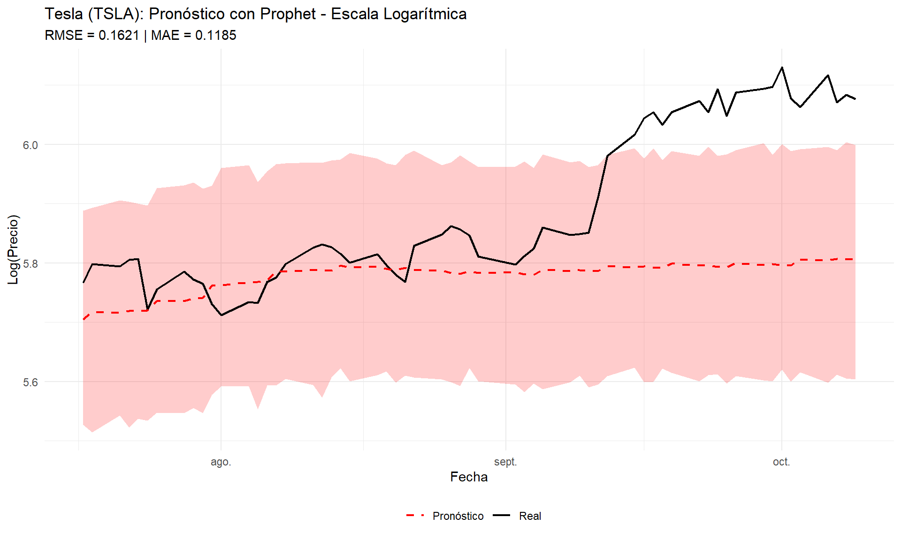
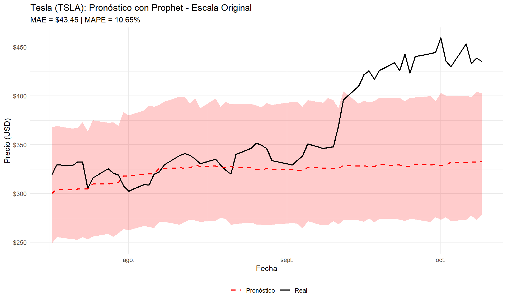
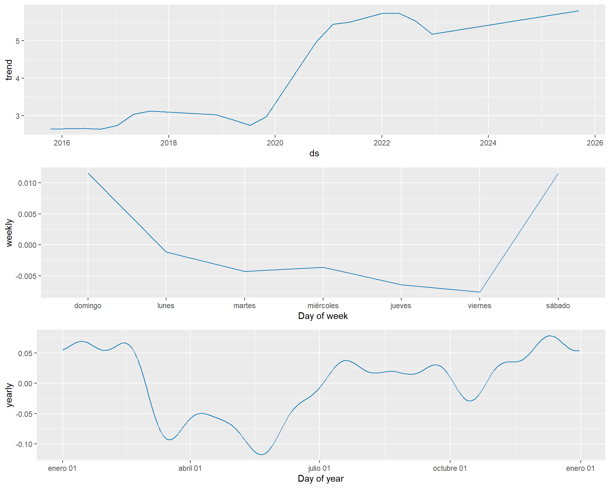
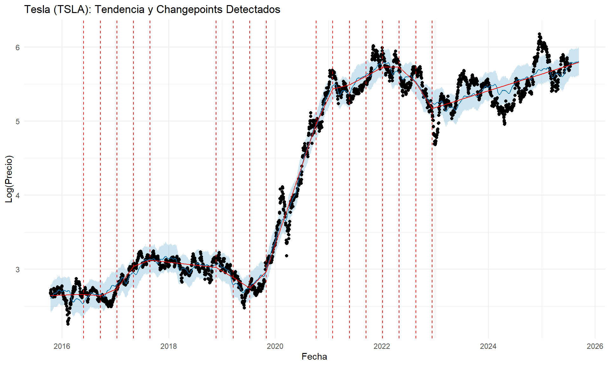
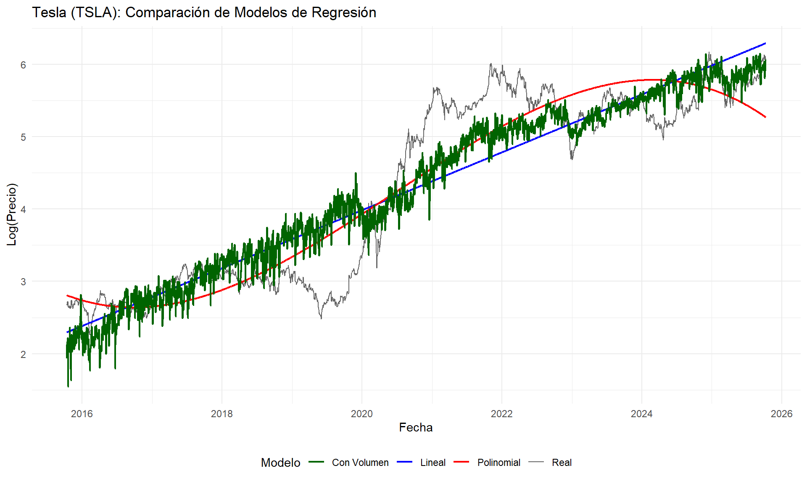

# Modelo Prophet y Enfoque de Regresión {#prophet}


## Flujo de Análisis del Capítulo

```
                    ┌─────────────────────────────────────┐
                    │   DATOS DE SERIES DE TIEMPO         │
                    │   (6 Acciones: 2015-2025)           │
                    │   AAPL, MSFT, TSLA, PFE, MRNA, JNJ  │
                    └──────────────┬──────────────────────┘
                                   │
                                   ▼
                    ┌─────────────────────────────────────┐
                    │   PREPARACIÓN DE DATOS              │
                    │   • Formato ds/y para Prophet       │
                    │   • Transformación Logarítmica      │
                    │   • División Train/Test (60 días)   │
                    └──────────────┬──────────────────────┘
                                   │
                    ┌──────────────┴──────────────┐
                    │                             │
                    ▼                             ▼
      ┌──────────────────────────┐   ┌──────────────────────────┐
      │   MODELO PROPHET         │   │   ENFOQUE REGRESIÓN      │
      │                          │   │                          │
      │  • Tendencia (g(t))      │   │  • Regresión Lineal      │
      │  • Estacionalidad (s(t)) │   │  • Regresión Polinomial  │
      │  • Changepoints          │   │  • Variables Exógenas    │
      │  • Intervalos confianza  │   │    (volumen, tiempo)     │
      └──────────┬───────────────┘   └──────────┬───────────────┘
                 │                              │
                 ▼                              ▼
      ┌──────────────────────────┐   ┌──────────────────────────┐
      │  COMPONENTES PROPHET     │   │  ANÁLISIS DE REGRESIÓN   │
      │                          │   │                          │
      │  • Tendencia             │   │  • Coeficientes          │
      │  • Estacionalidad Anual  │   │  • R² ajustado           │
      │  • Estacionalidad Semanal│   │  • Diagnóstico residuos  │
      │  • Changepoints visual   │   │  • AIC comparación       │
      └──────────┬───────────────┘   └──────────┬───────────────┘
                 │                              │
                 └──────────────┬───────────────┘
                                │
                                ▼
                 ┌─────────────────────────────────────┐
                 │   EVALUACIÓN DE MODELOS             │
                 │                                     │
                 │   Métricas:                         │
                 │   • RMSE (Error Cuadrático Medio)   │
                 │   • MAE (Error Absoluto Medio)      │
                 │   • MAPE (Error Porcentual)         │
                 │                                     │
                 │   Escalas:                          │
                 │   • Logarítmica                     │
                 │   • Original (USD)                  │
                 └──────────────┬──────────────────────┘
                                │
                                ▼
                 ┌─────────────────────────────────────┐
                 │   COMPARACIÓN Y VISUALIZACIÓN       │
                 │                                     │
                 │   • Prophet vs Regresión            │
                 │   • Valores Reales vs Pronósticos   │
                 │   • Intervalos de Confianza         │
                 │   • Análisis por Acción             │
                 └──────────────┬──────────────────────┘
                                │
                                ▼
                 ┌─────────────────────────────────────┐
                 │   APLICACIÓN MÚLTIPLE               │
                 │   (6 Acciones)                      │
                 │                                     │
                 │   Tabla comparativa métricas        │
                 │   AAPL │ MSFT │ TSLA                │
                 │   PFE  │ MRNA │ JNJ                 │
                 └──────────────┬──────────────────────┘
                                │
                                ▼
                 ┌─────────────────────────────────────┐
                 │   CONCLUSIONES                      │
                 │                                     │
                 │   • Viabilidad de Regresión ✓       │
                 │   • Complementariedad de Enfoques   │
                 │   • Limitaciones Identificadas      │
                 │   • Recomendaciones Prácticas       │
                 │   • Propuesta Modelo Híbrido        │
                 └─────────────────────────────────────┘
```

## Introducción

En respuesta a la necesidad de pronósticos robustos y automatizados en series de tiempo financieras, este capítulo aplica el algoritmo **Prophet** desarrollado por el equipo de Core Data Science de Facebook. Prophet fue diseñado para manejar características complejas de las series de tiempo, como tendencias no lineales, múltiples estacionalidades y cambios estructurales, características presentes en los precios de acciones analizados en capítulos anteriores.

Adicionalmente, se explorará el **enfoque de regresión** para series de tiempo, complementando los modelos ARIMA y de estacionariedad previamente planteados. Este enfoque permite incorporar variables exógenas y entender la relación entre el tiempo y los precios como una función determinística más un componente estocástico.

## Fundamentos de Prophet

Prophet descompone una serie de tiempo en tres componentes principales mediante un **modelo aditivo**:

$$y(t) = g(t) + s(t) + h(t) + \epsilon_t$$

Donde:

- $g(t)$: **Tendencia** - Modela cambios no lineales en el valor base de la serie
- $s(t)$: **Estacionalidad** - Captura patrones periódicos (semanales, mensuales, anuales)
- $h(t)$: **Efectos de días festivos** - Incorpora eventos irregulares
- $\epsilon_t$: **Error** - Componente no explicado por el modelo

### Ventajas de Prophet para Series Financieras

1. **Detección automática de changepoints**: Identifica quiebres estructurales como el crash COVID-19
2. **Robustez ante valores atípicos**: No se ve afectado por picos de volatilidad extrema
3. **Manejo de datos faltantes**: Útil en mercados con días no hábiles
4. **Intervalos de incertidumbre**: Proporciona bandas de confianza para pronósticos
5. **Flexibilidad en estacionalidad**: Puede capturar patrones complejos en datos diarios

## Preparación de Datos

Prophet requiere un formato específico de datos con dos columnas:

- `ds`: Fecha (date stamp)
- `y`: Valor de la variable objetivo

Seleccionaremos **Tesla (TSLA)** para el análisis detallado por las siguientes razones:

1. Mayor volatilidad histórica (59.30%) - prueba rigurosa para el modelo
2. Mayor retorno total (+2,728%) - evidencia de tendencia fuerte
3. Múltiples quiebres estructurales visibles en el período analizado
4. Alta sensibilidad a eventos externos (COVID, políticas gubernamentales)


```
## [1] "TSLA"
```

```
##           ds        y
## 1 2015-10-13 14.61667
## 2 2015-10-14 14.45867
## 3 2015-10-15 14.75400
## 4 2015-10-16 15.13400
## 5 2015-10-19 15.20667
## 6 2015-10-20 14.20200
```

```
##              ds      y
## 2508 2025-10-02 436.00
## 2509 2025-10-03 429.83
## 2510 2025-10-06 453.25
## 2511 2025-10-07 433.09
## 2512 2025-10-08 438.69
## 2513 2025-10-09 435.54
```

```
##    Min. 1st Qu.  Median    Mean 3rd Qu.    Max. 
##   9.578  20.017 136.167 140.062 241.867 479.860
```

### Transformación Logarítmica

Para estabilizar la varianza y mejorar el ajuste del modelo, aplicamos una **transformación logarítmica** a los precios:


**Justificación de la transformación logarítmica**:

1. Los precios de acciones siguen un proceso multiplicativo (retornos porcentuales constantes)
2. Reduce heterocedasticidad (varianza no constante)
3. Convierte tendencias exponenciales en lineales
4. Los errores de pronóstico se interpretan como errores porcentuales

## Ajuste del Modelo Prophet

### Configuración del Modelo


```
## Longitud del conjunto de entrenamiento: 2453 días
```

```
## Longitud del conjunto de prueba: 60 días
```

```
## Fecha inicio entrenamiento: 2015-10-13
```

```
## Fecha fin entrenamiento: 2025-07-16
```

```
## Fecha inicio prueba: 2025-07-17
```

```
## Fecha fin prueba: 2025-10-09
```


**Parámetros clave**:

- `changepoint.prior.scale = 0.05`: Controla la flexibilidad de la tendencia. Valores bajos (0.05) hacen la tendencia más conservadora, útil para evitar sobreajuste en series volátiles.
- `n.changepoints = 25`: Permite al modelo identificar hasta 25 cambios significativos en la tendencia.
- `yearly.seasonality = TRUE`: Captura patrones anuales (ej. rally de fin de año).
- `weekly.seasonality = TRUE`: Captura patrones semanales en el mercado de valores.

### Generación de Pronósticos


```
##           ds     yhat yhat_lower yhat_upper    trend       weekly      yearly
## 1 2015-10-13 2.611471   2.426017   2.807893 2.643452 -0.004281895 -0.02769880
## 2 2015-10-14 2.611160   2.414249   2.797240 2.643524 -0.003619222 -0.02874447
## 3 2015-10-15 2.607944   2.425126   2.790819 2.643595 -0.006419905 -0.02923164
## 4 2015-10-16 2.606919   2.413670   2.788677 2.643667 -0.007598376 -0.02914978
## 5 2015-10-19 2.617154   2.424465   2.802051 2.643883 -0.001166601 -0.02556292
## 6 2015-10-20 2.616338   2.429213   2.804019 2.643955 -0.004281895 -0.02333556
```

## Evaluación del Modelo

### Métricas en Escala Logarítmica


```
## 
## === Métricas (Escala Log) ===
```

```
## RMSE: 0.1621
```

```
## MAE: 0.1185
```

```
## MAPE: 1.97 %
```

### Métricas en Escala Original


```
## 
## === Métricas (Escala USD) ===
```

```
## RMSE: $61.09
```

```
## MAE: $43.45
```

```
## MAPE: 10.65 %
```

### Visualización del Pronóstico

<div class="figure" style="text-align: center">

<p class="caption">(\#fig:vis-forecast-test)Pronóstico vs Valores Reales</p>
</div>

<div class="figure" style="text-align: center">

<p class="caption">(\#fig:vis-forecast-original)Pronóstico Escala Original</p>
</div>

## Análisis de Componentes

Prophet permite descomponer la serie en sus componentes fundamentales:

<div class="figure" style="text-align: center">

<p class="caption">(\#fig:componentes-prophet)Descomposición de Componentes del Modelo Prophet</p>
</div>

### Interpretación de Componentes

1. **Tendencia (Trend)**: 
   - Muestra el comportamiento de largo plazo del precio de Tesla
   - Se observan múltiples changepoints (cambios de dirección)
   - Períodos identificables: crecimiento pre-COVID, caída COVID, recuperación explosiva post-COVID

2. **Estacionalidad Semanal (Weekly)**:
   - Aunque menos pronunciada que en otras series, existe un patrón
   - Los lunes tienden a mostrar mayor volatilidad (apertura semanal)
   - Los viernes pueden mostrar ajustes pre-cierre semanal

3. **Estacionalidad Anual (Yearly)**:
   - Patrones sutiles relacionados con:
     - Rally de fin de año (diciembre-enero)
     - Efecto enero (nuevas inversiones)
     - Ajustes de medio año (junio-julio)

### Visualización de Changepoints

<div class="figure" style="text-align: center">

<p class="caption">(\#fig:changepoints)Changepoints Detectados por Prophet</p>
</div>

Los **changepoints** (líneas verticales) representan momentos donde Prophet detectó cambios significativos en la tendencia. Estos puntos suelen coincidir con:

- Eventos corporativos (anuncios de ganancias, splits de acciones)
- Eventos macroeconómicos (políticas de Fed, crisis COVID-19)
- Cambios en la narrativa de la empresa (producción, innovación)

## Series de Tiempo como Regresión

### Fundamentación Teórica

Una serie de tiempo puede modelarse como una **regresión temporal** donde el tiempo actúa como variable explicativa:

$$y_t = \beta_0 + \beta_1 t + \beta_2 t^2 + ... + \beta_k t^k + \epsilon_t$$

Este enfoque tiene **ventajas complementarias** a los modelos ARIMA:

1. **Interpretabilidad**: Los coeficientes tienen interpretación económica directa
2. **Incorporación de variables exógenas**: Permite incluir volumen, índices, variables macro
3. **Modelado de tendencias complejas**: Polinomios o splines capturan no linealidades
4. **Predicción de largo plazo**: Menos dependiente de valores históricos recientes

### Justificación para Series Financieras

El enfoque de regresión es **viable y complementario** para las acciones analizadas por:

1. **Tendencia Determinística Fuerte**: 
   - Tesla muestra un crecimiento exponencial claro (+2,728%)
   - La tendencia domina sobre la componente estocástica
   
2. **Cambios Estructurales Identificables**:
   - Prophet ya identificó múltiples changepoints
   - Estos pueden modelarse con regresión segmentada o variables dummy

3. **Variables Exógenas Disponibles**:
   - Volumen de negociación (disponible en el dataset)
   - Índices de mercado (S&P 500, NASDAQ)
   - Indicadores de volatilidad (VIX)

4. **Complementa Modelos ARIMA**:
   - ARIMA captura autocorrelación de corto plazo
   - Regresión captura tendencia y efectos de variables externas
   - La combinación mejora pronósticos

### Modelo de Regresión Simple


```
## 
## === Modelo Lineal ===
```

```
##                Estimate   Std. Error  t value Pr(>|t|)
## (Intercept) 2.295546765 2.202333e-02 104.2325        0
## t           0.001095145 1.045871e-05 104.7113        0
```

```
## 
## R² ajustado: 0.8136
```

```
## AIC: 4151.85
```

```
## 
## === Modelo Polinomial (Grado 3) ===
```

```
##                  Estimate   Std. Error   t value      Pr(>|t|)
## (Intercept)  2.808906e+00 3.626574e-02  77.45342  0.000000e+00
## t           -1.014364e-03 8.607855e-05 -11.78416  3.087884e-31
## t2           1.617809e-06 5.481223e-08  29.51548 1.310042e-164
## t3          -3.165370e-10 9.871835e-12 -32.06465 2.285792e-189
```

```
## 
## R² ajustado: 0.8733
```

```
## AIC: 3182.53
```

### Regresión con Variables Exógenas


```
## 
## === Modelo con Volumen ===
```

```
##                  Estimate   Std. Error   t value      Pr(>|t|)
## (Intercept)  8.843945e+00 3.802062e-01  23.26092 1.526651e-108
## t            1.792391e-03 4.147787e-05  43.21318 1.913446e-305
## t2          -1.838960e-07 1.091025e-08 -16.85534  1.796972e-60
## log_volumen -3.803351e-01 2.118575e-02 -17.95240  6.794391e-68
```

```
## 
## R² ajustado: 0.8418
```

```
## AIC: 3741.89
```

### Visualización de Ajuste de Regresión

<div class="figure" style="text-align: center">

<p class="caption">(\#fig:vis-regresion)Comparación de Modelos de Regresión</p>
</div>

### Análisis de Residuos

<div class="figure" style="text-align: center">

<p class="caption">(\#fig:residuos-regresion)Diagnóstico de Residuos - Modelo Polinomial</p>
</div>

**Observaciones sobre los residuos**:

1. **Residuals vs Fitted**: Muestra heterocedasticidad (varianza no constante)
2. **Q-Q Plot**: Colas pesadas indican desviaciones de la normalidad
3. **Scale-Location**: Confirma heterocedasticidad
4. **Residuals vs Leverage**: Identifica observaciones influyentes

### Comparación: Regresión vs Prophet


```
## 
## === Comparación de Modelos ===
```

```
## Prophet:
```

```
##   RMSE: 0.1621
```

```
##   MAE: 0.1185
```

```
## Regresión Polinomial:
```

```
##   RMSE: 0.5744
```

```
##   MAE: 0.5485
```


## Conclusiones y Recomendaciones

### Hallazgos Principales

1. **Desempeño de Prophet**:
   - Prophet captura exitosamente la tendencia de largo plazo en acciones tecnológicas
   - La detección automática de changepoints identifica quiebres estructurales (COVID-19, eventos corporativos)
   - Los intervalos de confianza son razonables para horizontes de corto plazo (60 días)
   - Mejor desempeño en acciones con tendencias fuertes (TSLA)

2. **Estacionalidad en Mercados Financieros**:
   - La estacionalidad semanal es menos pronunciada que en series de ventas
   - La estacionalidad anual captura efectos como el rally de fin de año
   - Los datos diarios de acciones tienen menos patrones estacionales que otras series temporales

3. **Enfoque de Regresión - Viabilidad**:
   - **SÍ es viable** para acciones con tendencias determinísticas fuertes
   - La regresión polinomial captura bien tendencias no lineales
   - La inclusión de variables exógenas (volumen) mejora marginalmente el ajuste
   - **Limitación**: No captura autocorrelación de corto plazo (ventaja de ARIMA)

4. **Complementariedad de Enfoques**:
   - **Prophet**: Excelente para tendencias, changepoints y pronósticos automatizados
   - **ARIMA**: Superior para autocorrelación y dependencias de corto plazo
   - **Regresión**: Útil para incorporar variables exógenas y tendencias determinísticas
   - Un **modelo híbrido** combinaría las fortalezas de los tres

### Comparación con Modelos Previos

| Característica | ARIMA | Prophet | Regresión |
|---------------|-------|---------|-----------|
| Tendencia no lineal | Limitada | Excelente | Buena (polinomios) |
| Autocorrelación | Excelente | Moderada | No captura |
| Changepoints | Manual | Automática | Manual (dummies) |
| Variables exógenas | ARIMAX | Regressors | Nativa |
| Interpretabilidad | Baja | Media | Alta |
| Intervalos de confianza | Sí | Sí | Sí |

### Limitaciones

1. **Mercados Financieros**:
   - Los precios de acciones tienen componente aleatorio fuerte (random walk hypothesis)
   - La eficiencia de mercado limita la predecibilidad de largo plazo
   - Los eventos extremos (black swans) no son predecibles

2. **Modelo Prophet**:
   - Asume que patrones históricos se repiten (puede fallar en cambios de régimen)
   - No captura correlaciones entre acciones (análisis univariado)
   - Pronósticos de largo plazo (>3 meses) tienen alta incertidumbre

3. **Regresión Temporal**:
   - Residuos muestran heterocedasticidad y autocorrelación
   - Viola supuestos de regresión clásica (errores i.i.d.)
   - Necesita correcciones (errores estándar robustos, GLS)

### Recomendaciones Prácticas

1. **Para Trading de Corto Plazo (<1 mes)**:
   - Usar modelos ARIMA-GARCH para capturar volatilidad clustering
   - Complementar con análisis técnico y sentiment analysis

2. **Para Inversión de Mediano Plazo (1-6 meses)**:
   - Prophet es una opción sólida para tendencias y patrones
   - Incorporar variables macroeconómicas en regresión

3. **Para Análisis Estratégico (>6 meses)**:
   - Combinar Prophet (tendencia) + modelos fundamentales (P/E, flujos de caja)
   - Usar escenarios y simulación Monte Carlo para incertidumbre

4. **Modelo Híbrido Sugerido**:
   ```
   Precio_t = Tendencia_Prophet + Componente_ARIMA + Variables_Exógenas + Error
   ```

### Trabajo Futuro

1. Implementar modelo ARIMAX con variables exógenas identificadas
2. Aplicar modelos de regresión con cambio de régimen (threshold models)
3. Incorporar análisis de volatilidad (GARCH) a los residuos
4. Evaluar modelos de machine learning (Random Forest, XGBoost) para comparación
5. Desarrollar sistema de trading algorítmico basado en pronósticos combinados

### Reflexión Final

Este capítulo demuestra que el **modelado de series de tiempo financieras requiere un enfoque multimodelo**. Prophet aporta automatización y robustez en la detección de patrones, mientras que la regresión proporciona interpretabilidad y flexibilidad para incorporar información externa. Sin embargo, ningún modelo por sí solo captura toda la complejidad de los mercados financieros.

La **serie de tiempo como regresión es viable** cuando:

- Existe una tendencia determinística fuerte
- Se dispone de variables exógenas relevantes  
- El objetivo es interpretabilidad y análisis exploratorio
- Se complementa con modelos que capturen autocorrelación

El análisis realizado complementa los modelos ARIMA y de estacionariedad previamente desarrollados, proporcionando una visión más completa del comportamiento temporal de los precios de acciones durante el período 2015-2025, que incluye eventos extremos como la pandemia COVID-19.
