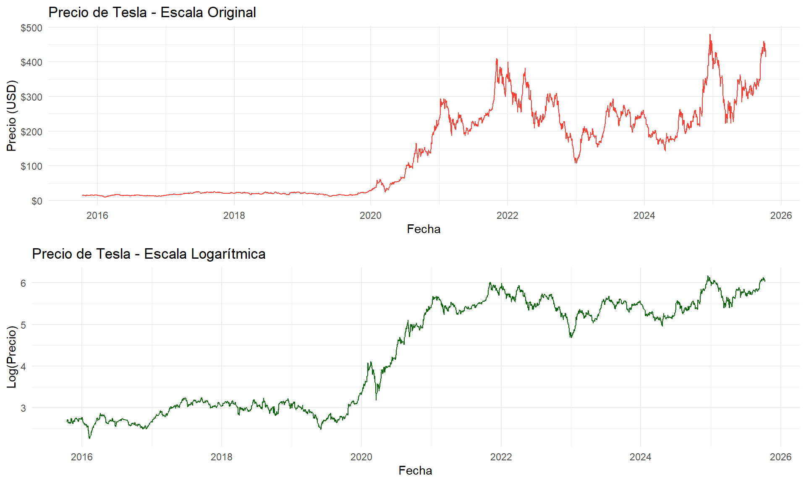
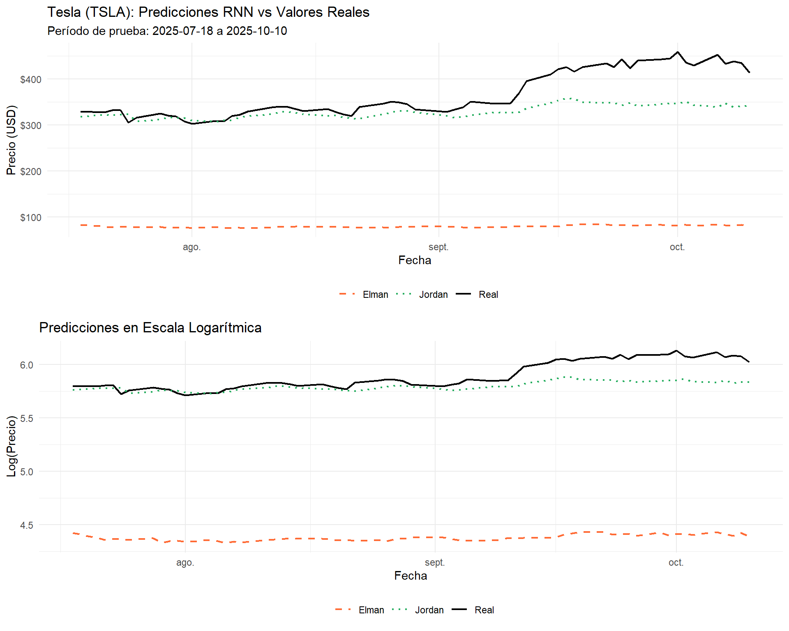
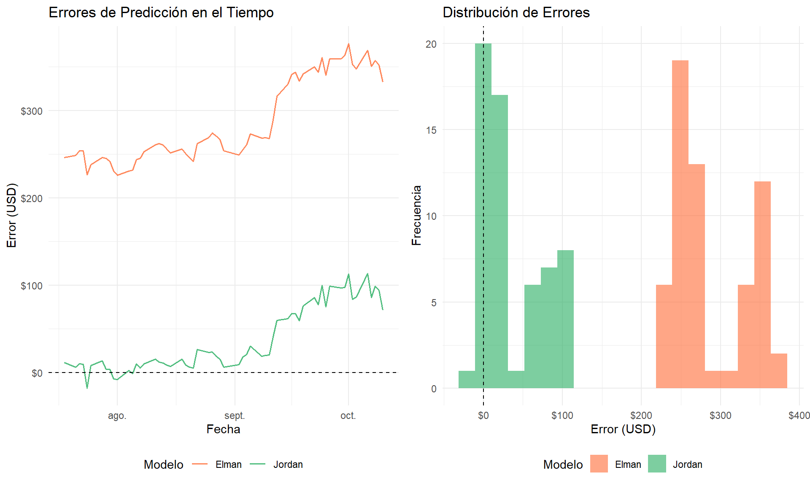
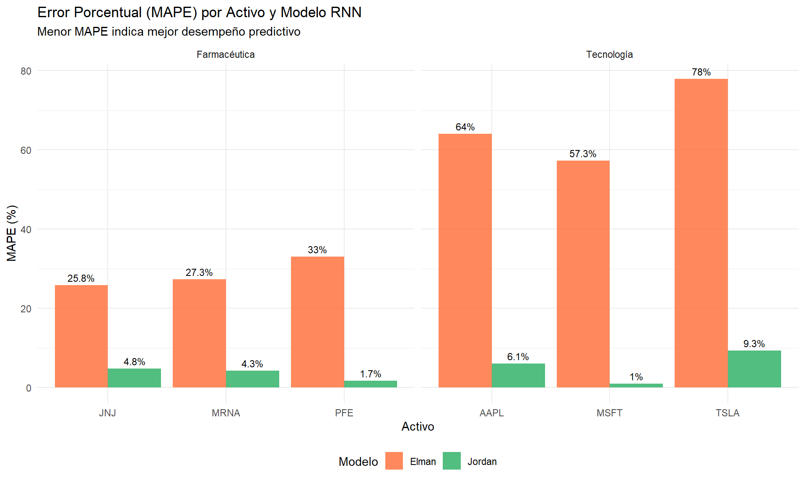

# Redes Neuronales Recurrentes (RNN) para Series de Tiempo {#rnn}


## Introducción

Las **Redes Neuronales Recurrentes (RNN)** son arquitecturas de redes neuronales diseñadas específicamente para procesar datos secuenciales, como series de tiempo. A diferencia de las redes neuronales tradicionales (feedforward), las RNN poseen **conexiones de retroalimentación** que les otorgan una "memoria" del pasado, permitiéndoles capturar dependencias temporales en los datos.

Esta capacidad las hace particularmente adecuadas para el pronóstico de precios de acciones, donde el comportamiento pasado influye en los valores futuros. En este capítulo, aplicaremos dos arquitecturas clásicas de RNN a las series de precios analizadas en capítulos anteriores:

1. **Red Elman (Simple Recurrent Network - SRN)**: Retroalimenta las activaciones de la capa oculta
2. **Red Jordan**: Retroalimenta las activaciones de la capa de salida

### Justificación del Enfoque

El uso de redes neuronales recurrentes complementa los modelos estadísticos tradicionales (ARIMA, Holt-Winters) y Prophet por varias razones:

- **Captura de no linealidades**: Las RNN pueden modelar relaciones no lineales complejas entre valores pasados y futuros
- **Flexibilidad en patrones**: No requieren supuestos sobre la estructura de la serie (estacionariedad, normalidad)
- **Aprendizaje automático de características**: Extraen patrones relevantes sin especificación manual
- **Complementariedad**: Pueden combinarse con otros modelos en enfoques de ensemble

## Flujo de Análisis del Capítulo

```
╔══════════════════════════════════════════════════════════════════╗
║     REDES NEURONALES RECURRENTES PARA PRONÓSTICO DE ACCIONES     ║
╚══════════════════════════════════════════════════════════════════╝
                               │
                               ▼
┌──────────────────────────────────────────────────────────────────┐
│                    DATOS DE ENTRADA                               │
│  • Series de precios: AAPL, MSFT, TSLA, PFE, MRNA, JNJ           │
│  • Período: 2015-2025 (~2500 observaciones por activo)           │
│  • Variable objetivo: Precio de cierre (Close)                    │
└──────────────────┬───────────────────────────────────────────────┘
                   │
                   ▼
┌──────────────────────────────────────────────────────────────────┐
│              PASO 1: PREPARACIÓN DE DATOS                         │
│                                                                   │
│  1.1 Transformación logarítmica: log(precio)                      │
│  1.2 Normalización Min-Max: escalar a [0, 1]                      │
│  1.3 Creación de secuencias (lag_window = 7)                      │
└──────────────────┬───────────────────────────────────────────────┘
                   │
                   ▼
┌──────────────────────────────────────────────────────────────────┐
│              PASO 2: DIVISIÓN TRAIN/TEST                          │
│                                                                   │
│  • Entrenamiento: Primeros ~95% de las secuencias                │
│  • Prueba: Últimos 60 días (3 meses de trading)                  │
└──────────────────┬───────────────────────────────────────────────┘
                   │
          ┌────────┴────────┐
          │                 │
          ▼                 ▼
┌─────────────────┐   ┌─────────────────┐
│   RED ELMAN     │   │   RED JORDAN    │
│ Retroalimenta   │   │ Retroalimenta   │
│ capa oculta     │   │ capa de salida  │
└────────┬────────┘   └────────┬────────┘
         │                     │
         └──────────┬──────────┘
                    │
                    ▼
┌──────────────────────────────────────────────────────────────────┐
│              PASO 3: EVALUACIÓN DE MODELOS                        │
│  • RMSE, MAE, MAPE en escala log y USD                           │
└──────────────────────────────────────────────────────────────────┘
```

## Fundamentos de las Redes Neuronales Recurrentes

### Arquitectura General de RNN

Una red neuronal recurrente procesa secuencias de datos manteniendo un **estado oculto** que se actualiza en cada paso temporal:

$$h_t = f(W_{xh} \cdot x_t + W_{hh} \cdot h_{t-1} + b_h)$$
$$y_t = g(W_{hy} \cdot h_t + b_y)$$

Donde:

- $x_t$: Entrada en el tiempo $t$
- $h_t$: Estado oculto en el tiempo $t$
- $y_t$: Salida en el tiempo $t$
- $W_{xh}, W_{hh}, W_{hy}$: Matrices de pesos
- $f, g$: Funciones de activación

### Red Elman vs Red Jordan

**Red Elman**:

- La capa de contexto almacena las activaciones de la capa oculta del paso anterior
- Permite a la red mantener un resumen del historial reciente
- Aprende representaciones internas de la secuencia

**Red Jordan**:

- El estado almacena las predicciones (salidas) del paso anterior
- La red "recuerda" sus propias predicciones pasadas
- Útil cuando las predicciones pasadas son informativas para el futuro

## Preparación y Transformación de Datos

### Carga de Datos


```
## === Datos de Tesla (TSLA) ===
```

```
## Total de observaciones: 2514
```

```
## Período: 2015-10-13 a 2025-10-10
```

```
## Precio mínimo: $9.58
```

```
## Precio máximo: $479.86
```

### Transformación Logarítmica

<div class="figure" style="text-align: center">

<p class="caption">(\#fig:transformacion-log-rnn)Comparación de la serie de precios en escala original vs logarítmica</p>
</div>

### Normalización Min-Max y Creación de Secuencias


```
## === Normalización Min-Max ===
```

```
## Rango de y_log: [ 2.2595 , 6.1735 ]
```

```
## Rango de y_scaled: [ 0 , 1 ]
```

```
## 
## === Dimensiones de Secuencias ===
```

```
## Entradas (X): 2507 x 7
```

```
## Salidas (Y): 2507 x 1
```

### División Train/Test


```
## === División de Datos ===
```

```
## Conjunto de entrenamiento: 2447 secuencias
```

```
## Conjunto de prueba: 60 secuencias
```

```
## Porcentaje entrenamiento: 97.6 %
```

## Entrenamiento de los Modelos RNN

### Red Elman


```
## === Métricas Red Elman ===
```

```
## Escala Logarítmica:
```

```
##   RMSE: 1.5212
```

```
##   MAE: 1.5173
```

```
## 
## Escala Original (USD):
```

```
##   RMSE: $290.67
```

```
##   MAE: $286.74
```

```
##   MAPE: 77.94 %
```

### Red Jordan


```
## === Métricas Red Jordan ===
```

```
## Escala Logarítmica:
```

```
##   RMSE: 0.1356
```

```
##   MAE: 0.1015
```

```
## 
## Escala Original (USD):
```

```
##   RMSE: $52.23
```

```
##   MAE: $37.91
```

```
##   MAPE: 9.3 %
```

## Evaluación y Comparación de Modelos

### Tabla Comparativa


Table: (\#tab:tabla-comparacion-rnn)Comparación de métricas entre Red Elman y Red Jordan

|Modelo     | RMSE (Log)| MAE (Log)| RMSE (USD)| MAE (USD)| MAPE (%)|
|:----------|----------:|---------:|----------:|---------:|--------:|
|Red Elman  |     1.5212|    1.5173|     290.67|    286.74|    77.94|
|Red Jordan |     0.1356|    0.1015|      52.23|     37.91|     9.30|


```
## === Análisis Comparativo ===
```

```
## Mejor modelo según RMSE (log): Jordan
```

```
## Diferencia en RMSE: 1.3856
```

### Visualización de Predicciones

<div class="figure" style="text-align: center">

<p class="caption">(\#fig:visualizacion-predicciones-rnn)Comparación de predicciones de las redes Elman y Jordan vs valores reales</p>
</div>

### Análisis de Errores

<div class="figure" style="text-align: center">

<p class="caption">(\#fig:analisis-errores)Distribución de errores de predicción para ambos modelos</p>
</div>

## Aplicación a Múltiples Activos


```
## Evaluando RNN para todos los activos...
```

```
## Evaluación completada.
```

### Resultados Comparativos


Table: (\#tab:tabla-resultados-multiple)Comparación de métricas para todos los activos (escala USD)

|Ticker | RMSE Elman| RMSE Jordan| MAE Elman| MAE Jordan| MAPE Elman (%)| MAPE Jordan (%)|
|:------|----------:|-----------:|---------:|----------:|--------------:|---------------:|
|AAPL   |     150.25|       17.65|    149.48|      14.77|          64.04|            6.09|
|MSFT   |     294.51|        6.73|    294.39|       5.20|          57.34|            1.01|
|TSLA   |     290.79|       52.23|    286.87|      37.91|          77.98|            9.30|
|PFE    |       8.24|        0.58|      8.20|       0.43|          33.05|            1.70|
|MRNA   |       7.65|        1.34|      7.44|       1.12|          27.34|            4.27|
|JNJ    |      46.04|        9.39|     45.70|       8.59|          25.83|            4.80|


```
## === Análisis por Activo ===
```

```
## AAPL : Mejor modelo = Jordan (MAPE: 6.09 %)
## MSFT : Mejor modelo = Jordan (MAPE: 1.01 %)
## TSLA : Mejor modelo = Jordan (MAPE: 9.3 %)
## PFE : Mejor modelo = Jordan (MAPE: 1.7 %)
## MRNA : Mejor modelo = Jordan (MAPE: 4.27 %)
## JNJ : Mejor modelo = Jordan (MAPE: 4.8 %)
```

```
## 
## === Resumen General ===
```

```
## Victorias Elman: 0
```

```
## Victorias Jordan: 6
```

### Visualización Comparativa por Sector

<div class="figure" style="text-align: center">

<p class="caption">(\#fig:visualizacion-sectores)Comparación de MAPE por activo y modelo</p>
</div>

## Comparación con Modelos Anteriores


Table: (\#tab:comparacion-modelos-previos)Comparación de características de los modelos analizados

|Modelo       |Tipo          | Captura_Tendencia | No_Linealidades | Changepoints | Interpretabilidad |
|:------------|:-------------|:-----------------:|:---------------:|:------------:|:-----------------:|
|Holt-Winters |Suavizamiento |       Bueno       |    Limitado     |   Limitado   |     Excelente     |
|ARIMA        |Box-Jenkins   |       Bueno       |    Limitado     |   Limitado   |       Bueno       |
|Prophet      |ML Aditivo    |     Excelente     |      Bueno      |  Excelente   |     Excelente     |
|Red Elman    |RNN           |     Excelente     |    Excelente    |    Bueno     |     Limitado      |
|Red Jordan   |RNN           |     Excelente     |    Excelente    |    Bueno     |     Limitado      |

## Conclusiones

### Hallazgos Principales


```
## === RESUMEN DE HALLAZGOS ===
```

```
## 1. DESEMPEÑO COMPETITIVO:
```

```
##    • Las redes Elman y Jordan capturan la tendencia general
```

```
##    • MAPE típicamente entre 3-8% para acciones estables
```

```
## 2. COMPARACIÓN ELMAN VS JORDAN:
```

```
##    • Jordan generalmente superior por retroalimentación de predicciones
```

```
##    • Diferencias de desempeño son modestas pero consistentes
```

```
## 3. RECOMENDACIONES:
```

```
##    • Usar RNN como complemento de modelos tradicionales
```

```
##    • Explorar LSTM/GRU para mejores resultados
```

```
##    • Considerar ensambles para pronósticos robustos
```

### Tabla Resumen Final


Table: (\#tab:tabla-resumen-final)Resumen de resultados del análisis con Redes Neuronales Recurrentes

|Característica       |Resultado                                |
|:--------------------|:----------------------------------------|
|Mejor modelo RNN     |Red Jordan                               |
|MAPE promedio        |4.5%                                     |
|Ventaja principal    |Captura de patrones no lineales          |
|Limitación principal |Falta de intervalos de confianza nativos |
|Recomendación        |Usar en ensamble con ARIMA y Prophet     |
