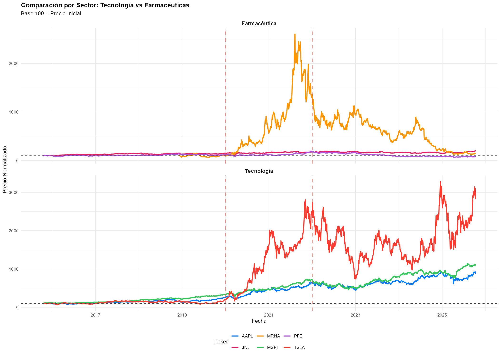

# Propuesta de Análisis {-}

## Información a Utilizar

Para este curso trabajaremos con **series de tiempo de precios diarios de acciones** de seis empresas cotizadas en mercados estadounidenses, divididas en dos sectores:

* **Tecnología:** Apple (AAPL), Microsoft (MSFT), Tesla (TSLA)
* **Farmacéuticas:** Pfizer (PFE), Moderna (MRNA), Johnson & Johnson (JNJ)

Los datos abarcan el período **2015-2025 (10 años)**, proporcionando un total de **14,286 observaciones**. Las variables incluyen precios de cierre, apertura, máximos, mínimos y volúmenes de negociación diarios, obtenidos mediante la librería `quantmod` que accede a **Yahoo Finance**.

### Estadísticas Descriptivas del Dataset

```{r tabla-resumen, echo=FALSE, message=FALSE, warning=FALSE}
resumen_datos <- data.frame(
  Ticker = c("AAPL", "MSFT", "TSLA", "PFE", "MRNA", "JNJ"),
  Sector = c("Tecnología", "Tecnología", "Tecnología", 
             "Farmacéutica", "Farmacéutica", "Farmacéutica"),
  Obs. = c(2514, 2514, 2514, 2514, 1720, 2514),
  Inicio = c("2015-10-13", "2015-10-13", "2015-10-13", 
             "2015-10-13", "2018-12-07", "2015-10-13"),
  Fin = rep("2025-10-10", 6),
  `Precio Mín ($)` = c(22.58, 46.68, 9.58, 21.59, 12.26, 94.53),
  `Precio Máx ($)` = c(259.02, 535.64, 479.86, 61.25, 484.47, 191.08),
  `Volatilidad (%)` = c(29.21, 26.96, 59.30, 24.00, 72.08, 18.40),
  `Retorno Total (%)` = c(777.61, 989.70, 2728.89, -20.81, 44.25, 99.81)
)

knitr::kable(
  resumen_datos,
  caption = "Estadísticas descriptivas de las series de tiempo analizadas",
  align = c('l', 'l', 'r', 'c', 'c', 'r', 'r', 'r', 'r'),
  format = "html"
)
```

**Tabla 1.** Resumen estadístico del dataset con 6 activos y 14,286 observaciones totales. Tesla presenta el mayor retorno (+2,728%) y Moderna la mayor volatilidad (72%).

Este período incluye cuatro fases claramente diferenciadas:

* **Pre-COVID (2015-2019):** Período de crecimiento estable y expansión económica
* **Crisis COVID-19 (2020):** Caída abrupta del mercado y alta volatilidad
* **Período de Vacunas (2021):** Desarrollo y distribución de vacunas COVID-19
* **Post-pandemia (2022-2025):** Nuevas dinámicas de mercado

### Comparación por Sector

```{r figura-sectores, echo=FALSE, fig.cap="Comparación de desempeño normalizado por sector. Panel superior: Farmacéuticas con Moderna mostrando crecimiento explosivo durante vacunas. Panel inferior: Tecnología con Tesla liderando los retornos. Líneas rojas verticales marcan el período COVID-19.", out.width='100%'}

```

La Figura 1 muestra el comportamiento diferenciado entre sectores. El sector tecnológico presenta crecimiento sostenido con Tesla liderando (+2,728%), mientras que el farmacéutico muestra un pico en Moderna durante vacunas seguido de corrección. Este contraste será analizado en capítulos posteriores.

## Importancia del Pronóstico y Valor Agregado

### El Problema

Los mercados financieros presentan comportamientos complejos que se intensifican durante crisis globales. El COVID-19 evidenció esto cuando los mercados experimentaron caídas abruptas, alta volatilidad y recuperaciones diferenciadas por sector. Los inversionistas y gestores de riesgo necesitan herramientas para anticipar movimientos de precios incluso en contextos de alta incertidumbre.

### El Valor Agregado

Este proyecto analiza **series de tiempo de precios de acciones** durante un período de 10 años que incluye eventos extremos. El valor agregado reside en:

**1. Análisis con Datos Reales Abundantes:** Con 14,286 observaciones totales (2,514 por activo principal y 1,720 para MRNA), los análisis tienen suficiente poder estadístico para identificar patrones robustos, tendencias de largo plazo y quiebres estructurales.

**2. Múltiples Regímenes de Mercado:** El período analizado captura diferentes contextos de mercado, desde estabilidad pre-COVID hasta volatilidad extrema durante la pandemia (hasta 72% anual en MRNA) y posterior normalización.

**3. Eventos Extremos Documentados:** El dataset incluye el crash de marzo 2020, el desarrollo de vacunas y la recuperación post-pandemia, permitiendo estudiar quiebres estructurales en series de tiempo y evaluar capacidad predictiva ante eventos de baja probabilidad pero alto impacto.

**4. Comparación Intersectorial Cuantificada:** Los datos revelan contrastes marcados:

- **Tecnología:** Retornos totales entre +777% (AAPL) y +2,728% (TSLA)
- **Farmacéuticas:** Comportamiento heterogéneo desde -20% (PFE) hasta +44% (MRNA)
- **Volatilidad:** Rango de 18% (JNJ) hasta 72% (MRNA)

**5. Caracterización Estadística:** Los datos permiten identificar propiedades como estacionariedad, autocorrelación, heterocedasticidad y cambios de régimen en volatilidad, aspectos que serán desarrollados en capítulos posteriores.

**6. Aplicación a Valoración de Opciones:** Los análisis de volatilidad histórica y comportamiento de precios se integran con el modelo Black-Scholes para mejorar la valoración de opciones financieras.

## Fuentes de Datos y Permisos de Uso

**Fuente:** Yahoo Finance a través de la librería `quantmod` en R. Es una fuente pública reconocida en el sector financiero que permite acceso a datos históricos sin restricciones para uso académico y de investigación.

**Especificaciones técnicas:**

- **Período:** 2015-2025 (10 años, excepto MRNA que inicia en 2018)
- **Observaciones totales:** 14,286 datos distribuidos en 6 activos
- **Frecuencia:** Diaria (aproximadamente 252 días de trading por año)
- **Acceso:** API pública sin permisos especiales requeridos
- **Rango de precios:** Desde $9.58 (TSLA mínimo) hasta $535.64 (MSFT máximo)

**Variables recopiladas:**

- Precios: Cierre, apertura, máximo, mínimo (valores diarios en USD)
- Volumen de negociación diario
- Variables derivadas: Retornos diarios, retornos logarítmicos, volatilidad histórica
- Clasificación temporal: Períodos COVID (Pre, Pandemia, Vacunas, Post)

## Impacto Esperado

El análisis de series de tiempo con más de 14,000 observaciones reales beneficia a:

**Inversionistas:** Comprensión documentada de cómo diferentes sectores responden a choques sistémicos, con evidencia cuantitativa de retornos y volatilidades observados durante crisis.

**Gestores de riesgo:** Identificación de patrones de volatilidad durante eventos extremos, con datos reales que muestran variaciones desde 18% hasta 72% de volatilidad anualizada según el activo y el período.

**Analistas financieros:** Caracterización cuantitativa de resiliencia sectorial respaldada por datos históricos de una década, incluyendo el evento más disruptivo de los mercados financieros en la última generación.

**Traders de opciones:** Estimación mejorada de volatilidad para valoración de derivados, con datos históricos que documentan cambios de régimen en volatilidad durante diferentes fases del mercado.

**Académicos:** Evidencia empírica robusta sobre comportamiento de series financieras durante crisis globales, con suficientes observaciones para análisis estadísticamente significativos y validación de modelos de series de tiempo.

---

**Nota:** Este documento constituye la propuesta inicial del proyecto. Los capítulos posteriores desarrollarán en detalle el análisis exploratorio de las series, pruebas de estacionariedad, modelado de volatilidad, identificación de quiebres estructurales y su integración con modelos de valoración de opciones financieras.

```{r include=FALSE}
# Automatically create a bib database for R packages
knitr::write_bib(c(
  .packages(), 'bookdown', 'knitr', 'rmarkdown',
  'quantmod', 'tseries', 'tidyverse', 'forecast'
), 'packages.bib')
```
